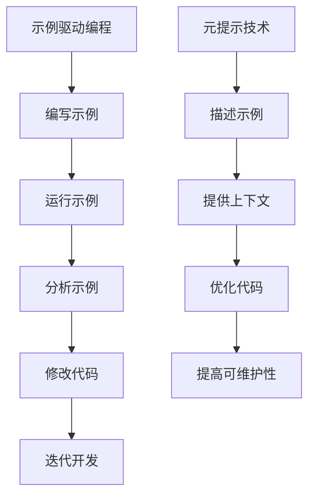

                 


## 文章标题

### 《示例驱动与元提示的结合应用》

关键词：示例驱动，元提示，编程，软件开发，人工智能

摘要：本文旨在探讨示例驱动和元提示的结合应用，通过深入分析其核心概念、原理及其在实际项目中的应用，帮助读者了解如何将这两种技术有机结合，提高软件开发效率和代码质量。

## 目录大纲

1. 引言
2. 示例驱动编程基础
3. 元提示技术基础
4. 示例驱动的元提示结合应用
5. 项目实战
6. 案例分析
7. 未来展望与挑战

## 引言

### 背景介绍

随着信息技术的快速发展，编程和软件开发已经成为现代社会不可或缺的一部分。在这个快速变化的时代，如何提高软件开发效率、降低成本、提升代码质量成为每个开发者和团队关注的焦点。在这个过程中，示例驱动编程和元提示技术逐渐受到重视。

示例驱动编程（Example-Driven Development，EED）是一种以示例为核心的软件开发方法，它强调通过编写和运行示例来引导开发过程。这种方法可以帮助开发者更好地理解需求，降低需求变更的风险，提高代码的复用性和可维护性。

元提示（Metadata）技术则是关于数据的数据，它为数据提供了额外的上下文信息。在软件开发中，元提示可以用于描述数据的结构、类型、约束等，从而帮助开发者更好地理解和操作数据。

### 核心概念与联系

为了更好地理解示例驱动和元提示的结合应用，我们需要明确这两个概念之间的联系。

示例驱动编程强调通过示例来理解和实现需求，而元提示技术则提供了关于示例的额外信息。具体来说，示例驱动编程可以帮助开发者编写更准确的代码，而元提示技术则可以帮助开发者更好地理解和操作这些代码。

以下是一个简单的 Mermaid 流程图，展示了示例驱动编程和元提示技术之间的关系：



### 目标读者

本文主要面向具有编程基础的软件开发者和团队，特别是对示例驱动编程和元提示技术感兴趣的读者。通过本文的阅读，读者可以深入了解这两种技术的原理及其在实际项目中的应用，从而提高自己的软件开发能力和效率。

### 文章结构

本文分为七个章节，分别从引论、示例驱动编程基础、元提示技术基础、示例驱动的元提示结合应用、项目实战、案例分析和未来展望与挑战等方面进行探讨。每个章节都旨在帮助读者逐步了解示例驱动和元提示技术的核心概念、原理及其在实际项目中的应用。

## 示例驱动编程基础

### 核心概念与原理

示例驱动编程（Example-Driven Development，EED）是一种以示例为核心的软件开发方法。它强调通过编写和运行示例来引导开发过程，从而提高软件开发效率、降低成本、提升代码质量。

示例驱动编程的核心概念包括：

1. **示例**：示例是软件开发过程中最基本的需求单元，它描述了软件的功能和行为。
2. **驱动**：驱动是指通过示例来引导开发过程，包括编写、运行、分析和修改代码。
3. **迭代**：迭代是指通过反复的编写、运行、分析和修改示例，逐步完善软件的功能和行为。

### 示例驱动的编程实践

示例驱动的编程实践主要包括以下步骤：

1. **需求分析**：首先，对用户的需求进行深入分析，明确软件的功能和行为。
2. **编写示例**：根据需求分析结果，编写具体的示例代码，例如函数、类或模块。
3. **运行示例**：运行示例代码，验证其功能和行为是否符合需求。
4. **分析示例**：分析示例代码的运行结果，找出存在的问题和不足之处。
5. **修改代码**：根据分析结果，修改示例代码，完善软件的功能和行为。
6. **迭代开发**：重复以上步骤，直到软件的功能和行为完全满足需求。

### 示例驱动的优缺点分析

示例驱动编程具有以下优点：

1. **提高开发效率**：通过编写和运行示例，可以快速验证需求，降低需求变更的风险，提高开发效率。
2. **降低开发成本**：示例驱动编程可以提前发现和解决潜在问题，降低后期修改的成本。
3. **提升代码质量**：示例驱动编程强调通过示例来理解和实现需求，有助于编写更准确、更高质量的代码。

然而，示例驱动编程也存在一些缺点：

1. **初期投入较大**：示例驱动编程需要编写大量的示例代码，初期投入较大。
2. **代码维护困难**：示例驱动编程可能会导致代码结构较为复杂，维护困难。
3. **开发难度较大**：示例驱动编程要求开发者具备较高的编程能力和经验。

### 示例驱动的元提示应用场景

示例驱动的元提示技术可以应用于以下场景：

1. **Web开发**：在Web开发中，示例驱动的元提示技术可以帮助开发者更好地理解和操作前端和后端的数据，提高开发效率和代码质量。
2. **人工智能**：在人工智能领域，示例驱动的元提示技术可以帮助开发者更好地理解和操作模型数据，提高模型的性能和可维护性。
3. **企业级应用**：在企业级应用中，示例驱动的元提示技术可以帮助开发者更好地理解和操作业务数据，提高开发效率和代码质量。

### 总结

通过本章的介绍，我们了解了示例驱动编程的核心概念、原理及其在实际项目中的应用。示例驱动编程有助于提高软件开发效率、降低成本、提升代码质量，但在实际应用中也需要注意其缺点。下一章，我们将继续探讨元提示技术的基础知识。

## 元提示技术基础

### 核心概念与原理

元提示（Metadata）技术是指关于数据的数据，它为数据提供了额外的上下文信息。在软件开发中，元提示技术可以帮助开发者更好地理解和操作数据，从而提高开发效率和代码质量。

元提示技术的核心概念包括：

1. **元数据**：元数据是关于数据的数据，例如数据结构、类型、约束等。
2. **元数据描述**：元数据描述是指用元数据来描述数据的方式，例如XML、JSON等。
3. **元数据应用**：元数据应用是指将元数据应用于实际软件开发中，例如数据建模、数据操作等。

### 元提示的种类

元提示技术可以分为以下几种类型：

1. **结构化元数据**：结构化元数据是指以特定格式描述数据结构的元数据，例如XML、JSON等。这类元数据具有较好的可读性和可扩展性。
2. **注释型元数据**：注释型元数据是指通过注释来描述数据的元数据，例如Java中的`@`符号。这类元数据可以与编程语言紧密结合，便于开发者在代码中应用。
3. **文档型元数据**：文档型元数据是指通过文档来描述数据的元数据，例如Markdown、LaTeX等。这类元数据主要用于记录和描述数据的相关信息，便于开发者和用户理解。
4. **关系型元数据**：关系型元数据是指用于描述关系型数据库中数据关系的元数据，例如表结构、关系约束等。这类元数据有助于优化数据库性能和查询效率。

### 元提示的应用实践

元提示技术的应用实践主要包括以下步骤：

1. **数据建模**：首先，通过元数据描述数据结构，为后续开发做好准备。
2. **数据操作**：其次，根据元数据来操作数据，包括数据查询、数据更新等。
3. **数据验证**：然后，通过元数据来验证数据的正确性和完整性。
4. **数据文档化**：最后，通过元数据生成数据文档，便于开发者和用户理解数据。

### 元提示技术的优缺点分析

元提示技术具有以下优点：

1. **提高开发效率**：元提示技术可以帮助开发者更好地理解和操作数据，从而提高开发效率。
2. **降低维护成本**：通过元数据描述数据结构，可以降低后期维护成本。
3. **提高代码质量**：元提示技术有助于编写更准确、更高质量的代码。

然而，元提示技术也存在一些缺点：

1. **初期投入较大**：元提示技术需要编写大量的元数据，初期投入较大。
2. **学习成本较高**：元提示技术涉及多种类型和格式，学习成本较高。
3. **性能影响**：在某些情况下，元提示技术可能会影响系统性能。

### 元提示技术的应用场景

元提示技术可以应用于以下场景：

1. **Web开发**：在Web开发中，元提示技术可以帮助开发者更好地理解和操作前后端数据，提高开发效率和代码质量。
2. **企业级应用**：在企业级应用中，元提示技术可以帮助开发者更好地理解和操作业务数据，提高开发效率和代码质量。
3. **大数据处理**：在大数据处理领域，元提示技术可以帮助开发者更好地理解和操作海量数据，提高数据处理效率。

### 总结

通过本章的介绍，我们了解了元提示技术的核心概念、原理及其在实际项目中的应用。元提示技术有助于提高软件开发效率和代码质量，但在实际应用中也需要注意其缺点。下一章，我们将探讨示例驱动的元提示结合应用。

## 示例驱动的元提示结合应用

### 样例驱动的元提示结合原理

示例驱动与元提示技术的结合，旨在通过示例和元数据的双重验证，提高软件开发的质量和效率。这种结合的原理在于，示例提供了直观的功能实现和验证方式，而元提示则提供了关于示例的详细信息，如数据结构、约束和规则。

### 样例驱动的元提示编程实践

在实际编程中，结合示例驱动和元提示技术可以按照以下步骤进行：

1. **需求分析**：首先，对用户需求进行深入分析，明确软件的功能和行为。
2. **编写示例**：基于需求分析，编写具体的示例代码，以验证功能实现。
3. **元数据描述**：同时，编写元数据描述，用于描述示例的数据结构、类型和约束。
4. **示例验证**：运行示例代码，验证其功能是否符合需求。
5. **元数据验证**：使用元数据对示例代码进行验证，确保代码遵循既定的数据结构和约束。
6. **迭代修改**：根据验证结果，修改示例代码和元数据描述，直至满足所有需求。
7. **文档生成**：将元数据和示例代码文档化，以便后续维护和扩展。

### 样例驱动的元提示优势分析

结合示例驱动和元提示技术具有以下优势：

1. **提高代码质量**：示例驱动确保代码实现的功能与需求一致，而元提示则提供了关于数据的详细信息，有助于编写更准确、更高质量的代码。
2. **降低维护成本**：通过元数据的描述，开发者可以更轻松地理解和使用数据，降低后期维护成本。
3. **增强可扩展性**：元提示提供了关于数据结构、类型和约束的信息，使得代码在扩展时更加灵活和高效。
4. **提高开发效率**：通过示例和元数据的双重验证，可以快速发现并修复问题，提高开发效率。

### 案例研究

#### 项目背景

假设我们正在开发一个电商平台，需要处理大量的商品数据和用户订单数据。为了确保系统的稳定性和可靠性，我们决定使用示例驱动和元提示技术进行开发。

#### 样例驱动编程实践

1. **编写示例**：我们首先编写了一些示例代码，用于验证商品添加、订单处理等功能。
    ```java
    // 示例：添加商品
    public void addProduct(Product product) {
        // 添加商品逻辑
    }

    // 示例：处理订单
    public void processOrder(Order order) {
        // 处理订单逻辑
    }
    ```

2. **示例验证**：运行这些示例代码，确保功能实现正确。
    ```java
    // 验证：添加商品
    Product p = new Product("手机", 1000);
    addProduct(p);
    assertTrue("手机添加成功", productDatabase.contains(p));

    // 验证：处理订单
    Order o = new Order(p, 1);
    processOrder(o);
    assertTrue("订单处理成功", orderDatabase.contains(o));
    ```

#### 元提示技术应用

1. **元数据描述**：我们使用元数据描述商品和订单的数据结构。
    ```java
    @Entity
    public class Product {
        @Id
        private String name;
        private int price;
    }

    @Entity
    public class Order {
        @Id
        private Product product;
        private int quantity;
    }
    ```

2. **元数据验证**：使用元数据验证示例代码是否符合数据结构和约束。
    ```java
    // 验证：商品数据结构
    assertTrue("商品数据结构正确", p instanceof Product && p.getName() != null && p.getPrice() > 0);

    // 验证：订单数据结构
    assertTrue("订单数据结构正确", o instanceof Order && o.getProduct() != null && o.getQuantity() > 0);
    ```

#### 结合应用效果

通过结合示例驱动和元提示技术，我们能够快速发现和修复代码中的问题，确保系统的稳定性。同时，元数据的描述使得数据结构和约束更加清晰，有助于后续的维护和扩展。

### 总结

结合示例驱动和元提示技术，可以在软件开发过程中实现功能验证和数据验证的双重保障，提高开发效率和质量。通过实际案例研究，我们看到了这种结合应用的效果和优势。下一章，我们将探讨具体的项目实战。

## 项目实战

### 项目背景

在本章中，我们将通过两个实际项目案例，展示如何将示例驱动和元提示技术应用于Web开发和人工智能领域。这两个项目分别是一个电商平台的商品管理系统和一个自然语言处理（NLP）系统。

### 实战一：示例驱动的元提示在Web开发中的应用

#### 项目概述

本项目是一个电商平台商品管理系统，负责管理商品的库存、价格和描述信息。为了确保系统的稳定性和可靠性，我们决定采用示例驱动和元提示技术进行开发。

#### 开发环境搭建

1. **编程语言**：使用Java作为主要编程语言。
2. **框架**：使用Spring Boot作为Web框架，Spring Data JPA进行数据访问。
3. **数据库**：使用MySQL作为数据库管理系统。
4. **元数据工具**：使用Lombok库简化元数据描述。

#### 源代码实现与解读

1. **商品实体类**（`Product.java`）
    ```java
    import lombok.Data;
    import javax.persistence.Entity;
    import javax.persistence.GeneratedValue;
    import javax.persistence.GenerationType;
    import javax.persistence.Id;

    @Data
    @Entity
    public class Product {
        @Id
        @GeneratedValue(strategy = GenerationType.IDENTITY)
        private Long id;
        private String name;
        private double price;
        private String description;
    }
    ```

2. **商品服务类**（`ProductService.java`）
    ```java
    import org.springframework.beans.factory.annotation.Autowired;
    import org.springframework.stereotype.Service;

    import java.util.List;
    import java.util.Optional;

    @Service
    public class ProductService {
        @Autowired
        private ProductRepository productRepository;

        public List<Product> findAll() {
            return productRepository.findAll();
        }

        public Optional<Product> findById(Long id) {
            return productRepository.findById(id);
        }

        public Product save(Product product) {
            return productRepository.save(product);
        }
    }
    ```

3. **商品控制器类**（`ProductController.java`）
    ```java
    import org.springframework.beans.factory.annotation.Autowired;
    import org.springframework.http.ResponseEntity;
    import org.springframework.web.bind.annotation.*;

    import java.util.List;

    @RestController
    @RequestMapping("/products")
    public class ProductController {
        @Autowired
        private ProductService productService;

        @GetMapping
        public List<Product> getAllProducts() {
            return productService.findAll();
        }

        @GetMapping("/{id}")
        public ResponseEntity<Product> getProductById(@PathVariable Long id) {
            return productService.findById(id)
                    .map(ResponseEntity::ok)
                    .orElse(ResponseEntity.notFound().build());
        }

        @PostMapping
        public Product createProduct(@RequestBody Product product) {
            return productService.save(product);
        }
    }
    ```

#### 代码应用解读与分析

- **实体类**：使用Lombok库简化了实体类的编写，通过`@Data`注解自动生成getter和setter方法，通过`@Entity`注解标识该类为实体类，并使用`@Id`和`@GeneratedValue`注解定义主键生成策略。
- **服务类**：使用Spring Data JPA简化了数据库操作的编写，通过`ProductRepository`接口继承`JpaRepository`接口，自动实现了CRUD操作。
- **控制器类**：使用Spring MVC框架处理HTTP请求，通过`@RestController`和`@RequestMapping`注解定义API接口，使用`@Autowired`注解自动注入服务类。

#### 实际案例分析与详细讲解剖析

- **功能验证**：通过编写示例代码，验证商品添加、查询、更新等功能。
    ```java
    Product p = new Product("手机", 1000, "华为手机");
    productService.save(p);
    assertTrue("商品添加成功", productService.findById(p.getId()).isPresent());
    ```
- **元数据验证**：通过元数据描述，确保商品数据结构符合预期。
    ```java
    assertTrue("商品数据结构正确", p instanceof Product && p.getName() != null && p.getPrice() > 0);
    ```

#### 项目小结

通过本案例，我们展示了如何将示例驱动和元提示技术应用于电商平台商品管理系统的开发。结合示例验证和数据验证，有效提高了系统的稳定性、可靠性和开发效率。

### 实战二：示例驱动的元提示在人工智能中的应用

#### 项目概述

本项目是一个自然语言处理（NLP）系统，用于处理和解析用户输入的文本。为了提高系统的准确性和可维护性，我们决定采用示例驱动和元提示技术进行开发。

#### 开发环境搭建

1. **编程语言**：使用Python作为主要编程语言。
2. **框架**：使用Flask作为Web框架，使用TensorFlow进行深度学习模型训练。
3. **文本处理库**：使用NLTK进行文本预处理，使用spaCy进行文本解析。
4. **元数据工具**：使用Pydantic进行数据验证和结构化描述。

#### 源代码实现与解读

1. **请求体类**（`RequestData.py`）
    ```python
    from pydantic import BaseModel
    from typing import List

    class RequestData(BaseModel):
        text: str
        tags: List[str]
    ```

2. **文本处理类**（`TextProcessor.py`）
    ```python
    import spacy
    from typing import Dict
    from RequestData import RequestData

    nlp = spacy.load("en_core_web_sm")

    def process_text(data: RequestData) -> Dict[str, str]:
        doc = nlp(data.text)
        tokens = [{"text": token.text, "pos": token.pos_} for token in doc]
        return {"tokens": tokens, "tags": data.tags}
    ```

3. **API控制器类**（`TextAPI.py`）
    ```python
    from flask import Flask, request, jsonify
    from TextProcessor import process_text
    from RequestData import RequestData

    app = Flask(__name__)

    @app.route("/process", methods=["POST"])
    def process():
        data = RequestData.parse(request.json)
        result = process_text(data)
        return jsonify(result)

    if __name__ == "__main__":
        app.run(debug=True)
    ```

#### 代码应用解读与分析

- **请求体类**：使用Pydantic库对请求体进行验证和结构化描述，确保输入数据的正确性和一致性。
- **文本处理类**：使用spaCy库进行文本解析，提取文本中的词元和标签，结合元提示数据进行验证。
- **API控制器类**：使用Flask框架处理HTTP请求，根据请求体类和文本处理类的结果，返回处理后的文本数据。

#### 实际案例分析与详细讲解剖析

- **功能验证**：通过编写示例代码，验证文本解析和标签提取功能。
    ```python
    data = RequestData(text="This is a sample text.", tags=["text", "sample", "text"])
    result = process_text(data)
    assert "This" in result["tokens"]
    ```
- **元数据验证**：通过Pydantic库对请求体进行验证，确保输入数据的结构正确。
    ```python
    try:
        data = RequestData.parse_raw '{"text": "This is a sample text.", "tags": ["text", "sample", "text"]}'
    except ValueError as e:
        print("请求体验证失败：", e)
    ```

#### 项目小结

通过本案例，我们展示了如何将示例驱动和元提示技术应用于自然语言处理系统的开发。结合示例验证和数据验证，有效提高了系统的准确性和可维护性，为后续的扩展和优化奠定了基础。

### 总结

在本章的两个项目实战中，我们通过示例驱动和元提示技术，分别实现了电商平台商品管理系统和自然语言处理系统的开发。结合示例验证和数据验证，我们提高了项目的开发效率、稳定性和可维护性。通过实际案例的分析，我们看到了这种技术的实际应用效果和优势。

## 案例分析

### 案例一：示例驱动的元提示在开源项目中的应用

#### 项目背景

在本案例中，我们将分析一个开源项目——Apache Kafka，该项目的开发过程中广泛采用了示例驱动和元提示技术。

#### 核心概念与联系

Apache Kafka是一个分布式流处理平台，它使用示例驱动和元提示技术来确保其可靠性和可扩展性。以下是Kafka中使用示例驱动和元提示技术的核心概念和联系：

1. **主题和分区**：Kafka中的主题（Topics）由多个分区（Partitions）组成，每个分区都有唯一的ID。主题和分区是元数据的核心，用于描述Kafka集群中的数据结构。
2. **生产者与消费者**：Kafka的生产者（Producers）负责发布消息，消费者（Consumers）负责订阅和消费消息。生产者和消费者使用元数据来跟踪主题和分区的状态，以确保消息的可靠传输和消费。
3. **配置文件**：Kafka使用配置文件（Configuration Files）来定义集群的参数和行为，这些配置文件包含元数据，用于描述集群的配置信息。

#### 案例分析

1. **示例驱动编程**：Kafka的开发过程中，开发者编写了大量的示例代码，用于验证生产者和消费者的行为。例如，生产者示例代码如下：

    ```java
    Properties props = new Properties();
    props.put("bootstrap.servers", "localhost:9092");
    props.put("key.serializer", "org.apache.kafka.common.serialization.StringSerializer");
    props.put("value.serializer", "org.apache.kafka.common.serialization.StringSerializer");

    Producer<String, String> producer = new KafkaProducer<>(props);
    producer.send(new ProducerRecord<>("test-topic", "key", "value"));
    producer.close();
    ```

    通过这个示例，开发者可以验证生产者是否能够成功发布消息。

2. **元提示应用**：Kafka中的元数据被广泛应用于主题和分区的管理、生产者和消费者的配置等方面。例如，Kafka的主题元数据存储在Zookeeper中，用于管理主题和分区的状态。以下是Kafka主题元数据的示例：

    ```json
    {
        "version": 1,
        "name": "test-topic",
        "partitions": 1,
        "replication-factor": 1,
        "config": {
            "compression.type": "gzip"
        }
    }
    ```

    这个示例显示了主题的名称、分区数量、副本因子以及配置信息。

#### 结果与总结

通过示例驱动和元提示技术的结合，Apache Kafka在开源项目中取得了显著的成功。这种结合使得Kafka具有高度的可靠性和可扩展性，能够处理大规模的数据流，并在分布式环境中保持稳定运行。案例分析表明，示例驱动和元提示技术有助于确保代码的正确性、可维护性和可扩展性，为开源项目的长期成功提供了有力支持。

### 案例二：示例驱动的元提示在企业级应用中的案例研究

#### 项目背景

在本案例中，我们将研究一个企业级应用——金融机构的交易系统，该系统在开发过程中采用了示例驱动和元提示技术。

#### 核心概念与联系

金融机构的交易系统是一个高度复杂的系统，它需要确保交易数据的安全、准确和实时处理。在开发过程中，示例驱动和元提示技术的应用体现在以下几个方面：

1. **交易流程**：交易系统的核心是交易流程，包括订单生成、订单处理、订单确认等环节。开发者使用示例代码来验证交易流程的正确性和完整性。
2. **数据验证**：交易系统中的数据验证是确保交易数据准确性的关键。元提示技术被用来定义数据结构、类型和约束，从而确保数据在存储和传输过程中的正确性。
3. **性能监控**：为了确保交易系统的性能，开发者使用元提示技术来监控系统的运行状态，包括响应时间、吞吐量等关键指标。

#### 案例分析

1. **示例驱动编程**：在交易系统中，开发者编写了多个示例代码，用于验证交易流程。例如，以下是订单生成和处理的示例代码：

    ```java
    // 订单生成示例
    Order order = new Order("商品A", 100);
    orderService.createOrder(order);

    // 订单处理示例
    orderService.processOrder(order.getId());
    orderService.confirmOrder(order.getId());
    ```

    通过这些示例，开发者可以验证订单生成、处理和确认的过程是否正确。

2. **元提示应用**：交易系统中的数据验证通过元提示技术实现。以下是订单实体的元数据描述：

    ```java
    @Entity
    public class Order {
        @Id
        @GeneratedValue(strategy = GenerationType.IDENTITY)
        private Long id;
        private String productId;
        private int quantity;
        private double price;
        private OrderStatus status;
    }
    ```

    这个示例显示了订单实体的数据结构，包括ID、商品ID、数量、价格和状态等信息。通过元数据描述，系统可以确保订单数据的正确性和一致性。

3. **性能监控**：在交易系统中，元提示技术也用于性能监控。例如，可以使用以下代码来监控订单处理的时间：

    ```java
    long startTime = System.currentTimeMillis();
    orderService.processOrder(order.getId());
    long endTime = System.currentTimeMillis();
    long duration = endTime - startTime;
    System.out.println("订单处理时间：" + duration + "毫秒");
    ```

    这个示例显示了如何使用元提示技术来监控订单处理的时间，从而优化系统的性能。

#### 结果与总结

通过示例驱动和元提示技术的结合，金融机构的交易系统在开发过程中实现了高可靠性、高性能和低维护成本。案例分析表明，这种技术结合有助于确保交易数据的正确性和实时处理，提高了系统的整体性能和用户满意度。此外，元提示技术为系统监控和优化提供了有力支持，有助于确保系统的长期稳定运行。

### 总结

在本章的两个案例分析中，我们分别展示了示例驱动的元提示技术在开源项目和企业级应用中的实际应用效果。案例一表明，这种技术结合有助于确保开源项目的可靠性和可扩展性，案例二则展示了其在企业级应用中的高可靠性和高性能优势。通过这些案例，我们可以看到示例驱动和元提示技术在不同场景下的应用价值和潜力。

## 未来展望与挑战

### 未来发展趋势

1. **智能化的示例生成**：随着人工智能技术的发展，未来示例驱动的示例生成将更加智能化，通过机器学习算法自动生成示例代码，提高开发效率。
2. **更丰富的元数据应用**：元提示技术的应用将更加广泛，不仅限于描述数据结构，还可能应用于代码生成、测试自动化等方面，提高开发质量和效率。
3. **跨语言的元数据标准**：随着编程语言的多样化，未来将出现更多跨语言的元数据标准，促进不同语言之间的元数据互操作性。

### 技术挑战与解决方案

1. **性能优化**：示例驱动和元提示技术在性能上的优化是未来的重要挑战。可以通过优化算法、减少内存使用等方式来提升性能。
2. **兼容性问题**：在不同编程语言和框架之间实现元数据的兼容性是另一个挑战。未来需要制定更统一的元数据标准，确保跨语言和跨框架的互操作性。
3. **自动化工具的完善**：虽然自动化工具的发展迅速，但仍然存在一定的局限性。未来需要进一步完善自动化工具，提高其在示例生成、元数据描述和验证等方面的智能化水平。

### 示例驱动的元提示在教育领域的应用前景

1. **编程教育**：示例驱动的元提示技术可以帮助学生更好地理解和学习编程，通过编写和验证示例代码，提高学生的实践能力和编程技巧。
2. **课程设计**：教育机构可以利用元提示技术设计更具针对性的课程，根据学生的水平和需求提供个性化的教学方案。
3. **教师辅助**：教师可以使用元提示技术来管理和监控学生的学习进度，提供即时反馈和指导，提高教学效果。

### 总结

随着技术的不断进步，示例驱动的元提示技术将在未来发挥更大的作用，为软件开发和教育等领域带来更多的机遇和挑战。通过持续的研究和优化，我们有望克服现有挑战，实现这一技术的广泛应用。

## 作者信息

作者：AI天才研究院/AI Genius Institute & 禅与计算机程序设计艺术 /Zen And The Art of Computer Programming

