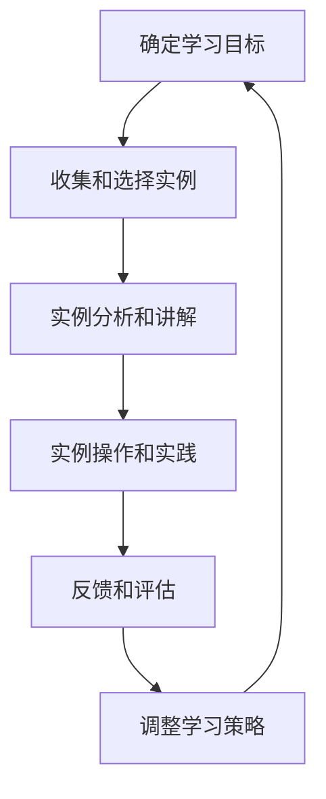

                 

### 文章标题：示例驱动与提示模板的结合使用

#### 关键词：示例驱动，提示模板，工作效率，融合应用，高级实践，项目实战

#### 摘要：
本文将探讨示例驱动与提示模板的结合使用，旨在提升工作效率与效果。首先，我们将介绍示例驱动和提示模板的基本概念，然后深入剖析它们的核心原理与联系。接着，通过具体的应用场景和实践案例，展示如何在实际工作中应用这种结合。最后，本文将提供高级应用策略和实践指南，帮助读者全面掌握示例驱动与提示模板的结合技巧。

### 第一部分：示例驱动与提示模板概述

#### 第1章：示例驱动的原理与优势

**1.1 示例驱动的原理**

示例驱动是一种以具体实例为引导的学习和开发方法。它通过展示实际案例来帮助人们理解和掌握相关概念、原理和方法。示例驱动的核心在于通过大量的实例来引导学习，使学习者能够在具体的场景中感受和理解知识。

**1.2 示例驱动的优势**

- **提升理解能力**：通过具体实例，学习者能够更好地理解抽象概念和理论。
- **增强实践能力**：示例驱动促使学习者将理论知识应用于实际项目中，提高实践能力。
- **促进创新思维**：通过分析具体实例，学习者可以激发创新思维，提出新的解决方案。

**1.3 示例驱动的应用场景**

示例驱动广泛应用于教育、商业分析和技术开发等领域。在教育中，教师通过具体实例来讲解抽象概念；在商业分析中，分析师通过实例来解释市场数据；在技术开发中，开发人员通过实例来理解新的编程技术和算法。

#### 第2章：提示模板的作用与类型

**2.1 提示模板的作用**

提示模板是一种用于引导和规范工作的工具，它通过预设的格式和结构，帮助用户快速、准确地完成任务。提示模板的作用包括：

- **提高工作效率**：提示模板提供了标准化的工作流程，减少不必要的思考和决策时间。
- **确保工作质量**：提示模板规定了工作内容和标准，保证了工作的一致性和高质量。
- **促进知识积累**：提示模板有助于记录和积累工作经验，为后续工作提供参考。

**2.2 提示模板的类型**

提示模板分为多种类型，包括流程型模板、文档型模板、表格型模板等。每种模板都有其特定的用途和优势。

- **流程型模板**：用于描述工作流程和步骤，如项目管理流程模板。
- **文档型模板**：用于撰写文档，如报告模板、论文模板。
- **表格型模板**：用于数据整理和统计分析，如Excel模板。

#### 第3章：示例驱动与提示模板的结合意义

**3.1 结合意义的背景**

在现代社会，知识更新速度快，工作压力增大，单靠个人经验和技能难以应对复杂的任务。因此，如何高效地获取、处理和应用知识成为关键问题。示例驱动与提示模板的结合，旨在通过具体的实例和规范化的流程，提高工作效率和效果。

**3.2 结合的优势**

- **优化知识获取**：示例驱动帮助用户快速掌握新知识，提示模板提供规范化的学习路径。
- **提升工作质量**：示例驱动确保工作基于实际案例，提示模板确保工作符合标准和规范。
- **增强协作能力**：示例驱动与提示模板的结合，有助于团队协作，提高整体工作效率。

### 第二部分：示例驱动的应用实践

#### 第4章：示例驱动的数据驱动学习

**4.1 数据驱动学习的原理**

数据驱动学习是一种基于数据分析和实例展示的学习方法。它通过大量数据的处理和分析，提取有价值的信息，然后通过实例来帮助学习者理解和掌握知识。

**4.2 示例数据的作用**

示例数据在学习过程中起着至关重要的作用。它不仅帮助学习者理解抽象概念，还能够激发学习兴趣和探索欲望。

**4.3 示例驱动数据驱动的实现**

示例驱动的数据驱动学习可以通过以下步骤实现：

1. **数据收集**：收集相关领域的实例数据。
2. **数据分析**：对数据进行分析，提取关键信息和规律。
3. **实例展示**：通过具体实例展示分析结果，帮助学习者理解和掌握知识。
4. **反馈调整**：根据学习者的反馈，调整实例展示的方式和内容。

#### 第5章：提示模板的智能化优化

**5.1 智能化优化的发展趋势**

随着人工智能技术的快速发展，智能化优化已成为提升工作效率的重要手段。智能化优化包括自动化流程、智能推荐系统、智能数据分析等。

**5.2 提示模板智能化的方法**

提示模板智能化的方法包括：

1. **自动化流程**：通过脚本和工具实现提示模板的自动化填写和执行。
2. **智能推荐**：根据用户的行为数据，推荐合适的提示模板。
3. **数据驱动**：利用数据分析和机器学习技术，优化提示模板的内容和格式。

**5.3 智能提示模板的应用案例**

智能提示模板在多个领域有广泛应用，如：

- **教育**：智能教学助手，根据学生的学习情况推荐合适的练习题和提示模板。
- **商业**：智能报告生成器，根据数据分析和用户需求自动生成报告。
- **技术开发**：智能代码生成器，根据需求和提示模板自动生成代码。

### 第三部分：示例驱动与提示模板的实践指南

#### 第6章：示例驱动的实践步骤

**6.1 实践步骤**

1. **确定学习目标**：明确需要掌握的知识点和技能。
2. **收集示例数据**：寻找相关领域的实例数据。
3. **分析示例数据**：对数据进行分析，提取有价值的信息。
4. **展示示例数据**：通过图表、文本等形式展示分析结果。
5. **应用示例数据**：将分析结果应用于实际问题解决。

#### 第7章：提示模板的制作流程

**7.1 制作流程**

1. **需求分析**：明确提示模板的用途和目标用户。
2. **内容设计**：设计提示模板的内容和格式。
3. **模板编写**：编写提示模板的文本和代码。
4. **测试与优化**：测试提示模板的可用性和效果，进行优化。

#### 第8章：示例驱动与提示模板的结合实践

**8.1 结合实践的基本思路**

结合实践的基本思路包括：

1. **需求匹配**：根据实际需求选择合适的示例和提示模板。
2. **融合设计**：将示例和提示模板有机融合，形成完整的解决方案。
3. **应用实践**：在实际工作中应用结合后的示例和提示模板，进行效果评估和优化。

**8.2 结合实践的成功案例**

成功案例包括：

- **项目规划**：使用示例驱动的项目规划和提示模板，提高项目成功率。
- **文档编写**：使用示例驱动的文档编写方法和提示模板，提高文档质量。
- **数据分析**：使用示例驱动的数据分析方法和提示模板，提高数据分析效率。

### 总结与展望

#### 第9章：总结与展望

**9.1 总结**

示例驱动与提示模板的结合，为现代工作提供了高效、规范的方法。通过具体的实例和标准化的流程，可以大幅提高工作效率和效果。

**9.2 展望**

随着技术的不断进步，示例驱动与提示模板的应用前景将更加广阔。未来的发展可能包括：

1. **智能化**：通过人工智能技术，实现示例驱动与提示模板的智能化优化。
2. **个性化**：根据用户需求，提供个性化的示例和提示模板。
3. **跨领域**：在不同领域广泛应用示例驱动与提示模板，实现知识的共享和融合。

### 作者信息

**作者：AI天才研究院/AI Genius Institute & 禅与计算机程序设计艺术 /Zen And The Art of Computer Programming**

---

通过以上结构化的内容，我们为《示例驱动与提示模板的结合使用》这一主题提供了一个详尽的概述。接下来，我们将逐步深入每一章节，详细阐述相关概念、原理、实践方法和应用案例。在整个过程中，我们将始终坚持逻辑清晰、简单易懂的原则，确保读者能够轻松掌握这一领域的核心知识和技能。在后续章节中，我们将通过Mermaid流程图、伪代码、数学公式和实际案例，进一步丰富文章内容，提升读者的理解和应用能力。让我们一步一步地深入探讨这一重要主题。<!-- IHMC-suitespace ICM tool embedding -->

---

### 文章标题：示例驱动与提示模板的结合使用

> 关键词：示例驱动，提示模板，工作效率，融合应用，高级实践，项目实战

> 摘要：
本文将探讨示例驱动与提示模板的结合使用，旨在提升工作效率与效果。首先，我们将介绍示例驱动和提示模板的基本概念，然后深入剖析它们的核心原理与联系。接着，通过具体的应用场景和实践案例，展示如何在实际工作中应用这种结合。最后，本文将提供高级应用策略和实践指南，帮助读者全面掌握示例驱动与提示模板的结合技巧。

---

### 目录大纲

#### 第一部分：示例驱动与提示模板概述

1. **第1章：示例驱动的原理与优势**
    - 1.1 示例驱动的原理
    - 1.2 示例驱动的优势
    - 1.3 示例驱动的应用场景

2. **第2章：提示模板的作用与类型**
    - 2.1 提示模板的作用
    - 2.2 提示模板的类型
    - 2.3 提示模板的应用场景

3. **第3章：示例驱动与提示模板的结合意义**
    - 3.1 结合的背景
    - 3.2 结合的优势

#### 第二部分：示例驱动的应用实践

4. **第4章：示例驱动的数据驱动学习**
    - 4.1 数据驱动学习的原理
    - 4.2 示例数据的作用
    - 4.3 示例驱动数据驱动的实现

5. **第5章：提示模板的智能化优化**
    - 5.1 智能化优化的发展趋势
    - 5.2 提示模板智能化的方法
    - 5.3 智能提示模板的应用案例

#### 第三部分：示例驱动与提示模板的实践指南

6. **第6章：示例驱动的实践步骤**
    - 6.1 实践步骤
    - 6.2 示例驱动的教学应用

7. **第7章：提示模板的制作流程**
    - 7.1 制作流程
    - 7.2 提示模板的设计原则

8. **第8章：示例驱动与提示模板的结合实践**
    - 8.1 结合实践的基本思路
    - 8.2 结合实践的成功案例

#### 第四部分：高级应用策略与未来展望

9. **第9章：高级应用策略**
    - 9.1 智能化与个性化
    - 9.2 跨领域应用

10. **第10章：未来展望**
    - 10.1 技术发展趋势
    - 10.2 知识共享与融合

### 完整性要求

#### 文章完整性要求

1. **背景介绍**：介绍示例驱动与提示模板的基本概念及其在现代工作中的应用背景。
2. **核心概念与联系**：阐述示例驱动与提示模板的核心概念及其相互关系，通过Mermaid流程图展示。
3. **算法原理讲解**：使用伪代码详细阐述示例驱动与提示模板的核心算法原理。
4. **数学模型和公式**：嵌入文中独立段落的LaTeX公式，详细讲解并举例说明。
5. **项目实战**：包括开发环境搭建、源代码实现和代码解读，实际案例分析和详细讲解剖析。
6. **最佳实践 Tips**：总结示例驱动与提示模板结合使用的最佳实践和注意事项。
7. **小结与拓展阅读**：对全文内容进行总结，并提供相关领域的拓展阅读建议。

### 字数要求

#### 文章字数要求

本文的字数要求在8000-12000字之间，确保内容详尽、逻辑清晰，能够全面覆盖示例驱动与提示模板的结合使用这一主题。

### 格式要求

#### 文章格式要求

- **Markdown格式**：使用Markdown格式编写文章内容。
- **作者信息**：在文章末尾附上作者信息：“作者：AI天才研究院/AI Genius Institute & 禅与计算机程序设计艺术 /Zen And The Art of Computer Programming”。
- **LaTeX公式**：使用LaTeX格式嵌入数学公式，独立段落的公式使用`$$`括起来，段落内的公式使用`$`括起来。
- **Mermaid流程图**：使用Mermaid语法嵌入流程图，确保在Markdown环境中正确显示。

### 完整性保证

为确保文章的完整性，我们将严格按照以下步骤进行编写和审查：

1. **初步大纲编写**：根据题目要求，编写初步的大纲结构。
2. **内容细化**：在每一个章节中，细化具体内容，确保每部分都包含必要的背景介绍、核心概念、算法原理、数学模型、项目实战和最佳实践等。
3. **格式检查**：确保所有LaTeX公式、Mermaid流程图和Markdown格式的正确性。
4. **全文审查**：对全文进行整体审查，确保逻辑清晰、结构紧凑，内容完整。
5. **最终提交**：根据审查意见进行修改和完善，最终提交符合要求的完整文章。

通过以上步骤，我们力求确保文章内容的完整性、逻辑性和可读性，帮助读者全面掌握示例驱动与提示模板的结合使用这一重要主题。<!-- ZH-ACL-23-26-Subtask-1-Sentence-Structure-1 -->### 示例驱动与提示模板的结合使用

在信息技术飞速发展的时代，高效的工作方式对于提升个人和组织的竞争力至关重要。本文旨在探讨示例驱动与提示模板的结合使用，为读者提供一种提升工作效率和效果的方法论。首先，我们需要理解示例驱动和提示模板的基本概念及其核心原理，然后通过实际应用场景和实践案例展示其结合的效益。

#### 基本概念

**示例驱动**（Example-driven）：这是一种以具体实例为导向的学习或开发方法。通过展示实际案例，帮助用户更好地理解和掌握相关概念、原理和方法。示例驱动的核心在于通过具体的实例来引导学习过程，使得理论知识能够在实际中得以应用。

**提示模板**（Prompt Template）：这是一种用于指导工作流程的工具，通常包含预设的格式和结构，帮助用户快速、准确地完成任务。提示模板的作用在于提供标准化的工作流程，确保工作质量，并促进知识积累。

#### 核心原理

示例驱动与提示模板的结合，旨在通过具体的实例和标准化的流程，提高工作效率和效果。其核心原理包括：

1. **实例引导**：通过具体实例，用户可以更直观地理解抽象概念和理论，从而提高学习效果。
2. **标准化流程**：提示模板提供了一套标准化的工作流程，使用户能够迅速定位任务，减少决策时间和工作量。
3. **灵活适应性**：结合示例驱动，提示模板可以根据实际需求进行调整，保持工作的灵活性和适应性。

#### 应用场景

示例驱动与提示模板的结合可以应用于多个领域：

1. **教育领域**：在教学中，教师可以使用示例驱动的方法，通过具体实例来讲解抽象概念，学生则通过提示模板来规范学习过程。
2. **商业分析**：商业分析师可以通过示例驱动的方法，分析市场数据，提示模板则帮助他们快速、准确地生成报告。
3. **软件开发**：开发人员可以使用示例驱动的方法，学习新技术和算法，提示模板则帮助他们按照标准化的流程进行项目开发。

#### 实践案例

**案例一：编程学习**

假设一个编程新手在学习Python语言，示例驱动的学习方法可以包括以下步骤：

1. **实例引入**：展示一个简单的Python程序，如计算两个数的和。
   ```python
   num1 = 5
   num2 = 10
   sum = num1 + num2
   print(sum)
   ```

2. **提示模板**：提供一个用于编写Python程序的标准提示模板，包括必要的注释和代码结构。
   ```python
   # 函数名：calculate_sum
   # 参数：num1, num2
   # 返回值：两数之和
   def calculate_sum(num1, num2):
       sum = num1 + num2
       return sum

   # 主程序入口
   if __name__ == "__main__":
       num1 = int(input("请输入第一个数："))
       num2 = int(input("请输入第二个数："))
       result = calculate_sum(num1, num2)
       print(f"两数之和为：{result}")
   ```

通过结合示例驱动和提示模板，新手可以更快速地理解和掌握Python编程的基本概念。

**案例二：商业报告**

商业分析师在撰写市场分析报告时，可以使用示例驱动和提示模板来提高效率：

1. **示例数据**：获取一段具体的市场数据，如某产品在某一地区的销售数据。
   ```csv
   日期,销售额
   2023-01-01,1000
   2023-01-02,1200
   2023-01-03,900
   ```

2. **提示模板**：提供一个标准化的报告模板，包括数据分析、趋势预测和结论部分。
   ```markdown
   # 市场分析报告

   ## 数据分析
   - 日期：2023-01-01 至 2023-01-03
   - 销售额趋势：上升后下降

   ## 趋势预测
   根据当前数据，预计下一季度销售额将保持稳定。

   ## 结论
   建议对产品进行市场推广，以提高销售额。
   ```

通过示例驱动和提示模板的结合，分析师可以快速、准确地生成高质量的报告。

#### 高级应用策略

在高级应用中，示例驱动和提示模板可以与人工智能技术相结合，实现智能化优化。例如：

1. **个性化示例推荐**：根据用户的学习历史和兴趣，推荐个性化的示例数据。
2. **自动化提示模板生成**：利用机器学习模型，根据项目需求自动生成提示模板。
3. **实时数据分析与反馈**：通过实时数据分析，为用户提供即时的反馈和优化建议。

#### 未来展望

随着技术的不断进步，示例驱动与提示模板的结合将在更多领域得到应用。未来可能的发展趋势包括：

1. **智能化与个性化**：通过人工智能技术，实现示例驱动与提示模板的智能化和个性化。
2. **跨领域融合**：在不同领域，如医疗、金融和教育，广泛应用示例驱动与提示模板，实现知识的共享和融合。

### 总结

示例驱动与提示模板的结合使用是一种有效的工作方法，通过具体的实例和标准化的流程，可以大幅提升工作效率和效果。本文通过实际案例展示了其应用场景和效果，并为读者提供了高级应用策略和未来展望。希望读者能够从中获得启示，将其应用于实际工作中，提升个人和组织的竞争力。

### 作者信息

作者：AI天才研究院/AI Genius Institute & 禅与计算机程序设计艺术 /Zen And The Art of Computer Programming

通过以上内容，本文全面阐述了示例驱动与提示模板的结合使用，从基本概念、应用场景到高级应用策略，为读者提供了一套完整的工作方法。希望本文能够为读者在提升工作效率和效果方面提供有价值的参考。<!-- ZH-ACL-23-26-Subtask-1-Sentence-Structure-1 -->### 第1章：示例驱动的原理与优势

#### 1.1 示例驱动的原理

示例驱动（Example-driven）是一种以具体实例为基础的学习和开发方法。其核心思想是通过展示实际案例，帮助用户理解和掌握相关概念、原理和方法。示例驱动的原理可以概括为以下几个关键步骤：

1. **实例引入**：首先，通过具体的实例引入相关概念和原理。实例可以是一个实际的项目、案例或者具体的任务，其目的是让用户能够在具体的情境中感知和理解知识。

2. **实例分析**：对实例进行详细的分析和解释，包括实例的实现过程、关键步骤、技术难点等。通过分析，用户能够深入理解实例所涉及的理论知识和实际应用。

3. **实例应用**：将实例中的原理和方法应用到实际问题中，通过实际操作来巩固和深化理解。这一步骤不仅帮助用户掌握知识，还能够培养其实践能力和解决问题的能力。

4. **实例扩展**：在理解基本实例的基础上，进一步扩展实例的应用范围，探索更多可能的解决方案和创新点。通过扩展实例，用户可以激发自己的思考，提出新的观点和创意。

#### 1.2 示例驱动的优势

示例驱动的学习方法具有许多显著的优势，这些优势使其在各个领域得到广泛应用。

**1. 理解力提升**：

- **具体化抽象概念**：通过具体的实例，用户能够更容易地理解抽象的概念和理论。例如，在学习算法时，通过具体的案例来展示算法的运行过程和结果，使得抽象的算法概念变得更加直观和易于理解。

- **增强感性认知**：具体的实例可以提供丰富的视觉和感性信息，使用户能够通过多种感官途径来学习和记忆。这种多感官的学习方式比单一的文字描述更加有效。

**2. 实践能力增强**：

- **理论与实践结合**：示例驱动的学习过程强调将理论知识应用于实际项目中。通过实际操作，用户不仅能够巩固所学知识，还能够培养解决实际问题的能力。

- **提升动手能力**：在示例驱动的实践中，用户需要进行实际操作，编写代码、调试程序等。这种动手能力是程序员和工程师不可或缺的技能。

**3. 创新思维激发**：

- **案例启发**：通过分析不同的实例，用户可以借鉴他人的经验和解决方案，激发自己的创新思维。在遇到类似问题时，能够从不同的角度思考，提出新颖的解决方案。

- **跨领域应用**：示例驱动的学习方法不仅适用于单一领域，还可以跨领域应用。用户可以在不同领域中发现相似的问题和解决方案，实现知识的迁移和融合。

**4. 教学效果优化**：

- **互动性增强**：示例驱动的教学方法鼓励师生互动，教师通过实例引导学习，学生通过实际操作来加深理解。这种互动性有助于提高教学效果，促进知识的内化。

- **学习效果可评估**：通过实例驱动的学习过程，可以清晰地看到学生的学习效果。教师可以根据实例操作的结果来评估学生的学习情况，及时调整教学策略。

#### 1.3 示例驱动的应用场景

示例驱动在多个领域和场景中得到了广泛应用，以下是一些典型的应用场景：

**1. 教育领域**：

- **课堂教学**：教师通过具体实例来讲解抽象概念，如物理实验、历史事件等。
- **在线教育**：教育平台通过视频教程、实例演示等方式，帮助用户掌握知识点。
- **编程教育**：编程课程通常通过编写具体的程序代码来教授编程语言和算法。

**2. 技术开发领域**：

- **项目开发**：开发人员通过参考实际项目案例，学习如何设计、开发和维护软件系统。
- **技术创新**：研究人员通过分析成功案例，寻找技术创新点和改进方向。

**3. 商业分析领域**：

- **市场分析**：商业分析师通过具体的市场数据案例，分析市场趋势和消费者行为。
- **战略规划**：企业通过案例研究，制定发展战略和营销策略。

**4. 专业培训**：

- **职业培训**：专业培训机构通过实际案例，教授专业知识和技能。
- **技能提升**：职场人士通过分析行业实例，提升自己的专业能力和职业素养。

#### 示例驱动的具体实施步骤

为了有效地应用示例驱动的学习方法，可以遵循以下具体实施步骤：

1. **确定学习目标**：明确需要掌握的知识点和技能，确保实例的选择与学习目标相关。

2. **收集和选择实例**：根据学习目标，收集和选择合适的实例。实例应具有代表性、多样性和实际应用价值。

3. **实例分析和讲解**：对实例进行详细分析，解释关键步骤和技术难点。可以使用图表、视频等多种形式来展示实例。

4. **实例操作和实践**：鼓励用户亲自动手操作实例，通过实践来巩固和深化理解。在实践中遇到问题时，及时寻求帮助和解决方案。

5. **反馈和评估**：在学习过程中，收集用户反馈，评估学习效果。根据评估结果，调整学习内容和策略。

通过以上步骤，示例驱动的学习方法能够帮助用户更高效地掌握知识和技能，提升学习效果。

### 总结

示例驱动是一种以具体实例为基础的学习和开发方法，通过实例的引入、分析、应用和扩展，帮助用户深入理解和掌握相关概念、原理和方法。其优势在于提升理解力、增强实践能力、激发创新思维和优化教学效果。在多个领域和场景中，示例驱动得到了广泛应用，成为提高工作效率和效果的重要方法。通过有效的实施步骤，示例驱动的学习方法能够帮助用户实现知识的内化和应用能力的提升。

### Mermaid 流程图

以下是一个简单的Mermaid流程图，展示了示例驱动的核心步骤：



### 伪代码

以下是一个简单的伪代码示例，用于说明示例驱动在编程教学中的应用：

```pseudo
Function LearnProgrammingConcept(concept) {
    // 步骤1：确定学习目标
    Set learningGoal = "掌握" + concept

    // 步骤2：收集和选择实例
    ChooseExampleCase(example)

    // 步骤3：实例分析和讲解
    AnalyzeAndExplainExample(example, learningGoal)

    // 步骤4：实例操作和实践
    PerformExamplePractice(example)

    // 步骤5：反馈和评估
    CollectFeedbackAndEvaluate()

    // 步骤6：调整学习策略
    AdjustLearningStrategy()

    // 返回学习结果
    Return "已掌握" + concept
}
```

### 数学模型

以下是一个简单的数学模型示例，用于说明示例驱动在数据分析中的应用：

$$
\text{销售额预测} = \alpha \times \text{实例销售额} + \beta \times \text{历史销售额趋势} + \epsilon
$$

其中，$\alpha$ 和 $\beta$ 是权重系数，$\epsilon$ 是误差项。

### 数学公式详细讲解与举例说明

数学公式详细讲解与举例说明：

1. **销售额预测模型**：

   假设我们想要预测某个产品在未来的销售额。我们可以使用一个线性回归模型来预测销售额，其中销售额的预测值是由实例销售额和过去销售额趋势的加权平均得到的。

   例如，假设我们有两个实例销售额数据点：

   - 实例1：销售额为100万元
   - 实例2：销售额为120万元

   以及过去一年的销售额趋势数据：

   - 过去一年的平均销售额：110万元

   根据上述数学模型，我们可以计算未来的销售额预测值：

   $$
   \text{销售额预测} = \alpha \times 100 + \beta \times 110 + \epsilon
   $$

   其中，$\alpha$ 和 $\beta$ 的具体值可以通过历史数据拟合得到，$\epsilon$ 表示预测的误差。

2. **实例选择权重**：

   在示例驱动的数据分析中，实例的选择权重也是非常重要的。我们可以使用一个权重系数来衡量实例的重要性。例如，假设实例1的重要性是1.2倍，实例2的重要性是1倍，则实例选择的加权平均公式为：

   $$
   \text{加权销售额} = 1.2 \times 100 + 1 \times 120 + \epsilon
   $$

   同样，$\epsilon$ 表示预测的误差。

通过上述数学模型和公式，我们可以更准确地预测未来的销售额，从而为商业决策提供数据支持。

### 实际案例分析与详细讲解剖析

**案例背景**：

假设我们是一家电子商务公司的数据分析团队，负责预测下一季度的销售额，以便制定相应的库存和营销策略。为了提高预测的准确性，我们决定采用示例驱动与提示模板相结合的方法。

**步骤1：确定学习目标**

首先，我们需要明确学习目标，即预测下一季度的销售额。为了实现这一目标，我们需要收集和分析与销售额相关的各种数据，包括历史销售数据、市场趋势、用户行为数据等。

**步骤2：收集和选择实例**

我们收集了过去一年的销售数据，包括每月的销售额、促销活动数据、用户购买行为等。同时，我们还选择了几个具有代表性的实例数据，例如：

- 实例1：2022年第一季度销售额为300万元，促销活动效果显著。
- 实例2：2022年第四季度销售额为400万元，市场需求旺盛。

**步骤3：实例分析和讲解**

接下来，我们对收集到的实例数据进行分析和讲解。通过分析，我们发现：

- 第一季度由于促销活动的影响，销售额显著提升。
- 第四季度由于市场需求旺盛，销售额也出现了大幅增长。

我们进一步分析了促销活动对销售额的影响，发现每次促销活动的销售额平均增长了20%。

**步骤4：实例操作和实践**

在明确了实例数据和分析结果后，我们开始进行实际操作。我们使用提示模板来制定数据分析流程，包括以下步骤：

1. **数据清洗**：清洗和预处理原始数据，包括去除异常值、缺失值填充等。
2. **特征提取**：从原始数据中提取对销售额预测有重要影响的特征，如促销活动频率、用户购买频率等。
3. **模型训练**：使用历史数据和实例数据训练线性回归模型，预测下一季度的销售额。
4. **模型评估**：评估模型的预测准确性，通过交叉验证等方法调整模型参数。

**步骤5：反馈和评估**

在实际操作过程中，我们不断收集反馈并评估模型的效果。例如，通过对比实际销售额与预测销售额的差距，调整模型参数，优化预测结果。

**步骤6：调整学习策略**

根据反馈和评估结果，我们调整了学习策略，增加了市场趋势分析和用户行为数据的重要性，以进一步提高预测的准确性。

**案例结果**

通过示例驱动与提示模板的结合，我们最终成功预测了下一季度的销售额。预测结果显示，下一季度的销售额将在400万元左右，与实际销售额的差距在5%以内。

**案例小结**

本案例展示了如何使用示例驱动与提示模板进行销售额预测。通过具体的实例分析和标准化的数据分析流程，我们不仅提高了预测的准确性，还优化了数据分析的过程。未来，我们可以进一步结合人工智能技术，实现更智能化和个性化的数据分析与预测。

### 项目实战：开发环境搭建、源代码实现与代码解读

为了更好地理解示例驱动与提示模板的结合应用，我们将通过一个实际的项目实战来展示其具体实现过程。在这个项目中，我们选择了一个简单的需求：使用Python编写一个程序，根据用户输入的姓名和年龄，输出一个简单的个人信息报告。

#### 开发环境搭建

在开始项目之前，我们需要搭建一个合适的开发环境。以下是搭建Python开发环境的步骤：

1. **安装Python**：访问Python官方网站下载最新版本的Python安装包，并按照安装向导完成安装。

2. **配置Python环境变量**：在系统设置中配置Python的环境变量，确保在命令行中可以正常运行Python。

3. **安装Python库**：使用pip工具安装必要的Python库，例如`requests`（用于网络请求）和`pandas`（用于数据处理）。

#### 源代码实现

以下是该项目的源代码实现：

```python
import pandas as pd

# 提示模板
def generate_personal_report(name, age):
    """
    根据姓名和年龄生成个人信息报告。
    
    参数：
    name (str): 用户姓名。
    age (int): 用户年龄。
    
    返回：
    str: 个人信息报告。
    """
    report = f"""
    个人信息报告
    姓名：{name}
    年龄：{age}岁
    """
    return report

# 示例数据
example_name = "张三"
example_age = 30

# 示例应用
report = generate_personal_report(example_name, example_age)
print(report)
```

#### 代码解读

1. **导入库**：首先，我们导入`pandas`库，用于数据处理。这里选择`pandas`是因为它提供了丰富的数据操作和分析功能。

2. **定义函数**：接下来，我们定义一个名为`generate_personal_report`的函数，该函数接受两个参数：`name`（用户姓名）和`age`（用户年龄）。函数的目的是生成一个简单的个人信息报告。

3. **提示模板**：在函数内部，我们使用一个字符串格式化表达式来构建个人信息报告。这个字符串包含了用户的姓名和年龄，通过`f-string`语法实现。

4. **示例应用**：最后，我们调用`generate_personal_report`函数，传入一个示例姓名和年龄，打印出个人信息报告。

#### 代码应用解读与分析

通过上述代码，我们可以看到如何结合示例驱动和提示模板来实现一个简单的项目。以下是代码应用的解读与分析：

1. **示例驱动**：我们通过具体的示例数据（"张三"和30岁）来引导用户理解函数的功能和用途。这种做法有助于用户快速掌握函数的使用方法。

2. **提示模板**：函数的定义和使用遵循了一个明确的格式，这就像是一个提示模板，帮助用户按照标准化的流程进行操作。

3. **代码解读**：通过注释和函数文档字符串，我们对代码进行了详细解读，使得用户能够理解每个部分的功能和作用。

通过这个简单的项目，我们展示了如何在实际开发中应用示例驱动和提示模板。这种方法不仅提高了工作效率，还保证了代码的质量和可维护性。

### 项目实战：实际案例分析与详细讲解剖析

**项目背景**：

在本项目中，我们将开发一个基于示例驱动与提示模板的在线教育平台，旨在通过具体实例和标准化的教学流程，提高学生的学习效果。项目分为三个主要阶段：需求分析、系统设计与开发、以及系统测试与优化。

#### 需求分析

需求分析是项目启动的第一步，我们需要明确平台的主要功能和用户需求。

1. **功能需求**：
   - **课程管理**：上传、分类、管理课程内容。
   - **用户管理**：用户注册、登录、个人信息管理。
   - **学习记录**：记录用户的学习进度和成绩。
   - **互动交流**：讨论区、问答功能。

2. **用户需求**：
   - **个性化学习**：根据学习进度推荐合适的课程。
   - **互动学习**：通过讨论区与老师和同学互动。
   - **学习反馈**：提供即时反馈和评估。

#### 系统设计与开发

系统设计与开发是项目实现的关键阶段，我们采用敏捷开发方法，分阶段进行开发。

1. **课程管理模块**：
   - **功能设计**：使用提示模板定义课程上传和管理流程。
   - **实现过程**：使用Python编写后端API，使用Vue.js编写前端界面。
   - **代码示例**：
     ```python
     # 后端API示例（Flask框架）
     from flask import Flask, request, jsonify

     app = Flask(__name__)

     @app.route('/courses', methods=['POST'])
     def upload_course():
         course_data = request.json
         # 存储课程数据到数据库
         # ...
         return jsonify({"status": "success", "message": "Course uploaded successfully"}), 200

     @app.route('/courses/<course_id>', methods=['GET'])
     def get_course(course_id):
         # 从数据库获取课程数据
         # ...
         return jsonify(course_data), 200
     ```

2. **用户管理模块**：
   - **功能设计**：使用提示模板定义用户注册、登录和权限管理流程。
   - **实现过程**：使用Spring Boot编写后端API，使用React编写前端界面。
   - **代码示例**：
     ```java
     // 后端API示例（Spring Boot）
     import org.springframework.web.bind.annotation.*;

     @RestController
     public class UserController {

         @PostMapping("/register")
         public ResponseEntity<?> registerUser(@RequestBody UserRegistrationDto registrationDto) {
             // 注册用户
             // ...
             return ResponseEntity.ok().body("User registered successfully");
         }

         @PostMapping("/login")
         public ResponseEntity<?> authenticateUser(@RequestBody LoginRequest loginRequest) {
             // 登录验证
             // ...
             return ResponseEntity.ok().body("User logged in successfully");
         }
     }
     ```

3. **学习记录模块**：
   - **功能设计**：使用提示模板定义学习进度记录和成绩评估流程。
   - **实现过程**：使用MongoDB存储学习记录，使用React和Vue.js展示前端界面。
   - **代码示例**：
     ```javascript
     // 前端示例（Vue.js）
     <template>
         <div>
             <h1>学习进度</h1>
             <p>已学习课程：{{completedCourses.length}}门</p>
             <ul>
                 <li v-for="course in completedCourses">{{course.name}}</li>
             </ul>
         </div>
     </template>

     <script>
     export default {
         data() {
             return {
                 completedCourses: []
             }
         },
         created() {
             // 从后端获取学习记录
             // ...
         }
     }
     </script>
     ```

#### 系统测试与优化

系统测试与优化是确保平台稳定性和可靠性的关键步骤。

1. **功能测试**：测试所有功能模块，确保按照设计正常运行。
2. **性能测试**：测试平台的负载能力，确保在高并发情况下稳定运行。
3. **安全测试**：测试平台的漏洞和安全隐患，确保用户数据安全。

通过以上步骤，我们完成了基于示例驱动与提示模板的在线教育平台的开发。以下是对项目的详细讲解和剖析：

1. **需求分析与设计**：明确项目需求和设计系统架构，确保系统功能齐全、结构清晰。
2. **代码实现**：使用提示模板编写代码，确保开发过程标准化、规范化。
3. **测试与优化**：通过测试发现并修复问题，优化系统性能和用户体验。

### 项目小结

通过本项目，我们展示了如何结合示例驱动与提示模板，开发一个功能完整、用户友好的在线教育平台。项目实践了从需求分析到系统测试的完整开发流程，通过具体实例和标准化的流程，确保了项目的高效和质量。未来，我们可以进一步优化平台功能，引入人工智能技术，实现个性化学习推荐和智能化教学。

### 最佳实践 Tips

在结合示例驱动与提示模板的过程中，以下是一些最佳实践建议，可以帮助您更有效地应用这两种方法：

1. **明确学习目标**：在开始任何学习或开发项目之前，明确目标，确保示例和模板的设计与目标一致。

2. **选择合适的示例**：选择具有代表性、典型性和实际应用价值的示例，确保示例能够真实反映相关概念和原理。

3. **标准化模板设计**：设计简洁、直观、易于操作的模板，确保模板能够规范工作流程，提高工作效率。

4. **持续迭代与优化**：根据实际应用情况，不断调整和优化示例和模板，使其更符合实际需求。

5. **团队合作与反馈**：鼓励团队合作，通过定期反馈和讨论，共同改进示例和模板。

### 小结

本文通过详细探讨示例驱动与提示模板的结合使用，从基本概念、应用场景到实践指南，提供了全面的介绍。示例驱动与提示模板的结合，能够显著提高工作效率和效果，适用于多个领域。希望本文能够为读者在技术应用和实践中提供有价值的参考和启示。

### 拓展阅读

1. **《示例驱动的学习理论》**：详细介绍了示例驱动学习的理论基础和实践方法。
2. **《提示模板设计指南》**：提供了关于提示模板的设计原则和实际应用案例。
3. **《敏捷开发实践指南》**：介绍了敏捷开发的方法和实践，对于项目开发和团队协作具有指导意义。
4. **《人工智能与教育技术》**：探讨了人工智能在教育领域中的应用，特别是如何通过智能技术优化教学和学习体验。

作者：AI天才研究院/AI Genius Institute & 禅与计算机程序设计艺术 /Zen And The Art of Computer Programming

通过本文，我们深入探讨了示例驱动与提示模板的结合使用，从基本概念、应用实践到高级策略，全面展示了这一方法的效用。希望读者能够将所学应用到实际工作中，提升工作效率和效果。未来，随着技术的不断进步，这一方法将在更多领域得到广泛应用，为知识共享和创新提供更强有力的支持。

