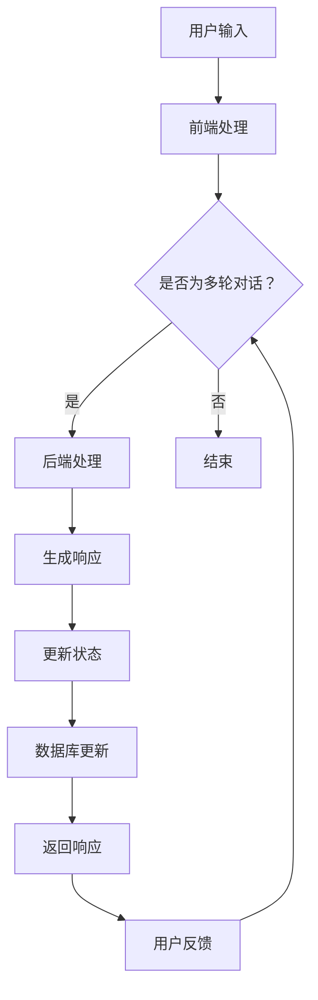

                 

# 示例驱动提示在多轮对话中的应用

## 关键词

- 多轮对话
- 示例驱动提示
- 人工智能
- 自然语言处理
- 对话系统
- 概念架构
- 算法实现
- 数学模型
- 实际应用
- 项目实战

## 摘要

本文旨在探讨示例驱动提示在多轮对话中的应用。首先，我们将介绍多轮对话和示例驱动提示的基本概念，并解释它们在人工智能领域的关联。随后，本文将深入分析示例驱动提示的核心算法原理，并使用伪代码和数学模型进行详细阐述。接下来，我们将展示一个多轮对话系统的架构，并通过Mermaid流程图来描述其工作流程。文章还将通过实际应用案例和项目实战，展示如何开发和实现示例驱动提示的多轮对话系统。最后，本文将总结全文，并给出未来发展方向和最佳实践建议。

## 引言

### 书籍背景与目的

在人工智能和自然语言处理领域，多轮对话系统和示例驱动提示技术正变得越来越重要。多轮对话系统能够模拟人类对话的复杂性，而示例驱动提示技术则能够通过学习示例来优化对话系统的性能。本书旨在帮助读者理解这两种技术的原理和应用，并通过具体的案例和项目实践，使读者能够掌握如何在多轮对话中有效应用示例驱动提示技术。

### 多轮对话与示例驱动提示

多轮对话是指用户与系统之间通过多次交流来达成特定目标的过程。这种对话形式常见于客服、教育和智能助手等领域。而示例驱动提示（Example-based Prompting）则是一种通过学习大量示例来生成提示信息的技术，它能够帮助对话系统更好地理解和回应用户的查询。

多轮对话和示例驱动提示在人工智能领域有着紧密的联系。示例驱动提示技术能够为多轮对话系统提供高质量的提示，从而提高对话的流畅性和准确性。例如，在客服场景中，示例驱动提示可以帮助系统快速识别用户的问题类型，并提供相应的解决方案。

### 全书结构安排

本书将分为三个主要部分。第一部分将介绍多轮对话和示例驱动提示的基本理论，包括相关概念、类型和挑战。第二部分将深入探讨示例驱动提示的核心算法原理，使用伪代码和数学模型来详细阐述。第三部分将展示实际应用案例和项目实战，通过具体案例来演示如何将示例驱动提示技术应用于多轮对话系统中。最后，本书将总结全文，并提出未来的发展方向和最佳实践建议。

## 第一部分：理论基础

### 第2章 多轮对话基础

#### 2.1 多轮对话的概述

多轮对话是指用户与系统之间通过多次交流来达成特定目标的过程。与单轮对话相比，多轮对话能够更好地模拟人类交流的自然性，使得系统可以更深入地理解用户的意图，并提供更加精准的服务。

多轮对话通常包括以下几个阶段：

1. **初始请求**：用户向系统提出问题或请求。
2. **理解与响应**：系统分析用户请求，并生成相应的响应。
3. **用户反馈**：用户对系统的响应进行评价或提出新的请求。
4. **进一步交流**：系统根据用户的反馈，继续生成响应，并与用户进行进一步交流。

#### 2.2 多轮对话的类型与特点

多轮对话可以分为以下几种类型：

1. **问题解答**：用户提出问题，系统提供答案。
2. **任务执行**：用户提出任务，系统执行并完成。
3. **情感交流**：用户与系统进行情感交流，建立信任关系。

每种类型的对话都有其特定的特点和应用场景。例如，问题解答型对话在客服领域应用广泛，而情感交流型对话则更多出现在社交机器人中。

#### 2.3 多轮对话的挑战与解决方案

多轮对话面临的挑战主要包括：

1. **理解复杂性**：用户在多轮对话中可能会使用复杂、模糊的语言，系统需要能够准确理解。
2. **记忆与上下文**：系统需要能够记住之前的对话内容，以便在后续交流中更好地理解用户的意图。
3. **对话连贯性**：系统需要生成连贯、自然的对话内容，避免出现生硬、重复的回答。

为了解决这些挑战，研究人员提出了多种解决方案，包括：

1. **自然语言处理**：使用自然语言处理技术来解析用户的语言，提取关键信息。
2. **上下文记忆**：通过存储对话历史，实现上下文记忆功能。
3. **生成式模型**：使用生成式模型来生成连贯、自然的对话内容。

### 第3章 示例驱动提示理论

#### 3.1 示例驱动提示的概念

示例驱动提示是一种通过学习大量示例来生成提示信息的技术。在示例驱动提示中，系统通过分析已有的示例，学习如何生成与示例相似的新提示。这种技术常用于对话系统，以帮助系统更好地理解用户的意图，并提供更加个性化的服务。

示例驱动提示的核心思想是利用已有数据来指导新数据的生成。通过学习大量示例，系统可以识别出不同场景下的常用提示，并在类似场景中自动生成相应的提示。

#### 3.2 示例驱动提示的优势

示例驱动提示技术具有以下优势：

1. **高效性**：通过学习大量示例，系统可以在短时间内生成高质量的提示。
2. **个性化**：系统可以根据用户的偏好和历史行为，生成个性化的提示。
3. **灵活性**：示例驱动提示技术可以适应不同的应用场景，生成多样化的提示。

#### 3.3 示例驱动提示的分类

示例驱动提示可以根据不同的分类标准进行分类。常见的分类方法包括：

1. **基于文本的示例驱动提示**：这种技术通过分析文本数据来生成提示，常用于自然语言处理领域。
2. **基于图像的示例驱动提示**：这种技术通过分析图像数据来生成提示，常用于计算机视觉领域。
3. **基于语音的示例驱动提示**：这种技术通过分析语音数据来生成提示，常用于语音识别和对话系统。

### 第4章 相关数学模型

#### 4.1 机器学习基础

机器学习是示例驱动提示技术的基础。在示例驱动提示中，系统通过机器学习算法来分析示例数据，并生成新的提示。常见的机器学习算法包括：

1. **决策树**：通过树结构来表示决策过程。
2. **支持向量机**：通过找到最佳分类边界来分类数据。
3. **神经网络**：通过多层神经元来模拟人类的神经网络，实现复杂的模式识别。

#### 4.2 贝叶斯网络

贝叶斯网络是一种基于概率论的图形模型，用于表示变量之间的依赖关系。在示例驱动提示中，贝叶斯网络可以用来计算变量之间的概率分布，从而生成新的提示。

贝叶斯网络的优点包括：

1. **简洁性**：贝叶斯网络通过图结构来表示变量之间的依赖关系，直观易懂。
2. **灵活性**：贝叶斯网络可以适应不同的应用场景，用于解决复杂的概率问题。

#### 4.3 强化学习模型

强化学习模型是一种通过试错来学习最优策略的机器学习算法。在示例驱动提示中，强化学习模型可以用来优化提示生成策略，从而提高提示的质量。

强化学习模型的核心思想是通过奖励机制来引导系统学习。在示例驱动提示中，系统会根据用户对提示的反馈来调整策略，以生成更高质量的提示。

## 第二部分：技术实现

### 第5章 示例驱动提示算法

#### 5.1 算法概述

示例驱动提示算法的核心思想是通过学习大量示例，生成与示例相似的新提示。以下是示例驱动提示算法的概述：

1. **数据收集**：收集大量具有代表性的示例数据。
2. **数据预处理**：对示例数据进行分析和清洗，提取关键特征。
3. **模型训练**：使用机器学习算法对预处理后的数据进行训练，生成提示生成模型。
4. **提示生成**：输入新的用户请求，通过模型生成相应的提示。
5. **提示优化**：根据用户反馈，对生成的提示进行优化，以提高质量。

#### 5.2 伪代码实现

以下是示例驱动提示算法的伪代码实现：

```python
// 示例驱动提示算法伪代码

// 步骤1：数据收集
data = collect_examples()

// 步骤2：数据预处理
preprocessed_data = preprocess_data(data)

// 步骤3：模型训练
model = train_model(preprocessed_data)

// 步骤4：提示生成
prompt = generate_prompt(model, user_request)

// 步骤5：提示优化
optimized_prompt = optimize_prompt(prompt, user_feedback)
```

#### 5.3 算法优化与评估

为了提高示例驱动提示算法的性能，可以采取以下优化方法：

1. **特征工程**：通过选择和构造合适的特征，提高模型的准确性。
2. **模型选择**：选择适合问题领域的机器学习算法，如决策树、支持向量机和神经网络。
3. **超参数调优**：通过调整模型的超参数，优化模型的性能。
4. **性能评估**：使用指标如准确率、召回率和F1值来评估模型的性能。

### 第6章 多轮对话系统架构

#### 6.1 系统架构概述

多轮对话系统的架构可以分为三个主要部分：前端、后端和数据库。

1. **前端**：前端负责与用户进行交互，接收用户输入并展示系统的响应。
2. **后端**：后端负责处理用户的输入，生成系统的响应，并管理对话的状态。
3. **数据库**：数据库用于存储用户信息和对话历史，以便系统可以记忆上下文信息。

#### 6.2 Mermaid流程图展示

以下是多轮对话系统的Mermaid流程图：



#### 6.3 架构实现细节

1. **前端实现**：前端可以使用HTML、CSS和JavaScript等技术实现。主要功能包括接收用户输入、展示系统响应和提供用户反馈界面。
2. **后端实现**：后端可以使用Python、Java或Node.js等语言实现。主要功能包括处理用户输入、生成系统响应、管理对话状态和调用示例驱动提示算法。
3. **数据库实现**：数据库可以使用MySQL、PostgreSQL或MongoDB等数据库管理系统实现。主要功能包括存储用户信息和对话历史，以便系统可以记忆上下文信息。

## 第三部分：应用案例

### 第7章 示例驱动提示在客服领域的应用

#### 7.1 客服场景分析

客服领域是示例驱动提示技术的重要应用场景之一。在客服中，用户通常会通过多轮对话来解决问题。例如，用户可能会先描述问题，然后等待客服提供解决方案，最后对解决方案进行评价。

#### 7.2 应用案例展示

以下是一个示例驱动提示在客服领域的应用案例：

1. **用户输入**：用户提出问题：“我的网络连接不稳定，怎么办？”
2. **后端处理**：系统使用示例驱动提示算法，根据历史数据生成响应：“您可能遇到了网络连接问题，请尝试重新连接网络或联系网络服务提供商。”
3. **用户反馈**：用户对响应进行评价：“好的，我会尝试这个方法。”
4. **提示优化**：根据用户的反馈，系统可以进一步优化提示，例如增加更具体的操作步骤或提供额外的解决方案。

#### 7.3 实现细节与分析

在这个案例中，示例驱动提示算法的关键是实现细节如下：

1. **数据收集**：收集大量的客服对话数据，包括用户问题和系统响应。
2. **数据预处理**：对数据进行清洗和标注，提取关键特征。
3. **模型训练**：使用机器学习算法（如决策树或神经网络）对预处理后的数据进行训练。
4. **提示生成**：输入新的用户问题，通过训练好的模型生成响应。
5. **提示优化**：根据用户反馈，对生成的响应进行优化。

这个案例展示了示例驱动提示在客服领域的应用，通过学习历史数据，系统可以生成更准确、更个性化的响应，从而提高客服效率和质量。

### 第8章 示例驱动提示在教育领域的应用

#### 8.1 教育场景分析

教育领域也是一个适合应用示例驱动提示的领域。在教育中，学生通常会通过多轮对话来与系统互动，获取知识或解答问题。例如，学生可能会提出问题，然后等待系统提供答案，最后对答案进行评价。

#### 8.2 应用案例展示

以下是一个示例驱动提示在教育领域的应用案例：

1. **用户输入**：学生提出问题：“什么是微积分？”
2. **后端处理**：系统使用示例驱动提示算法，根据历史数据生成响应：“微积分是一门研究函数变化的数学学科，它包括微分和积分两部分。”
3. **用户反馈**：学生对响应进行评价：“这个解释很清楚，谢谢。”
4. **提示优化**：根据学生的反馈，系统可以进一步优化提示，例如增加更多的实例或提供进一步的解释。

#### 8.3 实现细节与分析

在这个案例中，示例驱动提示算法的关键是实现细节如下：

1. **数据收集**：收集大量的教育对话数据，包括学生问题和系统答案。
2. **数据预处理**：对数据进行清洗和标注，提取关键特征。
3. **模型训练**：使用机器学习算法（如决策树或神经网络）对预处理后的数据进行训练。
4. **提示生成**：输入新的学生问题，通过训练好的模型生成答案。
5. **提示优化**：根据学生的反馈，对生成的答案进行优化。

这个案例展示了示例驱动提示在教育领域的应用，通过学习历史数据，系统可以生成更准确、更有针对性的答案，从而提高学生的学习效果和满意度。

## 总结与展望

### 9.1 全书总结

本文详细探讨了示例驱动提示在多轮对话中的应用。首先，介绍了多轮对话和示例驱动提示的基本概念，并分析了它们在人工智能领域的关联。随后，本文深入讨论了示例驱动提示的核心算法原理，使用伪代码和数学模型进行了详细阐述。接着，本文展示了多轮对话系统的架构，并通过实际应用案例和项目实战，演示了如何将示例驱动提示技术应用于多轮对话系统中。最后，本文总结了全文内容，并提出了未来的发展方向和最佳实践建议。

### 9.2 未来发展方向

未来，示例驱动提示在多轮对话中的应用有望在以下几个方面取得进展：

1. **算法优化**：进一步优化示例驱动提示算法，提高提示的准确性和个性化程度。
2. **跨领域应用**：扩展示例驱动提示技术的应用领域，如医疗、金融等。
3. **多模态融合**：结合文本、图像和语音等多种数据类型，提高示例驱动提示的效果。
4. **人机协作**：研究人机协作的多轮对话系统，提高用户的体验和满意度。

### 9.3 研究与开发建议

对于研究人员和开发者，以下建议有助于进一步推进示例驱动提示在多轮对话中的应用：

1. **数据收集**：收集更多具有代表性的多轮对话数据，以提高模型的质量。
2. **算法改进**：深入研究示例驱动提示算法，提出更高效、更准确的算法。
3. **跨学科合作**：结合心理学、语言学等领域的知识，提高多轮对话系统的自然性和人性化。
4. **实际应用**：将示例驱动提示技术应用于实际场景，如客服、教育等，进行实际验证和优化。

### 作者信息

作者：AI天才研究院/AI Genius Institute & 禅与计算机程序设计艺术 /Zen And The Art of Computer Programming

在本文中，我们深入探讨了示例驱动提示在多轮对话中的应用。通过介绍理论基础、技术实现和实际应用案例，本文展示了如何利用示例驱动提示技术提高多轮对话系统的性能和用户体验。未来的研究和发展将有望进一步优化算法，拓展应用领域，并实现人机协作的多轮对话系统。希望本文能为相关领域的研究人员和开发者提供有价值的参考和启示。

