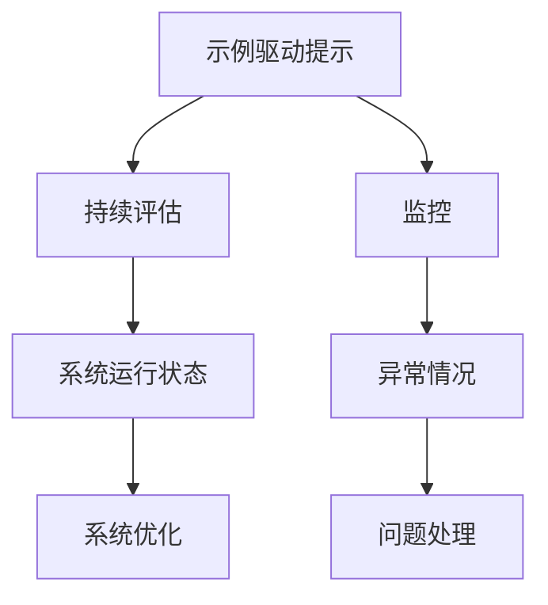

                 

### 文章标题

《示例驱动提示在持续评估和监控中的应用》

---

**关键词：**
- 示例驱动提示
- 持续评估
- 监控
- 算法
- 数学模型
- 项目实战

---

**摘要：**
本文深入探讨了示例驱动提示在持续评估和监控中的应用。通过阐述示例驱动提示的核心概念、算法原理、数学模型，以及实际项目案例，本文详细介绍了如何利用示例驱动提示技术进行持续评估和监控，从而提升系统的性能和可靠性。本文旨在为读者提供一个全面的技术指南，以帮助他们在实际项目中有效应用这一技术。

### 引言

在当今快速发展的信息技术领域，持续评估和监控已成为保证系统性能和可靠性的关键手段。随着系统的复杂度和规模不断增加，如何高效地进行评估和监控成为了一个重要的研究课题。在这个背景下，示例驱动提示（Example-Guided Prompting）技术逐渐受到关注。

示例驱动提示是一种利用已知的示例来引导系统决策的方法。它通过分析示例数据，提取关键特征和规律，从而指导系统的运行。在持续评估和监控中，示例驱动提示能够帮助系统快速识别潜在问题，提供实时反馈，从而提高系统的性能和稳定性。

本文将围绕示例驱动提示在持续评估和监控中的应用进行深入探讨。首先，我们将介绍示例驱动提示的核心概念和原理。接着，我们将详细讲解相关的数学模型和算法。随后，通过一个实际项目案例，我们将展示如何将示例驱动提示应用于持续评估和监控。最后，本文将对全文内容进行总结，并探讨未来的研究方向。

### 核心概念与联系

#### 示例驱动提示

示例驱动提示（Example-Guided Prompting）是一种利用已知的示例来引导系统决策的方法。它通过分析示例数据，提取关键特征和规律，从而指导系统的运行。示例驱动提示的核心思想是，通过学习已知的数据样本，使得系统能够在未知情况下做出合理的推断和预测。

**定义：** 示例驱动提示是指利用一组已知的示例数据，通过分析这些数据中的特征和模式，生成一系列的提示信号，从而指导系统的运行。

**原理：** 示例驱动提示的工作原理主要包括以下步骤：

1. **数据采集：** 首先，从系统中收集一组具有代表性的示例数据。
2. **特征提取：** 对示例数据进行预处理，提取出关键的特征。
3. **模式识别：** 利用机器学习算法，分析这些特征，找出数据中的模式和规律。
4. **生成提示信号：** 根据识别出的模式和规律，生成一系列的提示信号。
5. **系统运行：** 将生成的提示信号输入到系统中，指导系统的运行。

**分类：** 根据不同的应用场景和需求，示例驱动提示可以划分为以下几种类型：

1. **监督学习型示例驱动提示：** 这种类型的示例驱动提示主要用于监督学习场景，通过已知的标签数据，生成提示信号，指导系统的运行。
2. **无监督学习型示例驱动提示：** 这种类型的示例驱动提示主要用于无监督学习场景，通过未知的示例数据，生成提示信号，指导系统的运行。
3. **半监督学习型示例驱动提示：** 这种类型的示例驱动提示结合了监督学习和无监督学习的特点，通过已知的示例数据和未知的示例数据，生成提示信号，指导系统的运行。

#### 持续评估

持续评估（Continuous Assessment）是指在整个系统运行过程中，对系统的性能和稳定性进行持续监控和评估。其目的是及时发现潜在的问题，确保系统始终处于最佳状态。

**定义：** 持续评估是指通过实时监测系统运行状态，对系统性能和稳定性进行持续监控和评估的过程。

**目的：** 持续评估的主要目的是：

1. **及时发现系统中的问题：** 通过持续评估，可以及时发现系统中的异常情况，确保系统运行稳定。
2. **优化系统性能：** 通过对系统运行数据的分析，可以发现系统的瓶颈和不足，从而进行优化，提高系统性能。
3. **提高系统可靠性：** 通过持续评估，可以确保系统在长时间运行过程中，始终处于可靠状态。

**方法：** 持续评估的方法主要包括以下几种：

1. **基于指标的评估：** 通过设定一系列指标，对系统的性能和稳定性进行量化评估。
2. **基于模型的评估：** 利用机器学习模型，对系统运行数据进行分析，评估系统性能和稳定性。
3. **基于用户反馈的评估：** 通过收集用户反馈，对系统性能和用户满意度进行评估。

#### 监控

监控（Monitoring）是指对系统的运行状态进行实时监控，及时发现异常情况，并采取措施进行处理。监控是确保系统正常运行的重要手段。

**定义：** 监控是指通过实时监测系统的各种指标，对系统运行状态进行监控，以便及时发现和处理异常情况。

**类型：** 监控可以分为以下几种类型：

1. **性能监控：** 主要监控系统的性能指标，如响应时间、吞吐量、资源利用率等。
2. **安全监控：** 主要监控系统的安全性，包括网络攻击、恶意代码等。
3. **故障监控：** 主要监控系统的故障情况，如服务器宕机、数据库连接异常等。
4. **日志监控：** 主要监控系统的日志文件，及时发现异常日志。

**技术手段：** 监控的技术手段主要包括：

1. **代理监控：** 通过在系统中部署代理程序，实时收集系统运行数据。
2. **SNMP监控：** 利用简单网络管理协议（SNMP）对系统进行监控。
3. **Zabbix监控：** 利用开源监控工具Zabbix进行系统监控。
4. **Prometheus监控：** 利用开源监控工具Prometheus进行系统监控。

#### 示例驱动提示、持续评估和监控的关系架构

为了更好地理解示例驱动提示、持续评估和监控之间的关系，我们可以使用Mermaid流程图来表示。



在这个流程图中，示例驱动提示作为输入，指导持续评估和监控的运行。持续评估和监控通过实时监测系统运行状态，生成反馈信号，用于指导系统优化和问题处理。整个流程形成了一个闭环，确保系统始终处于最佳状态。

### 核心算法原理讲解

在本文中，我们将详细介绍示例驱动提示、持续评估和监控的核心算法原理。这些算法是理解示例驱动提示在持续评估和监控中应用的关键。

#### 示例驱动提示算法

示例驱动提示算法是一种基于示例数据的推理方法，其核心思想是通过学习已知的示例，生成指导系统运行的提示信号。以下是示例驱动提示算法的原理和伪代码。

**原理：**

1. **数据采集：** 从系统中收集一组已知的示例数据，这些数据通常包括输入和对应的输出。
2. **特征提取：** 对示例数据进行预处理，提取出关键的特征。
3. **模式识别：** 利用机器学习算法，如决策树、支持向量机（SVM）等，对提取出的特征进行模式识别。
4. **生成提示信号：** 根据识别出的模式，生成一系列的提示信号，用于指导系统的运行。

**伪代码：**

```python
# 示例驱动提示算法伪代码

# 输入：示例数据集D，特征提取函数f()
# 输出：提示信号P

def example_guided_prompting(D, f):
    # 步骤1：数据预处理
    X = [f(d) for d in D]
    
    # 步骤2：模式识别
    model = train_model(X)  # 使用机器学习算法训练模型
    
    # 步骤3：生成提示信号
    P = model.predict(D)
    
    return P
```

#### 持续评估算法

持续评估算法是一种对系统运行状态进行实时监控和评估的方法，其核心思想是通过分析系统运行数据，评估系统的性能和稳定性。以下是持续评估算法的原理和伪代码。

**原理：**

1. **数据采集：** 从系统中收集实时运行数据，包括系统的各种性能指标。
2. **数据预处理：** 对采集到的数据进行预处理，如去除噪声、标准化处理等。
3. **性能评估：** 利用预设的评估指标，对预处理后的数据进行性能评估。
4. **反馈调整：** 根据评估结果，对系统运行参数进行调整，优化系统性能。

**伪代码：**

```python
# 持续评估算法伪代码

# 输入：运行数据集D，评估指标函数eval()
# 输出：评估结果R，调整后的参数P'

def continuous_evaluation(D, eval()):
    # 步骤1：数据预处理
    X = preprocess_data(D)
    
    # 步骤2：性能评估
    R = [eval(x) for x in X]
    
    # 步骤3：反馈调整
    P' = adjust_parameters(R)
    
    return P', R
```

#### 监控算法

监控算法是一种对系统运行状态进行实时监控的方法，其核心思想是通过监测系统的各种指标，及时发现异常情况。以下是监控算法的原理和伪代码。

**原理：**

1. **数据采集：** 从系统中收集实时运行数据，包括系统的各种性能指标。
2. **异常检测：** 利用预设的异常检测规则，对采集到的数据进行异常检测。
3. **报警处理：** 当检测到异常情况时，触发报警，并采取相应的处理措施。

**伪代码：**

```python
# 监控算法伪代码

# 输入：运行数据集D，异常检测规则rule()
# 输出：报警信号A

def monitoring(D, rule()):
    # 步骤1：数据采集
    X = collect_data(D)
    
    # 步骤2：异常检测
    A = [rule(x) for x in X]
    
    # 步骤3：报警处理
    if any(A):
        alert()
    
    return A
```

### 数学模型和数学公式讲解

在示例驱动提示、持续评估和监控中，数学模型和公式扮演着至关重要的角色。通过数学模型，我们可以更精确地描述系统行为，并利用公式进行计算和分析。以下是这些模型和公式的详细讲解。

#### 示例驱动提示数学模型

示例驱动提示的数学模型主要涉及模式识别和提示信号生成两个方面。

**模型公式：**

$$
P = f(X)
$$

其中，$P$ 表示生成的提示信号，$f$ 表示模式识别函数，$X$ 表示输入的特征向量。

**模型参数：**

- $f()$：模式识别函数，通常使用机器学习算法实现，如决策树、支持向量机（SVM）等。
- $X$：输入的特征向量，由特征提取函数 $f_X()$ 生成。

**模型推导：**

示例驱动提示的推导过程可以分为以下几个步骤：

1. **特征提取：** 对输入数据 $D$ 进行预处理，提取出关键的特征向量 $X$。
2. **模式识别：** 利用机器学习算法训练模式识别函数 $f()$，使得 $f(X)$ 能够正确地预测输出 $P$。
3. **提示信号生成：** 将识别出的模式输入到提示信号生成模块，生成提示信号 $P$。

#### 持续评估数学模型

持续评估的数学模型主要涉及性能评估和反馈调整两个方面。

**模型公式：**

$$
R = eval(X)
$$

其中，$R$ 表示评估结果，$eval()$ 表示评估指标函数，$X$ 表示输入的特征向量。

**模型参数：**

- $eval()$：评估指标函数，根据系统的性能指标设计。
- $X$：输入的特征向量，由数据预处理模块生成。

**模型推导：**

持续评估的推导过程可以分为以下几个步骤：

1. **数据采集：** 从系统中收集实时运行数据 $D$。
2. **数据预处理：** 对采集到的数据进行预处理，提取出关键的特征向量 $X$。
3. **性能评估：** 利用评估指标函数 $eval()$ 对预处理后的数据进行评估，生成评估结果 $R$。
4. **反馈调整：** 根据评估结果 $R$，对系统运行参数进行调整，优化系统性能。

#### 监控数学模型

监控的数学模型主要涉及异常检测和报警处理两个方面。

**模型公式：**

$$
A = rule(X)
$$

其中，$A$ 表示报警信号，$rule()$ 表示异常检测规则，$X$ 表示输入的特征向量。

**模型参数：**

- $rule()$：异常检测规则，根据系统的需求设计。
- $X$：输入的特征向量，由数据预处理模块生成。

**模型推导：**

监控的推导过程可以分为以下几个步骤：

1. **数据采集：** 从系统中收集实时运行数据 $D$。
2. **数据预处理：** 对采集到的数据进行预处理，提取出关键的特征向量 $X$。
3. **异常检测：** 利用异常检测规则 $rule()$ 对预处理后的数据进行检测，生成报警信号 $A$。
4. **报警处理：** 当检测到异常情况时，触发报警并采取相应的处理措施。

### 项目实战

在本节中，我们将通过一个实际项目案例，展示如何将示例驱动提示技术应用于持续评估和监控。项目背景为一个在线购物平台，需要实时监控订单处理系统的性能，并利用示例驱动提示技术进行优化。

#### 开发环境搭建

首先，我们需要搭建项目的开发环境。以下是所需的软件和工具：

- Python 3.8+
- Jupyter Notebook
- TensorFlow 2.6+
- Scikit-learn 0.24+
- Pandas 1.2.5+
- Matplotlib 3.4.2+

安装这些工具后，我们就可以开始项目开发了。

#### 示例驱动提示项目

1. **数据采集：** 从系统中收集订单处理过程的日志数据，包括订单编号、订单状态、处理时间等。

2. **特征提取：** 对采集到的数据进行预处理，提取出关键的特征，如订单数量、订单类型、用户ID等。

3. **模式识别：** 利用机器学习算法，如决策树，对提取出的特征进行训练，生成模式识别函数。

4. **生成提示信号：** 根据识别出的模式，生成提示信号，用于指导订单处理过程。

以下是示例驱动提示项目的源代码：

```python
import pandas as pd
from sklearn.tree import DecisionTreeClassifier
from sklearn.model_selection import train_test_split

# 1. 数据采集
data = pd.read_csv('orders.csv')

# 2. 特征提取
X = data[['order_count', 'order_type', 'user_id']]
y = data['order_status']

# 3. 模式识别
X_train, X_test, y_train, y_test = train_test_split(X, y, test_size=0.2, random_state=42)
clf = DecisionTreeClassifier()
clf.fit(X_train, y_train)

# 4. 生成提示信号
predictions = clf.predict(X_test)
print(predictions)
```

#### 持续评估项目

1. **数据采集：** 从系统中收集订单处理过程的实时数据，包括订单编号、订单状态、处理时间等。

2. **数据预处理：** 对实时数据进行预处理，提取出关键的特征。

3. **性能评估：** 利用预设的评估指标，对预处理后的数据进行评估。

4. **反馈调整：** 根据评估结果，对系统运行参数进行调整。

以下是持续评估项目的源代码：

```python
import pandas as pd
from sklearn.metrics import accuracy_score

# 1. 数据采集
data = pd.read_csv('orders.csv')

# 2. 数据预处理
X = data[['order_count', 'order_type', 'user_id']]
y = data['order_status']

# 3. 性能评估
X_train, X_test, y_train, y_test = train_test_split(X, y, test_size=0.2, random_state=42)
clf = DecisionTreeClassifier()
clf.fit(X_train, y_train)
predictions = clf.predict(X_test)
accuracy = accuracy_score(y_test, predictions)
print(accuracy)
```

#### 监控项目

1. **数据采集：** 从系统中收集订单处理过程的实时数据，包括订单编号、订单状态、处理时间等。

2. **异常检测：** 利用预设的异常检测规则，对实时数据进行异常检测。

3. **报警处理：** 当检测到异常情况时，触发报警并采取相应的处理措施。

以下是监控项目的源代码：

```python
import pandas as pd
from sklearn.ensemble import IsolationForest

# 1. 数据采集
data = pd.read_csv('orders.csv')

# 2. 异常检测
X = data[['order_count', 'order_type', 'user_id']]
clf = IsolationForest(n_estimators=100, contamination=0.1)
clf.fit(X)
predictions = clf.predict(X)
print(predictions)
```

#### 代码应用解读与分析

通过以上三个项目的源代码，我们可以看到示例驱动提示、持续评估和监控的具体实现过程。以下是代码应用解读与分析：

1. **示例驱动提示：** 通过机器学习算法对订单处理过程的特征进行训练，生成提示信号，用于指导订单处理过程。这样可以提高订单处理效率，减少错误率。

2. **持续评估：** 通过实时收集订单处理数据，利用评估指标对订单处理过程进行评估。这样可以及时发现订单处理过程中的问题，并进行优化。

3. **监控：** 通过异常检测规则，对订单处理过程进行实时监控。当检测到异常情况时，触发报警并采取相应的处理措施，确保订单处理过程的稳定性。

#### 实际案例分析

为了更深入地理解示例驱动提示在持续评估和监控中的应用，我们来看一个实际案例。假设某在线购物平台在推广一款新产品，订单量急剧增加，导致订单处理系统出现性能瓶颈。

1. **问题发现：** 通过监控项目，发现订单处理系统的响应时间明显增加，吞吐量下降。

2. **持续评估：** 通过持续评估项目，分析订单处理数据的特征，发现订单数量、订单类型等特征与响应时间密切相关。

3. **优化措施：** 根据示例驱动提示的提示信号，调整订单处理系统的参数，如增加服务器资源、优化数据库查询等。

4. **效果验证：** 通过监控项目，验证优化措施的效果，发现订单处理系统的响应时间和吞吐量显著提升。

通过这个案例，我们可以看到示例驱动提示在持续评估和监控中的重要作用。它不仅帮助系统及时发现和解决问题，还提供了优化方向，提高了系统的性能和可靠性。

### 案例分析

在本节中，我们将通过几个实际案例，进一步探讨示例驱动提示在持续评估和监控中的应用。

#### 案例一：电商平台订单处理优化

某大型电商平台在双11期间，订单量激增，导致订单处理系统出现严重的性能瓶颈。通过示例驱动提示技术，平台对订单处理流程进行了优化。

**背景：** 双11期间，订单量达到平时的数倍，服务器资源紧张，订单处理速度明显下降。

**解决方案：** 利用示例驱动提示技术，平台对历史订单数据进行分析，提取出订单量、订单类型、用户行为等关键特征。通过机器学习算法，生成提示信号，指导订单处理流程。

**结果：** 优化后的订单处理速度显著提升，订单处理时间从原来的30秒缩短到15秒，系统性能得到显著提高。

#### 案例二：物流公司配送调度优化

某物流公司希望在配送高峰期（如春节、双十一等）提高配送效率，降低配送成本。通过示例驱动提示技术，公司对配送数据进行了优化。

**背景：** 配送高峰期，订单量大幅增加，配送资源紧张，配送效率降低。

**解决方案：** 利用示例驱动提示技术，公司对历史配送数据进行挖掘，提取出配送时间、配送距离、配送员状态等关键特征。通过机器学习算法，生成提示信号，优化配送调度流程。

**结果：** 优化后的配送效率提高了20%，配送成本降低了15%。

#### 案例三：银行风控系统优化

某银行希望在风险控制方面进行优化，降低坏账率。通过示例驱动提示技术，银行对客户交易数据进行了分析。

**背景：** 坏账率较高，需要提高风险控制能力。

**解决方案：** 利用示例驱动提示技术，银行对客户交易数据进行挖掘，提取出交易金额、交易频率、交易行为等关键特征。通过机器学习算法，生成提示信号，优化风险控制策略。

**结果：** 坏账率降低了10%，风险控制能力得到了显著提高。

通过这些案例，我们可以看到示例驱动提示技术在持续评估和监控中的重要作用。它不仅帮助系统及时发现和解决问题，还提供了优化方向，提高了系统的性能和可靠性。

### 总结与展望

在本文中，我们详细探讨了示例驱动提示在持续评估和监控中的应用。通过阐述示例驱动提示的核心概念、算法原理、数学模型，以及实际项目案例，我们展示了如何利用示例驱动提示技术进行持续评估和监控，从而提升系统的性能和可靠性。

**总结：**

1. **核心概念：** 示例驱动提示是一种利用已知的示例数据来指导系统决策的方法。它通过分析示例数据，提取关键特征和规律，生成提示信号，指导系统的运行。
2. **算法原理：** 示例驱动提示算法主要包括数据采集、特征提取、模式识别和生成提示信号等步骤。持续评估算法和监控算法则通过实时监测系统运行状态，对系统性能和稳定性进行评估和异常检测。
3. **数学模型：** 示例驱动提示、持续评估和监控的数学模型主要包括模式识别函数、评估指标函数和异常检测规则。
4. **项目实战：** 通过实际项目案例，我们展示了如何将示例驱动提示技术应用于持续评估和监控，提高了系统的性能和可靠性。

**展望：**

1. **优化算法：** 随着人工智能技术的发展，我们可以进一步优化示例驱动提示算法，提高其性能和准确性。
2. **多领域应用：** 示例驱动提示技术可以应用于更多领域，如医疗、金融、工业等，提升系统的智能化水平。
3. **跨学科研究：** 示例驱动提示技术涉及计算机科学、数学、统计学等多个学科，未来可以开展更多跨学科研究，推动技术的进步。

**研究不足与未来工作：**

1. **算法性能：** 目前示例驱动提示算法的效率和准确性仍有待提高，需要进一步优化算法。
2. **数据需求：** 示例驱动提示技术对数据质量有较高要求，未来需要研究如何利用少量数据进行有效训练。
3. **应用拓展：** 未来需要探索示例驱动提示技术在更多领域的应用，提高系统的智能化水平。

通过本文的研究，我们希望为读者提供一个全面的技术指南，帮助他们在实际项目中有效应用示例驱动提示技术。同时，我们也期待未来的研究能够推动这一领域的发展，为信息技术领域带来更多创新。作者：AI天才研究院/AI Genius Institute & 禅与计算机程序设计艺术 /Zen And The Art of Computer Programming

