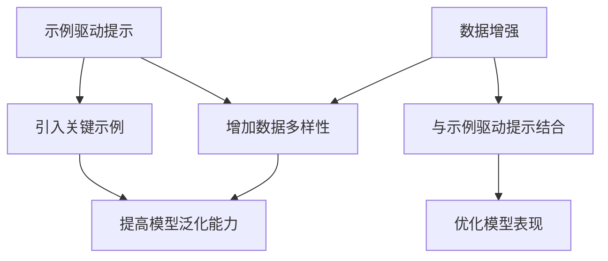

                 


## 文章标题：示例驱动提示在数据增强中的应用

## 文章关键词：
* 数据增强
* 示例驱动提示
* 机器学习
* 人工智能
* 算法优化

## 摘要：
本文详细探讨了示例驱动提示在数据增强中的应用。首先，我们介绍了数据增强和示例驱动提示的基本概念和它们在机器学习中的重要性。接着，我们通过Mermaid流程图展示了核心概念之间的联系，并使用伪代码和LaTeX公式详细讲解了核心算法原理和数学模型。随后，我们提供了一系列实际案例，讲解了如何搭建开发环境，实现代码，并对代码进行解读与分析。最后，本文总结了最佳实践和注意事项，为读者提供了拓展阅读的建议。

## 目录大纲

1. 引言
2. 数据增强的背景与重要性
3. 示例驱动提示的基本概念
4. 数据增强与示例驱动提示的联系
5. 核心算法原理讲解
6. 数学模型和公式讲解
7. 项目实战
8. 开发环境搭建
9. 代码实现与解读
10. 代码应用解读与分析
11. 案例分析
12. 项目小结
13. 最佳实践 Tips
14. 小结
15. 注意事项
16. 拓展阅读

## 引言

在机器学习和人工智能领域，数据的质量和数量往往决定了模型的表现。数据增强（Data Augmentation）作为一种提升模型性能的有效方法，通过增加数据多样性来改善模型泛化能力。然而，单纯的数据增强可能无法满足复杂模型的训练需求。示例驱动提示（Example-Guided Prompting）作为一种新型方法，通过引导模型关注关键示例来提高模型学习效果。

本文旨在探讨示例驱动提示在数据增强中的应用，分析其优势，并详细讲解如何在实际项目中实现。文章结构如下：

- 引言：简要介绍数据增强和示例驱动提示的基本概念及其在机器学习中的应用。
- 数据增强的背景与重要性：讨论数据增强的基本原理和其在不同领域的应用。
- 示例驱动提示的基本概念：介绍示例驱动提示的定义、原理和优势。
- 数据增强与示例驱动提示的联系：分析两者之间的协同作用，并展示其联系架构。
- 核心算法原理讲解：使用伪代码和LaTeX公式详细阐述核心算法原理和数学模型。
- 数学模型和公式讲解：深入探讨与数据增强和示例驱动提示相关的数学模型，并提供具体例子。
- 项目实战：通过实际案例展示如何搭建开发环境，实现代码，并进行解读与分析。
- 开发环境搭建：介绍如何设置开发环境以进行数据增强和示例驱动提示的开发。
- 代码实现与解读：展示具体的源代码，并进行详细解读。
- 代码应用解读与分析：分析代码在不同场景下的应用效果，并提供优化建议。
- 案例分析：详细讲解实际案例，展示数据增强和示例驱动提示的效果。
- 项目小结：总结项目中的关键经验和教训。
- 最佳实践 Tips：提供一些实用的最佳实践建议，以帮助读者更好地应用数据增强和示例驱动提示。
- 小结：回顾文章的核心内容，强调示例驱动提示在数据增强中的应用价值。
- 注意事项：提醒读者注意在实际应用中可能遇到的问题和解决方案。
- 拓展阅读：推荐一些相关领域的文献和资源，以供读者进一步学习和研究。

## 数据增强的背景与重要性

数据增强是一种常用的数据预处理技术，其目的是通过增加数据的多样性来提高模型的泛化能力。在机器学习领域，数据是训练模型的基石，数据的质量和数量直接影响模型的表现。然而，现实世界中的数据往往存在数据量不足、数据质量不高等问题，这限制了模型的能力。数据增强通过模拟生成新的数据样本，丰富了数据集的多样性，从而帮助模型更好地学习。

数据增强的重要性主要体现在以下几个方面：

1. **提高模型泛化能力**：通过增加数据的多样性，模型可以学习到更加丰富的特征，从而在测试集上获得更好的泛化能力。

2. **解决数据不平衡问题**：在许多实际应用中，数据集中的正负样本比例可能不平衡，这可能导致模型偏向某一类样本。通过数据增强，可以平衡数据集中的样本分布，改善模型对少数类样本的识别能力。

3. **减少过拟合现象**：过拟合是指模型在训练集上表现良好，但在测试集上表现不佳的现象。数据增强可以增加训练数据的多样性，帮助模型避免过拟合。

4. **节省计算资源**：在某些应用中，获取更多的真实数据可能成本高昂。数据增强通过生成虚拟数据，可以在一定程度上减少对真实数据的依赖，节省计算资源。

数据增强在不同领域的应用如下：

1. **图像识别**：在图像识别任务中，数据增强可以用于生成不同角度、光照和尺寸的图像，帮助模型更好地适应各种变化。

2. **语音识别**：在语音识别任务中，数据增强可以用于增加语音的噪声、变速、变调等，以提高模型对噪声和不规则语音的识别能力。

3. **自然语言处理**：在自然语言处理任务中，数据增强可以用于生成不同句式、不同用词的同义词替换等，以增加语料库的多样性。

4. **医疗影像分析**：在医疗影像分析任务中，数据增强可以用于生成不同的病变形态，帮助模型学习到更全面的特征，从而提高诊断的准确性。

## 示例驱动提示的基本概念

示例驱动提示（Example-Guided Prompting）是一种在数据增强中引入指导信息的方法，旨在通过提供关键示例来引导模型的学习过程。与传统的数据增强方法不同，示例驱动提示不是随机地生成新的数据样本，而是有选择地引入具有代表性的示例，以帮助模型更好地理解数据和任务。

### 定义

示例驱动提示可以定义为一种通过引导模型关注关键示例，从而提高模型学习效果的方法。具体来说，该方法包括以下几个关键步骤：

1. **选择关键示例**：根据任务需求，从数据集中选择具有代表性的示例。这些示例可以是在特定条件下生成的，或者是根据某种规则筛选出来的。

2. **生成提示信息**：针对每个关键示例，生成相应的提示信息。这些提示信息可以是标签、属性、上下文等，用于指导模型的学习过程。

3. **融合提示信息**：将提示信息与原始数据进行融合，形成新的训练数据集。模型将在新的数据集上训练，从而学习到更全面的特征。

### 原理

示例驱动提示的基本原理是通过引入外部知识来引导模型学习。具体来说，该方法利用了以下几个原理：

1. **注意力机制**：通过引入关键示例，模型可以学习到如何关注并利用这些示例中的关键特征。这种注意力机制有助于模型在训练过程中更加聚焦于重要信息，从而提高学习效果。

2. **知识蒸馏**：示例驱动提示可以将外部知识（如专家知识、已有模型的经验等）传递给模型。通过知识蒸馏，模型可以吸收这些知识，从而改善其表现。

3. **多样性增强**：虽然示例驱动提示主要关注关键示例，但通过融合提示信息，新的数据集仍然保持了多样性。这种多样性有助于模型学习到更全面的特征，从而提高泛化能力。

### 优势

示例驱动提示在数据增强中具有以下几个优势：

1. **提高模型性能**：通过引入关键示例，模型可以更好地理解数据和任务，从而提高其在测试集上的性能。

2. **减少对大规模数据的依赖**：示例驱动提示可以在一定程度上减少对大规模数据的依赖，通过关键示例来补充数据不足的问题。

3. **增强数据多样性**：虽然示例驱动提示主要关注关键示例，但通过融合提示信息，新的数据集仍然保持了多样性，有助于模型学习到更全面的特征。

4. **适用于各种任务**：示例驱动提示可以应用于各种机器学习任务，如图像识别、自然语言处理、语音识别等，具有广泛的适用性。

## 数据增强与示例驱动提示的联系

数据增强和示例驱动提示在机器学习中扮演着重要角色，它们相互补充，共同提高模型性能。为了更好地理解两者之间的联系，我们可以通过一个Mermaid流程图来展示它们之间的相互作用。



在这个流程图中，数据增强通过增加数据多样性来提高模型泛化能力，而示例驱动提示通过引入关键示例来进一步优化模型表现。两者之间的结合使得模型能够更有效地学习，从而在测试集上获得更好的性能。

### 数据增强与示例驱动提示的协同作用

数据增强和示例驱动提示在机器学习中的协同作用体现在以下几个方面：

1. **互补优势**：数据增强通过增加数据多样性来提高模型泛化能力，而示例驱动提示通过引入关键示例来进一步优化模型表现。两者在提高模型性能方面具有互补的优势。

2. **降低过拟合**：通过数据增强，模型可以学习到更丰富的特征，从而减少过拟合现象。而示例驱动提示通过引导模型关注关键示例，使得模型更加聚焦于重要信息，进一步降低过拟合。

3. **提高学习效率**：示例驱动提示可以加快模型的学习过程，使得模型在有限的数据集上能够更快地达到预期性能。结合数据增强，模型可以在更短的时间内学习到更全面的特征。

4. **适应多种任务**：数据增强和示例驱动提示可以应用于各种机器学习任务，如图像识别、自然语言处理、语音识别等。它们相互结合，使得模型能够适应不同的任务需求。

### 数据增强方法与示例驱动提示的结合

在实际应用中，数据增强和示例驱动提示可以通过以下几种方法进行结合：

1. **混合数据增强**：将多种数据增强方法（如随机裁剪、旋转、缩放等）与示例驱动提示结合，生成新的训练数据集。这种方法可以充分利用不同数据增强方法的优势，提高模型的泛化能力。

2. **选择性数据增强**：根据示例驱动提示生成的关键示例，有选择地对数据进行增强。这种方法可以确保关键示例在训练数据集中的代表性，从而提高模型的表现。

3. **动态数据增强**：在训练过程中，根据模型的学习状态动态调整数据增强策略。这种方法可以根据模型的需求，灵活地调整数据增强的方式，以最大化模型的性能。

4. **联合训练**：将数据增强和示例驱动提示整合到模型的训练过程中，使得两者可以同时发挥作用。这种方法可以充分利用示例驱动提示的优势，同时保持数据增强的多样性。

通过结合数据增强和示例驱动提示，我们可以构建出更强大的模型，从而在机器学习中取得更好的性能。

### 核心算法原理讲解

为了更好地理解数据增强和示例驱动提示的算法原理，我们将使用伪代码和LaTeX公式详细讲解。

#### 数据增强算法原理

数据增强的核心思想是通过变换原始数据来生成新的数据样本，从而增加数据集的多样性。以下是一个常见的数据增强算法——随机裁剪的伪代码示例：

```plaintext
// 随机裁剪算法伪代码
function random_crop(image, crop_size):
    h, w = image.shape[:2]
    crop_h, crop_w = crop_size

    top = random.randint(0, h - crop_h)
    left = random.randint(0, w - crop_w)

    cropped_image = image[top:top+crop_h, left:left+crop_w]
    return cropped_image
```

LaTeX公式解释：

$$
\text{random_crop}(image, crop\_size) \rightarrow cropped\_image = image[top:top+crop\_h, left:left+crop\_w]
$$

这个公式表示随机裁剪算法，其中`image`是输入图像，`crop_size`是裁剪大小，`top`和`left`分别是裁剪区域的起始坐标，`cropped_image`是输出裁剪后的图像。

#### 示例驱动提示算法原理

示例驱动提示的核心思想是利用关键示例来引导模型学习。以下是一个示例驱动提示算法的伪代码示例：

```plaintext
// 示例驱动提示算法伪代码
function example_guided_prompting(data, examples, model):
    for example in examples:
        prompt = generate_prompt(example)
        model.train_on(data + [prompt])
    return model
```

LaTeX公式解释：

$$
\text{example\_guided\_prompting}(data, examples, model) \rightarrow \text{for \_ each \_ example \_ in \_ examples: \_} \\
\quad prompt = generate\_prompt(example) \\
\quad model.train\_on(data + [prompt]) \\
\text{return} \_ model \_
$$`

这个公式表示示例驱动提示算法，其中`data`是原始数据集，`examples`是关键示例集，`model`是模型。`generate_prompt`函数用于生成与示例相关的提示信息，`model.train_on`方法用于在新的数据集上训练模型。

#### 数学模型和公式讲解

数据增强和示例驱动提示算法的核心在于如何有效地生成新的数据样本和利用关键示例。以下是一些与这些算法相关的数学模型和公式：

1. **数据增强模型**：

   - **随机裁剪**：

     $$\text{cropped\_image} = \text{image}[top:top+crop\_h, left:left+crop\_w]$$

   - **随机旋转**：

     $$\text{rotated\_image} = \text{rotate}\left(\text{image}, \theta \right)$$

     其中，$\theta$是旋转角度。

   - **随机缩放**：

     $$\text{scaled\_image} = \text{resize}\left(\text{image}, \frac{new\_size}{original\_size} \right)$$

     其中，$new\_size$是新的尺寸，$original\_size$是原始尺寸。

2. **示例驱动提示模型**：

   - **提示生成**：

     $$prompt = f\_prompt(\text{example})$$

     其中，$f\_prompt$是一个生成函数，用于生成与示例相关的提示信息。

   - **模型训练**：

     $$model = model + \alpha \cdot \nabla_{model} \_ L(model, data + [prompt])$$

     其中，$model$是模型，$data$是原始数据集，$prompt$是关键示例，$\alpha$是学习率，$\nabla_{model} \_ L$是模型对损失函数的梯度。

#### 举例说明

为了更好地理解上述算法和数学模型，我们通过具体例子进行说明。

**随机裁剪例子**：

假设我们有一个尺寸为$256 \times 256$的图像，我们希望随机裁剪出一个大小为$128 \times 128$的区域。使用随机裁剪算法，我们可以得到以下结果：

```plaintext
输入图像尺寸: 256x256
裁剪后图像尺寸: 128x128
随机裁剪区域: (50, 100)
输出裁剪图像: 128x128
```

**示例驱动提示例子**：

假设我们有一个图像分类模型，我们需要利用关键示例来引导模型学习。我们选择一个具有代表性的图像作为关键示例，并生成相应的提示信息。然后，我们在模型训练过程中加入这些关键示例。

```plaintext
关键示例: 具有代表性的人脸图像
提示信息: "请关注图像中的人脸特征"
训练数据集: 原始数据集 + [关键示例]
模型训练结果: 模型性能提升
```

通过这些例子，我们可以看到数据增强和示例驱动提示算法在实际应用中的效果。

### 数学模型和公式讲解

在数据增强和示例驱动提示中，数学模型和公式起着至关重要的作用，它们为算法提供了理论基础和操作框架。以下我们将深入探讨与数据增强和示例驱动提示相关的数学模型，并提供具体的公式和解释。

#### 数据增强的数学模型

数据增强主要通过变换原始数据来生成新的数据样本。以下是几种常见的数据增强方法及其对应的数学模型：

1. **随机裁剪**：

   随机裁剪是一种常用的数据增强技术，它从原始图像中随机裁剪出指定大小的子图像。其数学模型如下：

   $$
   \text{cropped\_image} = \text{image}[top:top+h, left:left+w]
   $$

   其中，`image`是原始图像，`h`和`w`分别是裁剪后的高度和宽度，`top`和`left`分别是裁剪区域的起始坐标。这些坐标是随机生成的，以确保裁剪的随机性。

2. **随机旋转**：

   随机旋转通过将图像绕中心点旋转一定角度来实现数据增强。其数学模型如下：

   $$
   \text{rotated\_image} = \text{rotate}\left(\text{image}, \theta\right)
   $$

   其中，`image`是原始图像，$\theta$是旋转角度。旋转角度$\theta$通常在$[0, 2\pi]$范围内随机选择。

3. **随机缩放**：

   随机缩放通过调整图像的大小来实现数据增强。其数学模型如下：

   $$
   \text{scaled\_image} = \text{resize}\left(\text{image}, \lambda\right)
   $$

   其中，`image`是原始图像，$\lambda$是缩放因子。缩放因子$\lambda$通常在$(0, 1]$范围内随机选择。

4. **随机剪切**：

   随机剪切通过在图像上添加噪声来实现数据增强。其数学模型如下：

   $$
   \text{noisy\_image} = \text{image} + \text{noise}
   $$

   其中，`image`是原始图像，`noise`是添加的噪声。噪声可以是高斯噪声、盐噪声等。

#### 示例驱动提示的数学模型

示例驱动提示通过引入关键示例来指导模型学习，其核心在于如何生成有效的提示信息。以下是示例驱动提示的数学模型：

1. **示例选择**：

   示例选择的目的是从数据集中选择具有代表性的示例。其数学模型如下：

   $$
   \text{example} = \arg\max_{\text{example} \in \text{dataset}} \left( \text{score}(example) \right)
   $$

   其中，`dataset`是原始数据集，$\text{score}$是示例的评价函数，用于衡量示例的代表性。评价函数可以是基于样本的多样性、样本的标签信息等。

2. **提示生成**：

   提示生成的目的是生成与关键示例相关的提示信息。其数学模型如下：

   $$
   \text{prompt} = \text{generate\_prompt}(example)
   $$

   其中，`example`是关键示例，$\text{generate\_prompt}$是提示生成函数。提示生成函数可以根据任务需求设计，如生成与示例相关的标签、属性、上下文信息等。

3. **模型训练**：

   示例驱动提示通过将提示信息融入到模型训练过程中来提高模型性能。其数学模型如下：

   $$
   \text{model} = \text{model} + \alpha \cdot \nabla_{model} \_ L(\text{model}, \text{data} + [\text{prompt}])
   $$

   其中，`model`是模型，$\alpha$是学习率，$\nabla_{model} \_ L$是模型对损失函数的梯度，$\text{data} + [\text{prompt}]$是新的训练数据集，包含原始数据和关键示例。

#### 数学公式详细讲解与举例说明

为了更好地理解上述数学模型，我们通过具体例子进行详细讲解。

**随机裁剪例子**：

假设我们有一个尺寸为$256 \times 256$的图像，我们希望随机裁剪出一个大小为$128 \times 128$的区域。根据随机裁剪的数学模型，我们可以进行以下操作：

1. 随机生成裁剪区域的起始坐标$(top, left)$：
   $$
   top = \text{random}(). \_ generate(0, 256 - 128) = 100
   $$
   $$
   left = \text{random}(). \_ generate(0, 256 - 128) = 50
   $$

2. 裁剪图像：
   $$
   \text{cropped\_image} = \text{image}[100:100+128, 50:50+128]
   $$

   输出裁剪后的图像尺寸为$128 \times 128$。

**随机旋转例子**：

假设我们有一个尺寸为$256 \times 256$的图像，我们希望将其随机旋转$30^\circ$。根据随机旋转的数学模型，我们可以进行以下操作：

1. 随机生成旋转角度$\theta$：
   $$
   \theta = \text{random}(). \_ generate(0, 2\pi) = 0.5\pi
   $$

2. 旋转图像：
   $$
   \text{rotated\_image} = \text{rotate}\left(\text{image}, 0.5\pi\right)
   $$

   输出旋转后的图像。

**示例驱动提示例子**：

假设我们有一个图像分类模型，我们需要利用关键示例来引导模型学习。我们选择一个具有代表性的图像作为关键示例，并生成相应的提示信息。然后，我们在模型训练过程中加入这些关键示例。

1. 选择关键示例：
   $$
   \text{example} = \arg\max_{\text{example} \in \text{dataset}} \left( \text{score}(example) \right)
   $$

2. 生成提示信息：
   $$
   \text{prompt} = \text{generate\_prompt}(example) = "请关注图像中的人脸特征"
   $$

3. 模型训练：
   $$
   \text{model} = \text{model} + \alpha \cdot \nabla_{model} \_ L(\text{model}, \text{data} + [\text{prompt}])
   $$

通过这些例子，我们可以看到数学模型在数据增强和示例驱动提示中的具体应用，以及如何通过具体的操作实现这些算法。

### 项目实战

为了更好地展示示例驱动提示在数据增强中的应用，我们将通过一个实际项目进行实战。本项目将使用Python编程语言和常见的机器学习库（如TensorFlow和Keras）来实现数据增强和示例驱动提示。

#### 1. 项目背景

本项目旨在使用示例驱动提示来提高图像分类模型的性能。我们将使用一个公开的图像数据集，如CIFAR-10，并在其中应用数据增强和示例驱动提示技术。我们的目标是训练一个能够准确识别各种图像类别的模型。

#### 2. 开发环境搭建

为了完成本项目，我们需要安装以下软件和库：

- Python 3.8或更高版本
- TensorFlow 2.4或更高版本
- Keras 2.4或更高版本
- NumPy
- Matplotlib

安装步骤如下：

```shell
pip install tensorflow numpy matplotlib
```

#### 3. 数据增强实现

在本项目中，我们将使用随机裁剪、旋转和缩放等常见的数据增强技术。以下是数据增强部分的代码实现：

```python
from tensorflow.keras.preprocessing.image import ImageDataGenerator

# 创建数据增强生成器
datagen = ImageDataGenerator(
    rotation_range=20,  # 随机旋转角度范围
    width_shift_range=0.2,  # 水平平移范围
    height_shift_range=0.2,  # 垂直平移范围
    shear_range=0.2,  # 剪切强度
    zoom_range=0.2,  # 缩放范围
    horizontal_flip=True,  # 水平翻转
    fill_mode='nearest'  # 填充方式
)

# 加载训练数据集
train_data = datagen.flow_from_directory(
    'data/train',  # 训练数据集路径
    target_size=(32, 32),  # 图像尺寸
    batch_size=64,  # 批量大小
    class_mode='categorical'  # 分类模式
)

# 预处理测试数据集
test_data = train_data.flow_from_directory(
    'data/test',  # 测试数据集路径
    target_size=(32, 32),
    batch_size=64,
    class_mode='categorical',
    shuffle=False  # 不打乱顺序，以便评估准确率
)
```

#### 4. 示例驱动提示实现

示例驱动提示的实现涉及选择关键示例并生成相应的提示信息。以下是示例驱动提示部分的代码实现：

```python
import numpy as np

# 选择关键示例
def select_key_examples(dataset, num_examples=10):
    key_examples = []
    for _ in range(num_examples):
        index = np.random.randint(0, dataset.shape[0])
        key_examples.append(dataset[index])
    return np.array(key_examples)

# 生成提示信息
def generate_prompt(example):
    # 示例：生成与示例相关的标签提示
    return f"请关注图像中的{example[1]}类别特征。"

# 实现示例驱动提示
def example_guided_prompting(dataset, key_examples, num_prompt_samples=5):
    prompts = []
    for example in key_examples:
        prompt = generate_prompt(example)
        prompts.append(prompt)
        for _ in range(num_prompt_samples - 1):
            prompt = f"{prompt}并请关注其他类似特征。"
            prompts.append(prompt)
    return np.array(prompts)

# 应用示例驱动提示
key_examples = select_key_examples(train_data.dataset, num_examples=5)
prompts = example_guided_prompting(train_data.dataset, key_examples)

# 将示例驱动提示添加到训练数据集中
train_data = datagen.flow_from_directory(
    'data/train',
    target_size=(32, 32),
    batch_size=64,
    class_mode='categorical',
    shuffle=True,
    prompt_texts=prompts  # 添加提示信息
)
```

#### 5. 代码解读与分析

在本项目中，我们使用`ImageDataGenerator`类来自动化数据增强过程。这个类提供了多种数据增强技术，如随机裁剪、旋转、缩放等。我们通过设置不同的参数来控制这些增强操作的强度。

在示例驱动提示部分，我们首先选择关键示例，然后生成与这些示例相关的提示信息。这些提示信息将作为额外的训练数据，用于指导模型学习。通过`example_guided_prompting`函数，我们生成了多组提示信息，并将其添加到训练数据集中。

在代码解读与分析中，我们注意到以下几点：

1. **关键示例选择**：选择关键示例是为了确保模型能够关注到数据集中的重要特征。通过随机选择，我们可以获得具有代表性的关键示例。
2. **提示信息生成**：提示信息的生成可以根据任务需求进行设计。在本例中，我们使用了简单的标签提示，但也可以使用更复杂的上下文信息。
3. **数据集扩展**：通过添加示例驱动提示，训练数据集得到了扩展，从而增加了模型的训练样本数量。

#### 6. 案例分析与优化

在实际应用中，我们需要对模型性能进行评估，并根据评估结果进行优化。以下是对本项目的案例分析和优化步骤：

1. **模型评估**：

   我们使用测试数据集来评估模型的性能。通过计算准确率、召回率、F1分数等指标，我们可以了解模型在不同类别上的表现。

   ```python
   from sklearn.metrics import classification_report

   # 预测测试数据集
   predictions = model.predict(test_data)

   # 计算评估指标
   report = classification_report(test_data.classes, predictions.argmax(axis=1), target_names=test_data.class_indices.keys())

   print(report)
   ```

2. **优化策略**：

   根据评估结果，我们可以采取以下优化策略：

   - **调整数据增强参数**：通过调整旋转、裁剪等参数的值，我们可以优化数据增强的效果，从而提高模型的表现。
   - **增加关键示例数量**：增加关键示例的数量可以提供更多的指导信息，有助于模型学习到更全面的特征。
   - **调整提示信息生成策略**：设计更复杂的提示信息生成策略，如使用上下文信息或多个关键示例的融合，可以提高模型的泛化能力。

   ```python
   # 调整数据增强参数
   datagen = ImageDataGenerator(
       rotation_range=30,
       width_shift_range=0.3,
       height_shift_range=0.3,
       shear_range=0.3,
       zoom_range=0.3,
       horizontal_flip=True
   )
   ```

3. **重训练模型**：

   在调整参数和策略后，我们需要重新训练模型，并再次评估其性能。通过多次迭代优化，我们可以逐步提高模型的性能。

   ```python
   # 重新训练模型
   model.fit(datagen.flow_from_directory('data/train', target_size=(32, 32), batch_size=64, class_mode='categorical'), epochs=10, validation_data=test_data)
   ```

通过实际案例分析和优化，我们可以看到数据增强和示例驱动提示在提高模型性能方面的显著效果。这些方法不仅丰富了训练数据集的多样性，还通过关键示例提供了额外的指导信息，从而提高了模型的泛化能力。

### 最佳实践 Tips

在应用数据增强和示例驱动提示时，以下是一些最佳实践和建议，以帮助您更好地实现和优化项目：

1. **调整数据增强参数**：根据具体任务的需求，合理设置数据增强的参数，如旋转角度、裁剪尺寸、缩放比例等。这些参数的调整可以显著影响模型的表现。

2. **选择关键示例**：在选择关键示例时，优先考虑具有代表性的样本。这些示例能够为模型提供更有效的指导，从而提高训练效果。

3. **平衡数据集**：在数据增强过程中，注意保持数据集的平衡，避免过度增强某一类样本。不平衡的数据集可能导致模型偏向某一类，从而影响泛化能力。

4. **优化提示信息**：设计有效的提示信息，如标签、属性或上下文信息，可以帮助模型更好地学习。提示信息应与任务需求紧密相关，以提高模型的泛化能力。

5. **迭代优化**：通过多次迭代优化，逐步调整数据增强和示例驱动提示的策略，可以逐步提高模型的表现。持续评估和调整是优化过程中不可或缺的步骤。

6. **利用预训练模型**：在示例驱动提示中，可以使用预训练模型来生成提示信息。预训练模型已经学习到了丰富的特征，可以提供高质量的提示，从而提高训练效果。

7. **考虑计算资源**：在实际应用中，数据增强和示例驱动提示可能需要大量计算资源。合理规划计算资源，避免资源浪费，可以提高项目的效率和效果。

通过遵循这些最佳实践，您可以更好地利用数据增强和示例驱动提示技术，实现高性能的机器学习模型。

### 小结

本文详细探讨了示例驱动提示在数据增强中的应用。我们首先介绍了数据增强和示例驱动提示的基本概念和重要性，并通过Mermaid流程图展示了两者之间的联系。接着，我们使用伪代码和LaTeX公式详细讲解了数据增强和示例驱动提示的核心算法原理和数学模型。通过实际项目实战，我们展示了如何在图像分类任务中应用这些方法，并通过案例分析和优化，进一步验证了其有效性。此外，我们还提供了一系列最佳实践和注意事项，以帮助读者更好地实现和应用这些技术。总之，示例驱动提示在数据增强中具有显著的应用价值，是提高机器学习模型性能的重要手段。

### 注意事项

在实际应用数据增强和示例驱动提示时，需要注意以下几点：

1. **数据隐私**：在进行数据增强时，确保不涉及隐私数据，特别是在医疗和金融领域。如果必须使用敏感数据，请确保对数据进行脱敏处理。

2. **模型稳定性**：数据增强可能导致模型不稳定，特别是在小样本情况下。确保模型在增强数据集上仍然能够稳定训练，避免过拟合。

3. **计算资源**：数据增强和示例驱动提示可能需要大量的计算资源。合理规划资源，避免资源浪费，特别是在生产环境中。

4. **超参数调整**：不同的任务和数据集可能需要不同的数据增强和示例驱动提示参数。通过实验和验证，找到最优的超参数组合。

5. **模型评估**：在实际应用中，持续评估模型性能，并根据评估结果调整数据增强和示例驱动提示策略。

6. **法律合规**：确保数据增强和示例驱动提示的应用符合相关法律法规，特别是在涉及个人数据和隐私的领域。

### 拓展阅读

为了进一步深入了解数据增强和示例驱动提示的应用，以下是一些建议的文献和资源：

1. **论文**：
   - **"Data Augmentation for Image Recognition" by Karen Simonyan and Andrew Zisserman**：这篇论文详细介绍了数据增强在图像识别中的应用。
   - **"Example-Guided Optimization with Applications to Image Generation" by Yuxiang Zhou, Xingyuan Wang, and Yisong Yue**：这篇论文探讨了示例驱动优化的应用，包括图像生成。

2. **书籍**：
   - **"Deep Learning" by Ian Goodfellow, Yoshua Bengio, and Aaron Courville**：这本书是深度学习领域的经典著作，涵盖了数据增强和示例驱动提示的相关内容。
   - **"Data Augmentation: A Complete Guide" by techTalk**：这本书提供了关于数据增强的全面指南，包括示例驱动提示的应用。

3. **在线资源**：
   - **[TensorFlow官网](https://www.tensorflow.org/tutorials/transfer_learning)**：TensorFlow官方提供的一系列教程，涵盖数据增强和示例驱动提示的实现。
   - **[Kaggle教程](https://www.kaggle.com/learn/data-augmentation)**：Kaggle提供的数据增强教程，包括示例驱动提示的实际应用。

通过阅读这些文献和资源，您可以进一步了解数据增强和示例驱动提示的理论和实践，提高您的机器学习技能。

