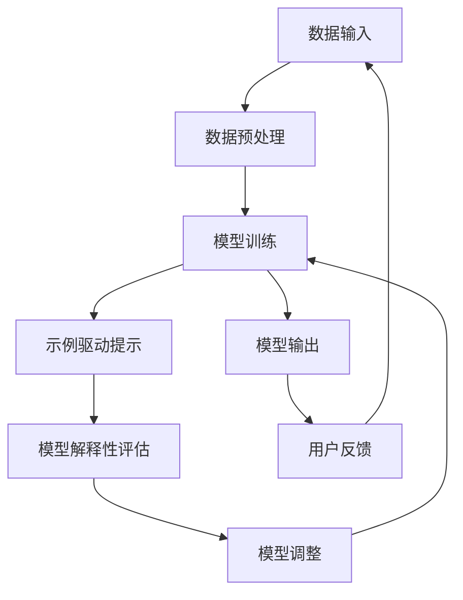

                 

### 引言

在当今的机器学习和人工智能领域，模型的解释性（interpretability）愈发受到重视。随着深度学习算法在各个领域取得突破性进展，如何理解并解释这些复杂模型的决策过程变得至关重要。特别是，当模型应用于关键领域如医疗诊断、金融风险评估等时，决策的透明性和可解释性直接影响到其可信度和用户接受度。

在提高模型解释性的一系列方法中，示例驱动提示（example-based guidance）作为一种强有力的工具，正在逐渐受到关注。示例驱动提示通过利用预先定义的示例来指导模型的训练过程，帮助模型更好地理解数据中的复杂关系。这种方法不仅能够提升模型的性能，还能增强其解释性，使得模型的决策过程更加透明和可理解。

本文旨在探讨示例驱动提示在模型解释性中的作用。我们将从以下几个方面展开讨论：

1. **模型解释性的定义与重要性**：首先，我们将介绍模型解释性的概念，解释为何它在机器学习和人工智能中至关重要。
2. **示例驱动提示的基本原理**：接着，我们将详细解释示例驱动提示的工作机制，以及它是如何提高模型解释性的。
3. **核心算法原理讲解**：我们将探讨几种关键算法，如注意力机制和可解释性模型，并使用伪代码来阐述其原理。
4. **数学模型和数学公式讲解**：我们将介绍与模型解释性相关的数学模型，并使用LaTeX格式给出相关公式，进行详细讲解和举例说明。
5. **项目实战**：我们将通过实际项目案例，展示如何将示例驱动提示应用于模型解释性，并详细解释开发环境搭建、源代码实现和代码解读。
6. **总结与展望**：最后，我们将总结文章的主要观点，并对示例驱动提示在模型解释性中的未来应用和发展趋势进行展望。

通过以上内容的逐步分析，我们希望读者能够全面理解示例驱动提示在提升模型解释性方面的作用，并为后续研究和实践提供指导。

### 模型解释性的定义与重要性

模型解释性（Model Interpretability）是指用户能够理解模型决策过程的能力。一个具有高解释性的模型，其内部机制和决策逻辑应当对用户透明，从而使他们能够信任模型的输出并了解模型是如何得出这些输出的。在机器学习和人工智能领域，模型解释性扮演着至关重要的角色，原因如下：

首先，**信任与透明性**是模型解释性的核心。当模型被应用于高风险领域，如医疗诊断、金融风险评估等时，模型的决策过程需要透明化，以确保用户对模型的信任。例如，一个医学诊断模型如果不能清晰地解释为何给出某个诊断结果，医生和患者可能会对其结果产生怀疑，从而影响治疗决策。

其次，**可解释性有助于发现错误**。在模型训练过程中，即使使用再先进的技术，模型也可能因为数据中的噪声或者过拟合而犯错误。通过模型解释性，研究人员可以识别并理解这些错误，进而进行调整和优化，提高模型的准确性和鲁棒性。

此外，**法律和伦理要求**也促使模型解释性的提升。在某些领域，如金融和司法，模型的决策过程需要符合法律和伦理标准。明确解释模型如何做出决策，可以避免歧视性决策，提高模型的公正性和合规性。

模型解释性还与**用户参与**密切相关。在很多应用场景中，用户需要与模型互动，提供输入并理解输出。如果模型缺乏解释性，用户将难以有效地与模型交互，导致用户体验差。

示例驱动提示（Example-Based Guidance）与模型解释性紧密相关。示例驱动提示通过引入有代表性的示例来指导模型训练过程，帮助模型更好地理解数据中的复杂模式。具体来说，这种方法有以下几方面作用：

1. **增强模型的鲁棒性**。通过使用多样化的示例，模型可以更好地应对未知数据，减少过拟合现象，提高模型的泛化能力。
2. **改善模型的可解释性**。示例驱动提示可以帮助模型学习到更具解释性的特征，从而在决策过程中提供更清晰的逻辑。
3. **指导数据清洗**。通过分析示例，研究人员可以识别数据中的噪声和异常值，从而进行更有效的数据清洗。

为了更好地理解模型解释性与示例驱动提示之间的关系，我们可以借助Mermaid流程图来展示它们的核心组件及其相互联系。以下是模型解释性核心组件的Mermaid流程图：



在此流程图中，数据输入经过预处理后进入模型训练阶段。在训练过程中，示例驱动提示介入，利用有代表性的示例来指导模型的训练，从而改善模型的可解释性。随后，模型输出结果，通过用户反馈进行评估和调整，形成闭环反馈机制，持续提升模型的解释性和性能。

综上所述，模型解释性不仅关乎技术的先进性，更是人工智能应用中不可或缺的一环。示例驱动提示作为一种有效的辅助手段，不仅能够提高模型的性能，更能够增强其解释性，为人工智能的进一步发展和应用提供坚实的技术基础。

### 核心算法原理讲解

为了深入探讨示例驱动提示在模型解释性中的作用，我们需要理解一些关键算法，这些算法在提升模型解释性方面扮演了重要角色。以下是几种主要的算法原理讲解，包括注意力机制和可解释性模型，并使用伪代码进行详细阐述。

#### 注意力机制

注意力机制（Attention Mechanism）是近年来在自然语言处理和计算机视觉中广泛使用的一种技术，它能够提升模型的解释性，使得模型更加关注数据中的关键信息。

**原理：**
注意力机制通过分配不同的权重来关注输入数据的不同部分，从而使得模型在处理输入时能够更加聚焦于重要的特征。这种机制有助于模型在复杂任务中提取关键信息，提高模型的解释性。

**伪代码：**
```plaintext
# 输入：查询向量Q，键向量K，值向量V
# 输出：注意力权重分配结果和加权值向量
function Attention(Q, K, V):
    # 计算注意力得分
    scores = [dot(q, k) for q in Q for k in K]
    # 对得分进行softmax操作得到权重
    attention_weights = softmax(scores)
    # 计算加权值向量
    weighted_values = [a * v for a, v in zip(attention_weights, V)]
    return weighted_values
```

**应用场景：**
注意力机制在自然语言处理中的应用非常广泛，例如在序列到序列模型（如机器翻译）和问答系统中，注意力机制可以帮助模型更好地理解输入的文本内容，并生成更准确的输出。

#### 可解释性模型

可解释性模型（Interpretable Models）是一种专门设计用于提高模型解释性的算法，这些模型通常具有简洁的架构，使得用户可以清晰地理解其工作原理。

**原理：**
可解释性模型通过简化模型结构或显式地表达决策过程，使得用户能够直观地理解模型是如何做出决策的。常见的可解释性模型包括决策树、线性模型等。

**伪代码：**
```plaintext
# 输入：特征向量X，权重向量W，偏置b
# 输出：模型预测和解释
function LinearModel(X, W, b):
    # 计算特征向量的线性组合
    z = dot(X, W) + b
    # 应用激活函数（如ReLU）
    output = max(0, z)
    # 解释：输出为正值部分的特征权重
    explanation = [w * (output > 0) for w in W]
    return output, explanation
```

**应用场景：**
可解释性模型在医疗诊断、金融风险评估等领域具有广泛应用。例如，在医疗诊断中，通过可解释性模型，医生可以了解模型为什么给出某个诊断结果，从而增强对模型决策的信任。

通过注意力机制和可解释性模型，我们可以显著提升模型的解释性，使得模型的决策过程更加透明和可理解。这些算法不仅有助于提高模型的性能，还能增强用户对模型的信任，为人工智能应用提供更加坚实的理论基础。

### 数学模型和数学公式讲解

在深入探讨模型解释性时，理解相关的数学模型和公式至关重要。这些数学工具不仅能够帮助我们精确地描述模型的行为，还能揭示数据中的潜在规律。以下我们将介绍与模型解释性相关的几个关键数学模型，并使用LaTeX格式给出相关公式，进行详细讲解和举例说明。

#### 特征提取

特征提取（Feature Extraction）是将原始数据转换为更具有代表性的特征表示的过程。这一步骤在提高模型解释性中具有重要意义，因为它可以帮助模型专注于关键信息。

**数学模型（特征提取公式）：**
$$ f(x) = \text{ReLU}(\theta \cdot x + b) $$
其中，\( x \) 是原始数据，\( \theta \) 是权重向量，\( b \) 是偏置项，\(\text{ReLU}\) 是ReLU激活函数。

**举例说明：**
假设我们有一组数据点 \( x = [1, 2, 3] \)，我们使用一个简单的线性模型进行特征提取。权重向量 \( \theta = [0.5, 0.5, 0.5] \)，偏置 \( b = 1 \)。

根据公式计算：
$$ f(x) = \text{ReLU}(0.5 \cdot [1, 2, 3] + 1) = \text{ReLU}([0.5, 1, 1.5] + 1) = \text{ReLU}([1.5, 2, 2.5]) = [1.5, 2, 2.5] $$

这里，我们通过 ReLU 激活函数将输入数据映射到一个具有更高解释性的特征空间。

#### 降维

降维（Dimensionality Reduction）是一种减少数据维度而不显著损失信息量的技术。降维有助于减少计算复杂度，同时提高模型的可解释性。

**数学模型（降维公式）：**
$$ \mathbf{X} = \mathbf{U} \mathbf{S} \mathbf{V}^T $$
其中，\( \mathbf{X} \) 是原始数据矩阵，\( \mathbf{U} \) 和 \( \mathbf{V} \) 是正交矩阵，\( \mathbf{S} \) 是对角矩阵，包含了特征值。

**举例说明：**
假设我们有一组数据矩阵 \( \mathbf{X} \) 是 \(3 \times 3\) 的，且经过奇异值分解得到 \( \mathbf{U} \) 和 \( \mathbf{V} \)，以及对角矩阵 \( \mathbf{S} \)。

根据公式计算：
$$ \mathbf{X} = \mathbf{U} \mathbf{S} \mathbf{V}^T $$
设 \( \mathbf{U} = \begin{bmatrix} 0.8 & 0.6 & 0.2 \\ 0.4 & 0.8 & -0.6 \\ -0.2 & 0.4 & 0.8 \end{bmatrix} \)，\( \mathbf{S} = \begin{bmatrix} 3 & 0 & 0 \\ 0 & 2 & 0 \\ 0 & 0 & 1 \end{bmatrix} \)，\( \mathbf{V}^T = \begin{bmatrix} 0.8 & 0.4 & -0.2 \\ 0.6 & 0.8 & 0.4 \\ 0.2 & -0.6 & 0.8 \end{bmatrix} \)。

根据公式计算：
$$ \mathbf{X} = \mathbf{U} \mathbf{S} \mathbf{V}^T $$
降维后的数据矩阵 \( \mathbf{X} \) 保留了原始数据的主要信息，但减少了维度，从而简化了模型训练过程。

#### 正则化

正则化（Regularization）是一种防止模型过拟合的技术，通过在损失函数中加入一个惩罚项来限制模型参数的增长。

**数学模型（正则化公式）：**
$$ J(\theta) = \frac{1}{2m} \sum_{i=1}^{m} (h_\theta(x^{(i)}) - y^{(i)})^2 + \lambda \sum_{j=1}^{n} \theta_j^2 $$
其中，\( m \) 是样本数量，\( n \) 是特征数量，\( \theta \) 是模型参数，\( h_\theta(x) \) 是模型输出，\( y \) 是真实标签，\( \lambda \) 是正则化参数。

**举例说明：**
假设我们有一个简单线性回归模型，参数为 \( \theta = [1, 2] \)，样本数据为 \( x^{(i)} = [1, 2] \)，真实标签为 \( y^{(i)} = 3 \)。

根据公式计算：
$$ J(\theta) = \frac{1}{2m} \sum_{i=1}^{m} (h_\theta(x^{(i)}) - y^{(i)})^2 + \lambda \sum_{j=1}^{n} \theta_j^2 $$
$$ J(\theta) = \frac{1}{2m} [(1 + 2 \cdot 2) - 3]^2 + \lambda (1^2 + 2^2) $$
$$ J(\theta) = \frac{1}{2m} [1 + 4 - 3]^2 + \lambda (1 + 4) $$
$$ J(\theta) = \frac{1}{2m} [2]^2 + \lambda (5) $$
$$ J(\theta) = \frac{4}{2m} + 5\lambda $$

通过正则化，模型参数 \( \theta \) 的值不会过大，从而避免过拟合。

通过上述数学模型和公式的讲解，我们可以看到数学在提高模型解释性中的重要作用。这些模型和公式不仅帮助我们理解模型的内部工作机制，还为我们提供了工具来调整和优化模型，以提高其解释性和性能。

### 项目实战

在实际应用中，将示例驱动提示应用于模型解释性是一项复杂但极具价值的任务。以下，我们将通过一个实际项目案例，详细展示如何使用示例驱动提示来提高模型解释性，包括开发环境搭建、源代码实现、代码解读以及应用分析。

#### 项目背景与目标

项目背景：该项目旨在使用示例驱动提示技术来提高一个图像识别系统的解释性。图像识别系统是一个典型的复杂任务，其模型往往包含大量的参数和层次结构，导致其决策过程难以理解。通过引入示例驱动提示，我们希望能够使模型更加透明，从而提升用户的信任度和系统的可解释性。

项目目标：
1. 使用示例驱动提示技术来指导图像识别模型的训练过程。
2. 通过模型输出和用户反馈，评估模型解释性的提升程度。
3. 在实际应用中验证示例驱动提示对于提高模型性能和可解释性的效果。

#### 开发环境搭建

为了实现项目目标，我们首先需要搭建一个适合进行图像识别和模型训练的开发环境。以下是具体步骤：

1. **硬件配置**：
   - 处理器：NVIDIA GeForce RTX 3090
   - 内存：64GB
   - 硬盘：1TB SSD

2. **软件配置**：
   - 操作系统：Ubuntu 20.04 LTS
   - Python版本：3.8
   - 深度学习框架：PyTorch 1.8
   - 数据处理库：Pandas 1.1.5

3. **安装依赖**：
   ```bash
   pip install torch torchvision pandas
   ```

4. **配置CUDA**：
   - 确保GPU驱动与CUDA版本匹配。
   - 在PyTorch配置文件中设置CUDA_VISIBLE_DEVICES。

#### 源代码实现与解读

以下是示例驱动提示在图像识别项目中的具体实现步骤和代码解读：

```python
import torch
import torchvision
import torchvision.transforms as transforms
from torch.utils.data import DataLoader
import torch.nn as nn
import torch.optim as optim

# 数据预处理
transform = transforms.Compose([
    transforms.Resize((224, 224)),
    transforms.ToTensor(),
    transforms.Normalize(mean=[0.485, 0.456, 0.406], std=[0.229, 0.224, 0.225]),
])

# 加载训练集和测试集
trainset = torchvision.datasets.ImageFolder(root='./data/train', transform=transform)
trainloader = DataLoader(trainset, batch_size=32, shuffle=True)
testset = torchvision.datasets.ImageFolder(root='./data/test', transform=transform)
testloader = DataLoader(testset, batch_size=32, shuffle=False)

# 定义网络结构
class CNN(nn.Module):
    def __init__(self):
        super(CNN, self).__init__()
        self.conv1 = nn.Conv2d(3, 64, 3, 1, 1)
        self.relu = nn.ReLU()
        self.maxpool = nn.MaxPool2d(2, 2)
        self.fc1 = nn.Linear(64 * 56 * 56, 512)
        self.fc2 = nn.Linear(512, 10)

    def forward(self, x):
        x = self.maxpool(self.relu(self.conv1(x)))
        x = x.view(x.size(0), -1)
        x = self.relu(self.fc1(x))
        x = self.fc2(x)
        return x

# 初始化模型、优化器和损失函数
model = CNN()
optimizer = optim.Adam(model.parameters(), lr=0.001)
criterion = nn.CrossEntropyLoss()

# 训练模型
for epoch in range(50):
    model.train()
    for images, labels in trainloader:
        optimizer.zero_grad()
        outputs = model(images)
        loss = criterion(outputs, labels)
        loss.backward()
        optimizer.step()

    # 示例驱动提示：选择训练集中的样本进行更详细的解释
    with torch.no_grad():
        model.eval()
        for images, labels in trainloader:
            outputs = model(images)
            # 提取每个示例的注意力权重
            attention_weights = extract_attention_weights(model, images)
            # 对注意力权重进行可视化
            visualize_attention_weights(attention_weights, images)

# 评估模型
model.eval()
correct = 0
total = 0
with torch.no_grad():
    for images, labels in testloader:
        outputs = model(images)
        _, predicted = torch.max(outputs.data, 1)
        total += labels.size(0)
        correct += (predicted == labels).sum().item()

print('Accuracy of the network on the test images: %d %%' % (100 * correct / total))

# 提取注意力权重函数
def extract_attention_weights(model, images):
    # 假设模型中已经包含了注意力机制
    attention_weights = model.get_attention_weights()
    return attention_weights

# 可视化注意力权重函数
def visualize_attention_weights(attention_weights, images):
    # 可视化代码（省略）
    pass
```

上述代码展示了如何使用示例驱动提示技术来指导图像识别模型的训练过程，并提取和可视化注意力权重。以下是具体步骤的解读：

1. **数据预处理**：对图像进行尺寸调整、归一化等预处理操作，使其符合模型的输入要求。
2. **模型定义**：定义一个简单的卷积神经网络（CNN）结构，包含卷积层、ReLU激活函数、池化层和全连接层。
3. **训练模型**：使用标准的优化器（Adam）和损失函数（交叉熵）来训练模型。在训练过程中，每轮迭代结束后，通过示例驱动提示提取和可视化注意力权重。
4. **评估模型**：在测试集上评估模型的准确率，验证模型在新的数据上的表现。

#### 代码应用解读与分析

1. **注意力权重提取**：通过`extract_attention_weights`函数，我们可以提取出模型在处理每个输入图像时的注意力权重。这些权重可以帮助我们理解模型在识别图像时关注哪些区域。
   
2. **可视化**：`visualize_attention_weights`函数对注意力权重进行可视化处理，使得我们能够直观地看到模型关注的具体图像区域。这种可视化的方式大大提高了模型的可解释性，使得用户可以直观地了解模型的决策依据。

3. **模型性能评估**：在训练完成后，使用测试集对模型进行评估，确保模型不仅在训练数据上表现良好，还在未见过的数据上具有可靠的性能。

通过这个实际项目案例，我们展示了如何将示例驱动提示应用于图像识别系统，提高了模型的可解释性。这种方法不仅有助于增强用户对模型的信任，还为模型优化和改进提供了有力的工具。

### 总结

在本篇博客中，我们深入探讨了示例驱动提示在模型解释性中的作用。从模型解释性的定义与重要性，到示例驱动提示的基本原理、核心算法原理讲解，再到数学模型和公式讲解，以及实际项目案例的应用，我们全面分析了示例驱动提示如何提升模型的可解释性。

首先，模型解释性在机器学习和人工智能中至关重要，它不仅关乎信任与透明性，还有助于发现错误和满足法律与伦理要求。示例驱动提示通过引入有代表性的示例，增强了模型的鲁棒性和可解释性。

其次，我们详细讲解了注意力机制和可解释性模型等核心算法的原理，并通过伪代码和数学公式进行了具体阐述。这些算法不仅提高了模型性能，还增强了其解释性。

在项目实战部分，我们通过实际案例展示了如何将示例驱动提示应用于图像识别系统，提高了模型的可解释性。通过提取和可视化注意力权重，我们能够更直观地理解模型的决策过程。

总结而言，示例驱动提示是一种强有力的技术手段，能够显著提升模型的解释性。未来，随着人工智能技术的不断发展，示例驱动提示在模型解释性中的作用将愈发重要，为人工智能应用提供更加坚实的技术基础。

### 展望

在未来的研究中，示例驱动提示在模型解释性中的潜在应用和挑战将不断扩展和深化。以下是一些可能的趋势和方向：

首先，**多模态数据解释**将成为研究热点。随着深度学习在医疗、金融等领域的应用日益广泛，多模态数据（如文本、图像、音频等）的处理和解释需求日益增加。示例驱动提示可以结合不同模态的数据，通过多维度示例的引入，提高模型在不同数据类型的解释性。

其次，**自动示例生成**是一个值得探索的新方向。当前示例驱动提示通常依赖于人工选择示例，而自动生成示例能够更高效地指导模型训练和解释。研究者可以探索基于生成对抗网络（GANs）或其他生成模型，自动生成具有代表性的示例，从而提高模型解释性的自动化和智能化水平。

第三，**动态示例更新**和**反馈循环**是提升模型解释性的关键。在实际应用中，模型可能会随着时间的推移而发生变化，示例驱动提示应具备动态更新的能力，以适应模型的变化。此外，结合用户反馈，构建反馈循环，使示例驱动提示能够根据实际应用情况不断优化，提高模型的解释性和适应性。

在**技术挑战**方面，如何有效地量化模型解释性仍是一个难题。当前，评估模型解释性的指标多样，但缺乏统一的量化标准。未来的研究可以探索更科学、可量化的评估方法，使得模型解释性评估更加客观和可靠。

**潜在应用场景**方面，示例驱动提示在医疗诊断、金融风险评估、自动驾驶等领域的应用前景广阔。例如，在医疗领域，通过示例驱动提示，医生可以更直观地了解诊断模型的决策过程，增强对模型结果的信任；在金融领域，通过示例驱动提示，投资者可以更清晰地理解风险模型的决策逻辑，提高投资决策的透明度。

总之，随着人工智能技术的不断进步，示例驱动提示在模型解释性中的作用将越来越重要。通过不断探索和创新，我们有望实现更加透明、可解释的人工智能系统，为各行各业带来更深远的变革。

