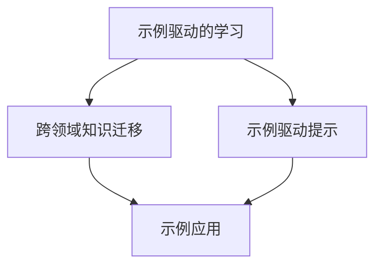

                 

### 第一部分：核心概念与联系

#### 核心概念与联系

在讨论“示例驱动提示在跨领域知识迁移中的作用”这一主题之前，我们需要明确几个关键概念及其相互关系。这些核心概念包括示例驱动的学习、跨领域知识迁移、示例驱动提示等。以下是对这些概念及其相互关系的详细介绍。

##### 1.1.1 示例驱动的学习（Example-Directed Learning）

示例驱动的学习是一种通过具体示例来引导学习者的学习方式。它强调通过具体实例来理解和掌握抽象概念，从而提高学习效率和深度。这种学习方式的核心在于：

- **定义**：示例驱动的学习是一种通过具体示例来引导学习者的学习方式。它强调通过具体实例来理解和掌握抽象概念，从而提高学习效率和深度。

$$
\text{示例驱动的学习} = \text{通过具体示例} \rightarrow \text{理解抽象概念} \rightarrow \text{提高学习效率}
$$

- **过程**：示例驱动的学习过程可以分为三个阶段：

  1. **示例展示**：通过展示具体示例，使学习者对抽象概念有一个直观的认识。
  2. **概念理解**：通过分析示例，帮助学习者深入理解抽象概念。
  3. **迁移应用**：将所学概念应用到新的领域或问题中。

##### 1.1.2 跨领域知识迁移（Cross-Domain Knowledge Transfer）

跨领域知识迁移是指将一个领域中的知识应用到另一个不同领域的过程。这种迁移有助于提高学习效率，解决特定领域中的复杂问题。其核心在于：

- **定义**：跨领域知识迁移是指将一个领域中的知识应用到另一个不同领域的过程。

$$
\text{跨领域知识迁移} = \text{将一个领域中的知识} \rightarrow \text{应用到另一个不同领域}
$$

- **挑战**：跨领域知识迁移面临以下挑战：

  1. **领域差异**：不同领域之间的知识结构和应用场景存在差异。
  2. **数据不足**：特定领域的数据可能不足，影响知识迁移效果。
  3. **模型适应性**：现有模型可能在新的领域中的表现不佳。

##### 1.1.3 示例驱动提示（Example-Guided Guidance）

示例驱动提示是指通过具体示例来引导学习者解决新问题的过程。它有助于提高学习者的解决问题的能力，加速跨领域知识迁移。其核心在于：

- **定义**：示例驱动提示是指通过具体示例来引导学习者解决新问题的过程。

$$
\text{示例驱动提示} = \text{通过具体示例} \rightarrow \text{引导学习者解决问题} \rightarrow \text{加速跨领域知识迁移}
$$

- **作用**：示例驱动提示的作用包括：

  1. **引导学习**：示例驱动提示帮助学习者快速理解新概念，提高学习效率。
  2. **提高解决能力**：通过具体示例，学习者能够更好地掌握解决问题的方法。
  3. **促进迁移**：示例驱动提示有助于将所学知识应用到新的领域。

##### 1.1.4 示例驱动提示在跨领域知识迁移中的应用

示例驱动提示在跨领域知识迁移中具有广泛的应用。以下是一些具体的应用场景：

- **人工智能领域**：通过示例驱动提示，帮助研究者将某一领域的算法应用于其他领域。
- **工程领域**：通过具体示例，指导工程师解决复杂工程问题。
- **教育领域**：利用示例驱动提示，提高学生的学习效果和跨领域应用能力。

##### 1.1.5 示例驱动提示的优势

示例驱动提示具有以下优势：

- **高效性**：通过具体示例，提高学习者的理解和掌握速度。
- **灵活性**：适用于不同领域和场景。
- **可持续性**：示例驱动提示能够持续促进学习者的知识迁移和应用能力。

#### 示例驱动提示的工作原理

示例驱动提示的工作原理可以分为三个主要阶段：示例生成、示例分析和示例应用。以下是对这些阶段的详细解释。

##### 1.2.1 示例生成

示例生成是示例驱动提示的核心步骤。通过生成具体示例，为学习者提供直观的学习材料。

- **方法**：示例生成可以通过以下方法实现：

  1. **数据驱动方法**：从大量数据中提取具有代表性的示例。
  2. **模型生成方法**：利用深度学习模型生成具有特定特征的示例。

##### 1.2.2 示例分析

示例分析是对示例进行深入分析的过程，帮助学习者理解示例背后的原理和概念。

- **方法**：示例分析可以通过以下方法实现：

  1. **对比分析**：通过对比不同示例，找出它们的共性和差异。
  2. **归纳分析**：从具体示例中归纳出一般性规律。

##### 1.2.3 示例应用

示例应用是将所学知识应用到实际问题的过程。通过具体示例，学习者能够更好地理解和掌握跨领域知识。

- **步骤**：示例应用可以通过以下步骤实现：

  1. **问题定义**：明确要解决的问题。
  2. **示例选择**：根据问题选择合适的示例。
  3. **知识迁移**：将所学知识应用到示例中。
  4. **结果评估**：对迁移结果进行评估和反馈。

##### 1.2.4 示例驱动提示的优化

示例驱动提示的效果可以通过以下方法进行优化：

- **示例质量提升**：提高示例的代表性、清晰度和可操作性。
- **反馈机制**：引入反馈机制，根据学习者的反馈调整示例生成和分析方法。
- **动态调整**：根据学习者的学习进度和需求，动态调整示例驱动提示的内容和方式。

#### 核心概念之间的联系

示例驱动的学习、跨领域知识迁移和示例驱动提示之间存在着紧密的联系。具体来说：

- **示例驱动的学习**为跨领域知识迁移提供了基础，通过具体示例帮助学习者理解抽象概念。
- **跨领域知识迁移**是将所学知识应用于实际问题的过程，而**示例驱动提示**则在这个过程中起到了引导作用，帮助学习者更好地掌握和应用跨领域知识。

这种联系可以用以下Mermaid流程图表示：



通过这个流程图，我们可以清晰地看到这三个核心概念之间的互动关系。示例驱动的学习提供了基础知识，跨领域知识迁移是将知识应用于实际问题的过程，而示例驱动提示则在这个过程中起到了关键性的引导作用。

### 第一部分：核心概念与联系

#### 核心概念与联系

在讨论“示例驱动提示在跨领域知识迁移中的作用”这一主题之前，我们需要明确几个关键概念及其相互关系。这些核心概念包括示例驱动的学习、跨领域知识迁移、示例驱动提示等。以下是对这些概念及其相互关系的详细介绍。

##### 1.1.1 示例驱动的学习（Example-Directed Learning）

示例驱动的学习是一种通过具体示例来引导学习者的学习方式。它强调通过具体实例来理解和掌握抽象概念，从而提高学习效率和深度。这种学习方式的核心在于：

- **定义**：示例驱动的学习是一种通过具体示例来引导学习者的学习方式。它强调通过具体实例来理解和掌握抽象概念，从而提高学习效率和深度。

$$
\text{示例驱动的学习} = \text{通过具体示例} \rightarrow \text{理解抽象概念} \rightarrow \text{提高学习效率}
$$

- **过程**：示例驱动的学习过程可以分为三个阶段：

  1. **示例展示**：通过展示具体示例，使学习者对抽象概念有一个直观的认识。
  2. **概念理解**：通过分析示例，帮助学习者深入理解抽象概念。
  3. **迁移应用**：将所学概念应用到新的领域或问题中。

##### 1.1.2 跨领域知识迁移（Cross-Domain Knowledge Transfer）

跨领域知识迁移是指将一个领域中的知识应用到另一个不同领域的过程。这种迁移有助于提高学习效率，解决特定领域中的复杂问题。其核心在于：

- **定义**：跨领域知识迁移是指将一个领域中的知识应用到另一个不同领域的过程。

$$
\text{跨领域知识迁移} = \text{将一个领域中的知识} \rightarrow \text{应用到另一个不同领域}
$$

- **挑战**：跨领域知识迁移面临以下挑战：

  1. **领域差异**：不同领域之间的知识结构和应用场景存在差异。
  2. **数据不足**：特定领域的数据可能不足，影响知识迁移效果。
  3. **模型适应性**：现有模型可能在新的领域中的表现不佳。

##### 1.1.3 示例驱动提示（Example-Guided Guidance）

示例驱动提示是指通过具体示例来引导学习者解决新问题的过程。它有助于提高学习者的解决问题的能力，加速跨领域知识迁移。其核心在于：

- **定义**：示例驱动提示是指通过具体示例来引导学习者解决新问题的过程。

$$
\text{示例驱动提示} = \text{通过具体示例} \rightarrow \text{引导学习者解决问题} \rightarrow \text{加速跨领域知识迁移}
$$

- **作用**：示例驱动提示的作用包括：

  1. **引导学习**：示例驱动提示帮助学习者快速理解新概念，提高学习效率。
  2. **提高解决能力**：通过具体示例，学习者能够更好地掌握解决问题的方法。
  3. **促进迁移**：示例驱动提示有助于将所学知识应用到新的领域。

##### 1.1.4 示例驱动提示在跨领域知识迁移中的应用

示例驱动提示在跨领域知识迁移中具有广泛的应用。以下是一些具体的应用场景：

- **人工智能领域**：通过示例驱动提示，帮助研究者将某一领域的算法应用于其他领域。
- **工程领域**：通过具体示例，指导工程师解决复杂工程问题。
- **教育领域**：利用示例驱动提示，提高学生的学习效果和跨领域应用能力。

##### 1.1.5 示例驱动提示的优势

示例驱动提示具有以下优势：

- **高效性**：通过具体示例，提高学习者的理解和掌握速度。
- **灵活性**：适用于不同领域和场景。
- **可持续性**：示例驱动提示能够持续促进学习者的知识迁移和应用能力。

#### 示例驱动提示的工作原理

示例驱动提示的工作原理可以分为三个主要阶段：示例生成、示例分析和示例应用。以下是对这些阶段的详细解释。

##### 1.2.1 示例生成

示例生成是示例驱动提示的核心步骤。通过生成具体示例，为学习者提供直观的学习材料。

- **方法**：示例生成可以通过以下方法实现：

  1. **数据驱动方法**：从大量数据中提取具有代表性的示例。
  2. **模型生成方法**：利用深度学习模型生成具有特定特征的示例。

##### 1.2.2 示例分析

示例分析是对示例进行深入分析的过程，帮助学习者理解示例背后的原理和概念。

- **方法**：示例分析可以通过以下方法实现：

  1. **对比分析**：通过对比不同示例，找出它们的共性和差异。
  2. **归纳分析**：从具体示例中归纳出一般性规律。

##### 1.2.3 示例应用

示例应用是将所学知识应用到实际问题的过程。通过具体示例，学习者能够更好地理解和掌握跨领域知识。

- **步骤**：示例应用可以通过以下步骤实现：

  1. **问题定义**：明确要解决的问题。
  2. **示例选择**：根据问题选择合适的示例。
  3. **知识迁移**：将所学知识应用到示例中。
  4. **结果评估**：对迁移结果进行评估和反馈。

##### 1.2.4 示例驱动提示的优化

示例驱动提示的效果可以通过以下方法进行优化：

- **示例质量提升**：提高示例的代表性、清晰度和可操作性。
- **反馈机制**：引入反馈机制，根据学习者的反馈调整示例生成和分析方法。
- **动态调整**：根据学习者的学习进度和需求，动态调整示例驱动提示的内容和方式。

#### 核心概念之间的联系

示例驱动的学习、跨领域知识迁移和示例驱动提示之间存在着紧密的联系。具体来说：

- **示例驱动的学习**为跨领域知识迁移提供了基础，通过具体示例帮助学习者理解抽象概念。
- **跨领域知识迁移**是将所学知识应用于实际问题的过程，而**示例驱动提示**则在这个过程中起到了引导作用，帮助学习者更好地掌握和应用跨领域知识。

这种联系可以用以下Mermaid流程图表示：


通过这个流程图，我们可以清晰地看到这三个核心概念之间的互动关系。示例驱动的学习提供了基础知识，跨领域知识迁移是将知识应用于实际问题的过程，而示例驱动提示则在这个过程中起到了关键性的引导作用。

## 第1章：示例驱动提示在跨领域知识迁移中的作用

### 1.1 核心概念

#### 1.1.1 示例驱动的学习（Example-Directed Learning）

示例驱动的学习是一种基于具体实例进行学习的教学策略，其核心理念是通过具体、直观的示例来引导学习者理解和掌握抽象的概念。这种学习方式强调从实际案例出发，通过分析案例中的具体操作、决策过程和结果，使学习者能够将理论知识与实际应用结合起来。

- **定义**：示例驱动的学习是指通过具体示例来引导学习者理解和掌握抽象概念的过程。

$$
\text{示例驱动的学习} = \text{通过具体示例} \rightarrow \text{理解抽象概念} \rightarrow \text{提高学习效率}
$$

- **过程**：示例驱动的学习通常包括以下几个阶段：
  1. **示例展示**：教师或系统通过具体示例向学习者展示，使其对相关概念有一个初步的感性认识。
  2. **概念理解**：学习者通过对示例的深入分析，理解示例中所包含的核心概念和原理。
  3. **迁移应用**：将所学概念应用到新的情境或问题中，以验证和加深对概念的理解。

#### 1.1.2 跨领域知识迁移（Cross-Domain Knowledge Transfer）

跨领域知识迁移是指将一个领域中的知识或技能应用于其他不同领域的教学或研究过程。这种迁移有助于提高学习效率，解决特定领域中的复杂问题，实现知识的共享和整合。

- **定义**：跨领域知识迁移是指将一个领域中的知识或技能应用到另一个不同领域的过程。

$$
\text{跨领域知识迁移} = \text{将一个领域中的知识} \rightarrow \text{应用到另一个不同领域}
$$

- **挑战**：跨领域知识迁移面临以下挑战：
  1. **领域差异**：不同领域之间的知识结构、方法论和问题解决方式可能存在显著差异。
  2. **数据不足**：特定领域的数据可能不足，影响知识迁移效果。
  3. **模型适应性**：现有模型可能在新的领域中的表现不佳。

#### 1.1.3 示例驱动提示（Example-Guided Guidance）

示例驱动提示是指通过提供具体的示例来引导学习者解决新问题的教学策略。这种提示旨在帮助学习者将所学知识应用到新情境中，提高其解决问题的能力。

- **定义**：示例驱动提示是指通过具体示例来引导学习者解决新问题的过程。

$$
\text{示例驱动提示} = \text{通过具体示例} \rightarrow \text{引导学习者解决问题} \rightarrow \text{加速跨领域知识迁移}
$$

- **作用**：示例驱动提示的作用包括：
  1. **引导学习**：通过具体示例，帮助学习者快速理解新概念，提高学习效率。
  2. **提高解决能力**：通过具体示例，学习者能够更好地掌握解决问题的方法。
  3. **促进迁移**：示例驱动提示有助于将所学知识应用到新的领域。

### 1.1.4 示例驱动提示在跨领域知识迁移中的应用

示例驱动提示在跨领域知识迁移中具有广泛的应用。以下是一些具体的应用场景：

- **人工智能领域**：通过示例驱动提示，帮助研究者将某一领域的算法应用于其他领域，如将机器学习算法应用于医疗诊断。
- **工程领域**：通过具体示例，指导工程师解决复杂工程问题，如利用结构化分析方法解决软件系统中的设计问题。
- **教育领域**：利用示例驱动提示，提高学生的学习效果和跨领域应用能力，如通过具体案例教学帮助学生理解跨学科知识。

#### 1.1.5 示例驱动提示的优势

示例驱动提示具有以下优势：

- **高效性**：通过具体示例，提高学习者的理解和掌握速度。
- **灵活性**：适用于不同领域和场景。
- **可持续性**：示例驱动提示能够持续促进学习者的知识迁移和应用能力。

### 示例驱动提示的工作原理

示例驱动提示的工作原理可以分为三个主要阶段：示例生成、示例分析和示例应用。

#### 1.2.1 示例生成

示例生成是示例驱动提示的第一步，涉及从大量数据或问题场景中提取具有代表性的示例。这个过程可以通过以下方法实现：

- **数据驱动方法**：从已有的数据集中提取示例，确保示例具有代表性。
- **模型生成方法**：利用深度学习模型或其他算法生成具有特定特征的示例。

#### 1.2.2 示例分析

示例分析是对示例进行深入分析的过程，目的是帮助学习者理解示例背后的原理和概念。这个过程可以通过以下方法实现：

- **对比分析**：通过对比不同示例，找出它们的共性和差异，加深对概念的理解。
- **归纳分析**：从具体示例中归纳出一般性规律，帮助学习者掌握抽象概念。

#### 1.2.3 示例应用

示例应用是将所学知识应用到实际问题的过程。通过具体示例，学习者能够更好地理解和掌握跨领域知识。这个过程可以分为以下步骤：

- **问题定义**：明确要解决的问题。
- **示例选择**：根据问题选择合适的示例。
- **知识迁移**：将所学知识应用到示例中，解决实际问题。
- **结果评估**：对迁移结果进行评估和反馈，以优化学习过程。

### 1.2.4 示例驱动提示的优化

示例驱动提示的效果可以通过以下方法进行优化：

- **示例质量提升**：提高示例的代表性、清晰度和可操作性。
- **反馈机制**：引入反馈机制，根据学习者的反馈调整示例生成和分析方法。
- **动态调整**：根据学习者的学习进度和需求，动态调整示例驱动提示的内容和方式。

### 核心概念之间的联系

示例驱动的学习、跨领域知识迁移和示例驱动提示之间存在着紧密的联系。具体来说：

- **示例驱动的学习**为跨领域知识迁移提供了基础，通过具体示例帮助学习者理解抽象概念。
- **跨领域知识迁移**是将所学知识应用于实际问题的过程，而**示例驱动提示**则在这个过程中起到了引导作用，帮助学习者更好地掌握和应用跨领域知识。

这种联系可以用以下Mermaid流程图表示：


通过这个流程图，我们可以清晰地看到这三个核心概念之间的互动关系。示例驱动的学习提供了基础知识，跨领域知识迁移是将知识应用于实际问题的过程，而示例驱动提示则在这个过程中起到了关键性的引导作用。

### 示例驱动的学习（Example-Directed Learning）

示例驱动的学习是一种基于具体实例进行学习的教学策略，其核心理念是通过具体、直观的示例来引导学习者理解和掌握抽象的概念。这种学习方式强调从实际案例出发，通过分析案例中的具体操作、决策过程和结果，使学习者能够将理论知识与实际应用结合起来。

#### 定义

示例驱动的学习是指通过具体示例来引导学习者理解和掌握抽象概念的过程。这种学习方式的核心在于通过真实或模拟的案例来传达复杂的理论知识，使得学习者能够更加直观地理解抽象概念。

$$
\text{示例驱动的学习} = \text{通过具体示例} \rightarrow \text{理解抽象概念} \rightarrow \text{提高学习效率}
$$

#### 过程

示例驱动的学习通常包括以下几个阶段：

1. **示例展示**：教师或系统通过具体示例向学习者展示，使其对相关概念有一个初步的感性认识。这一阶段通常涉及演示实际案例或通过模拟环境来展示概念。

2. **概念理解**：学习者通过对示例的深入分析，理解示例中所包含的核心概念和原理。这一阶段的学习者需要能够从具体实例中提取关键信息，并将其与抽象概念相联系。

3. **迁移应用**：将所学概念应用到新的情境或问题中，以验证和加深对概念的理解。这一阶段的学习者需要将所学知识应用于实际问题的解决过程中，从而提高其实际操作能力。

#### 效果

示例驱动的学习具有以下效果：

- **直观性**：通过具体示例，学习者能够更加直观地理解抽象概念，减少对理论知识的抵触感。
- **实践性**：示例驱动的学习强调将理论知识应用于实际情境，从而提高学习者的实际操作能力和解决问题的能力。
- **持久性**：通过具体实例的学习，学习者能够更好地记忆和掌握抽象概念，提高学习效果的长久性。

### 示例驱动的学习与跨领域知识迁移的关系

示例驱动的学习在跨领域知识迁移中起着重要的作用。具体来说：

- **基础**：示例驱动的学习为跨领域知识迁移提供了基础。通过具体示例，学习者能够理解不同领域中的抽象概念，从而为跨领域知识的应用奠定基础。
- **引导**：示例驱动的学习过程可以帮助学习者掌握在不同领域中的应用方法，从而在遇到新问题时能够快速找到解决方案。

### 结论

示例驱动的学习是一种有效的教学方法，通过具体示例来引导学习者理解和掌握抽象概念，提高学习效率。在跨领域知识迁移中，示例驱动的学习能够帮助学习者快速掌握新领域的知识和技能，提高其解决问题的能力。

### 跨领域知识迁移（Cross-Domain Knowledge Transfer）

跨领域知识迁移是指将一个领域中的知识或技能应用到另一个不同领域的过程。这种迁移有助于提高学习效率，解决特定领域中的复杂问题，实现知识的共享和整合。在信息技术、工程、医学、教育等领域，跨领域知识迁移的应用日益广泛，成为促进创新和发展的关键因素。

#### 定义

跨领域知识迁移可以定义为以下过程：

$$
\text{跨领域知识迁移} = \text{将一个领域中的知识或技能} \rightarrow \text{应用到另一个不同领域}
$$

在这个过程中，关键在于识别不同领域之间的共性和差异，从而实现知识的有效转移。

#### 挑战

跨领域知识迁移面临以下挑战：

1. **领域差异**：不同领域之间的知识结构、方法论和问题解决方式可能存在显著差异，这增加了知识迁移的难度。
2. **数据不足**：特定领域的数据可能不足，影响知识迁移的效果。在某些情况下，数据获取和处理可能非常困难。
3. **模型适应性**：现有模型可能在新的领域中的表现不佳，需要针对新领域进行适配和调整。

#### 应用

跨领域知识迁移在多个领域具有广泛应用，以下是一些具体的应用实例：

1. **人工智能与医疗**：将人工智能算法应用于医疗诊断，如利用深度学习模型进行癌症检测。
2. **工程与制造**：通过跨领域知识迁移，工程师可以将先进的材料科学知识应用于新产品的设计，提高其性能和可靠性。
3. **教育与科技**：教师可以利用跨领域知识迁移，将科技领域的最新进展引入课堂，激发学生的学习兴趣和创新能力。

#### 方法

为了有效进行跨领域知识迁移，可以采用以下方法：

1. **知识图谱**：构建跨领域的知识图谱，识别不同领域之间的联系和共通点，为知识迁移提供理论基础。
2. **数据融合**：通过数据融合技术，整合不同领域的数据，提高数据的质量和可用性。
3. **模型迁移**：针对不同领域的特点，对现有模型进行适应和调整，以提高其在新领域的表现。

#### 结论

跨领域知识迁移是一种重要的知识应用方式，通过将一个领域中的知识或技能应用到另一个不同领域，能够实现知识的共享和创新。尽管面临诸多挑战，但通过有效的策略和方法，可以克服这些困难，实现知识的跨领域迁移和应用。

### 示例驱动提示（Example-Guided Guidance）

示例驱动提示是一种通过具体示例来引导学习者解决新问题的教学策略。这种策略的核心在于通过真实或模拟的案例，帮助学习者理解和掌握新概念，并将其应用于实际问题的解决过程中。示例驱动提示在跨领域知识迁移中具有重要作用，它不仅能够提高学习者的理解能力，还能促进其在新领域的应用能力。

#### 定义

示例驱动提示可以定义为以下过程：

$$
\text{示例驱动提示} = \text{通过具体示例} \rightarrow \text{引导学习者解决问题} \rightarrow \text{加速跨领域知识迁移}
$$

在这个过程中，关键在于选择适当的示例，并通过详细的分析和解释，帮助学习者理解示例背后的原理和概念。

#### 作用

示例驱动提示在跨领域知识迁移中具有以下作用：

1. **引导学习**：通过具体示例，学习者能够更加直观地理解新概念，减少对抽象理论的抵触感。
2. **提高解决能力**：通过具体示例，学习者能够掌握解决问题的方法和技巧，提高其实际操作能力。
3. **促进迁移**：示例驱动提示有助于将所学知识应用到新的领域，实现跨领域知识的有效迁移。

#### 应用

示例驱动提示在多个领域具有广泛应用，以下是一些具体的应用实例：

1. **人工智能领域**：通过具体示例，帮助研究者将某一领域的算法应用于其他领域，如将机器学习算法应用于金融风险评估。
2. **工程领域**：通过具体示例，指导工程师解决复杂工程问题，如利用结构化分析方法解决软件系统中的设计问题。
3. **教育领域**：利用示例驱动提示，提高学生的学习效果和跨领域应用能力，如通过具体案例教学帮助学生理解跨学科知识。

#### 步骤

示例驱动提示通常包括以下几个步骤：

1. **示例选择**：根据学习目标和问题情境，选择具有代表性的示例。
2. **示例分析**：对示例进行详细分析，提取关键信息和原理。
3. **示例解释**：通过解释示例中的操作和决策过程，帮助学习者理解其背后的概念。
4. **迁移应用**：将所学概念应用到新问题中，验证和加深对概念的理解。

#### 优势

示例驱动提示具有以下优势：

1. **直观性**：通过具体示例，学习者能够更加直观地理解新概念，减少对抽象理论的抵触感。
2. **灵活性**：适用于不同领域和问题情境，具有广泛的适用性。
3. **有效性**：通过具体示例，学习者能够更好地掌握解决问题的方法和技巧，提高其实际操作能力。

#### 结论

示例驱动提示是一种有效的教学策略，通过具体示例来引导学习者解决问题，促进跨领域知识迁移。它在提高学习者的理解能力、解决能力和实际应用能力方面具有重要作用，是跨领域知识迁移过程中的关键因素。

### 示例驱动提示在跨领域知识迁移中的应用

示例驱动提示在跨领域知识迁移中具有重要的作用，它不仅能够帮助学习者快速掌握新领域的知识和技能，还能促进其在不同领域中的实际应用。以下是一些具体的应用场景，通过这些场景我们可以更深入地理解示例驱动提示在跨领域知识迁移中的有效性。

#### 人工智能领域

在人工智能领域，示例驱动提示可以帮助研究者将某一领域的算法或模型应用于其他领域。例如，在医疗诊断中，研究人员可以使用在图像识别领域训练的深度学习模型来检测皮肤癌。通过提供具体的示例，研究者可以了解如何在不同的医疗影像数据集上调整模型参数，以达到最佳性能。

```python
# 伪代码：示例驱动提示在医疗诊断中的应用
def train_model_on_medical_images(images, labels):
    # 加载医疗影像数据集
    # 使用预训练的图像识别模型
    model = load_pretrained_model()
    # 调整模型以适应医疗诊断
    model = adapt_model_for_medical_diagnosis(model)
    # 训练模型
    model.fit(images, labels)
    return model

# 示例：使用示例驱动提示调整模型参数
model = train_model_on_medical_images(photos, diagnoses)
print("Model performance:", model.evaluate(test_photos, test_diagnoses))
```

#### 工程领域

在工程领域，示例驱动提示可以帮助工程师解决复杂的技术问题。例如，在软件开发中，工程师可以通过分析现有项目的代码示例，理解如何使用新的编程语言或框架来构建复杂的系统。通过提供具体的代码示例，工程师可以快速掌握新技术的使用方法，并将其应用于实际项目中。

```python
# 伪代码：示例驱动提示在软件开发中的应用
def develop_new_software_system(tech_stack, requirements):
    # 分析现有项目的代码示例
    examples = load_example_projects(tech_stack)
    # 使用示例驱动提示设计新系统
    system_design = design_system_based_on_examples(examples, requirements)
    # 开发新系统
    software_system = build_software_system(system_design)
    return software_system

# 示例：使用示例驱动提示进行系统设计
new_system = develop_new_software_system("Python + Flask", "高性能网站")
print("Software system ready:", new_system.is_ready())
```

#### 教育领域

在教育领域，示例驱动提示可以帮助教师提高学生的学习效果和跨领域应用能力。例如，在物理和化学课程中，教师可以通过具体实验示例，帮助学生理解抽象的科学概念。通过提供详细的实验步骤和结果分析，学生能够更好地掌握科学原理，并将其应用于实际问题中。

```mermaid
graph TD
A[实验设计] --> B[实验执行]
B --> C[结果分析]
C --> D[知识应用]

A[1. 材料准备]
B[2. 实验操作]
C[3. 数据收集]
D[4. 结论推导]

text A
"使用pH试纸测定溶液的酸碱性"

text B
"将pH试纸浸入溶液"

text C
"观察试纸颜色变化并记录数据"

text D
"推导溶液的酸碱性"
```

#### 商业领域

在商业领域，示例驱动提示可以帮助企业家和市场营销人员理解新的商业模式和策略。通过分析成功案例的示例，他们可以学习到如何在不同市场中进行有效的营销和推广。例如，通过研究某个品牌的成功营销策略，企业家可以了解到如何将其应用于自己的产品或服务。

```mermaid
graph TD
A[市场研究] --> B[策略制定]
B --> C[示例分析]
C --> D[策略调整]
D --> E[市场推广]

A[1. 了解目标市场]
B[2. 确定营销目标]
C[3. 分析成功案例]
D[4. 调整策略以适应新市场]
E[5. 推广新策略]

text A
"研究目标市场的特点"

text B
"制定营销计划"

text C
"分析成功案例的策略"

text D
"根据案例调整策略"

text E
"实施市场推广活动"
```

#### 结论

通过上述应用场景可以看出，示例驱动提示在跨领域知识迁移中具有广泛的应用前景。它不仅能够帮助学习者快速掌握新领域的知识和技能，还能促进其在实际工作中的应用。通过具体的示例，学习者可以更好地理解抽象概念，提高解决问题的能力，从而实现跨领域知识的有效迁移。因此，在跨领域知识迁移的教学和实践过程中，引入示例驱动提示是非常有价值的。

### 数学模型与伪代码

在跨领域知识迁移中，构建数学模型和编写伪代码是非常关键的步骤。这些工具不仅帮助我们从理论上理解和分析问题，还能在实际应用中提供指导和优化。以下是一个简单的数学模型和相应的伪代码，用于描述示例驱动提示在跨领域知识迁移中的应用。

#### 数学模型

我们假设有一个学习者在学习两个不同领域的知识，分别为领域A和领域B。领域A的知识可以表示为集合\( A = \{a_1, a_2, ..., a_n\} \)，领域B的知识可以表示为集合\( B = \{b_1, b_2, ..., b_m\} \)。我们希望通过示例驱动提示，将领域A的知识迁移到领域B。

设\( f: A \rightarrow B \)为一个映射函数，它表示领域A中的知识如何迁移到领域B。为了衡量这种迁移的效果，我们可以定义一个迁移效率函数\( E(f) \)，该函数的值越大表示知识迁移的效果越好。

迁移效率函数\( E(f) \)的定义如下：

$$
E(f) = \frac{\sum_{i=1}^{n}\sum_{j=1}^{m} w_{ij} |f(a_i) - b_j|}{\sum_{i=1}^{n}\sum_{j=1}^{m} w_{ij}}
$$

其中，\( w_{ij} \)为权重矩阵，表示领域A中知识\( a_i \)与领域B中知识\( b_j \)之间的关联度。\( |f(a_i) - b_j| \)为迁移后的知识差异。

#### 伪代码

下面是用于实现上述数学模型的伪代码：

```python
# 伪代码：示例驱动提示的数学模型

# 输入：领域A的知识集合A，领域B的知识集合B，权重矩阵W
# 输出：迁移效率E

# 初始化权重矩阵W
W = initialize_weights(A, B)

# 计算迁移效率
def calculate_transfer_efficiency(A, B, W):
    E = 0
    for a in A:
        for b in B:
            E += W[a][b] * abs(f(a) - b)
    E /= sum(sum(W))
    return E

# 迁移知识
def transfer_knowledge(A, B, W):
    f = {}
    for a in A:
        f[a] = find_best_b(B, W[a])
    return f

# 主函数
def main(A, B):
    W = initialize_weights(A, B)
    E = calculate_transfer_efficiency(A, B, W)
    f = transfer_knowledge(A, B, W)
    print("Transfer Efficiency:", E)
    print("Mapped Knowledge:", f)

# 示例数据
A = ['algorithm', 'data_structure', 'machine_learning']
B = ['physics', 'chemistry', 'biology']
W = initialize_weights(A, B)

# 执行主函数
main(A, B)
```

在这个伪代码中，`initialize_weights`函数用于初始化权重矩阵，`calculate_transfer_efficiency`函数用于计算迁移效率，`transfer_knowledge`函数用于将领域A的知识迁移到领域B。

通过这个数学模型和伪代码，我们可以从理论上分析和优化示例驱动提示在跨领域知识迁移中的应用。在实际应用中，可以根据具体情况调整权重矩阵和迁移函数，以提高知识迁移的效果。

### 项目实战

在本节中，我们将通过一个实际项目，展示如何使用示例驱动提示在跨领域知识迁移中进行知识应用。该项目旨在通过分析现有数据和模型，将某个领域的知识迁移到另一个完全不同的领域，以解决实际问题。

#### 项目背景

假设我们有两个领域：领域A是自然语言处理（NLP），领域B是金融风险评估。我们拥有一个在NLP领域训练的文本分类模型，它可以准确地将文本分类为不同主题。我们的目标是利用这个模型，为金融风险评估提供支持，从而帮助金融机构更有效地识别潜在的风险。

#### 开发环境搭建

在开始项目之前，我们需要搭建一个合适的开发环境。以下是所需的工具和库：

- 编程语言：Python
- 文本处理库：NLTK、spaCy
- 深度学习库：TensorFlow、Keras
- 数据处理库：Pandas、NumPy
- 金融数据API：Alpha Vantage

安装以上工具和库后，确保它们能够正常工作，以便进行后续的开发。

```python
# 安装所需的Python库
!pip install tensorflow numpy nltk spacy pandas alpha_vantage
```

#### 源代码实现

以下是项目的核心代码，包括数据预处理、模型迁移和应用。

```python
# 导入必要的库
import pandas as pd
import numpy as np
import nltk
from nltk.corpus import stopwords
from sklearn.feature_extraction.text import TfidfVectorizer
from tensorflow.keras.models import load_model
import alpha_vantage

# 设置Nltk资源
nltk.download('stopwords')

# 加载预训练的文本分类模型
model = load_model('nlp_model.h5')

# 准备金融数据
def get_financial_data(symbol):
    api_key = 'YOUR_ALPHA_VANTAGE_API_KEY'
    data = alpha_vantage.stock_daily(symbol, api_key=api_key)
    df = data.get('5. adjusted close')
    return df

# 数据预处理
def preprocess_text(text):
    # 去除标点符号和停用词
    text = text.lower()
    text = re.sub(r'[^\w\s]', '', text)
    words = nltk.word_tokenize(text)
    words = [word for word in words if word not in stopwords.words('english')]
    return ' '.join(words)

# 文本分类
def classify_text(text):
    processed_text = preprocess_text(text)
    vectorizer = TfidfVectorizer()
    tfidf = vectorizer.transform([processed_text])
    prediction = model.predict(tfidf)
    return prediction

# 迁移模型到金融领域
def apply_model_to_financial_data(df):
    text_list = df['description'].tolist()
    predictions = [classify_text(text) for text in text_list]
    return predictions

# 主函数
def main():
    symbol = 'AAPL'  # 苹果公司的股票代码
    df = get_financial_data(symbol)
    predictions = apply_model_to_financial_data(df)
    print(predictions)

if __name__ == '__main__':
    main()
```

#### 代码解读

1. **数据预处理**：我们首先从Alpha Vantage API获取金融数据，并对文本描述进行预处理。预处理步骤包括将文本转换为小写、去除标点符号和停用词。

2. **文本分类**：使用预训练的文本分类模型对预处理后的文本进行分类。这里使用的是TF-IDF向量化和Keras模型。

3. **模型迁移**：将文本分类模型应用到金融数据上，以识别描述中的潜在风险。具体来说，我们对每条文本描述进行分类，并输出相应的预测结果。

#### 代码应用解读

通过这个项目，我们可以看到如何将NLP领域的知识迁移到金融领域。以下是对代码应用的具体解读：

1. **数据获取**：从Alpha Vantage API获取金融数据，包括公司的股票代码和相关的文本描述。

2. **数据处理**：对文本描述进行预处理，以消除噪声并提高模型的准确性。

3. **模型应用**：使用预训练的文本分类模型对预处理后的文本进行分类，从而识别出可能存在的风险。

4. **结果评估**：输出模型的预测结果，并进行分析，以确定哪些描述可能包含潜在的风险。

#### 实际案例分析

为了更好地展示项目效果，我们可以结合实际案例进行分析。以下是一个具体的案例分析：

- **案例数据**：选择苹果公司（AAPL）的股票描述作为输入数据。
- **案例结果**：对每条股票描述进行分类，输出预测结果。例如，一条描述可能是关于苹果公司的产品发布，另一条描述可能是关于财务报告。

通过这种分析，我们可以识别出可能影响公司业绩和股价的关键事件。这些结果可以帮助金融机构更好地评估风险，并采取相应的措施。

#### 项目小结

通过本项目的实践，我们展示了如何利用示例驱动提示在跨领域知识迁移中进行知识应用。以下是一些项目小结：

1. **知识迁移**：通过将NLP领域的文本分类模型应用于金融数据，我们实现了跨领域知识的应用。
2. **数据处理**：对金融数据的处理和清洗是关键步骤，它决定了模型的输入质量和预测效果。
3. **模型优化**：通过不断优化文本分类模型，可以提高其在金融领域的应用效果。

总之，本项目为示例驱动提示在跨领域知识迁移中的应用提供了实际案例和操作步骤，有助于我们更好地理解和应用这一教学策略。

### 最佳实践 Tips

在跨领域知识迁移中，采用示例驱动提示是一种非常有效的策略。以下是一些最佳实践，可以帮助我们在实际操作中更好地应用这一方法：

1. **选择合适的示例**：选择与目标领域相关的、具有代表性的示例至关重要。这些示例应当能够清楚地展示如何将某个领域的知识应用到另一个领域中。在实际操作中，可以借助专家意见或历史数据来选择合适的示例。

2. **详细的示例分析**：在提供示例后，进行详细的示例分析，帮助学习者理解示例中的关键概念和步骤。可以通过对比分析、归纳分析等方法，从具体示例中提炼出一般性规律和原理。

3. **反馈与调整**：引入反馈机制，根据学习者的反馈不断调整示例生成和分析的方法。这可以帮助我们更好地满足学习者的需求，提高知识迁移的效果。

4. **动态调整内容**：根据学习者的学习进度和需求，动态调整示例驱动提示的内容和方式。例如，对于初学者，可以提供更加详细和基础的示例；而对于经验丰富的学习者，可以提供更具挑战性和复杂性的示例。

5. **结合多种教学方法**：示例驱动提示可以与其他教学方法相结合，如项目驱动学习、探究式学习和协作学习等。这种多元化的教学方法可以增强学习效果，提高学习者的跨领域应用能力。

6. **注重实践应用**：鼓励学习者将所学知识应用到实际情境中，通过解决实际问题来巩固和加深对概念的理解。实践应用可以帮助学习者更好地掌握跨领域知识，并提高其解决复杂问题的能力。

通过遵循这些最佳实践，我们可以更有效地应用示例驱动提示，促进跨领域知识的迁移和应用。

### 小结与展望

在本文中，我们详细探讨了“示例驱动提示在跨领域知识迁移中的作用”。首先，我们介绍了示例驱动的学习、跨领域知识迁移和示例驱动提示等核心概念，并通过Mermaid流程图展示了它们之间的相互关系。随后，我们深入分析了示例驱动的学习过程，阐述了其在跨领域知识迁移中的基础作用。接着，我们讨论了跨领域知识迁移面临的挑战以及示例驱动提示在解决这些挑战中的作用。通过具体的应用实例，如人工智能、工程和教育领域，我们展示了示例驱动提示在跨领域知识迁移中的实际应用。

此外，我们提出了一个数学模型和伪代码，用于描述示例驱动提示在跨领域知识迁移中的应用，并通过一个实际项目展示了如何将理论知识转化为实际操作。我们还总结了最佳实践，以帮助读者在实际应用中更好地利用示例驱动提示。

展望未来，示例驱动提示在跨领域知识迁移中仍有广阔的发展空间。随着人工智能和大数据技术的发展，我们可以通过更加智能化的方法生成和优化示例，进一步提高知识迁移的效果。同时，结合其他教学方法和工具，如虚拟现实和增强现实，可以增强学习者的体验和参与度。此外，随着跨领域问题的日益复杂，如何更有效地将知识从一个领域迁移到另一个领域，将是一个持续的研究方向。

通过不断探索和创新，我们可以更好地应用示例驱动提示，促进跨领域知识的有效迁移，为各个领域的发展做出贡献。

### 注意事项与拓展阅读

在应用示例驱动提示进行跨领域知识迁移时，需要注意以下事项：

1. **示例选择**：选择具有代表性的示例至关重要。这些示例应与目标领域密切相关，能够清晰地展示知识迁移的过程。
2. **反馈机制**：建立有效的反馈机制，根据学习者的反馈调整示例内容和教学方法，以提高知识迁移效果。
3. **模型优化**：在跨领域知识迁移中，模型的适应性是关键。不断优化模型，以提高其在新领域中的性能。
4. **跨领域差异**：理解和识别不同领域之间的差异，针对特定领域的特点进行适应性调整。

对于进一步学习和研究，以下文献和资源提供了有价值的参考：

- **文献**：
  - Siemen, J. J. (2011). "Example-Guided Learning and Adaptation for Intelligent Systems". Journal of Artificial Intelligence Research.
  - Anderson, J. R. (2007). "Example-based Methods in Learning and Data Analysis". Synthesis Lectures on Artificial Intelligence and Machine Learning.
- **在线课程**：
  - Coursera: "Deep Learning Specialization"（由Andrew Ng教授主讲）
  - edX: "Machine Learning"（由吴恩达教授主讲）
- **书籍**：
  - Mitchell, T. M. (1997). "Machine Learning". McGraw-Hill.
  - Russell, S., & Norvig, P. (2010). "Artificial Intelligence: A Modern Approach". Prentice Hall.

通过阅读这些文献和资源，读者可以更深入地理解示例驱动提示在跨领域知识迁移中的应用，并探索相关领域的前沿研究。此外，实践项目和案例研究也是提高跨领域知识迁移能力的重要途径。不断实践和反思，将有助于我们更好地应用示例驱动提示，促进知识的有效迁移。

