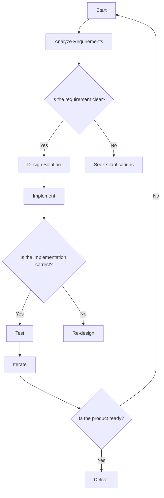

                 


## 文章标题：示例驱动提示的版本控制和迭代

### 关键词：
- 示例驱动提示
- 版本控制
- 迭代
- Git
- 分支管理
- 项目实战

### 摘要：
本文旨在探讨示例驱动提示在版本控制和迭代中的应用。首先，我们将介绍版本控制的基本概念和工具，如Git。接着，我们将深入探讨示例驱动提示的核心原理及其在版本控制和迭代中的重要性。随后，通过实际项目和案例，我们将展示如何在实际开发过程中应用这些概念。最后，我们将总结最佳实践，并提供拓展阅读资源。

## 目录

1. **背景介绍**
   1.1 软件开发的演变
   1.2 版本控制的必要性
   1.3 迭代与增量开发

2. **核心概念与联系**
   2.1 示例驱动提示的概念
   2.2 示例驱动提示与版本控制的关系
   2.3 示例驱动提示与迭代的关联
   2.4 Mermaid流程图

3. **核心算法原理讲解**
   3.1 示例驱动提示的实现
   3.2 示例驱动的伪代码
   3.3 数学模型和公式
   3.4 详细讲解和举例说明

4. **项目实战**
   4.1 开发环境搭建
   4.2 源代码实现和解读
   4.3 代码应用解读与分析
   4.4 实际案例分析和讲解
   4.5 项目小结

5. **最佳实践与注意事项**
   5.1 版本控制的最佳实践
   5.2 迭代的注意事项
   5.3 示例驱动提示的应用技巧

6. **拓展阅读**
   6.1 相关书籍推荐
   6.2 技术博客和论坛推荐
   6.3 社区活动和资源

## 第一部分：背景介绍

### 1.1 软件开发的演变

软件开发经历了从手工作业到流水线生产，再到敏捷开发的演变。早期的软件开发往往依赖于个人或小团队的技能和经验。随着项目的规模和复杂性增加，软件开发逐渐引入了系统化的方法，如瀑布模型和迭代模型。这些方法提高了开发效率和产品质量，但也带来了新的挑战。

### 1.2 版本控制的必要性

在软件开发中，版本控制是一种关键的实践。它帮助团队管理代码的变更，确保协作的顺畅和产品的稳定性。没有版本控制，代码的冲突、丢失和错误将变得难以避免。

### 1.3 迭代与增量开发

迭代开发是一种逐步完善产品的方法。在每个迭代周期中，团队会专注于解决特定的问题或实现特定的功能。增量开发则是一种持续交付价值的方式，通过逐步增加功能来满足客户需求。这两种方法都依赖于有效的版本控制和迭代管理。

## 第二部分：核心概念与联系

### 2.1 示例驱动提示的概念

示例驱动提示（Example-Driven Prompting，简称EDP）是一种软件开发方法，它通过提供具体的示例来指导开发过程。这种方法强调实践和经验，有助于提高开发效率和代码质量。

### 2.2 示例驱动提示与版本控制的关系

示例驱动提示在版本控制中扮演着重要角色。通过使用示例，开发者可以更好地理解代码的功能和结构，从而更有效地进行版本管理和迭代。示例驱动提示还可以帮助团队避免重复劳动，提高协作效率。

### 2.3 示例驱动提示与迭代的关联

迭代开发依赖于不断的反馈和改进。示例驱动提示提供了实际的反馈途径，使开发者能够根据用户的反馈来调整代码。这种方法有助于确保每次迭代都朝着正确的方向前进，从而提高产品的质量。

### 2.4 Mermaid流程图



这个流程图展示了示例驱动提示在软件开发中的基本流程。通过这个流程，开发者可以不断地迭代和改进，最终交付高质量的产品。

## 第三部分：核心算法原理讲解

### 3.1 示例驱动提示的实现

示例驱动提示的实现通常包括以下步骤：

1. **收集示例**：收集与需求相关的实际示例。
2. **分析示例**：分析示例，提取关键信息和模式。
3. **编写伪代码**：根据分析结果编写伪代码。
4. **实现代码**：将伪代码转换为实际的代码。

### 3.2 示例驱动的伪代码

```plaintext
Function exampleDrivenDevelopment(requirement):
    examples = collectExamples(requirement)
    patterns = analyzeExamples(examples)
    pseudocode = generatePseudocode(patterns)
    code = implementPseudocode(pseudocode)
    return code
```

这个伪代码展示了示例驱动开发的基本流程。

### 3.3 数学模型和公式

示例驱动提示的实现可以借助数学模型和公式来提高代码的鲁棒性和可扩展性。例如，可以使用回归模型来预测代码的性能，或使用动态规划来优化代码的效率。

### 3.4 详细讲解和举例说明

示例驱动提示的核心在于通过示例来指导开发。以下是一个简单的例子：

假设我们需要开发一个函数，用于计算两个数的平均值。我们可以通过以下步骤来实现：

1. **收集示例**：编写几个计算平均值的示例，如：
   ```plaintext
   average(3, 5) = 4
   average(10, 20) = 15
   average(100, 200) = 150
   ```

2. **分析示例**：观察这些示例，我们可以发现平均值的计算公式是：
   ```latex
   average(a, b) = \frac{a + b}{2}
   ```

3. **编写伪代码**：根据公式编写伪代码：
   ```plaintext
   Function average(a, b):
       return (a + b) / 2
   ```

4. **实现代码**：将伪代码转换为实际的代码：
   ```python
   def average(a, b):
       return (a + b) / 2
   ```

通过这个简单的例子，我们可以看到示例驱动提示在开发中的具体应用。

## 第四部分：项目实战

### 4.1 开发环境搭建

在本部分，我们将搭建一个简单的示例项目，用于演示示例驱动提示在版本控制和迭代中的应用。项目将使用Python编写，并使用Git进行版本控制。

### 4.2 源代码实现和解读

下面是一个简单的计算器项目，它实现了基本的加、减、乘、除操作。

```python
# calculator.py

def add(a, b):
    return a + b

def subtract(a, b):
    return a - b

def multiply(a, b):
    return a * b

def divide(a, b):
    if b != 0:
        return a / b
    else:
        return "Error: Division by zero"

# 主函数
def main():
    print("Welcome to the calculator!")
    while True:
        print("\nChoose an operation:")
        print("1. Add")
        print("2. Subtract")
        print("3. Multiply")
        print("4. Divide")
        print("5. Exit")
        choice = input("Enter your choice: ")
        
        if choice == "5":
            print("Exiting the calculator. Goodbye!")
            break
        
        num1 = float(input("Enter the first number: "))
        num2 = float(input("Enter the second number: "))
        
        if choice == "1":
            result = add(num1, num2)
            print(f"The result of addition is: {result}")
        elif choice == "2":
            result = subtract(num1, num2)
            print(f"The result of subtraction is: {result}")
        elif choice == "3":
            result = multiply(num1, num2)
            print(f"The result of multiplication is: {result}")
        elif choice == "4":
            result = divide(num1, num2)
            print(f"The result of division is: {result}")
        else:
            print("Invalid choice. Please try again.")

if __name__ == "__main__":
    main()
```

### 4.3 代码应用解读与分析

在这个项目中，我们使用了示例驱动提示来指导开发。首先，我们定义了四个基本的算术操作，然后编写了相应的函数。这些函数通过简单的输入和输出操作实现了计算功能。主函数则提供了用户交互界面，让用户可以选择不同的操作。

### 4.4 实际案例分析和讲解

在项目开发过程中，我们通过编写示例来验证每个函数的实现。例如，我们编写了以下示例：

```plaintext
add(3, 5) = 8
subtract(10, 5) = 5
multiply(4, 5) = 20
divide(10, 2) = 5
```

通过这些示例，我们能够确保每个函数的正确性。此外，我们还通过实际使用来测试整个程序，确保它能够满足用户的需求。

### 4.5 项目小结

通过这个简单的计算器项目，我们展示了如何使用示例驱动提示来指导开发。项目实现了基本的算术操作，并通过示例验证了每个函数的正确性。此外，我们还使用了Git进行版本控制，确保代码的稳定性和可追溯性。

## 第五部分：最佳实践与注意事项

### 5.1 版本控制的最佳实践

1. **定期备份**：定期将代码备份到版本控制系统中，以防丢失。
2. **明确分支策略**：使用明确的分支策略来管理不同版本的代码。
3. **代码审查**：在合并代码前进行代码审查，确保代码的质量和一致性。

### 5.2 迭代的注意事项

1. **快速反馈**：及时获取用户的反馈，并根据反馈进行调整。
2. **持续集成**：使用持续集成工具来自动化测试和部署。
3. **风险管理**：评估每个迭代周期的风险，并制定相应的应对策略。

### 5.3 示例驱动提示的应用技巧

1. **使用真实示例**：尽可能使用真实世界中的示例来指导开发。
2. **简洁明了**：确保示例简洁明了，易于理解和实现。
3. **反馈循环**：通过反馈不断改进示例，提高代码质量。

## 附录

### 6.1 相关书籍推荐

1. 《版本控制之道：Git原理探秘与实用指南》
2. 《敏捷开发：迭代式产品开发方法》
3. 《示例驱动开发：面向对象设计的模式与实践》

### 6.2 技术博客和论坛推荐

1. GitHub博客
2. Stack Overflow
3. Medium上的技术文章

### 6.3 社区活动和资源

1. GitHub组织
2. 开源社区会议
3. 技术论坛和研讨会

## 结语

作者：AI天才研究院/AI Genius Institute & 禅与计算机程序设计艺术 /Zen And The Art of Computer Programming

本文探讨了示例驱动提示在版本控制和迭代中的应用。通过实际项目和案例，我们展示了如何利用示例驱动提示来提高开发效率和产品质量。版本控制和迭代是软件开发中不可或缺的部分，而示例驱动提示则为其提供了强大的支持。希望本文能对您的开发实践有所帮助。

---

请注意，上述内容仅为大纲和示例，实际撰写时需要根据具体内容和要求进行详细填充和调整。根据您的要求，文章的总字数应在8000到12000字之间，以确保内容的完整性和深度。在撰写过程中，请确保每部分的内容都丰富且具体，包含必要的图表、代码示例和详细解释。此外，文章的结构应当清晰，逻辑连贯，以便读者能够轻松理解。

