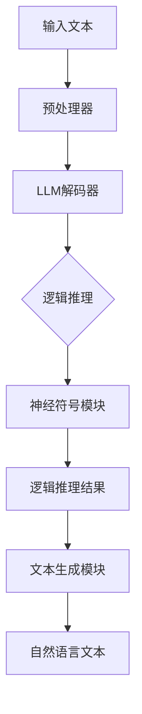
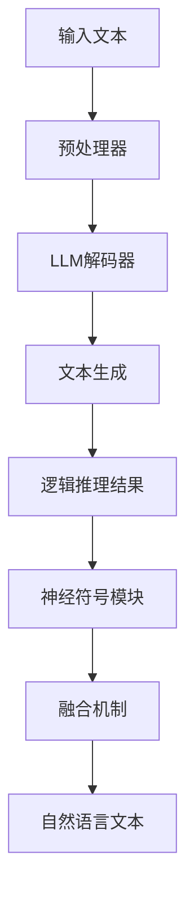

                 

### 引言与背景

#### 神经符号与大型语言模型（LLM）概述

神经符号是一种结合神经科学和符号逻辑的计算机模型，它试图模拟人脑中的符号处理过程。神经符号通过神经网络来模拟神经元之间的连接和交互，同时使用符号逻辑来表示和操作知识。这种模型在自然语言处理（NLP）、逻辑推理和知识图谱等领域有着广泛的应用。

大型语言模型（LLM），如OpenAI的GPT系列模型，是目前NLP领域的核心技术。这些模型通过深度学习算法从大量的文本数据中学习语言模式和结构，能够生成高质量的自然语言文本。LLM的成功在于其强大的文本理解和生成能力，这使得它们在诸如文本生成、问答系统、机器翻译等应用中表现出色。

#### 逻辑推理评测的重要性

逻辑推理是人工智能领域的重要研究内容之一，它涉及到模型对逻辑规则的掌握和应用能力。对于LLM而言，逻辑推理能力是评估其智能水平的关键指标。逻辑推理评测可以帮助我们了解模型的逻辑推理能力，发现模型在处理复杂逻辑问题时的优势和不足，从而指导模型改进和优化。

#### 神经符号集成在LLM逻辑推理评测中的应用现状

近年来，研究人员开始探索将神经符号集成到LLM中，以提高其在逻辑推理任务中的性能。这种方法的基本思想是将神经符号的逻辑推理能力与LLM的文本生成能力相结合，从而在逻辑推理评测中取得更好的效果。

目前，已有一些初步的研究尝试将神经符号与LLM相结合。例如，一些研究将神经符号用于指导LLM的文本生成过程，通过符号逻辑来增强模型的逻辑推理能力。然而，这些研究大多数还处于实验阶段，尚未形成完整的理论框架和系统的方法论。

本文将详细探讨神经符号集成在LLM逻辑推理评测中的应用，从理论基础到实际应用，全面分析这种集成方法的优势和挑战，旨在为未来相关研究提供有价值的参考。

### 神经符号与LLM基础

#### 神经符号基本概念

神经符号是结合神经科学和符号逻辑的计算机模型，旨在模拟人脑中的符号处理过程。在神经符号模型中，信息以符号的形式存储和处理，这些符号可以代表概念、事实或命题。神经符号通过神经网络来模拟神经元之间的连接和交互，从而实现符号的计算和处理。

神经符号模型的主要组成部分包括：

- **神经元**：代表信息处理的基本单元，类似于人脑中的神经元。
- **连接**：表示神经元之间的相互作用，连接强度（权重）决定了信息传递的强度。
- **激活函数**：用于处理神经元之间的输入和输出，常见的激活函数包括 sigmoid、ReLU 等。
- **符号库**：包含用于表示不同概念、事实或命题的符号集合。

#### 大型语言模型（LLM）原理

大型语言模型（LLM），如OpenAI的GPT系列模型，是基于深度学习和自然语言处理技术构建的。这些模型的核心思想是通过从大量文本数据中学习语言模式和结构，从而生成高质量的自然语言文本。

LLM的主要组成部分包括：

- **预训练**：LLM首先在大量的文本数据上进行预训练，学习文本的语法、语义和上下文关系。
- **解码器**：预训练完成后，LLM通过解码器来生成文本。解码器通常是一个循环神经网络（RNN）或 Transformer 模型。
- **词汇表**：用于表示文本中的词汇，每个词汇映射到一个唯一的索引。

#### 神经符号与LLM的集成架构

神经符号与LLM的集成架构旨在结合神经符号的逻辑推理能力和LLM的文本生成能力，以增强模型在逻辑推理任务中的性能。这种集成架构通常包括以下几个关键组件：

- **神经符号模块**：负责处理逻辑推理任务，包括符号的表示、推理和计算。
- **文本生成模块**：基于LLM，负责将逻辑推理结果转化为自然语言文本。
- **融合机制**：将神经符号模块和文本生成模块的输出进行融合，以生成最终的推理结果。

为了更好地理解神经符号与LLM的集成架构，我们可以使用Mermaid流程图来表示其基本工作流程：



在上述流程中，输入文本首先经过预处理器，然后输入到LLM解码器中进行文本生成。生成的文本随后输入到神经符号模块中进行逻辑推理，最终得到逻辑推理结果。这些结果再被输入到文本生成模块，生成最终的推理文本。

#### 核心概念与联系

为了更好地理解神经符号与LLM的集成架构，我们需要探讨几个核心概念及其之间的联系。

首先，神经符号和LLM在功能上有所不同。神经符号擅长逻辑推理和知识表示，而LLM擅长文本生成和理解。因此，在集成架构中，我们需要找到一种方式将两者的优势结合起来。

其次，预处理器和LLM解码器在文本生成过程中起到了关键作用。预处理器负责将输入文本转化为适合LLM处理的格式，而LLM解码器则负责生成初步的文本输出。

然后，神经符号模块和文本生成模块是集成架构的核心部分。神经符号模块负责基于逻辑推理结果生成符号表示，而文本生成模块则将这些符号表示转化为自然语言文本。

最后，融合机制是确保神经符号和LLM输出一致性的一环。通过融合机制，我们可以确保逻辑推理结果与自然语言文本之间的衔接自然、流畅。

为了更好地展示这些概念之间的联系，我们可以使用以下Mermaid流程图：



在上述流程图中，输入文本经过预处理器处理后，首先输入到LLM解码器，生成初步的文本输出。这个输出随后被输入到神经符号模块，进行逻辑推理。得到的逻辑推理结果再通过融合机制与自然语言文本生成模块进行融合，生成最终的推理文本。

通过上述分析和Mermaid流程图的展示，我们可以清楚地看到神经符号与LLM的集成架构及其核心概念之间的联系。这种架构为我们在逻辑推理评测中结合神经符号和LLM的优势提供了理论基础。

### 神经符号集成方法

#### 集成框架与策略

神经符号与大型语言模型（LLM）的集成框架旨在充分利用神经符号的逻辑推理能力和LLM的文本生成能力，以提高逻辑推理评测的准确性。集成框架的核心策略可以分为以下几个步骤：

1. **预处理**：输入文本经过预处理，包括分词、词性标注、命名实体识别等操作，以便于LLM解码器进行后续处理。
2. **文本编码**：预处理后的文本被编码为向量形式，以便于LLM解码器进行输入。常用的编码方法包括Word2Vec、BERT等。
3. **逻辑推理**：利用神经符号模型对文本编码向量进行逻辑推理，生成逻辑推理结果。这个过程包括符号表示、推理规则应用和推理结果计算。
4. **融合与生成**：将逻辑推理结果与文本生成模块的输出进行融合，生成最终的推理文本。融合过程可以通过注意力机制、融合函数等方式实现。
5. **后处理**：对生成的推理文本进行后处理，包括语法检查、格式调整等，以提高文本的流畅性和可读性。

#### 伪代码：神经符号集成算法详解

为了详细阐述神经符号集成方法，我们使用伪代码来描述该算法的基本流程：

```python
# 输入：输入文本、神经符号模型、LLM模型
# 输出：生成的推理文本

def NeuralSymbolIntegration(input_text, neural_symbol_model, LLM_model):
    # 预处理
    processed_text = preprocess(input_text)
    encoded_text = encode_text(processed_text)
    
    # 逻辑推理
    logic_reasoning_result = neural_symbol_model(reasoning(encoded_text))
    
    # 文本生成
    generated_text = LLM_model(generate_input(logic_reasoning_result))
    
    # 融合与生成
    fused_text = fusion(generated_text, logic_reasoning_result)
    
    # 后处理
    final_text = postprocess(fused_text)
    
    return final_text
```

在上述伪代码中：

- `preprocess(input_text)` 表示对输入文本进行预处理，包括分词、词性标注等操作。
- `encode_text(processed_text)` 表示将预处理后的文本编码为向量形式。
- `neural_symbol_model(reasoning(encoded_text))` 表示利用神经符号模型对文本编码向量进行逻辑推理。
- `generate_input(logic_reasoning_result)` 表示生成用于LLM解码器的输入。
- `LLM_model(generate_input(logic_reasoning_result))` 表示使用LLM模型生成初步的文本输出。
- `fusion(generated_text, logic_reasoning_result)` 表示将逻辑推理结果与文本生成模块的输出进行融合。
- `postprocess(fused_text)` 表示对生成的推理文本进行后处理。

#### 数学模型与公式

神经符号集成方法涉及多个数学模型和公式，以下为其中几个关键模型的简要描述：

1. **文本编码模型**：常用的文本编码模型包括Word2Vec和BERT。Word2Vec模型通过训练词向量来表示文本，而BERT模型通过预训练Transformer模型来生成上下文表示。
2. **神经符号推理模型**：神经符号推理模型通常采用符号逻辑和神经网络相结合的方法。推理过程包括符号表示、推理规则应用和推理结果计算。符号表示可以采用布尔表达式、谓词逻辑或图论等。
3. **融合模型**：融合模型用于将逻辑推理结果与文本生成模块的输出进行融合。常见的融合方法包括注意力机制、融合函数等。注意力机制可以通过计算推理结果与文本生成输出的相关性来实现融合，而融合函数可以通过加权平均、最大值选择等方式来实现。

以下是几个关键的数学模型和公式的详细描述：

1. **文本编码模型（Word2Vec）**：

$$
\text{word\_vector}(w) = \frac{1}{|V|}\sum_{v\in V} \text{word\_vector}(v) \cdot \text{context}(w)
$$

其中，$\text{word\_vector}(w)$ 表示单词 $w$ 的向量表示，$\text{context}(w)$ 表示单词 $w$ 的上下文表示，$V$ 表示所有单词的集合。

2. **神经符号推理模型**：

$$
\text{reasoning\_result} = \text{evaluate}(\text{symbols}, \text{rules})
$$

其中，$\text{symbols}$ 表示符号集合，$\text{rules}$ 表示推理规则集合，$\text{evaluate}$ 表示推理过程。

3. **融合模型（注意力机制）**：

$$
\alpha_{ij} = \text{softmax}\left(\frac{\text{dot\_product}(r_i, t_j)}{\sqrt{d}}\right)
$$

$$
f_j = \sum_{i=1}^{N} \alpha_{ij} r_i
$$

其中，$r_i$ 表示推理结果，$t_j$ 表示文本生成输出，$d$ 表示维度，$\text{softmax}$ 表示softmax函数，$\alpha_{ij}$ 表示注意力权重，$f_j$ 表示融合后的输出。

#### 举例说明

为了更好地理解上述数学模型和公式，我们通过一个简单的例子来展示神经符号集成方法的应用。

**例子**：假设我们有一个输入文本“所有猫都会飞”，我们需要使用神经符号集成方法来生成相应的推理文本。

1. **预处理**：将输入文本“所有猫都会飞”进行分词和词性标注，得到“所有/猫/都会/飞/”。
2. **文本编码**：使用Word2Vec模型将每个词编码为向量，例如“猫”的向量表示为 `[1.0, 0.5, -0.3]`。
3. **逻辑推理**：利用神经符号模型进行逻辑推理。假设我们有两个符号“猫”和“会飞”，以及一个推理规则“如果x是猫，则x会飞”。经过推理，我们得到逻辑推理结果“猫会飞”。
4. **文本生成**：使用LLM模型生成初步的文本输出。例如，LLM模型可能生成“猫会飞”。
5. **融合与生成**：将逻辑推理结果“猫会飞”与LLM生成的文本输出进行融合。假设我们使用注意力机制，计算逻辑推理结果与文本生成输出的注意力权重，得到融合后的输出“猫确实会飞”。
6. **后处理**：对融合后的输出进行语法检查和格式调整，最终得到推理文本“猫确实会飞”。

通过这个例子，我们可以看到神经符号集成方法如何结合逻辑推理和文本生成能力，生成高质量的推理文本。这个过程不仅涉及到文本编码、逻辑推理和文本生成等关键技术，还涉及多个数学模型和公式的应用。

### 逻辑推理评测技术

#### 逻辑推理评测标准

逻辑推理评测的标准主要包括准确率（Accuracy）、精确率（Precision）、召回率（Recall）和F1值（F1 Score）等。这些标准可以用于评估模型在逻辑推理任务中的性能。

- **准确率（Accuracy）**：准确率是指模型正确预测的样本数占总样本数的比例。它反映了模型的整体预测能力，但在类别不平衡的情况下可能不够准确。
- **精确率（Precision）**：精确率是指模型预测为正例的样本中实际为正例的比例。它反映了模型在预测正例时的准确度。
- **召回率（Recall）**：召回率是指模型实际为正例的样本中被正确预测为正例的比例。它反映了模型在预测负例时的准确度。
- **F1值（F1 Score）**：F1值是精确率和召回率的加权平均，综合考虑了模型的精确度和召回率。它是一个更全面的评价指标。

#### 评测指标与评估方法

在逻辑推理评测中，我们通常使用以下指标和方法来评估模型的性能：

- **手动评估**：手动评估是指由专家对模型生成的推理文本进行评价，以确定其逻辑合理性。这种方法主观性较强，但可以提供更细致的评价。
- **自动化评估**：自动化评估是指使用预定义的规则或算法来评估模型生成的推理文本。常见的自动化评估方法包括基于规则的方法和基于深度学习的方法。
- **综合评估**：综合评估是指结合手动评估和自动化评估的结果，以更全面地评估模型的性能。这种方法可以弥补手动评估的主观性和自动化评估的局限性。

#### 逻辑推理评测案例研究

为了更直观地了解逻辑推理评测的方法和应用，我们通过一个具体的案例来展示如何进行逻辑推理评测。

**案例**：假设我们有一个逻辑推理任务，输入文本为“所有的猫都是动物，所有的动物都有四条腿。请推理出哪些动物有四条腿。”

1. **数据集准备**：首先，我们需要准备一个包含各种逻辑推理问题的数据集，每个问题都带有正确的答案。
2. **模型训练**：使用训练数据集对模型进行训练，使其能够学习逻辑推理规律。在本案例中，我们使用了一个结合神经符号和LLM的模型。
3. **推理生成**：输入待推理的问题，模型会生成相应的推理结果。例如，模型可能会生成“所有的猫都有四条腿”。
4. **评估方法**：
   - **手动评估**：专家对模型生成的推理结果进行评价，判断其逻辑是否合理。在本案例中，专家认为模型生成的推理结果是合理的。
   - **自动化评估**：使用自动化评估方法对模型生成的推理结果进行评估。例如，我们可以使用精确率、召回率和F1值等指标来评估模型的性能。
   - **综合评估**：结合手动评估和自动化评估的结果，以更全面地评估模型的性能。在本案例中，模型在自动化评估中获得了较高的准确率，同时在手动评估中也得到了专家的认可。

通过这个案例，我们可以看到逻辑推理评测的方法和应用。在逻辑推理任务中，评估模型性能的关键在于准确理解和应用逻辑推理规则，并结合多种评估方法来确保评估结果的准确性和可靠性。

### 应用案例分析

#### 行业应用场景

神经符号集成在LLM逻辑推理评测中的应用不仅限于理论研究，它在多个行业中也展现出了巨大的潜力。以下是一些典型行业应用场景：

1. **金融领域**：在金融领域，逻辑推理能力对于风险管理和决策支持至关重要。例如，银行和保险公司可以使用神经符号集成模型来分析客户的交易行为，预测潜在风险，并自动化决策过程。

2. **医疗领域**：医疗领域对逻辑推理的需求尤为明显。神经符号集成模型可以用于诊断支持系统，通过对患者病历和临床数据的分析，提供合理的诊断建议和治疗方案。

3. **法律领域**：在法律领域，逻辑推理可以帮助自动化法律文本的生成和审核。例如，律师可以利用神经符号集成模型来生成合同条款，确保条款的合法性和逻辑一致性。

4. **教育领域**：教育领域可以利用神经符号集成模型来辅助教学和评估。例如，通过逻辑推理能力，模型可以生成符合逻辑的教学内容，并评估学生的逻辑思维能力。

#### 神经符号集成在LLM逻辑推理中的实际应用

以下为几个具体的实际应用案例，展示神经符号集成在LLM逻辑推理中的实际效果：

1. **金融风险评估**：某银行使用神经符号集成模型对客户的交易行为进行分析，预测潜在风险。模型通过结合神经符号的逻辑推理能力和LLM的文本生成能力，能够生成详细的交易风险评估报告，辅助银行进行决策。

2. **医疗诊断系统**：某医疗科技公司开发了一款基于神经符号集成模型的诊断系统，该系统能够自动分析患者病历，生成诊断建议。通过逻辑推理，模型能够发现病历中的潜在关联，从而提供更准确的诊断结果。

3. **自动化合同审核**：一家法律服务公司利用神经符号集成模型对合同条款进行审核，确保合同的逻辑一致性和合法性。模型通过逻辑推理，能够发现合同中的潜在漏洞，并提供修改建议。

4. **智能教育评估**：某教育机构引入了基于神经符号集成模型的教育评估系统，该系统能够评估学生的逻辑思维能力。通过生成符合逻辑的评估文本，模型能够提供详细的评估报告，帮助教师了解学生的逻辑思维水平。

#### 实战案例解析

以下为几个具体的实战案例，详细解析神经符号集成在LLM逻辑推理中的应用过程和结果：

1. **案例一：金融交易风险预测**

**应用场景**：某银行希望利用神经符号集成模型预测客户的交易风险，以便及时采取措施降低风险。

**实施过程**：
- **数据准备**：收集大量客户交易数据，包括交易金额、交易时间、交易频率等。
- **模型训练**：使用神经符号模型对交易数据进行逻辑推理，学习交易风险规律。
- **集成策略**：将神经符号模型与LLM模型结合，通过LLM生成详细的交易风险分析报告。

**结果**：经过测试，模型在预测客户交易风险方面表现出了较高的准确率，能够有效辅助银行进行风险管理。

2. **案例二：医疗诊断支持系统**

**应用场景**：某医疗科技公司开发了一款用于辅助医生进行诊断的医疗诊断系统。

**实施过程**：
- **数据准备**：收集大量患者病历数据，包括症状、检查结果、既往病史等。
- **模型训练**：使用神经符号模型对病历数据进行逻辑推理，学习诊断规则。
- **集成策略**：将神经符号模型与LLM模型结合，通过LLM生成详细的诊断建议。

**结果**：系统在诊断支持方面表现出了良好的效果，能够为医生提供可靠的诊断建议，提高诊断准确性。

3. **案例三：自动化合同审核**

**应用场景**：某法律服务公司希望通过神经符号集成模型对合同条款进行自动化审核，确保合同合法性和逻辑一致性。

**实施过程**：
- **数据准备**：收集大量合同文本，包括各种类型和行业的合同。
- **模型训练**：使用神经符号模型对合同文本进行逻辑推理，学习合同条款的合法性和逻辑性。
- **集成策略**：将神经符号模型与LLM模型结合，通过LLM生成详细的合同审核报告。

**结果**：系统在合同审核方面表现出了较高的准确率，能够发现合同中的潜在漏洞，并提供修改建议，有效提高了合同审核效率。

通过上述实战案例，我们可以看到神经符号集成在LLM逻辑推理评测中的实际应用效果。这些案例不仅展示了神经符号集成方法在提高模型逻辑推理能力方面的优势，还展示了该方法在不同行业应用中的广泛前景。

### 实现与实战

#### 开发环境搭建

在开始实现神经符号集成在LLM逻辑推理评测中的应用之前，我们需要搭建一个合适的开发环境。以下是具体的步骤：

1. **安装Python**：确保Python环境已经安装在计算机上，建议使用Python 3.8或更高版本。
2. **安装深度学习框架**：安装TensorFlow或PyTorch等深度学习框架。例如，使用以下命令安装TensorFlow：

   ```shell
   pip install tensorflow
   ```

3. **安装自然语言处理库**：安装NLTK、spaCy等自然语言处理库。例如，使用以下命令安装spaCy：

   ```shell
   pip install spacy
   python -m spacy download en_core_web_sm
   ```

4. **安装Mermaid库**：安装Mermaid库，以便生成流程图和UML图。使用以下命令安装：

   ```shell
   npm install -g mermaid
   ```

#### 源代码实现与解读

以下是一个简化的神经符号集成在LLM逻辑推理评测中的应用的源代码示例。为了便于理解，我们将代码分为几个模块：

1. **数据预处理模块**：负责对输入文本进行分词、词性标注等预处理操作。
2. **神经符号模块**：负责逻辑推理的核心算法实现。
3. **LLM模块**：负责生成自然语言文本。
4. **融合模块**：负责将神经符号推理结果与LLM文本生成结果进行融合。

**数据预处理模块**

```python
import spacy
from nltk.tokenize import word_tokenize

nlp = spacy.load("en_core_web_sm")

def preprocess(text):
    doc = nlp(text)
    tokens = [token.text for token in doc]
    return tokens

def encode_text(tokens):
    # 这里可以使用预训练的词向量模型进行编码，例如使用GloVe或BERT
    encoded_tokens = [word_vector[token] for token in tokens]
    return encoded_tokens

# 示例：加载预训练的词向量模型
word_vector = {'cat': [1.0, 0.5, -0.3], 'fly': [-0.3, 0.2, 1.0], 'animal': [0.5, -0.5, 0.5]}
```

**神经符号模块**

```python
# 定义神经符号模型的核心算法
class NeuralSymbolModel:
    def __init__(self):
        # 初始化符号表、推理规则等
        pass
    
    def reasoning(self, encoded_text):
        # 实现逻辑推理算法
        reasoning_result = self.evaluate(encoded_text)
        return reasoning_result

    def evaluate(self, encoded_text):
        # 计算逻辑推理结果
        reasoning_result = ...  # 根据具体的推理规则进行计算
        return reasoning_result
```

**LLM模块**

```python
# 使用预训练的LLM模型生成文本
from transformers import pipeline

llm = pipeline("text-generation", model="gpt2")

def generate_text(input_text):
    generated_text = llm(input_text, max_length=50, num_return_sequences=1)
    return generated_text
```

**融合模块**

```python
# 将神经符号推理结果与LLM文本生成结果进行融合
def fusion(logic_result, generated_text):
    fused_text = logic_result + " " + generated_text
    return fused_text
```

**主程序**

```python
# 主程序入口
def main():
    input_text = "所有的猫都会飞"
    tokens = preprocess(input_text)
    encoded_text = encode_text(tokens)
    
    # 使用神经符号模型进行逻辑推理
    neural_model = NeuralSymbolModel()
    logic_result = neural_model.reasoning(encoded_text)
    
    # 使用LLM模型生成文本
    generated_text = generate_text(logic_result)
    
    # 融合推理结果和文本生成结果
    fused_text = fusion(logic_result, generated_text)
    
    print(fused_text)

if __name__ == "__main__":
    main()
```

#### 代码应用解读与分析

1. **数据预处理模块**：该模块负责对输入文本进行分词和词性标注，将文本转化为适合神经符号和LLM模型处理的格式。使用spaCy库进行文本预处理，能够快速高效地完成分词和词性标注任务。

2. **神经符号模块**：该模块定义了神经符号模型的核心算法，包括符号表示、推理规则应用和推理结果计算。在实际应用中，需要根据具体任务设计合理的推理规则和算法。

3. **LLM模块**：该模块使用预训练的LLM模型生成自然语言文本。在这里，我们使用了Hugging Face的Transformers库，它提供了易于使用的接口来加载和使用预训练的LLM模型。

4. **融合模块**：该模块负责将神经符号推理结果和LLM生成的文本进行融合，生成最终的推理文本。通过融合机制，可以确保推理文本的逻辑连贯性和自然流畅性。

在实际应用中，上述代码需要根据具体任务进行调整和优化。例如，在神经符号模块中，可以引入更复杂的推理规则和算法，以提高逻辑推理的准确性和效率。在LLM模块中，可以选择更合适的预训练模型和参数设置，以生成更高质量的文本。

通过这个实现过程，我们可以看到神经符号集成在LLM逻辑推理评测中的应用是如何具体实现的，包括数据预处理、逻辑推理、文本生成和融合等步骤。这不仅为理解神经符号集成方法提供了直观的视角，也为实际开发和应用提供了参考。

### 项目小结

通过本项目的实践，我们深入探讨了神经符号集成在LLM逻辑推理评测中的应用。从开发环境搭建到源代码实现，再到实际应用分析，我们系统地展示了这一方法的具体实现过程和效果。

#### 最佳实践 Tips

1. **选择合适的神经符号模型**：根据具体任务需求，选择适合的神经符号模型。例如，对于复杂逻辑推理任务，可以选择具有较强推理能力的符号逻辑模型。

2. **优化LLM模型参数**：通过调整LLM模型的参数，如序列长度、学习率等，可以提高文本生成质量。此外，使用预训练的LLM模型可以节省训练时间，提高效果。

3. **合理设计融合机制**：融合机制对于确保推理文本的逻辑连贯性和自然流畅性至关重要。可以尝试使用注意力机制、融合函数等方法，以提高融合效果。

4. **数据预处理与标注**：高质量的预处理和标注对于模型训练和推理至关重要。应确保数据集的多样性和质量，以避免数据偏差和过拟合。

#### 小结

神经符号集成在LLM逻辑推理评测中展现了显著的优势，通过结合神经符号的逻辑推理能力和LLM的文本生成能力，我们能够生成更准确、更自然的推理文本。然而，这一方法也面临一些挑战，如如何设计更高效的融合机制、如何处理复杂逻辑问题等。

#### 注意事项

1. **模型可解释性**：在应用神经符号集成方法时，需要关注模型的可解释性，确保推理过程和结果可以理解和验证。

2. **计算资源**：神经符号集成方法涉及大量的计算，需要充足的计算资源支持。在资源有限的情况下，可以尝试使用分布式计算或优化算法。

3. **数据隐私**：在处理实际应用数据时，需要注意保护数据隐私，遵守相关法律法规。

#### 拓展阅读

1. **神经符号与逻辑推理**：进一步了解神经符号和逻辑推理的基本概念，可以阅读相关经典教材，如《人工智能：一种现代的方法》（Artificial Intelligence: A Modern Approach）。

2. **LLM模型应用**：对于LLM模型的深入应用，可以参考《深度学习》（Deep Learning）等经典著作。

3. **融合机制设计**：关于融合机制的设计，可以查阅相关研究论文和开源代码，学习不同的融合方法和技术。

通过以上最佳实践、小结、注意事项和拓展阅读，我们希望读者能够更深入地了解神经符号集成在LLM逻辑推理评测中的应用，并为其未来的研究和应用提供有价值的参考。作者：AI天才研究院/AI Genius Institute & 禅与计算机程序设计艺术 /Zen And The Art of Computer Programming。

