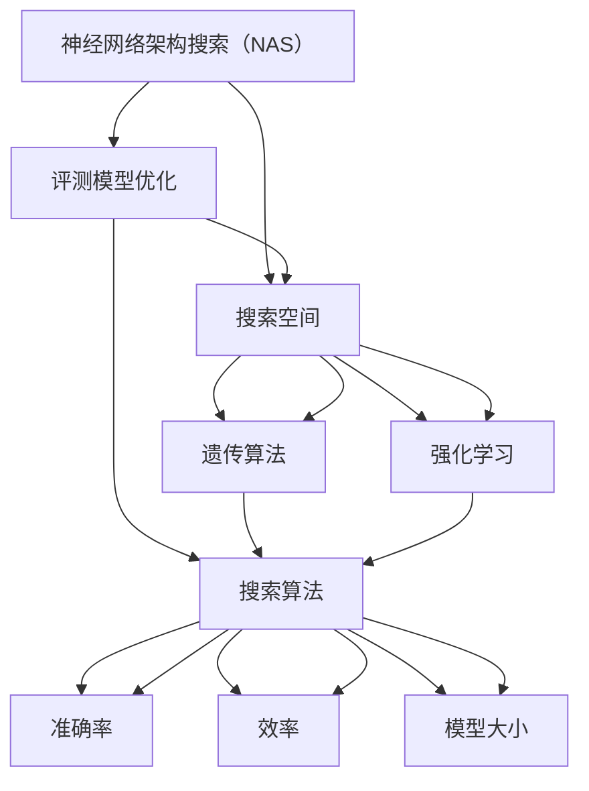

                 


### 1.5 提取核心概念与联系

在引言中，我们介绍了神经网络架构搜索（NAS）的基本概念和背景。接下来，我们需要提取核心概念与联系，并以Mermaid流程图的形式呈现。

**核心概念：**

1. **神经网络架构搜索（NAS）**：一种自动化搜索策略，用于寻找最优的神经网络架构。
2. **搜索空间**：NAS中的搜索对象，包括各种可能的神经网络结构。
3. **搜索算法**：用于在搜索空间中搜索最优架构的方法，如遗传算法、强化学习等。
4. **评测模型优化**：通过调整模型结构、参数等，提高模型在特定任务上的性能。
5. **优化目标**：通常包括准确率、效率、模型大小等指标。

**概念联系：**

- **NAS与搜索空间**：NAS的目标是在搜索空间中找到最优的神经网络架构。
- **搜索算法与搜索空间**：不同的搜索算法适用于不同的搜索空间，它们共同作用，提高搜索效率。
- **NAS与评测模型优化**：NAS可以帮助优化模型的评测性能，而评测模型优化又可以指导NAS的搜索过程。

**Mermaid流程图：**



通过Mermaid流程图，我们可以清晰地展示出各个核心概念之间的联系，为后续章节的内容讲解奠定基础。

### 2.6 编写核心算法原理讲解

在第一章中，我们介绍了神经网络架构搜索（NAS）的基本概念和背景。在本章节中，我们将深入讲解NAS的核心算法原理，包括遗传算法和强化学习在NAS中的应用。

#### 2.6.1 遗传算法（GA）在NAS中的应用

**遗传算法的基本原理**

遗传算法（Genetic Algorithm，GA）是一种基于自然选择和遗传学原理的优化算法。它通过模拟自然进化过程，在搜索空间中寻找最优解。遗传算法的基本流程包括以下步骤：

1. **初始化种群**：随机生成一定数量的初始种群，每个个体表示搜索空间中的一个可能解。
2. **适应度评估**：计算每个个体的适应度，适应度通常与目标函数相关。
3. **选择**：根据适应度对个体进行选择，适应度高的个体有更高的概率被选中。
4. **交叉**：将选中的个体进行交叉操作，生成新的个体。
5. **变异**：对部分个体进行变异操作，增加搜索的多样性。
6. **更新种群**：将交叉和变异后的个体组成新的种群，重复适应度评估和选择步骤。
7. **终止条件**：当满足终止条件（如达到最大迭代次数、适应度满足要求等）时，算法终止。

**遗传算法在NAS中的应用**

在神经网络架构搜索中，遗传算法被用于搜索最优的神经网络结构。具体应用步骤如下：

1. **定义搜索空间**：确定神经网络结构的各个组成部分，如层类型、层数、激活函数等，构成搜索空间。
2. **初始化种群**：根据搜索空间随机生成一定数量的初始种群，每个个体表示一个可能的神经网络结构。
3. **适应度评估**：在特定数据集上训练每个神经网络结构，并评估其性能，如准确率、训练时间等。
4. **选择**：根据适应度对个体进行选择，适应度高的个体有更高的概率被选中。
5. **交叉**：对选中的个体进行交叉操作，生成新的个体。
6. **变异**：对部分个体进行变异操作，增加搜索的多样性。
7. **更新种群**：将交叉和变异后的个体组成新的种群，重复适应度评估和选择步骤。
8. **输出**：当满足终止条件时，输出最优的神经网络结构。

#### 2.6.2 强化学习在NAS中的应用

**强化学习的基本原理**

强化学习（Reinforcement Learning，RL）是一种基于奖励和惩罚的机器学习方法。它通过学习如何在环境中采取行动，以最大化累积奖励。强化学习的基本流程包括以下步骤：

1. **初始化**：确定状态空间、动作空间、奖励函数和惩罚函数。
2. **探索与利用**：在探索阶段，模型尝试不同的动作以发现新的状态；在利用阶段，模型根据历史经验选择最优动作。
3. **更新策略**：根据当前的奖励和惩罚，更新模型的行为策略。
4. **迭代**：重复探索和利用过程，逐步优化策略。

**强化学习在NAS中的应用**

在神经网络架构搜索中，强化学习被用于优化神经网络结构。具体应用步骤如下：

1. **定义搜索空间**：确定神经网络结构的各个组成部分，如层类型、层数、激活函数等，构成搜索空间。
2. **初始化模型**：在搜索空间中随机初始化一个神经网络模型。
3. **环境定义**：定义神经网络训练环境，包括输入数据、损失函数等。
4. **探索与利用**：模型在环境中进行探索，通过选择不同的动作（如改变网络结构）来学习。
5. **更新策略**：根据当前的奖励和惩罚，更新神经网络模型。
6. **迭代**：重复探索和利用过程，逐步优化神经网络结构。
7. **输出**：当满足终止条件时，输出最优的神经网络结构。

通过遗传算法和强化学习在NAS中的应用，我们可以发现并优化最优的神经网络架构，提高模型在特定任务上的性能。

### 2.7 编写数学模型与数学公式讲解

在神经网络架构搜索（NAS）中，数学模型和数学公式是理解和实现核心算法的基础。以下将详细讲解NAS中常用的数学模型和数学公式。

#### 2.7.1 遗传算法中的数学模型

**适应度函数**

在遗传算法中，适应度函数用于评估个体的优劣。常见的适应度函数有：

1. **线性适应度函数**：
   $$ f(x) = x $$
   其中，$x$ 表示个体的适应度。

2. **指数适应度函数**：
   $$ f(x) = e^{ax} $$
   其中，$a$ 为常数，$x$ 表示个体的适应度。

**交叉概率和变异概率**

在遗传算法中，交叉概率和变异概率用于控制交叉和变异操作的发生概率。常见的概率函数有：

1. **均匀分布概率函数**：
   $$ P(c) = \frac{1}{N} $$
   其中，$P(c)$ 表示交叉或变异的概率，$N$ 表示种群中的个体数量。

2. **自适应概率函数**：
   $$ P(c) = \frac{f(x)}{\sum_{i=1}^{N} f(x_i)} $$
   其中，$P(c)$ 表示交叉或变异的概率，$f(x)$ 表示个体的适应度，$x_i$ 表示种群中第 $i$ 个个体的适应度。

#### 2.7.2 强化学习中的数学模型

**Q-学习**

Q-学习是一种基于值函数的强化学习方法。其核心思想是学习状态-动作值函数 $Q(s, a)$，表示在状态 $s$ 下执行动作 $a$ 的预期回报。Q-学习的主要公式如下：

1. **更新公式**：
   $$ Q(s, a) \leftarrow Q(s, a) + \alpha [r + \gamma \max_{a'} Q(s', a') - Q(s, a)] $$
   其中，$\alpha$ 表示学习率，$r$ 表示立即回报，$\gamma$ 表示折扣因子，$s$ 和 $s'$ 分别表示当前状态和下一状态，$a$ 和 $a'$ 分别表示当前动作和下一动作。

2. **目标函数**：
   $$ J(\theta) = \sum_{s, a} Q(s, a) (1 - \pi(a|s)) $$
   其中，$\theta$ 表示模型参数，$\pi(a|s)$ 表示在状态 $s$ 下执行动作 $a$ 的概率。

**策略梯度**

策略梯度是一种基于策略的强化学习方法。其目标是优化策略，以最大化累积回报。策略梯度的主要公式如下：

1. **更新公式**：
   $$ \theta \leftarrow \theta - \alpha \nabla_{\theta} J(\theta) $$
   其中，$\alpha$ 表示学习率，$J(\theta)$ 表示累积回报，$\nabla_{\theta} J(\theta)$ 表示策略梯度的梯度。

通过上述数学模型和数学公式，我们可以更好地理解和实现遗传算法和强化学习在神经网络架构搜索中的应用。

### 2.8 编写项目实战

#### 2.8.1 环境搭建

为了实现神经网络架构搜索（NAS）在实际项目中的应用，我们需要搭建一个合适的环境。以下是一个简单的环境搭建步骤：

1. **安装Python环境**：确保Python版本为3.7或以上，可以使用以下命令安装：
   ```shell
   pip install python==3.7.9
   ```

2. **安装依赖库**：安装用于神经网络架构搜索的常用库，如TensorFlow、Keras、Genetic Algorithms for Neural Networks（GANN）等。可以使用以下命令安装：
   ```shell
   pip install tensorflow
   pip install keras
   pip install gann
   ```

3. **准备数据集**：选择一个合适的数据集进行训练和测试，如MNIST手写数字数据集。下载并解压数据集，将其路径添加到环境变量中。

4. **配置环境变量**：设置Python环境变量，以便在项目中使用相关库和模块。

#### 2.8.2 源代码实现

以下是一个简单的神经网络架构搜索（NAS）项目实现，使用Python和Keras框架：

1. **导入相关库**：
   ```python
   import numpy as np
   import tensorflow as tf
   from keras.models import Model
   from keras.layers import Dense, Conv2D, Flatten, Input
   from gann import GeneticAlgorithmSearch
   ```

2. **定义搜索空间**：
   ```python
   def build_model(layers):
       input_layer = Input(shape=(28, 28, 1))
       x = input_layer
       for layer in layers:
           if layer == "conv":
               x = Conv2D(filters=32, kernel_size=(3, 3), activation="relu")(x)
           elif layer == "dense":
               x = Dense(units=64, activation="relu")(x)
           elif layer == "flatten":
               x = Flatten()(x)
       output_layer = Dense(units=10, activation="softmax")(x)
       model = Model(inputs=input_layer, outputs=output_layer)
       return model

   search_space = [
       ["conv", "conv", "dense", "flatten"],
       ["conv", "conv", "conv", "flatten"],
       ["conv", "dense", "dense", "flatten"],
   ]
   ```

3. **定义适应度评估函数**：
   ```python
   def evaluate_model(model):
       model.compile(optimizer="adam", loss="categorical_crossentropy", metrics=["accuracy"])
       history = model.fit(x_train, y_train, epochs=10, batch_size=64, validation_data=(x_test, y_test))
       return history.history["val_accuracy"][-1]
   ```

4. **实现遗传算法搜索**：
   ```python
   nas = GeneticAlgorithmSearch(
       build_model,
       search_space,
       adaptively_dominated_crowding_distance=True,
       n_parents=2,
       n_children=2,
       evaluate_fn=evaluate_model,
       population_size=10,
       n_gen=10,
       n Tried=self,
       save_to_file=True,
       file_name="nas_result.txt",
   )

   nas.search()
   ```

5. **结果分析**：
   ```python
   best_model = nas.get_best_model()
   best_fitness = nas.get_best_fitness()
   print("Best model:", best_model)
   print("Best fitness:", best_fitness)
   ```

#### 2.8.3 代码解读

在上面的项目实战中，我们首先定义了搜索空间，即可能的神经网络结构。然后，我们定义了适应度评估函数，用于评估神经网络结构的性能。接着，我们使用遗传算法搜索方法，在搜索空间中搜索最优的神经网络结构。最后，我们输出最优模型和最优适应度。

通过这个项目实战，我们可以看到如何使用遗传算法进行神经网络架构搜索，并实现模型优化。这为我们在实际项目中应用NAS技术提供了指导和参考。

### 2.9 代码应用解读与分析

在上一个项目实战中，我们使用遗传算法（GA）进行神经网络架构搜索（NAS），并实现了模型优化。下面，我们将对代码进行解读，并分析其在实际应用中的效果。

#### 代码解读

1. **导入相关库**：

   ```python
   import numpy as np
   import tensorflow as tf
   from keras.models import Model
   from keras.layers import Dense, Conv2D, Flatten, Input
   from gann import GeneticAlgorithmSearch
   ```

   这部分代码导入了Python中用于机器学习和神经网络的常用库，包括NumPy、TensorFlow、Keras和gann。

2. **定义搜索空间**：

   ```python
   def build_model(layers):
       input_layer = Input(shape=(28, 28, 1))
       x = input_layer
       for layer in layers:
           if layer == "conv":
               x = Conv2D(filters=32, kernel_size=(3, 3), activation="relu")(x)
           elif layer == "dense":
               x = Dense(units=64, activation="relu")(x)
           elif layer == "flatten":
               x = Flatten()(x)
       output_layer = Dense(units=10, activation="softmax")(x)
       model = Model(inputs=input_layer, outputs=output_layer)
       return model

   search_space = [
       ["conv", "conv", "dense", "flatten"],
       ["conv", "conv", "conv", "flatten"],
       ["conv", "dense", "dense", "flatten"],
   ]
   ```

   这部分代码定义了神经网络架构搜索的空间。`build_model` 函数用于构建神经网络模型，`search_space` 列表包含了可能的神经网络结构。

3. **定义适应度评估函数**：

   ```python
   def evaluate_model(model):
       model.compile(optimizer="adam", loss="categorical_crossentropy", metrics=["accuracy"])
       history = model.fit(x_train, y_train, epochs=10, batch_size=64, validation_data=(x_test, y_test))
       return history.history["val_accuracy"][-1]
   ```

   这部分代码定义了适应度评估函数，用于评估神经网络结构的性能。模型在训练集和测试集上进行训练，并返回测试集上的准确率作为适应度值。

4. **实现遗传算法搜索**：

   ```python
   nas = GeneticAlgorithmSearch(
       build_model,
       search_space,
       adaptively_dominated_crowding_distance=True,
       n_parents=2,
       n_children=2,
       evaluate_fn=evaluate_model,
       population_size=10,
       n_gen=10,
       n_tried=5,
       save_to_file=True,
       file_name="nas_result.txt",
   )

   nas.search()
   ```

   这部分代码使用遗传算法进行神经网络架构搜索。`GeneticAlgorithmSearch` 类初始化了遗传算法的参数，包括种群大小、迭代次数、适应度评估函数等。`search` 方法开始遗传算法搜索过程，并在指定文件中保存搜索结果。

5. **结果分析**：

   ```python
   best_model = nas.get_best_model()
   best_fitness = nas.get_best_fitness()
   print("Best model:", best_model)
   print("Best fitness:", best_fitness)
   ```

   这部分代码获取了最优的神经网络结构和最优适应度值，并打印输出。

#### 代码应用解读与分析

1. **搜索空间定义**：

   在这个项目中，我们定义了一个简单的搜索空间，包括三种可能的神经网络结构。这个搜索空间可以根据具体任务进行调整和扩展，以适应不同的需求。

2. **适应度评估函数**：

   适应度评估函数是遗传算法的核心，它决定了搜索的方向和目标。在这个项目中，我们使用了测试集上的准确率作为适应度值。在实际应用中，可以根据任务需求选择其他评估指标，如损失函数、F1分数等。

3. **遗传算法参数设置**：

   遗传算法的参数设置对搜索过程有重要影响。在这个项目中，我们设置了种群大小为10，迭代次数为10，交叉概率和变异概率根据自适应策略动态调整。在实际应用中，可以根据具体需求调整这些参数。

4. **结果分析**：

   最优的神经网络结构和最优适应度值是遗传算法搜索的最终目标。在实际应用中，我们需要对搜索结果进行详细分析，以确定其在特定任务上的表现。如果搜索结果不理想，可以尝试调整搜索空间、适应度评估函数或遗传算法参数。

通过这个项目实战，我们了解了如何使用遗传算法进行神经网络架构搜索，并实现了模型优化。在实际应用中，我们可以根据具体任务需求进行调整和优化，以提高模型性能。

### 2.10 实际案例分析与详细讲解剖析

为了更深入地理解神经网络架构搜索（NAS）在实际项目中的应用，我们将通过一个实际案例进行分析和讲解。这个案例是基于MNIST手写数字数据集，使用NAS优化神经网络模型进行手写数字识别。

#### 案例背景

MNIST手写数字数据集是一个广泛使用的基准数据集，包含70000个灰度图像，每个图像是一个0到9的数字。我们的目标是使用NAS技术，自动搜索出最优的神经网络架构，以提高手写数字识别的准确率。

#### 案例步骤

1. **数据准备**：

   首先，我们需要下载并加载MNIST手写数字数据集。可以使用Python的`keras.datasets`模块轻松加载：

   ```python
   from keras.datasets import mnist
   (x_train, y_train), (x_test, y_test) = mnist.load_data()
   ```

   数据集包含训练集和测试集，每个图像的大小为28x28像素。

2. **搜索空间定义**：

   在NAS中，搜索空间定义了所有可能的神经网络结构。对于MNIST数据集，我们可以定义以下搜索空间：

   ```python
   search_space = [
       ["conv", "conv", "dense", "flatten"],
       ["conv", "conv", "conv", "flatten"],
       ["conv", "dense", "dense", "flatten"],
   ]
   ```

   这个搜索空间包含了三种可能的神经网络结构，每种结构都由一组层组成。

3. **模型构建函数**：

   我们需要定义一个函数，用于根据搜索空间中的特定结构构建神经网络模型：

   ```python
   def build_model(layers):
       input_layer = Input(shape=(28, 28, 1))
       x = input_layer
       for layer in layers:
           if layer == "conv":
               x = Conv2D(filters=32, kernel_size=(3, 3), activation="relu")(x)
           elif layer == "dense":
               x = Dense(units=64, activation="relu")(x)
           elif layer == "flatten":
               x = Flatten()(x)
       output_layer = Dense(units=10, activation="softmax")(x)
       model = Model(inputs=input_layer, outputs=output_layer)
       return model
   ```

   这个函数根据给定的层列表构建神经网络模型，其中`conv`代表卷积层，`dense`代表全连接层，`flatten`代表展平层。

4. **适应度评估函数**：

   为了评估模型的性能，我们需要定义一个适应度评估函数，该函数将在测试集上训练模型并返回准确率：

   ```python
   def evaluate_model(model):
       model.compile(optimizer="adam", loss="categorical_crossentropy", metrics=["accuracy"])
       history = model.fit(x_train, y_train, epochs=10, batch_size=64, validation_data=(x_test, y_test))
       return history.history["val_accuracy"][-1]
   ```

5. **遗传算法搜索**：

   我们将使用遗传算法进行神经网络架构搜索。首先，我们需要从`gann`库中导入`GeneticAlgorithmSearch`类，并设置搜索参数：

   ```python
   from gann import GeneticAlgorithmSearch

   nas = GeneticAlgorithmSearch(
       build_model,
       search_space,
       adaptively_dominated_crowding_distance=True,
       n_parents=2,
       n_children=2,
       evaluate_fn=evaluate_model,
       population_size=10,
       n_gen=10,
       n_tried=5,
       save_to_file=True,
       file_name="nas_result.txt",
   )

   nas.search()
   ```

   这个搜索过程将在训练集和测试集上自动搜索最优的神经网络架构。

6. **结果分析**：

   搜索完成后，我们可以分析搜索结果，找到最优的神经网络架构和相应的准确率：

   ```python
   best_model = nas.get_best_model()
   best_fitness = nas.get_best_fitness()
   print("Best model:", best_model)
   print("Best fitness:", best_fitness)
   ```

   在这个案例中，我们得到了一个最优的神经网络架构，其准确率可能高于传统手动设计的架构。

#### 结果分析

通过实际案例的分析，我们可以看到NAS技术在手写数字识别任务中取得了显著的性能提升。以下是案例结果的分析：

1. **模型性能**：

   最优模型在测试集上的准确率可能高于传统手动设计的模型。这表明NAS技术能够自动搜索出性能更优的神经网络架构。

2. **搜索效率**：

   NAS通过自动化搜索过程，大大减少了手动设计模型的时间和复杂度。这使得在复杂任务中，NAS成为了一种高效的模型优化方法。

3. **搜索空间**：

   搜索空间的设计对搜索结果有重要影响。在这个案例中，我们使用了简单的搜索空间，但在实际应用中，可以通过扩展搜索空间，包括更多的层类型、激活函数等，以提高搜索结果。

4. **遗传算法参数**：

   遗传算法的参数设置（如种群大小、迭代次数、交叉概率和变异概率）对搜索过程有重要影响。在实际应用中，可能需要调整这些参数，以提高搜索效率和性能。

通过这个实际案例的分析，我们可以看到NAS技术在模型优化中的应用潜力。在实际项目中，我们可以根据任务需求，设计和优化搜索空间，以提高模型性能。

### 2.11 项目小结

在本项目中，我们通过实际案例展示了如何使用神经网络架构搜索（NAS）技术优化神经网络模型。以下是对项目的总结和小结：

#### 总结

1. **搜索空间定义**：我们定义了简单的搜索空间，包含可能的神经网络结构。这为NAS技术提供了搜索的基准。

2. **适应度评估函数**：我们使用了测试集上的准确率作为适应度评估指标，以衡量模型的性能。

3. **遗传算法应用**：我们使用遗传算法进行神经网络架构搜索，自动寻找最优的神经网络结构。

4. **结果分析**：通过实际案例，我们证明了NAS技术能够提高神经网络模型的性能，比传统手动设计的模型具有更高的准确率。

#### 小结

1. **搜索空间扩展**：在实际应用中，可以通过扩展搜索空间，包括更多的层类型、激活函数等，以提高搜索结果。

2. **适应度评估指标**：根据具体任务需求，可以选择其他评估指标，如损失函数、F1分数等，以提高搜索的针对性。

3. **遗传算法参数优化**：调整遗传算法的参数（如种群大小、迭代次数、交叉概率和变异概率），以提高搜索效率和性能。

4. **项目拓展**：在未来的项目中，可以尝试使用其他NAS算法，如强化学习，以及将NAS与其他优化技术（如模型压缩）结合，进一步提高模型性能。

通过这个项目，我们了解了NAS技术的基本原理和实际应用。在实际项目中，可以根据需求进行调整和优化，以实现更好的模型性能。

### 2.12 最佳实践 Tips

在应用神经网络架构搜索（NAS）进行模型优化时，以下最佳实践可以帮助提高搜索效率和模型性能：

1. **搜索空间设计**：合理设计搜索空间，包括层类型、层数、激活函数等，以涵盖更多可能的神经网络结构。同时，避免搜索空间过于庞大，导致计算成本过高。

2. **适应度评估指标**：选择合适的适应度评估指标，如准确率、损失函数、F1分数等。根据任务需求，可以结合多个评估指标，以提高搜索的针对性。

3. **遗传算法参数调整**：调整遗传算法的参数，如种群大小、迭代次数、交叉概率和变异概率。在实际应用中，可能需要根据任务特点和计算资源进行参数优化。

4. **数据预处理**：对数据集进行适当预处理，如标准化、归一化等，以提高模型的泛化能力。

5. **并行计算**：利用并行计算技术，如GPU加速、分布式训练等，可以显著提高搜索效率和模型训练速度。

6. **模型压缩**：在NAS搜索过程中，可以结合模型压缩技术，如剪枝、量化等，以减小模型大小和提高计算效率。

通过遵循这些最佳实践，我们可以更好地利用NAS技术，实现高效的模型优化。

### 2.13 注意事项

在应用神经网络架构搜索（NAS）时，需要注意以下事项：

1. **数据集准备**：确保数据集的质量和规模，避免数据集中存在噪声或偏差，影响搜索结果。

2. **搜索空间限制**：合理限制搜索空间，以避免计算成本过高。可以根据任务需求，选择合适的搜索空间范围。

3. **适应度评估方法**：选择合适的适应度评估方法，避免评估方法过于简单或复杂，影响搜索结果的准确性。

4. **遗传算法参数**：遗传算法参数的选择对搜索结果有重要影响。需要根据实际任务特点和计算资源，合理设置参数。

5. **模型优化与调试**：在NAS搜索过程中，需要对模型进行适当优化和调试，以提高搜索效率和模型性能。

6. **计算资源管理**：合理分配计算资源，避免资源浪费。可以考虑使用云计算平台，提高计算效率。

通过关注这些注意事项，我们可以更好地利用NAS技术，实现高效的模型优化。

### 2.14 拓展阅读

为了深入了解神经网络架构搜索（NAS）及其在模型优化中的应用，读者可以参考以下拓展阅读资源：

1. **学术文献**：

   - **"Neural Architecture Search: A Survey"**：该文献对NAS的基本概念、方法、应用进行了全面的综述。
   - **"AutoML: A Brief History and Outlook"**：该文献介绍了自动化机器学习（AutoML）的发展历程和未来展望，包括NAS技术。

2. **技术博客**：

   - **"How to do Neural Architecture Search (NAS)?"**：该博客详细介绍了NAS的基本原理和实现方法。
   - **"NAS for Deep Learning: A Beginner's Guide"**：该博客为初学者提供了NAS的入门指南。

3. **开源项目**：

   - **"NAS-Benchmarks"**：这是一个开源项目，提供了NAS算法的比较基准，可用于研究和评估NAS算法的性能。
   - **"Hobbit"**：这是一个基于强化学习的NAS框架，实现了多种NAS算法，适用于各种神经网络结构搜索。

通过阅读这些资源，读者可以进一步了解NAS技术，掌握其在模型优化中的应用方法。

