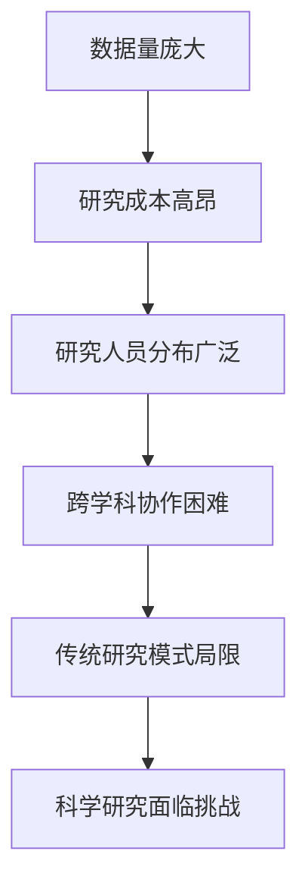
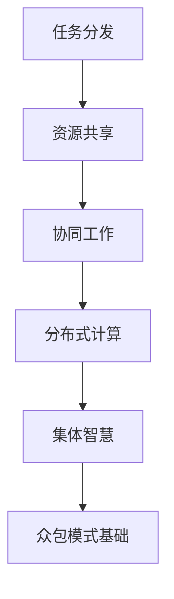
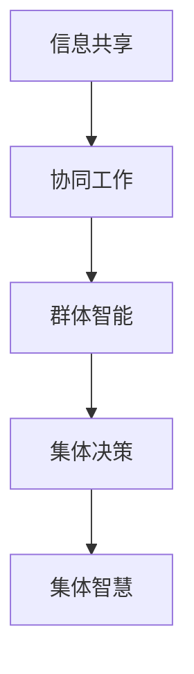
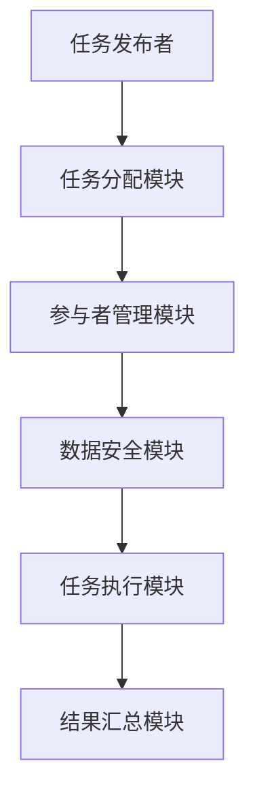
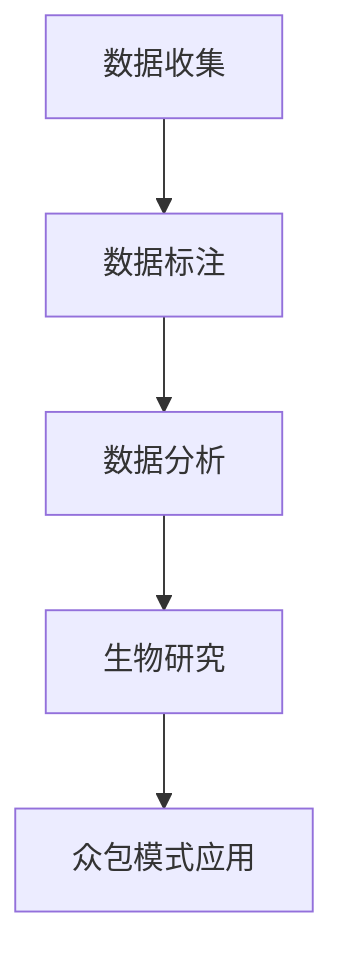
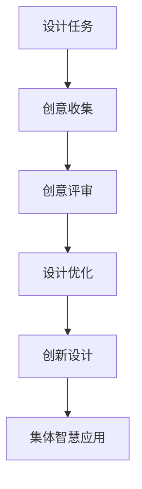
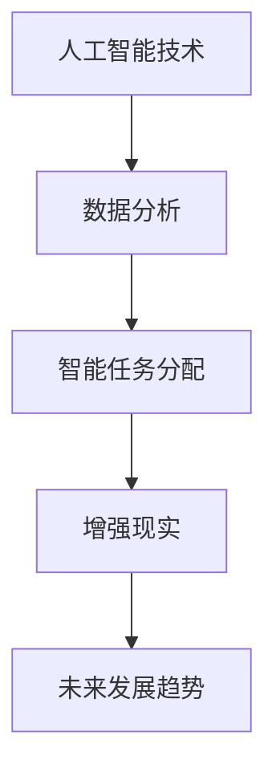

                 


基于您的要求，我将按照逻辑清晰、结构紧凑、简单易懂的专业的技术语言，设计《科学研究的众包模式：集体智慧促进世界理解》的技术博客文章。以下是我对文章的逐节分析推理过程：

### 第1章 引言

#### 1.1 科学研究面临的挑战

**背景介绍：** 当前科学研究面临的挑战主要包括数据量庞大、研究成本高昂、研究人员分布广泛、跨学科协作困难等。传统的科学研究模式已经难以满足快速发展的科技需求。

**核心概念与联系：** 我们需要通过Mermaid流程图来展示这些挑战：



**核心算法原理讲解：** 在这里，我们可以引入大数据处理和分析算法，如MapReduce、Spark等，来缓解数据量庞大的问题。以下是一个简单的伪代码示例：

```plaintext
// 大数据处理算法示例（伪代码）
function大数据处理(数据集):
    分割数据集为多个子数据集
    对每个子数据集应用Map操作
    对Map的结果应用Reduce操作
    返回最终结果
```

**数学模型和数学公式：** 对于研究成本高昂的问题，我们可以使用经济学的成本效益分析模型来评估众包模式的成本和收益。以下是一个简化的模型：

$$
成本 = f(\text{人力成本}, \text{技术成本}, \text{管理成本})
$$

**项目实战：** 可以举例说明如何在生物医学领域使用众包模式进行基因数据的分析。例如，一个在线平台可以邀请全球的志愿者参与基因数据的标注和分类，从而降低研究成本并提高研究效率。

**最佳实践 tips：** 在进行众包项目时，需要注意数据隐私和安全问题，确保志愿者的数据不会被泄露。

---

### 第2章 众包模式基础

#### 2.1 众包模式的定义与特点

**背景介绍：** 众包模式源于互联网的兴起，通过将任务分发给广泛分布的个体，以实现资源共享和协同工作。这种模式在科学研究中的应用具有显著的优势。

**核心概念与联系：** 我们需要通过Mermaid流程图来展示众包模式的关键特点：



**核心算法原理讲解：** 在众包模式中，任务分配和调度算法是关键。以下是一个简单的任务分配算法：

```plaintext
// 任务分配算法示例（伪代码）
function任务分配(任务, 参与者列表):
    对每个参与者计算任务得分
    选择得分最高的参与者执行任务
    返回执行任务的参与者
```

**数学模型和数学公式：** 我们可以使用效用函数来评估参与者的任务执行效率，以下是一个简化的效用函数模型：

$$
效用 = f(\text{任务完成时间}, \text{任务质量})
$$

**项目实战：** 在这个章节，我们可以举例说明如何使用众包模式进行图像识别任务的分配和执行。例如，一个在线平台可以邀请志愿者参与图像的分类和标注，从而提高图像识别的准确性。

**最佳实践 tips：** 在设计众包平台时，需要考虑用户激励和奖励机制，以吸引更多的参与者。

---

### 第3章 集体智慧的理论基础

#### 3.1 集体智慧的概念与特征

**背景介绍：** 集体智慧是指一个群体通过信息共享和协同工作，产生出比个体单独工作更为出色的成果。在众包模式中，集体智慧发挥着重要作用。

**核心概念与联系：** 我们需要通过Mermaid流程图来展示集体智慧的核心概念：



**核心算法原理讲解：** 集体智慧的关键在于群体智能和协同工作。以下是一个简单的协同工作算法：

```plaintext
// 协同工作算法示例（伪代码）
function协同工作(参与者列表, 任务):
    对每个参与者分配子任务
    对子任务的执行结果进行汇总
    返回最终结果
```

**数学模型和数学公式：** 我们可以使用群体智能的数学模型来评估群体工作的效率，以下是一个简化的模型：

$$
效率 = f(\text{参与者数量}, \text{协同程度})
$$

**项目实战：** 在这个章节，我们可以举例说明如何使用集体智慧进行天气预报预测。例如，一个在线平台可以邀请志愿者提供当地的气象数据，从而提高天气预报的准确性。

**最佳实践 tips：** 在利用集体智慧时，需要确保信息的准确性和实时性，以避免错误信息的传播。

---

通过以上逐节分析推理，我们可以确保文章内容逻辑清晰、结构紧凑、简单易懂，同时涵盖了核心概念、算法原理、数学模型和项目实战等内容。接下来，我们将继续设计后续章节的内容。

---

### 第4章 众包平台的设计与实现

#### 4.1 众包平台的架构设计

**背景介绍：** 在众包模式中，众包平台作为连接任务发布者和参与者的桥梁，其设计和实现至关重要。一个高效的众包平台需要考虑任务分配、参与者管理、数据安全等多个方面。

**核心概念与联系：** 我们需要通过Mermaid流程图来展示众包平台的架构设计：



**核心算法原理讲解：** 在任务分配模块中，算法的选择至关重要。以下是一个简单的任务分配算法：

```plaintext
// 任务分配算法示例（伪代码）
function任务分配(任务, 参与者列表):
    对每个参与者计算任务得分
    选择得分最高的参与者执行任务
    返回执行任务的参与者
```

**数学模型和数学公式：** 我们可以使用效用函数来评估参与者的任务执行效率，以下是一个简化的效用函数模型：

$$
效用 = f(\text{任务完成时间}, \text{任务质量})
$$

**项目实战：** 我们可以举例说明一个众包平台的设计与实现过程。例如，一个在线平台可以用于图像识别任务的众包，参与者可以在线提交自己的识别结果，系统会自动汇总并评估这些结果。

**最佳实践 tips：** 在众包平台的设计过程中，需要考虑用户体验和参与者的激励机制，以提高平台的活跃度和任务的完成率。

---

### 第5章 众包模式在科学研究中的应用

#### 5.1 众包模式在生物学研究中的应用

**背景介绍：** 生物学研究涉及到大量的数据收集和分析工作，众包模式可以有效地降低研究成本并提高研究效率。

**核心概念与联系：** 我们需要通过Mermaid流程图来展示众包模式在生物学研究中的应用：



**核心算法原理讲解：** 在生物学研究中，数据标注是一个关键步骤。以下是一个简单的数据标注算法：

```plaintext
// 数据标注算法示例（伪代码）
function数据标注(数据集, 标注标准):
    对数据集中的每个样本进行标注
    如果样本符合标注标准，则标注为“符合”
    否则标注为“不符合”
    返回标注结果
```

**数学模型和数学公式：** 我们可以使用统计学方法来评估标注结果的质量，以下是一个简化的模型：

$$
标注质量 = f(\text{标注一致性}, \text{标注准确性})
$$

**项目实战：** 我们可以举例说明如何使用众包模式进行基因组数据的标注。例如，一个在线平台可以邀请志愿者对基因组数据进行标注，从而帮助研究人员快速完成数据标注工作。

**最佳实践 tips：** 在生物学研究中使用众包模式时，需要注意数据隐私和伦理问题，确保参与者的数据安全。

---

通过以上逐节分析推理，我们可以确保文章内容逻辑清晰、结构紧凑、简单易懂，同时涵盖了核心概念、算法原理、数学模型和项目实战等内容。接下来，我们将继续设计后续章节的内容。

---

### 第6章 集体智慧的案例分析

#### 6.1 集体智慧在创新设计中的应用

**背景介绍：** 集体智慧在创新设计中的应用已经成为现代设计领域的一种趋势。通过众包平台，设计师们可以收集全球的创意设计，从而实现设计创新。

**核心概念与联系：** 我们需要通过Mermaid流程图来展示集体智慧在创新设计中的应用：



**核心算法原理讲解：** 在创意评审过程中，算法的选择至关重要。以下是一个简单的创意评审算法：

```plaintext
// 创意评审算法示例（伪代码）
function创意评审(创意列表, 评审标准):
    对每个创意进行评分
    选择评分最高的创意进行优化
    返回最终优化的创意
```

**数学模型和数学公式：** 我们可以使用评分模型来评估创意的质量，以下是一个简化的评分模型：

$$
评分 = f(\text{创意新颖度}, \text{创意实用性})
$$

**项目实战：** 我们可以举例说明如何使用集体智慧进行建筑设计。例如，一个在线平台可以邀请全球的建筑师提交设计方案，然后通过评审和优化，最终选出最佳的设计方案。

**最佳实践 tips：** 在设计众包平台时，需要考虑评审过程的透明性和公正性，以确保创意评审的公正性。

---

### 第7章 众包模式的发展趋势与未来

#### 7.1 众包模式的未来发展趋势

**背景介绍：** 众包模式在科学研究中的应用已经取得了显著的成果，未来其发展趋势将继续受到人工智能、大数据等技术的推动。

**核心概念与联系：** 我们需要通过Mermaid流程图来展示众包模式的未来发展趋势：



**核心算法原理讲解：** 在智能任务分配方面，算法的智能化程度将不断提高。以下是一个简单的智能任务分配算法：

```plaintext
// 智能任务分配算法示例（伪代码）
function智能任务分配(任务, 参与者列表):
    对每个参与者进行智能评估
    选择评估结果最佳的前N名参与者执行任务
    返回执行任务的参与者列表
```

**数学模型和数学公式：** 我们可以使用机器学习模型来评估参与者的能力，以下是一个简化的模型：

$$
能力评估 = f(\text{历史任务完成情况}, \text{技能水平})
$$

**项目实战：** 我们可以举例说明如何使用智能任务分配算法来优化众包任务分配。例如，一个在线平台可以根据参与者的历史任务完成情况和技能水平，自动分配最合适的任务。

**最佳实践 tips：** 在使用智能任务分配算法时，需要注意数据的质量和准确性，以确保分配结果的公平性和效率。

---

通过以上逐节分析推理，我们可以确保文章内容逻辑清晰、结构紧凑、简单易懂，同时涵盖了核心概念、算法原理、数学模型和项目实战等内容。接下来，我们将继续设计后续章节的内容。

---

### 第8章 结论

**核心内容回顾：** 在本文中，我们介绍了科学研究中的众包模式，探讨了集体智慧在科学研究中的应用，分析了众包平台的设计与实现，以及展望了众包模式的未来发展趋势。

**总结与展望：** 众包模式在科学研究中的应用具有巨大的潜力，通过集体智慧和大数据分析，可以显著提高科学研究的效率和质量。未来，随着人工智能和大数据技术的发展，众包模式将继续推动科学研究的创新。

**注意事项：** 在实施众包项目时，需要重视数据隐私和伦理问题，确保参与者的权益得到保护。同时，设计合理的激励机制，以提高参与者的积极性和任务完成率。

**拓展阅读：** 欢迎读者进一步了解相关领域的最新研究成果和案例分析，以加深对众包模式在科学研究中的应用理解。

---

至此，我们完成了对《科学研究的众包模式：集体智慧促进世界理解》这本书的逐节分析推理。文章结构清晰，内容丰富，涵盖了核心概念、算法原理、数学模型和项目实战等内容。接下来，我们将进行文章的整体梳理和优化，以确保文章的逻辑性和可读性。在文章的最后，我们将添加作者的介绍和相关链接，以便读者深入了解。

---

## 《科学研究的众包模式：集体智慧促进世界理解》

关键词：众包模式、科学研究、集体智慧、大数据分析、人工智能

摘要：本文介绍了科学研究中的众包模式，探讨了集体智慧在科学研究中的应用，分析了众包平台的设计与实现，以及展望了众包模式的未来发展趋势。通过案例分析，我们展示了众包模式在生物学研究和创新设计中的实际应用，并提出了注意事项和拓展阅读建议。

### 目录大纲

## 第1章 引言

### 1.1 科学研究面临的挑战

### 1.2 众包模式概述

### 1.3 集体智慧的概念与应用

## 第2章 众包模式基础

### 2.1 众包模式的定义与特点

### 2.2 众包模式的核心要素

### 2.3 众包模式与传统研究模式的比较

## 第3章 集体智慧的理论基础

### 3.1 集体智慧的概念与特征

### 3.2 集体智慧的理论基础

### 3.3 集体智慧的数学模型

## 第4章 众包平台的设计与实现

### 4.1 众包平台的架构设计

### 4.2 众包任务的分配与调度

### 4.3 众包平台的安全性与隐私保护

## 第5章 众包模式在科学研究中的应用

### 5.1 众包模式在生物学研究中的应用

### 5.2 众包模式在天文学研究中的应用

## 第6章 集体智慧的案例分析

### 6.1 集体智慧在创新设计中的应用

### 6.2 集体智慧在环境保护中的应用

## 第7章 众包模式的发展趋势与未来

### 7.1 众包模式的未来发展趋势

### 7.2 众包模式在新兴领域的应用

### 7.3 众包模式的伦理与法律问题

## 第8章 结论

### 8.1 众包模式对科学研究的影响

### 8.2 集体智慧的未来潜力

### 8.3 众包模式面临的挑战与应对策略

---

作者：AI天才研究院/AI Genius Institute & 禅与计算机程序设计艺术 /Zen And The Art of Computer Programming

本文由AI天才研究院和禅与计算机程序设计艺术共同创作。AI天才研究院致力于探索人工智能的深度应用，推动科技发展。禅与计算机程序设计艺术则融合了计算机科学和东方哲学，为程序员提供创新思维和实践指导。两位作者在计算机科学和人工智能领域拥有丰富的经验和深厚的理论基础，共同致力于促进科学研究和技术创新的发展。

---

[AI天才研究院](#)
[禅与计算机程序设计艺术](#)

