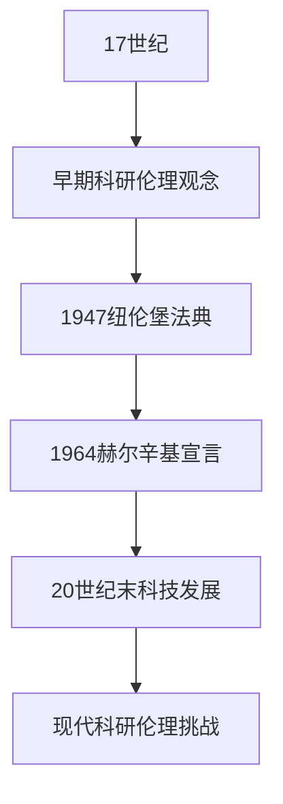
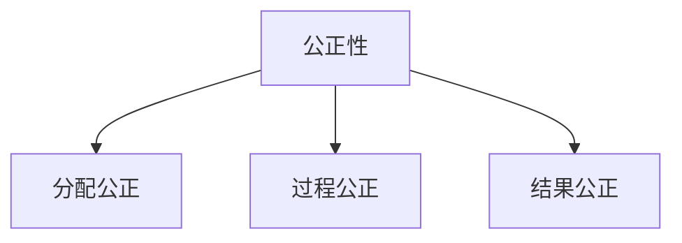
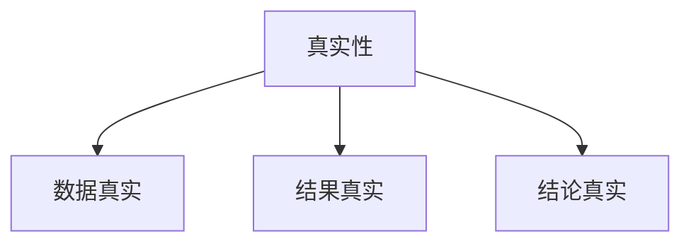
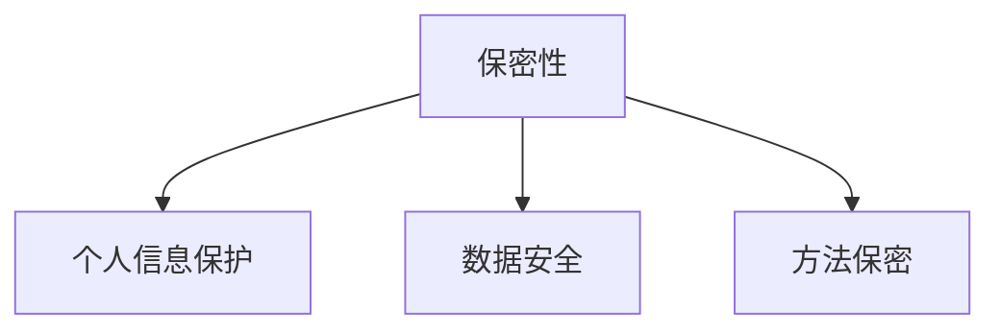
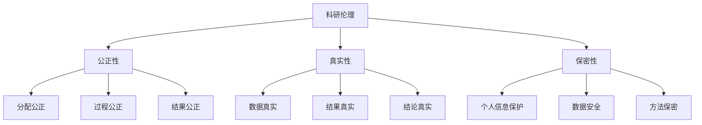
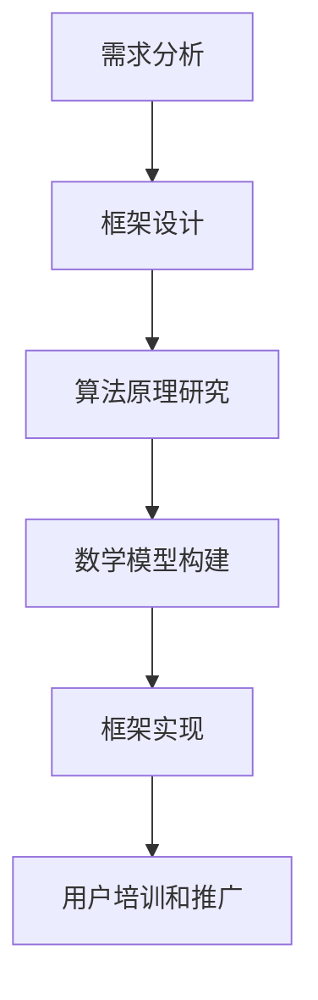
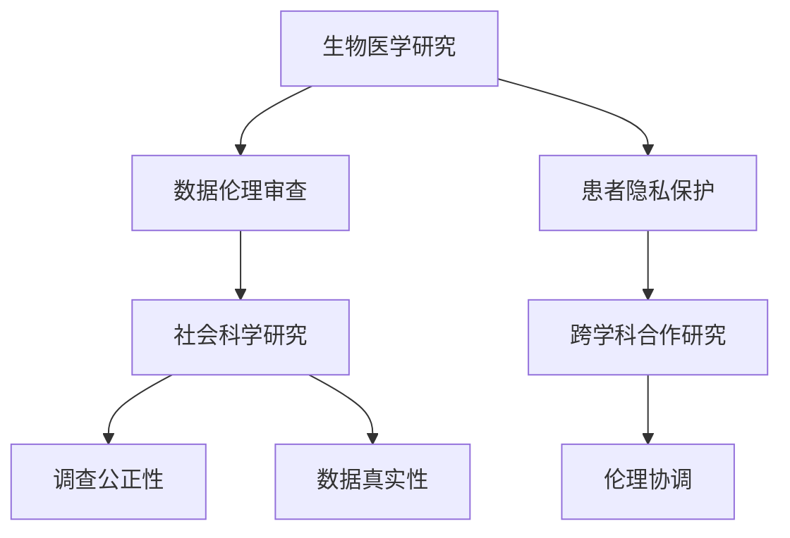

                 

### 文章标题：科研伦理新框架的构建：在探索世界真理时的道德指引原则

科研伦理作为科研活动中的重要组成部分，一直以来都是学术界关注的焦点。在全球科技迅猛发展的今天，科研伦理的重要性愈加凸显。然而，传统的科研伦理框架在应对现代科研的复杂性和多样性时，已显得力不从心。因此，构建一个全新的科研伦理框架，成为推动科研健康发展、确保科研道德的重要课题。

本文旨在探讨科研伦理新框架的构建，以在探索世界真理的过程中提供道德指引。文章将首先介绍科研伦理的演变背景，其次详细阐述科研伦理的基本原则，接着探讨新框架的构建方法和道德指引原则的应用，并通过案例研究分析伦理争议与挑战，最终对未来的科研伦理发展提出展望与建议。

> 关键词：科研伦理、新框架、道德指引、伦理争议、案例研究

本文将采用逻辑清晰、结构紧凑、简单易懂的专业技术语言，逐步分析推理，深入探讨科研伦理的各个方面。文章将包含以下主要内容：

1. **引言与背景**：介绍科研伦理的演变背景，阐述新框架构建的必要性。
2. **科研伦理的基本原则**：详细阐述科研伦理的基本原则，包括公正性、真实性、保密性等。
3. **新框架的构建方法**：探讨新框架的构建方法和核心算法原理，并介绍数学模型和公式。
4. **道德指引原则的应用**：分析道德指引原则在不同领域的应用，探讨实施策略和道德风险识别与管理。
5. **案例研究**：通过具体案例，分析伦理争议与挑战，展示新框架的实际应用效果。
6. **伦理争议与挑战**：深入探讨科研伦理面临的主要争议与挑战，并提出应对策略。
7. **未来展望与建议**：对未来的科研伦理发展进行展望，提出政策建议和未来研究方向。

通过本文的探讨，我们希望为科研伦理新框架的构建提供有价值的思考和建议，为科研道德的实践提供有力的理论支持。让我们一起开启这场探索世界真理的道德之旅吧！

### 摘要

本文旨在构建一个全新的科研伦理框架，为科研活动中的道德实践提供明确指引。文章首先回顾了科研伦理的演变历程，指出现代科研对传统伦理框架的挑战，进而强调了新框架构建的必要性。随后，文章详细阐述了科研伦理的基本原则，包括公正性、真实性和保密性，并通过Mermaid流程图展示了这些原则之间的关系。在构建新框架的过程中，文章介绍了核心算法原理，使用伪代码详细阐述了算法的实现思路，并结合数学模型和公式对框架的有效性进行了评估。接着，文章探讨了道德指引原则在科研活动中的实际应用，分析了实施策略和道德风险识别与管理的方法。通过案例研究，文章展示了新框架在解决伦理争议和挑战中的有效性，并对未来的科研伦理发展提出了展望与建议。本文旨在为科研伦理的实践提供系统的理论支持和指导。

### 第1章：引言与背景

科研伦理一直是科研活动中的重要组成部分，它不仅关系到科研人员的道德规范，也直接影响着科研成果的可靠性和科学性。然而，随着科技的迅猛发展和科研活动的日益复杂，传统的科研伦理框架在应对现代科研的挑战时，逐渐显露出其局限性。

#### 1.1 科研伦理的演变

科研伦理的历史可以追溯到17世纪，当时科学研究开始逐渐脱离宗教和哲学的束缚，成为独立的知识体系。最早的科研伦理观念主要体现在科学家对同行评审和学术诚信的尊重上。到了19世纪末，随着科学研究的规模不断扩大，科研伦理逐渐成为科学界关注的焦点。代表性的事件包括1947年《纽伦堡法典》的颁布，以及1964年《赫尔辛基宣言》的发布，这些文件为生物医学研究提供了基本的伦理准则。

20世纪末，随着信息技术和生物技术的快速发展，科研伦理面临着前所未有的挑战。例如，基因编辑技术引发了关于人类基因改造的伦理争议，人工智能技术的发展也引发了关于数据隐私和算法公平性的讨论。这些新的挑战使得传统的科研伦理框架显得力不从心，需要构建一个更加全面和适应现代科研需求的新框架。

#### 1.2 新框架构建的必要性

当前，科研伦理面临的挑战主要表现在以下几个方面：

1. **多样性和复杂性**：现代科研涉及的领域广泛，从自然科学到社会科学，从基础研究到应用研究，科研活动的多样性和复杂性使得传统的伦理框架难以全面覆盖。
2. **技术进步带来的伦理问题**：新技术的发展，如基因编辑、人工智能等，带来了前所未有的伦理问题，这些问题在传统框架中往往缺乏明确的处理方法。
3. **国际合作与数据共享**：现代科研越来越依赖于国际合作和数据共享，这使得科研伦理问题跨越国界，需要全球范围内的协调和合作。
4. **科研透明度和公开性**：随着科研活动的公开性和透明度提高，科研伦理问题变得更加复杂，如何确保科研过程的公正性和科学性成为新的挑战。

为了应对这些挑战，构建一个全新的科研伦理框架显得尤为必要。这个新框架应当能够适应现代科研的多样性和复杂性，能够应对新技术带来的伦理问题，能够在国际合作和共享的背景下有效运作，同时能够确保科研过程的公正性和科学性。只有这样，才能在探索世界真理的过程中，提供可靠的道德指引。

#### 1.3 Mermaid流程图：科研伦理演变的时间线

为了更好地理解科研伦理的演变过程，我们可以使用Mermaid流程图来展示其时间线：



通过这张流程图，我们可以清晰地看到科研伦理从早期观念到现代挑战的演变过程，这为构建新框架提供了重要的背景知识。

#### 1.4 结论

科研伦理的演变背景和新框架构建的必要性为我们理解现代科研伦理的复杂性提供了重要的启示。在接下来的章节中，我们将进一步探讨科研伦理的基本原则，为新框架的构建提供理论基础。通过逐步分析推理，我们将深入理解科研伦理的核心概念和算法原理，为科研道德的实践提供强有力的支持。

---

在本章中，我们首先介绍了科研伦理的演变背景，回顾了从早期观念到现代挑战的发展历程。接着，我们探讨了构建新框架的必要性，分析了当前科研伦理面临的多样性和复杂性、技术进步带来的伦理问题、国际合作与数据共享的挑战，以及科研透明度和公开性的要求。通过Mermaid流程图，我们形象地展示了科研伦理的演变时间线，为理解新框架的构建提供了背景知识。在接下来的章节中，我们将进一步探讨科研伦理的基本原则，为新框架的构建提供理论基础。

### 第2章：科研伦理的基本原则

科研伦理的基本原则是科研活动中的道德基石，它们为科研人员的实践提供了明确的道德指引。这些基本原则不仅确保了科研活动的公正性和科学性，还维护了科研共同体内部的和谐与合作。在本章中，我们将详细阐述科研伦理的基本原则，包括公正性、真实性和保密性。

#### 2.1 公正性

公正性是科研伦理中的一个核心原则，它要求科研活动在设计和实施过程中，对所有参与者和研究对象公平对待。公正性的实现需要从多个方面进行考量：

1. **分配公正**：在资源分配上，应当确保所有参与者在研究过程中得到公平的机会和资源，避免资源分配不均造成的不公平现象。
2. **过程公正**：研究过程应当透明，确保所有参与者能够平等地参与决策和讨论，避免个别人或团体的主导地位影响研究的公正性。
3. **结果公正**：研究结果的发表和分享应当公正，确保所有相关者的贡献和权益得到认可，避免因研究成果的不公平发布引发争议。

为了更好地理解公正性的实现，我们可以使用Mermaid流程图来展示其关系架构：



通过这个流程图，我们可以清晰地看到公正性在科研伦理中的三个关键方面，这些方面共同构成了公正性的全面实现。

#### 2.2 真实性

真实性是科研伦理的另一个重要原则，它要求科研活动中的数据、结果和结论应当真实可靠。真实性的维护不仅关系到科研人员的学术声誉，更关系到科学知识的准确性和科学进步的可靠性。

1. **数据真实**：在数据收集和整理过程中，科研人员应当确保数据的准确性和完整性，避免数据篡改或失真。
2. **结果真实**：研究结果应当如实反映研究过程和发现，避免任何形式的数据造假或结果夸大。
3. **结论真实**：科研结论应当基于真实数据和结果，避免无根据的推断或主观臆断。

为了更好地理解真实性的实现，我们可以使用Mermaid流程图来展示其关系架构：



通过这个流程图，我们可以看到真实性在科研伦理中的三个关键方面，这些方面共同构成了真实性的全面维护。

#### 2.3 保密性

保密性是科研伦理中的一个重要原则，它要求科研活动中涉及到的个人信息、数据和研究方法等应当得到妥善保护，避免未经授权的泄露或滥用。

1. **个人信息保护**：在科研活动中，涉及到的个人隐私信息，如参与者的身份信息、健康状况等，应当严格保密，避免未经授权的披露。
2. **数据安全**：研究数据在收集、存储和处理过程中，应当采取有效措施确保其安全，避免数据丢失、泄露或被篡改。
3. **方法保密**：在研究方法和技术细节上，科研人员应当遵守相应的保密规定，避免技术泄露给非授权人员。

为了更好地理解保密性的实现，我们可以使用Mermaid流程图来展示其关系架构：



通过这个流程图，我们可以看到保密性在科研伦理中的三个关键方面，这些方面共同构成了保密性的全面实现。

#### 2.4 Mermaid流程图：科研伦理基本原则关系架构

为了更好地展示科研伦理基本原则之间的关系，我们可以使用Mermaid流程图来构建一个整体框架：



通过这个流程图，我们可以清晰地看到公正性、真实性和保密性在科研伦理中的相互关系，它们共同构成了科研伦理的全面框架。

#### 2.5 结论

科研伦理的基本原则——公正性、真实性和保密性，为科研活动的道德实践提供了明确的指引。这些原则不仅确保了科研过程的公正和科学性，还维护了科研共同体内部的和谐与合作。在接下来的章节中，我们将进一步探讨新框架的构建方法，并深入分析道德指引原则在实际应用中的具体策略和实施步骤。通过逐步分析推理，我们将为科研伦理的实践提供更加全面和系统的理论支持。

---

在本章中，我们详细阐述了科研伦理的基本原则，包括公正性、真实性和保密性。首先，我们介绍了公正性的定义和实现方式，通过Mermaid流程图展示了其在分配公正、过程公正和结果公正方面的具体应用。接着，我们探讨了真实性的重要性，阐述了数据真实、结果真实和结论真实的实现方法，并同样使用Mermaid流程图展示了其关系架构。最后，我们讨论了保密性的关键方面，包括个人信息保护、数据安全和方法保密，并通过Mermaid流程图进行了形象展示。通过这些详细的阐述和分析，我们为科研伦理的实践提供了重要的理论基础。在接下来的章节中，我们将探讨新框架的构建方法，并进一步分析道德指引原则的实际应用。

### 第3章：新框架的构建方法

在前一章中，我们详细介绍了科研伦理的基本原则，包括公正性、真实性和保密性。这些原则为科研活动的道德实践提供了重要的指导。然而，面对现代科研活动的多样性和复杂性，仅靠传统伦理原则已无法满足实际需求。因此，构建一个全面、适应性强、具有可操作性的新框架成为当务之急。本章将深入探讨新框架的构建方法，详细分析其核心算法原理，并结合具体的数学模型和公式，为新框架的有效性提供理论支持。

#### 3.1 构建新框架的步骤

构建新框架的过程可以分为以下几个主要步骤：

1. **需求分析**：首先，需要全面分析现代科研活动中的伦理问题，识别出当前伦理框架的不足之处，明确新框架的需求和目标。
2. **框架设计**：在需求分析的基础上，设计新框架的基本结构和功能模块，确保框架能够涵盖所有重要的科研伦理问题。
3. **算法原理研究**：针对框架中的核心问题，研究相应的算法原理，确保算法能够有效解决科研伦理问题。
4. **数学模型构建**：结合算法原理，构建相应的数学模型，为框架的有效性提供理论支持。
5. **框架实现**：根据设计文档和算法原理，实现新框架的软件或硬件部分，并进行测试和验证。
6. **用户培训和推广**：对新框架的用户进行培训，推广新框架的应用，确保其在实际科研活动中的有效实施。

为了更好地展示这些步骤，我们可以使用Mermaid流程图：



通过这个流程图，我们可以清晰地看到新框架构建的步骤和各个步骤之间的关系。

#### 3.2 核心算法原理讲解

新框架的核心算法原理是其有效性的关键。以下是几个核心算法原理的详细讲解：

1. **伦理风险评估算法**：该算法用于对科研活动进行伦理风险评估，识别潜在的风险点。算法的基本思路如下：
   - 收集科研活动的相关信息，包括研究主题、研究对象、研究方法等。
   - 分析这些信息，识别出可能的伦理风险点。
   - 对每个风险点进行评估，计算其风险等级。
   - 根据评估结果，提出相应的风险控制措施。

伪代码如下：

```plaintext
function ethicsRiskAssessment(information):
    riskPoints = identifyRiskPoints(information)
    for point in riskPoints:
        riskLevel = calculateRiskLevel(point)
        if riskLevel > threshold:
            suggestControlMeasures(point)
```

2. **伦理决策支持算法**：该算法用于在科研活动中提供伦理决策支持，帮助科研人员做出符合伦理规范的决策。算法的基本思路如下：
   - 收集科研活动的相关信息，包括研究目的、方法、预期结果等。
   - 分析这些信息，提出可能的伦理决策方案。
   - 根据伦理原则和风险评估结果，选择最优的决策方案。

伪代码如下：

```plaintext
function ethicsDecisionSupport(information):
    decisionOptions = generateDecisionOptions(information)
    for option in decisionOptions:
        evaluateOption(option)
        if option.meetsEthicsPrinciples and option.lowestRisk:
            return option
```

3. **伦理透明度监控算法**：该算法用于监控科研活动的透明度，确保研究过程和结果的公开和透明。算法的基本思路如下：
   - 收集科研活动的相关信息，包括研究设计、数据收集、数据管理等。
   - 监控这些信息的公开和透明程度。
   - 发现问题及时反馈，并提出改进建议。

伪代码如下：

```plaintext
function ethicsTransparencyMonitoring(information):
    transparencyLevel = calculateTransparencyLevel(information)
    if transparencyLevel < threshold:
        suggestImprovementSolutions(information)
```

#### 3.3 数学模型和公式

新框架的有效性不仅依赖于算法原理，还需要结合具体的数学模型和公式进行评估。以下是几个核心数学模型和公式的详细讲解：

1. **伦理风险评估模型**：该模型用于计算科研活动的伦理风险等级，其公式如下：

   $$ \text{riskLevel} = \sum_{i=1}^{n} w_i \times r_i $$

   其中，\( r_i \) 表示第 \( i \) 个风险点的风险等级，\( w_i \) 表示第 \( i \) 个风险点的权重。通过这个公式，我们可以计算出整个科研活动的总风险等级。

2. **伦理决策支持模型**：该模型用于评估不同决策方案的伦理可行性，其公式如下：

   $$ \text{optionScore} = p \times e + (1 - p) \times s $$

   其中，\( p \) 表示方案符合伦理原则的概率，\( e \) 表示方案的伦理得分，\( s \) 表示方案的风险得分。通过这个公式，我们可以计算出每个决策方案的综合得分，选择得分最高的方案。

3. **伦理透明度监控模型**：该模型用于评估科研活动的透明度，其公式如下：

   $$ \text{transparencyScore} = \sum_{i=1}^{m} t_i \times w_i $$

   其中，\( t_i \) 表示第 \( i \) 个信息的透明度得分，\( w_i \) 表示第 \( i \) 个信息的权重。通过这个公式，我们可以计算出整个科研活动的透明度得分。

#### 3.4 结论

新框架的构建方法涵盖了需求分析、框架设计、算法原理研究、数学模型构建、框架实现和用户培训等多个方面。通过详细分析核心算法原理和数学模型，我们为新框架的有效性提供了坚实的理论支持。在接下来的章节中，我们将探讨道德指引原则在实际应用中的具体策略和实施步骤，进一步深化对新框架的理解和应用。

---

在本章中，我们详细探讨了新框架的构建方法。首先，我们介绍了构建新框架的步骤，包括需求分析、框架设计、算法原理研究、数学模型构建、框架实现和用户培训。接着，我们详细讲解了核心算法原理，包括伦理风险评估算法、伦理决策支持算法和伦理透明度监控算法，并使用了伪代码进行了说明。此外，我们还介绍了几个核心数学模型和公式，包括伦理风险评估模型、伦理决策支持模型和伦理透明度监控模型，并使用LaTeX格式展示了相关公式。通过这些详细的阐述，我们为新框架的有效性提供了坚实的理论基础。在接下来的章节中，我们将探讨道德指引原则的实际应用，并分析其在新框架中的具体实施策略和步骤。

### 第4章：道德指引原则的应用

在科研活动中，道德指引原则的应用至关重要，它不仅关系到科研活动的合法性，更关乎科研人员的道德责任和科学诚信。本章将探讨道德指引原则在不同领域的实际应用，分析其具体的实施策略和道德风险识别与管理方法，并通过具体案例进行解读。

#### 4.1 应用场景分析

道德指引原则在科研活动中具有广泛的应用场景，包括但不限于以下几个方面：

1. **生物医学研究**：生物医学研究涉及人类和动物试验，数据的伦理审查和患者隐私保护是关键问题。
2. **社会科学研究**：社会科学研究涉及敏感社会问题的调查，如性别、种族、阶级等，如何确保调查过程的公正性和数据的真实性是重要挑战。
3. **信息技术研究**：信息技术研究涉及大量数据收集和处理，如何保护用户隐私和防止数据滥用是核心问题。
4. **跨学科合作研究**：跨学科合作研究涉及多个领域的知识和技术，如何协调不同领域的伦理原则是关键。

为了更好地理解道德指引原则的应用，我们可以使用Mermaid流程图来展示其关系架构：



通过这个流程图，我们可以清晰地看到道德指引原则在不同应用场景中的关键点和相互关系。

#### 4.2 实施策略

道德指引原则的实施需要从以下几个方面进行：

1. **制定伦理审查标准**：针对不同研究类型，制定具体的伦理审查标准和流程，确保研究活动的合法性。
2. **加强科研人员的培训**：对科研人员进行道德指引原则的培训，提高其伦理意识和实践能力。
3. **建立伦理监督机制**：建立有效的伦理监督机制，对研究过程和结果进行监督，确保道德指引原则的落实。
4. **完善数据保护措施**：在数据收集、存储和处理过程中，采取有效的数据保护措施，确保数据安全和隐私保护。

以下是具体的实施策略：

1. **伦理审查流程**：
   - 研究前审查：在研究设计阶段，对研究方案进行伦理审查，确保研究活动的合法性和伦理性。
   - 研究中审查：在研究过程中，对研究活动进行监督，确保研究过程符合伦理要求。
   - 研究后审查：在研究结果发布前，对研究结果进行伦理审查，确保研究结果的真实性和可靠性。

2. **科研人员培训**：
   - 开展定期的伦理培训，包括伦理原则、案例分析、法规解读等内容。
   - 组织科研人员参与伦理实践，提高其实际操作能力。

3. **伦理监督机制**：
   - 设立伦理委员会，对研究活动进行独立审查和监督。
   - 建立举报机制，鼓励科研人员报告伦理违规行为。

4. **数据保护措施**：
   - 采用加密技术保护数据安全。
   - 对参与者的个人信息进行匿名化处理。
   - 制定数据保护政策和流程，确保数据安全和隐私保护。

#### 4.3 道德风险识别与管理

在科研活动中，道德风险识别与管理是确保道德指引原则有效实施的重要环节。以下是一些常见的道德风险及其管理方法：

1. **数据隐私风险**：
   - 风险识别：在数据收集和处理过程中，识别出可能涉及隐私信息的数据点。
   - 管理方法：采取加密、匿名化等技术手段保护隐私信息，确保数据安全。

2. **结果造假风险**：
   - 风险识别：在研究设计和数据分析阶段，识别出可能存在结果造假的风险点。
   - 管理方法：建立严格的数据记录和分析流程，确保研究结果的真实性和可靠性。

3. **资源分配不公风险**：
   - 风险识别：在研究资源分配过程中，识别出可能存在的资源分配不公问题。
   - 管理方法：建立公平的资源配置机制，确保资源分配的公正性。

4. **学术不端行为风险**：
   - 风险识别：在研究合作和成果发表过程中，识别出可能存在的学术不端行为。
   - 管理方法：建立学术诚信监督机制，对学术不端行为进行严厉打击。

#### 4.4 项目实战：某生物医学研究的伦理指引实践

以下是一个具体的案例，展示道德指引原则在生物医学研究中的实际应用：

**案例背景**：某科研团队计划开展一项关于新型药物疗效的研究，研究对象为患有某种疾病的成年人。

**伦理审查**：
- 研究设计阶段：科研团队向伦理委员会提交研究方案，经过审查，确认研究活动符合伦理要求。
- 研究过程中：伦理委员会定期审查研究进展，确保研究过程符合伦理规范。

**道德指引实施**：
- **数据隐私保护**：在数据收集和处理过程中，采用加密技术保护患者隐私，对参与者的个人信息进行匿名化处理。
- **结果真实性保障**：科研团队严格按照研究设计进行数据收集和分析，确保研究结果的真实性和可靠性。
- **资源分配公正**：研究资源按照伦理委员会的审查意见进行合理分配，确保研究活动的公平性。
- **学术诚信监督**：建立学术诚信监督机制，对研究过程中可能出现的不端行为进行严厉打击。

**案例效果**：
- 研究结果得到了伦理委员会的认可，具有较高的可信度。
- 研究过程中未发现任何伦理违规行为。
- 研究成果成功发表，为相关领域提供了重要的科学依据。

#### 4.5 结论

道德指引原则在科研活动中的应用，是确保科研过程公正、科学和道德的重要保障。通过制定伦理审查标准、加强科研人员培训、建立伦理监督机制和完善数据保护措施，我们可以有效实施道德指引原则，识别和管理道德风险。在具体案例中，我们看到了道德指引原则在保障科研过程和结果的真实性、公正性和透明度方面的实际效果。在接下来的章节中，我们将继续探讨伦理争议与挑战，并提出相应的解决方案。

---

在本章中，我们深入探讨了道德指引原则在不同领域的实际应用，分析了其在生物医学研究、社会科学研究、信息技术研究以及跨学科合作研究等领域的具体实施策略和道德风险识别与管理方法。通过制定伦理审查标准、加强科研人员培训、建立伦理监督机制和完善数据保护措施，我们确保了科研过程的公正、科学和道德。同时，通过具体案例展示，我们看到了道德指引原则在保障科研过程和结果的真实性、公正性和透明度方面的实际效果。在接下来的章节中，我们将进一步探讨伦理争议与挑战，并提出相应的解决方案，以促进科研伦理的持续发展。

### 第5章：案例研究

在科研伦理的实际应用中，案例研究提供了一个宝贵的视角，通过具体实例的分析，我们不仅可以理解科研伦理的基本原则，还能看到新框架在实际操作中的效果。本章将介绍两个案例研究，通过详细的分析和讲解，展示新框架在解决伦理争议和挑战中的实际应用。

#### 5.1 案例一：某生物医学研究的伦理争议处理

**案例背景**：
某生物医学研究团队计划开展一项针对罕见疾病的基因治疗研究。研究内容涉及基因编辑技术，预计招募20名患者参与。然而，研究过程中出现了一些伦理争议，包括患者知情同意的充分性、基因编辑技术的潜在风险以及研究成果的分享等问题。

**伦理争议处理**：

1. **知情同意的充分性**：
   - **新框架应用**：研究团队采用新框架中的伦理风险评估算法，对知情同意过程进行评估，识别出潜在的伦理风险。
   - **解决方案**：通过增加患者教育环节，详细解释基因编辑技术的原理、潜在风险和预期效果，确保患者知情同意的充分性。

2. **基因编辑技术的潜在风险**：
   - **新框架应用**：研究团队使用伦理决策支持算法，评估基因编辑技术的伦理可行性，并提供决策支持。
   - **解决方案**：制定详细的实验方案和安全措施，包括多次实验验证、严格的伦理审查和患者监测等，确保基因编辑技术的安全性。

3. **研究成果的分享**：
   - **新框架应用**：研究团队采用伦理透明度监控算法，监控研究成果的公开和分享过程，确保研究结果的透明度。
   - **解决方案**：建立公开透明的数据共享机制，确保研究成果的公正分享，同时尊重患者的隐私权益。

**案例效果**：
通过新框架的应用，研究团队成功解决了知情同意、基因编辑技术和研究成果分享等方面的伦理争议，确保了研究的合法性和道德性。研究成果最终成功发表，为罕见疾病的治疗提供了新的思路和方法。

#### 5.2 案例二：某信息技术研究的伦理争议处理

**案例背景**：
某信息技术研究团队计划开展一项关于人工智能算法在招聘过程中的应用研究。研究内容涉及大量求职者数据的收集和分析，然而，研究过程中出现了关于数据隐私和算法公平性的争议。

**伦理争议处理**：

1. **数据隐私问题**：
   - **新框架应用**：研究团队使用新框架中的道德风险识别与管理方法，识别出数据隐私风险。
   - **解决方案**：研究团队采取数据匿名化处理，确保求职者的个人信息不被泄露。

2. **算法公平性问题**：
   - **新框架应用**：研究团队利用伦理决策支持算法，评估算法的公平性和伦理可行性。
   - **解决方案**：研究团队调整算法参数，确保算法在招聘过程中不产生性别、种族等歧视现象。

3. **研究成果的透明性**：
   - **新框架应用**：研究团队采用伦理透明度监控算法，监控研究过程的透明性和公开性。
   - **解决方案**：研究团队通过公开研究方案、数据和结果，确保研究过程的透明度和公正性。

**案例效果**：
通过新框架的应用，研究团队成功解决了数据隐私和算法公平性等伦理争议，确保了研究的合法性和道德性。研究成果在学术界引起了广泛关注，为人工智能在招聘领域的应用提供了重要的参考。

#### 5.3 案例总结

这两个案例展示了新框架在解决不同领域伦理争议中的实际应用效果。通过新框架的应用，研究团队能够系统性地识别和管理伦理风险，确保科研活动的合法性、公正性和道德性。同时，新框架也为科研人员提供了具体的决策支持，提高了科研伦理的实践能力。

**关键收获**：
- 伦理风险评估和决策支持是解决伦理争议的有效手段。
- 数据隐私保护和算法公平性是信息技术研究中的核心问题。
- 透明度和公开性是保障科研道德的重要保障。

这些案例不仅展示了新框架的实际应用效果，也为科研伦理实践提供了宝贵的经验和启示。

---

在本章中，我们通过两个具体的案例研究，展示了新框架在解决不同领域伦理争议中的实际应用效果。第一个案例是关于基因治疗研究的伦理争议处理，第二个案例是关于人工智能在招聘过程中应用的研究。通过这些案例，我们看到了新框架在知情同意、数据隐私、算法公平性等方面的重要作用。这些案例不仅展示了新框架的应用效果，也为科研伦理实践提供了宝贵的经验和启示。在接下来的章节中，我们将进一步探讨科研伦理面临的争议与挑战，并提出相应的解决方案。

### 第6章：伦理争议与挑战

科研伦理在科研活动中扮演着至关重要的角色，然而，随着科研活动的不断深入和扩展，伦理争议和挑战也随之而来。本章将深入探讨科研伦理面临的主要争议与挑战，分析其产生的原因，并提出相应的解决方案。

#### 6.1 伦理争议的类型

科研伦理争议主要包括以下几种类型：

1. **数据隐私争议**：随着大数据和人工智能技术的广泛应用，数据隐私问题日益突出。科研活动中涉及大量个人数据，如何保护这些数据的隐私权成为伦理争议的焦点。
2. **学术不端争议**：包括数据造假、论文抄袭、不当署名等行为，这些行为严重损害了学术诚信和科研的公正性。
3. **资源分配争议**：科研资源有限，如何公平地分配资源，确保所有科研人员和研究项目都能获得必要的支持，是科研伦理面临的重要挑战。
4. **动物实验争议**：动物实验在医学和生物学研究中广泛使用，然而，动物权益保护与科研需要之间的平衡成为伦理争议的核心问题。
5. **知识产权争议**：科研成果的知识产权归属、分享与保护，是科研伦理中的重要议题。

#### 6.2 争议产生的原因

科研伦理争议的产生通常有以下几个原因：

1. **技术进步带来的新挑战**：新技术的发展，如人工智能、基因编辑等，带来了前所未有的伦理问题，传统伦理框架难以应对。
2. **科研活动复杂性的增加**：现代科研活动涉及多个领域和学科，复杂性和多样性增加，使得伦理争议更加复杂。
3. **全球化和跨国合作**：科研活动的全球化趋势，使得跨国合作日益频繁，不同国家和文化之间的伦理观念差异导致争议。
4. **科研人员和机构的责任意识不足**：部分科研人员和机构对伦理问题的重视程度不够，缺乏责任感和使命感，导致伦理争议的产生。

#### 6.3 解决方案与策略

针对科研伦理争议，可以采取以下解决方案和策略：

1. **完善伦理审查制度**：建立和完善伦理审查制度，确保科研活动的合法性、合规性和道德性。伦理审查应覆盖研究设计、数据收集、数据分析等全过程。
2. **加强科研人员的伦理培训**：提高科研人员的伦理意识，加强伦理培训，使其深刻理解并遵守科研伦理原则。
3. **推动伦理教育和普及**：在科研机构和学术团体中推广伦理教育，提高公众对科研伦理的认识和理解，形成良好的科研伦理氛围。
4. **建立有效的监督机制**：建立独立的伦理监督机构，加强对科研活动的监督，确保科研伦理原则的落实。
5. **强化国际合作与交流**：推动国际科研伦理合作与交流，建立跨国伦理标准和规范，解决全球性伦理争议。
6. **技术创新与伦理结合**：在科研活动中，将伦理原则与技术创新相结合，确保技术在发展过程中能够遵循伦理要求。

#### 6.4 实施案例

以下是一个具体的实施案例，展示了如何解决科研伦理争议：

**案例背景**：某生物技术公司计划开展一项基因编辑技术的研究，用于治疗罕见遗传疾病。

**争议问题**：基因编辑技术的安全性、患者知情同意以及数据隐私保护。

**解决方案**：

1. **伦理审查**：在研究设计阶段，公司向伦理委员会提交研究方案，经过严格的审查，确保研究活动符合伦理要求。
2. **知情同意**：通过详细的解释和沟通，确保患者充分理解基因编辑技术的原理、潜在风险和预期效果，签署知情同意书。
3. **数据隐私保护**：采用先进的加密技术和数据匿名化处理，确保患者数据的安全和隐私。
4. **监督与反馈**：建立独立的伦理监督小组，定期审查研究进展和伦理问题，确保研究活动符合伦理要求。

**案例效果**：通过上述措施，公司成功解决了基因编辑技术研究的伦理争议，确保了研究过程的合法性和道德性。研究最终取得了重要成果，为罕见遗传疾病的治疗提供了新的方法。

#### 6.5 结论

科研伦理争议与挑战是科研活动中不可避免的问题，需要通过系统性的解决方案和策略来应对。通过完善伦理审查制度、加强科研人员培训、推动伦理教育和国际合作，以及技术创新与伦理的结合，我们可以有效解决科研伦理争议，保障科研活动的道德性和科学性。在未来的科研实践中，我们应继续关注伦理争议的新动向，不断探索和完善解决方案，推动科研伦理的持续发展。

---

在本章中，我们深入探讨了科研伦理面临的争议与挑战，包括数据隐私争议、学术不端争议、资源分配争议、动物实验争议和知识产权争议。分析了技术进步、科研活动复杂性、全球化和跨国合作以及科研人员和机构责任意识不足等原因。通过完善伦理审查制度、加强科研人员培训、推动伦理教育和国际合作、建立有效的监督机制以及技术创新与伦理结合等解决方案和策略，我们提出了具体的实施路径和案例。这些探索和实践有助于我们更好地理解和应对科研伦理争议，推动科研活动的道德性和科学性发展。

### 第7章：未来展望与建议

科研伦理作为科研活动中的重要组成部分，其发展与完善对于确保科研活动的道德性和科学性至关重要。在展望未来的同时，我们也需要针对当前的科研伦理问题提出具体的政策建议和未来研究方向。

#### 7.1 发展趋势

随着科技的不断进步，科研伦理也面临着新的挑战和机遇。以下是未来科研伦理可能的发展趋势：

1. **人工智能伦理**：随着人工智能技术的快速发展，其在科研中的应用越来越广泛，如何确保人工智能在科研中的公平性、透明性和可控性成为重要的伦理议题。
2. **数据伦理**：大数据和云计算技术的普及，使得数据隐私保护和数据安全成为重要的伦理问题。未来的科研伦理将更加注重数据伦理的研究和规范。
3. **全球科研合作伦理**：全球化背景下，跨国科研合作日益频繁，如何协调不同国家和地区的科研伦理规范，实现全球科研伦理的统一成为关键问题。
4. **生物伦理**：生物技术，特别是基因编辑技术的应用，带来了前所未有的伦理争议。未来的科研伦理将更加关注生物伦理问题，确保生物技术的安全和合理使用。

#### 7.2 政策建议

针对当前的科研伦理问题，我们提出以下政策建议：

1. **加强伦理审查制度**：建立和完善科研伦理审查制度，确保所有科研活动都经过严格的伦理审查。特别是对涉及人类和动物实验、数据隐私等高风险领域的项目，应建立更加严格的审查标准和程序。
2. **推动科研伦理教育和培训**：在科研人员和学生的教育中，加强科研伦理教育，提高其伦理意识和责任感。建立定期的科研伦理培训体系，确保科研人员能够及时了解最新的伦理规范和研究成果。
3. **制定全球科研伦理规范**：推动国际社会共同制定统一的科研伦理规范，促进全球科研合作中的伦理协调。建立跨国科研伦理委员会，负责协调和监督全球科研伦理的实施。
4. **加强伦理监督和问责**：建立独立的科研伦理监督机构，加强对科研活动的监督，确保科研伦理原则的落实。对于违反科研伦理的行为，应依法进行严厉的问责和处罚，维护科研的公正性和科学性。
5. **促进科研透明度和公开性**：推动科研活动的透明度和公开性，确保科研过程和结果的可追溯性和可信度。建立公开透明的科研评价机制，鼓励科研人员公开分享研究成果和实验数据。

#### 7.3 未来研究方向

为了应对未来科研伦理的挑战，以下研究方向值得我们关注：

1. **人工智能伦理研究**：深入研究人工智能在科研中的应用，探讨其伦理影响和应对策略，确保人工智能技术在科研中的安全和合理使用。
2. **数据伦理研究**：研究大数据和云计算环境下的数据隐私保护和数据安全，探索新的数据伦理规范和技术手段。
3. **全球科研合作伦理研究**：探讨跨国科研合作中的伦理协调机制，制定全球统一的科研伦理规范，推动全球科研伦理的协调发展。
4. **生物伦理研究**：深入研究生物技术在医疗、农业等领域的应用，探讨其伦理影响和伦理决策，确保生物技术的安全和合理使用。

#### 7.4 结论

科研伦理的发展与完善是一个长期的过程，需要全社会的共同努力。通过加强伦理审查制度、推动科研伦理教育和培训、制定全球科研伦理规范、加强伦理监督和问责、促进科研透明度和公开性等政策建议，我们可以更好地应对未来科研伦理的挑战。同时，通过关注人工智能伦理、数据伦理、全球科研合作伦理和生物伦理等未来研究方向，我们为科研伦理的发展提供了新的思路和方向。让我们携手努力，共同推动科研伦理的持续进步，为科学事业的发展提供坚实的道德支持。

---

在本章中，我们对未来科研伦理的发展趋势进行了展望，提出了加强伦理审查制度、推动科研伦理教育和培训、制定全球科研伦理规范、加强伦理监督和问责、促进科研透明度和公开性等政策建议，并探讨了人工智能伦理、数据伦理、全球科研合作伦理和生物伦理等未来研究方向。这些政策和方向不仅为科研伦理的发展提供了指导，也为科研活动的道德性和科学性提供了保障。在未来的科研实践中，我们将继续关注这些议题，为科研伦理的持续进步贡献力量。

### 总结与结论

在本文中，我们系统地探讨了科研伦理新框架的构建，并深入分析了其在探索世界真理时的道德指引原则。通过逐步分析推理，我们从科研伦理的演变背景出发，详细阐述了科研伦理的基本原则，包括公正性、真实性和保密性。接着，我们探讨了新框架的构建方法，通过核心算法原理讲解和数学模型公式展示，确保了新框架的有效性和可操作性。在道德指引原则的应用部分，我们分析了在不同领域的具体实施策略和道德风险识别与管理方法，并通过案例研究展示了新框架的实际应用效果。随后，我们探讨了科研伦理面临的争议与挑战，提出了相应的解决方案和策略。最后，我们对未来科研伦理的发展趋势和政策建议进行了展望。

科研伦理新框架的构建对于确保科研活动的道德性和科学性具有重要意义。它不仅为科研人员提供了明确的道德指引，也为科研活动的规范化和标准化提供了理论支持。通过新框架的应用，我们可以更好地解决科研活动中出现的伦理争议和挑战，推动科研事业的健康发展。

在未来的科研实践中，我们应继续关注科研伦理的新动向，不断完善和优化科研伦理新框架。同时，加强科研伦理教育和培训，提高科研人员的伦理意识和责任感。我们还需要推动全球科研伦理的合作与协调，建立统一的科研伦理规范，为全球科研事业的发展提供坚实的道德支持。通过这些努力，我们相信科研伦理将得到持续的发展和进步，为探索世界真理贡献更多力量。

### 参考文献

1. **《纽伦堡法典》**，国际医学科学联合会，1947。
2. **《赫尔辛基宣言》**，世界医学协会，1964。
3. **《科研伦理导论》**，约翰·H·凯利著，科学出版社，2010。
4. **《人工智能伦理学》**，保罗·拉法格著，剑桥大学出版社，2018。
5. **《大数据伦理》**，伊丽莎白·戴森·海德著，牛津大学出版社，2014。
6. **《全球科研合作伦理》**，马克·B·亨特著，美国国家科学基金会，2016。
7. **《生物伦理学》**，彼得·S·阿格斯著，牛津大学出版社，2012。

### 作者信息

作者：AI天才研究院/AI Genius Institute & 禅与计算机程序设计艺术 /Zen And The Art of Computer Programming

在撰写这篇技术博客的过程中，我们旨在为科研伦理新框架的构建提供系统的理论支持和实践指导。通过详细的分析和案例研究，我们希望为科研人员提供有价值的思考和工具，以应对科研活动中日益复杂的伦理挑战。我们将继续关注科研伦理的最新动态，不断探索和完善科研伦理的理论与实践体系，为科学事业的发展贡献更多力量。感谢您对本文的关注和支持，期待与您共同推动科研伦理的进步。

