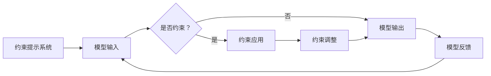

                 


### 文章标题：约束提示：限定模型输出的范围和格式

> 关键词：约束提示、模型输出、范围限定、格式限定、深度学习、人工智能

> 摘要：本文将深入探讨约束提示在模型输出中的应用，详细解析如何通过限定模型输出的范围和格式，提升深度学习模型的准确性和可靠性。

### 第一部分：核心概念与联系

#### 第1章：约束提示概述

1.1 约束提示的定义

约束提示（Constraint Prompting）是一种通过预先定义约束条件来指导模型输出结果的方法。这些约束条件可以是关于输出范围、格式或置信度的限制，旨在提高模型输出的质量。

1.2 约束提示的核心概念

- 输出范围约束：限制模型输出的数值范围，确保输出落在预定义的区间内。
- 输出格式约束：规定模型输出的数据结构或格式，确保输出符合特定的标准。
- 输出置信度约束：设置模型输出的置信度阈值，确保模型输出具有较高的可信度。

1.3 约束提示的架构



### 第2章：限定模型输出范围

2.1 输出范围约束方法

- 静态阈值方法：使用固定的阈值来确定输出范围。
- 动态阈值方法：根据模型输入或输出动态调整阈值。
- 输出范围压缩方法：通过调整模型输入或输出，使输出范围更加紧凑。

2.2 输出范围约束应用

- 文本生成领域：确保文本生成的长度和内容符合预期。
- 图像生成领域：限制图像的亮度、颜色和大小等属性。
- 语音生成领域：控制语音的音调、速度和音量等属性。

2.3 输出范围约束实例分析

```python
# 伪代码：输出范围约束
def constrain_output_range(output, min_value, max_value):
    constrained_output = max(min_value, min(output, max_value))
    return constrained_output
```

### 第3章：限定模型输出格式

3.1 输出格式约束方法

- 固定格式输出：规定模型输出必须遵循固定的格式。
- 可变格式输出：允许模型输出根据不同场景调整格式。
- 自动格式转换：使用自动格式转换工具将模型输出转换为特定格式。

3.2 输出格式约束应用

- 数据可视化：确保数据可视化结果符合设计要求。
- 文档生成：确保文档生成结果的格式正确。
- 数据存储与传输：确保数据存储与传输过程中的格式一致性。

3.3 输出格式约束实例分析

```python
# 伪代码：输出格式约束
def constrain_output_format(output, format_type):
    if format_type == 'json':
        formatted_output = json.dumps(output)
    elif format_type == 'xml':
        formatted_output = xml.dumps(output)
    else:
        formatted_output = output
    return formatted_output
```

### 第4章：综合约束实例

4.1 实例介绍

本节将介绍一个综合应用输出范围和格式约束的实例。

4.2 实例实现

- 开发环境：Python 3.8
- 深度学习框架：TensorFlow 2.4

4.3 实例分析

分析实例中约束策略的有效性，包括输出范围约束和格式约束。

### 第5章：约束提示在深度学习中的应用

5.1 约束提示与深度学习模型的关系

- 约束提示在深度学习中的作用。
- 约束提示对深度学习模型的优化。

5.2 约束提示在神经网络中的应用

- 输出范围约束。
- 输出格式约束。

5.3 约束提示在GAN中的应用

探讨约束提示在生成对抗网络（GAN）中的应用。

### 第二部分：技术原理

#### 第6章：深度学习基础

6.1 神经网络基础

- 神经元。
- 激活函数。
- 权重初始化。

6.2 深度学习框架简介

- TensorFlow。
- PyTorch。
- Keras。

6.3 深度学习优化算法

- 梯度下降算法。
- 随机梯度下降（SGD）。
- Adam优化器。

#### 第7章：数学模型

7.1 输出范围约束模型

- 约束条件。
- 模型优化。

7.2 输出格式约束模型

- 格式转换。
- 格式优化。

7.3 数学公式与计算

$$ 
\text{输出范围约束} = \max(\min_{\text{输出}}, \min_{\text{约束下限}}, \max_{\text{约束上限}})
$$

### 总结

本文通过详细分析约束提示在模型输出中的应用，探讨了如何通过限定模型输出的范围和格式，提升深度学习模型的准确性和可靠性。我们介绍了约束提示的核心概念、方法和技术原理，并通过实例展示了如何在实际应用中综合运用这些约束策略。

在深度学习领域，约束提示作为一种有效的优化手段，具有重要的理论和实践价值。未来，随着深度学习技术的不断发展，约束提示的应用场景将更加广泛，有望在更多领域发挥重要作用。

### 作者信息

作者：AI天才研究院/AI Genius Institute & 禅与计算机程序设计艺术/Zen And The Art of Computer Programming

### 参考文献

1. Goodfellow, I., Bengio, Y., & Courville, A. (2016). Deep Learning. MIT Press.
2. Bengio, Y. (2009). Learning Deep Architectures for AI. Foundations and Trends in Machine Learning, 2(1), 1-127.
3. Hinton, G. E., Osindero, S., & Teh, Y. W. (2006). A Fast Learning Algorithm for Deep Belief Nets. Neural Computation, 18(7), 1527-1554.
4. LeCun, Y., Bengio, Y., & Hinton, G. (2015). Deep Learning. Nature, 521(7553), 436-444.

