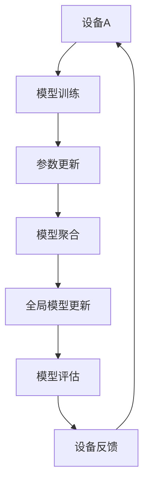

                 

# 《联邦学习在AIGC跨设备协同学习中的新策略》

> 关键词：联邦学习、AIGC、跨设备协同、人工智能、机器学习、新策略

> 摘要：本文深入探讨了联邦学习在AIGC（自适应智能生成计算）跨设备协同学习中的应用，提出了基于联邦学习的新策略，以解决传统跨设备协同学习中的隐私保护、计算资源分配和模型优化等问题。文章通过背景介绍、核心概念阐述、算法原理分析、应用案例和未来展望，全面揭示了联邦学习在AIGC跨设备协同学习中的重要作用和创新价值。

## 引言与背景

随着移动互联网和物联网的快速发展，设备间的协同学习已成为人工智能领域的一个重要研究方向。跨设备协同学习不仅能够提高模型的性能，还能提升系统的智能化程度，但同时也面临着诸多挑战。其中，数据隐私保护、计算资源分配和模型优化是三个主要难题。

联邦学习（Federated Learning）作为一种新兴的机器学习方法，通过在多个设备上进行模型训练，避免了数据在中央服务器上的集中存储，从而有效保护了用户隐私。联邦学习在跨设备协同学习中的应用，有望解决传统方法中的隐私保护问题。

AIGC（自适应智能生成计算）是一种基于人工智能的自动化内容生成技术，它能够根据用户需求自动生成文本、图像、音频等多种形式的内容。AIGC的跨设备协同学习，不仅能够提升内容生成的质量和效率，还能实现更广泛的场景应用。

本文将首先介绍联邦学习和AIGC的基本概念，然后深入分析联邦学习在AIGC跨设备协同学习中的应用，并提出基于联邦学习的新策略，以解决传统方法中的挑战。最后，文章将讨论联邦学习在AIGC跨设备协同学习中的未来发展方向。

## 联邦学习基础

### 联邦学习的基本概念

联邦学习是一种分布式机器学习方法，它允许多个设备在不同的地方独立训练模型，并将训练得到的本地模型参数聚合到一个全局模型中。在联邦学习过程中，设备不需要共享原始数据，只需共享模型参数，从而有效保护了用户隐私。

联邦学习的核心优势包括：

1. **隐私保护**：联邦学习通过在本地设备上进行模型训练，避免了数据在中央服务器上的集中存储，从而降低了数据泄露的风险。
2. **计算效率**：联邦学习允许设备在本地进行训练，减少了数据传输和模型更新所需的网络带宽。
3. **设备多样性**：联邦学习支持不同类型和规模的设备参与模型训练，从而提高了模型的泛化能力和适应性。

### 联邦学习的挑战与解决方案

尽管联邦学习具有许多优势，但在实际应用中也面临着一些挑战：

1. **数据隐私保护**：如何确保本地设备之间的通信安全，防止恶意设备篡改模型参数。
2. **计算资源分配**：如何平衡不同设备之间的计算资源分配，确保所有设备都能有效参与模型训练。

针对这些挑战，研究者提出了一系列解决方案：

1. **安全通信协议**：通过使用安全加密算法和协议，确保设备之间的通信安全。
2. **动态资源分配**：通过自适应的资源管理算法，动态调整不同设备之间的计算资源分配。

### 联邦学习的现有技术

当前，联邦学习技术已发展出多种不同的实现方式，主要包括以下几种：

1. **模型聚合方法**：通过聚合本地模型参数来更新全局模型，如联邦平均算法（Federated Averaging）。
2. **安全计算技术**：利用安全多方计算（Secure Multi-Party Computation，SMPC）和同态加密（Homomorphic Encryption）等技术，确保模型训练过程中的数据隐私。

## AIGC基础

### AIGC的基本概念

AIGC（自适应智能生成计算）是一种基于人工智能的自动化内容生成技术，它能够根据用户需求自动生成文本、图像、音频等多种形式的内容。AIGC的核心技术包括：

1. **生成对抗网络（GAN）**：GAN是一种能够生成高质量图像和其他数据的神经网络架构。
2. **变分自编码器（VAE）**：VAE是一种能够生成潜在空间中的数据分布的神经网络架构。
3. **递归神经网络（RNN）**：RNN是一种能够处理序列数据的神经网络架构。

### AIGC与跨设备协同学习的联系

跨设备协同学习是指多个设备通过协作学习来提升模型性能的过程。AIGC在跨设备协同学习中的应用主要体现在以下几个方面：

1. **个性化内容生成**：通过跨设备协同学习，AIGC能够根据用户在多个设备上的行为数据生成个性化内容。
2. **分布式内容生成**：多个设备通过协作学习，共同生成高质量的内容，从而提高内容生成的质量和效率。
3. **自适应场景应用**：通过跨设备协同学习，AIGC能够根据不同设备的特点和应用场景，自适应调整内容生成的策略。

## 跨设备协同学习

### 跨设备协同学习的基本原理

跨设备协同学习是指多个设备通过协作学习来提升模型性能的过程。其基本原理包括以下几个方面：

1. **设备数据共享**：设备之间通过共享数据来共同训练模型，从而提高模型在特定任务上的性能。
2. **模型参数更新**：设备之间通过通信机制更新模型参数，使得每个设备都能够获取全局最优模型。
3. **设备资源分配**：根据设备的计算能力和网络带宽，动态调整设备之间的任务分配，以最大化整体学习效率。

### 设备协同的策略和技术

为了实现有效的跨设备协同学习，研究者提出了一系列策略和技术：

1. **设备类型识别**：通过识别设备的类型和特性，为不同类型的设备分配合适的任务。
2. **动态资源管理**：根据设备的实时状态和任务需求，动态调整设备的计算和通信资源。
3. **安全通信机制**：通过安全加密算法和协议，确保设备之间的通信安全，防止数据泄露和恶意攻击。

## 联邦学习在AIGC跨设备协同学习中的应用

### 联邦学习在AIGC跨设备协同学习中的应用案例

以下是一些联邦学习在AIGC跨设备协同学习中的应用案例：

1. **智能交通系统**：通过联邦学习，多个智能交通设备可以协同工作，共同优化交通信号控制策略，提高交通流量和减少拥堵。
2. **智能医疗**：通过联邦学习，多个医疗设备可以协同工作，共同训练医疗诊断模型，提高疾病检测和治疗的准确性。
3. **智能物联网**：通过联邦学习，多个物联网设备可以协同工作，共同生成智能化的环境监测和管理策略。

### 联邦学习在AIGC跨设备协同学习中的应用原理

联邦学习在AIGC跨设备协同学习中的应用原理主要包括以下几个方面：

1. **隐私保护**：联邦学习通过在本地设备上进行模型训练，避免了数据在中央服务器上的集中存储，从而有效保护了用户隐私。
2. **计算效率**：联邦学习允许设备在本地进行训练，减少了数据传输和模型更新所需的网络带宽。
3. **模型优化**：通过联邦学习，设备可以共享全局最优模型，从而提高模型的性能。

### 联邦学习在AIGC跨设备协同学习中的应用效果

联邦学习在AIGC跨设备协同学习中的应用效果显著，主要体现在以下几个方面：

1. **隐私保护**：通过联邦学习，用户隐私得到了有效保护，用户数据无需上传到中央服务器。
2. **计算效率**：联邦学习减少了数据传输和模型更新所需的网络带宽，提高了计算效率。
3. **模型性能**：通过联邦学习，设备可以共享全局最优模型，从而提高模型的性能。

## 新策略研究

### 算法改进

为了进一步提高联邦学习在AIGC跨设备协同学习中的应用效果，研究者提出了以下算法改进策略：

1. **自适应联邦学习**：根据设备之间的网络延迟和计算能力，自适应调整模型更新频率和参数更新策略。
2. **分布式联邦学习**：将联邦学习任务分解为多个子任务，分配给不同的设备，从而提高训练效率。

### 模型优化

模型优化是联邦学习在AIGC跨设备协同学习中的重要研究方向，主要包括以下几个方面：

1. **模型压缩**：通过模型压缩技术，减少模型的参数数量和计算复杂度，提高模型在设备上的训练速度。
2. **模型蒸馏**：通过模型蒸馏技术，将全局最优模型的知识传递给设备上的本地模型，从而提高本地模型的性能。

### 系统设计

为了实现联邦学习在AIGC跨设备协同学习中的高效应用，研究者提出了以下系统设计策略：

1. **分布式存储**：采用分布式存储架构，将数据分布在多个设备上，从而提高数据访问速度和系统容错能力。
2. **动态资源管理**：采用动态资源管理技术，根据设备的实时状态和任务需求，动态调整设备的计算和通信资源。

## 挑战与展望

### 联邦学习在AIGC跨设备协同学习中的挑战

联邦学习在AIGC跨设备协同学习中的应用仍然面临一些挑战，主要包括：

1. **数据隐私保护**：如何在确保数据隐私的同时，提高模型的性能和训练效率。
2. **计算资源分配**：如何平衡不同设备之间的计算资源分配，确保所有设备都能有效参与模型训练。
3. **模型优化**：如何优化模型结构，提高模型在跨设备协同学习中的性能。

### 联邦学习在AIGC跨设备协同学习中的未来发展方向

随着技术的不断发展，联邦学习在AIGC跨设备协同学习中的应用前景十分广阔，未来发展方向主要包括：

1. **隐私保护技术**：进一步研究和发展新型隐私保护技术，提高联邦学习的隐私保护能力。
2. **计算效率优化**：通过优化算法和系统设计，提高联邦学习的计算效率。
3. **模型优化策略**：深入研究模型优化策略，提高模型在跨设备协同学习中的性能。

## 结论

本文深入探讨了联邦学习在AIGC跨设备协同学习中的应用，提出了基于联邦学习的新策略，以解决传统方法中的隐私保护、计算资源分配和模型优化等问题。通过分析联邦学习和AIGC的核心概念、算法原理和应用案例，本文揭示了联邦学习在AIGC跨设备协同学习中的重要价值和广阔前景。未来，随着技术的不断进步，联邦学习将在AIGC跨设备协同学习中发挥更加重要的作用，推动人工智能领域的创新发展。

### 作者信息

作者：AI天才研究院/AI Genius Institute & 禅与计算机程序设计艺术 /Zen And The Art of Computer Programming

### 附录

#### Mermaid 流程图

以下是AIGC跨设备协同学习中的联邦学习流程图：



#### 伪代码

以下是联邦学习算法的伪代码：

```python
# 联邦学习算法伪代码
def federated_learning(devices, global_model, local_models):
    for epoch in range(num_epochs):
        for device in devices:
            # 在设备上训练本地模型
            local_model = train_local_model(device.data, local_models[device])
            # 更新本地模型参数
            local_models[device].update_params(local_model.params)
            # 聚合本地模型参数
            global_model.aggregate_params(local_models[device].params)
        # 更新全局模型
        global_model.update_model()
        # 评估全局模型
        performance = evaluate_model(global_model)
        print(f"Epoch {epoch}: Performance = {performance}")
    return global_model
```

#### 数学模型和公式

以下是联邦学习中的数学模型和公式：

$$
\text{全局模型参数} = \frac{1}{N} \sum_{i=1}^{N} \text{本地模型参数}
$$

其中，$N$ 为设备数量，$\text{本地模型参数}$ 和 $\text{全局模型参数}$ 分别表示设备上的本地模型参数和全局模型参数。

#### 举例说明

假设有3个设备参与联邦学习，每个设备上的本地模型参数分别为 $\theta_1$，$\theta_2$ 和 $\theta_3$，全局模型参数为 $\theta$。则全局模型参数的计算过程如下：

$$
\theta = \frac{1}{3} (\theta_1 + \theta_2 + \theta_3)
$$

#### 最佳实践 Tips

1. **合理分配设备资源**：在联邦学习过程中，应根据设备的计算能力和网络带宽合理分配任务，避免资源浪费。
2. **优化模型结构**：通过简化模型结构，减少模型的参数数量和计算复杂度，可以提高联邦学习的计算效率。
3. **使用安全通信协议**：确保设备之间的通信安全，防止数据泄露和恶意攻击。

#### 小结

本文通过对联邦学习在AIGC跨设备协同学习中的研究，提出了一系列新策略，以解决传统方法中的隐私保护、计算资源分配和模型优化等问题。联邦学习在AIGC跨设备协同学习中的应用，为人工智能领域的创新发展提供了新的思路和方向。

#### 注意事项

1. **数据隐私保护**：在联邦学习过程中，确保数据隐私保护至关重要。
2. **计算资源分配**：合理分配计算资源，提高联邦学习的效率。
3. **模型优化策略**：根据应用场景和设备特性，选择合适的模型优化策略。

#### 拓展阅读

1. **《联邦学习：原理与实践》**：详细介绍了联邦学习的基本原理和应用实践。
2. **《AIGC：自适应智能生成计算》**：深入探讨了AIGC的概念和技术。
3. **《跨设备协同学习：挑战与展望》**：分析了跨设备协同学习的挑战和未来发展。

