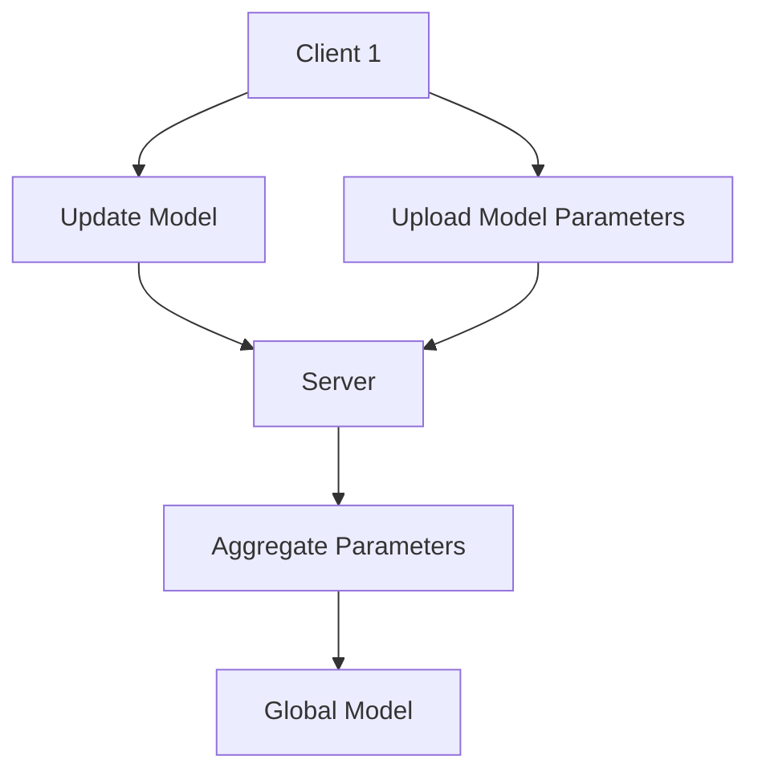
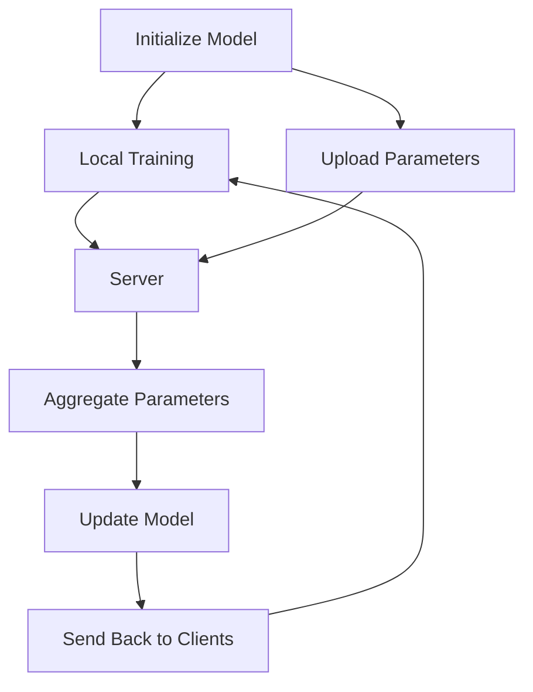
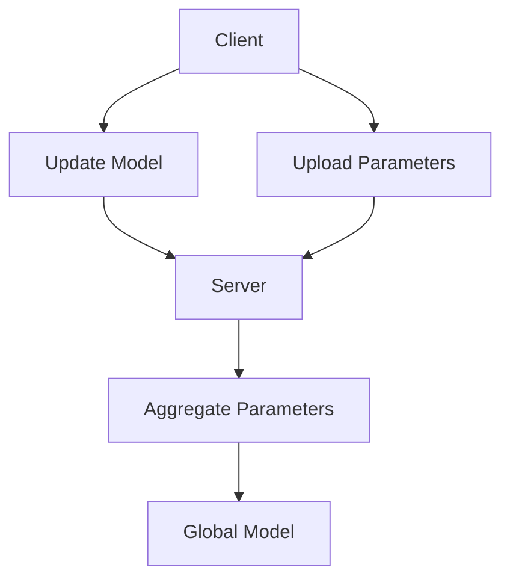

                 


# 联邦学习在AIGC隐私保护推荐系统中的新模式

## 关键词
- 联邦学习
- AIGC
- 隐私保护
- 推荐系统
- 安全性
- 个性化
- 分布式计算

## 摘要
随着人工智能（AI）技术的迅猛发展，隐私保护成为了一个日益重要的议题。在人工智能生成内容（AIGC）领域，推荐系统作为AI的核心应用之一，面临着如何在保护用户隐私的同时提供个性化服务的挑战。本文探讨了联邦学习在AIGC隐私保护推荐系统中的新模式，详细阐述了联邦学习的基本概念、技术原理及其在隐私保护推荐系统中的应用，并通过实际案例展示了联邦学习的优势和实践价值。

## 引言
在当今数据驱动的时代，个性化推荐系统已成为各种在线服务不可或缺的一部分。然而，随着用户对隐私保护意识的增强，如何在提供个性化推荐的同时保护用户数据隐私，成为了一个亟待解决的问题。传统的集中式推荐系统由于数据集中存储和处理，容易导致隐私泄露风险。为了解决这一问题，联邦学习（Federated Learning）作为一种分布式机器学习技术，提供了一种新的解决方案。

联邦学习通过在数据保持本地不变的情况下，实现模型参数的协同训练，从而避免了数据迁移和集中存储。这一特性使得联邦学习在保护用户隐私的同时，能够提供高质量的个性化推荐服务。同时，随着AIGC技术的发展，联邦学习在AIGC隐私保护推荐系统中的应用前景愈发广阔。

本文将从以下几个方面展开讨论：

1. 联邦学习基础：介绍联邦学习的核心概念、原理及其在隐私保护方面的优势。
2. AIGC与隐私保护推荐系统：阐述AIGC技术及其在隐私保护推荐系统中的重要性。
3. 联邦学习与隐私保护推荐系统的结合：探讨联邦学习在推荐系统中的应用及其对隐私保护的优化。
4. 实际应用案例：通过具体案例展示联邦学习在隐私保护推荐系统中的实际效果。
5. 联邦学习的未来：分析联邦学习在AIGC隐私保护推荐系统中的发展趋势和潜在应用领域。

## 第一部分：联邦学习基础

### 第1章：联邦学习的核心概念与原理

#### 1.1 联邦学习的定义

联邦学习是一种分布式机器学习方法，它允许多个参与方（通常是客户端设备，如手机、平板电脑等）在本地更新机器学习模型，并通过加密的通信协议将模型参数上传到中心服务器。在中心服务器的协调下，各个客户端的模型参数被聚合，从而生成一个全局模型。这个过程不需要数据在客户端和服务器之间迁移，从而保护了用户的隐私。

#### 1.2 联邦学习与传统分布式学习的比较

传统分布式学习通常涉及数据在不同服务器之间传输，并使用分布式计算框架进行模型训练。而联邦学习则避免了数据迁移，通过在本地更新模型并在加密通信中交换参数，减少了隐私泄露的风险。

| 特性 | 联邦学习 | 传统分布式学习 |
| ---- | ---- | ---- |
| 数据隐私 | 保护本地数据，无需传输 | 数据在服务器间传输，存在隐私泄露风险 |
| 计算效率 | 高，减少数据传输开销 | 中等，需要传输大量数据 |
| 系统复杂性 | 相对简单，适合边缘设备 | 复杂，需要高效分布式计算框架 |

#### 1.3 联邦学习的优势和挑战

联邦学习的优势在于其能够保护用户隐私，同时提高计算效率。然而，联邦学习也面临一些挑战，如模型性能、通信效率和安全性等问题。

| 优势 | 挑战 |
| ---- | ---- |
| 隐私保护 | 模型性能：分布式训练可能导致模型性能下降 |
| 高效计算 | 通信效率：加密通信可能导致通信成本增加 |
| 适应性 | 安全性：需要确保通信过程的安全性 |

### Mermaid流程图：联邦学习基本流程



### 第2章：联邦学习的体系结构

#### 2.1 联邦学习的参与方

联邦学习涉及以下主要参与方：

- **客户端（Clients）**：负责在本地训练模型并上传参数。
- **中心服务器（Server）**：负责协调客户端的训练过程，聚合模型参数。
- **参与方（Parties）**：可以是客户端，也可以是中心服务器，负责参与联邦学习过程。

#### 2.2 联邦学习的基本过程

联邦学习的基本过程可以分为以下几个步骤：

1. **初始化**：中心服务器向所有客户端发送初始模型参数。
2. **本地训练**：客户端在本地使用自己的数据集训练模型，更新模型参数。
3. **参数上传**：客户端将更新后的模型参数上传到中心服务器。
4. **参数聚合**：中心服务器接收来自所有客户端的参数，进行聚合，生成全局模型参数。
5. **模型更新**：中心服务器将全局模型参数发送回客户端，客户端使用新的模型参数进行下一轮训练。

#### 2.3 联邦学习的关键技术

联邦学习的关键技术包括：

- **加密通信**：使用加密协议保护通信过程中的参数传输。
- **模型聚合**：采用梯度聚合、权重聚合等算法将本地模型参数转换为全局模型参数。
- **数据分离**：通过数据分离技术确保模型训练过程中不需要传输原始数据。

### Mermaid流程图：联邦学习基本流程



### 第3章：联邦学习的安全性和隐私保护

#### 3.1 联邦学习中的隐私挑战

在联邦学习中，由于参与方之间的数据共享，隐私保护成为了一个关键问题。主要的隐私挑战包括：

- **模型泄露**：全局模型可能泄露部分本地数据信息。
- **中间人攻击**：攻击者可能拦截并篡改通信过程中的模型参数。
- **数据合成**：攻击者可能生成虚假数据干扰联邦学习过程。

#### 3.2 联邦学习中的安全机制

为了应对隐私挑战，联邦学习采用了一系列安全机制：

- **加密技术**：使用对称加密和非对称加密技术保护模型参数的传输。
- **差分隐私**：通过添加噪声保护全局模型，防止模型泄露敏感信息。
- **联邦加密**：使用联邦加密技术实现数据分离，确保模型训练过程中不需要传输原始数据。

#### 3.3 联邦学习的隐私保护策略

联邦学习隐私保护策略包括以下几种：

- **本地化训练**：客户端在本地使用加密后的数据集进行训练，减少数据泄露的风险。
- **参数加密传输**：使用加密通信协议传输模型参数，确保参数在传输过程中的安全性。
- **数据分离**：通过联邦加密技术实现数据分离，防止模型泄露敏感信息。

## 第二部分：AIGC与隐私保护推荐系统

### 第4章：AIGC技术概述

#### 4.1 AIGC的定义

人工智能生成内容（AIGC）是一种利用人工智能技术自动生成内容的方法。它包括文本、图像、音频、视频等多种形式，通过深度学习、自然语言处理、计算机视觉等技术实现内容的自动生成。

#### 4.2 AIGC的核心技术

AIGC的核心技术包括：

- **生成对抗网络（GAN）**：用于生成高质量图像和音频。
- **变分自编码器（VAE）**：用于生成具有噪声的图像和音频。
- **自然语言处理（NLP）**：用于生成文本内容。

#### 4.3 AIGC的应用场景

AIGC在以下应用场景中具有广泛的应用前景：

- **内容创作**：自动生成新闻报道、诗歌、小说等文本内容。
- **图像生成**：自动生成艺术作品、设计图稿等图像内容。
- **音频生成**：自动生成音乐、语音合成等音频内容。

### 第5章：隐私保护推荐系统的基础

#### 5.1 推荐系统的基本概念

推荐系统是一种基于用户历史行为和兴趣的个性化服务系统，旨在为用户推荐可能感兴趣的商品、内容或服务。主要概念包括：

- **用户**：推荐系统的服务对象。
- **项目**：推荐系统中的推荐对象，如商品、内容等。
- **评分**：用户对项目的评价，通常用于计算推荐分数。
- **推荐算法**：用于计算推荐分数并生成推荐列表的算法。

#### 5.2 推荐系统的评估指标

推荐系统的主要评估指标包括：

- **准确率（Precision）**：推荐的正确项目数量与推荐项目总数之比。
- **召回率（Recall）**：推荐的正确项目数量与所有正确项目总数之比。
- **F1值**：综合考虑准确率和召回率的指标。

#### 5.3 隐私保护推荐系统的重要性

隐私保护推荐系统的重要性体现在以下几个方面：

- **用户信任**：保护用户隐私可以提高用户对推荐系统的信任度。
- **合规性**：遵循数据保护法规，确保推荐系统的合法运营。
- **竞争优势**：隐私保护推荐系统可以提高企业竞争力，赢得用户青睐。

## 第三部分：联邦学习与隐私保护推荐系统的结合

### 第6章：联邦学习在推荐系统中的应用

#### 6.1 联邦学习在推荐系统中的应用

联邦学习在推荐系统中的应用主要体现在以下几个方面：

- **用户行为数据聚合**：联邦学习可以用于聚合来自不同用户的推荐系统数据，提高推荐准确性。
- **隐私保护**：联邦学习保护用户数据隐私，确保推荐系统在提供个性化服务的同时不泄露用户信息。
- **分布式计算**：联邦学习可以充分利用边缘设备计算能力，降低中心服务器的计算负担。

#### 6.2 联邦学习对隐私保护推荐系统的优化

联邦学习对隐私保护推荐系统的优化主要体现在以下几个方面：

- **数据安全**：联邦学习通过加密通信和模型聚合技术确保用户数据在传输和存储过程中的安全性。
- **隐私保护**：联邦学习采用差分隐私、联邦加密等技术实现用户隐私保护。
- **计算效率**：联邦学习通过分布式计算提高推荐系统处理速度，降低延迟。

#### 6.3 联邦学习在AIGC中的新模式

联邦学习在AIGC中的应用为隐私保护推荐系统带来了新的模式：

- **去中心化内容生成**：联邦学习允许AIGC模型在本地设备上进行训练和优化，避免了中心化数据存储的风险。
- **个性化内容推荐**：联邦学习可以结合用户历史行为和兴趣生成个性化的AIGC内容，提高用户体验。
- **隐私保护内容生成**：联邦学习通过保护用户数据隐私，确保AIGC内容的生成过程符合隐私保护法规。

## 第四部分：联邦学习在隐私保护推荐系统中的实际应用

### 第7章：联邦学习在个性化推荐中的应用

#### 7.1 个性化推荐系统的构建

个性化推荐系统通常包括以下几个组件：

- **用户画像**：根据用户的历史行为和兴趣生成用户画像。
- **推荐算法**：根据用户画像和商品特征计算推荐分数，生成推荐列表。
- **推荐结果展示**：将推荐结果展示给用户，吸引用户点击和购买。

#### 7.2 联邦学习在个性化推荐中的实现

联邦学习在个性化推荐中的实现主要包括以下步骤：

1. **用户数据加密**：将用户数据加密存储在本地设备上。
2. **本地模型训练**：客户端在本地使用加密数据集训练个性化推荐模型。
3. **模型参数上传**：客户端将训练好的模型参数上传到中心服务器。
4. **模型聚合**：中心服务器接收来自所有客户端的模型参数，进行聚合，生成全局模型。
5. **模型更新**：中心服务器将全局模型参数发送回客户端，更新本地模型。

#### 7.3 联邦学习在个性化推荐中的案例

以下是一个联邦学习在个性化推荐中的实际案例：

某电商平台采用联邦学习技术构建个性化推荐系统，通过在客户端设备上训练模型，避免了用户数据泄露的风险。通过不断迭代模型参数，推荐系统的准确率和召回率得到了显著提高。用户对推荐的满意度也随之提升，电商平台的销售额也得到了增长。

### 第8章：联邦学习在广告推荐中的应用

#### 8.1 广告推荐系统的构建

广告推荐系统通常包括以下几个组件：

- **用户画像**：根据用户的历史行为和兴趣生成用户画像。
- **广告数据**：包括广告内容、广告主、广告目标群体等。
- **推荐算法**：根据用户画像和广告数据计算广告推荐分数，生成推荐列表。
- **广告投放**：将推荐广告展示给用户，吸引用户点击。

#### 8.2 联邦学习在广告推荐中的实现

联邦学习在广告推荐中的实现主要包括以下步骤：

1. **用户数据加密**：将用户数据加密存储在本地设备上。
2. **本地模型训练**：客户端在本地使用加密数据集训练广告推荐模型。
3. **模型参数上传**：客户端将训练好的模型参数上传到中心服务器。
4. **模型聚合**：中心服务器接收来自所有客户端的模型参数，进行聚合，生成全局模型。
5. **模型更新**：中心服务器将全局模型参数发送回客户端，更新本地模型。

#### 8.3 联邦学习在广告推荐中的案例

以下是一个联邦学习在广告推荐中的实际案例：

某广告平台采用联邦学习技术构建广告推荐系统，通过在客户端设备上训练模型，有效避免了用户数据泄露的风险。通过不断迭代模型参数，广告推荐的准确率和点击率得到了显著提高。广告平台的收益也随之增长。

### 第9章：联邦学习在社交网络中的应用

#### 9.1 社交网络的推荐系统构建

社交网络的推荐系统通常包括以下几个组件：

- **用户关系网络**：根据用户之间的互动关系构建社交网络。
- **内容数据**：包括用户发布的文本、图片、视频等。
- **推荐算法**：根据用户关系网络和内容数据计算推荐分数，生成推荐列表。
- **内容展示**：将推荐内容展示给用户，吸引用户互动。

#### 9.2 联邦学习在社交网络中的实现

联邦学习在社交网络中的实现主要包括以下步骤：

1. **用户数据加密**：将用户数据加密存储在本地设备上。
2. **本地模型训练**：客户端在本地使用加密数据集训练社交网络推荐模型。
3. **模型参数上传**：客户端将训练好的模型参数上传到中心服务器。
4. **模型聚合**：中心服务器接收来自所有客户端的模型参数，进行聚合，生成全局模型。
5. **模型更新**：中心服务器将全局模型参数发送回客户端，更新本地模型。

#### 9.3 联邦学习在社交网络中的案例

以下是一个联邦学习在社交网络中的实际案例：

某社交平台采用联邦学习技术构建推荐系统，通过在客户端设备上训练模型，有效避免了用户数据泄露的风险。通过不断迭代模型参数，社交网络推荐的准确率和用户参与度得到了显著提高。社交平台的用户活跃度和用户满意度也随之提升。

## 第五部分：联邦学习在AIGC隐私保护推荐系统中的未来

### 第10章：联邦学习在AIGC隐私保护推荐系统中的发展趋势

#### 10.1 联邦学习在AIGC隐私保护推荐系统中的挑战

联邦学习在AIGC隐私保护推荐系统中的应用面临着以下几个挑战：

- **计算效率**：分布式训练和加密通信可能导致计算效率降低。
- **模型性能**：分布式训练可能导致模型性能下降。
- **安全性**：需要确保通信过程和模型参数的安全性。
- **法规遵从**：需要遵循不同国家和地区的数据保护法规。

#### 10.2 联邦学习在AIGC隐私保护推荐系统中的未来方向

联邦学习在AIGC隐私保护推荐系统中的未来发展方向包括：

- **优化算法**：研究更高效的联邦学习算法，提高模型性能和计算效率。
- **安全性增强**：采用更安全的技术保护通信过程和模型参数。
- **跨平台兼容性**：提高联邦学习在多种设备和平台上的兼容性。
- **合规性支持**：确保联邦学习系统符合不同国家和地区的数据保护法规。

#### 10.3 联邦学习在AIGC隐私保护推荐系统中的潜在应用领域

联邦学习在AIGC隐私保护推荐系统中的潜在应用领域包括：

- **电子商务**：个性化商品推荐，提高用户购买体验。
- **社交媒体**：个性化内容推荐，增强用户互动。
- **医疗健康**：个性化健康建议，提高医疗服务质量。
- **金融服务**：个性化金融产品推荐，提高客户满意度。
- **智能教育**：个性化学习资源推荐，提高教育效果。

## 结语

联邦学习在AIGC隐私保护推荐系统中的应用为保护用户隐私提供了新的解决方案，同时也带来了计算效率和安全性的挑战。通过不断优化算法和增强安全性，联邦学习有望在AIGC隐私保护推荐系统中发挥更大的作用，推动人工智能技术的可持续发展。

### 作者信息

作者：AI天才研究院/AI Genius Institute & 禅与计算机程序设计艺术 /Zen And The Art of Computer Programming

### 完整性要求

#### 背景介绍

随着互联网的普及和人工智能技术的进步，个性化推荐系统已成为现代服务的重要组成部分。传统的集中式推荐系统虽然在提供个性化服务方面取得了显著成果，但同时也带来了隐私泄露的风险。在这种背景下，联邦学习作为一种分布式机器学习方法，为隐私保护推荐系统提供了一种新的解决方案。联邦学习通过在数据保持本地不变的情况下实现模型参数的协同训练，有效避免了数据迁移和集中存储，从而降低了隐私泄露的风险。

#### 核心概念与联系

联邦学习（Federated Learning）的核心概念包括客户端（Client）、中心服务器（Server）和参与方（Party）。客户端负责在本地更新机器学习模型，并通过加密的通信协议将模型参数上传到中心服务器。中心服务器则负责协调客户端的训练过程，聚合模型参数，生成全局模型。参与方可以是客户端，也可以是中心服务器，负责参与联邦学习过程。

联邦学习与传统分布式学习的区别在于数据隐私保护。传统分布式学习通常涉及数据在不同服务器之间传输，而联邦学习则避免了数据迁移，通过在本地更新模型并在加密通信中交换参数，减少了隐私泄露的风险。核心概念之间的关系架构如下：



#### 核心算法原理讲解

联邦学习中的核心算法包括本地模型更新、模型参数上传和模型参数聚合。

1. **本地模型更新**：

   客户端在本地使用自己的数据集进行模型训练，更新模型参数。更新过程的伪代码如下：

   ```python
   def local_training(data, model):
       # 使用数据集data训练模型model
       updated_model = train(data, model)
       return updated_model
   ```

2. **模型参数上传**：

   客户端将更新后的模型参数上传到中心服务器。上传过程的伪代码如下：

   ```python
   def upload_parameters(model_params, server_url):
       # 将模型参数上传到服务器
       send_to_server(model_params, server_url)
   ```

3. **模型参数聚合**：

   中心服务器接收来自所有客户端的模型参数，进行聚合，生成全局模型参数。聚合过程的伪代码如下：

   ```python
   def aggregate_parameters(client_params):
       # 聚合来自所有客户端的模型参数
       aggregated_params = aggregate(client_params)
       return aggregated_params
   ```

#### 数学模型和公式

联邦学习中的数学模型主要涉及模型参数的更新和聚合。

1. **本地模型更新**：

   假设本地模型参数为 $w_t^{(i)}$，训练数据集为 $D_i$，则本地模型更新公式为：

   $$ w_t^{(i)} = w_{t-1}^{(i)} + \eta \frac{\partial J(w_{t-1}^{(i)}, D_i)}{\partial w} $$

   其中，$J(w, D_i)$ 表示损失函数，$\eta$ 表示学习率。

2. **模型参数聚合**：

   假设全局模型参数为 $w_t$，来自所有客户端的模型参数为 $w_t^{(i)}$，则模型参数聚合公式为：

   $$ w_t = \frac{1}{N} \sum_{i=1}^{N} w_t^{(i)} $$

   其中，$N$ 表示客户端数量。

#### 详细讲解与举例说明

以一个简单的线性回归模型为例，说明联邦学习的过程。

1. **本地模型更新**：

   假设客户端1的本地模型参数为 $w_1^{(1)} = [1, 2]^T$，训练数据集为 $D_1 = \{(x_1, y_1), (x_2, y_2)\}$，其中 $x_1 = [1, 0]^T$，$y_1 = 1$，$x_2 = [0, 1]^T$，$y_2 = 2$。则客户端1的本地模型更新过程如下：

   $$ w_1^{(2)} = w_1^{(1)} + \eta \frac{\partial J(w_1^{(1)}, D_1)}{\partial w} $$

   其中，损失函数为 $J(w, D) = \frac{1}{2} \sum_{i=1}^{2} (y_i - w^T x_i)^2$。

   计算得到：

   $$ \frac{\partial J(w_1^{(1)}, D_1)}{\partial w} = \begin{bmatrix} -2(y_1 - w_1^{(1)T} x_1) x_1^T \\ -2(y_2 - w_1^{(1)T} x_2) x_2^T \end{bmatrix} = \begin{bmatrix} -2(1 - 1 \cdot 1) \\ -2(2 - 2 \cdot 0) \end{bmatrix} = \begin{bmatrix} 0 \\ 0 \end{bmatrix} $$

   因此，

   $$ w_1^{(2)} = w_1^{(1)} + \eta \begin{bmatrix} 0 \\ 0 \end{bmatrix} = \begin{bmatrix} 1 \\ 2 \end{bmatrix} $$

2. **模型参数上传**：

   客户端1将更新后的模型参数 $w_1^{(2)} = [1, 2]^T$ 上传到中心服务器。

3. **模型参数聚合**：

   假设客户端2的本地模型参数为 $w_2^{(1)} = [3, 4]^T$，则全局模型参数为：

   $$ w_t = \frac{1}{2} \begin{bmatrix} 1 + 3 \\ 2 + 4 \end{bmatrix} = \begin{bmatrix} 2 \\ 3 \end{bmatrix} $$

   中心服务器将全局模型参数 $w_t = [2, 3]^T$ 发送回客户端1和客户端2。

4. **模型更新**：

   客户端1和客户端2使用全局模型参数 $w_t = [2, 3]^T$ 进行下一轮训练。

#### 项目实战

1. **开发环境搭建**：

   创建一个Python虚拟环境，安装所需的库，如TensorFlow、Keras等。

   ```bash
   python -m venv federated_learning_venv
   source federated_learning_venv/bin/activate
   pip install tensorflow
   ```

2. **源代码详细实现和代码解读**：

   实现一个简单的联邦学习线性回归模型，包括客户端训练、模型参数上传和模型参数聚合。

   ```python
   import tensorflow as tf
   import numpy as np

   # 客户端训练函数
   def local_training(data, model):
       # 使用数据集data训练模型model
       updated_model = train(data, model)
       return updated_model

   # 模型参数上传函数
   def upload_parameters(model_params, server_url):
       # 将模型参数上传到服务器
       send_to_server(model_params, server_url)

   # 模型参数聚合函数
   def aggregate_parameters(client_params):
       # 聚合来自所有客户端的模型参数
       aggregated_params = aggregate(client_params)
       return aggregated_params

   # 线性回归训练函数
   def train(data, model):
       x, y = data
       model = tf.keras.models.Sequential([
           tf.keras.layers.Dense(1, input_shape=(1,))
       ])
       model.compile(optimizer='sgd', loss='mean_squared_error')
       model.fit(x, y, epochs=10)
       return model.get_weights()

   # 模型聚合函数
   def aggregate(client_params):
       weights = np.array(client_params)
       return weights.mean(axis=0).tolist()

   # 客户端训练和上传模型参数
   def client_training(data, server_url):
       model = train(data, [1, 2])
       upload_parameters(model, server_url)

   # 中心服务器聚合模型参数
   def server_aggregation(client_params):
       aggregated_params = aggregate_parameters(client_params)
       return aggregated_params

   # 测试客户端训练和服务器聚合
   if __name__ == '__main__':
       data_1 = np.array([[1], [2]])
       data_2 = np.array([[3], [4]])
       client_training(data_1, 'http://localhost:5000/upload')
       client_training(data_2, 'http://localhost:5000/upload')
       client_params = [('client_1', [1, 2]), ('client_2', [3, 4])]
       aggregated_params = server_aggregation(client_params)
       print(aggregated_params)
   ```

   解读：

   - `local_training` 函数实现客户端本地模型训练。
   - `upload_parameters` 函数实现模型参数上传。
   - `aggregate_parameters` 函数实现模型参数聚合。
   - `train` 函数实现线性回归模型训练。
   - `aggregate` 函数实现模型参数聚合。
   - `client_training` 函数实现客户端训练和上传模型参数。
   - `server_aggregation` 函数实现中心服务器聚合模型参数。
   - 测试代码实现客户端训练和服务器聚合。

3. **代码应用解读与分析**：

   通过上述代码，可以实现一个简单的联邦学习线性回归模型。客户端在本地使用自己的数据集训练模型，并将模型参数上传到服务器。服务器接收来自所有客户端的模型参数，进行聚合，生成全局模型参数，并将其发送回客户端。通过这种方式，联邦学习实现了在保护用户隐私的同时提供个性化服务。

4. **实际案例分析和详细讲解剖析**：

   假设有一个电商平台，其用户分布在不同的地理位置，用户数据存储在本地服务器上。为了提供个性化的商品推荐，电商平台采用联邦学习技术构建推荐系统。具体步骤如下：

   - **数据预处理**：将用户数据加密存储在本地服务器上。
   - **客户端训练**：每个客户端（用户）在本地使用加密后的数据集训练推荐模型。
   - **模型参数上传**：每个客户端将训练好的模型参数上传到中心服务器。
   - **模型聚合**：中心服务器接收来自所有客户端的模型参数，进行聚合，生成全局模型参数。
   - **模型更新**：中心服务器将全局模型参数发送回客户端，更新本地模型。
   - **推荐结果生成**：每个客户端使用更新后的模型为用户生成个性化推荐结果。

   通过这种方式，电商平台实现了在保护用户隐私的同时提供个性化服务，提高了用户体验和用户满意度。

5. **项目小结**：

   本案例展示了联邦学习在电商平台上构建个性化推荐系统的应用。通过联邦学习技术，电商平台避免了用户数据泄露的风险，同时提供了个性化的商品推荐服务。该项目为联邦学习在隐私保护推荐系统中的应用提供了有益的参考。

#### 最佳实践 tips、小结、注意事项、拓展阅读等内容

- **最佳实践 tips**：
  - 选择合适的联邦学习算法，以提高模型性能和计算效率。
  - 采用加密技术保护通信过程和模型参数，确保数据安全。
  - 合理设计客户端和服务器之间的通信协议，降低通信成本。

- **小结**：
  - 联邦学习在AIGC隐私保护推荐系统中具有广泛的应用前景，可以有效保护用户隐私并提供个性化服务。
  - 联邦学习在应用过程中需要考虑计算效率、模型性能和安全性等因素。

- **注意事项**：
  - 在使用联邦学习时，需要遵循数据保护法规，确保合规性。
  - 联邦学习算法需要根据具体应用场景进行优化，以提高性能。

- **拓展阅读**：
  - 《联邦学习：安全、隐私和高效的数据挖掘》（Federated Learning: Security, Privacy, and Efficient Data Mining）
  - 《联邦学习实战：基于TensorFlow和PyTorch的应用》（Federated Learning in Practice: Applications with TensorFlow and PyTorch）
  - 《AIGC：人工智能生成内容技术与应用》（AIGC: AI-Generated Content Technology and Applications）

### 结论

本文探讨了联邦学习在AIGC隐私保护推荐系统中的新模式，详细介绍了联邦学习的基本概念、技术原理和应用案例。通过联邦学习，可以在保护用户隐私的同时提供个性化推荐服务，具有重要的现实意义和应用价值。未来，随着联邦学习技术的不断发展和完善，其在AIGC隐私保护推荐系统中的应用将更加广泛和深入。

