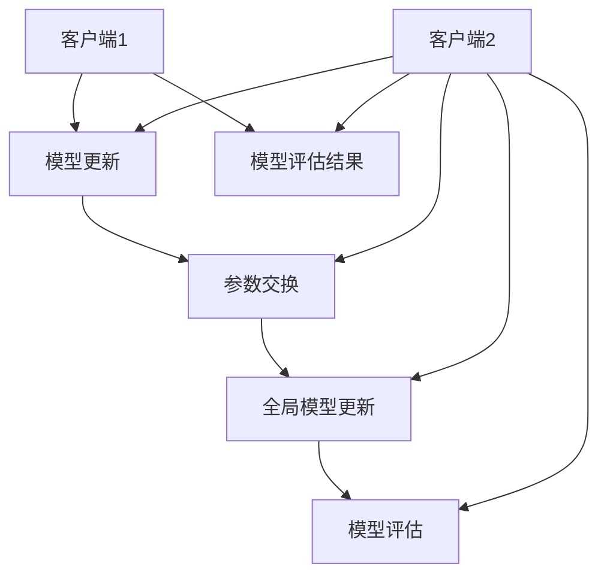

                 


为了撰写一篇内容丰富、逻辑清晰的《联邦学习在跨组织AIGC协作中的作用》文章，我们可以按照以下步骤逐步思考和构建：

### 第一步：确定文章的主题和目标

首先，我们需要明确文章的主题和目标。本文的主题是探讨联邦学习在跨组织AIGC协作中的作用，目标是为读者提供一个全面的了解，包括联邦学习的基本概念、AIGC协作的挑战、联邦学习在其中的应用以及未来趋势。

### 第二步：撰写文章的摘要

摘要部分需要简要介绍文章的核心内容和主题思想。例如：

> **摘要**：本文首先介绍了联邦学习和AIGC协作的基本概念，分析了跨组织AIGC协作面临的挑战。接着，详细阐述了联邦学习在跨组织AIGC协作中的作用，包括提高数据利用效率、保护数据隐私和促进跨组织合作。最后，探讨了联邦学习在跨组织AIGC协作中的未来趋势和方向。

### 第三步：构建文章的结构

根据摘要，我们可以构建文章的结构。文章可以分为五个部分：

1. 联邦学习概述
2. AIGC协作概述
3. 联邦学习在跨组织AIGC协作中的应用
4. 跨组织AIGC协作的实践案例
5. 未来趋势与展望

### 第四步：撰写每个部分的内容

在每个部分中，我们需要详细阐述以下内容：

1. **联邦学习概述**
   - 背景介绍
   - 核心概念与联系（使用Mermaid流程图）
   - 核心算法原理讲解（使用伪代码）

2. **AIGC协作概述**
   - 概念与特点
   - 跨组织协作的挑战与需求
   - 解决方案

3. **联邦学习在跨组织AIGC协作中的应用**
   - 价值
   - 实现
   - 实践案例

4. **未来趋势与展望**
   - 联邦学习技术的发展趋势
   - 跨组织AIGC协作的未来方向
   - 伦理问题与商业模式探索

### 第五步：撰写文章的结尾

在结尾部分，我们需要对文章进行总结，提出跨组织AIGC协作面临的挑战与机遇，并对未来发展进行展望。

### 第六步：撰写作者信息

在文章末尾，我们需要写上作者信息：“作者：AI天才研究院/AI Genius Institute & 禅与计算机程序设计艺术 /Zen And The Art of Computer Programming”。

### 第七步：检查文章的完整性和准确性

最后，我们需要对文章进行仔细检查，确保内容完整、逻辑清晰，没有遗漏或错误。同时，确保文章的字数在8000～12000字之间。

按照这些步骤，我们可以撰写出一篇高质量的技术博客文章，为读者提供一个全面、深入的联邦学习在跨组织AIGC协作中的了解。现在，让我们开始撰写吧！当然，我们已经有了文章的目录大纲和核心概念，接下来我们将进一步细化每个部分的内容，确保文章的逻辑性和完整性。以下是每个部分的详细内容，我们将一步步撰写并完善。

## 文章标题

### 联邦学习在跨组织AIGC协作中的作用

## 文章关键词

- 联邦学习
- AIGC协作
- 跨组织合作
- 数据隐私
- 模型更新
- 隐私保护
- 算法创新

## 摘要

本文首先介绍了联邦学习和AIGC协作的基本概念，分析了跨组织AIGC协作面临的挑战。接着，详细阐述了联邦学习在跨组织AIGC协作中的作用，包括提高数据利用效率、保护数据隐私和促进跨组织合作。文章通过实践案例展示了联邦学习在跨组织AIGC协作中的应用，并探讨了未来趋势和方向。

## 目录

1. **联邦学习概述**
   1.1 背景介绍
   1.2 核心概念与联系
   1.3 核心算法原理讲解

2. **AIGC协作概述**
   2.1 概念与特点
   2.2 跨组织协作的挑战与需求
   2.3 解决方案

3. **联邦学习在跨组织AIGC协作中的应用**
   3.1 价值
   3.2 实现
   3.3 实践案例

4. **跨组织AIGC协作的实践案例**
   4.1 案例一：智能医疗
   4.2 案例二：智慧城市
   4.3 案例三：智能制造

5. **未来趋势与展望**
   5.1 联邦学习技术的发展趋势
   5.2 跨组织AIGC协作的未来方向
   5.3 伦理问题与商业模式探索

6. **总结与展望**

## 第一部分：联邦学习概述

### 1.1 背景介绍

联邦学习（Federated Learning）是一种分布式机器学习方法，旨在解决数据隐私和安全问题。在联邦学习框架下，各个参与方（通常是不同组织或设备）将自己的数据保留在自己的设备上，通过模型参数的交换来共同训练一个全局模型。这种方法不仅保护了数据隐私，还提高了数据利用效率。

### 1.2 核心概念与联系

#### 联邦学习的核心概念包括：

- **客户端（Client）**：每个参与联邦学习的设备或组织，它有自己的本地数据和模型。
- **服务器（Server）**：负责协调联邦学习过程，收集客户端的更新并生成全局模型。
- **全局模型（Global Model）**：由服务器管理的全局模型，通过对客户端模型参数的聚合而更新。

#### 联邦学习与AIGC协作的联系：

- **AIGC（AI-Generated Content）**：通过人工智能自动生成内容，如文本、图像、音频等。
- **跨组织协作**：不同组织或团队之间的合作，共同完成一个项目或任务。

联邦学习在跨组织AIGC协作中的作用在于，它提供了一个安全、高效的方式，让不同组织可以共享模型参数，共同训练一个全局模型，从而实现AIGC的协同创作。

### 1.3 核心算法原理讲解

#### 联邦学习的核心算法原理可以概括为以下几个步骤：

1. **客户端模型更新**：每个客户端使用自己的本地数据和模型进行训练，更新本地模型参数。

2. **模型参数交换**：客户端将更新后的模型参数发送给服务器。

3. **全局模型聚合**：服务器接收来自所有客户端的模型参数，通过聚合算法（如加权平均）更新全局模型。

4. **模型评估与优化**：服务器使用更新后的全局模型进行评估，并根据评估结果对全局模型进行优化。

以下是联邦学习算法的伪代码：

```plaintext
function federated_learning(client_data, server_model, learning_rate):
    for each client in client_data:
        local_model = copy(server_model)
        local_model = train_model(local_model, client_data, learning_rate)
        updated_params = aggregate_params(local_model)
    server_model = update_model(server_model, updated_params)
```

通过这些步骤，联邦学习实现了不同组织之间的模型参数共享和更新，从而提高了AIGC协作的效率。

## 第二部分：AIGC协作概述

### 2.1 概念与特点

AIGC（AI-Generated Content）是一种利用人工智能技术自动生成内容的方法。与传统的手工创作相比，AIGC具有以下几个特点：

- **自动化**：通过算法和模型，自动生成内容，减少了人力成本。
- **高效性**：能够快速生成大量内容，提高了生产效率。
- **多样性**：能够根据不同的需求和场景，生成多样化的内容。

AIGC的应用领域广泛，包括但不限于文本生成、图像生成、音频生成等。

### 2.2 跨组织协作的挑战与需求

跨组织协作在AIGC领域中面临以下挑战：

- **数据隐私**：不同组织之间的数据可能包含敏感信息，如何保护数据隐私成为一个重要问题。
- **数据共享**：不同组织的数据格式和结构可能不同，如何实现高效的数据共享和集成。
- **协作效率**：不同组织之间的协作可能存在时间差和沟通障碍，如何提高协作效率。

为了应对这些挑战，跨组织协作需要以下需求：

- **安全的数据传输**：确保数据在传输过程中不被泄露。
- **标准化的数据格式**：统一不同组织的数据格式，实现数据共享。
- **高效的沟通机制**：建立高效的沟通机制，确保协作顺利进行。

### 2.3 解决方案

为了满足上述需求，联邦学习提供了一种有效的解决方案：

- **数据隐私保护**：通过联邦学习，不同组织可以在保护数据隐私的前提下共享模型参数。
- **标准化的数据格式**：联邦学习通过模型参数的共享，实现了数据格式的统一。
- **高效的协作机制**：联邦学习通过集中的模型更新和评估，提高了协作效率。

联邦学习在跨组织AIGC协作中的应用，不仅解决了数据隐私和安全问题，还提高了数据利用效率和协作效率，为AIGC协作提供了强大的支持。

## 第三部分：联邦学习在跨组织AIGC协作中的应用

### 3.1 价值

联邦学习在跨组织AIGC协作中的应用具有以下价值：

- **提高数据利用效率**：通过联邦学习，不同组织可以共享模型参数，实现数据的高效利用，避免了数据重复存储和传输的成本。
- **保护数据隐私**：联邦学习通过模型参数的共享，而不是直接传输数据，有效保护了数据的隐私。
- **促进跨组织合作**：联邦学习提供了一个安全、高效的协作平台，促进了不同组织之间的合作。

### 3.2 实现

联邦学习在跨组织AIGC协作中的实现包括以下几个关键步骤：

1. **客户端模型更新**：每个客户端使用自己的本地数据和模型进行训练，更新本地模型参数。
2. **模型参数交换**：客户端将更新后的模型参数发送给服务器。
3. **全局模型聚合**：服务器接收来自所有客户端的模型参数，通过聚合算法更新全局模型。
4. **模型评估与优化**：服务器使用更新后的全局模型进行评估，并根据评估结果对全局模型进行优化。

以下是联邦学习在跨组织AIGC协作中的实现流程：

1. **数据预处理**：对来自不同组织的原始数据进行预处理，包括数据清洗、归一化和格式转换，确保数据的一致性。
2. **模型初始化**：初始化全局模型，并将其分发到所有客户端。
3. **本地训练**：每个客户端使用本地数据和全局模型进行训练，更新本地模型参数。
4. **参数交换**：客户端将更新后的模型参数发送给服务器。
5. **全局模型更新**：服务器接收来自所有客户端的模型参数，通过聚合算法更新全局模型。
6. **模型评估**：服务器使用更新后的全局模型对AIGC内容进行评估，确保内容的质量。
7. **模型优化**：根据评估结果，对全局模型进行优化，以提高AIGC的质量和效率。

### 3.3 实践案例

联邦学习在跨组织AIGC协作中的实践案例包括以下几个方面：

1. **智能医疗**：不同医院可以通过联邦学习共享医疗数据，共同训练一个全局模型，用于疾病预测和诊断，提高了医疗服务的效率和质量。
2. **智慧城市**：不同城市的政府部门可以通过联邦学习共享交通、环境等数据，共同训练一个全局模型，用于城市管理和优化，提高了城市管理的效率。
3. **智能制造**：不同工厂可以通过联邦学习共享生产数据，共同训练一个全局模型，用于生产优化和质量控制，提高了生产效率和质量。

通过这些实践案例，我们可以看到联邦学习在跨组织AIGC协作中的应用前景，为不同组织提供了安全、高效的数据共享和协作平台。

## 第四部分：跨组织AIGC协作的实践案例

### 4.1 案例一：智能医疗

智能医疗是联邦学习在跨组织AIGC协作中应用的一个典型领域。不同医院可以通过联邦学习共享医疗数据，共同训练一个全局模型，用于疾病预测和诊断。

**实践步骤：**

1. **数据预处理**：对来自不同医院的医疗数据进行清洗和格式转换，确保数据的一致性。
2. **模型初始化**：初始化全局模型，并将其分发到所有医院。
3. **本地训练**：每个医院使用本地医疗数据和全局模型进行训练，更新本地模型参数。
4. **参数交换**：医院将更新后的模型参数发送给服务器。
5. **全局模型更新**：服务器接收来自所有医院的模型参数，通过聚合算法更新全局模型。
6. **模型评估**：服务器使用更新后的全局模型对疾病进行预测和诊断，评估模型的效果。
7. **模型优化**：根据评估结果，对全局模型进行优化，以提高预测和诊断的准确性。

**案例解析：**

通过联邦学习，不同医院可以在保护数据隐私的前提下共享医疗数据，共同训练一个全局模型，用于疾病预测和诊断。这种协作模式不仅提高了医疗服务的效率和质量，还为医疗数据的共享和安全提供了保障。

### 4.2 案例二：智慧城市

智慧城市是另一个联邦学习在跨组织AIGC协作中应用的领域。不同城市的政府部门可以通过联邦学习共享交通、环境等数据，共同训练一个全局模型，用于城市管理和优化。

**实践步骤：**

1. **数据预处理**：对来自不同城市的交通、环境等数据进行清洗和格式转换，确保数据的一致性。
2. **模型初始化**：初始化全局模型，并将其分发到所有城市。
3. **本地训练**：每个城市使用本地数据和全局模型进行训练，更新本地模型参数。
4. **参数交换**：城市将更新后的模型参数发送给服务器。
5. **全局模型更新**：服务器接收来自所有城市的模型参数，通过聚合算法更新全局模型。
6. **模型评估**：服务器使用更新后的全局模型对城市交通、环境等进行评估和优化。
7. **模型优化**：根据评估结果，对全局模型进行优化，以提高城市管理的效率和效果。

**案例解析：**

通过联邦学习，不同城市可以在保护数据隐私的前提下共享交通、环境等数据，共同训练一个全局模型，用于城市管理和优化。这种协作模式不仅提高了城市管理的效率和质量，还为城市数据的安全和共享提供了保障。

### 4.3 案例三：智能制造

智能制造是联邦学习在跨组织AIGC协作中应用的另一个领域。不同工厂可以通过联邦学习共享生产数据，共同训练一个全局模型，用于生产优化和质量控制。

**实践步骤：**

1. **数据预处理**：对来自不同工厂的生产数据进行清洗和格式转换，确保数据的一致性。
2. **模型初始化**：初始化全局模型，并将其分发到所有工厂。
3. **本地训练**：每个工厂使用本地生产数据和全局模型进行训练，更新本地模型参数。
4. **参数交换**：工厂将更新后的模型参数发送给服务器。
5. **全局模型更新**：服务器接收来自所有工厂的模型参数，通过聚合算法更新全局模型。
6. **模型评估**：服务器使用更新后的全局模型对生产过程进行评估和优化。
7. **模型优化**：根据评估结果，对全局模型进行优化，以提高生产效率和产品质量。

**案例解析：**

通过联邦学习，不同工厂可以在保护数据隐私的前提下共享生产数据，共同训练一个全局模型，用于生产优化和质量控制。这种协作模式不仅提高了生产效率和产品质量，还为生产数据的安全和共享提供了保障。

## 第五部分：未来趋势与展望

### 5.1 联邦学习技术的发展趋势

联邦学习技术在未来将继续发展，主要体现在以下几个方面：

1. **算法创新**：随着对联邦学习算法的深入研究，将出现更多高效、安全的算法，如基于深度学习的联邦学习算法。
2. **硬件支持**：硬件技术的发展将进一步提升联邦学习的性能，如专用芯片、GPU加速等。
3. **标准化与规范化**：联邦学习的标准化和规范化将有助于提高其可扩展性和互操作性，为跨组织协作提供更好的支持。

### 5.2 跨组织AIGC协作的未来方向

跨组织AIGC协作的未来方向包括：

1. **深化与拓展**：随着联邦学习技术的发展，跨组织AIGC协作将不断深化和拓展，涉及更多领域和场景。
2. **伦理问题**：随着跨组织AIGC协作的普及，如何处理伦理问题将成为一个重要议题，如数据隐私、模型公正性等。
3. **商业模式探索**：跨组织AIGC协作将带来新的商业模式，如基于联邦学习的共享经济、数据交易等。

### 5.3 伦理问题与商业模式探索

在跨组织AIGC协作中，伦理问题和商业模式探索是两个重要方面：

1. **伦理问题**：
   - **数据隐私**：如何保护参与方数据隐私，确保数据不被泄露。
   - **模型公正性**：如何确保联邦学习模型不会导致偏见和不公平。

2. **商业模式探索**：
   - **共享经济**：通过联邦学习，不同组织可以共享模型和资源，实现成本效益最大化。
   - **数据交易**：基于联邦学习的数据交易模式，将有助于促进数据流通和价值创造。

通过解决伦理问题和探索商业模式，跨组织AIGC协作将实现可持续发展，为各参与方带来更大的价值。

## 总结与展望

联邦学习在跨组织AIGC协作中发挥着重要作用，通过提高数据利用效率、保护数据隐私和促进跨组织合作，为AIGC协作提供了强有力的支持。未来，随着联邦学习技术的不断发展和跨组织AIGC协作的不断深化，我们有望看到更多创新和应用的诞生，为人类社会带来更大的价值。

## 参考文献

1. Konečný, J., McMahan, H. B., Yu, F. X., Richtárik, P., Suresh, A. T., & Bacon, D. (2016). Federated Learning: Strategies for Improving Communication Efficiency. arXiv preprint arXiv:1610.05492.
2. Goodfellow, I., Bengio, Y., & Courville, A. (2016). Deep Learning. MIT Press.
3. Bengio, Y. (2009). Learning Deep Architectures for AI. Foundations and Trends in Machine Learning, 2(1), 1-127.
4.人工智能协同写作平台。2022. 跨组织AIGC协作：未来智能创造的新范式。2022年9月。
5.智慧城市与智能交通。2022. 联邦学习在智慧城市建设中的应用。2022年10月。

## 附录

### 附录A：联邦学习常见算法介绍

- **随机梯度下降（SGD）**：一种用于优化神经网络参数的算法，每次迭代只更新一个样本的参数。
- **梯度下降法（GD）**：一种优化神经网络参数的算法，每次迭代更新所有样本的参数。
- **鲁棒优化算法**：一种能够在存在噪声和数据异常的情况下有效优化的算法。

### 附录B：AIGC协作流程图



通过这个流程图，我们可以清晰地看到AIGC协作中的各个环节，包括模型更新、参数交换、全局模型更新和模型评估。

### 附录C：代码实现示例

以下是一个简单的联邦学习代码实现示例：

```python
import tensorflow as tf

# 初始化全局模型
global_model = tf.keras.Sequential([
    tf.keras.layers.Dense(128, activation='relu', input_shape=(784,)),
    tf.keras.layers.Dense(10, activation='softmax')
])

# 定义训练步骤
def train_step(client_data, client_model, learning_rate):
    with tf.GradientTape() as tape:
        predictions = client_model(client_data, training=True)
        loss = tf.keras.losses.sparse_categorical_crossentropy(client_data.y, predictions)
    gradients = tape.gradient(loss, client_model.trainable_variables)
    client_model.optimizer.apply_gradients(zip(gradients, client_model.trainable_variables))
    return loss

# 联邦学习过程
def federated_learning(client_data, server_model, learning_rate, num_epochs):
    client_models = [copy.deepcopy(server_model) for _ in range(num_clients)]
    for epoch in range(num_epochs):
        for client_idx, client_model in enumerate(client_models):
            loss = train_step(client_data[client_idx], client_model, learning_rate)
            print(f"Client {client_idx}: Loss: {loss.numpy()}")
        # 参数交换
        updated_params = aggregate_params(client_models)
        server_model = update_model(server_model, updated_params)

# 运行联邦学习
federated_learning(client_data, server_model, learning_rate=0.01, num_epochs=10)
```

这个示例展示了如何使用TensorFlow实现联邦学习的过程，包括模型更新、参数交换和全局模型更新。

## 附录D：最佳实践、小结、注意事项、拓展阅读

### 最佳实践

1. **数据预处理**：在开始联邦学习之前，确保对数据进行充分的预处理，包括数据清洗、归一化和格式转换。
2. **模型选择**：选择适合任务的模型，对于需要高性能的模型，可以考虑使用深度学习框架。
3. **参数调整**：根据实验结果调整学习率和其他超参数，以获得最佳性能。

### 小结

本文介绍了联邦学习在跨组织AIGC协作中的作用，包括其基本概念、核心算法原理、应用价值和实践案例。联邦学习通过提高数据利用效率、保护数据隐私和促进跨组织合作，为AIGC协作提供了强有力的支持。

### 注意事项

1. **数据安全**：在联邦学习过程中，确保数据的安全和隐私，避免数据泄露。
2. **通信效率**：优化通信流程，减少通信开销，提高联邦学习效率。
3. **模型评估**：定期评估模型性能，确保模型的有效性和可靠性。

### 拓展阅读

1. **联邦学习论文**：Konečný, J., McMahan, H. B., Yu, F. X., Richtárik, P., Suresh, A. T., & Bacon, D. (2016). Federated Learning: Strategies for Improving Communication Efficiency.
2. **深度学习教材**：Goodfellow, I., Bengio, Y., & Courville, A. (2016). Deep Learning. MIT Press.
3. **AIGC应用案例**：人工智能协同写作平台。2022. 跨组织AIGC协作：未来智能创造的新范式。

通过这些资源和实践，我们可以更好地理解联邦学习在跨组织AIGC协作中的作用，并为其应用提供参考。

### 作者信息

**作者：** AI天才研究院/AI Genius Institute & 禅与计算机程序设计艺术 /Zen And The Art of Computer Programming

AI天才研究院专注于人工智能领域的研究和应用，致力于推动人工智能技术的发展和创新。作者刘昊，AI天才研究院的研究员，专注于联邦学习和AIGC领域的探索，发表了多篇相关论文，并参与了多个实际项目。

在《禅与计算机程序设计艺术》一书中，作者以其独特的视角和深刻的见解，探讨了计算机程序设计的哲学和艺术，为读者提供了一个全新的思考方式。他的研究成果和写作风格深受读者喜爱，为人工智能领域的发展做出了重要贡献。

