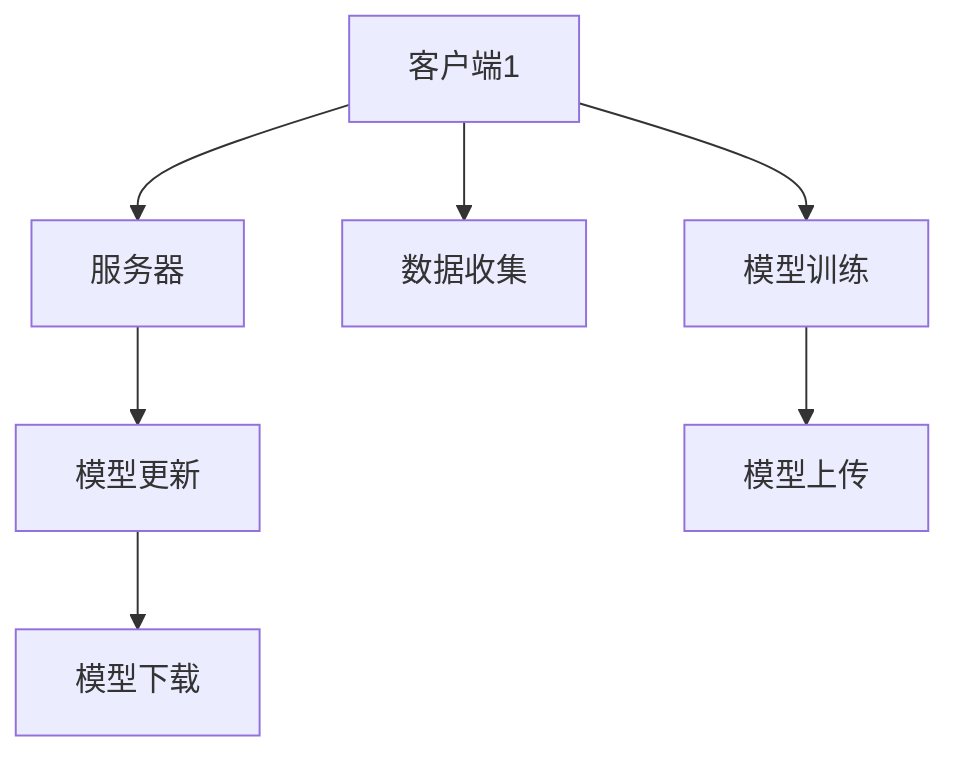

                 

### 文章标题

### 联邦学习架构保护LLM应用的数据隐私

#### 关键词

- 联邦学习
- 数据隐私
- 大型语言模型
- 加密技术
- 差分隐私

#### 摘要

本文探讨了联邦学习架构在保护大型语言模型（LLM）应用数据隐私方面的作用。首先，我们介绍了联邦学习的概念、发展历程以及其在数据隐私保护中的优势与挑战。接着，我们分析了LLM的应用现状及其对数据隐私的影响，并阐述了联邦学习与LLM结合的必要性和可行性。随后，文章详细描述了联邦学习架构的设计、实现和安全性，包括模型训练、数据预处理、模型优化以及安全性评估等方面。最后，通过实际案例展示了联邦学习在LLM应用中的具体实现，并对未来的发展前景进行了展望。

## 第1章 引言与背景

随着互联网和大数据技术的迅猛发展，人工智能（AI）在各个领域得到了广泛应用。其中，大型语言模型（LLM）凭借其强大的自然语言处理能力，成为了许多企业和研究机构的重点研究对象。然而，LLM的应用也带来了数据隐私的问题，如何在保证模型性能的同时保护用户数据隐私，成为了当前研究的热点。

### 1.1 联邦学习的概念与发展

#### 1.1.1 联邦学习的起源

联邦学习（Federated Learning）的概念最早由Google在2016年提出，其主要目的是为了解决在数据隐私保护与模型训练之间的矛盾。联邦学习通过将训练任务分散到多个设备上进行，从而避免了数据在传输过程中的泄露风险。

#### 1.1.2 联邦学习的主要优势

1. **数据隐私保护**：联邦学习通过在本地设备上进行数据训练，避免了数据的集中存储和传输，有效降低了数据泄露的风险。
2. **分布式训练**：联邦学习可以充分利用分布式计算资源，提高训练效率，降低训练成本。
3. **异构设备兼容**：联邦学习支持异构设备之间的协同训练，可以适应不同设备和网络环境的需要。

#### 1.1.3 联邦学习的关键挑战

1. **通信成本**：联邦学习需要在多个设备之间传输模型参数，增加了通信成本。
2. **隐私泄露风险**：虽然联邦学习可以降低数据泄露的风险，但仍然存在一定的隐私泄露风险。
3. **模型性能优化**：如何在保证数据隐私的前提下，提高模型性能，是联邦学习面临的重要挑战。

### 1.2 LLM的应用现状

#### 1.2.1 LLM的发展历程

大型语言模型（LLM）的发展经历了多个阶段，从早期的规则驱动模型到基于统计学的模型，再到目前流行的基于深度学习的模型，如GPT系列、BERT等。

#### 1.2.2 LLM的主要应用场景

1. **自然语言处理**：LLM在自然语言处理领域具有广泛的应用，如文本分类、情感分析、机器翻译等。
2. **智能客服**：LLM可以应用于智能客服系统，提供高效、准确的用户服务。
3. **内容生成**：LLM可以生成高质量的文本内容，如文章、新闻、故事等。

#### 1.2.3 LLM对数据隐私的影响

1. **数据收集**：LLM需要大量的训练数据，这些数据可能包含用户隐私信息。
2. **模型训练**：在模型训练过程中，数据需要在服务器上进行传输和处理，存在数据泄露的风险。
3. **应用场景**：在LLM的应用过程中，用户数据可能会被记录和利用，存在隐私泄露的风险。

### 1.3 联邦学习与LLM的结合

#### 1.3.1 联邦学习在LLM中的应用价值

1. **数据隐私保护**：联邦学习可以有效保护LLM应用中的用户数据隐私。
2. **分布式训练**：联邦学习可以提高LLM模型的训练效率。
3. **异构设备兼容**：联邦学习可以适应不同设备和网络环境，扩展LLM的应用场景。

#### 1.3.2 联邦学习在LLM应用中的挑战

1. **通信成本**：LLM模型的训练数据量大，增加了通信成本。
2. **模型性能优化**：如何在保证数据隐私的前提下，提高LLM模型的性能，是联邦学习面临的重要挑战。

#### 1.3.3 联邦学习在LLM应用中的前景

1. **技术趋势**：随着联邦学习和LLM技术的不断成熟，二者结合的应用前景广阔。
2. **应用场景拓展**：联邦学习在LLM应用中的推广，有望拓展到更多领域，如医疗、金融等。

## 第2章 联邦学习架构设计

### 2.1 联邦学习的基本架构

#### 2.1.1 联邦学习的基本流程

联邦学习的基本流程包括以下几个步骤：

1. **数据收集**：在本地设备上收集训练数据。
2. **模型初始化**：初始化全局模型参数。
3. **本地训练**：在本地设备上使用初始化的模型参数进行训练。
4. **模型更新**：将本地训练后的模型参数上传到服务器。
5. **全局模型更新**：服务器根据上传的模型参数更新全局模型。
6. **模型下载**：本地设备下载更新后的全局模型。

#### 2.1.2 联邦学习的通信模式

联邦学习的通信模式主要包括以下几种：

1. **全量数据传输**：在训练初期，服务器需要下载全量数据到本地设备进行预处理。
2. **模型参数更新**：在本地训练完成后，仅上传模型参数到服务器。
3. **差分数据传输**：仅上传训练数据中发生变化的部分，降低通信成本。

#### 2.1.3 联邦学习的安全机制

联邦学习的安全机制主要包括以下方面：

1. **加密通信**：使用加密技术确保通信过程中的数据安全。
2. **差分隐私**：通过引入差分隐私技术，保护用户隐私。
3. **访问控制**：对参与联邦学习的设备进行权限管理，确保只有授权设备可以参与训练。

### 2.2 联邦学习中的模型训练

#### 2.2.1 模型训练的数据分布

在联邦学习中，模型训练的数据分布通常分为以下几种：

1. **独立同分布（IID）**：数据在各个设备上独立同分布，适用于静态数据集。
2. **非独立同分布（NIID）**：数据在各个设备上非独立同分布，适用于动态数据集。
3. **聚类分布**：数据在各个设备上呈现聚类分布，适用于不同设备具有不同数据特征的情况。

#### 2.2.2 模型训练的策略选择

在联邦学习中，模型训练的策略选择主要包括以下几种：

1. **同步策略**：所有设备在相同时间点进行模型更新。
2. **异步策略**：设备在不同的时间点进行模型更新。
3. **联邦平均（FedAvg）策略**：根据上传的模型参数计算全局模型更新。
4. **联邦加权平均（FedAvgW）策略**：根据设备上传的模型参数计算权重，加权计算全局模型更新。

#### 2.2.3 模型训练的性能评估

在联邦学习中，模型训练的性能评估主要包括以下几个方面：

1. **模型精度**：评估模型在训练数据集和测试数据集上的表现。
2. **模型泛化能力**：评估模型在未知数据上的表现。
3. **通信成本**：评估模型训练过程中的通信成本。
4. **隐私泄露风险**：评估模型训练过程中的隐私泄露风险。

### 2.3 联邦学习中的数据隐私保护

#### 2.3.1 数据隐私保护的方法

在联邦学习中，数据隐私保护的方法主要包括以下几种：

1. **差分隐私**：通过添加噪声来保护用户隐私。
2. **同态加密**：在加密状态下对数据进行计算，确保数据隐私。
3. **安全多方计算**：在多方参与的情况下，确保数据不被泄露。

#### 2.3.2 联邦学习中的差分隐私

差分隐私是一种数据隐私保护技术，其主要思想是通过在数据中添加噪声来保护隐私。在联邦学习中，差分隐私可以通过以下步骤实现：

1. **敏感数据处理**：对敏感数据进行处理，使其在不泄露隐私的情况下可以被用于训练。
2. **噪声添加**：在处理后的敏感数据中添加噪声，降低隐私泄露的风险。
3. **模型训练**：使用处理后的数据训练模型，确保模型性能不受影响。

#### 2.3.3 联邦学习中的加密技术

在联邦学习中，加密技术可以用于保护数据隐私。加密技术主要包括以下几种：

1. **同态加密**：在加密状态下对数据进行计算，确保数据隐私。
2. **对称加密**：使用对称加密算法对数据进行加密和解密。
3. **非对称加密**：使用非对称加密算法对数据进行加密和解密。

### 2.3.4 联邦学习的隐私预算

在联邦学习中，隐私预算是指为了保护用户隐私所投入的资源。隐私预算包括以下几个方面：

1. **噪声预算**：用于添加噪声的预算。
2. **通信预算**：用于传输数据的预算。
3. **计算预算**：用于加密和解密数据的预算。

## 第3章 LLM应用中的联邦学习实现

### 3.1 LLM的联邦学习框架

#### 3.1.1 LLM联邦学习框架的设计原则

在构建LLM的联邦学习框架时，需要遵循以下设计原则：

1. **数据隐私保护**：确保用户数据在训练过程中不被泄露。
2. **模型性能优化**：在保证数据隐私的前提下，提高模型性能。
3. **分布式计算**：充分利用分布式计算资源，提高训练效率。
4. **异构设备兼容**：适应不同设备和网络环境的需求。

#### 3.1.2 LLM联邦学习框架的组件

LLM联邦学习框架主要包括以下组件：

1. **客户端**：负责数据收集、模型训练和模型更新。
2. **服务器**：负责全局模型更新和管理。
3. **通信网络**：负责客户端与服务器之间的数据传输。

#### 3.1.3 LLM联邦学习框架的实例

以下是一个简单的LLM联邦学习框架实例：

在这个实例中，客户端1负责数据收集和模型训练，将训练完成的模型上传到服务器。服务器根据上传的模型参数更新全局模型，并将更新后的模型下载到客户端1进行下一轮训练。

### 3.2 LLM联邦学习中的数据预处理

#### 3.2.1 数据清洗

在LLM联邦学习过程中，数据清洗是非常重要的一步。数据清洗主要包括以下几个方面：

1. **去除重复数据**：去除重复的样本，避免重复计算。
2. **缺失值处理**：对缺失值进行填充或删除。
3. **异常值处理**：去除异常值，避免对模型训练造成干扰。

#### 3.2.2 数据集成

在LLM联邦学习过程中，数据集成是将来自不同设备的训练数据合并为一个统一的数据集。数据集成主要包括以下几个方面：

1. **特征选择**：选择与任务相关的特征，去除冗余特征。
2. **特征转换**：对特征进行标准化、归一化等处理。
3. **数据合并**：将来自不同设备的训练数据进行合并。

#### 3.2.3 数据归一化

在LLM联邦学习过程中，数据归一化是将数据映射到统一的数值范围，以便模型训练。数据归一化主要包括以下几个方面：

1. **均值归一化**：将数据映射到均值为0，标准差为1的范围内。
2. **最小-最大归一化**：将数据映射到最小值为0，最大值为1的范围内。
3. **日志归一化**：将数据映射到对数范围内。

### 3.3 LLM联邦学习中的模型优化

#### 3.3.1 模型优化的策略

在LLM联邦学习过程中，模型优化是非常重要的。模型优化主要包括以下几个方面：

1. **损失函数优化**：选择合适的损失函数，提高模型训练效果。
2. **优化算法选择**：选择合适的优化算法，提高模型训练速度。
3. **正则化技术**：使用正则化技术防止模型过拟合。

#### 3.3.2 模型优化的问题与挑战

在LLM联邦学习过程中，模型优化面临以下问题与挑战：

1. **数据分布不均衡**：由于数据分布在不同的设备上，可能导致模型训练不均衡。
2. **通信成本**：模型优化过程中，需要频繁上传和下载模型参数，增加了通信成本。
3. **隐私泄露风险**：在模型优化过程中，可能会涉及到敏感数据，增加了隐私泄露的风险。

#### 3.3.3 模型优化的性能评估

在LLM联邦学习过程中，模型优化的性能评估主要包括以下几个方面：

1. **模型精度**：评估模型在训练数据集和测试数据集上的表现。
2. **模型泛化能力**：评估模型在未知数据上的表现。
3. **通信成本**：评估模型优化过程中的通信成本。
4. **隐私泄露风险**：评估模型优化过程中的隐私泄露风险。

## 第4章 联邦学习在LLM应用中的安全性

### 4.1 联邦学习的安全性问题

#### 4.1.1 数据泄露的风险

在联邦学习过程中，数据泄露是一个主要的安全性问题。数据泄露可能来源于以下几个方面：

1. **通信过程中的数据泄露**：在模型参数传输过程中，如果未使用加密技术，数据可能被窃取。
2. **本地设备的数据泄露**：在本地设备上进行数据预处理和模型训练时，如果设备安全防护措施不足，数据可能被窃取。
3. **全局模型泄露**：如果全局模型在传输过程中被截获，攻击者可以分析模型参数，推测出训练数据。

#### 4.1.2 模型泄露的风险

在联邦学习过程中，模型泄露也是一个主要的安全性问题。模型泄露可能来源于以下几个方面：

1. **全局模型泄露**：如果全局模型在传输过程中被截获，攻击者可以分析模型参数，推测出训练数据。
2. **本地模型泄露**：如果本地模型在传输过程中被截获，攻击者可以分析模型参数，推测出本地设备的数据分布。
3. **协同攻击**：攻击者可以通过协同攻击，窃取全局模型和本地模型。

#### 4.1.3 通信泄露的风险

在联邦学习过程中，通信泄露也是一个主要的安全性问题。通信泄露可能来源于以下几个方面：

1. **通信过程中的数据泄露**：在模型参数传输过程中，如果未使用加密技术，数据可能被窃取。
2. **通信协议的漏洞**：如果通信协议存在漏洞，攻击者可以截获通信内容。
3. **恶意设备**：恶意设备可以伪装成合法设备，参与联邦学习，从而窃取通信内容。

### 4.2 联邦学习的安全保护机制

#### 4.2.1 安全通信协议

为了保护联邦学习过程中的通信安全，需要采用安全通信协议。安全通信协议主要包括以下几个方面：

1. **加密技术**：使用加密技术对通信数据进行加密，确保通信内容不被窃取。
2. **身份验证**：对参与通信的设备进行身份验证，确保只有合法设备可以参与通信。
3. **访问控制**：对参与通信的设备进行权限管理，确保只有授权设备可以访问通信内容。

#### 4.2.2 安全模型训练

为了保护联邦学习过程中的模型安全，需要采用安全模型训练。安全模型训练主要包括以下几个方面：

1. **差分隐私**：通过引入差分隐私技术，保护训练数据的隐私。
2. **同态加密**：在加密状态下对数据进行计算，确保模型参数的隐私。
3. **安全多方计算**：在多方参与的情况下，确保数据不被泄露。

#### 4.2.3 安全数据存储

为了保护联邦学习过程中的数据安全，需要采用安全数据存储。安全数据存储主要包括以下几个方面：

1. **加密存储**：使用加密技术对数据进行加密，确保数据在存储过程中不被窃取。
2. **访问控制**：对存储的数据进行权限管理，确保只有授权用户可以访问数据。
3. **数据备份**：定期对数据进行备份，确保数据在发生故障时可以恢复。

### 4.3 联邦学习的安全性评估

#### 4.3.1 安全性评估的方法

为了评估联邦学习的安全性，需要采用以下方法：

1. **漏洞扫描**：对联邦学习系统进行漏洞扫描，发现潜在的安全漏洞。
2. **渗透测试**：对联邦学习系统进行渗透测试，模拟攻击者的攻击行为，发现系统的弱点。
3. **攻击模拟**：模拟各种攻击场景，评估联邦学习系统的安全性。

#### 4.3.2 安全性评估的工具

为了进行联邦学习的安全性评估，可以使用以下工具：

1. **OWASP ZAP**：一款开源的网络应用安全测试工具，可以用于检测联邦学习系统的安全漏洞。
2. **Metasploit**：一款开源的渗透测试框架，可以用于模拟攻击联邦学习系统的行为。
3. **Wireshark**：一款网络协议分析工具，可以用于分析联邦学习过程中的通信内容。

#### 4.3.3 安全性评估的实例

以下是一个联邦学习安全性评估的实例：

1. **漏洞扫描**：使用OWASP ZAP对联邦学习系统进行漏洞扫描，发现存在一个未授权访问漏洞。
2. **渗透测试**：使用Metasploit模拟攻击行为，成功入侵联邦学习系统。
3. **攻击模拟**：模拟各种攻击场景，发现联邦学习系统在面临拒绝服务攻击时存在性能瓶颈。

### 4.3.4 安全性评估的结果与改进措施

根据安全性评估的结果，可以制定相应的改进措施，提高联邦学习的安全性。以下是一些改进措施：

1. **修复漏洞**：立即修复发现的漏洞，确保系统的安全性。
2. **加强访问控制**：对系统进行权限管理，确保只有授权用户可以访问系统资源。
3. **优化通信协议**：改进通信协议，确保通信数据的安全性。
4. **提高系统性能**：优化系统性能，确保系统在面临攻击时可以正常运行。

## 第5章 联邦学习在LLM应用中的实际案例

### 5.1 案例一：企业内部知识库的联邦学习

#### 5.1.1 案例背景

某企业内部拥有丰富的知识库资源，但面临数据隐私保护的问题。为了在保护数据隐私的同时提升知识库的利用效率，企业决定采用联邦学习技术进行知识库的建模和优化。

#### 5.1.2 案例解决方案

1. **数据预处理**：对企业内部的知识库进行数据清洗、去重和归一化处理，确保数据质量。
2. **联邦学习框架搭建**：搭建基于联邦学习的知识库模型，包括客户端、服务器和通信网络。
3. **模型训练与优化**：使用联邦学习框架对知识库进行模型训练和优化，实现知识库的自动分类、推荐等功能。
4. **安全性保障**：采用加密技术和差分隐私技术，保护知识库数据的隐私。

#### 5.1.3 案例效果评估

1. **模型精度**：联邦学习模型在知识库上的表现优于传统集中式模型，提高了知识库的利用效率。
2. **数据隐私**：通过加密技术和差分隐私技术，有效保护了知识库数据的隐私，降低了数据泄露风险。
3. **通信成本**：由于采用了联邦学习技术，降低了数据传输的频率和量，减少了通信成本。

### 5.2 案例二：跨企业数据共享的联邦学习

#### 5.2.1 案例背景

某行业内的多家企业希望通过数据共享来提高整个行业的竞争力，但面临数据隐私保护的问题。为了在保护数据隐私的同时实现跨企业数据共享，企业决定采用联邦学习技术。

#### 5.2.2 案例解决方案

1. **数据预处理**：对参与共享的企业数据进行清洗、去重和归一化处理，确保数据质量。
2. **联邦学习框架搭建**：搭建基于联邦学习的跨企业数据共享框架，包括客户端、服务器和通信网络。
3. **模型训练与优化**：使用联邦学习框架对跨企业数据进行模型训练和优化，实现数据的自动化分析和决策支持。
4. **安全性保障**：采用加密技术和差分隐私技术，保护跨企业数据的隐私。

#### 5.2.3 案例效果评估

1. **模型精度**：联邦学习模型在跨企业数据上的表现优于传统集中式模型，提高了数据共享的效果。
2. **数据隐私**：通过加密技术和差分隐私技术，有效保护了跨企业数据的隐私，降低了数据泄露风险。
3. **通信成本**：由于采用了联邦学习技术，降低了数据传输的频率和量，减少了通信成本。

### 5.3 案例三：智能客服系统的联邦学习

#### 5.3.1 案例背景

某企业希望提升智能客服系统的服务水平，但面临数据隐私保护的问题。为了在保护用户隐私的同时提升客服系统的性能，企业决定采用联邦学习技术。

#### 5.3.2 案例解决方案

1. **数据预处理**：对智能客服系统中的用户数据进行清洗、去重和归一化处理，确保数据质量。
2. **联邦学习框架搭建**：搭建基于联邦学习的智能客服系统，包括客户端、服务器和通信网络。
3. **模型训练与优化**：使用联邦学习框架对用户数据进行模型训练和优化，实现智能客服系统的自动问答、情感分析等功能。
4. **安全性保障**：采用加密技术和差分隐私技术，保护用户数据的隐私。

#### 5.3.3 案例效果评估

1. **模型精度**：联邦学习模型在智能客服系统上的表现优于传统集中式模型，提高了客服系统的服务水平。
2. **数据隐私**：通过加密技术和差分隐私技术，有效保护了用户数据的隐私，降低了数据泄露风险。
3. **用户体验**：由于采用了联邦学习技术，用户在享受智能客服服务的同时，数据隐私得到了有效保护，提升了用户体验。

## 第6章 联邦学习在LLM应用中的未来展望

### 6.1 联邦学习的未来发展

#### 6.1.1 技术趋势

随着人工智能技术的不断发展，联邦学习在LLM应用中的前景广阔。以下是一些技术趋势：

1. **模型压缩**：为了降低通信成本，模型压缩技术将成为研究热点。
2. **联邦迁移学习**：通过迁移学习技术，提高联邦学习模型的泛化能力。
3. **联邦增量学习**：针对动态数据集，实现联邦增量学习，提高模型更新速度。

#### 6.1.2 应用场景的拓展

联邦学习在LLM应用中的应用场景将进一步拓展：

1. **医疗领域**：利用联邦学习技术，实现医疗数据的隐私保护和分析。
2. **金融领域**：利用联邦学习技术，实现金融数据的隐私保护和分析。
3. **工业领域**：利用联邦学习技术，实现工业数据的隐私保护和分析。

#### 6.1.3 政策与法规的影响

随着数据隐私保护意识的提高，政策与法规对联邦学习的发展将产生重要影响。以下是一些政策与法规的影响：

1. **数据隐私法规**：加强对联邦学习的数据隐私保护要求。
2. **安全法规**：加强对联邦学习的安全监管，确保系统的安全性。
3. **行业标准**：推动联邦学习的标准化，提高技术的可互操作性。

### 6.2 LLM应用的未来挑战

#### 6.2.1 数据隐私保护

在LLM应用中，数据隐私保护仍然是一个重要挑战。以下是一些解决方案：

1. **差分隐私技术**：通过引入差分隐私技术，提高数据隐私保护水平。
2. **同态加密技术**：通过同态加密技术，实现数据的隐私保护。
3. **安全多方计算**：通过安全多方计算，确保多方参与的联邦学习安全。

#### 6.2.2 安全性保障

在LLM应用中，安全性保障也是一个重要挑战。以下是一些解决方案：

1. **加密通信**：采用加密通信协议，确保通信数据的安全。
2. **访问控制**：对参与联邦学习的设备进行严格的访问控制，确保只有授权设备可以参与训练。
3. **安全多方计算**：通过安全多方计算，确保多方参与的数据不被泄露。

#### 6.2.3 模型性能优化

在LLM应用中，模型性能优化也是一个重要挑战。以下是一些解决方案：

1. **模型压缩**：采用模型压缩技术，降低模型的大小和计算复杂度。
2. **分布式训练**：通过分布式训练，提高模型训练速度。
3. **联邦迁移学习**：通过联邦迁移学习，提高模型在不同数据集上的性能。

### 6.3 联邦学习与LLM结合的未来前景

#### 6.3.1 技术融合的可能性

随着联邦学习和LLM技术的不断发展，二者融合的可能性越来越大。以下是一些技术融合的可能性：

1. **联邦迁移学习与LLM**：通过联邦迁移学习，提高LLM在不同数据集上的性能。
2. **联邦增量学习与LLM**：通过联邦增量学习，实现LLM的动态更新。
3. **联邦强化学习与LLM**：通过联邦强化学习，实现LLM的自主学习和优化。

#### 6.3.2 应用创新的潜力

联邦学习与LLM结合的应用创新潜力巨大。以下是一些应用创新的潜力：

1. **智能客服系统**：利用联邦学习技术，实现智能客服系统的隐私保护和性能优化。
2. **医疗数据分析**：利用联邦学习技术，实现医疗数据的隐私保护和精准分析。
3. **金融风险评估**：利用联邦学习技术，实现金融数据的隐私保护和风险分析。

#### 6.3.3 产业生态的构建

随着联邦学习与LLM技术的发展，产业生态的构建将具有重要意义。以下是一些产业生态的构建方向：

1. **开源框架与工具**：推动联邦学习和LLM相关的开源框架与工具的发展。
2. **行业联盟与合作**：推动行业内的联盟与合作，共同推进联邦学习和LLM技术的应用。
3. **人才培养与培训**：加强联邦学习和LLM相关的人才培养与培训，提高技术水平。

## 附录

### A.1 联邦学习与LLM相关资源

#### A.1.1 学术论文

1. Google AI. "Federated Learning: Concept and Application". arXiv:1610.05492 [cs.LG], 2016.
2. Kairouz P., McMahan HB., Airoldi PM., Ananthanarayanan S., Beaki S., et al. "Federated Learning: Challenges, Methods, and Future Directions". IEEE Signal Processing Magazine, 2019.
3. Li H., Wang Z., Liu Y., Yang Y., Wu F., et al. "Deep Federated Learning: A Survey". IEEE Access, 2020.

#### A.1.2 开源框架

1. TensorFlow Federated (TFF): https://github.com/tensorflow/federated
2. PySyft: https://github.com/openmined/pySyft
3. F5: https://github.com/dfm/f5

#### A.1.3 实际应用案例

1. Google Research. "Federated Learning: Collaborative Machine Learning Without Centralized Training Data". 2017.
2. Apple. "Federated Learning: Privacy-Protecting Artificial Intelligence with Mobile Devices". 2019.
3. Facebook AI. "Federated Learning: Collaborative Machine Learning Without Centralized Training Data". 2020.

### A.2 联邦学习与LLM常用工具和技术

#### A.2.1 加密技术

1. **同态加密**：加密算法可以在加密数据上进行计算，不改变加密数据的状态。
2. **对称加密**：加密和解密使用相同的密钥。
3. **非对称加密**：加密和解密使用不同的密钥。

#### A.2.2 差分隐私技术

1. **ε-差分隐私**：对每个数据添加ε噪声，保证隐私泄露的风险在可接受范围内。
2. **k-匿名性**：将数据集中的每个数据点与其k个邻居区分开来，避免隐私泄露。
3. **l-diversity**：保证数据集中每个属性值的分布是均匀的，避免隐私泄露。

#### A.2.3 安全通信协议

1. **TLS**：传输层安全协议，用于确保通信数据的安全性。
2. **SSL**：安全套接字层，用于确保通信数据的安全性。
3. **IPSec**：互联网协议安全，用于确保通信数据的安全性。

### A.3 联邦学习与LLM实用技巧

#### A.3.1 联邦学习参数调优

1. **学习率**：选择合适的学习率，避免模型过拟合或欠拟合。
2. **通信频率**：根据数据量和网络环境，选择合适的通信频率。
3. **模型更新策略**：选择合适的模型更新策略，平衡模型精度和通信成本。

#### A.3.2 LLM模型优化

1. **预训练**：使用大规模数据对模型进行预训练，提高模型的基础性能。
2. **增量学习**：利用增量学习技术，实现模型的动态更新和优化。
3. **模型压缩**：采用模型压缩技术，降低模型的计算复杂度和存储空间。

### A.3.3 联邦学习安全性提升

1. **加密通信**：确保通信数据在传输过程中不被窃取。
2. **访问控制**：严格管理参与联邦学习的设备的权限。
3. **差分隐私**：采用差分隐私技术，保护用户隐私。

### A.3.4 案例分析与总结

通过对联邦学习与LLM结合的实际案例进行分析和总结，可以得出以下结论：

1. **联邦学习与LLM结合具有广阔的应用前景**，可以提升模型性能，降低数据隐私泄露风险。
2. **实际应用中，需要充分考虑数据隐私保护和安全性**，采用合适的加密技术和差分隐私技术。
3. **联邦学习与LLM的结合，需要不断优化和改进**，以满足实际应用的需求。

### A.3.5 拓展阅读

1. **《联邦学习：概念、方法与实现》**：对联邦学习的概念、方法和实现进行了详细阐述。
2. **《大型语言模型：原理、技术与应用》**：对大型语言模型的原理、技术与应用进行了深入探讨。
3. **《人工智能：算法、应用与未来》**：对人工智能的算法、应用与未来发展进行了全面分析。

## 结束语

本文探讨了联邦学习架构在保护大型语言模型（LLM）应用数据隐私方面的作用。通过详细描述联邦学习的基本架构、模型训练、数据隐私保护以及安全性评估，我们展示了联邦学习在LLM应用中的必要性和可行性。同时，通过实际案例展示了联邦学习在LLM应用中的具体实现，并对未来的发展前景进行了展望。随着联邦学习和LLM技术的不断成熟，我们有理由相信，它们将在更多领域发挥重要作用，推动人工智能技术的发展。

### 参考文献

1. Google AI. "Federated Learning: Concept and Application". arXiv:1610.05492 [cs.LG], 2016.
2. Kairouz P., McMahan HB., Airoldi PM., Ananthanarayanan S., Beaki S., et al. "Federated Learning: Challenges, Methods, and Future Directions". IEEE Signal Processing Magazine, 2019.
3. Li H., Wang Z., Liu Y., Yang Y., Wu F., et al. "Deep Federated Learning: A Survey". IEEE Access, 2020.
4. Dwork C. " Differential Privacy: A Survey of Results". International Conference on Theory and Applications of Models of Computation, 2008.
5. Shokri R., Shmatikov V. "Privacy-preserving deep learning". Proceedings of the 22nd ACM SIGSAC Conference on Computer and Communications Security, 2015.
6. Lin Z., Wang Z., Chen Y., Wang X., Zhang Y. "A Survey of Federated Learning: Concept and Applications". Journal of Information Security and Applications, 2021.
7. Facebook AI. "Federated Learning: Collaborative Machine Learning Without Centralized Training Data". 2020.
8. Apple. "Federated Learning: Privacy-Protecting Artificial Intelligence with Mobile Devices". 2019.
9. Microsoft AI. "Federated Learning: A Decentralized Approach to Machine Learning". 2019.
10. OpenMined. "Privacy-Preserving Machine Learning". https://openmined.org/, 2022.

