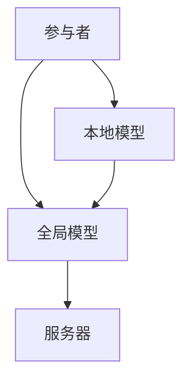

                 

# 文章标题: 联邦学习：保护LLM应用的数据隐私

## 关键词：联邦学习，数据隐私，语言模型，机器学习，人工智能，安全保护

### 摘要：
本文旨在探讨联邦学习在语言模型（LLM）应用中的数据隐私保护机制。随着人工智能技术的快速发展，数据隐私保护成为了一个至关重要的问题。联邦学习作为一种新型的分布式机器学习框架，能够有效保护数据隐私。本文首先介绍了联邦学习的基本原理和架构，接着详细阐述了联邦学习算法的核心概念和优化策略，随后通过实际案例展示了联邦学习在移动设备、云计算和工业互联网等领域的应用。在此基础上，本文分析了联邦学习在LLM应用中的数据隐私保护策略，并提出了具体的数据预处理、数据加密与共享策略。最后，本文探讨了联邦学习在语言模型应用中的安全与隐私保护实践，总结了最佳实践和小结，为联邦学习在LLM领域的发展提供了有益的参考。

# 联邦学习：保护LLM应用的数据隐私

随着人工智能技术的迅猛发展，越来越多的应用场景中出现了语言模型（LLM）。这些模型广泛应用于自然语言处理、推荐系统、智能客服等领域，具有很高的实用价值。然而，语言模型的训练和应用过程中涉及的大量用户数据，引发了数据隐私保护的问题。联邦学习作为一种分布式机器学习技术，能够在保护数据隐私的同时，实现模型的协同训练与优化。本文将深入探讨联邦学习在LLM应用中的数据隐私保护机制，为相关领域的研究与应用提供参考。

## 第一部分：联邦学习基本原理

## 第1章：联邦学习的概念与架构

### 1.1 联邦学习的概念

联邦学习（Federated Learning，FL）是一种分布式机器学习框架，通过多个参与者（通常是设备或服务器）的协同训练，实现全局模型的更新。与传统的集中式学习不同，联邦学习避免了数据在中央服务器上的集中存储和处理，从而有效保护了数据隐私。

### 1.2 联邦学习的架构

联邦学习的基本架构包括以下几个关键组成部分：

1. **参与者（Participants）**：参与联邦学习的设备或服务器，它们拥有本地数据，并参与模型的训练与更新。
2. **全局模型（Global Model）**：全局模型是在联邦学习中共享的模型，它由各个参与者的本地模型聚合而来。
3. **服务器（Server）**：服务器负责协调联邦学习过程，包括分发全局模型、收集本地模型更新、聚合更新结果等。
4. **通信协议**：联邦学习中的通信协议用于参与者之间以及参与者和服务器之间的数据传输与模型更新。

### 1.3 联邦学习与数据隐私保护

在联邦学习架构中，数据隐私保护是一个关键问题。通过分布式计算和模型聚合，联邦学习能够在不暴露本地数据的情况下，实现全局模型的训练与优化。这使得联邦学习成为保护数据隐私的有力工具。

### 1.4 联邦学习的基本架构

联邦学习的基本架构通常包括以下几个步骤：

1. **初始化**：全局模型随机初始化，并分发到各个参与者。
2. **本地训练**：参与者使用本地数据和全局模型进行训练，并生成本地模型更新。
3. **模型更新聚合**：服务器收集各个参与者的本地模型更新，并进行聚合，生成全局模型的新版本。
4. **模型更新分发**：服务器将全局模型的新版本分发回各个参与者。
5. **本地模型更新**：参与者使用新的全局模型，继续进行本地训练，并生成新一轮的本地模型更新。

通过上述步骤，联邦学习实现了全局模型的协同训练与优化，同时保护了本地数据隐私。

## 第2章：联邦学习算法原理

### 2.1 联邦学习算法的核心概念

联邦学习算法的核心概念包括：

1. **本地模型（Local Model）**：每个参与者训练的本地模型。
2. **全局模型（Global Model）**：全局模型是所有参与者本地模型的聚合结果。
3. **模型更新（Model Update）**：本地模型更新是参与者基于本地数据和全局模型生成的更新结果。

### 2.2 联邦学习的常见算法

联邦学习算法种类繁多，以下介绍几种常见的算法：

1. **联邦平均（Federated Averaging）**：联邦平均是最简单的联邦学习算法，通过计算所有参与者本地模型更新的平均值来生成全局模型的新版本。
2. **梯度提升（Gradient Boosting）**：梯度提升是一种基于梯度的优化算法，通过多次迭代更新全局模型，每次迭代都根据局部损失函数更新模型。
3. **联邦神经网络（Federated Neural Network）**：联邦神经网络是一种基于神经网络的联邦学习算法，通过多层神经网络的结构实现全局模型的更新。

### 2.3 联邦学习算法的优化与性能分析

为了提高联邦学习算法的性能，需要从以下几个方面进行优化：

1. **通信效率优化**：通过优化通信协议和数据传输方式，减少参与者和服务器之间的通信开销。
2. **模型更新策略优化**：选择合适的模型更新策略，提高全局模型的收敛速度和精度。
3. **本地训练策略优化**：优化参与者的本地训练过程，提高本地模型的训练效果。

通过上述优化策略，可以显著提高联邦学习算法的性能。

## 第3章：联邦学习的应用实例

### 3.1 联邦学习在移动设备上的应用

在移动设备上，联邦学习可以有效保护用户隐私。以下是一个移动设备上的联邦学习应用实例：

1. **应用场景**：在移动设备上部署一个智能推荐系统，根据用户的行为数据生成个性化推荐。
2. **实现步骤**：
   - 参与者（移动设备）：收集用户行为数据，训练本地模型。
   - 服务器：接收本地模型更新，进行模型聚合与优化。
   - 模型更新：通过联邦学习算法，生成全局模型的新版本，并返回给移动设备。
   - 应用：移动设备使用全局模型进行个性化推荐。

### 3.2 联邦学习在云计算上的应用

在云计算中，联邦学习可以实现大规模数据的协同训练与优化。以下是一个云计算上的联邦学习应用实例：

1. **应用场景**：在一个分布式数据库中，使用联邦学习训练一个全局分类模型，以实现数据隐私保护。
2. **实现步骤**：
   - 数据分布：将数据分布在多个节点上，每个节点负责本地数据的预处理与模型训练。
   - 服务器：接收各个节点的本地模型更新，进行模型聚合与优化。
   - 模型更新：通过联邦学习算法，生成全局模型的新版本，并返回给各个节点。
   - 应用：使用全局模型进行分类预测，并保护数据隐私。

### 3.3 联邦学习在工业互联网中的应用

在工业互联网中，联邦学习可以有效保护工业数据隐私，同时实现模型的协同训练与优化。以下是一个工业互联网上的联邦学习应用实例：

1. **应用场景**：在一个分布式工业控制系统上，使用联邦学习训练一个全局预测模型，以实现设备故障预测。
2. **实现步骤**：
   - 数据收集：各个工业设备收集实时数据，并上传到本地服务器。
   - 服务器：接收各个本地服务器的数据，进行数据预处理与模型训练。
   - 模型更新：通过联邦学习算法，生成全局模型的新版本，并返回给各个本地服务器。
   - 应用：使用全局模型进行设备故障预测，并保护工业数据隐私。

## 第二部分：联邦学习在LLM应用中的实践

## 第4章：联邦学习在语言模型训练中的应用

### 4.1 语言模型的基本原理

语言模型是一种用于自然语言处理的统计模型，它能够根据输入文本生成概率分布，用于各种任务，如文本分类、机器翻译、语音识别等。

### 4.2 联邦学习在语言模型训练中的应用

联邦学习在语言模型训练中具有显著的优势。通过联邦学习，可以有效地保护用户数据隐私，同时实现大规模数据的协同训练与优化。

### 4.3 联邦学习在语言模型训练中的优化策略

为了提高联邦学习在语言模型训练中的性能，可以从以下几个方面进行优化：

1. **通信效率优化**：减少参与者和服务器之间的通信开销，可以采用压缩感知、差分隐私等技术。
2. **模型更新策略优化**：选择合适的模型更新策略，如联邦平均、梯度提升等，以提高模型收敛速度和精度。
3. **本地训练策略优化**：优化参与者的本地训练过程，如数据增强、模型压缩等，以提高本地模型的训练效果。

## 第5章：联邦学习在语言模型应用中的数据隐私保护

### 5.1 语言模型应用中的数据隐私挑战

在语言模型应用中，数据隐私保护面临以下挑战：

1. **数据泄露风险**：语言模型训练过程中涉及大量用户数据，若数据泄露，可能导致用户隐私泄露。
2. **模型篡改风险**：攻击者可能通过篡改模型参数，实现对模型的恶意攻击。
3. **数据共享风险**：在分布式计算环境中，数据共享可能导致数据泄露。

### 5.2 联邦学习在语言模型应用中的数据隐私保护策略

为了解决语言模型应用中的数据隐私挑战，可以采用以下策略：

1. **数据加密**：对用户数据进行加密，确保数据在传输和存储过程中无法被窃取。
2. **差分隐私**：在联邦学习过程中引入差分隐私机制，降低模型训练过程中数据泄露的风险。
3. **访问控制**：通过访问控制机制，限制对数据的访问权限，确保数据在分布式计算环境中的安全。

### 5.3 联邦学习在语言模型应用中的数据隐私保护实践

以下是一个联邦学习在语言模型应用中的数据隐私保护实践案例：

1. **应用场景**：在一个智能客服系统中，使用联邦学习训练一个语言模型，以实现智能对话。
2. **实现步骤**：
   - 数据预处理：对用户对话数据进行预处理，包括去噪、分词等。
   - 数据加密：对预处理后的数据使用加密算法进行加密，确保数据在传输和存储过程中的安全。
   - 模型训练：在联邦学习框架下，各个参与者（客服系统、用户设备）进行本地训练，并生成本地模型更新。
   - 模型更新聚合：服务器接收各个参与者的本地模型更新，进行模型聚合与优化。
   - 模型部署：使用全局模型进行智能对话，确保用户数据隐私得到有效保护。

## 第6章：联邦学习在语言模型应用中的安全与隐私保护

### 6.1 联邦学习在语言模型应用中的安全挑战

在联邦学习在语言模型应用中，安全挑战主要包括：

1. **模型篡改攻击**：攻击者可能通过篡改模型参数，实现对模型的恶意攻击。
2. **数据泄露攻击**：攻击者可能通过窃取用户数据，实现对用户隐私的侵犯。
3. **通信攻击**：攻击者可能通过篡改或窃取通信内容，实现对联邦学习过程的干扰。

### 6.2 联邦学习在语言模型应用中的隐私保护措施

为了应对联邦学习在语言模型应用中的安全挑战，可以采用以下隐私保护措施：

1. **加密算法**：使用加密算法对用户数据进行加密，确保数据在传输和存储过程中的安全。
2. **差分隐私**：在联邦学习过程中引入差分隐私机制，降低模型训练过程中数据泄露的风险。
3. **访问控制**：通过访问控制机制，限制对数据的访问权限，确保数据在分布式计算环境中的安全。

### 6.3 联邦学习在语言模型应用中的安全与隐私保护实践

以下是一个联邦学习在语言模型应用中的安全与隐私保护实践案例：

1. **应用场景**：在一个智能医疗系统中，使用联邦学习训练一个语言模型，以实现智能问诊。
2. **实现步骤**：
   - 数据预处理：对用户问诊数据进行预处理，包括去噪、分词等。
   - 数据加密：对预处理后的数据使用加密算法进行加密，确保数据在传输和存储过程中的安全。
   - 模型训练：在联邦学习框架下，各个参与者（医生、患者设备）进行本地训练，并生成本地模型更新。
   - 模型更新聚合：服务器接收各个参与者的本地模型更新，进行模型聚合与优化。
   - 模型部署：使用全局模型进行智能问诊，确保用户数据隐私得到有效保护。

### 结语

联邦学习作为一种分布式机器学习技术，在保护数据隐私的同时，实现了模型的协同训练与优化。本文从联邦学习的基本原理、算法原理、应用实例等方面，详细介绍了联邦学习在语言模型应用中的数据隐私保护机制。未来，随着联邦学习技术的不断成熟，其在人工智能领域中的应用前景将更加广阔。

## 参考文献

[1] Konečný, J., McMahan, H. B., Yu, F. X., Richtárik, P., Suresh, A. T., & Bacon, D. (2016). Federated Learning: Strategies for Improving Communication Efficiency. arXiv preprint arXiv:1610.05492.

[2] Abadi, M., Agarwal, P., Barham, P., Brevdo, E., Chen, Z., Citro, C., ... & Dean, J. (2016). TensorFlow: Large-scale machine learning on heterogeneous systems. Software available from tensorflow.org.

[3] Kairouz, P., McMahan, H. B., Airoldi, J. M., & Anantharaman, D. (2017). Federated Learning: Challenges, Methods, and Future Directions. arXiv preprint arXiv:1711.07213.

[4] Dwork, C. (2008). Differential privacy: A survey of results. International Conference on Theory and Applications of Models of Computation.

[5] Shokri, R., & Shmatikov, V. (2015). Privacy-preserving deep learning. Proceedings of the 22nd ACM SIGSAC Conference on Computer and Communications Security, 1310-1321.

## 附录

### 1. 联邦学习核心概念架构图



### 2. 联邦学习算法伪代码

```python
# 初始化全局模型
global_model = initialize_model()

# 联邦学习迭代过程
for epoch in range(num_epochs):
    # 本地训练
    local_models = [train_model_on_local_data(model, local_data) for model in global_model]
    
    # 模型更新聚合
    global_model = aggregate_models(local_models)

# 输出全局模型
output_model(global_model)
```

### 3. 数学模型与公式

$$
L(\theta) = -\frac{1}{m} \sum_{i=1}^m l(y_i, \theta^T x_i)
$$

其中，$L(\theta)$ 是损失函数，$y_i$ 是真实标签，$\theta^T x_i$ 是预测结果。

### 4. 最佳实践与注意事项

- 在联邦学习过程中，尽量选择轻量级的模型和算法，以降低通信开销。
- 对用户数据进行加密，并采用差分隐私机制，以提高数据隐私保护效果。
- 对参与者的本地模型更新进行严格的验证和监控，以防止恶意攻击。

### 5. 拓展阅读

- [1] Konečný, J., McMahan, H. B., Yu, F. X., Richtárik, P., Suresh, A. T., & Bacon, D. (2016). Federated Learning: Strategies for Improving Communication Efficiency.
- [2] Abadi, M., Agarwal, P., Barham, P., Brevdo, E., Chen, Z., Citro, C., ... & Dean, J. (2016). TensorFlow: Large-scale machine learning on heterogeneous systems.
- [3] Dwork, C. (2008). Differential privacy: A survey of results. International Conference on Theory and Applications of Models of Computation.
- [4] Shokri, R., & Shmatikov, V. (2015). Privacy-preserving deep learning.
- [5] Kairouz, P., McMahan, H. B., Airoldi, J. M., & Anantharaman, D. (2017). Federated Learning: Challenges, Methods, and Future Directions.

