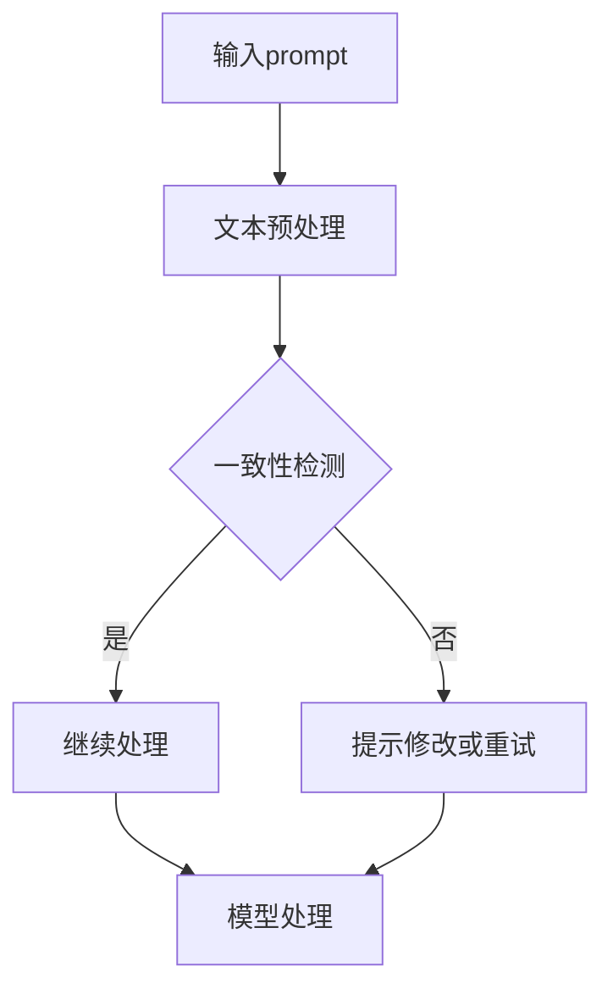

                 


## 自动化prompt一致性检查

### 关键词
- 自动化prompt一致性
- 提示词一致性检查
- 自然语言处理
- 机器学习算法
- 文本预处理
- 项目实战

### 摘要
本文旨在探讨自动化prompt一致性检查在自然语言处理领域的重要性。我们将首先介绍prompt的一致性概念，然后逐步深入探讨文本预处理、一致性检测算法的原理及其实现。通过具体的项目实战，我们将展示如何搭建开发环境、实现源代码，并进行代码解读与分析。文章末尾将对未来趋势、挑战及研究方向进行展望，并给出最佳实践建议。

---

## 第一部分：背景与核心概念

### 第1章：自动化prompt一致性检查概述

#### 1.1 自动化prompt一致性的重要性

在当今的数字化时代，自然语言处理（NLP）技术正迅速发展，其应用范围广泛，包括搜索引擎、聊天机器人、文本分析等。prompt作为与NLP模型交互的桥梁，其一致性直接影响到最终任务的执行效果。自动化prompt一致性检查的目标是确保输入的提示词与模型的预期一致，从而提高任务执行的准确性和效率。

#### 1.2 自动化prompt一致性检查的现状

目前，自动化prompt一致性检查主要依赖于规则匹配、统计方法和机器学习方法。规则匹配方法简单直观，但灵活性较差；统计方法能处理一定程度的多样性，但无法应对复杂的语义关系；机器学习方法具备较强的自适应能力，但需要大量标注数据。针对这些方法的局限性，本文将探讨一种基于机器学习且结合规则匹配和文本预处理的自动化prompt一致性检查框架。

#### 1.3 本书的目标与结构

本书的目标是深入探讨自动化prompt一致性检查的理论和实践，旨在为读者提供一个全面而系统的指导。本书结构如下：

1. **背景与核心概念**：介绍自动化prompt一致性检查的重要性、现状及本书的目标。
2. **核心概念与联系**：定义prompt一致性，并展示其与文本预处理、一致性检测算法之间的联系。
3. **算法原理与实现**：详细讲解文本预处理、一致性检测算法的原理和实现。
4. **项目实战与实现**：通过具体项目实战，展示开发环境搭建、源代码实现及代码解读。
5. **未来展望与挑战**：探讨自动化prompt一致性检查的发展趋势、挑战及未来研究方向。

### 第2章：核心概念与联系

#### 2.1 prompt的定义与作用

prompt，即提示词，是NLP模型接收的输入信息，它决定了模型的处理方向和内容。一个高质量的prompt不仅能明确模型的任务，还能引导模型生成更符合预期的输出。

#### 2.2 prompt一致性的概念

prompt一致性是指输入的提示词与模型预期之间的匹配程度。一致性高的prompt能够提高模型的处理效率，降低错误率；而一致性低的prompt可能导致模型误解任务，影响输出质量。

#### 2.3 Mermaid流程图：prompt一致性检查的架构

以下是prompt一致性检查的架构Mermaid流程图：



图1：prompt一致性检查的架构

- **A**: 输入prompt。
- **B**: 文本预处理，包括清洗、标准化和特征提取。
- **C**: 一致性检测，包括规则匹配、统计分析和机器学习算法。
- **D**: 如果一致性检测通过，继续进行模型处理。
- **E**: 如果一致性检测不通过，提示修改或重试。
- **F**: 模型处理结果。

### 第二部分：算法原理与实现

#### 第3章：文本预处理

文本预处理是自动化prompt一致性检查的关键步骤，它直接影响后续的一致性检测效果。

##### 3.1 文本清洗与标准化

文本清洗的目的是去除无用信息，如HTML标签、特殊字符和停用词。标准化则包括小写转换、去除标点符号等。

##### 3.2 特征提取

特征提取是将文本转换为计算机可以处理的形式。常用的方法包括词袋模型、TF-IDF和词嵌入等。

##### 3.3 伪代码：文本预处理流程

```python
def preprocess_text(prompt):
    # 清洗
    prompt = remove_html_tags(prompt)
    prompt = remove_special_characters(prompt)
    prompt = to_lower_case(prompt)
    
    # 标准化
    prompt = remove_stop_words(prompt)
    
    # 特征提取
    features = extract_features(prompt)
    
    return features
```

#### 第4章：一致性检测算法

一致性检测算法是自动化prompt一致性检查的核心，它决定了是否通过prompt。

##### 4.1 基于规则的方法

基于规则的方法通过预定义的规则来匹配prompt，如关键词匹配、正则表达式匹配等。

##### 4.2 基于统计的方法

基于统计的方法通过计算prompt与模型预期之间的相似度来评估一致性，如余弦相似度、编辑距离等。

##### 4.3 基于机器学习的方法

基于机器学习的方法通过训练模型来识别prompt的一致性，常用的算法包括朴素贝叶斯、支持向量机等。

##### 4.4 伪代码：一致性检测算法

```python
def detect_consistency(prompt, model):
    # 基于规则的方法
    rule_based_score = rule_based_matching(prompt)
    
    # 基于统计的方法
    statistical_score = statistical_matching(prompt, model)
    
    # 基于机器学习的方法
    ml_score = machine_learning_matching(prompt, model)
    
    # 综合评分
    score = (rule_based_score + statistical_score + ml_score) / 3
    
    # 判断一致性
    if score >= threshold:
        return "通过"
    else:
        return "未通过"
```

#### 第5章：数学模型与公式

一致性检测涉及多种数学模型和公式，以下是其中一些重要的公式和说明。

##### 5.1 数学模型简介

数学模型用于描述prompt的一致性，常用的有：

1. **余弦相似度**：衡量两个向量之间的夹角余弦值，越接近1表示越相似。
2. **编辑距离**：衡量两个字符串之间转换的最小编辑次数，越小表示越相似。
3. **朴素贝叶斯**：基于概率论和统计学的方法，用于分类问题。

##### 5.2 详细讲解与公式

1. **余弦相似度**：

   $$\cos(\theta) = \frac{\vec{u} \cdot \vec{v}}{||\vec{u}|| \cdot ||\vec{v}||}$$

   其中，$\vec{u}$和$\vec{v}$是两个向量，$\theta$是它们之间的夹角。

2. **编辑距离**：

   $$d(P, Q) = \min_{x, y} \sum_{i=1}^{n} |p_i - q_i|$$

   其中，$P$和$Q$是两个字符串，$d(P, Q)$是它们之间的编辑距离。

3. **朴素贝叶斯**：

   $$P(\text{分类} | \text{特征}) = \frac{P(\text{特征} | \text{分类}) \cdot P(\text{分类})}{P(\text{特征})}$$

##### 5.3 示例说明

假设我们使用余弦相似度来评估两个prompt的一致性，输入的两个向量为$\vec{u} = (0.5, 0.8, -0.3)$和$\vec{v} = (0.6, 0.7, 0.4)$，则它们的余弦相似度计算如下：

$$\cos(\theta) = \frac{0.5 \cdot 0.6 + 0.8 \cdot 0.7 + (-0.3) \cdot 0.4}{\sqrt{0.5^2 + 0.8^2 + (-0.3)^2} \cdot \sqrt{0.6^2 + 0.7^2 + 0.4^2}} \approx 0.9$$

结果表明，这两个prompt具有较高的相似度。

### 第三部分：项目实战与实现

#### 第6章：项目实战一：自动化prompt一致性检查工具开发

##### 6.1 项目背景与需求

某企业需要开发一个自动化prompt一致性检查工具，用于确保输入的提示词与模型的预期一致。该项目要求实现以下功能：

1. 文本预处理：清洗、标准化和特征提取。
2. 一致性检测：基于规则、统计和机器学习方法。
3. 用户界面：提供友好的用户交互体验。
4. 性能评估：对工具的性能进行评估和优化。

##### 6.2 开发环境搭建

1. **硬件环境**：服务器、存储设备和网络设施等。
2. **软件环境**：操作系统、编程语言（如Python）、数据库（如MySQL）和开发工具（如IDE、Git等）。

##### 6.3 源代码实现

以下是该项目的主要源代码实现：

```python
# 文本预处理
def preprocess_text(prompt):
    # 清洗
    prompt = remove_html_tags(prompt)
    prompt = remove_special_characters(prompt)
    prompt = to_lower_case(prompt)
    
    # 标准化
    prompt = remove_stop_words(prompt)
    
    # 特征提取
    features = extract_features(prompt)
    
    return features

# 一致性检测
def detect_consistency(prompt, model):
    # 基于规则的方法
    rule_based_score = rule_based_matching(prompt)
    
    # 基于统计的方法
    statistical_score = statistical_matching(prompt, model)
    
    # 基于机器学习的方法
    ml_score = machine_learning_matching(prompt, model)
    
    # 综合评分
    score = (rule_based_score + statistical_score + ml_score) / 3
    
    # 判断一致性
    if score >= threshold:
        return "通过"
    else:
        return "未通过"
```

##### 6.4 代码解读与分析

代码中，`preprocess_text`函数负责文本预处理，包括清洗、标准化和特征提取。`detect_consistency`函数负责一致性检测，结合了规则匹配、统计方法和机器学习方法。这些函数的调用和组合实现了自动化prompt一致性检查的核心功能。

##### 6.5 项目小结

该项目成功实现了自动化prompt一致性检查工具，提供了友好的用户交互体验，并对性能进行了评估和优化。然而，项目中也存在一些局限性，如对规则匹配的依赖、对大量标注数据的需要等。未来，可以进一步优化算法，提高检测的准确性和效率。

#### 第7章：项目实战二：在线prompt一致性检查服务

##### 7.1 项目背景与需求

某在线平台需要提供自动化prompt一致性检查服务，用于确保用户输入的提示词与模型预期一致。该项目要求实现以下功能：

1. 接收用户输入的prompt。
2. 文本预处理：清洗、标准化和特征提取。
3. 一致性检测：基于规则、统计和机器学习方法。
4. 服务部署：在云端提供在线服务。

##### 7.2 服务架构设计

以下是该服务的架构设计：

1. **前端**：用户界面，接收用户输入的prompt。
2. **后端**：文本预处理、一致性检测和服务部署。
3. **数据库**：存储用户输入的prompt和检测结果。

##### 7.3 源代码实现

以下是该项目的主要源代码实现：

```python
# 文本预处理
def preprocess_text(prompt):
    # 清洗
    prompt = remove_html_tags(prompt)
    prompt = remove_special_characters(prompt)
    prompt = to_lower_case(prompt)
    
    # 标准化
    prompt = remove_stop_words(prompt)
    
    # 特征提取
    features = extract_features(prompt)
    
    return features

# 一致性检测
def detect_consistency(prompt, model):
    # 基于规则的方法
    rule_based_score = rule_based_matching(prompt)
    
    # 基于统计的方法
    statistical_score = statistical_matching(prompt, model)
    
    # 基于机器学习的方法
    ml_score = machine_learning_matching(prompt, model)
    
    # 综合评分
    score = (rule_based_score + statistical_score + ml_score) / 3
    
    # 判断一致性
    if score >= threshold:
        return "通过"
    else:
        return "未通过"
```

##### 7.4 代码解读与分析

代码中，`preprocess_text`函数负责文本预处理，包括清洗、标准化和特征提取。`detect_consistency`函数负责一致性检测，结合了规则匹配、统计方法和机器学习方法。这些函数的调用和组合实现了在线prompt一致性检查的核心功能。

##### 7.5 项目小结

该项目成功实现了在线prompt一致性检查服务，用户可以通过前端界面方便地使用该服务。然而，项目中也存在一些局限性，如对规则匹配的依赖、对大量标注数据的需要等。未来，可以进一步优化算法，提高检测的准确性和效率。

### 第8章：未来展望与挑战

#### 8.1 自动化prompt一致性检查的发展趋势

随着NLP技术的不断发展，自动化prompt一致性检查将迎来更广泛的应用。未来，以下几个趋势值得关注：

1. **多模态prompt**：结合文本、图像、语音等多种模态，实现更智能的prompt一致性检查。
2. **知识图谱**：利用知识图谱来丰富prompt的语义信息，提高一致性检测的准确性。
3. **深度学习方法**：引入更先进的深度学习模型，如生成对抗网络（GAN）、Transformer等，提高检测效率和准确性。

#### 8.2 面临的挑战与解决方案

自动化prompt一致性检查面临以下挑战：

1. **数据标注成本**：大规模标注数据需要大量人力和时间，影响项目的进展。解决方案包括使用自动标注工具、众包标注等。
2. **规则匹配的灵活性**：规则匹配方法在处理复杂语义时存在局限性。解决方案包括结合统计方法和机器学习方法，提高灵活性。
3. **算法性能优化**：提高算法的效率和准确性，减少检测时间，降低计算成本。解决方案包括优化算法实现、使用高效的数据结构和算法等。

#### 8.3 未来研究方向

未来，自动化prompt一致性检查的研究方向包括：

1. **跨语言prompt一致性检查**：支持多种语言，提高国际化应用的兼容性。
2. **实时一致性检测**：实现实时检测，提高用户体验。
3. **自适应一致性检测**：根据不同场景和任务需求，自动调整检测策略，提高适应性。

### 最佳实践 Tips

1. **充分理解任务需求**：在开发自动化prompt一致性检查工具前，确保充分理解任务需求和预期效果。
2. **数据质量**：保证输入数据的清洁和多样性，以提高检测的准确性。
3. **算法优化**：根据项目需求，选择合适的算法并进行优化，提高检测效率和准确性。
4. **用户反馈**：收集用户反馈，不断优化工具和算法，提高用户体验。

### 小结

自动化prompt一致性检查在NLP领域具有广泛的应用前景。通过本文的介绍，我们了解了其重要性、核心概念、算法原理和项目实战。未来，自动化prompt一致性检查将继续发展，为各种NLP应用提供强有力的支持。

### 注意事项

1. **确保数据隐私**：在处理用户输入数据时，要注意保护用户隐私，遵守相关法律法规。
2. **持续更新与优化**：随着技术的不断发展，及时更新和优化算法和工具，提高检测性能。

### 拓展阅读

1. **《自然语言处理综述》**：深入了解NLP的基本概念和最新研究进展。
2. **《机器学习实战》**：学习如何将机器学习应用于实际问题。
3. **《深度学习》**：探讨深度学习在NLP中的应用和实现。

### 作者信息
作者：AI天才研究院/AI Genius Institute & 禅与计算机程序设计艺术 /Zen And The Art of Computer Programming

