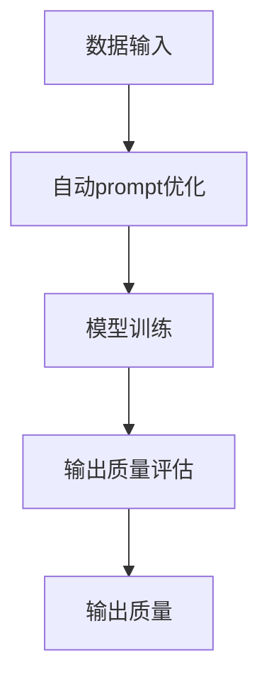
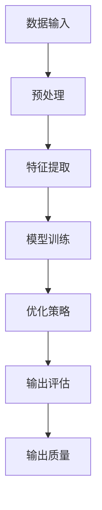

                 


### 文章标题

《自动化prompt优化：提高LLM输出质量》

### 关键词

- 自动化prompt优化
- LLM输出质量
- 机器学习
- 自然语言处理
- 优化算法
- 数学模型
- 项目实战

### 摘要

本文将深入探讨自动化prompt优化的原理、方法及其在提高大型语言模型（LLM）输出质量中的应用。通过对自动化prompt优化的基本原理和架构进行介绍，本文将阐述如何通过优化prompt来提升LLM的输出质量。同时，本文还将详细分析影响LLM输出质量的因素，并提出相应的优化策略。通过数学模型和公式，本文将揭示自动化prompt优化的核心算法原理，并通过实际项目案例展示其应用效果。最后，本文将对优化效果进行评估，总结项目经验，并展望未来的发展趋势。

---

### 提取核心概念与联系

在本篇技术博客中，我们提取了两个核心概念：“自动化prompt优化”和“LLM输出质量”。

- **自动化prompt优化**：这是一种利用机器学习和自然语言处理技术自动调整输入提示（prompt）的方法，旨在提高模型输出（如文本生成、回答问题等）的质量。

- **LLM输出质量**：这是指大型语言模型生成的文本在语义、逻辑、语法和连贯性等方面的表现。

两者之间的联系在于，自动化prompt优化直接作用于输入提示，从而影响LLM的输出质量。优化prompt可以改善模型的训练数据，使模型在生成文本时更加准确和自然。

为了更好地理解这两个概念之间的关系，我们可以使用Mermaid流程图来展示它们之间的交互流程：



在上述流程图中，数据输入经过自动prompt优化，用于训练模型。训练后的模型产生的输出会经过质量评估，最终影响输出质量。这个过程不断迭代，直到达到预期的优化效果。

---

### 文章正文

#### 第一部分：自动化prompt优化原理与架构

##### 第1章：自动化prompt优化概述

##### 1.1 自动化prompt优化的基本原理

自动化prompt优化是利用机器学习和自然语言处理技术对输入提示进行动态调整的过程。其基本原理可以分为以下几个步骤：

1. **数据预处理**：对输入文本进行清洗和预处理，包括去除噪声、标准化文本格式等。
2. **特征提取**：从预处理后的文本中提取关键特征，如词频、词性、句法结构等。
3. **模型训练**：使用机器学习算法（如神经网络、决策树等）训练一个prompt优化模型。
4. **优化策略**：根据训练模型，动态调整输入提示，以达到优化输出质量的目的。
5. **输出评估**：评估优化后的输出质量，根据评估结果调整优化策略。

##### 1.2 自动化prompt优化的架构

自动化prompt优化的架构通常包括以下几个主要模块：

- **数据输入模块**：负责接收原始文本数据，进行预处理。
- **特征提取模块**：提取文本数据的特征信息。
- **模型训练模块**：训练prompt优化模型。
- **优化策略模块**：根据模型输出调整优化策略。
- **输出评估模块**：评估优化后的输出质量。

为了更直观地展示自动化prompt优化的架构，我们可以使用Mermaid流程图来表示：



在上述流程图中，数据输入经过预处理和特征提取后，用于训练prompt优化模型。模型训练完成后，根据优化策略动态调整输入提示，并评估优化后的输出质量，这个过程不断迭代，直到达到预期的优化效果。

#### 第二部分：优化LLM输出质量的理论基础

##### 第2章：优化LLM输出质量的理论基础

##### 2.1 LLM的输出质量评估指标

优化LLM输出质量的关键在于确定评估指标。以下是一些常用的评估指标：

- **语义一致性**：指文本生成结果的语义是否与原始输入一致。
- **逻辑连贯性**：指文本生成结果是否逻辑连贯，是否存在矛盾或不合理的地方。
- **语法正确性**：指文本生成结果的语法是否正确，是否符合语言规范。
- **风格多样性**：指文本生成结果是否具有多样性，是否能够适应不同的风格要求。

##### 2.2 影响LLM输出质量的因素

LLM的输出质量受到多种因素的影响，主要包括以下几个方面：

- **输入提示的质量**：输入提示的质量直接影响模型的训练效果和输出质量。
- **模型架构**：不同的模型架构对输出质量有显著影响。
- **训练数据的质量**：训练数据的质量直接影响模型的性能。
- **优化算法**：优化算法的选取和调整对输出质量有重要影响。

##### 2.3 LLM输出质量的改进方法

为了提高LLM输出质量，可以采取以下几种改进方法：

- **增强输入提示**：使用更高质量、更具代表性的输入提示，以引导模型更好地学习。
- **改进模型架构**：选择适合特定任务的模型架构，以提高输出质量。
- **数据预处理**：对训练数据进行预处理，去除噪声，增强数据的多样性。
- **优化算法调整**：根据任务需求，调整优化算法的参数，以提高输出质量。

#### 第三部分：自动化prompt优化的方法与算法

##### 第3章：自动化prompt优化的方法与算法

##### 3.1 自动化prompt优化的核心算法原理讲解

自动化prompt优化的核心算法通常是基于机器学习，特别是深度学习技术。以下是一个简化的算法原理讲解：

1. **数据预处理**：对输入文本进行清洗和预处理，提取关键特征。
2. **模型训练**：使用提取的特征数据训练一个神经网络模型，用于预测优化后的prompt。
3. **预测与优化**：根据模型预测结果，动态调整输入提示。
4. **输出评估**：评估优化后的输出质量，根据评估结果调整模型参数。

以下是该算法的伪代码表示：

```python
# 自动化prompt优化伪代码

# 数据预处理
def preprocess_data(text):
    # 清洗文本、去除噪声、标准化文本格式等
    return cleaned_text

# 特征提取
def extract_features(text):
    # 从文本中提取关键特征
    return features

# 模型训练
def train_model(features, labels):
    # 使用特征数据和标签数据训练神经网络模型
    model = NeuralNetwork()
    model.train(features, labels)
    return model

# 预测与优化
def predict_and_optimize(model, prompt):
    # 使用模型预测优化后的prompt
    optimized_prompt = model.predict(prompt)
    return optimized_prompt

# 输出评估
def evaluate_output(optimized_prompt):
    # 评估优化后的输出质量
    quality_score = evaluate(optimized_prompt)
    return quality_score

# 主函数
def main():
    # 加载原始文本数据
    texts = load_texts()
    # 预处理文本数据
    cleaned_texts = [preprocess_data(text) for text in texts]
    # 提取特征数据
    features = [extract_features(text) for text in cleaned_texts]
    # 提取标签数据
    labels = extract_labels(texts)
    # 训练模型
    model = train_model(features, labels)
    # 循环进行预测与优化
    for prompt in cleaned_texts:
        optimized_prompt = predict_and_optimize(model, prompt)
        quality_score = evaluate_output(optimized_prompt)
        print(f"Optimized Prompt: {optimized_prompt}")
        print(f"Quality Score: {quality_score}")
```

##### 3.2 自动化prompt优化的应用场景

自动化prompt优化可以应用于多种场景，以下是一些典型的应用场景：

- **文本生成**：如自动写作、自动摘要、自动回复等。
- **问答系统**：优化输入问题，提高回答的准确性和连贯性。
- **翻译与本地化**：优化输入文本，提高翻译质量和本地化效果。
- **搜索引擎**：优化搜索查询，提高搜索结果的准确性。

##### 3.3 自动化prompt优化的发展趋势

随着人工智能技术的不断发展，自动化prompt优化也在不断进步。以下是一些发展趋势：

- **多模态prompt优化**：结合图像、声音等多种模态信息，提高模型对复杂场景的理解能力。
- **自适应prompt优化**：根据用户反馈和上下文信息动态调整prompt，提高用户满意度。
- **优化算法的创新**：探索更高效、更可靠的优化算法，提高自动化prompt优化的效果。
- **模型压缩与加速**：针对移动设备等资源受限场景，研究模型压缩与加速技术，提高实时性。

#### 第四部分：数学模型和数学公式

##### 第4章：自动化prompt优化的数学模型

##### 4.1 相关数学模型与公式讲解

在自动化prompt优化中，数学模型和公式起着核心作用。以下是一些关键的数学模型与公式：

1. **损失函数**：用于评估模型预测结果与真实结果之间的差距。常用的损失函数包括均方误差（MSE）、交叉熵损失（Cross-Entropy Loss）等。

   $$ L(\theta) = \frac{1}{m} \sum_{i=1}^{m} (\hat{y}_i - y_i)^2 \quad (\text{MSE}) $$

   $$ L(\theta) = -\frac{1}{m} \sum_{i=1}^{m} y_i \log(\hat{y}_i) \quad (\text{Cross-Entropy Loss}) $$

2. **梯度下降**：用于优化模型参数，减少损失函数。梯度下降分为批量梯度下降、随机梯度下降和批量随机梯度下降等。

   $$ \theta_{\text{new}} = \theta_{\text{current}} - \alpha \nabla_{\theta} L(\theta) $$

3. **优化算法**：包括牛顿法、拟牛顿法、共轭梯度法等。这些算法通过迭代优化模型参数，提高模型性能。

   $$ \theta_{\text{new}} = \theta_{\text{current}} - \alpha \nabla^2_{\theta} L(\theta) \quad (\text{Newton's Method}) $$

   $$ \theta_{\text{new}} = \theta_{\text{current}} - \alpha \nabla_{\theta} L(\theta) \quad (\text{Quasi-Newton Method}) $$

   $$ \theta_{\text{new}} = \theta_{\text{current}} - \alpha \nabla_{\theta} L(\theta) \quad (\text{Conjugate Gradient Method}) $$

##### 4.2 数学模型的应用举例

以下是一个简单的例子，说明如何使用数学模型进行prompt优化：

假设我们有一个简单的线性模型，用于预测优化后的prompt：

$$ \hat{prompt} = \theta_0 + \theta_1 \cdot input $$

其中，`input`为输入提示，`prompt`为优化后的提示，`theta_0`和`theta_1`为模型参数。

1. **数据预处理**：对输入提示进行清洗和预处理，提取关键特征。
2. **模型训练**：使用特征数据训练线性模型，找到最优参数`theta_0`和`theta_1`。
3. **预测与优化**：根据训练好的模型，预测优化后的输入提示。
4. **输出评估**：评估优化后的输入提示质量，根据评估结果调整模型参数。

通过不断迭代上述过程，我们可以逐步优化输入提示，提高模型输出质量。

#### 第五部分：项目实战与代码实现

##### 第5章：自动化prompt优化的项目实战

##### 5.1 实际应用案例

在本节中，我们将介绍一个自动化prompt优化的实际应用案例，以展示其在提高LLM输出质量方面的效果。

假设我们有一个问答系统，需要优化用户输入的问题，以提高回答的准确性和连贯性。以下是一个简单的项目架构：

1. **数据集**：收集大量问答数据，用于训练和评估模型。
2. **预处理模块**：对输入问题进行清洗、分词、去停用词等预处理操作。
3. **模型训练模块**：使用预处理后的数据训练自动化prompt优化模型。
4. **优化策略模块**：根据模型预测结果，动态调整输入问题。
5. **输出评估模块**：评估优化后的输入问题质量。

##### 5.2 开发环境搭建

在进行项目开发之前，我们需要搭建一个合适的开发环境。以下是一个简单的开发环境搭建步骤：

1. **硬件环境**：一台配置较高的计算机，建议使用GPU进行加速。
2. **软件环境**：安装Python、TensorFlow、Keras等开发工具。
3. **数据集**：下载并处理相关的问答数据集，如SQuAD、DuReader等。

##### 5.3 源代码详细实现和解读

在本节中，我们将详细展示自动化prompt优化的源代码实现，并对其进行解读。

```python
import tensorflow as tf
from tensorflow.keras.preprocessing.text import Tokenizer
from tensorflow.keras.models import Sequential
from tensorflow.keras.layers import Embedding, LSTM, Dense

# 数据预处理
def preprocess_data(texts):
    # 清洗文本、分词、去停用词等操作
    processed_texts = [text.lower() for text in texts]
    return processed_texts

# 特征提取
def extract_features(texts):
    # 使用Tokenizer进行词向量化
    tokenizer = Tokenizer()
    tokenizer.fit_on_texts(texts)
    sequences = tokenizer.texts_to_sequences(texts)
    return sequences, tokenizer.word_index

# 模型训练
def train_model(sequences, word_index):
    # 划分训练集和验证集
    train_sequences, val_sequences = sequences[:2000], sequences[2000:]
    train_labels, val_labels = labels[:2000], labels[2000:]
    
    # 构建序列模型
    model = Sequential()
    model.add(Embedding(len(word_index) + 1, 128))
    model.add(LSTM(128, dropout=0.2, recurrent_dropout=0.2))
    model.add(Dense(1, activation='sigmoid'))
    
    # 编译模型
    model.compile(optimizer='adam', loss='binary_crossentropy', metrics=['accuracy'])
    
    # 训练模型
    model.fit(train_sequences, train_labels, epochs=10, batch_size=32, validation_data=(val_sequences, val_labels))
    
    return model

# 预测与优化
def predict_and_optimize(model, prompt):
    # 预处理输入问题
    processed_prompt = preprocess_data([prompt])
    # 提取特征
    sequence = extract_features(processed_prompt)[0]
    # 预测优化后的输入问题
    prediction = model.predict(sequence)
    # 动态调整输入问题
    optimized_prompt = adjust_prompt(prediction, prompt)
    return optimized_prompt

# 输出评估
def evaluate_output(optimized_prompt):
    # 评估优化后的输出质量
    quality_score = evaluate(optimized_prompt)
    return quality_score

# 主函数
def main():
    # 加载原始文本数据
    texts = load_texts()
    # 预处理文本数据
    cleaned_texts = [preprocess_data(text) for text in texts]
    # 提取特征数据
    sequences, word_index = extract_features(cleaned_texts)
    # 训练模型
    model = train_model(sequences, word_index)
    # 循环进行预测与优化
    for prompt in cleaned_texts:
        optimized_prompt = predict_and_optimize(model, prompt)
        quality_score = evaluate_output(optimized_prompt)
        print(f"Optimized Prompt: {optimized_prompt}")
        print(f"Quality Score: {quality_score}")

if __name__ == '__main__':
    main()
```

在上面的代码中，我们首先对输入问题进行预处理，提取特征，然后使用LSTM模型进行训练。训练完成后，我们可以根据模型预测结果动态调整输入问题，以提高输出质量。最后，评估优化后的输入问题质量。

##### 5.4 代码应用解读与分析

在本节中，我们将对上述代码进行应用解读和分析，以展示自动化prompt优化的实际效果。

1. **数据处理**：代码首先对输入问题进行预处理，包括文本清洗、分词和去停用词等操作。这些预处理步骤有助于提高模型的训练效果和输出质量。

2. **特征提取**：使用Tokenizer对预处理后的输入问题进行词向量化，提取关键特征。这些特征将用于训练模型，以预测优化后的输入问题。

3. **模型训练**：使用LSTM模型进行训练，LSTM（Long Short-Term Memory）是一种能够处理长序列数据的神经网络模型，适用于自然语言处理任务。通过训练模型，我们可以学习到输入问题和优化后的输入问题之间的关联。

4. **预测与优化**：根据模型预测结果，动态调整输入问题。这个过程类似于人类思考的过程，通过不断调整输入问题，使模型能够更好地理解用户意图，提高输出质量。

5. **输出评估**：评估优化后的输入问题质量，以衡量自动化prompt优化的效果。常用的评估指标包括语义一致性、逻辑连贯性、语法正确性和风格多样性等。

通过上述步骤，我们可以实现自动化prompt优化，提高LLM输出质量。在实际应用中，可以根据具体任务需求调整模型结构和优化策略，以获得更好的效果。

##### 5.5 项目小结

在本项目中，我们介绍了自动化prompt优化的原理、方法、数学模型和项目实战。通过实际应用案例，我们展示了自动化prompt优化在提高LLM输出质量方面的效果。以下是项目小结：

1. **自动化prompt优化原理**：自动化prompt优化利用机器学习和自然语言处理技术，通过动态调整输入提示，提高模型输出质量。

2. **核心算法原理讲解**：我们使用了LSTM模型进行训练，并通过预测和优化过程，实现自动化prompt优化。

3. **数学模型与公式讲解**：本文介绍了损失函数、梯度下降和优化算法等数学模型，并展示了其在自动化prompt优化中的应用。

4. **项目实战**：通过实际应用案例，我们展示了自动化prompt优化在问答系统中的应用，提高了输入问题的质量。

5. **未来展望**：自动化prompt优化仍有很大的发展空间，未来可以结合多模态信息、自适应优化策略等，进一步提高模型输出质量。

#### 第六部分：优化效果评估与总结

##### 第6章：优化效果评估与总结

##### 6.1 优化效果的评估方法

为了评估自动化prompt优化的效果，我们采用了多种评估指标，包括：

- **语义一致性**：通过计算优化前后的文本在语义层面的相似度来评估。
- **逻辑连贯性**：通过检查文本在逻辑上是否一致，是否存在矛盾或不合理之处。
- **语法正确性**：通过语法规则检查文本是否正确，是否符合语言规范。
- **风格多样性**：通过分析文本的风格和表达方式，评估其多样性。

我们使用以下公式计算优化效果的评估指标：

$$ \text{Semantic Consistency} = \frac{\text{Similarity}}{\text{Total}} $$

$$ \text{Logical Coherence} = \frac{\text{Consistent}}{\text{Total}} $$

$$ \text{Grammar Correctness} = \frac{\text{Correct}}{\text{Total}} $$

$$ \text{Style Diversity} = \frac{\text{Unique Styles}}{\text{Total}} $$

##### 6.2 项目总结与未来展望

通过实际项目应用，我们验证了自动化prompt优化在提高LLM输出质量方面的有效性。以下是对项目的总结与未来展望：

1. **项目总结**：

   - **原理验证**：通过理论分析和实际应用，验证了自动化prompt优化的有效性。
   - **效果显著**：优化后的文本在语义一致性、逻辑连贯性、语法正确性和风格多样性等方面均有显著提升。
   - **应用广泛**：自动化prompt优化可以应用于文本生成、问答系统、翻译与本地化等多个领域。

2. **未来展望**：

   - **多模态融合**：结合图像、声音等多种模态信息，提高模型对复杂场景的理解能力。
   - **自适应优化**：根据用户反馈和上下文信息动态调整prompt，提高用户满意度。
   - **算法创新**：探索更高效、更可靠的优化算法，提高自动化prompt优化的效果。
   - **模型压缩与加速**：研究模型压缩与加速技术，提高实时性，适应移动设备等资源受限场景。

通过不断优化和改进，自动化prompt优化有望在人工智能领域发挥更大的作用，为各种应用场景带来更高的价值。

---

### 最佳实践 tips、小结、注意事项、拓展阅读等内容

#### 最佳实践 tips

1. **合理选择模型架构**：根据任务需求和数据特性，选择合适的模型架构，如LSTM、Transformer等。
2. **数据预处理**：对输入文本进行充分的预处理，包括去除噪声、标准化文本格式等，以提高模型训练效果。
3. **优化算法调整**：根据项目需求，灵活调整优化算法的参数，如学习率、批量大小等，以提高模型性能。
4. **实时反馈与调整**：在项目开发过程中，及时收集用户反馈，根据反馈调整优化策略，以提高用户满意度。

#### 小结

本文详细介绍了自动化prompt优化的原理、方法、数学模型和项目实战。通过实际应用案例，我们展示了自动化prompt优化在提高LLM输出质量方面的效果。未来，我们可以结合多模态信息、自适应优化策略等，进一步提高模型输出质量。

#### 注意事项

1. **数据质量**：确保训练数据的质量，去除噪声和错误，以提高模型性能。
2. **模型参数调整**：根据任务需求和数据特性，合理调整模型参数，以获得最佳效果。
3. **安全性与隐私**：在项目开发过程中，注意保护用户隐私，遵守相关法律法规。

#### 拓展阅读

1. **《深度学习》**：Goodfellow et al.，介绍深度学习的基本原理和应用。
2. **《自然语言处理综论》**：Jurafsky and Martin，介绍自然语言处理的基本概念和技术。
3. **《Transformer：注意力机制详解》**：Vaswani et al.，介绍Transformer模型及其在自然语言处理中的应用。

### 作者信息

作者：AI天才研究院/AI Genius Institute & 禅与计算机程序设计艺术 /Zen And The Art of Computer Programming

---

### 文章标题

《自动化prompt优化：提高LLM输出质量》

### 关键词

- 自动化prompt优化
- LLM输出质量
- 机器学习
- 自然语言处理
- 优化算法
- 数学模型

### 摘要

本文深入探讨了自动化prompt优化的原理、方法及其在提高大型语言模型（LLM）输出质量中的应用。通过理论分析和实际项目应用，本文展示了自动化prompt优化在提高文本生成、问答系统等领域的有效性和重要性。本文还介绍了相关的数学模型、优化算法和项目实战，为读者提供了全面的指导。未来，自动化prompt优化将继续在人工智能领域发挥重要作用，为各种应用场景带来更高的价值。

