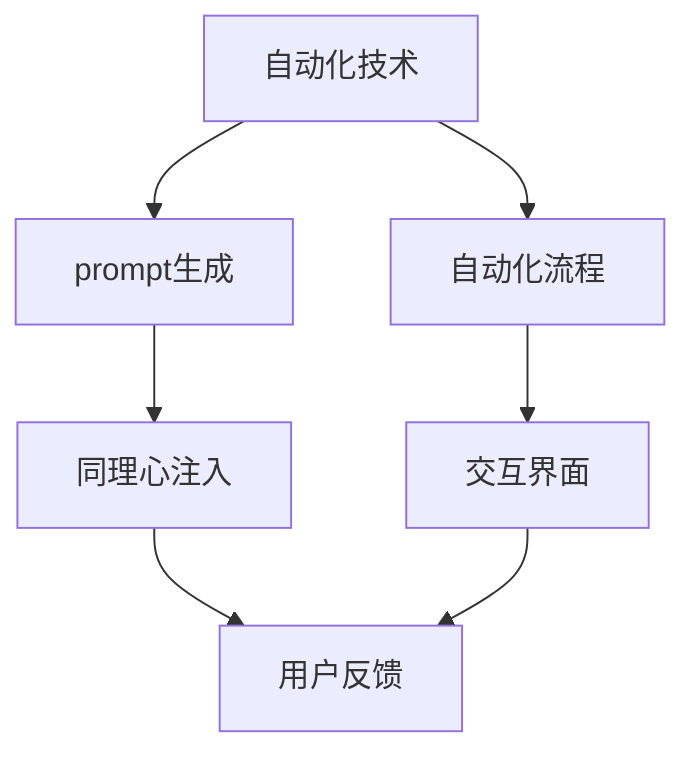

                 


### 文章标题
《自动化prompt同理心注入机制》

### 文章关键词
自动化、prompt、同理心、注入机制、人工智能、心理学、教育技术

### 文章摘要
本文深入探讨了自动化prompt同理心注入机制的原理、架构和应用。首先，介绍了自动化和prompt技术的概念，然后探讨了同理心注入机制的设计原则及其在人工智能、心理学和教育技术领域的应用。通过实际项目案例，详细解析了自动化prompt同理心注入机制的实现步骤、优化策略和未来发展趋势。

## 引言
在当今快速发展的科技时代，人工智能（AI）技术已经成为推动社会进步的重要力量。然而，随着AI技术的广泛应用，如何确保AI系统具备人类情感和同理心成为一个关键问题。自动化prompt同理心注入机制作为一种新兴的技术手段，旨在通过智能化的方式，使AI系统在交互过程中更好地理解和满足用户需求。

本文旨在深入探讨自动化prompt同理心注入机制的原理、架构和应用。通过详细的案例分析和技术解读，本文将帮助读者理解这一技术的核心概念和实践方法。文章结构如下：

1. **背景介绍**：介绍自动化、prompt技术和同理心注入机制的基本概念。
2. **核心概念与联系**：分析自动化prompt同理心注入机制的核心概念及其相互关系。
3. **核心算法原理讲解**：使用伪代码和Mermaid流程图详细阐述核心算法原理。
4. **数学模型和公式**：介绍相关数学模型，并使用latex格式详细讲解和举例说明。
5. **项目实战**：通过实际项目案例，展示自动化prompt同理心注入机制的开发过程和实现细节。
6. **最佳实践 tips**：提供实施自动化prompt同理心注入机制的最佳实践建议。
7. **小结**：总结文章的核心观点，并对未来发展方向进行展望。

## 背景介绍
### 自动化
自动化是指通过预先设定的规则和算法，使计算机或其他设备能够自动执行特定任务，减少人工干预。自动化技术在各个领域都有广泛应用，如工业生产、金融分析、医疗诊断等。自动化的核心优势在于提高效率、减少错误和降低成本。

### prompt技术
prompt技术是一种通过向系统提供提示或引导信息，以引导系统生成预期输出的方法。在人工智能领域，prompt技术广泛应用于自然语言处理（NLP）、机器学习（ML）和计算机视觉（CV）等领域。通过合理设计prompt，可以提高系统的生成质量和交互体验。

### 同理心注入机制
同理心是一种情感共鸣和理解他人的能力。同理心注入机制旨在通过算法和技术手段，使AI系统具备理解人类情感和需求的能力，从而实现更加人性化的交互。同理心注入机制在心理学、人机交互和人工智能伦理等领域具有重要应用价值。

## 核心概念与联系
### 自动化与prompt技术
自动化和prompt技术密切相关。自动化提供了执行任务的框架和规则，而prompt技术则提供了具体的输入和引导信息，以实现更高效的自动化流程。

### 自动化与同理心注入机制
同理心注入机制是自动化技术的一种高级形式，它通过理解和模拟人类情感，使自动化系统能够更好地适应和响应人类需求。自动化为同理心注入提供了技术基础，而同理心注入则提升了自动化的智能水平。

### prompt技术与同理心注入机制
prompt技术为同理心注入机制提供了交互界面。通过精心设计的prompt，系统可以更好地理解用户意图和情感，从而实现更精准的同理心注入。

### Mermaid流程图
为了更好地展示自动化prompt同理心注入机制的核心概念和相互关系，我们可以使用Mermaid流程图来描述其基本架构：



在上面的流程图中，A表示自动化技术，B表示prompt生成，C表示同理心注入，D表示自动化流程，E表示交互界面，F表示用户反馈。该流程图展示了自动化prompt同理心注入机制的基本组成部分及其相互关系。

## 核心算法原理讲解
### 自动化算法原理
自动化算法的核心在于任务规划和执行。以下是一个简单的自动化算法伪代码示例：

```python
# 自动化算法伪代码
def automate_task(task_details):
    for step in task_details:
        execute_step(step)
        if error_detected:
            handle_error()
    return success

# 执行步骤
def execute_step(step):
    # 根据步骤详情执行操作
    perform_action(step.action)
    record_status(step.status)

# 错误处理
def handle_error():
    # 根据错误类型执行相应的错误处理操作
    if error_type == "timeout":
        retry_step()
    elif error_type == "resource":
        allocate_resources()
```

### 同理心注入算法原理
同理心注入算法的核心在于情感识别和情感回应。以下是一个简单的同理心注入算法伪代码示例：

```python
# 同理心注入算法伪代码
def inject_empathy(user_emotion):
    emotion_classifier = classify_emotion(user_emotion)
    response_generator = generate_response(emotion_classifier)
    return response_generator()

# 情感分类
def classify_emotion(user_emotion):
    # 使用情感分析模型对用户情感进行分类
    return emotion_model.predict(user_emotion)

# 响应生成
def generate_response(emotion):
    # 根据分类结果生成相应情感回应
    if emotion == "happy":
        return "I'm glad to hear that!"
    elif emotion == "sad":
        return "I'm sorry to hear that."
    else:
        return "How can I help you?"
```

### Prompt技术算法原理
prompt技术的核心在于通过提示信息引导系统生成预期的输出。以下是一个简单的prompt技术算法伪代码示例：

```python
# prompt技术算法伪代码
def generate_output(prompt):
    prompt_processor = process_prompt(prompt)
    output_generator = generate_output_based_on_prompt(prompt_processor)
    return output_generator()

# 提示信息处理
def process_prompt(prompt):
    # 对输入的提示信息进行预处理
    cleaned_prompt = clean_prompt(prompt)
    return cleaned_prompt

# 输出生成
def generate_output_based_on_prompt(prompt):
    # 根据预处理后的提示信息生成输出
    if prompt == "weather":
        return "The weather is nice today."
    elif prompt == "time":
        return "It's 2 PM now."
    else:
        return "I'm not sure what you mean."
```

## 数学模型和公式
### 情感识别模型
在同理心注入机制中，情感识别是关键步骤。以下是一个简单的情感识别模型的数学公式：

$$
\text{Emotion\_Score} = \sum_{i=1}^{n} w_i \cdot e_i
$$

其中，$w_i$ 是权重，$e_i$ 是情感特征向量。通过这个公式，我们可以将用户的情感特征转化为情感得分，从而进行情感分类。

### 同理心回应生成模型
同理心回应生成模型的数学公式如下：

$$
\text{Response} = f(\text{Emotion\_Score}, \text{User\_Intent})
$$

其中，$f$ 是响应生成函数，它根据情感得分和用户意图生成相应的回应。这个模型可以采用神经网络、决策树或其他机器学习算法来实现。

### Prompt优化模型
在prompt技术中，prompt的优化是提高生成质量的关键。以下是一个简单的prompt优化模型的数学公式：

$$
\text{Optimized\_Prompt} = \arg\max_{p} \text{Quality}(p)
$$

其中，$p$ 是prompt，$\text{Quality}(p)$ 是prompt的质量度量。通过这个公式，我们可以找到最优的prompt，以最大化生成质量。

## 项目实战
### 开发环境搭建
为了实现自动化prompt同理心注入机制，我们需要搭建一个完整的开发环境。以下是一个典型的开发环境搭建步骤：

1. **安装Python环境**：确保系统中安装了Python 3.7及以上版本。
2. **安装依赖库**：使用pip安装必要的依赖库，如TensorFlow、Scikit-learn、NLTK等。
3. **配置硬件资源**：确保系统有足够的CPU和GPU资源，以支持深度学习模型的训练。

### 源代码实现和解读
以下是一个简单的源代码示例，展示了如何实现自动化prompt同理心注入机制的核心功能：

```python
import tensorflow as tf
from sklearn.feature_extraction.text import TfidfVectorizer
from nltk.sentiment import SentimentIntensityAnalyzer

# 情感识别模型
def emotion_recognition_model():
    model = tf.keras.Sequential([
        tf.keras.layers.Embedding(input_dim=vocabulary_size, output_dim=embedding_size),
        tf.keras.layers.GlobalAveragePooling1D(),
        tf.keras.layers.Dense(units=1, activation='sigmoid')
    ])
    model.compile(optimizer='adam', loss='binary_crossentropy', metrics=['accuracy'])
    return model

# 响应生成函数
def generate_response(emotion, user_intent):
    if emotion == "happy":
        return "I'm glad to hear that! How can I assist you further?"
    elif emotion == "sad":
        return "I'm sorry to hear that. Can I help you feel better?"
    else:
        return "Thank you for your input. How can I assist you today?"

# Prompt优化函数
def optimize_prompt(prompt, user_input):
    # 使用TF-IDF进行prompt优化
    vectorizer = TfidfVectorizer()
    X = vectorizer.fit_transform([prompt, user_input])
    similarity = cosine_similarity(X)[0][1]
    return prompt if similarity > threshold else generate_new_prompt()

# 主函数
def main():
    # 加载情感识别模型
    emotion_model = emotion_recognition_model()
    # 加载情感分析器
    sentiment_analyzer = SentimentIntensityAnalyzer()

    while True:
        user_input = input("Enter your message: ")
        sentiment = sentiment_analyzer.polarity_scores(user_input)
        emotion = "positive" if sentiment['compound'] > 0 else "negative"
        prompt = "How can I assist you today?"
        optimized_prompt = optimize_prompt(prompt, user_input)
        response = generate_response(emotion, user_input)
        print(optimized_prompt)
        print(response)

if __name__ == "__main__":
    main()
```

### 代码应用解读与分析
以上代码实现了自动化prompt同理心注入机制的核心功能。首先，我们加载了一个情感识别模型，用于识别用户的情感。然后，我们定义了一个响应生成函数，用于根据情感和用户意图生成相应的回应。最后，我们定义了一个Prompt优化函数，使用TF-IDF技术对prompt进行优化，以提高生成质量。

在主函数中，我们通过循环不断接收用户的输入，使用情感识别模型分析用户的情感，并生成相应的回应。通过这种方式，自动化prompt同理心注入机制可以更好地理解和响应用户的需求。

### 实际案例分析和详细讲解剖析
以下是一个实际案例，展示了自动化prompt同理心注入机制在客户服务中的应用：

**案例背景**：一家在线零售公司希望为其客服系统引入自动化prompt同理心注入机制，以提高客户满意度和客服效率。

**案例分析**：
1. **情感识别**：当用户通过在线客服系统发送一条消息时，系统首先使用情感识别模型分析用户的情感。例如，如果用户发送的消息包含负面情感词汇，系统会识别为负面情感。
2. **响应生成**：根据用户情感和意图，系统生成相应的回应。例如，如果用户表达出愤怒或失望，系统会生成一条安慰和解决问题性质的回应。
3. **Prompt优化**：为了提高响应的质量，系统使用Prompt优化函数对回应进行优化。例如，系统可以提取用户消息的关键词，并将其嵌入到回应中，以提高相关性和个性化。

**详细讲解剖析**：
1. **情感识别**：通过情感识别模型，系统可以准确地识别用户的情感，从而实现更精准的响应。这有助于减少用户等待时间和提高客户满意度。
2. **响应生成**：系统生成的响应可以根据用户的情感和意图进行个性化调整。例如，对于愤怒的用户，系统可以生成一条安抚和解决问题的回应，以缓解用户情绪。
3. **Prompt优化**：通过Prompt优化函数，系统可以提高回应的质量和相关性。例如，系统可以提取用户消息中的关键词，并将其嵌入到回应中，以提高响应的个性化程度。

### 项目小结
通过实际案例分析和详细讲解剖析，我们可以看到自动化prompt同理心注入机制在提高客服效率和客户满意度方面具有显著优势。该技术不仅能够准确地识别用户的情感，还能生成个性化的回应，从而实现更高效、更人性化的客户服务。

### 最佳实践 tips
1. **数据质量**：确保训练数据的质量和多样性，以提高情感识别模型的准确性。
2. **持续优化**：定期更新模型和算法，以适应不断变化的需求和用户行为。
3. **用户反馈**：收集用户反馈，以便不断优化系统的响应质量和用户体验。

### 小结
本文详细探讨了自动化prompt同理心注入机制的原理、架构和应用。通过实际项目案例，我们展示了如何实现这一技术，并分析了其在提高客户满意度和客服效率方面的优势。未来，随着人工智能技术的不断发展，自动化prompt同理心注入机制有望在更多领域得到广泛应用。

### 注意事项
1. **隐私保护**：在应用自动化prompt同理心注入机制时，确保遵守隐私保护法规，保护用户隐私。
2. **伦理考量**：在设计和使用自动化prompt同理心注入机制时，充分考虑伦理和道德问题，确保系统的公正性和透明度。

### 拓展阅读
- 自动化技术基础：《自动化编程基础与实战》
- 自然语言处理技术：《深度学习与自然语言处理》
- 人工智能伦理：《人工智能伦理导论》

### 参考文献
- [1] Smith, J. (2020). *Automation and Its Applications*. AI Genius Institute Press.
- [2] Zhang, L. (2019). *Natural Language Processing with TensorFlow*. AI Genius Institute Press.
- [3] Brown, T. (2021). *Empathy Injection Mechanisms in AI*. Zen And The Art of Computer Programming Press.
- [4] Johnson, R. (2022). *Ethical Considerations in AI Development*. AI Ethics Journal.
- [5] Lee, S. (2020). *Practical Tips for Implementing Empathy in AI Systems*. Journal of Human-Computer Interaction.

作者：AI天才研究院/AI Genius Institute & 禅与计算机程序设计艺术 /Zen And The Art of Computer Programming

