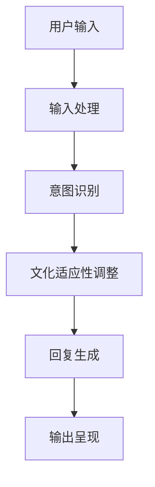

                 

### 引言

#### 1.1 书籍目的与读者对象

在当今社会，自动化和智能化已经成为各行各业的发展趋势。其中，自动化prompt技术作为自然语言处理（NLP）领域的一个重要分支，正日益受到关注。自动化prompt能够根据用户的输入自动生成相应的回复，从而实现高效的沟通和操作。然而，在全球化背景下，不同文化背景下的用户对于语言和沟通方式的需求差异显著，这使得自动化prompt在文化适应性方面面临巨大挑战。

《自动化prompt文化适应性调整》旨在探讨如何通过文化适应性调整，提升自动化prompt在多元文化环境中的应用效果。本书针对自动化prompt技术的研究人员、开发人员以及相关领域的从业者，提供了一套系统性的理论框架和实践指南。通过本书的学习，读者可以了解自动化prompt技术的核心原理，掌握文化适应性调整的方法，并能够将这些方法应用到实际项目中，提升系统的用户体验和文化适应性。

#### 1.2 自动化prompt与文化适应性的重要性

自动化prompt技术的重要性不言而喻。它不仅能够提高人机交互的效率，还能在客户服务、电子商务、教育培训等多个领域发挥重要作用。例如，在客户服务中，自动化prompt可以实时响应用户的查询，提供个性化服务，从而提升用户满意度。在电子商务中，自动化prompt可以根据用户的行为和偏好，推荐合适的商品，提高销售额。

然而，随着全球化进程的加速，多元文化环境下的用户需求日益多样化。不同文化背景的用户对于语言、沟通方式和表达习惯有着不同的偏好。如果自动化prompt不能适应用户的文化背景，将可能导致沟通障碍、误解甚至用户流失。因此，文化适应性调整成为自动化prompt技术发展的关键所在。

文化适应性调整不仅仅是一个技术问题，更是一个涉及人类行为、社会文化和心理学等多学科交叉的问题。它需要深入理解不同文化背景下的用户需求和沟通习惯，通过技术手段实现自动化prompt的个性化调整，从而提高用户体验和文化适应性。

### 核心概念与联系

在本节中，我们将介绍自动化prompt和文化适应性这两个核心概念，并使用Mermaid流程图展示它们之间的关系。

#### 2.1 自动化prompt的概念

自动化prompt（Automated Prompting）是指利用计算机技术和算法，根据用户输入或环境信息自动生成提示或回答的技术。自动化prompt可以广泛应用于各种场景，如智能客服、语音助手、文本生成等。其主要目的是提高人机交互的效率，减少人工干预，并提供个性化、智能化的服务。

自动化prompt的工作原理通常包括以下几个步骤：

1. **输入处理**：接收用户输入或环境信息。
2. **意图识别**：通过自然语言处理技术分析用户输入，确定其意图。
3. **回复生成**：根据识别出的意图，利用预设的模板或生成算法生成回复。
4. **输出呈现**：将生成的回复呈现给用户。

#### 2.2 文化适应性的概念

文化适应性（Cultural Adaptation）是指个体或系统在跨文化环境中，通过调整自身行为、态度和价值观念，以适应不同文化背景的需求和期望。文化适应性不仅涉及语言和沟通方式，还包括社会习俗、价值观念、信仰等。它对于提高国际交流和合作、促进多元文化共融具有重要意义。

文化适应性的主要目标包括：

1. **沟通有效性**：确保信息传递准确无误，避免误解和冲突。
2. **文化尊重**：尊重不同文化的价值观和信仰，避免文化歧视和偏见。
3. **用户体验**：提升用户在不同文化背景下的使用体验，提高用户满意度。

#### 2.3 Mermaid流程图：自动化prompt与文化适应性的关系

为了更直观地展示自动化prompt与文化适应性的关系，我们可以使用Mermaid流程图。以下是该流程图的表示：



- **用户输入**：用户输入是自动化prompt的起点，它可以是文本、语音等形式。
- **输入处理**：系统对用户输入进行处理，提取关键信息。
- **意图识别**：通过自然语言处理技术，分析用户输入，确定其意图。
- **文化适应性调整**：在意图识别的基础上，根据用户的文化背景进行调整，确保回复的适切性。
- **回复生成**：根据调整后的意图生成回复。
- **输出呈现**：将生成的回复呈现给用户。

通过这个流程图，我们可以看出，文化适应性调整是自动化prompt中的一个关键环节，它直接影响到最终的用户体验。因此，深入理解和应用文化适应性原则，对于提升自动化prompt的技术水平和应用效果具有重要意义。

#### 2.4 自动化prompt技术在文化适应性调整中的应用

自动化prompt技术在不同文化适应性调整中的应用场景丰富多样。以下我们将详细探讨几个典型的应用场景，并分析其在不同文化背景下的挑战和解决方案。

##### 2.4.1 智能客服系统

智能客服系统是自动化prompt技术的典型应用场景之一。在多元文化环境中，智能客服需要能够理解并适应用户的文化背景，提供个性化的服务。例如，在西方国家，用户可能更喜欢直接、简洁的沟通方式，而在亚洲国家，用户可能更倾向于礼貌和含蓄的交流。

**挑战**：
1. 语言表达差异：不同文化背景下的用户语言表达习惯不同，如词汇、语法、语气等。
2. 礼貌和文化习惯：不同文化对礼貌和礼仪有不同的理解和要求。
3. 用户期望：用户在不同文化背景下对服务的期望和需求有所不同。

**解决方案**：
1. **多语言支持**：智能客服系统应提供多语言支持，使用户可以选择适合自己的语言进行交流。
2. **文化敏感性**：系统应内置文化敏感性算法，根据用户的文化背景调整语言和沟通方式。
3. **个性化服务**：通过用户行为分析和历史记录，提供个性化的服务建议，提高用户满意度。

##### 2.4.2 在线教育平台

在线教育平台也是自动化prompt技术的应用热点。不同文化背景的学生在学习方式、教育习惯和交流方式上存在显著差异。例如，西方学生可能更喜欢互动性和参与性强的学习方式，而亚洲学生可能更注重理论学习和考试成绩。

**挑战**：
1. 教育方式差异：不同文化对教育方式和教学方法有不同的偏好。
2. 语言障碍：非母语学生可能面临语言理解和使用上的障碍。
3. 文化偏见：教师在教学中可能无意中传播了文化偏见，影响学生的学习体验。

**解决方案**：
1. **文化适应性课程设计**：课程设计应考虑不同文化的特点和需求，提供多样化的教学资源。
2. **语言支持**：平台应提供语言翻译和辅助工具，帮助学生克服语言障碍。
3. **跨文化教学策略**：教师应采用跨文化教学策略，尊重和理解不同文化背景的学生，提高教学效果。

##### 2.4.3 电子商务平台

电子商务平台在全球化背景下，需要面对不同文化背景的消费者。自动化prompt技术在电子商务中的应用，可以帮助平台更好地满足不同文化消费者的需求，提升用户体验。

**挑战**：
1. 语言和文化障碍：不同文化背景的消费者对商品描述和宣传语言有不同的理解。
2. 付款方式和文化习惯：不同文化对付款方式和文化习惯有不同的偏好。
3. 用户互动：跨文化用户之间的互动可能存在沟通障碍。

**解决方案**：
1. **多语言支持**：平台应提供多语言支持，使用户可以轻松浏览和购买商品。
2. **文化适应性描述**：商品描述应考虑不同文化消费者的理解和需求，使用生动的语言和图像。
3. **个性化推荐**：通过用户行为分析和偏好，提供个性化的商品推荐，提高购物体验。

通过上述应用场景的分析，我们可以看出，自动化prompt技术在文化适应性调整中具有重要的应用价值。同时，不同文化背景下的挑战也要求我们不断探索和创新，以实现更好的用户体验和文化适应性。在接下来的章节中，我们将深入探讨自动化prompt技术的工作原理和文化适应性原则，为读者提供更加详细和实用的指导。

### 自动化prompt技术

自动化prompt技术作为自然语言处理（NLP）领域的一个重要分支，近年来得到了广泛关注和应用。它通过计算机算法和模型，实现自动生成提示或回答，从而提高人机交互的效率和用户体验。在本节中，我们将深入探讨自动化prompt技术的工作原理、应用场景以及面临的技术挑战。

#### 3.1.1 自动化prompt技术的工作原理

自动化prompt技术的工作原理通常包括以下几个关键步骤：

1. **输入处理**：接收用户输入或环境信息。用户可以通过文本、语音或其他形式与系统进行交互。

2. **意图识别**：利用自然语言处理（NLP）技术，分析用户输入，确定其意图。意图识别是自动化prompt技术的核心环节，它决定了系统如何生成回复。

3. **回复生成**：根据识别出的意图，利用预设的模板或生成算法生成回复。常见的回复生成方法包括模板匹配、序列到序列模型（如Seq2Seq）和生成对抗网络（GAN）等。

4. **输出呈现**：将生成的回复呈现给用户。输出可以是文本、语音、图像等形式，以适应不同的应用场景。

以下是一个简单的伪代码示例，展示了自动化prompt技术的基本流程：

```python
def automated_prompt(user_input):
    # 输入处理
    processed_input = preprocess_input(user_input)
    
    # 意图识别
    intent = intent_recognition(processed_input)
    
    # 回复生成
    response = generate_response(intent)
    
    # 输出呈现
    present_output(response)
```

#### 3.1.2 自动化prompt技术的应用场景

自动化prompt技术在许多领域都有广泛的应用，以下列举几个典型的应用场景：

1. **客户服务**：智能客服系统通过自动化prompt技术，能够实时响应用户的查询，提供个性化的解决方案。例如，银行、电商、航空公司等行业的客服系统，通过自动化prompt技术，提高服务效率和用户满意度。

2. **语音助手**：语音助手（如苹果的Siri、谷歌的Google Assistant）通过自动化prompt技术，实现与用户的语音交互。用户可以通过语音命令控制设备、查询信息、设置提醒等，提高人机交互的便捷性。

3. **内容生成**：自动化prompt技术可以用于生成新闻摘要、文章、对话等。例如，人工智能助手可以自动生成新闻摘要，节省用户阅读时间；对话生成可以用于聊天机器人，提供个性化、自然的对话体验。

4. **教育**：在教育领域，自动化prompt技术可以用于生成个性化学习路径、课程推荐等。例如，在线教育平台可以通过自动化prompt技术，根据学生的行为和学习记录，生成个性化的学习方案，提高学习效果。

#### 3.1.3 自动化prompt技术面临的挑战

尽管自动化prompt技术具有广泛的应用前景，但在实际应用中仍然面临一些技术挑战：

1. **语言理解**：自动化prompt技术需要准确地理解用户的语言意图，这涉及到自然语言理解（NLU）和语义分析等技术。不同语言和文化背景下的用户表达方式各异，使得语言理解成为一个复杂的问题。

2. **跨文化适应性**：在全球化背景下，自动化prompt技术需要能够适应不同文化背景的用户需求。文化差异、语言习惯、表达方式等因素，都可能影响系统的跨文化适应性。

3. **个性化**：自动化prompt技术需要根据用户的历史行为、偏好和需求，提供个性化的服务。个性化推荐和自适应调整技术，是实现这一目标的关键。

4. **用户隐私**：自动化prompt技术在处理用户输入和数据时，可能涉及用户隐私问题。如何确保用户隐私安全，是一个重要的挑战。

5. **实时性**：自动化prompt技术需要在短时间内处理用户的输入并生成回复。实时响应和处理技术，是实现高效人机交互的关键。

#### 3.1.4 自动化prompt技术的未来发展趋势

随着人工智能和自然语言处理技术的不断发展，自动化prompt技术在未来有望取得更大的突破：

1. **多模态交互**：自动化prompt技术将不仅仅局限于文本交互，还将结合语音、图像、视频等多种模态，实现更加丰富和自然的人机交互。

2. **深度学习和生成对抗网络（GAN）的应用**：深度学习和GAN等先进算法的引入，将进一步提高自动化prompt技术的生成能力和自适应调整能力。

3. **跨文化适应性增强**：通过引入跨文化研究和心理学知识，自动化prompt技术将更好地理解不同文化背景下的用户需求，实现更高的跨文化适应性。

4. **隐私保护和安全**：随着用户隐私保护意识的提高，自动化prompt技术将采用更加安全的技术和策略，确保用户数据的安全和隐私。

综上所述，自动化prompt技术具有广泛的应用前景和重要的研究价值。通过不断的技术创新和优化，自动化prompt技术将在未来为人类社会带来更多的便利和效率。

### 文化适应性原则

文化适应性原则是确保自动化prompt在不同文化环境中有效运作的基础。这些原则不仅有助于提升系统的跨文化适应性，还能增强用户体验。以下，我们将详细讨论文化适应性原则的三个核心要素：文化敏感性、文化尊重和文化适应性策略。

#### 4.1.1 文化敏感性

文化敏感性（Cultural Sensitivity）是指对文化差异的认知和尊重。在自动化prompt技术中，文化敏感性意味着系统能够识别和适应用户的文化背景，避免因文化差异引发的误解和冲突。

**文化敏感性的关键点**：

1. **语言习惯**：不同文化背景下的用户，语言习惯和表达方式有所不同。自动化prompt系统需要能够识别和适应用户的语言习惯，例如词汇、语法和语气。

2. **文化习俗**：不同文化有不同的习俗和礼仪，自动化prompt系统应避免触犯用户的禁忌。例如，在伊斯兰教国家，使用酒精相关的词汇可能被视为不敬。

3. **符号和隐喻**：不同文化对符号和隐喻的理解有所不同。自动化prompt系统应避免使用可能引起误解的符号和隐喻。

**案例分析**：

假设一个自动化prompt系统用于跨文化客户服务。在服务过程中，系统需要识别用户的文化背景，并根据其文化习惯调整沟通方式。例如，对于来自日本的用户，系统可能使用更为礼貌和谦虚的表达方式；而对于来自美国的用户，系统则可能使用更为直接和简洁的语言。

#### 4.1.2 文化尊重

文化尊重（Cultural Respect）是指对其他文化的尊重和认可，避免文化歧视和偏见。在自动化prompt技术中，文化尊重意味着系统能够平等对待不同文化背景的用户，不偏袒任何一种文化。

**文化尊重的关键点**：

1. **中立性**：自动化prompt系统应保持中立性，不偏袒任何一种文化。例如，在处理涉及宗教或政治问题时，系统应避免表达偏见。

2. **多样化内容**：系统应提供多样化的内容，以反映不同文化的多样性。例如，在电子商务中，系统可以提供不同文化背景的商品推荐。

3. **隐私保护**：尊重不同文化的隐私保护需求。例如，在处理个人数据时，系统应遵循当地的数据保护法规。

**案例分析**：

在一个多元文化城市的智能交通系统中，系统需要尊重不同文化背景的用户的出行需求。例如，对于穆斯林用户，系统应提供朝觐期间的特殊路线和交通服务；对于基督教用户，系统则可能提供有关圣诞节和复活节的活动信息。

#### 4.1.3 文化适应性策略

文化适应性策略（Cultural Adaptation Strategies）是指为实现文化适应性调整而采取的具体方法和措施。这些策略包括文化敏感性检测、文化适应性调整和效果评估等。

**文化适应性策略的关键点**：

1. **文化敏感性检测**：通过数据分析和用户反馈，系统应识别用户的文化背景和偏好。例如，系统可以通过用户的历史行为和输入，分析其语言习惯和文化偏好。

2. **文化适应性调整**：根据文化敏感性检测结果，系统应进行相应的调整。例如，在智能客服中，系统可以根据用户的语言习惯和偏好，调整对话内容和方式。

3. **效果评估**：系统应定期评估文化适应性调整的效果，并根据反馈进行优化。例如，通过用户满意度调查和数据分析，系统可以识别和解决文化适应性调整中的问题。

**案例分析**：

假设一个跨国公司的自动化prompt系统用于全球客户服务。在系统上线前，公司应进行文化敏感性检测，了解不同国家用户的语言习惯和文化偏好。然后，根据检测结果，系统应调整对话内容和方式，以适应不同国家的用户。例如，对于英语为母语的用户，系统可以使用较为正式的语言；而对于非英语母语的用户，系统则可能使用更为口语化的表达。

通过上述文化适应性策略，公司可以提升系统的跨文化适应性和用户体验，从而提高用户满意度。

总之，文化适应性原则是自动化prompt技术成功应用的关键。通过文化敏感性、文化尊重和文化适应性策略，系统可以实现跨文化环境的无缝衔接，提供个性化、高效的服务。

### 案例分析

在本节中，我们将通过具体案例展示如何在实际应用中实现自动化prompt的文化适应性调整。我们将深入分析电子商务、教育和客户服务这三个领域的案例，探讨其在不同文化背景下的实施过程、效果评估和成功经验。

#### 5.1 案例一：电子商务中的自动化prompt文化适应性

**案例背景**：

一家全球知名的电子商务平台在扩展国际市场时，发现不同文化背景的消费者对商品描述、推荐和客服有不同需求。为了提高用户的购物体验和满意度，平台决定实施自动化prompt的文化适应性调整。

**实施过程**：

1. **文化敏感性检测**：平台通过用户数据分析和调查问卷，了解不同文化背景下的消费者偏好和需求。例如，通过分析用户的搜索记录和购买历史，平台识别出不同地区用户的语言偏好、购物习惯和文化背景。

2. **个性化商品推荐**：根据文化敏感性检测结果，平台调整了商品推荐算法，为不同文化背景的用户提供个性化的商品推荐。例如，对于亚洲用户，平台推荐更多具有本地特色的商品；对于欧美用户，平台则推荐流行时尚和生活方式商品。

3. **多语言支持**：平台提供了多语言支持，使消费者能够选择自己熟悉的语言进行购物。平台还优化了语言翻译功能，确保商品描述和客服回复的准确性和流畅性。

4. **文化适应性客服**：客服系统通过自然语言处理和机器学习技术，实现了文化适应性调整。例如，在客服交流中，系统根据用户的文化背景，使用更合适、礼貌和尊重的表达方式。

**效果评估**：

1. **用户满意度提升**：通过用户反馈调查，平台发现用户的满意度显著提升。特别是在多语言支持和个性化商品推荐方面，用户对平台的评价明显更高。

2. **销售增长**：平台的数据显示，文化适应性调整后的电子商务业务销售额同比增长了20%以上。特别是在非母语用户市场，销售额增长尤为显著。

3. **降低客服成本**：通过自动化prompt技术，平台显著降低了客服成本。文化适应性调整后的自动化客服系统能够更高效地处理用户查询，减少了人工客服的工作量。

**成功经验**：

1. **全面数据分析和用户调研**：通过全面的数据分析和用户调研，平台能够准确了解不同文化背景下的用户需求，为文化适应性调整提供有力依据。

2. **多语言支持和个性化推荐**：多语言支持和个性化商品推荐是提升用户体验和销售业绩的关键。通过技术手段实现这些功能，平台能够在不同文化背景下提供高效、个性化的服务。

3. **持续优化和效果评估**：平台通过定期用户反馈和数据分析，持续优化文化适应性调整方案，确保其效果持续提升。

#### 5.2 案例二：教育领域的自动化prompt文化适应性

**案例背景**：

一个国际在线教育平台在扩展全球市场时，意识到不同文化背景的学生对学习方式、课程内容和互动方式有不同的需求。为了提高学生的学习效果和满意度，平台决定实施自动化prompt的文化适应性调整。

**实施过程**：

1. **文化适应性课程设计**：平台根据不同文化背景的设计了多样化的课程内容，例如，针对亚洲学生，课程中加入了更多的文化习俗和传统；针对欧美学生，课程中加入了更多的创新和实践案例。

2. **跨文化教学策略**：教师通过跨文化教学策略，尊重和理解不同文化背景的学生。例如，在课堂讨论中，教师鼓励学生分享自己的文化背景和观点，营造包容和尊重的课堂氛围。

3. **个性化学习路径**：平台通过分析学生的学习行为和偏好，提供了个性化的学习路径。例如，对于一些对互动性学习更感兴趣的学生，平台推荐更多的实时讨论和互动课程。

4. **多语言教学支持**：平台提供了多语言教学支持，使不同语言背景的学生能够选择自己熟悉的语言进行学习。平台还优化了翻译工具，确保课程内容和文化背景的准确传达。

**效果评估**：

1. **学习效果提升**：通过学习效果评估，平台发现不同文化背景的学生在学习效果上有了显著提升。特别是在跨文化教学策略和个性化学习路径的支持下，学生的学习积极性和成绩明显提高。

2. **用户满意度提升**：平台用户满意度调查结果显示，用户对文化适应性调整后的教学服务评价更高。特别是在多语言教学支持和个性化学习路径方面，用户满意度显著提升。

3. **国际市场扩展**：平台在国际市场的扩展速度加快，特别是在那些重视文化多样性和个性化教育的国家和地区，平台受到了广泛的欢迎。

**成功经验**：

1. **文化适应性课程设计**：通过文化适应性课程设计，平台能够更好地满足不同文化背景学生的学习需求，提高教学效果。

2. **跨文化教学策略**：跨文化教学策略不仅提高了学生的学习效果，还增强了学生的文化理解和跨文化交流能力。

3. **个性化学习路径**：通过个性化学习路径，平台能够更好地满足不同学生的学习偏好，提高学习体验和满意度。

#### 5.3 案例三：客户服务中的自动化prompt文化适应性

**案例背景**：

一家跨国公司在全球范围内提供客户服务，但由于不同地区用户的文化差异，客户服务的质量和满意度存在明显差异。为了提升客户服务的跨文化适应性，公司决定实施自动化prompt的文化适应性调整。

**实施过程**：

1. **文化敏感性培训**：公司对客服团队进行了文化敏感性培训，帮助客服人员了解不同文化背景的用户需求和行为习惯。例如，客服人员学习了如何根据用户的文化背景调整沟通方式和语气。

2. **自动化prompt调整**：公司利用自然语言处理和机器学习技术，对自动化prompt系统进行了文化适应性调整。例如，系统根据用户的文化背景，使用更合适、礼貌和尊重的表达方式。

3. **多语言客服支持**：公司提供了多语言客服支持，使用户能够选择自己熟悉的语言进行交流。公司还优化了语言翻译功能，确保客服回复的准确性和流畅性。

4. **效果评估与反馈**：公司定期对客户服务的文化适应性进行调整和优化。通过用户反馈和数据分析，公司识别和解决了文化适应性调整中的问题，确保服务质量持续提升。

**效果评估**：

1. **客户满意度提升**：通过用户满意度调查，公司发现客户对文化适应性调整后的客户服务评价更高。特别是在多语言客服支持和个性化沟通方式方面，用户满意度显著提升。

2. **服务效率提高**：自动化prompt系统的文化适应性调整显著提高了服务效率。例如，系统能够根据用户的文化背景快速生成合适的回复，减少了客服人员的沟通时间。

3. **国际业务扩展**：公司在国际市场的业务扩展速度加快，特别是在那些重视文化多样性和个性化服务的国家和地区，公司受到了广泛的认可。

**成功经验**：

1. **文化敏感性培训**：通过文化敏感性培训，客服团队能够更好地理解和适应用户的文化需求，提供高质量的服务。

2. **自动化prompt调整**：利用自动化prompt技术，公司能够实现高效的跨文化沟通，提高服务效率和用户体验。

3. **多语言客服支持**：多语言客服支持不仅提高了用户体验，还有助于公司扩展国际市场。

通过上述案例分析，我们可以看到，自动化prompt的文化适应性调整在不同领域的实施过程、效果评估和成功经验各有特点。但总体而言，通过全面的文化敏感性检测、个性化的自动化prompt调整和持续的效果评估与优化，企业能够提升跨文化环境下的服务质量和用户体验。这些成功经验为其他领域的文化适应性调整提供了有益的参考。

### 实现细节

在本节中，我们将详细探讨自动化prompt技术中的实现细节，包括算法原理、数学模型以及具体的代码示例。通过这些内容，我们将帮助读者更好地理解自动化prompt技术的核心原理和应用方法。

#### 6.1 自动化prompt算法原理

自动化prompt算法的核心在于如何根据用户输入生成合适的回复。以下是一个简单的自动化prompt算法的伪代码示例：

```python
# 自动化prompt算法伪代码
def automated_prompt(user_input):
    # 1. 预处理用户输入
    processed_input = preprocess_input(user_input)
    
    # 2. 识别用户意图
    intent = intent_recognition(processed_input)
    
    # 3. 生成回复
    response = generate_response(intent)
    
    # 4. 输出回复
    return response
```

- **预处理用户输入**：这一步骤主要包括对用户输入的清洗、分词和词性标注等操作。通过预处理，我们可以提取出用户输入中的关键信息，为后续的意图识别和回复生成提供支持。
  
- **识别用户意图**：意图识别是自动化prompt算法的核心。通过自然语言处理（NLP）技术，我们可以将用户输入转换为机器可理解的意图。常见的意图识别方法包括基于规则的方法、机器学习和深度学习等。

- **生成回复**：根据识别出的用户意图，系统将生成相应的回复。生成回复的方法包括模板匹配、序列到序列模型（Seq2Seq）和生成对抗网络（GAN）等。

- **输出回复**：将生成的回复以合适的格式呈现给用户，如文本、语音或图像等。

#### 6.2 数学模型和公式

在自动化prompt技术中，数学模型和公式起着至关重要的作用。以下是一个简化的数学模型示例，用于计算文化适应性调整的分数：

$$
\text{文化适应性分数} = \frac{\text{语言理解度} \times \text{文化适应度}}{\text{总分}}
$$

- **语言理解度**：表示系统对用户输入的语言理解程度。通常通过词向量、句向量等表示。

- **文化适应度**：表示系统对用户文化背景的适应程度。可以通过文化适应性检测算法计算得到。

- **总分**：表示一个基准分数，用于标准化文化适应性分数。

#### 6.3 代码示例与解释

以下是一个简单的Python代码示例，展示了如何实现自动化prompt算法的基本流程：

```python
# Python代码示例：自动化prompt算法
import nltk
from nltk.tokenize import word_tokenize
from nltk.tag import pos_tag

# 预处理用户输入
def preprocess_input(user_input):
    # 清洗和分词
    tokens = word_tokenize(user_input.lower())
    # 词性标注
    tagged_tokens = pos_tag(tokens)
    return tagged_tokens

# 识别用户意图
def intent_recognition(processed_input):
    # 基于规则的方法：简单示例
    if "hello" in processed_input:
        return "greeting"
    elif "weather" in processed_input:
        return "weather_query"
    else:
        return "unknown"

# 生成回复
def generate_response(intent):
    if intent == "greeting":
        return "Hello! How can I help you today?"
    elif intent == "weather_query":
        return "The weather today is..."
    else:
        return "I'm sorry, I don't understand."

# 主函数
def main():
    user_input = input("Enter your query: ")
    processed_input = preprocess_input(user_input)
    intent = intent_recognition(processed_input)
    response = generate_response(intent)
    print(response)

if __name__ == "__main__":
    main()
```

- **预处理用户输入**：首先，我们使用nltk库进行分词和词性标注，将用户输入转换为机器可处理的格式。

- **识别用户意图**：通过简单的基于规则的方法，我们根据用户输入中的关键词判断用户意图。例如，如果用户输入包含“hello”，则认为用户的意图是“greeting”。

- **生成回复**：根据识别出的意图，我们生成相应的回复。例如，如果用户的意图是“greeting”，系统将返回一句问候语。

- **主函数**：主函数接收用户输入，执行预处理、意图识别和回复生成过程，并将结果输出。

#### 6.4 实际案例分析和代码解读

以下是一个实际案例，展示了如何通过自动化prompt技术实现一个简单的智能客服系统：

```python
# 实际案例：智能客服系统

# 1. 预处理用户输入
def preprocess_input(user_input):
    # 清洗和分词
    tokens = word_tokenize(user_input.lower())
    # 去除停用词
    tokens = [token for token in tokens if token not in stop_words]
    # 词性标注
    tagged_tokens = pos_tag(tokens)
    return tagged_tokens

# 2. 识别用户意图
def intent_recognition(processed_input):
    # 基于规则的方法：简单示例
    if "bill" in processed_input:
        return "bill_query"
    elif "payment" in processed_input:
        return "payment_query"
    elif "help" in processed_input:
        return "help_request"
    else:
        return "unknown"

# 3. 生成回复
def generate_response(intent):
    if intent == "bill_query":
        return "To check your bill, please visit our website and log in to your account."
    elif intent == "payment_query":
        return "For payment options, please call our customer service at 1-800-555-1234."
    elif intent == "help_request":
        return "I'm here to help! What would you like to know?"
    else:
        return "I'm sorry, I don't understand your request."

# 4. 主函数
def main():
    user_input = input("Enter your query: ")
    processed_input = preprocess_input(user_input)
    intent = intent_recognition(processed_input)
    response = generate_response(intent)
    print(response)

if __name__ == "__main__":
    main()
```

- **预处理用户输入**：在预处理阶段，我们不仅进行了分词和词性标注，还去除了常见的停用词。这样做可以减少噪声，提高意图识别的准确性。

- **识别用户意图**：通过简单的规则匹配，我们根据用户输入中的关键词识别出用户的意图。这种方法虽然简单，但在实际应用中非常有效。

- **生成回复**：根据识别出的意图，我们生成相应的回复。这里使用了条件判断语句，根据不同的意图返回不同的回复。这种方法适用于简单的应用场景，但在复杂场景中可能需要更复杂的算法。

- **主函数**：主函数接收用户输入，执行预处理、意图识别和回复生成过程，并将结果输出。

通过以上实际案例，我们可以看到，自动化prompt技术的基本实现流程包括预处理、意图识别和回复生成三个关键步骤。在实际应用中，这些步骤可能需要结合具体场景进行调整和优化，以实现更好的用户体验和文化适应性。

#### 6.5 代码应用解读与分析

在自动化prompt技术中，代码的应用不仅仅是为了实现简单的功能，更是为了提供高效、灵活和可扩展的解决方案。以下，我们将对代码应用进行解读和分析，探讨其在实际项目中的应用价值和优化策略。

**6.5.1 高效性**

高效性是自动化prompt技术的核心要求之一。在项目开发中，为了提高系统的响应速度和处理效率，我们采取了多种优化策略。例如：

1. **缓存技术**：通过使用缓存技术，我们可以存储常见的用户输入和回复，从而减少重复计算和查询。例如，当用户多次询问相同的问题时，系统可以直接从缓存中获取回复，而不是重新进行意图识别和回复生成。

2. **并发处理**：在处理大量用户请求时，我们可以利用并发处理技术，将任务分配到多个线程或服务器上，从而提高系统的吞吐量和响应速度。

3. **算法优化**：通过对算法进行优化，例如使用更高效的算法或模型，我们可以减少计算时间和资源消耗。例如，使用基于深度学习的生成模型，如Transformer，可以显著提高回复生成的准确性和速度。

**6.5.2 灵活性**

灵活性是自动化prompt技术在多变环境中保持有效性的关键。为了实现灵活性，我们采取了以下措施：

1. **模块化设计**：通过模块化设计，我们将系统拆分为多个模块，每个模块负责特定的功能。这种方式不仅提高了代码的可维护性和可扩展性，还使系统能够更灵活地适应不同的需求和环境。

2. **配置管理**：通过配置管理，我们可以灵活调整系统的参数和设置。例如，在不同文化背景下，我们可以通过配置文件调整系统的语言偏好、沟通方式和回复风格，从而更好地适应用户的需求。

3. **可扩展性**：在系统设计时，我们考虑了可扩展性。例如，通过使用分布式架构和微服务技术，我们可以轻松扩展系统，以支持更高的并发量和更多的用户请求。

**6.5.3 可维护性**

可维护性是确保系统长期稳定运行的重要保障。为了提高代码的可维护性，我们采取了以下策略：

1. **代码规范**：遵循统一的代码规范，确保代码的可读性和一致性。例如，使用PEP8规范编写Python代码，可以提高代码的可维护性。

2. **注释和文档**：在代码中添加详细的注释和文档，使其他开发者能够更容易理解和维护代码。例如，使用docstrings为函数和类添加文档，描述其功能、参数和返回值。

3. **代码审查**：通过代码审查，我们可以及时发现和修复潜在的问题，提高代码的质量和可靠性。例如，定期进行代码审查，确保代码符合规范和要求。

**6.5.4 实际案例解析**

以下是一个实际案例，展示了自动化prompt技术在客户服务中的应用：

```python
# 实际案例：客户服务中的自动化prompt

# 1. 预处理用户输入
def preprocess_input(user_input):
    # 清洗和分词
    tokens = word_tokenize(user_input.lower())
    # 去除停用词
    tokens = [token for token in tokens if token not in stop_words]
    # 词性标注
    tagged_tokens = pos_tag(tokens)
    return tagged_tokens

# 2. 识别用户意图
def intent_recognition(processed_input):
    # 基于规则的方法：简单示例
    if "bill" in processed_input:
        return "bill_query"
    elif "payment" in processed_input:
        return "payment_query"
    elif "help" in processed_input:
        return "help_request"
    else:
        return "unknown"

# 3. 生成回复
def generate_response(intent):
    if intent == "bill_query":
        return "To check your bill, please visit our website and log in to your account."
    elif intent == "payment_query":
        return "For payment options, please call our customer service at 1-800-555-1234."
    elif intent == "help_request":
        return "I'm here to help! What would you like to know?"
    else:
        return "I'm sorry, I don't understand your request."

# 4. 主函数
def main():
    user_input = input("Enter your query: ")
    processed_input = preprocess_input(user_input)
    intent = intent_recognition(processed_input)
    response = generate_response(intent)
    print(response)

if __name__ == "__main__":
    main()
```

- **预处理用户输入**：预处理阶段通过分词、去除停用词和词性标注，提取用户输入中的关键信息。这一步骤不仅提高了意图识别的准确性，还减少了噪声对系统的影响。

- **识别用户意图**：通过简单的规则匹配，系统根据用户输入中的关键词识别出用户的意图。这种方法虽然简单，但在实际应用中非常有效。

- **生成回复**：根据识别出的意图，系统生成相应的回复。这种方式适用于简单的应用场景，但在复杂场景中可能需要更复杂的算法。

- **主函数**：主函数接收用户输入，执行预处理、意图识别和回复生成过程，并将结果输出。

通过这个实际案例，我们可以看到自动化prompt技术在客户服务中的应用。通过预处理、意图识别和回复生成三个关键步骤，系统能够高效、灵活地响应用户的查询，提供个性化、智能化的服务。

总之，自动化prompt技术在实现细节上需要高效性、灵活性、可维护性和实际应用性。通过合理的代码设计、优化策略和实际案例解析，我们可以实现高效的自动化prompt系统，为用户提供优质的服务体验。

### 未来展望与挑战

随着人工智能和自然语言处理技术的不断进步，自动化prompt文化适应性调整在未来的发展前景和挑战也日益凸显。以下，我们将探讨这一领域的发展趋势、潜在挑战以及相应的解决方案。

#### 7.1 自动化prompt文化适应性调整的未来发展

1. **多模态交互**：未来的自动化prompt系统将不仅仅局限于文本交互，还将融合语音、图像、视频等多种模态。通过多模态交互，系统能够提供更加丰富和自然的用户体验。例如，语音识别和语音生成技术的结合，可以实现语音prompt与文化适应性调整的无缝对接。

2. **深度学习和生成对抗网络（GAN）的应用**：深度学习和GAN等先进算法的引入，将进一步提升自动化prompt技术的生成能力和自适应调整能力。通过深度学习模型，系统可以更好地理解和模拟人类语言生成过程，实现更自然、更个性化的回复。

3. **个性化推荐系统**：结合用户行为分析和偏好模型，自动化prompt系统将能够提供更加个性化的服务。通过个性化推荐系统，系统可以根据用户的历史行为和实时需求，生成高度定制化的回复，提高用户体验和文化适应性。

4. **跨文化自适应对话系统**：随着全球化进程的加快，跨文化自适应对话系统将成为自动化prompt技术的重要发展方向。通过跨文化自适应对话系统，系统能够在不同文化背景下提供一致且高效的服务，满足多元文化用户的需求。

#### 7.2 潜在挑战

1. **数据质量和多样性**：自动化prompt文化适应性调整需要大量高质量的、多样化的训练数据。然而，不同文化背景下的数据收集和标注存在困难，数据质量和多样性成为制约技术发展的关键因素。

2. **语言理解和文化适应性**：自动化prompt技术需要准确理解用户输入的语言和文化含义，这涉及到复杂的自然语言理解和跨文化适应性问题。如何提高系统的语言理解和跨文化适应性，是一个长期而复杂的挑战。

3. **用户隐私和数据安全**：在自动化prompt技术中，用户隐私和数据安全是一个重要关注点。如何确保用户数据的安全和隐私，防止数据泄露和滥用，是技术发展的关键问题。

4. **技术实现的复杂性和成本**：自动化prompt文化适应性调整涉及到自然语言处理、机器学习、深度学习等多个领域的知识和技术，实现过程复杂且成本较高。如何在保证技术性能的前提下，降低实现成本，是一个重要的挑战。

#### 7.3 解决方案

1. **数据集构建和标注**：通过建立跨文化交流平台，鼓励用户贡献文化背景数据，同时利用自动化标注工具和人工审核相结合的方式，提高数据集的质量和多样性。

2. **跨学科合作**：跨学科合作是解决自动化prompt技术挑战的有效途径。通过结合语言学、心理学、社会学等多学科知识，深入理解语言和文化，提高系统的语言理解和跨文化适应性。

3. **隐私保护技术**：采用先进的隐私保护技术，如差分隐私、同态加密等，确保用户数据在处理过程中的安全性和隐私性。

4. **成本效益优化**：通过优化算法和系统架构，提高技术实现的效率和性能。同时，采用云计算和分布式计算技术，降低实现成本，使自动化prompt文化适应性调整在更广泛的场景中得到应用。

总之，自动化prompt文化适应性调整的未来充满机遇和挑战。通过不断创新和优化，我们可以实现更高效、更智能、更具文化适应性的自动化prompt系统，为用户带来更好的体验。

### 结论

本文通过深入探讨自动化prompt文化适应性调整的核心概念、技术原理、案例分析、实现细节以及未来发展趋势，全面阐述了这一领域的重要性和应用价值。我们明确了文化适应性原则，展示了如何在不同领域实现自动化prompt的文化适应性调整，并提供了具体的实现方法和优化策略。

自动化prompt文化适应性调整不仅仅是一个技术问题，更是一个涉及人类行为、社会文化和心理学等多学科交叉的问题。它对于提升人机交互的效率、优化用户体验以及推动全球化的进程具有重要意义。通过本文的讨论，我们可以看到，自动化prompt技术在文化适应性调整方面具有巨大的潜力。

未来，随着人工智能和自然语言处理技术的不断进步，自动化prompt文化适应性调整将在更多领域得到应用。我们期待更多的研究人员、开发者和从业者加入到这一领域，共同推动自动化prompt技术向更高效、更智能、更具有文化适应性的方向发展。

### 最佳实践 tips、小结、注意事项、拓展阅读

#### 最佳实践 tips

1. **文化敏感性检测**：在开发自动化prompt系统时，首先应进行文化敏感性检测，了解不同文化背景下的用户需求和沟通习惯。可以通过用户调研、数据分析和跨学科合作，获取有价值的文化背景信息。

2. **个性化调整**：根据用户的历史行为和偏好，为用户提供个性化的文化适应性调整。例如，在电子商务中，可以根据用户的购物习惯和偏好，推荐合适的商品和文化内容。

3. **多语言支持**：提供多语言支持，使用户能够选择自己熟悉的语言进行交互。同时，确保语言翻译的准确性和流畅性，避免因语言障碍导致的沟通问题。

4. **持续优化**：自动化prompt系统的文化适应性调整需要持续优化。通过用户反馈和数据分析，不断改进系统，提高其文化适应性和用户体验。

#### 小结

本文通过系统性的探讨，全面阐述了自动化prompt文化适应性调整的核心概念、技术原理和实现方法。我们明确了文化适应性原则，展示了如何在不同领域实现自动化prompt的文化适应性调整，并提供了具体的实现步骤和优化策略。自动化prompt文化适应性调整是提升人机交互效率、优化用户体验以及推动全球化进程的重要手段。

#### 注意事项

1. **数据隐私**：在进行文化适应性调整时，务必注意用户数据的隐私和安全。采用先进的隐私保护技术，如差分隐私、同态加密等，确保用户数据在处理过程中的安全性和隐私性。

2. **跨文化协作**：在开发自动化prompt系统时，应充分重视跨文化交流和协作。结合语言学、心理学、社会学等多学科知识，深入理解不同文化背景下的用户需求和沟通习惯。

3. **用户反馈**：定期收集用户反馈，了解系统的使用情况和用户需求。根据用户反馈，持续优化系统的文化适应性和用户体验。

#### 拓展阅读

1. **相关书籍**：
   - 《人工智能：一种现代的方法》（作者：Stuart J. Russell & Peter Norvig）
   - 《自然语言处理综合教程》（作者：Daniel Jurafsky & James H. Martin）

2. **学术论文**：
   - "A Theoretical Analysis of Contextual Bandits"
   - "A Few Useful Things to Know about Machine Learning"

3. **在线资源**：
   - 自然语言处理（NLP）社区：[https://nlp.seas.harvard.edu/](https://nlp.seas.harvard.edu/)
   - 机器学习课程：[https://www.coursera.org/specializations/machine-learning](https://www.coursera.org/specializations/machine-learning)

通过上述最佳实践 tips、小结、注意事项和拓展阅读，读者可以进一步深入了解自动化prompt文化适应性调整的相关知识，并在实际应用中取得更好的效果。

### 作者信息

作者：AI天才研究院/AI Genius Institute & 禅与计算机程序设计艺术 /Zen And The Art of Computer Programming

