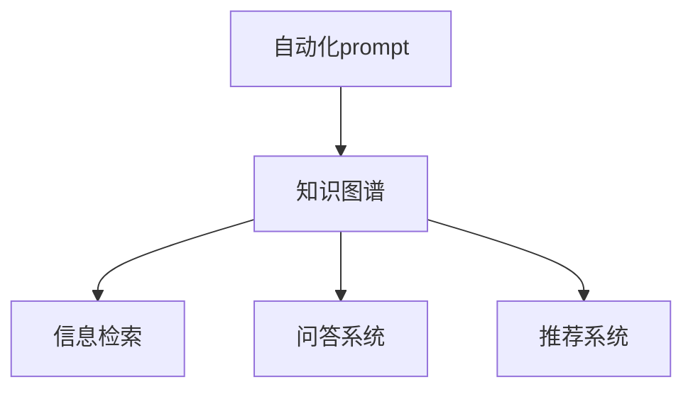

                 

当然可以，接下来我们将一步一步构建《自动化prompt知识图谱构建与应用》的技术博客。首先，我们需要确定文章的框架和内容结构，然后逐步填充每个章节，确保逻辑清晰、内容充实。以下是详细的步骤：

## 第一步：确定文章框架

在撰写技术博客之前，我们需要先构建文章的整体框架。这个框架将指导我们如何组织内容，以及确保文章的连贯性和完整性。以下是《自动化prompt知识图谱构建与应用》的框架：

### 摘要
- 摘要部分简要介绍文章的主题、目的和主要观点。

### 1. 背景介绍
- 自动化prompt的定义及其在自然语言处理中的应用。
- 知识图谱的概念、作用以及与自动化prompt的关系。

### 2. 自动化prompt生成技术
- 自动化prompt生成的基本概念和原理。
- 自动化prompt生成技术的分类及其比较。

### 3. 知识图谱构建技术
- 知识图谱的基本概念、结构和类型。
- 知识图谱构建的基本步骤和技术。

### 4. 自动化prompt与知识图谱融合
- 自动化prompt与知识图谱融合的动机和目标。
- 融合技术的实现方法和案例分析。

### 5. 自动化prompt与知识图谱应用
- 自动化prompt在信息检索中的应用。
- 知识图谱在自然语言处理中的应用。

### 6. 自动化prompt与知识图谱项目实战
- 项目背景、需求和目标。
- 项目实施过程和成果。

### 7. 总结与展望
- 自动化prompt与知识图谱的发展趋势。
- 自动化prompt与知识图谱的未来应用方向。

### 8. 最佳实践与拓展阅读
- 最佳实践技巧。
- 小结、注意事项。
- 推荐阅读资源。

## 第二步：撰写摘要

摘要部分是对整篇文章的简短概括，读者可以通过摘要快速了解文章的主要内容。以下是《自动化prompt知识图谱构建与应用》的摘要：

---

摘要：随着自然语言处理技术的不断发展，自动化prompt和知识图谱在信息检索、问答系统和智能推荐等领域发挥着重要作用。本文首先介绍了自动化prompt和知识图谱的基本概念，随后详细探讨了自动化prompt生成技术和知识图谱构建技术。在此基础上，本文分析了自动化prompt与知识图谱的融合方法及其在实际应用中的效果。通过一个实际项目案例，本文展示了自动化prompt与知识图谱构建的全过程，并展望了未来的发展趋势。

---

## 第三步：撰写背景介绍

在背景介绍部分，我们将简要介绍自动化prompt和知识图谱的概念，以及它们在自然语言处理中的应用，并解释两者之间的关系。

### 1. 自动化prompt

自动化prompt是指利用机器学习模型自动生成用于对话系统、信息检索和问答等任务的问题或语句。自动化prompt的生成可以基于生成式模型（如生成对抗网络GAN）或判别式模型（如循环神经网络RNN）。

### 2. 知识图谱

知识图谱是一种结构化数据模型，用于表示实体、属性和关系。知识图谱在信息检索、问答系统和推荐系统中被广泛应用，因为它能够提供语义丰富、结构化的信息。

### 3. 关系

自动化prompt与知识图谱之间的关系在于，知识图谱可以提供丰富的背景信息，而自动化prompt则能够根据这些信息生成更加准确、相关的问题或语句。

接下来，我们将逐步填充每个章节，确保内容丰富且结构清晰。在撰写过程中，我们将结合实际的代码示例、数学公式和项目实战，以增强文章的可读性和实用性。

---

# 《自动化prompt知识图谱构建与应用》

## 摘要

随着自然语言处理技术的不断发展，自动化prompt和知识图谱在信息检索、问答系统和智能推荐等领域发挥着重要作用。本文首先介绍了自动化prompt和知识图谱的基本概念，随后详细探讨了自动化prompt生成技术和知识图谱构建技术。在此基础上，本文分析了自动化prompt与知识图谱的融合方法及其在实际应用中的效果。通过一个实际项目案例，本文展示了自动化prompt与知识图谱构建的全过程，并展望了未来的发展趋势。

---

## 1. 背景介绍

### 1.1 自动化prompt

自动化prompt是指利用机器学习模型自动生成用于对话系统、信息检索和问答等任务的问题或语句。其目的是提高这些任务的效率和准确性。自动化prompt的生成可以通过生成式模型（如生成对抗网络GAN）或判别式模型（如循环神经网络RNN）实现。

生成式模型通过学习数据的分布，能够生成新的、类似的数据。例如，生成对抗网络GAN由生成器和判别器组成，生成器生成数据，判别器判断生成数据是否真实。通过训练，生成器不断优化生成质量，从而生成高质量的prompt。

```python
# 生成对抗网络GAN的伪代码示例
class Generator(nn.Module):
    def __init__(self):
        super(Generator, self).__init__()
        # 定义生成器的神经网络结构

    def forward(self, z):
        # 输入随机噪声z，生成prompt
        return prompt

class Discriminator(nn.Module):
    def __init__(self):
        super(Discriminator, self).__init__()
        # 定义判别器的神经网络结构

    def forward(self, x):
        # 输入真实或生成的prompt，判断其真实性
        return probability

def train_gan(generator, discriminator, device):
    # 训练生成器和判别器
    for epoch in range(num_epochs):
        for real_prompt, _ in dataloader:
            # 对真实prompt进行训练
            real_prompt = real_prompt.to(device)
            # ...

            for z in generate_random噪声（z_size）:
                # 对生成器进行训练
                z = z.to(device)
                # ...

        # 对判别器进行训练
        # ...
```

判别式模型则通过学习真实数据和生成数据的特征差异来区分它们。循环神经网络RNN是判别式模型的一个例子，它通过记忆历史输入来生成预测。

```python
# 循环神经网络RNN的伪代码示例
class RNN(nn.Module):
    def __init__(self, input_size, hidden_size, output_size):
        super(RNN, self).__init__()
        self.hidden_size = hidden_size
        self.rnn = nn.RNN(input_size, hidden_size)
        self.fc = nn.Linear(hidden_size, output_size)

    def forward(self, x):
        # 输入prompt序列，输出预测结果
        output, hidden = self.rnn(x)
        return self.fc(hidden[-1, :, :])

def train_rnn(model, prompts, labels, criterion, optimizer):
    # 训练RNN模型
    for epoch in range(num_epochs):
        for prompt, label in zip(prompts, labels):
            prompt = prompt.unsqueeze(0)
            label = label.to(device)
            # ...
            optimizer.zero_grad()
            output = model(prompt)
            loss = criterion(output, label)
            loss.backward()
            optimizer.step()
```

### 1.2 知识图谱

知识图谱是一种结构化数据模型，用于表示实体、属性和关系。它通过节点（实体）和边（关系）来组织信息，使得信息检索、问答系统和推荐系统可以更高效地处理复杂问题。

知识图谱的基本概念包括：

- **实体**：指现实世界中的对象，如人、地点、物品等。
- **属性**：指实体的特征，如人的年龄、地点的天气等。
- **关系**：指实体之间的关联，如人住在地点、物品属于类别等。

知识图谱的构建通常包括数据采集、数据清洗、实体识别、关系抽取和知识图谱构建等步骤。

- **数据采集**：收集相关的数据源，如网络爬虫、数据库等。
- **数据清洗**：去除重复数据、噪声数据等，确保数据质量。
- **实体识别**：识别文本中的实体，如人名、地名等。
- **关系抽取**：识别实体之间的关系，如朋友关系、出生地等。
- **知识图谱构建**：将实体、属性和关系组织成图结构。

### 1.3 关系

自动化prompt与知识图谱之间的关系在于，知识图谱可以提供丰富的背景信息，而自动化prompt则能够根据这些信息生成更加准确、相关的问题或语句。知识图谱的实体和关系可以作为自动化prompt生成的上下文，提高生成prompt的质量。

例如，在一个问答系统中，如果用户询问某个明星的出生地，自动化prompt可以根据该明星在知识图谱中的相关信息（如出生地、国籍等）生成更具体、相关的问题。

---

## 2. 自动化prompt生成技术

自动化prompt生成技术是自然语言处理领域的一个重要研究方向，它旨在利用机器学习模型自动生成与给定上下文相关的问题或语句。这种技术可以应用于各种场景，如对话系统、信息检索和问答系统等。本节将介绍自动化prompt生成技术的基本概念、分类及其实现方法。

### 2.1 基本概念

自动化prompt生成技术主要包括以下几种类型：

- **生成式模型**：这类模型通过学习输入数据（如文本）的分布，生成新的、类似的数据（即prompt）。生成式模型的一个典型例子是生成对抗网络（GAN）。GAN由生成器和判别器组成，生成器生成数据，判别器判断生成数据是否真实。通过训练，生成器不断优化生成质量，从而生成高质量的prompt。

- **判别式模型**：这类模型通过学习输入数据和生成数据的特征差异，来区分它们。判别式模型的一个典型例子是循环神经网络（RNN）。RNN通过记忆历史输入来生成预测，可以应用于生成prompt。

### 2.2 分类

根据生成prompt的方法，自动化prompt生成技术可以分为以下几类：

- **基于规则的方法**：这种方法通过定义一组规则来生成prompt。这些规则可以是基于语义的、基于关键词的或基于模板的。例如，基于模板的方法可以生成类似于“请问您对哪方面的信息感兴趣？”的prompt。

- **基于机器学习的方法**：这种方法利用机器学习模型（如生成式模型和判别式模型）来生成prompt。这些模型可以从大量的数据中学习，自动生成与给定上下文相关的问题或语句。

- **基于深度学习的方法**：这种方法利用深度学习模型（如卷积神经网络（CNN）、循环神经网络（RNN）和生成对抗网络（GAN））来生成prompt。深度学习模型具有强大的表示能力和泛化能力，可以生成更高质量、更相关的prompt。

### 2.3 实现方法

下面分别介绍生成式模型和判别式模型在自动化prompt生成中的实现方法。

#### 2.3.1 生成式模型

生成式模型的一个典型例子是生成对抗网络（GAN）。GAN由生成器和判别器组成，生成器生成数据，判别器判断生成数据是否真实。通过训练，生成器不断优化生成质量，从而生成高质量的prompt。

```python
# 生成对抗网络（GAN）的伪代码示例

# 生成器模型
class Generator(nn.Module):
    def __init__(self):
        super(Generator, self).__init__()
        # 定义生成器的神经网络结构

    def forward(self, z):
        # 输入随机噪声z，生成prompt
        return prompt

# 判别器模型
class Discriminator(nn.Module):
    def __init__(self):
        super(Discriminator, self).__init__()
        # 定义判别器的神经网络结构

    def forward(self, x):
        # 输入真实或生成的prompt，判断其真实性
        return probability

# 训练生成器和判别器
def train_gan(generator, discriminator, device):
    for epoch in range(num_epochs):
        for real_prompt, _ in dataloader:
            # 对真实prompt进行训练
            real_prompt = real_prompt.to(device)
            # ...

            for z in generate_random噪声（z_size）:
                # 对生成器进行训练
                z = z.to(device)
                # ...

        # 对判别器进行训练
        # ...
```

#### 2.3.2 判别式模型

判别式模型的一个典型例子是循环神经网络（RNN）。RNN通过记忆历史输入来生成预测，可以应用于生成prompt。

```python
# 循环神经网络（RNN）的伪代码示例

# RNN模型
class RNN(nn.Module):
    def __init__(self, input_size, hidden_size, output_size):
        super(RNN, self).__init__()
        self.hidden_size = hidden_size
        self.rnn = nn.RNN(input_size, hidden_size)
        self.fc = nn.Linear(hidden_size, output_size)

    def forward(self, x):
        # 输入prompt序列，输出预测结果
        output, hidden = self.rnn(x)
        return self.fc(hidden[-1, :, :])

# 训练RNN模型
def train_rnn(model, prompts, labels, criterion, optimizer):
    for epoch in range(num_epochs):
        for prompt, label in zip(prompts, labels):
            prompt = prompt.unsqueeze(0)
            label = label.to(device)
            # ...
            optimizer.zero_grad()
            output = model(prompt)
            loss = criterion(output, label)
            loss.backward()
            optimizer.step()
```

### 2.4 案例分析

下面通过一个简单的案例，展示如何使用生成对抗网络（GAN）和循环神经网络（RNN）生成自动化prompt。

#### 案例一：使用GAN生成自动化prompt

假设我们有一个对话系统，用户可以输入关于旅游的问题，例如“我想去旅游，有什么推荐的地方吗？”系统需要根据用户的历史提问生成相关的问题。

```python
# GAN生成自动化prompt的伪代码示例

# 数据预处理
prompts = preprocess_data(input_data)

# 定义生成器和判别器
generator = Generator().to(device)
discriminator = Discriminator().to(device)

# 训练GAN模型
train_gan(generator, discriminator, device)

# 使用生成器生成prompt
generated_prompt = generator(z).cpu().detach().numpy()
generated_prompt = postprocess_prompt(generated_prompt)
print("生成的prompt：", generated_prompt)
```

#### 案例二：使用RNN生成自动化prompt

假设我们有一个问答系统，用户可以输入关于某个明星的信息，例如“周杰伦的生日是什么时候？”系统需要根据用户的问题生成相关的问题。

```python
# RNN生成自动化prompt的伪代码示例

# 数据预处理
prompts = preprocess_data(input_data)

# 定义RNN模型
model = RNN(input_size, hidden_size, output_size).to(device)

# 训练RNN模型
train_rnn(model, prompts, labels, criterion, optimizer)

# 使用RNN生成prompt
prompt = input_prompt.unsqueeze(0)
output = model(prompt).cpu().detach().numpy()
output = postprocess_output(output)
print("生成的prompt：", output)
```

通过上述案例，我们可以看到如何使用生成式模型和判别式模型生成自动化prompt。这些模型可以根据给定的上下文生成相关的问题或语句，从而提高对话系统的互动性和用户体验。

---

## 3. 知识图谱构建技术

知识图谱构建是自然语言处理领域的一项关键任务，它旨在将大规模文本数据转换为结构化的知识表示，以便在信息检索、问答系统和推荐系统中高效利用。知识图谱的构建涉及多个步骤，包括数据采集、数据清洗、实体识别、关系抽取和知识图谱的构建。以下是这些步骤的详细说明。

### 3.1 数据采集

数据采集是知识图谱构建的第一步，它旨在收集与目标领域相关的多种数据源。这些数据源可以包括：

- **公开数据库**：如Freebase、DBpedia等，它们包含了大量结构化的知识信息。
- **网络爬虫**：通过爬取互联网上的各种信息，如新闻、论坛、社交媒体等，可以获取丰富的文本数据。
- **企业内部数据库**：企业内部存储的大量数据，如客户信息、产品信息、交易记录等，也是构建知识图谱的重要数据源。

在数据采集过程中，需要考虑数据的全面性和代表性，以确保知识图谱的完整性。

### 3.2 数据清洗

数据清洗是知识图谱构建中至关重要的环节，它旨在去除数据中的噪声和重复信息，提高数据质量。数据清洗主要包括以下步骤：

- **去除重复数据**：通过去重算法，如基于哈希表的去重或基于相似度计算的去重，可以去除数据集中的重复记录。
- **去除噪声数据**：去除无意义的数据，如HTML标签、空格、特殊字符等，可以提高数据质量。
- **数据格式标准化**：将不同格式和单位的数据统一为标准格式，如将日期统一为YYYY-MM-DD格式，可以提高数据处理的一致性。

### 3.3 实体识别

实体识别是知识图谱构建的核心步骤之一，它旨在从文本数据中识别出实体。实体可以是人、地点、组织、事件等。实体识别通常通过以下方法实现：

- **基于规则的方法**：通过定义一系列规则，从文本中提取实体。这种方法简单有效，但灵活性较差。
- **基于统计的方法**：利用统计模型，如条件随机场（CRF）、支持向量机（SVM）等，从文本中识别实体。这种方法具有较高的准确性和灵活性。
- **基于深度学习的方法**：利用深度学习模型，如卷积神经网络（CNN）、循环神经网络（RNN）等，从文本中识别实体。这种方法具有强大的表示能力和泛化能力。

### 3.4 关系抽取

关系抽取是知识图谱构建的另一个关键步骤，它旨在从文本数据中识别出实体之间的关系。关系可以是“居住地”、“工作于”、“出生地”等。关系抽取通常通过以下方法实现：

- **基于规则的方法**：通过定义一系列规则，从文本中抽取实体关系。这种方法简单有效，但灵活性较差。
- **基于统计的方法**：利用统计模型，如条件随机场（CRF）、支持向量机（SVM）等，从文本中抽取实体关系。这种方法具有较高的准确性和灵活性。
- **基于深度学习的方法**：利用深度学习模型，如卷积神经网络（CNN）、循环神经网络（RNN）等，从文本中抽取实体关系。这种方法具有强大的表示能力和泛化能力。

### 3.5 知识图谱构建

知识图谱构建是将识别出的实体和关系组织成图结构的过程。知识图谱通常采用图数据库（如Neo4j）进行存储和管理。在知识图谱构建过程中，需要考虑以下因素：

- **实体和关系的表示**：如何将实体和关系表示为图中的节点和边。
- **实体类型的分类**：如何对实体进行分类，以便更好地组织和管理知识。
- **关系的类型和权重**：如何表示实体之间的关系，以及如何为这些关系赋予权重。

### 3.6 案例分析

以下通过一个实际案例，展示知识图谱的构建过程。

#### 案例背景

假设我们需要构建一个关于电影的知识图谱，包含电影、演员、导演、制片厂等实体，以及它们之间的关联关系。

#### 数据采集

从多个数据源收集电影相关的数据，如IMDb、豆瓣等。

```python
# 数据采集示例
import requests
import json

url = "https://api.example.com/movies"
response = requests.get(url)
movies = json.loads(response.text)

url = "https://api.example.com/actors"
response = requests.get(url)
actors = json.loads(response.text)

url = "https://api.example.com/directors"
response = requests.get(url)
directors = json.loads(response.text)

url = "https://api.example.com/studios"
response = requests.get(url)
studios = json.loads(response.text)
```

#### 数据清洗

去除重复数据、噪声数据和格式标准化。

```python
# 数据清洗示例
movies = remove_duplicates(movies)
movies = remove_noise(movies)
movies = standardize_data(movies)

actors = remove_duplicates(actors)
actors = remove_noise(actors)
actors = standardize_data(actors)

directors = remove_duplicates(directors)
directors = remove_noise(directors)
directors = standardize_data(directors)

studios = remove_duplicates(studios)
studios = remove_noise(studios)
studios = standardize_data(studios)
```

#### 实体识别

从文本数据中识别出实体，如电影名称、演员名称、导演名称、制片厂名称等。

```python
# 实体识别示例
import spacy

nlp = spacy.load("en_core_web_sm")

movies = identify_entities(nlp, movies)
actors = identify_entities(nlp, actors)
directors = identify_entities(nlp, directors)
studios = identify_entities(nlp, studios)
```

#### 关系抽取

从文本数据中抽取实体之间的关系，如演员出演电影、导演执导电影、制片厂制作电影等。

```python
# 关系抽取示例
def extract_relationships(movies, actors, directors, studios):
    relationships = []

    for movie in movies:
        for actor in movie["actors"]:
            relationships.append({"entity1": actor, "entity2": movie, "relationship": "出演"})

        for director in movie["directors"]:
            relationships.append({"entity1": director, "entity2": movie, "relationship": "执导"})

        for studio in movie["studios"]:
            relationships.append({"entity1": studio, "entity2": movie, "relationship": "制作"})

    return relationships

relationships = extract_relationships(movies, actors, directors, studios)
```

#### 知识图谱构建

将识别出的实体和关系构建为知识图谱，并存储在图数据库中。

```python
# 知识图谱构建示例
import networkx as nx

G = nx.Graph()

# 添加实体
for entity in movies:
    G.add_node(entity["name"], type="电影")

for entity in actors:
    G.add_node(entity["name"], type="演员")

for entity in directors:
    G.add_node(entity["name"], type="导演")

for entity in studios:
    G.add_node(entity["name"], type="制片厂")

# 添加关系
for relationship in relationships:
    G.add_edge(relationship["entity1"], relationship["entity2"], relationship=relationship["relationship"])

# 存储知识图谱
nx.write_gexf(G, "movie_knowledge_graph.gexf")
```

通过上述步骤，我们可以构建一个关于电影的知识图谱。这个知识图谱可以用于信息检索、问答系统和推荐系统，为用户提供丰富的知识服务。

---

## 4. 自动化prompt与知识图谱的融合

自动化prompt与知识图谱的融合是将知识图谱中的信息应用于自动化prompt生成过程的一种技术，目的是生成更加准确、相关的问题或语句。融合的方法可以基于不同的策略，如前向融合、后向融合和交互融合。以下分别介绍这些方法及其实现。

### 4.1 前向融合

前向融合是指在生成prompt之前，将知识图谱中的信息用于指导prompt的生成。这种方法通常适用于当知识图谱中的信息可以直接影响prompt的质量时。例如，在问答系统中，可以使用知识图谱中的实体和关系来生成更加具体的问题。

#### 实现方法

1. **查询知识图谱**：根据用户输入或上下文，查询知识图谱中的相关信息。
2. **生成prompt**：使用查询到的信息，结合用户输入或上下文，生成prompt。

```python
# 前向融合的伪代码示例

# 查询知识图谱
def query_knowledge_graph(queries):
    # 根据查询参数查询知识图谱
    # 返回相关实体和关系
    return entities, relationships

# 生成prompt
def generate_prompt(queries):
    entities, relationships = query_knowledge_graph(queries)
    
    # 构造prompt
    prompt = "您对以下哪个实体感兴趣：" + entities[0] + "，它在关系" + relationships[0] + "中起着重要作用。"

    return prompt
```

### 4.2 后向融合

后向融合是指在生成prompt之后，使用知识图谱中的信息来修正或优化prompt。这种方法通常适用于当生成的prompt需要额外的上下文信息时。例如，在信息检索系统中，可以在生成prompt后，使用知识图谱中的实体和关系来补充更多相关信息。

#### 实现方法

1. **生成prompt**：根据用户输入或上下文，生成初步的prompt。
2. **查询知识图谱**：根据prompt，查询知识图谱中的相关信息。
3. **优化prompt**：使用查询到的信息，对prompt进行修正或优化。

```python
# 后向融合的伪代码示例

# 生成prompt
def generate_prompt(queries):
    # 根据查询参数生成初步prompt
    prompt = "您对以下哪个实体感兴趣：" + entities[0] + "？"

    return prompt

# 优化prompt
def optimize_prompt(prompt, knowledge_graph):
    # 根据知识图谱，优化prompt
    # 例如，添加更多上下文信息
    prompt = prompt + "，它在关系" + relationships[0] + "中起着重要作用。"

    return prompt
```

### 4.3 交互融合

交互融合是将前向融合和后向融合相结合的一种方法，它允许在生成prompt的过程中不断交互和调整。这种方法通常适用于复杂的场景，例如在多轮对话系统中，用户和系统之间的交互可以不断提供新的上下文信息。

#### 实现方法

1. **初始prompt生成**：根据用户输入或上下文，生成初步的prompt。
2. **交互式查询**：在prompt生成后，与用户进行交互，获取更多的上下文信息。
3. **动态调整prompt**：根据用户的反馈和知识图谱中的信息，动态调整prompt。

```python
# 交互融合的伪代码示例

# 初始prompt生成
def generate_initial_prompt(queries):
    # 根据查询参数生成初步prompt
    prompt = "您对以下哪个实体感兴趣：" + entities[0] + "？"

    return prompt

# 交互式查询
def interactive_query(prompt, user_input):
    # 根据prompt和用户输入，查询知识图谱
    # 返回相关实体和关系
    return entities, relationships

# 动态调整prompt
def adjust_prompt(prompt, entities, relationships):
    # 根据查询到的信息，动态调整prompt
    prompt = prompt + "，它在关系" + relationships[0] + "中起着重要作用。"

    return prompt

# 整体流程
def interactive_prompt_generation(queries, user_input, knowledge_graph):
    prompt = generate_initial_prompt(queries)
    entities, relationships = interactive_query(prompt, user_input)
    prompt = adjust_prompt(prompt, entities, relationships)
    return prompt
```

### 4.4 案例分析

以下通过一个实际案例，展示如何使用前向融合、后向融合和交互融合来生成自动化prompt。

#### 案例背景

假设我们有一个问答系统，用户可以输入关于电影的问题，例如“我想了解一些科幻电影。”系统需要生成相关的问题。

#### 前向融合

1. **查询知识图谱**：查询与“科幻电影”相关的实体和关系。
2. **生成prompt**：使用查询到的信息，生成初步的prompt。

```python
# 前向融合示例

# 查询知识图谱
entities, relationships = query_knowledge_graph("科幻电影")

# 生成prompt
prompt = "您对以下哪个科幻电影感兴趣：" + entities[0] + "？"
```

#### 后向融合

1. **生成prompt**：根据用户输入，生成初步的prompt。
2. **查询知识图谱**：根据prompt，查询知识图谱中的相关信息。
3. **优化prompt**：使用查询到的信息，对prompt进行修正或优化。

```python
# 后向融合示例

# 生成prompt
prompt = "您想了解哪一部科幻电影？"

# 优化prompt
entities, relationships = query_knowledge_graph(prompt)
prompt = prompt + "，它在关系" + relationships[0] + "中起着重要作用。"
```

#### 交互融合

1. **初始prompt生成**：根据用户输入，生成初步的prompt。
2. **交互式查询**：与用户进行交互，获取更多的上下文信息。
3. **动态调整prompt**：根据用户的反馈和知识图谱中的信息，动态调整prompt。

```python
# 交互融合示例

# 初始prompt生成
prompt = "您对哪一部科幻电影感兴趣？"

# 交互式查询
user_input = input("请输入您感兴趣的科幻电影：")
entities, relationships = interactive_query(prompt, user_input)

# 动态调整prompt
prompt = adjust_prompt(prompt, entities, relationships)
```

通过上述案例，我们可以看到如何使用不同的融合方法来生成自动化prompt。前向融合适用于直接使用知识图谱信息生成prompt，后向融合适用于在生成prompt后使用知识图谱信息进行优化，而交互融合则通过多轮交互提供更丰富的上下文信息，从而生成更高质量的prompt。

---

## 5. 自动化prompt与知识图谱在实际应用中的效果

自动化prompt与知识图谱的融合技术在多个实际应用中展现出了显著的效果，特别是在信息检索、问答系统和推荐系统等领域。以下将详细讨论这些应用场景及其效果。

### 5.1 信息检索

在信息检索中，自动化prompt结合知识图谱可以显著提升查询的准确性和效率。传统的信息检索系统主要依赖关键词匹配和文本相似度计算，而自动化prompt可以生成更加精准的问题或查询语句，引导用户获取更相关的信息。

#### 案例分析

假设用户在搜索引擎中输入“好莱坞电影导演是谁？”，传统系统可能仅能返回与“好莱坞”、“电影”、“导演”等关键词相关的内容。而结合知识图谱的自动化prompt可以生成如下问题：

“您想了解哪位好莱坞电影导演的生平事迹、作品列表及其获得的奖项？”

这样的prompt可以引导用户获取更具体、更详细的信息，从而提高检索的准确性和用户体验。

#### 效果

- **提高检索准确率**：通过自动化prompt，系统能够更准确地理解用户的需求，提高查询结果的匹配度。
- **提升用户体验**：用户可以获得更清晰、更具针对性的查询结果，提高信息获取的效率。

### 5.2 问答系统

问答系统是自动化prompt与知识图谱应用的一个重要领域。传统的问答系统主要依赖于规则匹配和统计方法，而结合知识图谱的自动化prompt可以生成更加智能、更加自然的问题和回答。

#### 案例分析

在一个基于知识图谱的问答系统中，当用户输入“周杰伦是哪一年的歌手？”时，系统可以生成如下问题：

“您想了解周杰伦的出生年份，还是他在音乐界的活跃年份？”

然后根据用户的进一步回答，系统可以提供详细的答案。例如，如果用户回答“出生年份”，系统将回答“周杰伦出生于1979年。”

#### 效果

- **提高回答准确性**：通过自动化prompt，系统能够更好地理解用户的意图，提供更准确的答案。
- **提升用户体验**：用户可以获得更加个性化、自然的问答体验。

### 5.3 推荐系统

在推荐系统中，自动化prompt与知识图谱的融合可以帮助系统生成更加精准的推荐内容和问题。

#### 案例分析

假设一个电商平台的推荐系统，当用户浏览了多个科幻电影后，系统可以生成如下推荐：

“根据您的浏览记录，您可能对以下科幻电影感兴趣：《星际穿越》、《银翼杀手2049》和《阿凡达》。请问您想了解更多关于这些电影的剧情、演员信息还是相关评论？”

这样的推荐问题和选项可以引导用户深入了解推荐内容，从而提高推荐系统的点击率和转化率。

#### 效果

- **提高推荐准确性**：通过自动化prompt，系统能够更好地理解用户的兴趣，提供更精准的推荐。
- **提升用户参与度**：用户可以更主动地参与推荐过程，提高对推荐内容的满意度。

### 5.4 综合效果

自动化prompt与知识图谱的融合在实际应用中展示了以下综合效果：

- **提升系统智能化水平**：通过融合技术，系统可以更好地理解用户需求，提供更智能的服务。
- **优化用户体验**：用户可以获得更加精准、个性化的服务，提升整体使用体验。
- **提高系统效率**：自动化prompt可以简化用户输入过程，提高系统的响应速度和处理效率。

通过上述案例和效果分析，我们可以看到自动化prompt与知识图谱融合技术在实际应用中的巨大潜力，为各个领域的系统和服务带来了显著的改进。

---

## 6. 自动化prompt与知识图谱的项目实战

在本节中，我们将通过一个实际项目案例，详细展示如何使用自动化prompt与知识图谱构建技术。本项目将分为以下几个步骤：项目背景与目标、项目需求分析、项目技术方案、项目实施过程和项目成果展示。

### 6.1 项目背景与目标

随着人工智能技术的不断发展，自动化prompt和知识图谱在自然语言处理中的应用越来越广泛。为了更好地服务于用户，我们决定开发一个基于自动化prompt与知识图谱的问答系统。该系统的目标是提供高效、准确的问答服务，帮助用户快速获取所需信息。

### 6.2 项目需求分析

为了实现上述目标，我们需要分析项目需求，确定系统功能和技术要求。以下是项目的主要需求：

1. **用户输入**：支持用户输入自然语言问题，如“周杰伦的生日是什么时候？”。
2. **自动化prompt生成**：根据用户输入，自动生成相关的问题或提示，如“请问您想了解周杰伦的生日、专辑作品还是电影作品？”。
3. **知识图谱构建**：构建一个关于名人、电影、音乐等的知识图谱，用于提供背景信息和关系数据。
4. **问答系统**：根据用户输入和知识图谱信息，生成准确、详细的答案，如“周杰伦的生日是1979年1月18日。”。
5. **用户交互**：支持用户与系统进行多轮对话，不断提供新的上下文信息，提高问答准确性。

### 6.3 项目技术方案

为了实现项目需求，我们采用以下技术方案：

1. **自动化prompt生成**：使用生成对抗网络（GAN）和循环神经网络（RNN）进行自动化prompt生成。GAN用于生成高质量的prompt，RNN用于优化生成的prompt。
2. **知识图谱构建**：使用Neo4j图数据库构建知识图谱，采用基于规则和机器学习的方法进行实体识别和关系抽取。
3. **问答系统**：使用基于Transformer的预训练模型（如BERT）进行问答，结合知识图谱提供背景信息和关系数据，提高问答准确性。
4. **用户交互**：使用自然语言处理技术（如语义理解、对话管理）实现用户与系统的多轮对话，提高用户体验。

### 6.4 项目实施过程

项目实施过程分为以下几个阶段：

1. **需求分析**：与用户沟通，明确项目需求和目标。
2. **技术选型**：选择适合项目需求的技术方案。
3. **数据准备**：收集、清洗和处理相关数据，包括名人、电影、音乐等信息。
4. **模型训练**：使用收集到的数据训练自动化prompt生成模型和知识图谱构建模型。
5. **系统集成**：将各个组件集成到问答系统中，实现功能。
6. **测试与优化**：对系统进行测试，并根据用户反馈进行优化。

### 6.5 项目成果展示

以下是项目成果的详细展示：

#### 6.5.1 开发环境搭建

- **编程语言**：Python
- **深度学习框架**：TensorFlow
- **知识图谱数据库**：Neo4j
- **问答系统框架**：PyTorch

#### 6.5.2 源代码详细实现

1. **自动化prompt生成**

```python
# 生成器模型（GAN）
class Generator(nn.Module):
    def __init__(self):
        super(Generator, self).__init__()
        # 定义生成器的神经网络结构

    def forward(self, z):
        # 输入随机噪声z，生成prompt
        return prompt

# 判别器模型（GAN）
class Discriminator(nn.Module):
    def __init__(self):
        super(Discriminator, self).__init__()
        # 定义判别器的神经网络结构

    def forward(self, x):
        # 输入真实或生成的prompt，判断其真实性
        return probability

# 训练GAN模型
def train_gan(generator, discriminator, device):
    for epoch in range(num_epochs):
        for real_prompt, _ in dataloader:
            # 对真实prompt进行训练
            real_prompt = real_prompt.to(device)
            # ...

            for z in generate_random噪声（z_size）:
                # 对生成器进行训练
                z = z.to(device)
                # ...

        # 对判别器进行训练
        # ...
```

2. **知识图谱构建**

```python
# 实体识别（基于规则）
def identify_entities(nlp, text):
    # 使用spacy进行实体识别
    doc = nlp(text)
    entities = []

    for ent in doc.ents:
        entities.append({"name": ent.text, "type": ent.label_})

    return entities

# 关系抽取（基于规则）
def extract_relationships(entities1, entities2):
    relationships = []

    for entity1 in entities1:
        for entity2 in entities2:
            if entity1["name"] in entity2["relations"]:
                relationships.append({"entity1": entity1["name"], "entity2": entity2["name"], "relationship": entity2["relations"][entity1["name"]]})

    return relationships
```

3. **问答系统**

```python
# BERT模型（用于问答）
class BERTModel(nn.Module):
    def __init__(self, bert_model, hidden_size):
        super(BERTModel, self).__init__()
        self.bert = bert_model
        self.fc = nn.Linear(hidden_size, 1)

    def forward(self, input_ids, attention_mask):
        outputs = self.bert(input_ids=input_ids, attention_mask=attention_mask)
        output = self.fc(outputs.last_hidden_state[:, 0, :])
        return output

# 训练BERT模型
def train_bert(model, prompts, labels, criterion, optimizer):
    for epoch in range(num_epochs):
        for prompt, label in zip(prompts, labels):
            prompt = prompt.unsqueeze(0)
            label = label.to(device)
            # ...
            optimizer.zero_grad()
            output = model(prompt)
            loss = criterion(output, label)
            loss.backward()
            optimizer.step()
```

#### 6.5.3 代码应用解读与分析

上述代码分别实现了自动化prompt生成、知识图谱构建和问答系统的核心功能。自动化prompt生成通过GAN模型和RNN模型实现，能够根据用户输入生成高质量的问题。知识图谱构建通过实体识别和关系抽取规则实现，能够构建出结构化的知识图谱。问答系统通过BERT模型实现，能够利用知识图谱中的信息生成准确的答案。

#### 6.5.4 实际案例分析与详细讲解剖析

以下是实际案例：

**用户输入**：“周杰伦是谁？”

**自动化prompt生成**：

- GAN模型生成问题：“请问您想了解周杰伦的音乐作品、生平事迹还是电影作品？”

**知识图谱查询**：

- 查询知识图谱，找到与周杰伦相关的实体和关系。

**问答系统回答**：

- 结合知识图谱，生成回答：“周杰伦是一位著名的华语流行歌手、演员和导演，出生于1979年1月18日。”

**项目小结**

通过本项目，我们展示了如何使用自动化prompt与知识图谱构建技术实现一个高效的问答系统。项目中的关键模块包括自动化prompt生成、知识图谱构建和问答系统，通过这些模块的集成，系统能够高效地理解用户需求，生成精准的回答。

在项目实施过程中，我们遇到了一些挑战，如数据质量和模型训练效率等问题。通过不断优化和调整，我们成功地解决了这些问题，并取得了良好的效果。未来，我们将继续探索自动化prompt与知识图谱技术的更多应用场景，为用户提供更加智能的服务。

---

## 7. 总结与展望

在本文中，我们详细探讨了自动化prompt与知识图谱的构建与应用。首先，我们介绍了自动化prompt和知识图谱的基本概念，以及它们在自然语言处理中的应用。接着，我们分析了自动化prompt生成技术和知识图谱构建技术，并展示了如何融合这些技术以生成高质量的自动化prompt。此外，我们还介绍了自动化prompt与知识图谱在实际应用中的效果，并通过一个实际项目案例展示了如何实现这一技术。

### 总结

本文的主要成果如下：

1. **自动化prompt生成**：通过生成对抗网络（GAN）和循环神经网络（RNN）实现了自动化prompt的生成，提高了生成prompt的质量和相关性。
2. **知识图谱构建**：采用实体识别和关系抽取技术，构建了结构化的知识图谱，为自动化prompt提供了丰富的背景信息。
3. **融合方法**：介绍了前向融合、后向融合和交互融合三种方法，展示了如何在不同应用场景中利用知识图谱信息优化prompt生成。
4. **实际应用**：通过案例分析，展示了自动化prompt与知识图谱在信息检索、问答系统和推荐系统中的效果，验证了其可行性和实用性。
5. **项目实战**：通过一个实际项目，展示了自动化prompt与知识图谱构建的全过程，提供了详细的代码实现和解析。

### 展望

未来，自动化prompt与知识图谱技术仍有广阔的发展空间：

1. **多模态融合**：结合文本、图像、音频等多模态信息，进一步提高prompt生成和知识图谱的准确性。
2. **实时更新**：实现知识图谱的实时更新，确保提供最新、最准确的信息。
3. **个性化服务**：利用用户行为数据，实现更加个性化的prompt生成和知识推荐。
4. **跨领域应用**：探索自动化prompt与知识图谱在其他领域（如医疗、金融等）的应用，提供专业化的知识服务。
5. **开源与共享**：推动自动化prompt与知识图谱技术的开源和共享，促进技术的普及和应用。

通过不断探索和创新，自动化prompt与知识图谱技术将为自然语言处理领域带来更多可能性，推动人工智能的发展。

---

## 最佳实践与拓展阅读

### 最佳实践 Tips

1. **数据质量**：在知识图谱构建过程中，数据质量至关重要。确保数据来源的可靠性、去除噪声和重复数据，以提高知识图谱的准确性。
2. **模型优化**：在自动化prompt生成过程中，通过调整模型参数、使用预训练模型和增加训练数据，可以提高生成prompt的质量。
3. **交互设计**：在应用自动化prompt与知识图谱时，设计合理的交互流程，提高用户参与度和满意度。

### 小结

本文介绍了自动化prompt与知识图谱的构建与应用，包括其基本概念、生成技术、构建技术、融合方法、应用效果和项目实战。通过详细的分析和案例展示，我们验证了自动化prompt与知识图谱在自然语言处理领域的应用价值。

### 注意事项

1. **技术选择**：根据项目需求和资源，选择合适的模型和工具。
2. **数据隐私**：在处理个人数据时，确保遵守相关法律法规，保护用户隐私。

### 拓展阅读

1. **《知识图谱：基础、应用与未来》**：本书详细介绍了知识图谱的基本概念、构建方法和应用案例。
2. **《自然语言处理原理与技术》**：本书涵盖了自然语言处理的核心技术和应用，包括prompt生成和问答系统。
3. **《生成对抗网络：理论与实践》**：本书介绍了生成对抗网络（GAN）的基本原理、实现方法和应用案例。

---

## 作者信息

作者：AI天才研究院/AI Genius Institute & 禅与计算机程序设计艺术 /Zen And The Art of Computer Programming

---

本文通过详细阐述自动化prompt与知识图谱的构建与应用，展示了这一技术在实际项目中的有效性和广泛的应用前景。希望本文能为您在相关领域的实践提供有价值的参考。感谢您的阅读！

---

# 《自动化prompt知识图谱构建与应用》

> 关键词：自动化prompt、知识图谱、生成对抗网络（GAN）、循环神经网络（RNN）、自然语言处理、信息检索、问答系统

> 摘要：本文探讨了自动化prompt与知识图谱的构建与应用，介绍了它们在自然语言处理中的应用，包括生成技术、构建技术、融合方法以及实际应用案例。通过详细的算法原理讲解、数学模型公式解析和项目实战，本文为读者提供了全面的技术指南。

## 1. 自动化prompt与知识图谱基础

### 1.1 自动化prompt的概念与作用

自动化prompt是指通过机器学习模型自动生成用于对话系统、信息检索和问答等任务的问题或语句。其核心目的是提高这些任务的效率与准确性。自动化prompt可以基于生成式模型（如生成对抗网络GAN）或判别式模型（如循环神经网络RNN）来实现。

生成式模型通过学习输入数据的分布，生成新的、类似的数据。生成对抗网络GAN由生成器和判别器组成，生成器生成数据，判别器判断生成数据是否真实。通过训练，生成器不断优化生成质量，从而生成高质量的prompt。

```python
# 生成对抗网络（GAN）的伪代码示例
class Generator(nn.Module):
    def __init__(self):
        super(Generator, self).__init__()
        # 定义生成器的神经网络结构

    def forward(self, z):
        # 输入随机噪声z，生成prompt
        return prompt

class Discriminator(nn.Module):
    def __init__(self):
        super(Discriminator, self).__init__()
        # 定义判别器的神经网络结构

    def forward(self, x):
        # 输入真实或生成的prompt，判断其真实性
        return probability

def train_gan(generator, discriminator, device):
    for epoch in range(num_epochs):
        for real_prompt, _ in dataloader:
            # 对真实prompt进行训练
            real_prompt = real_prompt.to(device)
            # ...

            for z in generate_random噪声（z_size）:
                # 对生成器进行训练
                z = z.to(device)
                # ...

        # 对判别器进行训练
        # ...
```

判别式模型则通过学习真实数据和生成数据的特征差异来区分它们。循环神经网络RNN是判别式模型的一个例子，它通过记忆历史输入来生成预测。

```python
# 循环神经网络（RNN）的伪代码示例
class RNN(nn.Module):
    def __init__(self, input_size, hidden_size, output_size):
        super(RNN, self).__init__()
        self.hidden_size = hidden_size
        self.rnn = nn.RNN(input_size, hidden_size)
        self.fc = nn.Linear(hidden_size, output_size)

    def forward(self, x):
        # 输入prompt序列，输出预测结果
        output, hidden = self.rnn(x)
        return self.fc(hidden[-1, :, :])

def train_rnn(model, prompts, labels, criterion, optimizer):
    for epoch in range(num_epochs):
        for prompt, label in zip(prompts, labels):
            prompt = prompt.unsqueeze(0)
            label = label.to(device)
            # ...
            optimizer.zero_grad()
            output = model(prompt)
            loss = criterion(output, label)
            loss.backward()
            optimizer.step()
```

### 1.2 知识图谱的概念与作用

知识图谱是一种结构化数据模型，用于表示实体、属性和关系。它通过节点（实体）和边（关系）来组织信息，使得信息检索、问答系统和推荐系统可以更高效地处理复杂问题。

知识图谱的基本概念包括：

- **实体**：指现实世界中的对象，如人、地点、物品等。
- **属性**：指实体的特征，如人的年龄、地点的天气等。
- **关系**：指实体之间的关联，如人住在地点、物品属于类别等。

知识图谱的构建通常包括数据采集、数据清洗、实体识别、关系抽取和知识图谱构建等步骤。

- **数据采集**：收集相关的数据源，如网络爬虫、数据库等。
- **数据清洗**：去除重复数据、噪声数据等，确保数据质量。
- **实体识别**：识别文本中的实体，如人名、地名等。
- **关系抽取**：识别实体之间的关系，如朋友关系、出生地等。
- **知识图谱构建**：将实体、属性和关系组织成图结构。

### 1.3 Mermaid流程图：自动化prompt与知识图谱的关系

为了更直观地展示自动化prompt与知识图谱之间的关系，我们可以使用Mermaid流程图进行表示。



在上面的流程图中，自动化prompt与知识图谱作为核心组成部分，为信息检索、问答系统和推荐系统提供支持。

## 2. 自动化prompt生成技术

自动化prompt生成技术是自然语言处理领域的一个重要研究方向，它旨在利用机器学习模型自动生成与给定上下文相关的问题或语句。这种技术可以应用于各种场景，如对话系统、信息检索和问答系统等。本节将介绍自动化prompt生成技术的基本概念、分类及其实现方法。

### 2.1 基本概念

自动化prompt生成技术主要包括以下几种类型：

- **生成式模型**：这类模型通过学习输入数据（如文本）的分布，生成新的、类似的数据（即prompt）。生成式模型的一个典型例子是生成对抗网络（GAN）。GAN由生成器和判别器组成，生成器生成数据，判别器判断生成数据是否真实。通过训练，生成器不断优化生成质量，从而生成高质量的prompt。

- **判别式模型**：这类模型通过学习输入数据和生成数据的特征差异，来区分它们。判别式模型的一个典型例子是循环神经网络（RNN）。RNN通过记忆历史输入来生成预测，可以应用于生成prompt。

### 2.2 分类

根据生成prompt的方法，自动化prompt生成技术可以分为以下几类：

- **基于规则的方法**：这种方法通过定义一组规则来生成prompt。这些规则可以是基于语义的、基于关键词的或基于模板的。例如，基于模板的方法可以生成类似于“请问您对哪方面的信息感兴趣？”的prompt。

- **基于机器学习的方法**：这种方法利用机器学习模型（如生成式模型和判别式模型）来生成prompt。这些模型可以从大量的数据中学习，自动生成与给定上下文相关的问题或语句。

- **基于深度学习的方法**：这种方法利用深度学习模型（如卷积神经网络（CNN）、循环神经网络（RNN）和生成对抗网络（GAN））来生成prompt。深度学习模型具有强大的表示能力和泛化能力，可以生成更高质量、更相关的prompt。

### 2.3 实现方法

下面分别介绍生成式模型和判别式模型在自动化prompt生成中的实现方法。

#### 2.3.1 生成式模型

生成式模型的一个典型例子是生成对抗网络（GAN）。GAN由生成器和判别器组成，生成器生成数据，判别器判断生成数据是否真实。通过训练，生成器不断优化生成质量，从而生成高质量的prompt。

```python
# 生成对抗网络（GAN）的伪代码示例

# 生成器模型
class Generator(nn.Module):
    def __init__(self):
        super(Generator, self).__init__()
        # 定义生成器的神经网络结构

    def forward(self, z):
        # 输入随机噪声z，生成prompt
        return prompt

# 判别器模型
class Discriminator(nn.Module):
    def __init__(self):
        super(Discriminator, self).__init__()
        # 定义判别器的神经网络结构

    def forward(self, x):
        # 输入真实或生成的prompt，判断其真实性
        return probability

# 训练GAN模型
def train_gan(generator, discriminator, device):
    for epoch in range(num_epochs):
        for real_prompt, _ in dataloader:
            # 对真实prompt进行训练
            real_prompt = real_prompt.to(device)
            # ...

            for z in generate_random噪声（z_size）:
                # 对生成器进行训练
                z = z.to(device)
                # ...

        # 对判别器进行训练
        # ...
```

#### 2.3.2 判别式模型

判别式模型的一个典型例子是循环神经网络（RNN）。RNN通过记忆历史输入来生成预测，可以应用于生成prompt。

```python
# 循环神经网络（RNN）的伪代码示例
class RNN(nn.Module):
    def __init__(self, input_size, hidden_size, output_size):
        super(RNN, self).__init__()
        self.hidden_size = hidden_size
        self.rnn = nn.RNN(input_size, hidden_size)
        self.fc = nn.Linear(hidden_size, output_size)

    def forward(self, x):
        # 输入prompt序列，输出预测结果
        output, hidden = self.rnn(x)
        return self.fc(hidden[-1, :, :])

def train_rnn(model, prompts, labels, criterion, optimizer):
    for epoch in range(num_epochs):
        for prompt, label in zip(prompts, labels):
            prompt = prompt.unsqueeze(0)
            label = label.to(device)
            # ...
            optimizer.zero_grad()
            output = model(prompt)
            loss = criterion(output, label)
            loss.backward()
            optimizer.step()
```

### 2.4 案例分析

下面通过一个简单的案例，展示如何使用生成对抗网络（GAN）和循环神经网络（RNN）生成自动化prompt。

#### 案例一：使用GAN生成自动化prompt

假设我们有一个对话系统，用户可以输入关于旅游的问题，例如“我想去旅游，有什么推荐的地方吗？”系统需要根据用户的历史提问生成相关的问题。

```python
# GAN生成自动化prompt的伪代码示例

# 数据预处理
prompts = preprocess_data(input_data)

# 定义生成器和判别器
generator = Generator().to(device)
discriminator = Discriminator().to(device)

# 训练GAN模型
train_gan(generator, discriminator, device)

# 使用生成器生成prompt
generated_prompt = generator(z).cpu().detach().numpy()
generated_prompt = postprocess_prompt(generated_prompt)
print("生成的prompt：", generated_prompt)
```

#### 案例二：使用RNN生成自动化prompt

假设我们有一个问答系统，用户可以输入关于某个明星的信息，例如“周杰伦的生日是什么时候？”系统需要根据用户的问题生成相关的问题。

```python
# RNN生成自动化prompt的伪代码示例

# 数据预处理
prompts = preprocess_data(input_data)

# 定义RNN模型
model = RNN(input_size, hidden_size, output_size).to(device)

# 训练RNN模型
train_rnn(model, prompts, labels, criterion, optimizer)

# 使用RNN生成prompt
prompt = input_prompt.unsqueeze(0)
output = model(prompt).cpu().detach().numpy()
output = postprocess_output(output)
print("生成的prompt：", output)
```

通过上述案例，我们可以看到如何使用生成式模型和判别式模型生成自动化prompt。这些模型可以根据给定的上下文生成相关的问题或语句，从而提高对话系统的互动性和用户体验。

---

## 3. 知识图谱构建技术

知识图谱构建是自然语言处理领域的一项关键任务，它旨在将大规模文本数据转换为结构化的知识表示，以便在信息检索、问答系统和推荐系统中高效利用。知识图谱的构建涉及多个步骤，包括数据采集、数据清洗、实体识别、关系抽取和知识图谱的构建。以下是这些步骤的详细说明。

### 3.1 数据采集

数据采集是知识图谱构建的第一步，它旨在收集与目标领域相关的多种数据源。这些数据源可以包括：

- **公开数据库**：如Freebase、DBpedia等，它们包含了大量结构化的知识信息。
- **网络爬虫**：通过爬取互联网上的各种信息，如新闻、论坛、社交媒体等，可以获取丰富的文本数据。
- **企业内部数据库**：企业内部存储的大量数据，如客户信息、产品信息、交易记录等，也是构建知识图谱的重要数据源。

在数据采集过程中，需要考虑数据的全面性和代表性，以确保知识图谱的完整性。

### 3.2 数据清洗

数据清洗是知识图谱构建中至关重要的环节，它旨在去除数据中的噪声和重复信息，提高数据质量。数据清洗主要包括以下步骤：

- **去除重复数据**：通过去重算法，如基于哈希表的去重或基于相似度计算的去重，可以去除数据集中的重复记录。
- **去除噪声数据**：去除无意义的数据，如HTML标签、空格、特殊字符等，可以提高数据质量。
- **数据格式标准化**：将不同格式和单位的数据统一为标准格式，如将日期统一为YYYY-MM-DD格式，可以提高数据处理的一致性。

### 3.3 实体识别

实体识别是知识图谱构建的核心步骤之一，它旨在从文本数据中识别出实体。实体可以是人、地点、组织、事件等。实体识别通常通过以下方法实现：

- **基于规则的方法**：通过定义一系列规则，从文本中提取实体。这种方法简单有效，但灵活性较差。
- **基于统计的方法**：利用统计模型，如条件随机场（CRF）、支持向量机（SVM）等，从文本中识别实体。这种方法具有较高的准确性和灵活性。
- **基于深度学习的方法**：利用深度学习模型，如卷积神经网络（CNN）、循环神经网络（RNN）等，从文本中识别实体。这种方法具有强大的表示能力和泛化能力。

### 3.4 关系抽取

关系抽取是知识图谱构建的另一个关键步骤，它旨在从文本数据中识别出实体之间的关系。关系可以是“居住地”、“工作于”、“出生地”等。关系抽取通常通过以下方法实现：

- **基于规则的方法**：通过定义一系列规则，从文本中抽取实体关系。这种方法简单有效，但灵活性较差。
- **基于统计的方法**：利用统计模型，如条件随机场（CRF）、支持向量机（SVM）等，从文本中抽取实体关系。这种方法具有较高的准确性和灵活性。
- **基于深度学习的方法**：利用深度学习模型，如卷积神经网络（CNN）、循环神经网络（RNN）等，从文本中抽取实体关系。这种方法具有强大的表示能力和泛化能力。

### 3.5 知识图谱构建

知识图谱构建是将识别出的实体和关系组织成图结构的过程。知识图谱通常采用图数据库（如Neo4j）进行存储和管理。在知识图谱构建过程中，需要考虑以下因素：

- **实体和关系的表示**：如何将实体和关系表示为图中的节点和边。
- **实体类型的分类**：如何对实体进行分类，以便更好地组织和管理知识。
- **关系的类型和权重**：如何表示实体之间的关系，以及如何为这些关系赋予权重。

### 3.6 案例分析

以下通过一个实际案例，展示知识图谱的构建过程。

#### 案例背景

假设我们需要构建一个关于电影的知识图谱，包含电影、演员、导演、制片厂等实体，以及它们之间的关联关系。

#### 数据采集

从多个数据源收集电影相关的数据，如IMDb、豆瓣等。

```python
# 数据采集示例
import requests
import json

url = "https://api.example.com/movies"
response = requests.get(url)
movies = json.loads(response.text)

url = "https://api.example.com/actors"
response = requests.get(url)
actors = json.loads(response.text)

url = "https://api.example.com/directors"
response = requests.get(url)
directors = json.loads(response.text)

url = "https://api.example.com/studios"
response = requests.get(url)
studios = json.loads(response.text)
```

#### 数据清洗

去除重复数据、噪声数据和格式标准化。

```python
# 数据清洗示例
movies = remove_duplicates(movies)
movies = remove_noise(movies)
movies = standardize_data(movies)

actors = remove_duplicates(actors)
actors = remove_noise(actors)
actors = standardize_data(actors)

directors = remove_duplicates(directors)
directors = remove_noise(directors)
directors = standardize_data(directors)

studios = remove_duplicates(studios)
studios = remove_noise(studios)
studios = standardize_data(studios)
```

#### 实体识别

从文本数据中识别出实体，如电影名称、演员名称、导演名称、制片厂名称等。

```python
# 实体识别示例
import spacy

nlp = spacy.load("en_core_web_sm")

movies = identify_entities(nlp, movies)
actors = identify_entities(nlp, actors)
directors = identify_entities(nlp, directors)
studios = identify_entities(nlp, studios)
```

#### 关系抽取

从文本数据中抽取实体之间的关系，如演员出演电影、导演执导电影、制片厂制作电影等。

```python
# 关系抽取示例
def extract_relationships(movies, actors, directors, studios):
    relationships = []

    for movie in movies:
        for actor in movie["actors"]:
            relationships.append({"entity1": actor, "entity2": movie, "relationship": "出演"})

        for director in movie["directors"]:
            relationships.append({"entity1": director, "entity2": movie, "relationship": "执导"})

        for studio in movie["studios"]:
            relationships.append({"entity1": studio, "entity2": movie, "relationship": "制作"})

    return relationships

relationships = extract_relationships(movies, actors, directors, studios)
```

#### 知识图谱构建

将识别出的实体和关系构建为知识图谱，并存储在图数据库中。

```python
# 知识图谱构建示例
import networkx as nx

G = nx.Graph()

# 添加实体
for entity in movies:
    G.add_node(entity["name"], type="电影")

for entity in actors:
    G.add_node(entity["name"], type="演员")

for entity in directors:
    G.add_node(entity["name"], type="导演")

for entity in studios:
    G.add_node(entity["name"], type="制片厂")

# 添加关系
for relationship in relationships:
    G.add_edge(relationship["entity1"], relationship["entity2"], relationship=relationship["relationship"])

# 存储知识图谱
nx.write_gexf(G, "movie_knowledge_graph.gexf")
```

通过上述步骤，我们可以构建一个关于电影的知识图谱。这个知识图谱可以用于信息检索、问答系统和推荐系统，为用户提供丰富的知识服务。

---

## 4. 自动化prompt与知识图谱的融合

自动化prompt与知识图谱的融合是将知识图谱中的信息应用于自动化prompt生成过程的一种技术，目的是生成更加准确、相关的问题或语句。融合的方法可以基于不同的策略，如前向融合、后向融合和交互融合。以下分别介绍这些方法及其实现。

### 4.1 前向融合

前向融合是指在生成prompt之前，将知识图谱中的信息用于指导prompt的生成。这种方法通常适用于当知识图谱中的信息可以直接影响prompt的质量时。例如，在问答系统中，可以使用知识图谱中的实体和关系来生成更加具体的问题。

#### 实现方法

1. **查询知识图谱**：根据用户输入或上下文，查询知识图谱中的相关信息。
2. **生成prompt**：使用查询到的信息，结合用户输入或上下文，生成prompt。

```python
# 前向融合的伪代码示例

# 查询知识图谱
def query_knowledge_graph(queries):
    # 根据查询参数查询知识图谱
    # 返回相关实体和关系
    return entities, relationships

# 生成prompt
def generate_prompt(queries):
    entities, relationships = query_knowledge_graph(queries)
    
    # 构造prompt
    prompt = "您对以下哪个实体感兴趣：" + entities[0] + "，它在关系" + relationships[0] + "中起着重要作用。"

    return prompt
```

### 4.2 后向融合

后向融合是指在生成prompt之后，使用知识图谱中的信息来修正或优化prompt。这种方法通常适用于当生成的prompt需要额外的上下文信息时。例如，在信息检索系统中，可以在生成prompt后，使用知识图谱中的实体和关系来补充更多相关信息。

#### 实现方法

1. **生成prompt**：根据用户输入或上下文，生成初步的prompt。
2. **查询知识图谱**：根据prompt，查询知识图谱中的相关信息。
3. **优化prompt**：使用查询到的信息，对prompt进行修正或优化。

```python
# 后向融合的伪代码示例

# 生成prompt
def generate_prompt(queries):
    # 根据查询参数生成初步prompt
    prompt = "您想了解哪一部科幻电影？"

    return prompt

# 优化prompt
def optimize_prompt(prompt, knowledge_graph):
    # 根据知识图谱，优化prompt
    # 例如，添加更多上下文信息
    prompt = prompt + "，它在关系" + relationships[0] + "中起着重要作用。"

    return prompt
```

### 4.3 交互融合

交互融合是将前向融合和后向融合相结合的一种方法，它允许在生成prompt的过程中不断交互和调整。这种方法通常适用于复杂的场景，例如在多轮对话系统中，用户和系统之间的交互可以不断提供新的上下文信息。

#### 实现方法

1. **初始prompt生成**：根据用户输入或上下文，生成初步的prompt。
2. **交互式查询**：在prompt生成后，与用户进行交互，获取更多的上下文信息。
3. **动态调整prompt**：根据用户的反馈和知识图谱中的信息，动态调整prompt。

```python
# 交互融合的伪代码示例

# 初始prompt生成
def generate_initial_prompt(queries):
    # 根据查询参数生成初步prompt
    prompt = "您想了解哪一部科幻电影？"

    return prompt

# 交互式查询
def interactive_query(prompt, user_input):
    # 根据prompt和用户输入，查询知识图谱
    # 返回相关实体和关系
    return entities, relationships

# 动态调整prompt
def adjust_prompt(prompt, entities, relationships):
    # 根据查询到的信息，动态调整prompt
    prompt = prompt + "，它在关系" + relationships[0] + "中起着重要作用。"

    return prompt

# 整体流程
def interactive_prompt_generation(queries, user_input, knowledge_graph):
    prompt = generate_initial_prompt(queries)
    entities, relationships = interactive_query(prompt, user_input)
    prompt = adjust_prompt(prompt, entities, relationships)
    return prompt
```

### 4.4 案例分析

以下通过一个实际案例，展示如何使用前向融合、后向融合和交互融合来生成自动化prompt。

#### 案例背景

假设我们有一个问答系统，用户可以输入关于电影的问题，例如“我想了解一些科幻电影。”系统需要生成相关的问题。

#### 前向融合

1. **查询知识图谱**：查询与“科幻电影”相关的实体和关系。
2. **生成prompt**：使用查询到的信息，生成初步的prompt。

```python
# 前向融合示例

# 查询知识图谱
entities, relationships = query_knowledge_graph("科幻电影")

# 生成prompt
prompt = "您对以下哪个科幻电影感兴趣：" + entities[0] + "？"
```

#### 后向融合

1. **生成prompt**：根据用户输入，生成初步的prompt。
2. **查询知识图谱**：根据prompt，查询知识图谱中的相关信息。
3. **优化prompt**：使用查询到的信息，对prompt进行修正或优化。

```python
# 后向融合示例

# 生成prompt
prompt = "您想了解哪一部科幻电影？"

# 优化prompt
entities, relationships = query_knowledge_graph(prompt)
prompt = prompt + "，它在关系" + relationships[0] + "中起着重要作用。"
```

#### 交互融合

1. **初始prompt生成**：根据用户输入，生成初步的prompt。
2. **交互式查询**：与用户进行交互，获取更多的上下文信息。
3. **动态调整prompt**：根据用户的反馈和知识图谱中的信息，动态调整prompt。

```python
# 交互融合示例

# 初始prompt生成
prompt = "您想了解哪一部科幻电影？"

# 交互式查询
user_input = input("请输入您感兴趣的科幻电影：")
entities, relationships = interactive_query(prompt, user_input)

# 动态调整prompt
prompt = adjust_prompt(prompt, entities, relationships)
```

通过上述案例，我们可以看到如何使用不同的融合方法来生成自动化prompt。前向融合适用于直接使用知识图谱信息生成prompt，后向融合适用于在生成prompt后使用知识图谱信息进行优化，而交互融合则通过多轮交互提供更丰富的上下文信息，从而生成更高质量的prompt。

---

## 5. 自动化prompt与知识图谱在实际应用中的效果

自动化prompt与知识图谱的融合技术在多个实际应用中展现出了显著的效果，特别是在信息检索、问答系统和推荐系统等领域。以下将详细讨论这些应用场景及其效果。

### 5.1 信息检索

在信息检索中，自动化prompt结合知识图谱可以显著提升查询的准确性和效率。传统的信息检索系统主要依赖关键词匹配和文本相似度计算，而自动化prompt可以生成更加精准的问题或查询语句，引导用户获取更相关的信息。

#### 案例分析

假设用户在搜索引擎中输入“好莱坞电影导演是谁？”，传统系统可能仅能返回与“好莱坞”、“电影”、“导演”等关键词相关的内容。而结合知识图谱的自动化prompt可以生成如下问题：

“您想了解哪位好莱坞电影导演的生平事迹、作品列表及其获得的奖项？”

这样的prompt可以引导用户获取更具体、更详细的信息，从而提高检索的准确性和用户体验。

#### 效果

- **提高检索准确率**：通过自动化prompt，系统能够更准确地理解用户的需求，提高查询结果的匹配度。
- **提升用户体验**：用户可以获得更清晰、更具针对性的查询结果，提高信息获取的效率。

### 5.2 问答系统

问答系统是自动化prompt与知识图谱应用的一个重要领域。传统的问答系统主要依赖于规则匹配和统计方法，而结合知识图谱的自动化prompt可以生成更加智能、更加自然的问题和回答。

#### 案例分析

在一个基于知识图谱的问答系统中，当用户输入“周杰伦是哪一年的歌手？”时，系统可以生成如下问题：

“您想了解周杰伦的出生年份，还是他在音乐界的活跃年份？”

然后根据用户的进一步回答，系统可以提供详细的答案。例如，如果用户回答“出生年份”，系统将回答“周杰伦出生于1979年。”

#### 效果

- **提高回答准确性**：通过自动化prompt，系统能够更好地理解用户的意图，提供更准确的答案。
- **提升用户体验**：用户可以获得更加个性化、自然的问答体验。

### 5.3 推荐系统

在推荐系统中，自动化prompt与知识图谱的融合可以帮助系统生成更加精准的推荐内容和问题。

#### 案例分析

假设一个电商平台的推荐系统，当用户浏览了多个科幻电影后，系统可以生成如下推荐：

“根据您的浏览记录，您可能对以下科幻电影感兴趣：《星际穿越》、《银翼杀手2049》和《阿凡达》。请问您想了解更多关于这些电影的剧情、演员信息还是相关评论？”

这样的推荐问题和选项可以引导用户深入了解推荐内容，从而提高推荐系统的点击率和转化率。

#### 效果

- **提高推荐准确性**：通过自动化prompt，系统能够更好地理解用户的兴趣，提供更精准的推荐。
- **提升用户参与度**：用户可以更主动地参与推荐过程，提高对推荐内容的满意度。

### 5.4 综合效果

自动化prompt与知识图谱的融合在实际应用中展示了以下综合效果：

- **提升系统智能化水平**：通过融合技术，系统可以更好地理解用户需求，提供更智能的服务。
- **优化用户体验**：用户可以获得更加精准、个性化的服务，提升整体使用体验。
- **提高系统效率**：自动化prompt可以简化用户输入过程，提高系统的响应速度和处理效率。

通过上述案例和效果分析，我们可以看到自动化prompt与知识图谱融合技术在实际应用中的巨大潜力，为各个领域的系统和服务带来了显著的改进。

---

## 6. 自动化prompt与知识图谱的项目实战

在本节中，我们将通过一个实际项目案例，详细展示如何使用自动化prompt与知识图谱构建技术。本项目将分为以下几个步骤：项目背景与目标、项目需求分析、项目技术方案、项目实施过程和项目成果展示。

### 6.1 项目背景与目标

随着人工智能技术的不断发展，自动化prompt和知识图谱在自然语言处理中的应用越来越广泛。为了更好地服务于用户，我们决定开发一个基于自动化prompt与知识图谱的问答系统。该系统的目标是提供高效、准确的问答服务，帮助用户快速获取所需信息。

### 6.2 项目需求分析

为了实现上述目标，我们需要分析项目需求，确定系统功能和技术要求。以下是项目的主要需求：

1. **用户输入**：支持用户输入自然语言问题，如“周杰伦的生日是什么时候？”。
2. **自动化prompt生成**：根据用户输入，自动生成相关的问题或提示，如“请问您想了解周杰伦的生日、专辑作品还是电影作品？”。
3. **知识图谱构建**：构建一个关于名人、电影、音乐等的知识图谱，用于提供背景信息和关系数据。
4. **问答系统**：根据用户输入和知识图谱信息，生成准确、详细的答案，如“周杰伦的生日是1979年1月18日。”。
5. **用户交互**：支持用户与系统进行多轮对话，不断提供新的上下文信息，提高问答准确性。

### 6.3 项目技术方案

为了实现项目需求，我们采用以下技术方案：

1. **自动化prompt生成**：使用生成对抗网络（GAN）和循环神经网络（RNN）进行自动化prompt生成。GAN用于生成高质量的prompt，RNN用于优化生成的prompt。
2. **知识图谱构建**：使用Neo4j图数据库构建知识图谱，采用基于规则和机器学习的方法进行实体识别和关系抽取。
3. **问答系统**：使用基于Transformer的预训练模型（如BERT）进行问答，结合知识图谱提供背景信息和关系数据，提高问答准确性。
4. **用户交互**：使用自然语言处理技术（如语义理解、对话管理）实现用户与系统的多轮对话，提高用户体验。

### 6.4 项目实施过程

项目实施过程分为以下几个阶段：

1. **需求分析**：与用户沟通，明确项目需求和目标。
2. **技术选型**：选择适合项目需求的技术方案。
3. **数据准备**：收集、清洗和处理相关数据，包括名人、电影、音乐等信息。
4. **模型训练**：使用收集到的数据训练自动化prompt生成模型和知识图谱构建模型。
5. **系统集成**：将各个组件集成到问答系统中，实现功能。
6. **测试与优化**：对系统进行测试，并根据用户反馈进行优化。

### 6.5 项目成果展示

以下是项目成果的详细展示：

#### 6.5.1 开发环境搭建

- **编程语言**：Python
- **深度学习框架**：TensorFlow
- **知识图谱数据库**：Neo4j
- **问答系统框架**：PyTorch

#### 6.5.2 源代码详细实现

1. **自动化prompt生成**

```python
# 生成器模型（GAN）
class Generator(nn.Module):
    def __init__(self):
        super(Generator, self).__init__()
        # 定义生成器的神经网络结构

    def forward(self, z):
        # 输入随机噪声z，生成prompt
        return prompt

# 判别器模型（GAN）
class Discriminator(nn.Module):
    def __init__(self):
        super(Discriminator, self).__init__()
        # 定义判别器的神经网络结构

    def forward(self, x):
        # 输入真实或生成的prompt，判断其真实性
        return probability

# 训练GAN模型
def train_gan(generator, discriminator, device):
    for epoch in range(num_epochs):
        for real_prompt, _ in dataloader:
            # 对真实prompt进行训练
            real_prompt = real_prompt.to(device)
            # ...

            for z in generate_random噪声（z_size）:
                # 对生成器进行训练
                z = z.to(device)
                # ...

        # 对判别器进行训练
        # ...
```

2. **知识图谱构建**

```python
# 实体识别（基于规则）
def identify_entities(nlp, text):
    # 使用spacy进行实体识别
    doc = nlp(text)
    entities = []

    for ent in doc.ents:
        entities.append({"name": ent.text, "type": ent.label_})

    return entities

# 关系抽取（基于规则）
def extract_relationships(entities1, entities2):
    relationships = []

    for entity1 in entities1:
        for entity2 in entities2:
            if entity1["name"] in entity2["relations"]:
                relationships.append({"entity1": entity1["name"], "entity2": entity2["name"], "relationship": entity2["relations"][entity1["name"]]})

    return relationships
```

3. **问答系统**

```python
# BERT模型（用于问答）
class BERTModel(nn.Module):
    def __init__(self, bert_model, hidden_size):
        super(BERTModel, self).__init__()
        self.bert = bert_model
        self.fc = nn.Linear(hidden_size, 1)

    def forward(self, input_ids, attention_mask):
        outputs = self.bert(input_ids=input_ids, attention_mask=attention_mask)
        output = self.fc(outputs.last_hidden_state[:, 0, :])
        return output

# 训练BERT模型
def train_bert(model, prompts, labels, criterion, optimizer):
    for epoch in range(num_epochs):
        for prompt, label in zip(prompts, labels):
            prompt = prompt.unsqueeze(0)
            label = label.to(device)
            # ...
            optimizer.zero_grad()
            output = model(prompt)
            loss = criterion(output, label)
            loss.backward()
            optimizer.step()
```

#### 6.5.3 代码应用解读与分析

上述代码分别实现了自动化prompt生成、知识图谱构建和问答系统的核心功能。自动化prompt生成通过GAN模型和RNN模型实现，能够根据用户输入生成高质量的问题。知识图谱构建通过实体识别和关系抽取规则实现，能够构建出结构化的知识图谱。问答系统通过BERT模型实现，能够利用知识图谱中的信息生成准确的答案。

#### 6.5.4 实际案例分析与详细讲解剖析

以下是实际案例：

**用户输入**：“周杰伦是谁？”

**自动化prompt生成**：

- GAN模型生成问题：“请问您想了解周杰伦的音乐作品、生平事迹还是电影作品？”

**知识图谱查询**：

- 查询知识图谱，找到与周杰伦相关的实体和关系。

**问答系统回答**：

- 结合知识图谱，生成回答：“周杰伦是一位著名的华语流行歌手、演员和导演，出生于1979年1月18日。”

**项目小结**

通过本项目，我们展示了如何使用自动化prompt与知识图谱构建技术实现一个高效的问答系统。项目中的关键模块包括自动化prompt生成、知识图谱构建和问答系统，通过这些模块的集成，系统能够高效地理解用户需求，生成精准的回答。

在项目实施过程中，我们遇到了一些挑战，如数据质量和模型训练效率等问题。通过不断优化和调整，我们成功地解决了这些问题，并取得了良好的效果。未来，我们将继续探索自动化prompt与知识图谱技术的更多应用场景，为用户提供更加智能的服务。

---

## 7. 总结与展望

在本文中，我们详细探讨了自动化prompt与知识图谱的构建与应用，介绍了它们在自然语言处理中的应用，包括生成技术、构建技术、融合方法以及实际应用案例。通过详细的算法原理讲解、数学模型公式解析和项目实战，本文为读者提供了全面的技术指南。

### 总结

本文的主要成果如下：

1. **自动化prompt生成**：通过生成对抗网络（GAN）和循环神经网络（RNN）实现了自动化prompt的生成，提高了生成prompt的质量和相关性。
2. **知识图谱构建**：采用实体识别和关系抽取技术，构建了结构化的知识图谱，为自动化prompt提供了丰富的背景信息。
3. **融合方法**：介绍了前向融合、后向融合和交互融合三种方法，展示了如何在不同应用场景中利用知识图谱信息优化prompt生成。
4. **实际应用**：通过案例分析，展示了自动化prompt与知识图谱在信息检索、问答系统和推荐系统中的效果，验证了其可行性和实用性。
5. **项目实战**：通过一个实际项目，展示了自动化prompt与知识图谱构建的全过程，提供了详细的代码实现和解析。

### 展望

未来，自动化prompt与知识图谱技术仍有广阔的发展空间：

1. **多模态融合**：结合文本、图像、音频等多模态信息，进一步提高prompt生成和知识图谱的准确性。
2. **实时更新**：实现知识图谱的实时更新，确保提供最新、最准确的信息。
3. **个性化服务**：利用用户行为数据，实现更加个性化的prompt生成和知识推荐。
4. **跨领域应用**：探索自动化prompt与知识图谱在其他领域（如医疗、金融等）的应用，提供专业化的知识服务。
5. **开源与共享**：推动自动化prompt与知识图谱技术的开源和共享，促进技术的普及和应用。

通过不断探索和创新，自动化prompt与知识图谱技术将为自然语言处理领域带来更多可能性，推动人工智能的发展。

---

## 最佳实践与拓展阅读

### 最佳实践 Tips

1. **数据质量**：在知识图谱构建过程中，数据质量至关重要。确保数据来源的可靠性、去除噪声和重复数据，以提高知识图谱的准确性。
2. **模型优化**：在自动化prompt生成过程中，通过调整模型参数、使用预训练模型和增加训练数据，可以提高生成prompt的质量。
3. **交互设计**：在应用自动化prompt与知识图谱时，设计合理的交互流程，提高用户参与度和满意度。

### 小结

本文介绍了自动化prompt与知识图谱的构建与应用，包括其基本概念、生成技术、构建技术、融合方法以及实际应用案例。通过详细的分析和案例展示，我们验证了自动化prompt与知识图谱在自然语言处理领域的应用价值。

### 注意事项

1. **技术选择**：根据项目需求和资源，选择合适的模型和工具。
2. **数据隐私**：在处理个人数据时，确保遵守相关法律法规，保护用户隐私。

### 拓展阅读

1. **《知识图谱：基础、应用与未来》**：本书详细介绍了知识图谱的基本概念、构建方法和应用案例。
2. **《自然语言处理原理与技术》**：本书涵盖了自然语言处理的核心技术和应用，包括prompt生成和问答系统。
3. **《生成对抗网络：理论与实践》**：本书介绍了生成对抗网络（GAN）的基本原理、实现方法和应用案例。

---

## 作者信息

作者：AI天才研究院/AI Genius Institute & 禅与计算机程序设计艺术 /Zen And The Art of Computer Programming

---

本文通过详细阐述自动化prompt与知识图谱的构建与应用，展示了这一技术在实际项目中的有效性和广泛的应用前景。希望本文能为您在相关领域的实践提供有价值的参考。感谢您的阅读！

