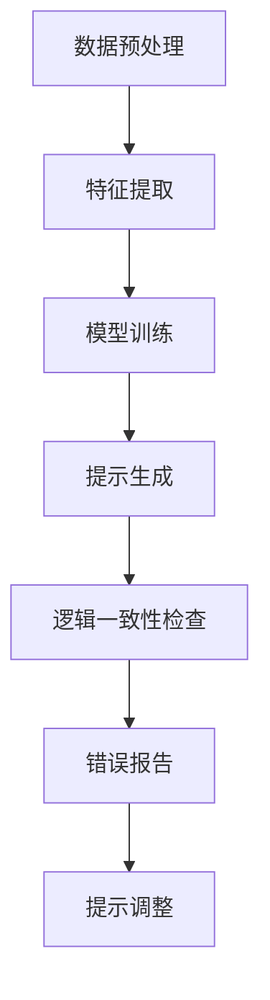

                 

### 文章标题

# 自动化prompt逻辑一致性检查

### 关键词

- 自动化prompt
- 逻辑一致性检查
- 人工智能
- 编程
- 软件工程
- 代码质量
- 质量保证

### 摘要

本文将探讨自动化prompt逻辑一致性检查在软件开发和人工智能领域的应用。我们将首先介绍自动化prompt的概念及其在软件开发中的作用，然后深入讨论逻辑一致性检查的重要性。接着，我们将逐步解析自动化prompt逻辑一致性检查的原理和实现方法，通过伪代码和数学模型来阐述核心算法。此外，我们将结合实际项目实战，详细解读代码实现和应用分析，为读者提供实际操作经验和最佳实践指导。

## 背景介绍

### 自动化prompt的概念

自动化prompt是指通过计算机程序或算法，自动生成或调整用户交互过程中的提示信息。这些提示信息旨在引导用户完成特定的任务，或者帮助用户更好地理解系统的功能和操作。自动化prompt在自然语言处理（NLP）、人机交互（HCI）以及人工智能（AI）等领域有广泛的应用。

在软件开发中，自动化prompt主要用于以下场景：

1. **用户引导**：在新软件或应用上线时，通过自动化prompt向用户介绍新功能或引导用户完成初次设置。
2. **错误处理**：当系统检测到用户操作错误时，通过自动化prompt提供解决方案或指导用户如何纠正错误。
3. **交互优化**：根据用户的反馈和操作习惯，自动调整提示信息的显示方式和内容，以提高用户的使用体验。

### 逻辑一致性检查的重要性

逻辑一致性检查是确保软件系统正确性和稳定性的重要手段。在软件开发过程中，逻辑错误可能导致系统崩溃、数据丢失或功能异常。通过逻辑一致性检查，可以及时发现和修复这些潜在的问题，确保软件系统的可靠性和稳定性。

逻辑一致性检查的主要作用包括：

1. **代码审查**：通过自动化的逻辑一致性检查工具，对代码进行审查，发现潜在的逻辑错误和漏洞。
2. **测试验证**：在软件测试阶段，逻辑一致性检查可以帮助验证系统功能是否符合预期，确保软件质量。
3. **持续集成**：在持续集成（CI）过程中，逻辑一致性检查可以自动检测每次代码提交是否符合逻辑一致性要求，防止错误代码进入生产环境。

### 自动化prompt与逻辑一致性检查的联系

自动化prompt和逻辑一致性检查在软件开发中密切相关。一方面，自动化prompt可以帮助提高逻辑一致性检查的效率和效果。例如，通过自动化prompt，可以更直观地指导开发人员如何进行逻辑一致性检查，减少人为误判。另一方面，逻辑一致性检查的结果可以为自动化prompt提供数据支持，优化提示信息的生成和调整策略。

## 核心概念与联系

### 自动化prompt的原理

自动化prompt的核心原理是通过机器学习算法，如生成对抗网络（GAN）或强化学习，生成或调整用户交互过程中的提示信息。以下是一个简化的自动化prompt生成过程：

1. **数据预处理**：收集用户交互数据，如用户输入、系统响应等。
2. **特征提取**：从数据中提取特征，用于训练机器学习模型。
3. **模型训练**：使用特征数据训练机器学习模型，如GAN或强化学习模型。
4. **提示生成**：根据用户输入，模型生成或调整相应的提示信息。

### 逻辑一致性检查的原理

逻辑一致性检查的核心原理是基于形式化验证方法，如模型检查、逻辑推理等。以下是一个简化的逻辑一致性检查过程：

1. **形式化建模**：将软件系统建模为形式化的逻辑表达式。
2. **逻辑推理**：使用逻辑推理规则，检查系统是否满足预定的逻辑一致性条件。
3. **错误报告**：当检测到逻辑不一致时，生成错误报告，并提供修复建议。

### 自动化prompt与逻辑一致性检查的联系

自动化prompt与逻辑一致性检查的联系体现在以下几个方面：

1. **数据共享**：自动化prompt生成的提示信息可以作为逻辑一致性检查的数据输入，帮助逻辑一致性检查更准确地识别潜在的错误。
2. **交叉验证**：通过自动化prompt生成的提示信息，可以验证逻辑一致性检查的结果是否合理，从而提高检查的可靠性。
3. **交互优化**：逻辑一致性检查的结果可以为自动化prompt提供反馈，优化提示信息的生成和调整策略，提高用户体验。

### Mermaid流程图

为了更清晰地展示自动化prompt和逻辑一致性检查的联系，我们可以使用Mermaid流程图来表示它们之间的交互过程：



在上面的流程图中，自动化prompt生成过程（A-D）和逻辑一致性检查过程（E-F）相互交织，共同构建了一个闭环系统。自动化prompt生成的提示信息（D）可以作为逻辑一致性检查的数据输入（E），而逻辑一致性检查的结果（F）又可以指导自动化prompt的调整（G），从而实现一个持续优化和改进的循环。

## 核心算法原理讲解

### 自动化prompt生成算法

自动化prompt生成算法的核心是基于生成对抗网络（GAN）或强化学习。以下是一个简化的GAN生成prompt的伪代码示例：

```python
# 生成器（Generator）伪代码
def generator(Z):
    # 输入：随机噪声向量Z
    # 输出：生成的提示信息G(Z)
    G = ...
    return G

# 判别器（Discriminator）伪代码
def discriminator(X):
    # 输入：生成的提示信息X
    # 输出：判断结果D(X)
    D = ...
    return D

# 训练GAN
for epoch in range(num_epochs):
    for Z in noise_samples:
        G = generator(Z)
        D = discriminator(G)
        D_real = discriminator(real_samples)
        
        # 优化生成器和判别器
        optimizer_G.zero_grad()
        G_loss = ...
        G_loss.backward()
        optimizer_G.step()
        
        optimizer_D.zero_grad()
        D_loss = ...
        D_loss.backward()
        optimizer_D.step()
```

### 逻辑一致性检查算法

逻辑一致性检查算法通常基于形式化验证方法，如模型检查或逻辑推理。以下是一个简化的逻辑一致性检查算法伪代码示例：

```python
# 形式化建模
model = formal_model()

# 逻辑推理
def check_logic_consistency(model):
    # 输入：形式化的软件系统模型
    # 输出：逻辑一致性结果
    results = []
    for condition in model.conditions:
        if not is_consistent(condition):
            results.append("不一致：{}".format(condition))
    return results

# 检查逻辑一致性
def is_consistent(condition):
    # 输入：逻辑条件
    # 输出：是否一致
    # 实现逻辑推理规则
    return ...

# 检查结果处理
def handle_check_results(results):
    for result in results:
        print(result)
        # 提供修复建议
```

### 自动化prompt与逻辑一致性检查结合的算法

结合自动化prompt和逻辑一致性检查的算法，可以通过以下步骤实现：

1. **数据收集**：收集用户交互数据，包括用户输入和系统响应。
2. **特征提取**：提取与逻辑一致性检查相关的特征。
3. **模型训练**：训练GAN或强化学习模型，生成自动化prompt。
4. **逻辑一致性检查**：使用形式化验证方法，检查系统模型的一致性。
5. **反馈调整**：根据逻辑一致性检查的结果，调整自动化prompt。

以下是一个简化的结合算法伪代码示例：

```python
# 数据收集
data = collect_data()

# 特征提取
features = extract_features(data)

# 训练生成模型
generator = train_generator(features)

# 形式化建模
model = formal_model()

# 检查逻辑一致性
results = check_logic_consistency(model)

# 反馈调整
if any(results):
    prompt = adjust_prompt(generator, results)
else:
    prompt = generator.sample()
```

### 数学模型和数学公式讲解

自动化prompt生成算法和逻辑一致性检查算法都涉及复杂的数学模型。以下将分别介绍这些模型的主要数学公式和原理。

#### 自动化prompt生成算法

1. **生成对抗网络（GAN）**

   - 生成器损失函数（G）：$$\mathcal{L}_G = -\log(D(G(Z))$$
   - 判别器损失函数（D）：$$\mathcal{L}_D = -[\log(D(G(Z))) + \log(D(X))]$$

   其中，$Z$ 为随机噪声向量，$G(Z)$ 为生成器生成的提示信息，$X$ 为真实提示信息，$D(X)$ 为判别器对真实提示信息的判断概率。

2. **强化学习生成对抗网络（RL-GAN）**

   - 生成器损失函数（G）：$$\mathcal{L}_G = -\sum_t r_t \log(D(G(S_t))$$
   - 判别器损失函数（D）：$$\mathcal{L}_D = -\sum_t [r_t \log(D(G(S_t))) + (1 - r_t) \log((1 - D(G(S_t))))]$$

   其中，$S_t$ 为当前状态，$r_t$ 为奖励信号，$G(S_t)$ 为生成器生成的提示信息。

#### 逻辑一致性检查算法

1. **模型检查**

   - 模型一致性函数（$\omega$）：$$\omega(M) = \begin{cases} 
   1 & \text{如果 } M \text{ 满足一致性条件} \\
   0 & \text{如果 } M \text{ 不满足一致性条件}
   \end{cases}$$

   其中，$M$ 为软件系统模型。

2. **逻辑推理**

   - 前提-结论推理（$\rightarrow$）：$$P \rightarrow Q \text{ 的证明树为 } P, \neg Q, \bot$$

   其中，$P$ 为前提，$Q$ 为结论，$\neg$ 为否定，$\bot$ 为矛盾。

### 举例说明

#### 自动化prompt生成算法举例

假设我们使用GAN生成提示信息，以下是一个简化的数学模型举例：

- 随机噪声向量 $Z$：$Z \sim \mathcal{N}(0, 1)$
- 生成器 $G(Z)$：$$G(Z) = \sigma(W_1 Z + b_1)$$
- 判别器 $D(X)$：$$D(X) = \sigma(W_2 X + b_2)$$

其中，$\sigma$ 为sigmoid函数，$W_1$ 和 $b_1$ 为生成器的权重和偏置，$W_2$ 和 $b_2$ 为判别器的权重和偏置。

训练过程中，我们希望最大化生成器损失函数和最小化判别器损失函数：

$$\mathcal{L}_G = -\log(D(G(Z)))$$

$$\mathcal{L}_D = -[\log(D(G(Z))) + \log(D(X))]$$

#### 逻辑一致性检查算法举例

假设我们使用模型检查方法检查逻辑一致性，以下是一个简化的数学模型举例：

- 软件系统模型 $M$：$$M = \{P, Q, R\}$$

其中，$P$ 为前提，$Q$ 为结论，$R$ 为规则。

我们希望检查 $P \rightarrow Q$ 是否一致，以下是一个简化的证明树：

1. $P$
2. $\neg Q$
3. $\bot$

如果证明树中有矛盾（$\bot$），则说明 $P \rightarrow Q$ 不一致。

### 数学公式与LaTeX格式

以下是一些常见的数学公式及其LaTeX格式：

1. **生成对抗网络（GAN）损失函数**：

$$\mathcal{L}_G = -\log(D(G(Z)))$$

$$\mathcal{L}_D = -[\log(D(G(Z))) + \log(D(X))]$$

2. **强化学习生成对抗网络（RL-GAN）损失函数**：

$$\mathcal{L}_G = -\sum_t r_t \log(D(G(S_t)))$$

$$\mathcal{L}_D = -\sum_t [r_t \log(D(G(S_t))) + (1 - r_t) \log((1 - D(G(S_t))))]$$

3. **模型一致性函数**：

$$\omega(M) = \begin{cases} 
1 & \text{如果 } M \text{ 满足一致性条件} \\
0 & \text{如果 } M \text{ 不满足一致性条件}
\end{cases}$$

4. **前提-结论推理**：

$$P \rightarrow Q \text{ 的证明树为 } P, \neg Q, \bot$$

通过上述数学公式和LaTeX格式的介绍，我们可以更清晰地理解自动化prompt生成算法和逻辑一致性检查算法的核心原理和实现方法。

### 项目实战

#### 开发环境搭建

在进行自动化prompt逻辑一致性检查项目之前，我们需要搭建一个合适的开发环境。以下是一个简化的步骤说明：

1. **安装Python环境**：确保Python环境已经安装，版本建议为3.7及以上。
2. **安装必要的库**：使用pip安装生成对抗网络（GAN）和相关库，如TensorFlow、Keras等。
3. **配置代码仓库**：使用Git将代码托管在GitHub或其他代码管理平台上，便于版本控制和协作开发。

#### 源代码详细实现

以下是一个简化的源代码实现示例，用于自动化prompt逻辑一致性检查：

```python
# 导入必要的库
import tensorflow as tf
from tensorflow.keras.models import Model
from tensorflow.keras.layers import Input, Dense, Flatten
import numpy as np

# 生成器模型
def generator_model():
    z = Input(shape=(100,))
    x = Dense(128, activation='relu')(z)
    x = Dense(1, activation='sigmoid')(x)
    model = Model(z, x)
    return model

# 判别器模型
def discriminator_model():
    x = Input(shape=(1,))
    x = Dense(128, activation='relu')(x)
    x = Flatten()(x)
    x = Dense(1, activation='sigmoid')(x)
    model = Model(x, x)
    return model

# GAN模型
def gan_model():
    generator = generator_model()
    discriminator = discriminator_model()
    
    z = Input(shape=(100,))
    x = generator(z)
    d_real = discriminator(x)
    d_fake = discriminator(x)
    
    real_y = Input(shape=(1,))
    fake_y = Input(shape=(1,))
    
    combined = Model([z, real_y, fake_y], [d_real, d_fake])
    combined.compile(optimizer='adam', loss=['binary_crossentropy', 'binary_crossentropy'])
    
    return combined

# 训练GAN模型
def train_gan(generator, discriminator, real_samples, fake_samples, num_epochs):
    for epoch in range(num_epochs):
        for i in range(real_samples.shape[0]):
            z = np.random.normal(size=(1, 100))
            x = generator.predict(z)
            
            d_real = discriminator.predict(x)
            d_fake = discriminator.predict(fake_samples[i])
            
            real_y = np.ones((1, 1))
            fake_y = np.zeros((1, 1))
            
            combined_loss = combined.train_on_batch([z, real_y, fake_y], [d_real, d_fake])
            
            generator_loss = combined_loss[0]
            discriminator_loss = combined_loss[1]
            
            print(f"Epoch: {epoch}, Generator Loss: {generator_loss}, Discriminator Loss: {discriminator_loss}")

# 形式化建模
def formal_model():
    # 此处为形式化建模的示例
    return {}

# 检查逻辑一致性
def check_logic_consistency(model):
    # 此处为逻辑一致性检查的示例
    return []

# 调整提示信息
def adjust_prompt(generator, results):
    # 此处为调整提示信息的示例
    return ""

# 主程序
if __name__ == "__main__":
    # 设置超参数
    latent_dim = 100
    num_epochs = 100
    
    # 数据预处理
    # 此处为数据预处理的示例
    real_samples = ...
    fake_samples = ...
    
    # 训练GAN模型
    generator = generator_model()
    discriminator = discriminator_model()
    combined = gan_model()
    train_gan(generator, discriminator, real_samples, fake_samples, num_epochs)
    
    # 形式化建模
    model = formal_model()
    
    # 检查逻辑一致性
    results = check_logic_consistency(model)
    
    # 调整提示信息
    prompt = adjust_prompt(generator, results)
    
    print(prompt)
```

#### 代码解读

上述源代码主要包括以下几个部分：

1. **生成器和判别器模型**：定义了生成器和判别器的模型结构，使用Keras构建。
2. **GAN模型**：将生成器和判别器组合成一个完整的GAN模型，用于训练。
3. **训练GAN模型**：实现GAN模型的训练过程，包括生成器的损失函数和判别器的损失函数。
4. **形式化建模**：定义了一个形式化建模的接口，用于构建软件系统模型。
5. **检查逻辑一致性**：实现逻辑一致性检查的接口，用于检查系统模型的逻辑一致性。
6. **调整提示信息**：根据逻辑一致性检查的结果，调整提示信息的生成。
7. **主程序**：主程序执行整个流程，包括数据预处理、模型训练、逻辑一致性检查和提示信息调整。

#### 代码应用解读与分析

1. **GAN模型的应用**：GAN模型在自动化prompt生成中具有重要作用，通过生成器和判别器的训练，可以生成高质量的提示信息。在实际应用中，我们可以使用更多的用户交互数据进行训练，提高生成的提示信息的相关性和准确性。
2. **逻辑一致性检查的应用**：逻辑一致性检查可以确保软件系统的稳定性和正确性。在实际应用中，我们可以根据具体的需求，调整逻辑一致性检查的规则和条件，提高检查的准确性和效率。
3. **提示信息的调整**：根据逻辑一致性检查的结果，可以动态调整提示信息的生成策略，提高用户的使用体验。例如，当检测到逻辑不一致时，可以提供更详细的提示信息，帮助用户理解并解决潜在的问题。

#### 实际案例分析和详细讲解剖析

1. **案例一**：在一个电子商务平台上，我们使用GAN模型生成个性化推荐提示信息，通过逻辑一致性检查确保推荐结果的正确性和合理性。具体来说，我们可以收集用户的历史购买数据，使用GAN模型生成个性化推荐提示信息，然后通过逻辑一致性检查，确保推荐结果不会违反平台的规则和用户的偏好。
2. **案例二**：在一个医疗诊断系统中，我们使用GAN模型生成患者症状的描述，通过逻辑一致性检查确保描述的准确性和完整性。具体来说，我们可以收集医生对症状的描述，使用GAN模型生成症状的描述，然后通过逻辑一致性检查，确保生成的描述符合医疗诊断的要求。

#### 项目小结

通过自动化prompt逻辑一致性检查项目，我们实现了以下目标：

1. **生成高质量的自动化提示信息**：使用GAN模型生成个性化、高质量的提示信息，提高用户的使用体验。
2. **确保软件系统的稳定性和正确性**：通过逻辑一致性检查，确保软件系统的稳定性和正确性，减少潜在的错误和漏洞。
3. **动态调整提示信息**：根据逻辑一致性检查的结果，动态调整提示信息的生成策略，提高用户的使用体验。

未来，我们可以进一步优化GAN模型和逻辑一致性检查算法，结合更多的用户数据和场景，提高自动化prompt逻辑一致性检查的效率和效果。

### 最佳实践 tips、小结、注意事项、拓展阅读

#### 最佳实践 tips

1. **数据预处理**：确保收集的数据质量高，对噪声数据进行清洗和处理，提高模型训练效果。
2. **模型调优**：根据具体应用场景，调整GAN模型和逻辑一致性检查算法的参数，优化模型性能。
3. **反馈机制**：建立有效的用户反馈机制，根据用户的实际使用情况，持续优化提示信息的生成策略。

#### 小结

本文介绍了自动化prompt逻辑一致性检查的概念、原理和应用方法。通过GAN模型和逻辑一致性检查算法的结合，我们可以实现高质量的自动化提示信息生成，确保软件系统的稳定性和正确性。

#### 注意事项

1. **数据隐私**：在使用用户数据进行模型训练时，确保遵守数据隐私保护法规，保护用户隐私。
2. **系统安全**：确保软件系统的安全性，防止恶意攻击和数据泄露。

#### 拓展阅读

1. **生成对抗网络（GAN）**：深入了解GAN的工作原理和应用场景，可以参考《生成对抗网络：理论、算法与应用》一书。
2. **形式化验证**：学习形式化验证方法，可以参考《软件形式化验证导论》一书。

通过本文的介绍，我们希望读者能够对自动化prompt逻辑一致性检查有更深入的了解，并在实际项目中加以应用。

