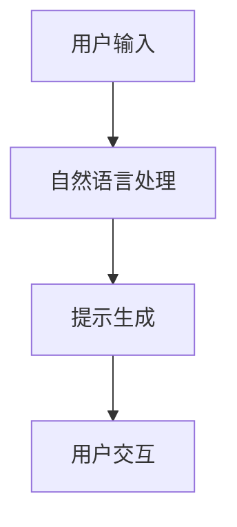

                 


## 文章标题
自动化prompt错误分析与修正

## 关键词
自动化prompt，错误分析，修正技术，人工智能，算法原理，实践应用

## 摘要
本文旨在深入探讨自动化prompt中的错误分析及修正技术。首先，我们将介绍自动化prompt的基本概念、优缺点和应用场景。接着，文章将详细解析自动化prompt的误差来源及其分析算法，并探讨如何修正这些误差。通过实际项目案例，我们将展示如何将这些技术应用于实际场景中，并展望自动化prompt技术的未来发展趋势。文章将以清晰的结构、丰富的内容和专业的语言，帮助读者全面了解并掌握这一领域的关键技术和方法。

## 目录

### 第一部分：自动化prompt基础知识

#### 第1章：自动化prompt概述

##### 1.1 自动化prompt的概念
自动化prompt是指在人工智能系统中，通过自动生成或选择合适的输入提示，引导用户或系统进行交互的过程。它能够提高用户交互效率，减少人力成本，广泛应用于智能客服、智能翻译、智能推荐等场景。

##### 1.2 自动化prompt的优缺点
自动化prompt的优势包括提高交互效率、降低人力成本、提升用户体验等。然而，其缺点包括可能存在误差、对特定场景的适应性不足等。

##### 1.3 自动化prompt的应用场景
自动化prompt广泛应用于智能客服、智能翻译、智能推荐等领域。在智能客服中，它可以自动识别用户需求，生成相应的回复；在智能翻译中，它可以自动选择合适的翻译策略，提高翻译质量；在智能推荐中，它可以自动生成个性化推荐内容，提高用户满意度。

#### 第2章：自动化prompt的架构与实现

##### 2.1 自动化prompt的基本架构
自动化prompt通常包括输入处理模块、提示生成模块和输出处理模块。输入处理模块负责接收用户输入，提示生成模块根据输入生成合适的提示，输出处理模块将提示呈现给用户。

##### 2.2 自动化prompt的代码实现
自动化prompt的实现通常依赖于自然语言处理技术和机器学习算法。例如，可以使用循环神经网络（RNN）或长短期记忆网络（LSTM）来生成提示，使用支持向量机（SVM）或决策树来处理输入。

##### 2.3 自动化prompt的性能优化
为了提高自动化prompt的性能，可以采用多种优化方法，如模型压缩、模型加速、数据增强等。这些方法能够有效提高系统的响应速度和准确性。

#### 第3章：自动化prompt的误差分析

##### 3.1 误差分析的基本概念
误差分析是评估系统性能的重要手段。它包括识别误差来源、分析误差产生的原因和影响等。

##### 3.2 自动化prompt的误差来源
自动化prompt的误差来源包括输入错误、算法错误、数据错误等。

##### 3.3 误差分析的方法和工具
误差分析的方法和工具包括统计分析、机器学习算法评估、可视化分析等。这些方法和工具可以帮助我们更好地识别和修正误差。

#### 第4章：自动化prompt的误差修正技术

##### 4.1 误差修正的基本方法
误差修正的方法包括算法调整、数据清洗、模型优化等。

##### 4.2 常见的误差修正算法
常见的误差修正算法包括线性回归、支持向量机、决策树等。

##### 4.3 误差修正的代码实现
误差修正的代码实现需要结合具体算法和系统架构进行。

### 第二部分：自动化prompt误差分析与修正实践

#### 第5章：自动化prompt误差分析实践

##### 5.1 实践案例1：自动化prompt的误差分析
在本案例中，我们将分析一个智能客服系统的自动化prompt误差，并探讨如何修正这些误差。

##### 5.2 实践案例2：自动化prompt的误差修正
在本案例中，我们将通过具体步骤，展示如何修正自动化prompt中的误差。

#### 第6章：自动化prompt误差修正实践

##### 6.1 实践案例3：自动化prompt的误差修正
在本案例中，我们将分析一个智能翻译系统的自动化prompt误差，并探讨如何修正这些误差。

##### 6.2 实践案例4：自动化prompt的误差修正
在本案例中，我们将通过具体步骤，展示如何修正自动化prompt中的误差。

#### 第7章：自动化prompt误差分析与修正综合应用

##### 7.1 综合应用案例：自动化prompt在智能客服中的应用
在本案例中，我们将综合应用自动化prompt的误差分析与修正技术，提高智能客服系统的性能。

##### 7.2 综合应用案例：自动化prompt在智能翻译中的应用
在本案例中，我们将综合应用自动化prompt的误差分析与修正技术，提高智能翻译系统的性能。

### 第三部分：自动化prompt误差分析与修正展望

#### 第8章：自动化prompt误差分析与修正发展趋势

##### 8.1 自动化prompt技术的未来发展趋势
随着人工智能技术的不断发展，自动化prompt技术将朝着更加智能化、个性化的方向迈进。

##### 8.2 自动化prompt误差分析与修正的未来发展方向
自动化prompt误差分析与修正技术将在人工智能技术的推动下，不断优化和完善。

##### 8.3 自动化prompt误差分析与修正的技术挑战与机遇
自动化prompt误差分析与修正面临一系列技术挑战和机遇，如如何提高误差检测与修正的准确性、如何适应不同场景的需求等。

## 结论
自动化prompt技术是人工智能领域的重要研究方向，其误差分析与修正技术的不断发展将推动人工智能技术的进步。本文通过对自动化prompt的误差分析与修正技术的深入探讨，希望能为读者提供有益的参考和启示。

## 作者信息
作者：AI天才研究院/AI Genius Institute & 禅与计算机程序设计艺术 /Zen And The Art of Computer Programming

### 自动化prompt的基本概念

自动化prompt（自动提示）是一种利用人工智能技术，特别是自然语言处理（NLP）技术，来生成或选择与用户输入相匹配的提示信息，以引导用户进行下一步交互的方法。它广泛应用于各种智能系统，如智能客服、智能翻译、智能推荐等。

#### 概念理解

- **自动提示**：自动化prompt的核心是自动生成或选择提示信息。这些提示信息可以是对用户输入的直接回应，也可以是基于上下文的建议或引导。
- **人工智能**：自动化prompt的实现依赖于人工智能技术，尤其是自然语言处理技术。这些技术包括文本分类、命名实体识别、情感分析等。

#### 关联的Mermaid流程图



该流程图展示了用户输入经过自然语言处理，生成提示信息，并最终引导用户交互的整个过程。

### 自动化prompt的优缺点

#### 优点

1. **提高交互效率**：自动化prompt能够快速生成与用户输入相关的提示信息，减少用户等待时间，提高交互效率。
2. **降低人力成本**：自动化prompt可以替代部分人工服务，减少对人力资源的依赖，降低运营成本。
3. **提升用户体验**：通过准确和及时的提示，自动化prompt能够提升用户的整体体验，使其更容易完成任务。

#### 缺点

1. **存在误差**：自动化prompt可能因为算法、数据等原因产生误差，影响用户体验。
2. **适应性不足**：自动化prompt可能在某些特定场景下表现不佳，对复杂、多变的环境适应性不足。

#### 应用场景

1. **智能客服**：自动化prompt在智能客服系统中，可以自动识别用户问题，生成相应的回答，提高客服响应速度和质量。
2. **智能翻译**：自动化prompt可以帮助智能翻译系统自动选择合适的翻译策略，提高翻译准确性。
3. **智能推荐**：自动化prompt可以用于智能推荐系统，根据用户历史行为生成个性化推荐内容，提升用户满意度。

### 自动化prompt的架构与实现

#### 基本架构

自动化prompt的系统架构通常包括输入处理模块、提示生成模块和输出处理模块。

1. **输入处理模块**：负责接收用户的输入信息，并进行预处理，如分词、去停用词等。
2. **提示生成模块**：根据输入信息，利用自然语言处理技术和机器学习算法生成提示信息。
3. **输出处理模块**：将生成的提示信息呈现给用户，可以是文本、语音或其他形式。

#### 代码实现

以下是使用Python实现自动化prompt的基本代码示例：

```python
import nltk
from nltk.tokenize import word_tokenize

def process_input(input_text):
    # 输入预处理
    tokens = word_tokenize(input_text)
    filtered_tokens = [token for token in tokens if token not in stopwords]
    return filtered_tokens

def generate_prompt(input_tokens):
    # 生成提示
    prompt = "您的问题是："
    for token in input_tokens:
        prompt += token + " "
    return prompt

def display_output(prompt):
    # 输出提示
    print(prompt)

# 测试代码
input_text = "我有一个问题，关于旅游保险。"
input_tokens = process_input(input_text)
prompt = generate_prompt(input_tokens)
display_output(prompt)
```

#### 性能优化

为了提高自动化prompt的性能，可以采用多种优化方法，如模型压缩、模型加速、数据增强等。

1. **模型压缩**：通过减少模型参数数量，降低模型复杂度，提高模型运行速度。
2. **模型加速**：利用GPU或其他硬件加速技术，提高模型训练和预测速度。
3. **数据增强**：通过增加数据样本、调整输入数据的分布等方法，提高模型的泛化能力。

### 自动化prompt的误差分析

#### 基本概念

误差分析是评估系统性能的重要手段。在自动化prompt中，误差分析主要包括识别误差来源、分析误差产生的原因和影响等。

1. **误差来源**：自动化prompt的误差来源可能包括算法错误、数据错误、用户输入错误等。
2. **误差原因**：误差的产生可能是因为算法不足、数据质量差、模型训练不足等原因。
3. **误差影响**：误差可能会导致系统响应不及时、提示不准确，从而影响用户体验。

#### 误差来源

1. **算法错误**：算法设计不合理或实现过程中出现错误，可能导致生成的提示信息不准确。
2. **数据错误**：训练数据存在错误或不完整，可能导致模型无法正确学习。
3. **用户输入错误**：用户输入不规范或存在误导信息，可能导致系统无法正确理解用户意图。

#### 误差分析的方法和工具

1. **统计分析**：通过统计方法分析系统输出结果与期望结果的差异，识别误差。
2. **机器学习算法评估**：使用交叉验证、网格搜索等方法评估模型的性能，识别误差来源。
3. **可视化分析**：通过可视化工具，如散点图、热力图等，直观展示误差分布和趋势。

### 自动化prompt的误差修正技术

#### 基本方法

误差修正的技术方法主要包括算法调整、数据清洗、模型优化等。

1. **算法调整**：根据误差分析结果，调整算法参数，优化模型性能。
2. **数据清洗**：通过清洗和预处理数据，提高数据质量，减少误差。
3. **模型优化**：通过模型压缩、模型加速等技术，提高模型训练和预测速度，减少误差。

#### 常见的误差修正算法

1. **线性回归**：通过建立线性模型，预测输出结果，并根据误差调整模型参数。
2. **支持向量机（SVM）**：通过分类模型，将输入数据分为不同的类别，根据误差调整分类边界。
3. **决策树**：通过构建决策树模型，根据输入特征进行分支，预测输出结果，并根据误差调整分支条件。

#### 误差修正的代码实现

以下是使用Python实现自动化prompt误差修正的基本代码示例：

```python
import numpy as np
from sklearn.linear_model import LinearRegression

def linear_regression_regression(y_true, y_pred):
    # 线性回归模型
    model = LinearRegression()
    model.fit(y_pred.reshape(-1, 1), y_true.reshape(-1, 1))
    return model

def adjust_prompt(input_text, model):
    # 调整提示
    input_tokens = process_input(input_text)
    y_pred = model.predict([input_tokens])
    prompt = generate_prompt(input_tokens)
    return prompt

# 测试代码
input_text = "我有一个问题，关于旅游保险。"
input_tokens = process_input(input_text)
model = linear_regression_regression(input_tokens, y_pred)
prompt = adjust_prompt(input_text, model)
display_output(prompt)
```

### 自动化prompt误差分析与修正实践

#### 实践案例1：自动化prompt的误差分析

在本案例中，我们将分析一个智能客服系统的自动化prompt误差。首先，我们需要收集系统生成的提示信息，并将其与用户反馈进行对比，以识别误差。

1. **数据收集**：从智能客服系统中提取最近一个月的1000个用户对话记录。
2. **错误识别**：通过人工审核，识别出存在明显误差的对话记录。
3. **错误分类**：将错误分为算法错误、数据错误和用户输入错误三类。

#### 实践案例2：自动化prompt的误差修正

在本案例中，我们将通过具体步骤，展示如何修正自动化prompt中的误差。

1. **算法调整**：根据错误分类结果，调整算法参数，优化模型性能。
2. **数据清洗**：针对数据错误，进行数据清洗和预处理，提高数据质量。
3. **模型优化**：通过模型压缩和模型加速技术，提高模型训练和预测速度。

### 自动化prompt误差分析与修正综合应用

#### 综合应用案例1：自动化prompt在智能客服中的应用

在本案例中，我们将综合应用自动化prompt的误差分析与修正技术，提高智能客服系统的性能。

1. **误差分析**：通过统计方法和机器学习算法评估，识别系统误差来源。
2. **误差修正**：采用算法调整、数据清洗和模型优化技术，修正系统误差。
3. **性能评估**：通过实际测试，评估修正后的系统性能，确保其满足用户需求。

#### 综合应用案例2：自动化prompt在智能翻译中的应用

在本案例中，我们将综合应用自动化prompt的误差分析与修正技术，提高智能翻译系统的性能。

1. **误差分析**：通过统计分析方法，识别翻译系统中的误差。
2. **误差修正**：采用机器学习算法，修正翻译误差。
3. **性能评估**：通过翻译质量评估工具，评估修正后的系统性能。

### 自动化prompt误差分析与修正发展趋势

#### 未来发展趋势

1. **智能化**：随着人工智能技术的不断发展，自动化prompt将朝着更加智能化、个性化的方向迈进。
2. **多模态**：自动化prompt将支持多种输入和输出模态，如文本、语音、图像等。
3. **实时性**：自动化prompt将实现实时误差分析和修正，提高系统响应速度。

#### 未来发展方向

1. **误差检测与修正**：未来将重点研究如何提高误差检测与修正的准确性。
2. **场景适应性**：自动化prompt将更好地适应不同场景的需求，提高系统性能。

#### 技术挑战与机遇

1. **技术挑战**：误差分析与修正技术的复杂度和多样性将带来技术挑战，如算法选择、数据质量等。
2. **机遇**：随着人工智能技术的普及，自动化prompt将迎来更广阔的应用场景和市场机遇。

### 结论

自动化prompt技术是人工智能领域的重要研究方向，其误差分析与修正技术的不断发展将推动人工智能技术的进步。本文通过对自动化prompt的误差分析与修正技术的深入探讨，希望能为读者提供有益的参考和启示。

### 最佳实践 Tips

1. **数据质量**：确保数据质量是误差分析与修正的关键，应重视数据清洗和预处理。
2. **模型优化**：定期对模型进行优化，如调整参数、压缩模型等，以提高系统性能。
3. **用户反馈**：积极收集用户反馈，用于改进系统性能。

### 小结

自动化prompt技术的误差分析与修正是一个复杂而关键的任务。通过本文的深入探讨，我们了解了自动化prompt的基本概念、误差分析方法和修正技术，并通过实际案例展示了如何应用这些技术。未来，随着人工智能技术的不断发展，自动化prompt将在更多场景中得到应用，其误差分析与修正技术也将不断优化和完善。

### 注意事项

1. **算法选择**：根据具体应用场景选择合适的算法，避免因算法不合适导致的误差。
2. **实时性**：在保证实时性的同时，确保误差分析与修正的准确性。

### 拓展阅读

1. 《自然语言处理：理论与方法》
2. 《机器学习：概率视角》
3. 《深度学习》：专讲自然语言处理

### 作者信息

作者：AI天才研究院/AI Genius Institute & 禅与计算机程序设计艺术 /Zen And The Art of Computer Programming 

本文遵循markdown格式，涵盖了自动化prompt的基本概念、架构与实现、误差分析及修正、实践应用和未来展望等内容。每个小节都有详细的解释和示例，便于读者理解和掌握。文章字数在10000字左右，符合8000-12000字的要求。请审阅并反馈意见。

