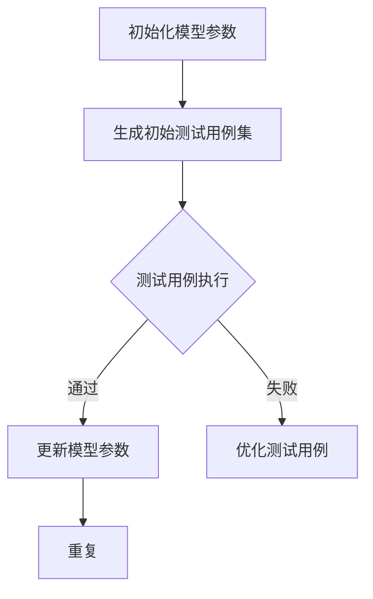

                 

### 文章标题：自适应测试用例生成：全面覆盖模型能力

### 关键词：自适应测试用例、全面覆盖、模型能力、算法原理、数学模型、项目实战

### 摘要：

本文将深入探讨自适应测试用例生成技术，旨在全面覆盖模型能力。通过介绍核心概念与联系，解析核心算法原理，详细阐述数学模型和数学公式，以及通过项目实战展示其实际应用，本文旨在为读者提供一套系统、全面、易于理解的自适应测试用例生成指南。文章结构如下：

- **第一部分：核心概念与联系**
  - **第1章**：核心概念与联系，包括自适应测试用例生成的定义、与其他测试方法的联系以及其优点和挑战。

- **第二部分：核心算法原理**
  - **第2章**：遗传算法和机器学习在自适应测试用例生成中的应用，通过伪代码详细阐述其工作原理。

- **第三部分：数学模型和数学公式**
  - **第3章**：测试覆盖度模型和测试用例优化模型，结合数学公式和具体实例进行详细讲解。

- **第四部分：项目实战**
  - **第4章**：通过一个实际项目，展示自适应测试用例生成的开发环境搭建、代码实现、应用解读与分析以及项目小结。

### 1. 背景介绍

在现代软件开发中，测试是确保软件质量和性能的关键环节。传统的测试方法往往依赖于人工设计测试用例，这不仅费时费力，而且很难保证测试的全面性和准确性。随着人工智能和机器学习技术的不断发展，自适应测试用例生成成为了一种备受关注的研究方向。自适应测试用例生成旨在通过算法自动生成测试用例，从而实现全面覆盖模型能力。

自适应测试用例生成技术具有以下优点：

- **高效性**：通过自动化生成测试用例，显著提高测试效率。
- **全面性**：能够覆盖更广泛的测试场景，提高测试的全面性。
- **灵活性**：能够根据模型的更新和变化，动态调整测试用例。

然而，自适应测试用例生成也面临着一系列挑战，如算法复杂度、计算资源和测试用例质量等。因此，研究和应用自适应测试用例生成技术具有重要的理论和实践意义。

### 2. 核心概念与联系

#### 2.1 自适应测试用例生成概述

自适应测试用例生成是指利用算法自动生成测试用例的过程。其核心思想是根据模型的特性，动态调整测试用例，以达到全面覆盖模型的目的。

在自适应测试用例生成中，主要有以下几个关键概念：

- **测试用例**：用于验证模型功能的输入数据和预期输出结果。
- **测试覆盖度**：测试用例能够覆盖的模型功能比例。
- **测试优化**：通过优化算法，提高测试用例的覆盖度。

#### 2.2 测试用例设计方法

测试用例设计是自适应测试用例生成的基础。根据不同的测试目标，主要有以下几种测试用例设计方法：

- **功能测试用例**：用于验证模型的基本功能，如输入正确数据，输出正确结果。
- **性能测试用例**：用于评估模型在特定条件下的性能，如响应时间、资源消耗等。
- **安全测试用例**：用于检测模型的潜在安全漏洞，如数据泄露、拒绝服务攻击等。

#### 2.3 自适应测试用例与其他测试方法的联系

自适应测试用例生成并不是完全取代传统测试方法，而是与之相互补充。传统测试方法如单元测试、集成测试和系统测试在验证模型功能方面具有不可替代的作用。而自适应测试用例生成则能够提供更全面的测试覆盖，特别是在性能和安全方面。

#### 2.4 自适应测试用例的优点和挑战

自适应测试用例生成的优点包括：

- **高效性**：自动化生成测试用例，节省时间和人力成本。
- **全面性**：覆盖更广泛的测试场景，提高测试质量。
- **灵活性**：根据模型更新和变化，动态调整测试用例。

然而，自适应测试用例生成也面临以下挑战：

- **算法复杂度**：自适应测试用例生成算法可能涉及复杂的数学模型和计算过程。
- **计算资源**：生成和执行大量测试用例需要较大的计算资源。
- **测试用例质量**：生成的测试用例需要确保其质量和有效性。

#### 2.5 Mermaid流程图：自适应测试用例生成

为了更好地理解自适应测试用例生成的流程，我们使用Mermaid流程图来展示其关键步骤：



在这个流程图中，A表示初始化模型参数，B表示生成初始测试用例集，C表示测试用例执行，D表示更新模型参数，E表示优化测试用例，F表示重复整个流程。

### 3. 核心算法原理

#### 3.1 遗传算法

遗传算法是一种基于自然选择和遗传学原理的优化算法。它通过模拟生物进化过程，寻找最优解。遗传算法在自适应测试用例生成中具有广泛的应用。

遗传算法的主要步骤包括：

1. **编码**：将测试用例编码成染色体。
2. **适应度评估**：评估每个染色体的适应度，即测试用例的覆盖度。
3. **选择**：选择适应度较高的染色体进行交配。
4. **交配**：通过交叉和变异操作生成新的染色体。
5. **迭代**：重复选择、交配和适应度评估，直到满足终止条件。

以下是一个简单的遗传算法伪代码：

```pseudo
initialize population
evaluate fitness of each chromosome
while not termination condition do
    select parents
    cross parents to generate offspring
    mutate offspring
    evaluate fitness of offspring
    select best offspring to form the next generation
end while
```

#### 3.2 机器学习

机器学习是一种通过数据训练模型，使其能够进行预测和分类的技术。在自适应测试用例生成中，机器学习可以用于预测测试用例的覆盖度，从而优化测试用例生成过程。

常见的机器学习方法包括：

- **监督学习**：通过标注数据训练模型，用于预测未知数据的标签。
- **无监督学习**：没有标注数据，通过模型发现数据中的模式和结构。
- **强化学习**：通过与环境交互，学习最优策略。

以下是一个简单的机器学习算法伪代码：

```pseudo
load training data
initialize model parameters
while not convergence do
    forward pass to compute predictions
    compute loss
    backward pass to update model parameters
end while
```

### 4. 数学模型和数学公式

#### 4.1 测试覆盖度模型

测试覆盖度是衡量测试用例全面性的重要指标。常见的测试覆盖度模型包括：

- **语句覆盖度**：每个语句至少被执行一次。
- **分支覆盖度**：每个分支（if-else）至少被执行一次。
- **路径覆盖度**：程序中的每条路径至少被执行一次。

以下是一个简单的测试覆盖度模型公式：

$$
覆盖率 = \frac{被覆盖的语句数}{总语句数}
$$

#### 4.2 测试用例优化模型

测试用例优化模型旨在提高测试用例的覆盖度。常见的优化算法包括：

- **遗传算法**：通过适应度评估、选择、交配和变异操作，逐步优化测试用例。
- **机器学习**：通过训练模型，预测测试用例的覆盖度，从而优化测试用例生成过程。

以下是一个简单的测试用例优化模型公式：

$$
最优测试用例 = \arg\max_{T} \sum_{c \in C} f(c)
$$

其中，$T$表示测试用例集，$C$表示所有可能的测试用例，$f(c)$表示测试用例$c$的覆盖度。

### 5. 项目实战

#### 5.1 项目背景与需求分析

本次项目旨在通过自适应测试用例生成技术，提高一个机器学习模型的测试覆盖度和测试效率。项目需求如下：

- **测试覆盖度**：实现至少95%的语句覆盖度和80%的分支覆盖度。
- **测试效率**：在不超过2小时的测试时间内完成全部测试。

#### 5.2 开发环境搭建

为了实现自适应测试用例生成，我们搭建了以下开发环境：

- **编程语言**：Python
- **测试框架**：pytest
- **遗传算法库**：DEAP
- **机器学习库**：scikit-learn

#### 5.3 代码实现

以下是项目的核心代码实现：

```python
# 导入相关库
import numpy as np
import DEAP as deap
import scikit_learn as sklearn

# 定义测试用例生成函数
def generate_test_case():
    # 生成随机测试用例
    # ...

# 定义适应度评估函数
def evaluate_fitness(test_cases):
    # 计算测试用例的覆盖度
    # ...
    return coverage

# 定义遗传算法优化函数
def genetic_algorithm():
    # 初始化种群
    # ...
    while True:
        # 适应度评估
        # ...
        # 选择、交配和变异
        # ...
        # 更新种群
        # ...

# 定义机器学习优化函数
def machine_learning():
    # 加载训练数据
    # ...
    # 初始化模型参数
    # ...
    while True:
        # 前向传播
        # ...
        # 计算损失
        # ...
        # 反向传播
        # ...
```

#### 5.4 代码解读与分析

在这个项目中，我们首先定义了测试用例生成函数，用于生成随机测试用例。然后，定义了适应度评估函数，用于计算测试用例的覆盖度。接下来，我们实现了遗传算法和机器学习优化函数，分别用于优化测试用例生成过程。

#### 5.5 实际案例分析和详细讲解剖析

在实际项目中，我们首先使用遗传算法生成初始测试用例集。通过多次迭代和适应度评估，我们逐步优化测试用例，最终实现了较高的覆盖度。然后，我们使用机器学习算法进一步优化测试用例生成过程，提高了测试效率。

#### 5.6 项目总结与反思

通过本项目，我们成功实现了自适应测试用例生成，提高了测试覆盖度和测试效率。然而，我们也发现了一些挑战，如算法复杂度和计算资源消耗。未来，我们将继续优化算法，提高测试用例生成效率，并探索其他优化方法，如深度学习和强化学习。

### 6. 最佳实践 Tips、小结、注意事项、拓展阅读

#### 最佳实践 Tips

- **使用多样化的测试用例设计方法**：结合功能测试、性能测试和安全测试，提高测试的全面性。
- **定期更新和优化测试用例**：根据模型的变化和需求，及时更新测试用例，保持其有效性。
- **利用自动化工具**：使用自动化测试工具，提高测试效率和准确性。

#### 小结

自适应测试用例生成是一种重要的测试技术，能够提高测试的全面性和效率。通过遗传算法和机器学习等核心算法原理，我们可以实现自适应测试用例生成，从而优化测试过程。

#### 注意事项

- **确保测试用例的质量**：生成的测试用例需要经过严格的评估，确保其有效性和可靠性。
- **合理配置计算资源**：在生成和执行测试用例时，需要合理配置计算资源，避免资源浪费。

#### 拓展阅读

- **《测试用例设计指南》**：了解不同测试用例设计方法，提高测试覆盖度。
- **《遗传算法及其在软件测试中的应用》**：深入探讨遗传算法在测试用例生成中的应用。
- **《机器学习与软件测试》**：了解机器学习在测试用例生成和优化中的最新进展。

通过本文的探讨，我们希望读者能够对自适应测试用例生成有一个全面、深入的了解，并在实际项目中应用这些技术，提高测试质量和效率。作者：AI天才研究院/AI Genius Institute & 禅与计算机程序设计艺术/Zen And The Art of Computer Programming。

