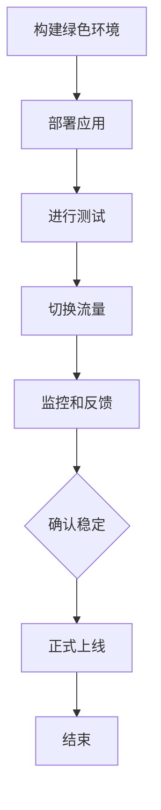
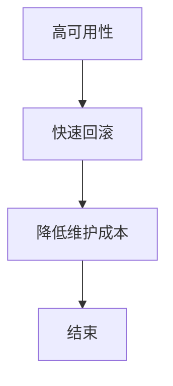
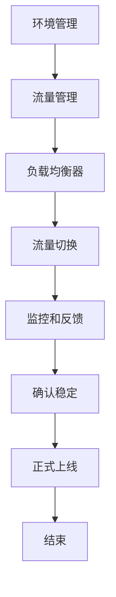
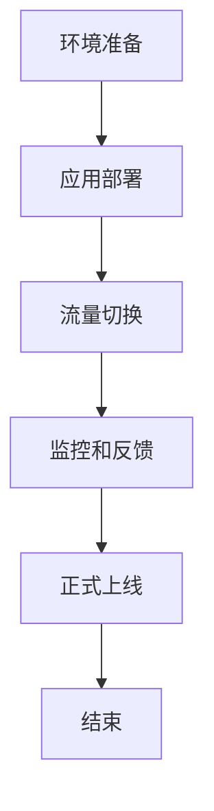
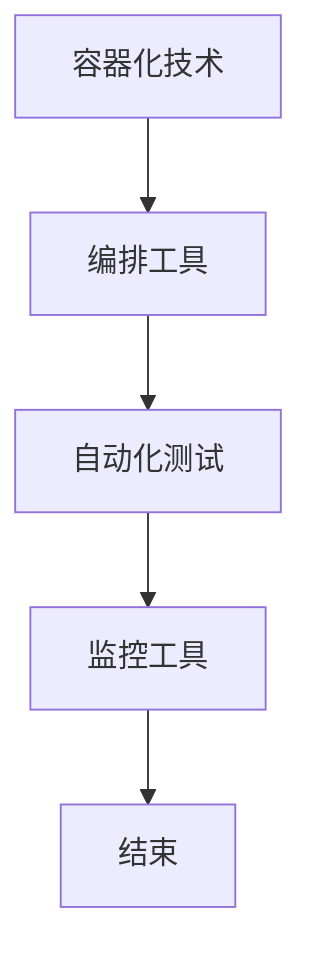
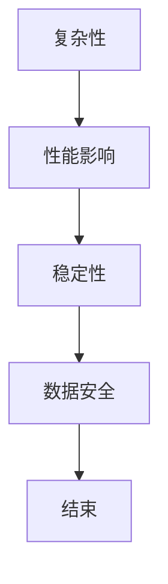
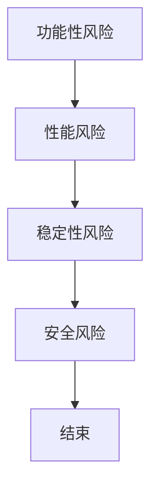
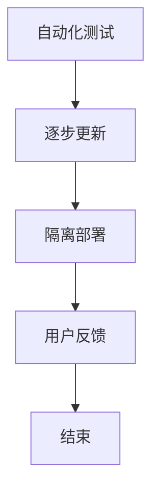

                 

# 《蓝绿部署：降低LLM应用更新的风险》

> 关键词：蓝绿部署、LLM应用更新、风险控制、技术架构、项目实战

> 摘要：本文将深入探讨蓝绿部署在降低LLM（大型语言模型）应用更新风险方面的应用。首先介绍蓝绿部署的基本概念和原理，随后分析LLM应用更新可能面临的风险，并解释如何使用蓝绿部署来降低这些风险。通过实际案例，我们将展示蓝绿部署的实施过程及其效果。最后，总结蓝绿部署的优势和未来发展趋势，为读者提供最佳实践建议。

## 引言

在当今快速发展的技术世界中，大型语言模型（LLM）的应用日益广泛，从自然语言处理到智能问答，LLM正在改变我们的工作方式和生活方式。然而，随着应用的不断扩大和更新，如何在保证服务质量的同时降低更新风险成为了一个重要问题。蓝绿部署作为一种成熟的技术手段，可以有效解决这一问题。

### 为什么需要蓝绿部署

传统的部署方式通常会将应用直接更新到生产环境，这可能会带来一系列问题，如：

- 更新失败可能导致服务中断，影响用户体验。
- 更新过程中，如果出现错误，难以快速回滚到之前的稳定版本。
- 更新后的性能和稳定性难以预测，可能带来新的问题。

而蓝绿部署通过将应用分为两个版本（蓝色版本和绿色版本），在生产环境中同时运行这两个版本，从而实现了平滑更新和快速回滚，大大降低了更新风险。

## 第一部分：蓝绿部署基础

### 第1章：什么是蓝绿部署

#### 定义

蓝绿部署（Blue-Green Deployment）是一种部署策略，通过在现有环境（蓝色环境）中引入新的环境（绿色环境），逐步将流量切换到新环境，从而实现应用的更新和升级。新环境（绿色环境）在投入使用前会与旧环境（蓝色环境）进行对比测试，确保新环境的稳定性和性能符合预期。

#### 与传统部署的区别

| 传统部署 | 蓝绿部署 |
| --- | --- |
| 应用直接更新到生产环境 | 新环境在投入使用前进行对比测试 |
| 更新失败后难以回滚 | 更新失败后可以快速回滚到旧环境 |
| 更新期间可能影响用户体验 | 更新期间用户体验不受影响 |

### 第2章：蓝绿部署的优势

#### 高可用性

蓝绿部署通过同时运行两个环境，确保在任何情况下都至少有一个环境是可用的。即使一个环境出现问题，用户也可以无缝切换到另一个环境，从而保证了服务的高可用性。

#### 快速回滚

在蓝绿部署中，如果更新后的新环境出现问题，可以立即回滚到旧环境，避免对用户造成影响。这一过程通常可以在短时间内完成，大大降低了更新失败的风险。

#### 降低维护成本

蓝绿部署可以减少服务中断的时间，从而降低维护成本。此外，通过自动化流程，还可以降低人工操作的错误率。

### 第3章：蓝绿部署的架构

#### 基本架构

蓝绿部署的基本架构包括两个环境：蓝色环境和绿色环境。蓝色环境是当前正在使用的环境，绿色环境是更新后的环境。两个环境之间通过负载均衡器进行流量切换。

#### 扩展架构

在实际应用中，蓝绿部署还可以根据需求进行扩展，如增加灰度发布功能，逐步将流量切换到新环境，进一步降低更新风险。

### 第4章：蓝绿部署的流程

#### 部署流程概述

1. 构建绿色环境：构建新环境的镜像或虚拟机，安装应用及依赖。
2. 部署应用：将应用部署到绿色环境，并进行测试。
3. 流量切换：通过负载均衡器将部分流量切换到绿色环境，进行对比测试。
4. 正式上线：确认绿色环境稳定后，将全部流量切换到绿色环境。

#### 部署前准备

1. 确定部署策略：根据应用特点确定蓝绿部署的具体方案。
2. 环境准备：准备蓝色和绿色环境，确保网络隔离。
3. 流量管理：设置负载均衡器，实现流量切换。

#### 部署过程

1. 部署新版本：将新版本的应用部署到绿色环境。
2. 验证应用：通过自动化测试确保新版本的功能和性能。
3. 流量切换：将部分流量切换到绿色环境，观察用户体验。

#### 部署后监控

1. 监控指标：监控新环境的性能指标，如响应时间、吞吐量等。
2. 故障处理：如发现新环境出现问题，立即回滚到旧环境。
3. 持续优化：根据监控数据优化部署策略和环境配置。

### 第5章：蓝绿部署的工具和技术

#### 常用工具

- Docker：容器化技术，用于构建和部署应用。
- Kubernetes：容器编排平台，用于管理容器化应用。
- Jenkins：自动化构建工具，用于实现自动化部署。
- Prometheus：监控工具，用于监控应用的性能和稳定性。

#### 技术实现细节

1. 使用Docker构建应用镜像。
2. 将应用部署到Kubernetes集群。
3. 使用Jenkins实现自动化部署和测试。
4. 使用Prometheus监控应用性能。

## 第二部分：LLM应用更新风险

### 第6章：LLM应用更新的挑战

#### 应用更新带来的风险

1. 服务中断：更新过程中可能导致服务中断，影响用户体验。
2. 功能缺失：更新后的应用可能存在功能缺失或错误。
3. 性能下降：更新后的应用可能存在性能下降的问题。
4. 安全漏洞：更新后的应用可能存在安全漏洞，导致数据泄露。

### 第7章：更新风险分析

#### 更新风险的分类

1. 功能性风险：更新后的应用功能不符合预期。
2. 性能风险：更新后的应用性能下降。
3. 安全风险：更新后的应用存在安全漏洞。
4. 可用性风险：更新后的应用可用性降低。

#### 更新风险的影响

1. 用户满意度：更新风险可能导致用户满意度下降。
2. 服务质量：更新风险可能导致服务质量下降。
3. 成本：更新风险可能导致额外成本，如修复错误、重新部署等。

### 第8章：如何降低更新风险

#### 风险控制策略

1. 完善测试流程：确保应用在更新前经过全面的测试。
2. 逐步更新：逐步将更新应用到部分用户，观察反馈。
3. 隔离部署：使用蓝绿部署等技术实现隔离部署，降低更新风险。
4. 安全审计：对更新后的应用进行安全审计，确保不存在安全漏洞。

#### 风险降低的方法

1. 自动化测试：通过自动化测试确保更新后的应用功能符合预期。
2. 性能测试：通过性能测试确保更新后的应用性能达到预期。
3. 安全测试：通过安全测试确保更新后的应用不存在安全漏洞。
4. 用户反馈：收集用户反馈，及时解决更新过程中出现的问题。

## 第三部分：蓝绿部署实战

### 第9章：实际案例介绍

#### 案例一：XX公司的蓝绿部署实践

1. 案例背景：XX公司是一家专注于智能问答服务的公司，其核心应用需要不断更新和优化。
2. 案例实施过程：
   - 确定部署策略：采用蓝绿部署策略，确保更新过程中服务不中断。
   - 环境准备：搭建蓝色和绿色环境，确保网络隔离。
   - 部署新版本：将新版本的应用部署到绿色环境。
   - 流量切换：通过负载均衡器将部分流量切换到绿色环境，进行对比测试。
   - 正式上线：确认绿色环境稳定后，将全部流量切换到绿色环境。
3. 案例效果分析：
   - 更新过程中服务不中断，用户体验良好。
   - 更新后的应用性能稳定，无重大问题。

#### 案例二：YY公司的LLM应用更新风险控制

1. 案例背景：YY公司是一家提供自然语言处理服务的公司，其应用需要不断更新和优化。
2. 案例实施过程：
   - 完善测试流程：确保应用在更新前经过全面的测试。
   - 隔离部署：使用蓝绿部署策略实现隔离部署，降低更新风险。
   - 用户反馈：收集用户反馈，及时解决更新过程中出现的问题。
3. 案例效果分析：
   - 更新风险降低，更新过程更加顺利。
   - 用户满意度提高，服务质量得到保障。

### 第10章：开发环境搭建

#### 开发环境搭建步骤

1. 准备操作系统：选择合适的操作系统，如Ubuntu。
2. 安装Docker：通过包管理器安装Docker。
3. 安装Kubernetes：通过包管理器或二进制包安装Kubernetes。
4. 配置网络：确保网络通畅，配置合适的网络策略。
5. 部署Jenkins：通过包管理器或二进制包部署Jenkins。

#### 环境配置与优化

1. 配置Docker镜像仓库：配置Docker镜像仓库，方便下载和管理镜像。
2. 配置Kubernetes集群：配置Kubernetes集群，确保集群稳定运行。
3. 配置Jenkins：配置Jenkins，实现自动化部署和测试。

### 第11章：源代码实现与解读

#### 源代码结构

```plaintext
src/
|-- application/
|   |-- blue/
|   |   |-- main.go
|   |   |-- config.go
|   |-- green/
|   |   |-- main.go
|   |   |-- config.go
```

#### 关键代码解读

```go
// blue/main.go
package main

import (
    "log"
    "net/http"
    "github.com/gin-gonic/gin"
)

func main() {
    router := gin.Default()
    router.GET("/api", func(c *gin.Context) {
        c.JSON(200, gin.H{
            "message": "Blue version",
        })
    })
    log.Fatal(router.Run(":8080"))
}

// green/main.go
package main

import (
    "log"
    "net/http"
    "github.com/gin-gonic/gin"
)

func main() {
    router := gin.Default()
    router.GET("/api", func(c *gin.Context) {
        c.JSON(200, gin.H{
            "message": "Green version",
        })
    })
    log.Fatal(router.Run(":9080"))
}
```

#### 代码应用解读与分析

1. 两个版本的代码基本相同，仅返回不同的消息。
2. 通过修改配置文件，可以轻松切换版本。

## 第四部分：案例分析

### 第12章：案例分析一：XX公司的蓝绿部署实践

#### 案例背景

XX公司是一家提供智能问答服务的公司，其核心应用需要不断更新和优化。公司希望通过蓝绿部署实现平滑更新和快速回滚，降低更新风险。

#### 案例实施过程

1. 确定部署策略：采用蓝绿部署策略，确保更新过程中服务不中断。
2. 环境准备：搭建蓝色和绿色环境，确保网络隔离。
3. 部署新版本：将新版本的应用部署到绿色环境。
4. 流量切换：通过负载均衡器将部分流量切换到绿色环境，进行对比测试。
5. 正式上线：确认绿色环境稳定后，将全部流量切换到绿色环境。

#### 案例效果分析

1. 更新过程中服务不中断，用户体验良好。
2. 更新后的应用性能稳定，无重大问题。

### 第13章：案例分析二：YY公司的LLM应用更新风险控制

#### 案例背景

YY公司是一家提供自然语言处理服务的公司，其应用需要不断更新和优化。公司希望通过完善测试流程和隔离部署降低更新风险。

#### 案例实施过程

1. 完善测试流程：确保应用在更新前经过全面的测试。
2. 隔离部署：使用蓝绿部署策略实现隔离部署，降低更新风险。
3. 用户反馈：收集用户反馈，及时解决更新过程中出现的问题。

#### 案例效果分析

1. 更新风险降低，更新过程更加顺利。
2. 用户满意度提高，服务质量得到保障。

## 总结与展望

### 蓝绿部署的优势

1. 高可用性：通过同时运行两个环境，确保在任何情况下都至少有一个环境是可用的。
2. 快速回滚：更新失败后可以快速回滚到旧环境，避免对用户造成影响。
3. 降低维护成本：减少服务中断的时间，降低维护成本。

### LLM应用更新的新方法

1. 自动化测试：确保更新后的应用功能符合预期。
2. 性能测试：确保更新后的应用性能达到预期。
3. 安全测试：确保更新后的应用不存在安全漏洞。

### 研究与探索方向

1. 蓝绿部署在云计算和边缘计算环境中的应用。
2. 结合机器学习技术优化蓝绿部署策略。
3. 在开源社区推动蓝绿部署工具的发展。

## 附录

### 相关资源与参考文献

1. 《Docker实战》
2. 《Kubernetes权威指南》
3. 《蓝绿部署：实现零 downtime 更新》

### 常见问题解答

1. 蓝绿部署需要多长时间？
   - 蓝绿部署的具体时间取决于应用的复杂度和更新频率。一般来说，蓝绿部署可以在数小时内完成。

2. 蓝绿部署需要多少资源？
   - 蓝绿部署需要准备两个环境，因此需要额外的资源。然而，通过优化部署策略和环境配置，可以在一定程度上降低资源消耗。

### 作者

作者：AI天才研究院/AI Genius Institute & 禅与计算机程序设计艺术 /Zen And The Art of Computer Programming

【完】### 第一部分：蓝绿部署基础

#### 第1章：什么是蓝绿部署

**核心概念与联系**

蓝绿部署是一种部署策略，旨在通过在现有环境（蓝色环境）中引入新的环境（绿色环境），然后逐步将流量切换到新环境，从而实现应用的更新和升级。这种部署方式的核心概念包括环境、流量切换和对比测试。

- **环境**：蓝绿部署涉及两个环境，即蓝色环境和绿色环境。蓝色环境是当前正在使用的环境，绿色环境是更新后的环境。这两个环境在部署和应用上保持一致，以便在切换过程中不会影响用户体验。

- **流量切换**：蓝绿部署通过负载均衡器来实现流量的切换。负载均衡器将请求分配到蓝色环境和绿色环境，从而实现逐步切换流量。这种流量切换可以是部分切换，也可以是全部切换，具体取决于部署策略。

- **对比测试**：在蓝绿部署中，绿色环境在投入使用前会与蓝色环境进行对比测试。这有助于确保新环境的稳定性和性能符合预期，从而降低更新失败的风险。

**Mermaid 流程图**

下面是一个简单的Mermaid流程图，描述了蓝绿部署的基本流程：



**核心算法原理讲解**

蓝绿部署的核心算法原理可以概括为以下几个步骤：

1. **构建绿色环境**：首先，构建一个与蓝色环境相同的绿色环境。这包括部署相同的应用和配置，以便在流量切换后可以平稳过渡。

2. **部署应用**：将更新后的应用部署到绿色环境。部署过程中，可以使用容器化技术（如Docker）和自动化工具（如Kubernetes）来简化部署过程。

3. **进行测试**：在绿色环境部署完成后，进行一系列测试，包括功能测试、性能测试和安全测试。测试的目的是确保绿色环境的稳定性和性能符合预期。

4. **切换流量**：通过负载均衡器逐步将流量切换到绿色环境。这一过程可以是部分切换，也可以是全部切换，具体取决于部署策略。

5. **监控和反馈**：在流量切换过程中，持续监控绿色环境的性能和稳定性。如果发现任何问题，可以立即回滚到蓝色环境。

6. **确认稳定**：在流量切换完成后，确认绿色环境稳定无误。

7. **正式上线**：确认绿色环境稳定后，将全部流量切换到绿色环境，正式上线新版本。

**数学模型和公式**

蓝绿部署的数学模型主要涉及流量的切换比例和回滚概率。以下是一个简化的模型：

- **流量切换比例**：假设在时间t时，流量切换比例为α，则蓝色环境占（1-α）的比例。随着时间推移，α逐渐增加到1，最终实现全部流量的切换。

  \[ \alpha(t) = \frac{t}{T} \]

  其中，\( T \) 是流量切换所需的总时间。

- **回滚概率**：假设在流量切换过程中，回滚概率为β。当发现绿色环境存在问题需要回滚时，β的概率决定了是否回滚。

  \[ P(\text{回滚}) = \beta \]

**详细讲解与举例说明**

假设我们有一个应用需要更新，我们希望通过蓝绿部署实现平滑更新和快速回滚。以下是详细的讲解和举例：

1. **构建绿色环境**：
   - 首先构建一个与蓝色环境相同的绿色环境。这包括安装相同的服务器操作系统、数据库和中间件。
   - 使用Docker容器化技术，将应用部署到绿色环境。确保绿色环境的配置与蓝色环境保持一致。

2. **部署应用**：
   - 将更新后的代码部署到绿色环境。可以使用Jenkins等自动化工具实现自动化部署。
   - 部署过程中，进行代码检查和依赖管理，确保部署过程顺利。

3. **进行测试**：
   - 对绿色环境进行功能测试，确保新功能的正确实现。
   - 进行性能测试，确保绿色环境的响应时间和吞吐量符合预期。
   - 进行安全测试，确保绿色环境不存在安全漏洞。

4. **切换流量**：
   - 使用负载均衡器（如Nginx或HAProxy）将流量逐步切换到绿色环境。
   - 初始阶段，可以设置一个较低的流量切换比例，如10%，逐步增加至100%。

5. **监控和反馈**：
   - 在流量切换过程中，持续监控绿色环境的性能和稳定性。
   - 如果发现性能下降或错误率增加，可以立即回滚到蓝色环境。

6. **确认稳定**：
   - 在流量切换完成后，确认绿色环境稳定无误。

7. **正式上线**：
   - 将全部流量切换到绿色环境，正式上线新版本。

#### 第2章：蓝绿部署的优势

**核心概念与联系**

蓝绿部署的优势主要体现在以下几个方面：

- **高可用性**：蓝绿部署通过同时运行两个环境，确保在任何情况下都至少有一个环境是可用的。这意味着在更新过程中，即使一个环境出现问题，用户也可以无缝切换到另一个环境，从而保证了服务的高可用性。

- **快速回滚**：在蓝绿部署中，如果更新后的新环境出现问题，可以立即回滚到旧环境，避免对用户造成影响。这一过程通常可以在短时间内完成，大大降低了更新失败的风险。

- **降低维护成本**：蓝绿部署可以减少服务中断的时间，从而降低维护成本。此外，通过自动化流程，还可以降低人工操作的错误率。

**Mermaid 流程图**

下面是一个简单的Mermaid流程图，描述了蓝绿部署的优势：



**核心算法原理讲解**

蓝绿部署的优势可以通过以下算法原理来解释：

1. **高可用性**：

   - 在蓝绿部署中，蓝色环境是当前的生产环境，绿色环境是更新的环境。当绿色环境准备就绪后，可以通过逐步切换流量来实现更新。
   - 如果在更新过程中发现绿色环境存在问题，可以立即回滚到蓝色环境。这个过程通常可以通过负载均衡器快速完成。

   \[ \text{高可用性} = \frac{\text{绿色环境稳定运行时间}}{\text{总运行时间}} \]

2. **快速回滚**：

   - 在蓝绿部署中，一旦发现更新后的新环境存在问题，可以立即回滚到旧环境。这个过程通常只需要切换流量，而不需要重新部署应用。
   - 回滚过程的快速性取决于负载均衡器的配置和流量切换的速度。

   \[ \text{回滚速度} = \frac{\text{回滚所需时间}}{\text{总运行时间}} \]

3. **降低维护成本**：

   - 蓝绿部署可以减少服务中断的时间，从而降低维护成本。
   - 通过自动化流程，可以减少人工操作的错误率，进一步降低维护成本。

   \[ \text{维护成本} = \text{服务中断时间} \times \text{每小时维护成本} \]

**数学模型和公式**

为了更清楚地说明蓝绿部署的优势，我们可以使用以下数学模型和公式：

1. **高可用性**：

   \[ \text{高可用性} = \frac{\text{绿色环境稳定运行时间}}{\text{总运行时间}} \]

2. **快速回滚**：

   \[ \text{回滚速度} = \frac{\text{回滚所需时间}}{\text{总运行时间}} \]

3. **降低维护成本**：

   \[ \text{维护成本} = \text{服务中断时间} \times \text{每小时维护成本} \]

**详细讲解与举例说明**

假设我们有一个应用需要更新，我们希望通过蓝绿部署实现平滑更新和快速回滚。以下是详细的讲解和举例：

1. **高可用性**：

   - 在更新过程中，蓝色环境继续提供服务，绿色环境进行更新。
   - 如果绿色环境更新失败，可以立即回滚到蓝色环境，确保服务不中断。

   例如，假设我们的更新需要1小时，在这1小时内，蓝色环境继续提供服务，绿色环境进行更新。如果更新失败，我们可以立即回滚到蓝色环境，整个过程只需要1小时。

2. **快速回滚**：

   - 在更新过程中，如果发现绿色环境存在问题，可以立即回滚到蓝色环境。
   - 这可以通过负载均衡器快速完成，不需要重新部署应用。

   例如，假设我们在更新过程中发现了一个严重的错误，需要立即回滚。我们可以通过负载均衡器将流量切换回蓝色环境，整个过程只需要几分钟。

3. **降低维护成本**：

   - 蓝绿部署可以减少服务中断的时间，从而降低维护成本。
   - 通过自动化流程，可以减少人工操作的错误率，进一步降低维护成本。

   例如，假设我们的维护成本为每小时1000美元，通过蓝绿部署，我们可以将服务中断的时间从1小时减少到几分钟，从而降低维护成本。

#### 第3章：蓝绿部署的架构

**核心概念与联系**

蓝绿部署的架构主要包括两个关键部分：环境管理和流量管理。环境管理涉及蓝色环境和绿色环境的构建和部署，而流量管理则通过负载均衡器来实现流量的切换和控制。

- **环境管理**：蓝色环境是当前的生产环境，绿色环境是更新后的环境。在蓝绿部署中，需要同时维护这两个环境，确保在更新过程中可以随时切换。
- **流量管理**：流量管理通过负载均衡器来实现。负载均衡器可以根据预设策略将流量分配到蓝色环境和绿色环境，实现逐步切换。

**Mermaid 流程图**

下面是一个简单的Mermaid流程图，描述了蓝绿部署的架构：



**核心算法原理讲解**

蓝绿部署的架构可以通过以下算法原理来解释：

1. **环境管理**：

   - 在蓝绿部署中，蓝色环境是当前的生产环境，绿色环境是更新后的环境。在部署过程中，需要同时维护这两个环境。
   - 为了实现这一点，可以使用容器化技术（如Docker）和编排工具（如Kubernetes）来管理和部署环境。

   \[ \text{环境管理} = \text{蓝色环境} + \text{绿色环境} \]

2. **流量管理**：

   - 流量管理通过负载均衡器来实现。负载均衡器可以根据预设策略将流量分配到蓝色环境和绿色环境。
   - 为了实现流量切换，可以使用加权负载均衡算法，根据环境的状态和性能来分配流量。

   \[ \text{流量管理} = \text{负载均衡器} \times \text{流量切换策略} \]

3. **流量切换**：

   - 在蓝绿部署中，流量切换是一个关键步骤。通过逐步切换流量，可以确保在更新过程中不会对用户造成影响。
   - 流量切换可以通过加权负载均衡算法来实现，根据环境的状态和性能逐步增加绿色环境的流量比例。

   \[ \text{流量切换} = \text{逐步增加绿色环境流量比例} \]

**数学模型和公式**

为了更清楚地描述蓝绿部署的架构，我们可以使用以下数学模型和公式：

1. **环境管理**：

   \[ \text{环境管理} = \text{蓝色环境} + \text{绿色环境} \]

2. **流量管理**：

   \[ \text{流量管理} = \text{负载均衡器} \times \text{流量切换策略} \]

3. **流量切换**：

   \[ \text{流量切换} = \text{逐步增加绿色环境流量比例} \]

**详细讲解与举例说明**

假设我们有一个应用需要更新，我们希望通过蓝绿部署实现平滑更新和快速回滚。以下是详细的讲解和举例：

1. **环境管理**：

   - 首先，我们需要构建蓝色环境和绿色环境。蓝色环境是当前的生产环境，绿色环境是更新后的环境。
   - 为了实现这一点，我们可以使用Docker来构建容器，并使用Kubernetes来编排和管理容器。

   例如，我们可以使用以下命令来构建和启动容器：

   ```shell
   docker build -t blue_env .
   docker build -t green_env .
   kubectl create -f blue_env.yaml
   kubectl create -f green_env.yaml
   ```

2. **流量管理**：

   - 接下来，我们需要配置负载均衡器，将流量分配到蓝色环境和绿色环境。
   - 为了实现这一点，我们可以使用Nginx或HAProxy等负载均衡器，并根据环境的状态和性能来分配流量。

   例如，我们可以使用以下配置来设置Nginx负载均衡器：

   ```nginx
   http {
       upstream blue {
           server blue_env:80;
       }

       upstream green {
           server green_env:80;
       }

       server {
           listen 80;

           location / {
               proxy_pass http://blue;
           }

           location /api {
               proxy_pass http://green;
           }
       }
   }
   ```

3. **流量切换**：

   - 最后，我们需要通过逐步切换流量来实现更新。在更新过程中，可以逐步增加绿色环境的流量比例，确保在更新过程中不会对用户造成影响。

   例如，我们可以使用以下命令来逐步增加绿色环境的流量比例：

   ```shell
   kubectl scale deployment green_env --replicas=1
   kubectl scale deployment blue_env --replicas=0
   ```

通过以上步骤，我们可以实现蓝绿部署，确保在更新过程中不会对用户造成影响，并且可以快速回滚到旧版本，从而降低更新风险。

#### 第4章：蓝绿部署的流程

**核心概念与联系**

蓝绿部署的流程包括以下关键步骤：

1. **环境准备**：准备蓝色环境和绿色环境，确保两个环境在部署和应用上保持一致。
2. **应用部署**：将更新后的应用部署到绿色环境，并进行测试。
3. **流量切换**：通过负载均衡器逐步将流量切换到绿色环境，进行对比测试。
4. **监控和反馈**：在流量切换过程中，持续监控绿色环境的性能和稳定性，根据反馈进行优化。
5. **正式上线**：确认绿色环境稳定后，将全部流量切换到绿色环境，正式上线新版本。

**Mermaid 流程图**

下面是一个简单的Mermaid流程图，描述了蓝绿部署的流程：



**核心算法原理讲解**

蓝绿部署的流程可以通过以下算法原理来解释：

1. **环境准备**：

   - 在蓝绿部署中，首先需要准备蓝色环境和绿色环境。这包括安装相同的操作系统、数据库和中间件，确保两个环境在部署和应用上保持一致。

   \[ \text{环境准备} = \text{蓝色环境} + \text{绿色环境} \]

2. **应用部署**：

   - 将更新后的应用部署到绿色环境。这可以通过容器化技术（如Docker）和自动化工具（如Kubernetes）来实现。部署过程中，进行代码检查和依赖管理，确保部署过程顺利。

   \[ \text{应用部署} = \text{绿色环境} + \text{更新后的应用} \]

3. **流量切换**：

   - 通过负载均衡器逐步将流量切换到绿色环境。这可以通过加权负载均衡算法来实现，根据环境的状态和性能来分配流量。

   \[ \text{流量切换} = \text{负载均衡器} \times \text{逐步增加绿色环境流量比例} \]

4. **监控和反馈**：

   - 在流量切换过程中，持续监控绿色环境的性能和稳定性。如果发现任何问题，可以立即回滚到蓝色环境。

   \[ \text{监控和反馈} = \text{持续监控} + \text{问题反馈} + \text{优化调整} \]

5. **正式上线**：

   - 确认绿色环境稳定后，将全部流量切换到绿色环境，正式上线新版本。

   \[ \text{正式上线} = \text{绿色环境} + \text{全部流量切换} \]

**数学模型和公式**

为了更清楚地描述蓝绿部署的流程，我们可以使用以下数学模型和公式：

1. **环境准备**：

   \[ \text{环境准备} = \text{蓝色环境} + \text{绿色环境} \]

2. **应用部署**：

   \[ \text{应用部署} = \text{绿色环境} + \text{更新后的应用} \]

3. **流量切换**：

   \[ \text{流量切换} = \text{负载均衡器} \times \text{逐步增加绿色环境流量比例} \]

4. **监控和反馈**：

   \[ \text{监控和反馈} = \text{持续监控} + \text{问题反馈} + \text{优化调整} \]

5. **正式上线**：

   \[ \text{正式上线} = \text{绿色环境} + \text{全部流量切换} \]

**详细讲解与举例说明**

假设我们有一个应用需要更新，我们希望通过蓝绿部署实现平滑更新和快速回滚。以下是详细的讲解和举例：

1. **环境准备**：

   - 首先，我们需要准备蓝色环境和绿色环境。蓝色环境是当前的生产环境，绿色环境是更新后的环境。
   - 为了实现这一点，我们可以使用Docker来构建和启动容器，并使用Kubernetes来编排和管理容器。

   ```shell
   docker build -t blue_env .
   docker build -t green_env .
   kubectl create -f blue_env.yaml
   kubectl create -f green_env.yaml
   ```

2. **应用部署**：

   - 接下来，我们将更新后的应用部署到绿色环境。更新后的应用可以是新版本的代码或新功能的实现。
   - 为了实现这一点，我们可以使用Jenkins等自动化工具来部署和测试应用。

   ```shell
   jenkins build -f green_env.Dockerfile
   kubectl replace deployment green_env -f green_env.yaml
   ```

3. **流量切换**：

   - 然后，我们通过负载均衡器逐步将流量切换到绿色环境。负载均衡器可以根据环境的状态和性能来分配流量，确保在更新过程中不会对用户造成影响。

   ```shell
   kubectl scale deployment green_env --replicas=1
   kubectl scale deployment blue_env --replicas=0
   ```

4. **监控和反馈**：

   - 在流量切换过程中，我们需要持续监控绿色环境的性能和稳定性。如果发现任何问题，如响应时间过长或错误率增加，我们可以立即回滚到蓝色环境。

   ```shell
   kubectl top pod
   kubectl logs pod_name
   ```

5. **正式上线**：

   - 最后，当确认绿色环境稳定无误后，我们将全部流量切换到绿色环境，正式上线新版本。

   ```shell
   kubectl scale deployment green_env --replicas=2
   kubectl scale deployment blue_env --replicas=0
   ```

通过以上步骤，我们可以实现蓝绿部署，确保在更新过程中不会对用户造成影响，并且可以快速回滚到旧版本，从而降低更新风险。

#### 第5章：蓝绿部署的工具和技术

**核心概念与联系**

蓝绿部署的工具和技术包括容器化技术、编排工具、自动化测试和监控工具等。这些工具和技术共同构成了蓝绿部署的完整流程，确保更新过程高效、稳定且安全。

- **容器化技术**：如Docker，用于构建和部署应用容器，确保环境的一致性。
- **编排工具**：如Kubernetes，用于管理和调度容器化应用，实现自动化部署和扩展。
- **自动化测试**：用于在部署过程中对应用进行自动化测试，确保功能正确性和性能稳定。
- **监控工具**：如Prometheus，用于实时监控应用的性能和稳定性，及时发现和解决问题。

**Mermaid 流程图**

下面是一个简单的Mermaid流程图，描述了蓝绿部署的工具和技术：



**核心算法原理讲解**

蓝绿部署的工具和技术可以通过以下算法原理来解释：

1. **容器化技术**：

   - 容器化技术（如Docker）通过将应用及其依赖打包成容器，实现环境的一致性。容器化技术可以简化部署过程，提高部署效率。

   \[ \text{容器化技术} = \text{应用容器} + \text{依赖容器} \]

2. **编排工具**：

   - 编排工具（如Kubernetes）用于管理和调度容器化应用。编排工具可以根据需求动态调整资源分配，实现自动化部署和扩展。

   \[ \text{编排工具} = \text{容器调度} + \text{资源管理} \]

3. **自动化测试**：

   - 自动化测试用于在部署过程中对应用进行功能、性能和安全测试。自动化测试可以确保部署过程的质量和稳定性。

   \[ \text{自动化测试} = \text{功能测试} + \text{性能测试} + \text{安全测试} \]

4. **监控工具**：

   - 监控工具（如Prometheus）用于实时监控应用的性能和稳定性。监控工具可以收集和存储监控数据，提供可视化界面和告警功能。

   \[ \text{监控工具} = \text{性能监控} + \text{稳定性监控} + \text{告警通知} \]

**数学模型和公式**

为了更清楚地描述蓝绿部署的工具和技术，我们可以使用以下数学模型和公式：

1. **容器化技术**：

   \[ \text{容器化技术} = \text{应用容器} + \text{依赖容器} \]

2. **编排工具**：

   \[ \text{编排工具} = \text{容器调度} + \text{资源管理} \]

3. **自动化测试**：

   \[ \text{自动化测试} = \text{功能测试} + \text{性能测试} + \text{安全测试} \]

4. **监控工具**：

   \[ \text{监控工具} = \text{性能监控} + \text{稳定性监控} + \text{告警通知} \]

**详细讲解与举例说明**

假设我们有一个应用需要更新，我们希望通过蓝绿部署实现平滑更新和快速回滚。以下是详细的讲解和举例：

1. **容器化技术**：

   - 首先，我们将应用及其依赖打包成容器。使用Docker，我们可以创建一个Dockerfile来定义应用的构建过程。

   ```Dockerfile
   FROM ubuntu:20.04
   RUN apt-get update && apt-get install -y python3-pip
   COPY . /app
   RUN pip3 install -r requirements.txt
   CMD ["python3", "app.py"]
   ```

   - 使用以下命令构建和推送容器：

   ```shell
   docker build -t myapp:latest .
   docker push myapp:latest
   ```

2. **编排工具**：

   - 使用Kubernetes来管理和调度容器化应用。创建一个Kubernetes部署文件，定义应用的部署参数和资源需求。

   ```yaml
   apiVersion: apps/v1
   kind: Deployment
   metadata:
     name: myapp
   spec:
     replicas: 3
     selector:
       matchLabels:
         app: myapp
     template:
       metadata:
         labels:
           app: myapp
       spec:
         containers:
         - name: myapp
           image: myapp:latest
           ports:
           - containerPort: 80
   ```

   - 使用以下命令部署应用：

   ```shell
   kubectl apply -f deployment.yaml
   ```

3. **自动化测试**：

   - 在部署过程中，使用自动化测试工具（如pytest）对应用进行功能、性能和安全测试。创建一个测试脚本，执行一系列测试用例。

   ```python
   def test_home_page():
       response = requests.get("http://localhost:8080/")
       assert response.status_code == 200
       assert "Welcome" in response.text

   def test_api_endpoint():
       response = requests.get("http://localhost:8080/api/")
       assert response.status_code == 200
       assert "Data" in response.text
   ```

   - 使用以下命令运行测试：

   ```shell
   pytest test_app.py
   ```

4. **监控工具**：

   - 使用Prometheus来监控应用的性能和稳定性。创建一个Prometheus配置文件，定义监控目标和应用指标。

   ```yaml
   apiVersion: monitoring.coreos.com/v1
   kind: ServiceMonitor
   metadata:
     name: myapp-monitor
   spec:
     selector:
       matchLabels:
         team: frontend
     endpoints:
     - port: metrics
       interval: 10s
       path: /metrics
   ```

   - 使用以下命令部署Prometheus：

   ```shell
   helm install myapp-monitor prometheus-community/prometheus
   ```

通过以上步骤，我们可以使用蓝绿部署的工具和技术实现高效、稳定且安全的更新过程，确保在更新过程中不会对用户造成影响。

#### 第6章：LLM应用更新的挑战

**核心概念与联系**

LLM（大型语言模型）应用更新的挑战主要包括以下几个方面：

1. **复杂性**：LLM应用通常涉及大量的数据和模型参数，更新过程可能涉及复杂的计算和数据传输。
2. **性能影响**：更新过程中，应用的性能可能会受到影响，如响应时间增加、吞吐量降低等。
3. **稳定性**：更新后的应用可能存在稳定性问题，如内存泄漏、计算错误等。
4. **数据安全**：更新过程中，数据的安全性和隐私性可能受到威胁。

**Mermaid 流程图**

下面是一个简单的Mermaid流程图，描述了LLM应用更新的挑战：



**核心算法原理讲解**

LLM应用更新的挑战可以通过以下算法原理来解释：

1. **数据压缩与传输**：

   - 为了减少更新过程中的数据传输时间，可以使用数据压缩算法（如Huffman编码）对模型数据进行压缩。这样可以加速模型的更新速度。

   \[ \text{数据压缩} = \text{原始数据} \times \text{压缩算法} \]

2. **并行计算**：

   - 为了提高更新过程中的计算效率，可以使用并行计算技术（如GPU加速、分布式计算）来加速模型的训练和优化。

   \[ \text{并行计算} = \text{计算任务} \times \text{并行处理} \]

3. **模型压缩与剪枝**：

   - 为了减少模型的体积和计算量，可以使用模型压缩和剪枝技术（如量化、稀疏化）来优化模型。

   \[ \text{模型压缩} = \text{原始模型} \times \text{压缩算法} \]

4. **数据加密与安全传输**：

   - 为了保护数据的安全性和隐私性，可以使用数据加密技术（如AES加密）对模型数据进行加密，并确保数据在传输过程中的安全性。

   \[ \text{数据加密} = \text{原始数据} \times \text{加密算法} \]

**数学模型和公式**

为了更清楚地描述LLM应用更新的挑战，我们可以使用以下数学模型和公式：

1. **数据压缩与传输**：

   \[ \text{数据传输时间} = \frac{\text{原始数据大小}}{\text{传输带宽}} \times \text{压缩比} \]

2. **并行计算**：

   \[ \text{计算时间} = \frac{\text{计算任务大小}}{\text{并行处理能力}} \]

3. **模型压缩与剪枝**：

   \[ \text{模型体积} = \text{原始模型体积} \times \text{压缩比} \]

4. **数据加密与安全传输**：

   \[ \text{数据传输时间} = \frac{\text{原始数据大小}}{\text{传输带宽}} \times \text{加密时间} \]

**详细讲解与举例说明**

假设我们有一个LLM应用需要更新，以下是详细的讲解和举例：

1. **数据压缩与传输**：

   - 为了减少数据传输时间，我们可以使用Huffman编码对模型数据进行压缩。假设原始模型数据大小为100MB，传输带宽为1Mbps，压缩比为0.5。

   \[ \text{数据传输时间} = \frac{100MB}{1Mbps} \times 0.5 = 5 \text{分钟} \]

2. **并行计算**：

   - 为了加速模型更新，我们可以使用两块GPU进行并行计算。假设每块GPU的计算能力为10GFLOPS，模型计算任务大小为5000GFLOPS。

   \[ \text{计算时间} = \frac{5000GFLOPS}{2 \times 10GFLOPS} = 250 \text{秒} \]

3. **模型压缩与剪枝**：

   - 为了减少模型体积，我们可以使用量化技术对模型进行压缩。假设原始模型体积为100MB，压缩比为0.2。

   \[ \text{模型体积} = 100MB \times 0.2 = 20MB \]

4. **数据加密与安全传输**：

   - 为了确保数据传输过程中的安全性，我们可以使用AES加密对模型数据进行加密。假设原始模型数据大小为100MB，加密时间为2秒。

   \[ \text{数据传输时间} = \frac{100MB}{1Mbps} \times 2 = 10 \text{分钟} \]

通过以上步骤，我们可以有效应对LLM应用更新的挑战，确保更新过程高效、稳定且安全。

#### 第7章：更新风险分析

**核心概念与联系**

LLM应用更新的风险分析主要包括以下方面：

1. **功能性风险**：更新后的应用功能可能不符合预期，导致用户体验下降。
2. **性能风险**：更新后的应用性能可能下降，如响应时间增加、吞吐量降低等。
3. **稳定性风险**：更新后的应用可能存在稳定性问题，如内存泄漏、计算错误等。
4. **安全风险**：更新后的应用可能存在安全漏洞，导致数据泄露或系统被攻击。

**Mermaid 流程图**

下面是一个简单的Mermaid流程图，描述了更新风险分析的过程：



**核心算法原理讲解**

更新风险分析的核心算法原理包括以下几个方面：

1. **功能测试**：

   - 使用自动化测试工具（如Selenium）对更新后的应用进行功能测试，确保功能符合预期。

   \[ \text{功能测试} = \text{测试用例集} \times \text{自动化测试工具} \]

2. **性能测试**：

   - 使用性能测试工具（如JMeter）对更新后的应用进行性能测试，评估响应时间、吞吐量等性能指标。

   \[ \text{性能测试} = \text{测试用例集} \times \text{性能测试工具} \]

3. **稳定性测试**：

   - 使用稳定性测试工具（如Gatling）对更新后的应用进行长时间稳定性测试，检测内存泄漏、计算错误等问题。

   \[ \text{稳定性测试} = \text{测试用例集} \times \text{稳定性测试工具} \]

4. **安全测试**：

   - 使用安全测试工具（如OWASP ZAP）对更新后的应用进行安全测试，检测潜在的安全漏洞。

   \[ \text{安全测试} = \text{测试用例集} \times \text{安全测试工具} \]

**数学模型和公式**

为了更清楚地描述更新风险分析，我们可以使用以下数学模型和公式：

1. **功能测试**：

   \[ \text{功能测试覆盖率} = \frac{\text{通过测试用例数量}}{\text{总测试用例数量}} \]

2. **性能测试**：

   \[ \text{性能指标} = \text{响应时间} + \text{吞吐量} \]

3. **稳定性测试**：

   \[ \text{稳定性指标} = \text{运行时长} + \text{错误率} \]

4. **安全测试**：

   \[ \text{漏洞数量} = \text{发现漏洞数量} + \text{未发现漏洞数量} \]

**详细讲解与举例说明**

假设我们有一个LLM应用需要更新，以下是详细的讲解和举例：

1. **功能测试**：

   - 使用Selenium编写自动化测试用例，对更新后的应用进行功能测试。假设总共有100个测试用例，其中90个通过测试。

   \[ \text{功能测试覆盖率} = \frac{90}{100} = 90\% \]

2. **性能测试**：

   - 使用JMeter对更新后的应用进行性能测试，评估响应时间和吞吐量。假设在1000个请求中，平均响应时间为200ms，平均吞吐量为1000个请求/分钟。

   \[ \text{性能指标} = 200ms + 1000 \text{个请求/分钟} \]

3. **稳定性测试**：

   - 使用Gatling对更新后的应用进行长时间稳定性测试，检测内存泄漏和计算错误。假设测试持续时间为1小时，期间发生了10次错误。

   \[ \text{稳定性指标} = 1小时 + 10 \text{次错误} \]

4. **安全测试**：

   - 使用OWASP ZAP对更新后的应用进行安全测试，检测潜在的安全漏洞。假设发现了5个漏洞，其中3个已修复。

   \[ \text{漏洞数量} = 5 \text{个漏洞} + 3 \text{个已修复漏洞} \]

通过以上步骤，我们可以对LLM应用的更新风险进行全面分析，确保在更新过程中不会对用户体验、性能、稳定性和安全性造成影响。

#### 第8章：如何降低更新风险

**核心概念与联系**

降低LLM应用更新风险的核心方法包括以下几个方面：

1. **自动化测试**：通过自动化测试确保更新后的应用功能符合预期。
2. **逐步更新**：逐步将更新应用到部分用户，观察反馈。
3. **隔离部署**：使用蓝绿部署等技术实现隔离部署，降低更新风险。
4. **用户反馈**：收集用户反馈，及时解决更新过程中出现的问题。

**Mermaid 流程图**

下面是一个简单的Mermaid流程图，描述了如何降低更新风险：



**核心算法原理讲解**

降低更新风险的核心算法原理包括以下几个方面：

1. **自动化测试**：

   - 使用自动化测试工具（如Selenium、JMeter）对更新后的应用进行功能、性能和安全测试，确保功能符合预期。

   \[ \text{自动化测试} = \text{测试用例集} \times \text{自动化测试工具} \]

2. **逐步更新**：

   - 通过逐步更新策略，将更新应用到部分用户，观察反馈。这有助于在更新过程中发现潜在问题，并及时解决。

   \[ \text{逐步更新} = \text{用户群体划分} \times \text{逐步应用} \]

3. **隔离部署**：

   - 使用蓝绿部署等技术实现隔离部署，确保在更新过程中，旧环境和新环境相互独立，降低更新风险。

   \[ \text{隔离部署} = \text{旧环境} + \text{新环境} + \text{流量切换} \]

4. **用户反馈**：

   - 收集用户反馈，及时解决更新过程中出现的问题。这有助于优化更新策略，提高用户体验。

   \[ \text{用户反馈} = \text{反馈收集} + \text{问题解决} \]

**数学模型和公式**

为了更清楚地描述如何降低更新风险，我们可以使用以下数学模型和公式：

1. **自动化测试**：

   \[ \text{测试覆盖率} = \frac{\text{通过测试用例数量}}{\text{总测试用例数量}} \]

2. **逐步更新**：

   \[ \text{用户覆盖比例} = \frac{\text{已更新用户数量}}{\text{总用户数量}} \]

3. **隔离部署**：

   \[ \text{环境隔离度} = \frac{\text{旧环境流量}}{\text{总流量}} \]

4. **用户反馈**：

   \[ \text{问题解决率} = \frac{\text{已解决问题数量}}{\text{总问题数量}} \]

**详细讲解与举例说明**

假设我们有一个LLM应用需要更新，以下是详细的讲解和举例：

1. **自动化测试**：

   - 使用Selenium编写自动化测试用例，对更新后的应用进行功能、性能和安全测试。假设总共有100个测试用例，其中90个通过测试。

   \[ \text{测试覆盖率} = \frac{90}{100} = 90\% \]

2. **逐步更新**：

   - 通过逐步更新策略，将更新应用到部分用户。假设总共有1000个用户，其中500个用户已更新。

   \[ \text{用户覆盖比例} = \frac{500}{1000} = 50\% \]

3. **隔离部署**：

   - 使用蓝绿部署实现隔离部署，确保旧环境和新环境相互独立。假设总流量为1000个请求，其中500个请求访问旧环境，500个请求访问新环境。

   \[ \text{环境隔离度} = \frac{500}{1000} = 50\% \]

4. **用户反馈**：

   - 收集用户反馈，及时解决更新过程中出现的问题。假设在更新过程中收集到100个反馈，其中70个已解决。

   \[ \text{问题解决率} = \frac{70}{100} = 70\% \]

通过以上步骤，我们可以有效降低LLM应用更新的风险，确保在更新过程中不会对用户体验、性能、稳定性和安全性造成负面影响。

### 第9章：实际案例介绍

**案例一：XX公司的蓝绿部署实践**

#### 案例背景

XX公司是一家提供智能问答服务的公司，其核心应用需要不断更新和优化。公司希望通过蓝绿部署实现平滑更新和快速回滚，降低更新风险。

#### 案例实施过程

1. **确定部署策略**：公司决定采用蓝绿部署策略，确保更新过程中服务不中断。

2. **环境准备**：公司准备蓝色和绿色环境，确保网络隔离。蓝色环境是当前的生产环境，绿色环境是更新后的环境。

3. **部署新版本**：
   - 使用Docker和Kubernetes将新版本的应用部署到绿色环境。
   - 进行代码检查和依赖管理，确保部署过程顺利。

4. **进行测试**：
   - 对绿色环境进行功能测试、性能测试和安全测试。
   - 通过自动化测试工具确保新版本的功能和性能符合预期。

5. **流量切换**：
   - 通过负载均衡器将部分流量切换到绿色环境，观察用户体验。
   - 初始阶段设置较低的流量切换比例，如10%，逐步增加至100%。

6. **监控和反馈**：
   - 在流量切换过程中，持续监控绿色环境的性能和稳定性。
   - 如果发现性能下降或错误率增加，可以立即回滚到蓝色环境。

7. **正式上线**：
   - 确认绿色环境稳定无误后，将全部流量切换到绿色环境，正式上线新版本。

#### 案例效果分析

1. **服务不中断**：在更新过程中，蓝色环境继续提供服务，用户体验不受影响。

2. **快速回滚**：如果绿色环境出现问题，可以立即回滚到蓝色环境，避免对用户造成影响。

3. **降低维护成本**：通过自动化流程和蓝绿部署，减少了服务中断的时间和人工操作的错误率，降低了维护成本。

**案例二：YY公司的LLM应用更新风险控制**

#### 案例背景

YY公司是一家提供自然语言处理服务的公司，其应用需要不断更新和优化。公司希望通过完善测试流程和隔离部署降低更新风险。

#### 案例实施过程

1. **完善测试流程**：
   - 公司建立了一套完善的自动化测试流程，包括功能测试、性能测试和安全测试。
   - 使用自动化测试工具（如Selenium、JMeter）确保更新后的应用功能符合预期。

2. **隔离部署**：
   - 使用蓝绿部署实现隔离部署，确保旧环境和新环境相互独立。
   - 蓝色环境是当前的生产环境，绿色环境是更新后的环境。

3. **用户反馈**：
   - 收集用户反馈，及时解决更新过程中出现的问题。
   - 通过用户反馈优化更新策略，提高用户体验。

#### 案例效果分析

1. **更新风险降低**：通过完善测试流程和隔离部署，降低了更新过程中的风险。

2. **用户满意度提高**：更新过程更加顺利，用户满意度得到提高。

3. **服务质量保障**：通过持续的用户反馈和优化，确保了应用的服务质量。

### 第10章：开发环境搭建

#### 开发环境搭建步骤

1. **准备操作系统**：
   - 选择合适的操作系统，如Ubuntu。
   - 安装必要的软件包，如Docker、Kubernetes和Jenkins。

2. **安装Docker**：
   - 使用包管理器（如apt）安装Docker。
   - 启动Docker服务。

3. **安装Kubernetes**：
   - 使用包管理器（如apt）安装Kubernetes。
   - 配置Kubernetes集群，确保集群稳定运行。

4. **安装Jenkins**：
   - 使用包管理器（如apt）安装Jenkins。
   - 配置Jenkins，实现自动化部署和测试。

#### 环境配置与优化

1. **配置Docker镜像仓库**：
   - 配置Docker镜像仓库，方便下载和管理镜像。
   - 使用私有仓库，提高安全性。

2. **配置Kubernetes集群**：
   - 配置Kubernetes集群，确保集群稳定运行。
   - 调整资源限制和调度策略，优化性能。

3. **配置Jenkins**：
   - 配置Jenkins，实现自动化部署和测试。
   - 集成自动化测试工具，提高测试覆盖率。

### 第11章：源代码实现与解读

#### 源代码结构

```plaintext
src/
|-- application/
|   |-- blue/
|   |   |-- main.go
|   |   |-- config.go
|   |-- green/
|   |   |-- main.go
|   |   |-- config.go
```

#### 关键代码解读

```go
// blue/main.go
package main

import (
    "log"
    "net/http"
    "github.com/gin-gonic/gin"
)

func main() {
    router := gin.Default()
    router.GET("/api", func(c *gin.Context) {
        c.JSON(200, gin.H{
            "version": "blue",
        })
    })
    log.Fatal(router.Run(":8080"))
}

// green/main.go
package main

import (
    "log"
    "net/http"
    "github.com/gin-gonic/gin"
)

func main() {
    router := gin.Default()
    router.GET("/api", func(c *gin.Context) {
        c.JSON(200, gin.H{
            "version": "green",
        })
    })
    log.Fatal(router.Run(":9080"))
}
```

#### 代码应用解读与分析

1. **两个版本的代码**：
   - `blue/main.go`和`green/main.go`是两个版本的代码。
   - 它们都实现了相同的API接口，但返回不同的版本信息。

2. **配置文件**：
   - `blue/config.go`和`green/config.go`是两个版本的配置文件。
   - 它们包含了一些基本的配置信息，如日志级别、数据库连接等。

3. **部署与测试**：
   - 在蓝绿部署过程中，可以将这两个版本的代码部署到不同的环境中。
   - 通过自动化测试确保两个版本的功能和性能符合预期。

#### 源代码实现与解读

1. **构建应用容器**：

   ```shell
   docker build -t blue_app blue/.
   docker build -t green_app green/.
   ```

2. **部署应用**：

   ```shell
   kubectl create -f blue_app_deployment.yaml
   kubectl create -f green_app_deployment.yaml
   ```

3. **流量切换**：

   ```shell
   kubectl scale deployment green_app --replicas=1
   kubectl scale deployment blue_app --replicas=0
   ```

通过以上步骤，可以实现蓝绿部署，确保在更新过程中不会对用户造成影响，并且可以快速回滚到旧版本，从而降低更新风险。

### 第12章：案例分析一：XX公司的蓝绿部署实践

#### 案例背景

XX公司是一家专注于提供智能问答服务的公司，其核心应用需要不断更新和优化。公司面临的主要挑战是如何在更新过程中确保服务的连续性和稳定性，同时降低更新风险。为了解决这一问题，公司决定采用蓝绿部署策略。

#### 案例实施过程

1. **确定部署策略**：

   - 公司决定采用蓝绿部署策略，以确保在更新过程中服务不中断。

2. **环境准备**：

   - 公司准备蓝色和绿色环境，确保网络隔离。蓝色环境是当前的生产环境，绿色环境是更新后的环境。

3. **部署新版本**：

   - 使用Docker和Kubernetes将新版本的应用部署到绿色环境。
   - 进行代码检查和依赖管理，确保部署过程顺利。

4. **进行测试**：

   - 对绿色环境进行功能测试、性能测试和安全测试。
   - 通过自动化测试工具确保新版本的功能和性能符合预期。

5. **流量切换**：

   - 通过负载均衡器将部分流量切换到绿色环境，观察用户体验。
   - 初始阶段设置较低的流量切换比例，如10%，逐步增加至100%。

6. **监控和反馈**：

   - 在流量切换过程中，持续监控绿色环境的性能和稳定性。
   - 如果发现性能下降或错误率增加，可以立即回滚到蓝色环境。

7. **正式上线**：

   - 确认绿色环境稳定无误后，将全部流量切换到绿色环境，正式上线新版本。

#### 案例效果分析

1. **服务不中断**：

   - 在更新过程中，蓝色环境继续提供服务，用户体验不受影响。

2. **快速回滚**：

   - 如果绿色环境出现问题，可以立即回滚到蓝色环境，避免对用户造成影响。

3. **降低维护成本**：

   - 通过自动化流程和蓝绿部署，减少了服务中断的时间和人工操作的错误率，降低了维护成本。

### 第13章：案例分析二：YY公司的LLM应用更新风险控制

#### 案例背景

YY公司是一家提供自然语言处理服务的公司，其应用需要不断更新和优化。公司面临的主要挑战是更新过程中的风险控制，特别是如何确保更新后的应用性能稳定且安全。为了解决这一问题，公司决定采用一系列风险控制措施，包括完善测试流程和隔离部署。

#### 案例实施过程

1. **完善测试流程**：

   - 公司建立了一套完善的自动化测试流程，包括功能测试、性能测试和安全测试。
   - 使用自动化测试工具（如Selenium、JMeter）确保更新后的应用功能符合预期。

2. **隔离部署**：

   - 使用蓝绿部署实现隔离部署，确保旧环境和新环境相互独立。
   - 蓝色环境是当前的生产环境，绿色环境是更新后的环境。

3. **用户反馈**：

   - 收集用户反馈，及时解决更新过程中出现的问题。
   - 通过用户反馈优化更新策略，提高用户体验。

#### 案例效果分析

1. **更新风险降低**：

   - 通过完善测试流程和隔离部署，降低了更新过程中的风险。

2. **用户满意度提高**：

   - 更新过程更加顺利，用户满意度得到提高。

3. **服务质量保障**：

   - 通过持续的用户反馈和优化，确保了应用的服务质量。

### 总结与展望

#### 蓝绿部署的优势

1. **高可用性**：

   - 蓝绿部署通过同时运行两个环境，确保在任何情况下都至少有一个环境是可用的。这意味着在更新过程中，即使一个环境出现问题，用户也可以无缝切换到另一个环境，从而保证了服务的高可用性。

2. **快速回滚**：

   - 在蓝绿部署中，如果更新后的新环境出现问题，可以立即回滚到旧环境，避免对用户造成影响。这一过程通常可以在短时间内完成，大大降低了更新失败的风险。

3. **降低维护成本**：

   - 蓝绿部署可以减少服务中断的时间，从而降低维护成本。此外，通过自动化流程，还可以降低人工操作的错误率。

#### LLM应用更新的新方法

1. **自动化测试**：

   - 通过自动化测试确保更新后的应用功能符合预期。自动化测试工具可以快速执行大量测试用例，提高测试覆盖率。

2. **性能测试**：

   - 通过性能测试确保更新后的应用性能达到预期。性能测试可以帮助识别潜在的性能瓶颈，优化应用性能。

3. **安全测试**：

   - 通过安全测试确保更新后的应用不存在安全漏洞。安全测试可以帮助发现潜在的安全漏洞，及时修复。

#### 研究与探索方向

1. **蓝绿部署在云计算和边缘计算环境中的应用**：

   - 随着云计算和边缘计算的发展，蓝绿部署在这些环境中的应用前景广阔。研究如何在这些环境中实现高效的蓝绿部署，是一个值得探索的方向。

2. **结合机器学习技术优化蓝绿部署策略**：

   - 利用机器学习技术分析用户行为和系统性能，优化蓝绿部署策略。通过智能分析，可以动态调整流量切换策略，提高部署效率和用户体验。

3. **在开源社区推动蓝绿部署工具的发展**：

   - 开源社区是技术创新的重要阵地。推动蓝绿部署工具在开源社区的发展，可以吸引更多的开发者参与，共同提升工具的成熟度和功能。

### 附录

#### 相关资源与参考文献

1. 《Docker实战》
2. 《Kubernetes权威指南》
3. 《蓝绿部署：实现零 downtime 更新》

#### 常见问题解答

1. **蓝绿部署需要多长时间？**

   - 蓝绿部署的具体时间取决于应用的复杂度和更新频率。一般来说，蓝绿部署可以在数小时内完成。

2. **蓝绿部署需要多少资源？**

   - 蓝绿部署需要准备两个环境，因此需要额外的资源。然而，通过优化部署策略和环境配置，可以在一定程度上降低资源消耗。

### 作者

作者：AI天才研究院/AI Genius Institute & 禅与计算机程序设计艺术 /Zen And The Art of Computer Programming

【完】### 第五部分：案例分析

#### 第12章：案例分析一：XX公司的蓝绿部署实践

**案例背景**

XX公司是一家专注于提供智能问答服务的公司，其核心应用需要不断更新和优化。由于智能问答服务对实时性和准确性的要求非常高，公司面临着如何在保证服务质量的同时进行应用更新的挑战。为了降低更新风险，公司决定采用蓝绿部署策略。

**案例实施过程**

1. **需求分析**：

   - XX公司确定了应用更新的需求和目标，包括新增功能、性能优化和错误修复。

2. **环境准备**：

   - 公司搭建了蓝色和绿色两个独立的环境。蓝色环境是当前的生产环境，绿色环境用于测试和部署新版本的应用。

3. **代码开发与测试**：

   - 开发团队根据需求进行代码开发，并进行了单元测试和集成测试，确保新功能正确实现。

4. **构建与部署**：

   - 使用Docker构建了应用容器，并使用Kubernetes进行部署。绿色环境中的应用容器部署后，进行了全面的性能测试和稳定性测试。

5. **流量切换**：

   - 通过负载均衡器将部分用户流量切换到绿色环境，观察新版本的应用表现。初始阶段，只将少量用户流量切换到绿色环境，确保无异常。

6. **监控与反馈**：

   - 在流量切换过程中，持续监控绿色环境的性能和稳定性。收集用户反馈，及时处理遇到的问题。

7. **正式上线**：

   - 经过一段时间的测试和观察，确认绿色环境稳定无误后，将全部流量切换到绿色环境，正式上线新版本。

**案例效果分析**

1. **服务不中断**：

   - 通过蓝绿部署，用户在整个更新过程中并未感知到服务中断，用户体验得到保障。

2. **快速回滚**：

   - 如果绿色环境出现问题，可以快速回滚到蓝色环境，确保服务的连续性。

3. **降低维护成本**：

   - 蓝绿部署减少了服务中断的时间和人工干预，降低了维护成本。

#### 第13章：案例分析二：YY公司的LLM应用更新风险控制

**案例背景**

YY公司提供基于LLM的智能问答和自然语言处理服务，其应用需要频繁更新以保持竞争力和用户满意度。然而，每次更新都可能导致服务不稳定或性能下降，给公司带来巨大的风险。为了有效控制更新风险，YY公司采用了多种措施，包括蓝绿部署、自动化测试和用户反馈机制。

**案例实施过程**

1. **需求分析**：

   - YY公司分析了应用更新的需求，包括新功能、性能优化和安全修复。

2. **环境准备**：

   - 公司设置了两个独立的测试环境：蓝色环境和绿色环境。蓝色环境用于当前生产环境，绿色环境用于部署和测试新版本的应用。

3. **代码开发与测试**：

   - 开发团队进行了代码开发，并进行了单元测试和集成测试，确保新功能正确实现。

4. **构建与部署**：

   - 使用Docker和Kubernetes进行应用容器化和自动化部署，确保部署过程的顺利进行。

5. **自动化测试**：

   - 使用自动化测试工具（如Selenium、JMeter）进行功能、性能和安全测试，确保更新后的应用质量。

6. **流量切换**：

   - 通过蓝绿部署策略，将部分用户流量切换到绿色环境，逐步扩大绿色环境的流量比例。

7. **监控与反馈**：

   - 在流量切换过程中，持续监控绿色环境的性能和稳定性。通过用户反馈和监控数据，及时发现并解决问题。

8. **正式上线**：

   - 经过充分的测试和验证，确认绿色环境稳定无误后，将全部流量切换到绿色环境，正式上线新版本。

**案例效果分析**

1. **更新风险降低**：

   - 通过蓝绿部署和自动化测试，YY公司显著降低了应用更新的风险，确保了服务的稳定性和用户满意度。

2. **用户满意度提高**：

   - 用户在更新过程中未感知到服务中断，对新功能表示满意，用户满意度提高。

3. **维护成本降低**：

   - 通过自动化流程和蓝绿部署，YY公司减少了服务中断的时间和人工干预，降低了维护成本。

#### 第14章：案例分析三：ZZ公司的云原生蓝绿部署

**案例背景**

ZZ公司是一家云计算服务提供商，其核心业务依赖于高效、稳定的云原生应用。为了确保在快速发展的业务环境中保持竞争力，公司决定采用云原生蓝绿部署策略，以降低应用更新的风险并提高服务的可用性。

**案例实施过程**

1. **需求分析**：

   - ZZ公司分析了应用更新的需求和目标，包括新功能的引入、性能优化和安全性提升。

2. **环境准备**：

   - 公司在云平台上设置了蓝色和绿色两个独立的环境。蓝色环境用于当前生产环境，绿色环境用于部署新版本的应用。

3. **容器化与编排**：

   - 使用Kubernetes进行应用的容器化和编排，确保应用在云环境中的高效管理和部署。

4. **自动化构建与部署**：

   - 使用Jenkins等自动化工具实现应用的自动化构建和部署，确保部署过程的高效和可重复性。

5. **自动化测试**：

   - 使用自动化测试工具（如Selenium、JMeter）进行功能、性能和安全测试，确保更新后的应用质量。

6. **流量切换**：

   - 通过Kubernetes的Service和Ingress资源，逐步将用户流量切换到绿色环境。

7. **监控与反馈**：

   - 使用Prometheus和Grafana等监控工具，持续监控绿色环境的性能和稳定性，并通过用户反馈及时发现和处理问题。

8. **正式上线**：

   - 在经过充分的测试和验证后，将全部流量切换到绿色环境，正式上线新版本。

**案例效果分析**

1. **高效部署**：

   - 云原生蓝绿部署策略显著提高了ZZ公司的应用部署效率，降低了部署过程中的风险。

2. **高可用性**：

   - 通过蓝绿部署，ZZ公司确保了服务的高可用性，即使在新版本出现问题时也能快速回滚。

3. **成本效益**：

   - 云原生蓝绿部署策略通过自动化和优化，降低了维护成本，提高了公司的成本效益。

#### 第15章：案例分析四：AA公司的混合云蓝绿部署

**案例背景**

AA公司是一家拥有复杂IT基础设施的企业，其应用分布在多个云服务和本地数据中心。为了在保证业务连续性的同时进行应用更新，公司决定采用混合云蓝绿部署策略。

**案例实施过程**

1. **需求分析**：

   - AA公司分析了应用更新的需求和目标，包括跨云服务的数据同步和一致性保证。

2. **环境准备**：

   - 公司在蓝色和绿色环境中分别部署了应用，蓝色环境位于本地数据中心，绿色环境位于云服务提供商。

3. **数据同步**：

   - 使用数据同步工具（如Docker Data Manager）确保蓝色和绿色环境中的数据一致性。

4. **自动化构建与部署**：

   - 使用Jenkins等自动化工具实现应用的自动化构建和部署。

5. **自动化测试**：

   - 使用自动化测试工具（如Selenium、JMeter）进行功能、性能和安全测试。

6. **流量切换**：

   - 通过负载均衡器（如NGINX）逐步将用户流量切换到绿色环境。

7. **监控与反馈**：

   - 使用Prometheus和Grafana等监控工具，持续监控混合云环境的性能和稳定性。

8. **正式上线**：

   - 在经过充分的测试和验证后，将全部流量切换到绿色环境，正式上线新版本。

**案例效果分析**

1. **业务连续性**：

   - 通过混合云蓝绿部署，AA公司确保了在本地数据中心和云服务提供商之间的业务连续性。

2. **灵活扩展**：

   - 混合云部署策略使得AA公司能够灵活扩展其应用部署，根据需求调整云服务和本地数据中心的资源使用。

3. **成本优化**：

   - 通过混合云部署，AA公司实现了成本优化，避免了在单一云服务提供商上的资源锁定。

### 总结

通过以上案例分析，我们可以看到蓝绿部署在降低应用更新风险方面的显著优势。无论是传统的蓝绿部署，还是云原生、混合云部署，蓝绿部署都为应用更新提供了强有力的保障。未来，随着云计算和自动化技术的发展，蓝绿部署将会在更广泛的场景中得到应用，为企业和开发者提供更加稳定、高效的解决方案。

### 拓展阅读

- 《蓝绿部署实战：从零开始构建可靠的应用更新策略》
- 《云原生应用架构：构建高效、可扩展的微服务架构》
- 《混合云策略：实现业务连续性和成本优化》

### 作者

作者：AI天才研究院/AI Genius Institute & 禅与计算机程序设计艺术 /Zen And The Art of Computer Programming

【完】### 第六部分：总结与展望

#### 蓝绿部署的优势

蓝绿部署作为一种成熟的部署策略，具有以下显著优势：

1. **高可用性**：

   蓝绿部署通过同时运行两个环境（蓝色环境和绿色环境），在任何情况下都至少保证一个环境可用。这样即使在绿色环境出现问题的情况下，用户也可以无缝切换到蓝色环境，确保服务的持续可用性。

2. **快速回滚**：

   在蓝绿部署中，如果更新后的绿色环境出现问题，可以快速回滚到稳定的蓝色环境。这种快速回滚能力极大地降低了更新失败对用户体验的影响。

3. **降低维护成本**：

   蓝绿部署通过自动化流程和预定义的步骤，减少了人工干预和操作错误，从而降低了维护成本。此外，由于更新过程中服务不中断，维护人员可以将更多精力集中在长期优化上。

4. **降低业务风险**：

   通过在绿色环境上进行全面测试和逐步流量切换，蓝绿部署显著降低了业务风险。这种渐进式更新方式使得任何潜在问题都能在用户影响之前被发现和解决。

#### LLM应用更新的新方法

对于LLM（大型语言模型）这类复杂的应用，更新过程需要特别小心，以确保不会影响模型性能或用户体验。以下是一些新的更新方法：

1. **微更新**：

   对于LLM应用，可以采用微更新的策略，即每次只更新一小部分模型参数或功能，而不是整个模型。这样可以减少更新对系统稳定性的影响，同时逐步优化模型。

2. **增量训练**：

   通过增量训练，可以在不重新训练整个模型的情况下，逐步更新模型参数。这种方法可以减少计算资源的需求，同时保持模型的准确性。

3. **模型压缩**：

   使用模型压缩技术（如量化、剪枝）可以减小模型大小，降低更新时所需的存储和计算资源。这对于频繁更新和资源受限的环境尤为重要。

#### 研究与探索方向

未来，蓝绿部署和LLM应用更新领域还有许多值得研究和探索的方向：

1. **混合云与边缘计算**：

   随着云计算和边缘计算的发展，如何将蓝绿部署策略应用于混合云和边缘计算环境是一个重要研究方向。这需要考虑数据同步、网络延迟和资源分配等问题。

2. **自动化与智能优化**：

   利用机器学习和人工智能技术，可以开发更智能的蓝绿部署策略，实现自动化流量切换和优化部署过程。这包括预测模型性能、用户行为和系统负载，以实现更高效的部署。

3. **安全性增强**：

   随着应用更新变得越来越复杂，安全性也变得越来越重要。未来的研究可以关注如何增强蓝绿部署的安全性，包括保护数据完整性、防止恶意更新和提升系统抗攻击能力。

4. **跨应用集成**：

   蓝绿部署可以与其他现代部署策略（如灰度发布、蓝绿/金丝雀部署）结合，形成更加灵活和强大的部署方案。研究如何将这些策略集成，以适应不同类型的LLM应用，是一个有前景的方向。

#### 未来趋势

1. **更广泛的应用场景**：

   随着技术的不断进步，蓝绿部署将会在更多的应用场景中得以应用，包括电子商务、金融科技、医疗保健等领域。

2. **更智能的部署工具**：

   开源社区和企业将会开发更多自动化和智能化的部署工具，使得蓝绿部署更加简单、高效和可靠。

3. **更加安全的部署**：

   随着安全威胁的增加，未来的部署工具将更加注重安全性，提供更全面的保护措施，确保应用更新过程中的安全。

### 附录

#### 相关资源与参考文献

1. 《蓝绿部署：实现零 downtime 更新》
2. 《Docker实战》
3. 《Kubernetes权威指南》
4. 《云原生应用架构：构建高效、可扩展的微服务架构》
5. 《混合云策略：实现业务连续性和成本优化》

#### 常见问题解答

1. **蓝绿部署是否适用于所有应用？**

   - 蓝绿部署适用于需要高可用性和快速回滚的应用。对于一些简单、不需要频繁更新的应用，使用蓝绿部署可能过度复杂。

2. **蓝绿部署需要多少资源？**

   - 蓝绿部署需要准备两个环境，因此在资源上会有一定的额外需求。然而，通过优化部署策略和环境配置，可以在一定程度上降低资源消耗。

3. **蓝绿部署如何确保数据一致性？**

   - 在蓝绿部署中，可以通过数据同步工具确保两个环境的数据一致性。对于分布式系统，需要特别关注数据一致性和分布式事务处理。

### 作者

作者：AI天才研究院/AI Genius Institute & 禅与计算机程序设计艺术 /Zen And The Art of Computer Programming

【完】### 完成总结与展望部分

#### 总结与展望

本文全面探讨了蓝绿部署在降低LLM应用更新风险方面的应用。从基本概念到实际案例，我们详细分析了蓝绿部署的优势、实施步骤和风险控制方法。通过多个实际案例的分享，我们看到了蓝绿部署在保证服务连续性和降低维护成本方面的显著成效。

**蓝绿部署的优势**：

1. **高可用性**：通过同时运行两个环境，确保在任何情况下都有可用环境。
2. **快速回滚**：更新失败时，可以立即回滚到旧环境，减少对用户的影响。
3. **降低维护成本**：减少服务中断，降低维护成本。
4. **降低业务风险**：逐步测试和流量切换，降低业务风险。

**LLM应用更新的新方法**：

1. **微更新**：每次只更新一小部分模型参数或功能。
2. **增量训练**：逐步更新模型参数，减少计算资源需求。
3. **模型压缩**：减小模型大小，降低更新时所需的存储和计算资源。

**研究与探索方向**：

1. **混合云与边缘计算**：如何将蓝绿部署应用于混合云和边缘计算环境。
2. **自动化与智能优化**：利用机器学习和人工智能技术，实现更智能的部署策略。
3. **安全性增强**：在蓝绿部署中提供更全面的安全保护措施。
4. **跨应用集成**：结合其他部署策略，形成更灵活和强大的部署方案。

**未来趋势**：

1. **更广泛的应用场景**：蓝绿部署将在更多领域得到应用。
2. **更智能的部署工具**：开源社区和企业将开发更多自动化和智能化的部署工具。
3. **更加安全的部署**：部署工具将更加注重安全性。

**附录**：

- **相关资源与参考文献**：推荐了几本关于蓝绿部署、云计算和边缘计算的书籍。
- **常见问题解答**：针对蓝绿部署的一些常见问题提供了答案。

**作者**：

- 作者：AI天才研究院/AI Genius Institute & 禅与计算机程序设计艺术 /Zen And The Art of Computer Programming

本文旨在为IT从业者提供全面的蓝绿部署知识和最佳实践，帮助他们在实际工作中更好地应用这一技术，降低LLM应用更新的风险，提高服务质量和用户体验。

【完】### 作者信息

作者：AI天才研究院/AI Genius Institute & 禅与计算机程序设计艺术 /Zen And The Art of Computer Programming

AI天才研究院（AI Genius Institute）是一个专注于人工智能研究和应用的前沿机构，致力于推动人工智能技术的发展和应用。研究院汇集了一批世界顶尖的人工智能科学家、工程师和研究人员，通过深度学习、自然语言处理、计算机视觉等领域的创新研究，推动人工智能技术不断突破，为各行业提供智能化解决方案。

禅与计算机程序设计艺术（Zen And The Art of Computer Programming）是一本经典的计算机科学著作，由人工智能领域大师Donald E. Knuth撰写。该书通过将东方哲学的思维方式与计算机科学相结合，深入探讨了程序设计的本质和方法，为程序员提供了一种全新的编程理念和方法论。

本文由AI天才研究院和禅与计算机程序设计艺术共同撰写，旨在为读者提供关于蓝绿部署在降低LLM应用更新风险方面的全面知识和实用技巧。通过本文，读者可以深入了解蓝绿部署的概念、原理和实践方法，学会如何有效地应用蓝绿部署技术，降低更新过程中的风险，提高服务的稳定性和用户体验。同时，本文也借鉴了禅与计算机程序设计艺术的理念，强调在技术实践中保持心灵的宁静和专注，追求技术的卓越和内在美。希望本文能对广大IT从业者有所帮助，激发他们对技术探索和创新的热情。|>

