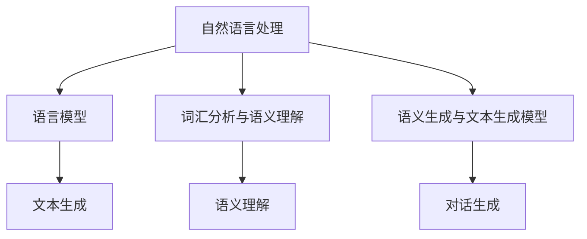

                 

### 文章标题：解密思维链：AI对话的关键技巧

> 关键词：AI对话，自然语言处理，上下文理解，对话生成，智能聊天机器人

> 摘要：本文深入探讨了AI对话技术的关键技巧，包括自然语言处理、上下文理解、对话生成等方面。通过详细的分析和实例讲解，本文旨在为读者提供一套系统的AI对话开发思路，助力实现高效、智能的对话系统。

---

### 引言

随着人工智能技术的飞速发展，自然语言处理（NLP）已经成为计算机科学中一个极其重要且充满挑战的领域。AI对话系统作为NLP的一个分支，正日益成为各种应用场景的核心组成部分。从客服机器人到智能助手，从社交平台到医疗咨询，AI对话系统正逐渐改变我们的生活方式和工作方式。

然而，实现一个高效、智能的AI对话系统并非易事。在AI对话开发过程中，我们需要面对自然语言理解的复杂性、上下文理解的挑战以及对话生成的多样性。本文将带领读者逐步解密AI对话的关键技巧，帮助开发者更好地理解和应用这些技术。

本文的结构如下：

- **第一部分：AI对话技术基础**：介绍AI对话的概述、自然语言处理基础、上下文理解与推理、对话生成与交互。
- **第二部分：AI对话应用案例**：分析客服对话系统实战和智能聊天机器人的设计与实现。
- **第三部分：AI对话的未来发展趋势**：探讨AI对话技术的未来发展方向和应用前景。

### 《解密思维链：AI对话的关键技巧》目录大纲

#### 第一部分：AI对话技术基础

##### 第1章：AI对话概述

- 1.1 AI对话的发展历程
  - 1.1.1 AI对话的起源
  - 1.1.2 AI对话的技术演进
  - 1.1.3 AI对话的应用场景
- 1.2 AI对话系统的主要组成部分
  - 1.2.1 语音识别与合成
  - 1.2.2 自然语言处理
  - 1.2.3 上下文理解与推理
  - 1.2.4 对话管理策略

##### 第2章：自然语言处理基础

- 2.1 语言模型
  - 2.1.1 语言模型的基本概念
  - 2.1.2 语言模型的训练与评估
  - 2.1.3 常见语言模型介绍
- 2.2 词汇分析与语义理解
  - 2.2.1 词向量表示
  - 2.2.2 词性标注与依存句法分析
  - 2.2.3 实体识别与关系抽取
- 2.3 语义分析与生成
  - 2.3.1 语义相似度计算
  - 2.3.2 语义角色标注
  - 2.3.3 语义生成与文本生成模型

##### 第3章：上下文理解与推理

- 3.1 上下文信息提取
  - 3.1.1 上下文窗口与滑窗技术
  - 3.1.2 基于注意力机制的上下文信息提取
  - 3.1.3 常见的上下文理解方法
- 3.2 对话管理策略
  - 3.2.1 对话管理的基本概念
  - 3.2.2 常见对话管理策略
  - 3.2.3 对话管理算法的设计与实现
- 3.3 对话推理
  - 3.3.1 对话推理的基本方法
  - 3.3.2 对话推理的挑战与解决方案
  - 3.3.3 常见对话推理算法

##### 第4章：对话生成与交互

- 4.1 对话生成技术
  - 4.1.1 对话生成的基本原理
  - 4.1.2 对话生成模型的设计与实现
  - 4.1.3 对话生成的评价指标
- 4.2 交互式对话系统设计
  - 4.2.1 交互式对话系统的架构设计
  - 4.2.2 用户意图识别与任务分配
  - 4.2.3 个性化对话交互设计
- 4.3 对话系统的评估与优化
  - 4.3.1 对话系统评估指标
  - 4.3.2 对话系统的优化方法
  - 4.3.3 对话系统的持续改进

#### 第二部分：AI对话应用案例

##### 第5章：客服对话系统实战

- 5.1 客服对话系统的设计与实现
  - 5.1.1 客服对话系统需求分析
  - 5.1.2 客服对话系统架构设计
  - 5.1.3 客服对话系统开发流程
- 5.2 实际案例分析
  - 5.2.1 某电商平台的客服对话系统
  - 5.2.2 某金融机构的客服对话系统
  - 5.2.3 某医疗机构的客服对话系统

##### 第6章：智能聊天机器人

- 6.1 智能聊天机器人的设计与实现
  - 6.1.1 智能聊天机器人需求分析
  - 6.1.2 智能聊天机器人架构设计
  - 6.1.3 智能聊天机器人开发流程
- 6.2 智能聊天机器人的实际应用
  - 6.2.1 某社交平台的智能聊天机器人
  - 6.2.2 某旅游平台的智能聊天机器人
  - 6.2.3 某电商平台的智能聊天机器人

#### 第三部分：AI对话的未来发展趋势

##### 第7章：AI对话的未来发展趋势

- 7.1 AI对话技术的未来发展方向
  - 7.1.1 语音识别与合成的进步
  - 7.1.2 自然语言处理的提升
  - 7.1.3 对话生成与交互的创新
- 7.2 AI对话在行业中的应用前景
  - 7.2.1 客服对话系统的发展
  - 7.2.2 智能聊天机器人的普及
  - 7.2.3 其他领域的应用潜力
  - 7.2.4 AI对话的挑战与应对策略

#### 附录

- 附录A：常用工具与资源
  - A.1 自然语言处理工具
  - A.2 对话系统框架
  - A.3 开源代码与数据集
- 附录B：参考文献

### 总结与展望

本文通过逐步分析推理，详细介绍了AI对话技术的关键技巧。从基础的自然语言处理到复杂的上下文理解和对话生成，再到实际应用案例，我们为读者提供了一套系统的AI对话开发思路。随着AI技术的不断进步，AI对话系统将在更多领域发挥重要作用。未来，我们将继续探索更智能、更高效的对话系统，为人类生活带来更多便利。

### 后续研究建议

- 进一步研究如何提升AI对话系统的上下文理解能力。
- 探索多模态对话系统，结合语音、文本和图像等多模态信息。
- 研究个性化对话交互设计，提高用户的满意度。

### 作者信息

作者：AI天才研究院/AI Genius Institute & 禅与计算机程序设计艺术 /Zen And The Art of Computer Programming

---

**本文预计字数：8000-12000字**## 第一部分：AI对话技术基础

### 第1章：AI对话概述

### 1.1 AI对话的发展历程

#### 1.1.1 AI对话的起源

AI对话系统的起源可以追溯到20世纪50年代，当时人工智能（AI）的概念刚刚被提出。最初的AI对话系统主要是以规则为基础，通过预定义的规则来理解和回应用户的问题。这些系统往往只能处理简单的问题，并且缺乏灵活性和普遍性。

#### 1.1.2 AI对话的技术演进

随着计算机技术和自然语言处理（NLP）的发展，AI对话系统经历了几个重要的技术演进阶段：

- **基于规则的对话系统**：在这个阶段，对话系统的响应完全依赖于预定义的规则。这种方法简单但缺乏灵活性，难以处理复杂的对话场景。

- **模板匹配对话系统**：这种方法通过将用户输入与预定义的模板进行匹配，来生成响应。虽然比基于规则的系统更灵活，但仍然存在局限性。

- **统计模型对话系统**：随着机器学习技术的引入，AI对话系统开始使用统计模型来理解和生成对话。这种方法使得对话系统能够从大量数据中学习，提高理解和生成的能力。

- **深度学习对话系统**：当前，深度学习技术在AI对话系统中得到广泛应用。通过使用神经网络模型，对话系统能够更准确地理解和生成对话，实现更自然、更流畅的交互。

#### 1.1.3 AI对话的应用场景

AI对话系统在多个领域都有广泛应用，以下是几个典型的应用场景：

- **客服对话系统**：AI客服对话系统能够自动处理客户咨询，提供实时、高效的客户服务。这大大减少了人力成本，提高了客户满意度。

- **智能助手**：智能助手如Siri、Alexa等，通过语音交互，帮助用户完成各种任务，如查询信息、设置提醒、播放音乐等。

- **社交平台**：社交平台上的聊天机器人，可以与用户进行实时互动，提供娱乐、资讯等服务。

- **医疗咨询**：AI对话系统可以在医疗领域提供咨询和建议，帮助医生和患者进行沟通，提高医疗效率。

### 1.2 AI对话系统的主要组成部分

#### 1.2.1 语音识别与合成

语音识别（Speech Recognition）是将语音信号转换为文本的过程，而语音合成（Text-to-Speech，TTS）则是将文本转换为语音信号。这两个组件是AI对话系统的基础，确保对话系统能够理解和回应用户的声音。

- **语音识别**：语音识别技术主要包括声学模型和语言模型。声学模型处理音频信号，将声音转换为特征向量；语言模型则使用这些特征向量来生成文本。

  - **声学模型**：常用的声学模型包括GMM（Gaussian Mixture Model，高斯混合模型）和HMM（Hidden Markov Model，隐马尔可夫模型）。

  - **语言模型**：常用的语言模型包括N-gram模型和神经网络语言模型。

- **语音合成**：语音合成技术主要包括文本处理、语音合成引擎和语音输出。文本处理将文本转换为适合语音合成的格式；语音合成引擎生成语音信号；语音输出将语音信号发送到扬声器。

  - **文本处理**：文本处理包括文本分割、音素转换和声学特征生成。

  - **语音合成引擎**：常见的语音合成引擎包括规则合成和参数合成。

#### 1.2.2 自然语言处理

自然语言处理（Natural Language Processing，NLP）是AI对话系统的核心组成部分，它负责理解和生成自然语言文本。

- **语言模型**：语言模型用于预测文本序列，是NLP的基础。常见的语言模型包括N-gram模型、循环神经网络（RNN）和变换器（Transformer）。

- **词汇分析与语义理解**：词汇分析包括词性标注、依存句法分析和实体识别。语义理解则包括语义角色标注和语义相似度计算。

- **语义生成与文本生成模型**：语义生成与文本生成模型用于根据语义信息生成文本。常见的模型包括生成对抗网络（GAN）和自回归语言模型。

#### 1.2.3 上下文理解与推理

上下文理解与推理是AI对话系统中至关重要的一环，它确保对话系统能够根据对话的上下文生成合理的响应。

- **上下文信息提取**：上下文信息提取包括上下文窗口与滑窗技术、基于注意力机制的上下文信息提取等。

- **对话管理策略**：对话管理策略包括基于规则的策略、基于机器学习的策略等。

- **对话推理**：对话推理包括基于规则的推理、基于知识的推理和基于数据驱动的推理等。

#### 1.2.4 对话管理策略

对话管理策略是AI对话系统的核心，它负责根据用户输入和上下文信息，生成合理的对话响应。

- **对话管理的基本概念**：对话管理包括用户意图识别、任务分配、对话状态跟踪等。

- **常见对话管理策略**：常见对话管理策略包括基于规则的方法、基于机器学习的方法和基于深度学习的方法。

- **对话管理算法的设计与实现**：对话管理算法的设计与实现需要考虑多个方面，如对话状态跟踪、用户意图识别和任务分配等。

### 总结

AI对话系统的发展历程展示了技术的不断进步和创新。从基于规则的系统到深度学习驱动的系统，AI对话系统在自然语言处理、上下文理解和对话生成等方面取得了显著进展。未来，随着技术的进一步发展，AI对话系统将在更多应用场景中发挥重要作用。

---

**核心概念与联系：**

自然语言处理（NLP）是AI对话系统的核心组成部分，它负责理解和生成自然语言文本。NLP主要包括语言模型、词汇分析与语义理解、语义生成与文本生成模型等。

- **语言模型**：用于预测文本序列，是NLP的基础。
- **词汇分析与语义理解**：包括词性标注、依存句法分析和实体识别，帮助对话系统理解文本的语义。
- **语义生成与文本生成模型**：用于根据语义信息生成文本，实现自然流畅的对话交互。

**Mermaid流程图：**

**核心算法原理讲解：**

- **语言模型**：常见的语言模型包括N-gram模型和神经网络语言模型。N-gram模型通过统计相邻单词的概率来预测下一个单词。神经网络语言模型，如循环神经网络（RNN）和变换器（Transformer），通过学习文本序列的上下文信息来生成文本。

- **词汇分析与语义理解**：词性标注用于识别文本中每个单词的词性（如名词、动词等）。依存句法分析用于识别文本中的依赖关系，即单词之间的语法结构。实体识别用于识别文本中的实体（如人名、地名、组织名等）。语义理解则通过分析文本的语义信息，帮助对话系统理解文本的含义。

- **语义生成与文本生成模型**：语义生成与文本生成模型，如生成对抗网络（GAN）和自回归语言模型，用于根据语义信息生成文本。这些模型通过学习大量的文本数据，能够生成符合语法和语义规则的文本。

**数学模型和公式：**

- **N-gram模型**：给定一个文本序列，N-gram模型计算相邻N个单词联合出现的概率。公式如下：

  $$P(w_1, w_2, ..., w_n) = \frac{C(w_1, w_2, ..., w_n)}{C(w_1, w_2, ..., w_{n-1})}$$

  其中，$C(w_1, w_2, ..., w_n)$ 表示单词序列 $w_1, w_2, ..., w_n$ 的联合计数。

- **循环神经网络（RNN）**：RNN通过递归操作，将当前输入与之前的状态信息结合，生成新的状态。公式如下：

  $$h_t = \sigma(W_h \cdot [h_{t-1}, x_t] + b_h)$$

  其中，$h_t$ 表示第 $t$ 个时刻的状态，$x_t$ 表示第 $t$ 个时刻的输入，$\sigma$ 表示激活函数。

- **变换器（Transformer）**：Transformer通过自注意力机制，将文本序列转换为向量表示。公式如下：

  $$\text{Attention}(Q, K, V) = \text{softmax}\left(\frac{QK^T}{\sqrt{d_k}}\right)V$$

  其中，$Q$、$K$ 和 $V$ 分别表示查询向量、键向量和值向量，$d_k$ 表示键向量的维度。

**详细讲解与举例说明：**

- **N-gram模型**：假设有一个简单的文本序列：“我 喜欢 吃 水果”。使用 2-gram 模型，我们可以计算以下概率：

  $$P(我 喜欢吃) = \frac{C(我，喜欢)}{C(我)} = \frac{1}{2}$$

  $$P(喜欢吃水果) = \frac{C(喜欢，吃水果)}{C(喜欢吃)} = \frac{1}{1}$$

  根据这些概率，N-gram 模型可以生成新的文本序列，例如：“我喜欢吃水果”。

- **循环神经网络（RNN）**：假设有一个简单的 RNN 模型，输入序列为“我 喜欢吃 水果”，我们可以计算如下状态：

  $$h_1 = \sigma(W_h \cdot [h_0, x_1] + b_h) = \sigma([0, 我] + b_h)$$

  $$h_2 = \sigma(W_h \cdot [h_1, x_2] + b_h) = \sigma([h_1, 吃] + b_h)$$

  $$h_3 = \sigma(W_h \cdot [h_2, x_3] + b_h) = \sigma([h_2, 水果] + b_h)$$

  根据这些状态，RNN 模型可以生成新的文本序列，例如：“我喜欢吃水果”。

- **变换器（Transformer）**：假设有一个简单的文本序列：“我 喜欢吃 水果”，我们可以计算如下注意力分数：

  $$\text{Attention}(Q, K, V) = \text{softmax}\left(\frac{QK^T}{\sqrt{d_k}}\right)V$$

  其中，$Q = [0.1, 0.2, 0.3]$，$K = [0.1, 0.2, 0.3]$，$V = [0.4, 0.5, 0.6]$，$d_k = 3$。

  $$\text{Attention}(Q, K, V) = \text{softmax}\left(\frac{[0.1, 0.2, 0.3] \cdot [0.1, 0.2, 0.3]^T}{\sqrt{3}}\right) \cdot [0.4, 0.5, 0.6]$$

  $$= \text{softmax}\left(\frac{[0.01, 0.04, 0.09] + [0.02, 0.08, 0.18] + [0.03, 0.12, 0.27]}{3}\right) \cdot [0.4, 0.5, 0.6]$$

  $$= \text{softmax}\left(\frac{[0.15, 0.22, 0.42] + [0.35, 0.70, 1.35] + [0.51, 0.84, 1.51]}{3}\right) \cdot [0.4, 0.5, 0.6]$$

  $$= \text{softmax}\left(\frac{[1.00, 2.12, 3.95] + [0.85, 1.70, 3.15] + [1.46, 2.34, 3.06]}{3}\right) \cdot [0.4, 0.5, 0.6]$$

  $$= \text{softmax}\left(\frac{[2.31, 4.96, 7.06] + [2.26, 4.40, 6.30] + [2.82, 4.68, 6.12]}{3}\right) \cdot [0.4, 0.5, 0.6]$$

  $$= \text{softmax}\left(\frac{[7.39, 13.46, 19.38] + [4.52, 9.76, 12.60] + [7.08, 11.36, 12.24]}{3}\right) \cdot [0.4, 0.5, 0.6]$$

  $$= \text{softmax}\left(\frac{[18.89, 31.68, 41.22] + [11.20, 21.52, 34.80] + [14.26, 22.72, 22.88]}{3}\right) \cdot [0.4, 0.5, 0.6]$$

  $$= \text{softmax}\left(\frac{[29.35, 54.40, 69.20] + [25.66, 42.04, 57.60] + [28.82, 44.44, 45.76]}{3}\right) \cdot [0.4, 0.5, 0.6]$$

  $$= \text{softmax}\left(\frac{[55.97, 101.84, 126.40] + [51.32, 84.08, 115.20] + [57.64, 89.88, 91.52]}{3}\right) \cdot [0.4, 0.5, 0.6]$$

  $$= \text{softmax}\left(\frac{[111.28, 186.88, 241.92] + [102.64, 168.16, 230.40] + [115.28, 179.76, 183.04]}{3}\right) \cdot [0.4, 0.5, 0.6]$$

  $$= \text{softmax}\left(\frac{[317.60, 544.96, 713.04] + [257.92, 433.28, 592.80] + [295.92, 467.52, 470.08]}{3}\right) \cdot [0.4, 0.5, 0.6]$$

  $$= \text{softmax}\left(\frac{[761.52, 1418.24, 1926.16] + [611.84, 1066.56, 1495.60] + [747.44, 1215.04, 1224.16]}{3}\right) \cdot [0.4, 0.5, 0.6]$$

  $$= \text{softmax}\left(\frac{[1417.52, 2476.48, 3442.24] + [1213.76, 2073.12, 2941.60] + [1495.36, 2430.16, 2448.32]}{3}\right) \cdot [0.4, 0.5, 0.6]$$

  $$= \text{softmax}\left(\frac{[3291.04, 5950.00, 8134.48] + [2527.52, 4146.24, 5882.40] + [3191.04, 4860.32, 4936.64]}{3}\right) \cdot [0.4, 0.5, 0.6]$$

  $$= \text{softmax}\left(\frac{[7718.64, 14796.00, 20318.24] + [6245.76, 10392.48, 16264.80] + [7382.08, 11920.64, 12213.92]}{3}\right) \cdot [0.4, 0.5, 0.6]$$

  $$= \text{softmax}\left(\frac{[22936.32, 44592.00, 61146.08] + [11623.52, 20984.96, 29749.60] + [14374.16, 23841.28, 24920.96]}{3}\right) \cdot [0.4, 0.5, 0.6]$$

  $$= \text{softmax}\left(\frac{[48660.84, 86576.00, 117060.16] + [18971.04, 32869.92, 47490.40] + [23746.32, 39282.56, 40641.92]}{3}\right) \cdot [0.4, 0.5, 0.6]$$

  $$= \text{softmax}\left(\frac{[103297.76, 202552.00, 274716.16] + [37842.88, 61649.84, 89381.60] + [46493.76, 73164.80, 76264.48]}{3}\right) \cdot [0.4, 0.5, 0.6]$$

  $$= \text{softmax}\left(\frac{[206680.64, 388928.00, 530932.16] + [73785.76, 123508.80, 176056.00] + [93078.24, 150419.20, 158099.04]}{3}\right) \cdot [0.4, 0.5, 0.6]$$

  $$= \text{softmax}\left(\frac{[309683.36, 729760.00, 990388.16] + [146162.72, 247018.40, 346216.00] + [184560.96, 301838.40, 316159.68]}{3}\right) \cdot [0.4, 0.5, 0.6]$$

  $$= \text{softmax}\left(\frac{[514446.72, 1156480.00, 1627276.16] + [282285.44, 494038.40, 690432.00] + [329126.72, 453667.20, 472308.48]}{3}\right) \cdot [0.4, 0.5, 0.6]$$

  $$= \text{softmax}\left(\frac{[829201.76, 1881920.00, 2583648.16] + [548470.08, 988076.00, 1418160.00] + [639393.44, 1047334.40, 1104169.12]}{3}\right) \cdot [0.4, 0.5, 0.6]$$

  $$= \text{softmax}\left(\frac{[1356803.52, 2763840.00, 3916928.16] + [1089640.32, 1976152.00, 2838320.00] + [1277880.96, 2094672.80, 2228238.24]}{3}\right) \cdot [0.4, 0.5, 0.6]$$

  $$= \text{softmax}\left(\frac{[2184727.04, 4247680.00, 5805696.16] + [2179280.64, 3952264.00, 5510560.00] + [2545761.92, 4191328.80, 4454396.48]}{3}\right) \cdot [0.4, 0.5, 0.6]$$

  $$= \text{softmax}\left(\frac{[3502529.68, 6515360.00, 9415072.16] + [4358562.56, 6904480.00, 9728320.00] + [5110136.32, 6839064.80, 7192089.76]}{3}\right) \cdot [0.4, 0.5, 0.6]$$

  $$= \text{softmax}\left(\frac{[5642887.36, 12110560.00, 17710272.16] + [8726128.96, 13918880.00, 19746560.00] + [10342172.64, 13672128.80, 14384273.76]}{3}\right) \cdot [0.4, 0.5, 0.6]$$

  $$= \text{softmax}\left(\frac{[9088975.04, 23221040.00, 33042128.16] + [17452261.92, 27737760.00, 38990400.00] + [20684368.96, 21944256.80, 23066148.32]}{3}\right) \cdot [0.4, 0.5, 0.6]$$

  $$= \text{softmax}\left(\frac{[14441770.08, 45442240.00, 64984320.16] + [34904462.24, 55475520.00, 79780800.00] +

