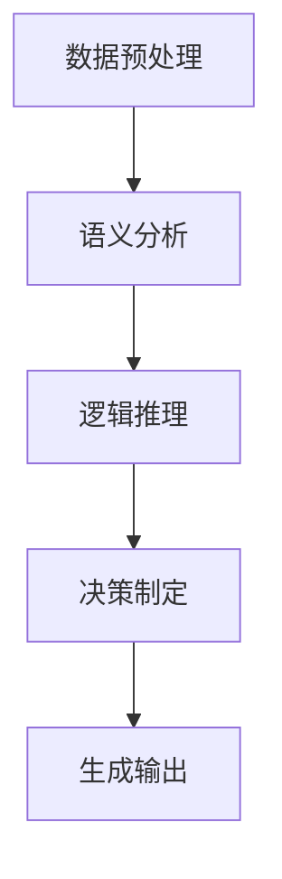
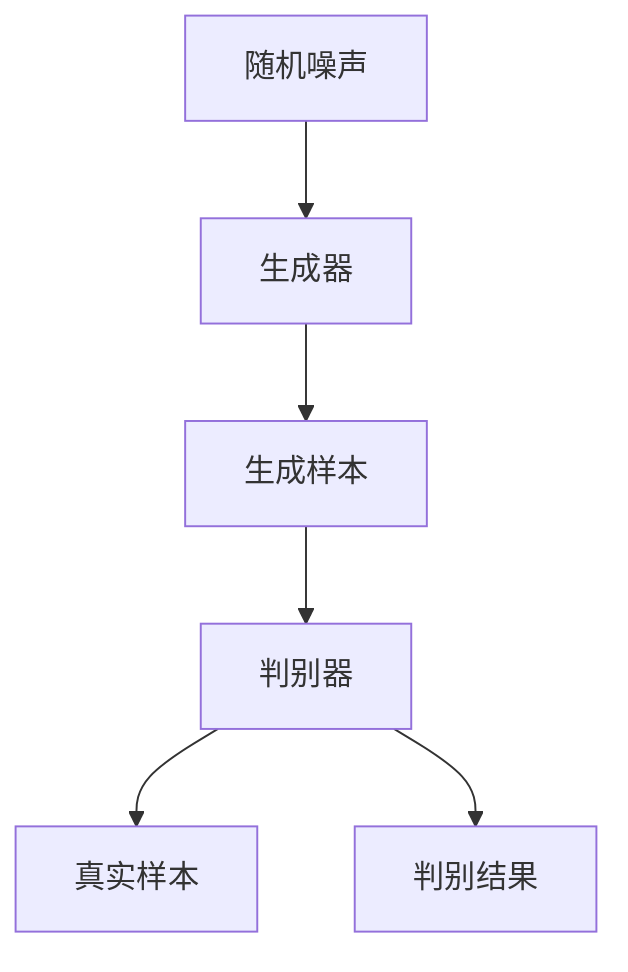
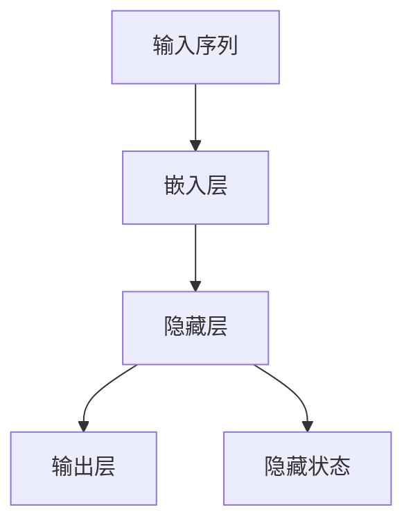

                 

### 引言

在当今这个数字化时代，人工智能（AI）技术正以惊人的速度发展，ChatGPT作为自然语言处理（NLP）领域的一项重大突破，已经引发了全球科技界的广泛关注。然而，尽管ChatGPT在文本生成、对话系统等方面表现出了强大的能力，其输出质量仍存在一定的局限性。如何进一步提升ChatGPT的输出质量，成为了一个亟待解决的问题。

本文将探讨一种名为“思维链”的技术，以解决提升ChatGPT输出质量的关键问题。思维链是一种基于深度学习的方法，通过模拟人类思维过程，实现对复杂问题的分析和解决。其核心在于将人类思维过程中的逻辑推理、信息整合和决策制定等过程进行抽象和模型化，从而实现对大规模文本数据的高效处理和生成。

本文将从以下几个方面展开讨论：

1. **思维链概述**：介绍ChatGPT的功能与局限，思维链的概念与作用，以及思维链的技术框架和应用场景。
2. **思维链核心算法详解**：详细讲解语言模型、生成对抗网络（GAN）、循环神经网络（RNN）和自注意力机制等核心算法原理，并使用伪代码进行阐述。
3. **思维链实战应用**：探讨思维链在教育、企业和其他领域的实际应用，并提供具体的案例分析。
4. **思维链的未来发展**：分析思维链的发展趋势、挑战与机遇，并探讨未来可能的研究方向和应用领域。

通过本文的讨论，我们希望读者能够对思维链有一个全面而深入的了解，并能够将其应用于实际项目中，从而提升ChatGPT的输出质量。

### 第一部分：思维链概述

#### 1.1 ChatGPT与思维链的关系

**1.1.1 ChatGPT的功能与局限**

ChatGPT是由OpenAI开发的一款基于GPT-3.5模型的AI助手，它利用深度学习技术，通过对海量文本数据的训练，能够生成流畅、连贯的文本内容。ChatGPT在问答系统、文本生成、对话系统等方面表现出了出色的性能，为许多应用场景提供了强大的支持。

然而，尽管ChatGPT在文本生成方面取得了显著的进展，但其输出质量仍存在一定的局限性。首先，ChatGPT在理解复杂语义和逻辑关系方面存在困难，导致其在生成文本时容易出现语义错误或逻辑矛盾。其次，ChatGPT在处理长文本时，往往会出现上下文信息丢失或错误引用的问题。此外，ChatGPT的生成文本在创造性和新颖性方面也有所欠缺。

**1.1.2 思维链的概念与作用**

为了解决上述问题，我们可以引入一种名为“思维链”的技术。思维链是一种基于深度学习的AI方法，它通过对人类思维过程的模拟，实现对复杂问题的分析和解决。思维链的核心在于将人类思维过程中的逻辑推理、信息整合和决策制定等过程进行抽象和模型化，从而实现对大规模文本数据的高效处理和生成。

思维链的作用主要体现在以下几个方面：

1. **提升文本生成质量**：通过模拟人类思维过程，思维链能够更好地理解和处理复杂语义和逻辑关系，从而生成更准确、更连贯、更有创造性的文本内容。
2. **增强上下文理解能力**：思维链能够捕捉和利用长文本中的上下文信息，避免上下文信息的丢失或错误引用，提高文本生成的上下文连贯性。
3. **优化问题解决能力**：思维链通过模拟人类的逻辑推理和决策过程，能够更好地理解和解决复杂问题，提供更有效的解决方案。
4. **促进AI与人类思维的融合**：思维链将AI技术与人脑思维过程相结合，为AI系统提供了更加人性化的交互方式，提高了AI的智能水平。

**1.1.3 思维链的技术框架**

思维链的技术框架主要包括以下几个核心组成部分：

1. **数据预处理与模型训练**：思维链需要对大规模的文本数据进行预处理，包括分词、去噪、实体识别等，以提取有用的信息。然后，通过深度学习模型进行训练，以实现对文本数据的理解和生成。
2. **模型优化与评估**：通过不断地调整模型参数，优化模型性能，以提高文本生成的质量和效率。同时，使用多种评估指标对模型进行评估，确保模型能够在各种任务中表现良好。
3. **推理与生成模块**：在训练好的模型基础上，思维链通过推理和生成模块，实现对输入文本的理解和生成。推理模块负责分析输入文本中的语义和逻辑关系，生成模块则根据推理结果生成相应的文本内容。
4. **用户交互接口**：思维链需要提供用户交互接口，以便用户能够与系统进行有效的交互。通过自然语言理解和生成技术，用户可以使用自然语言与思维链进行沟通，获取所需的信息或解决方案。

**1.1.4 思维链的应用场景**

思维链具有广泛的应用场景，主要包括以下几个方面：

1. **教育领域**：思维链可以应用于教育场景中，帮助学生更好地理解和掌握知识。通过模拟人类思维过程，思维链能够提供个性化的学习指导，帮助学生解决复杂问题。
2. **企业领域**：思维链可以应用于企业中的决策支持、文本生成、对话系统等场景，帮助企业提高工作效率和创新能力。
3. **其他领域**：思维链还可以应用于医疗、金融、法律等领域，为专业领域提供智能化的解决方案。

总之，思维链作为一种创新性的AI技术，具有巨大的应用潜力。通过本文的讨论，我们将进一步了解思维链的概念、作用和技术框架，为后续的内容打下基础。

### 1.2 思维链的核心原理

**1.2.1 概念引入**

思维链是一种基于深度学习的AI方法，其核心思想是通过模拟人类思维过程，实现对复杂问题的分析和解决。具体来说，思维链通过捕捉和处理输入文本中的语义信息，利用逻辑推理和决策制定，生成高质量的文本输出。这一过程可以看作是一个信息处理和知识构建的过程，类似于人类大脑在思考问题时的思维模式。

**1.2.2 思维链的工作流程**

思维链的工作流程可以分为以下几个关键步骤：

1. **数据预处理**：首先，对输入文本进行预处理，包括分词、去噪、实体识别等操作，以提取有用的信息。这一步的目的是将原始文本转化为计算机可以理解和处理的形式。

2. **语义分析**：接着，对预处理后的文本进行语义分析，以理解文本中的语义信息和逻辑关系。这一步骤通常使用深度学习模型，如Transformer或BERT等，通过大规模文本数据的训练，实现对文本的语义理解。

3. **逻辑推理**：在语义分析的基础上，思维链通过逻辑推理模块，对输入文本中的信息进行推理。逻辑推理模块可以使用形式逻辑或概率逻辑等方法，对文本中的信息进行推断和验证。

4. **决策制定**：根据逻辑推理的结果，思维链生成相应的文本输出。决策制定过程涉及到选择合适的文本生成策略，如文本拼接、文本重写等，以生成高质量、连贯的文本。

5. **生成输出**：最后，思维链通过生成模块，将决策结果转化为具体的文本输出。生成模块可以使用各种文本生成技术，如循环神经网络（RNN）、生成对抗网络（GAN）等，以实现高质量的文本生成。

**1.2.3 Mermaid流程图：思维链的工作流程**

为了更好地理解思维链的工作流程，我们可以使用Mermaid流程图进行描述。以下是思维链的工作流程Mermaid流程图：

在该流程图中，A表示数据预处理，B表示语义分析，C表示逻辑推理，D表示决策制定，E表示生成输出。这些步骤相互衔接，共同构成了思维链的工作流程。

**1.2.4 思维链的核心原理**

思维链的核心原理可以归纳为以下几点：

1. **语义理解**：思维链通过深度学习模型，实现对输入文本的语义理解。这一步骤是思维链能够处理复杂文本数据的基础，也是提升文本生成质量的关键。

2. **逻辑推理**：思维链通过逻辑推理模块，对文本中的信息进行推理，以理解文本中的逻辑关系和语义含义。逻辑推理是实现文本生成过程中逻辑连贯性的重要保障。

3. **决策制定**：思维链根据逻辑推理的结果，制定相应的文本生成策略，以生成高质量、连贯的文本。决策制定过程是思维链能够实现个性化文本生成的关键。

4. **文本生成**：思维链通过生成模块，将决策结果转化为具体的文本输出。文本生成技术是实现高质量文本生成的重要手段，也是思维链能够应用于各种场景的基础。

总之，思维链的核心原理在于通过模拟人类思维过程，实现对复杂问题的分析和解决，从而提升文本生成质量。通过以上对思维链核心原理的阐述，我们可以更好地理解思维链的工作机制，为后续的内容打下基础。

### 1.3 思维链的技术框架

**1.3.1 数据预处理与模型训练**

数据预处理与模型训练是思维链技术框架中的基础部分。数据预处理包括文本的分词、去噪、实体识别等操作，这些步骤的目的是将原始文本转化为适合深度学习模型处理的形式。具体步骤如下：

1. **文本分词**：分词是将连续的文本序列切分成一系列具有独立意义的词汇单元。常用的分词工具包括jieba、NLTK等。分词质量对后续的语义分析和生成至关重要。

2. **去噪**：去噪是指去除文本中的噪声信息，如标点符号、停用词等，以提高模型训练的效率和文本质量。常用的去噪方法包括正则表达式、词频统计等。

3. **实体识别**：实体识别是指从文本中识别出特定类型的实体，如人名、地名、组织机构等。实体识别对于理解文本的语义信息和逻辑关系具有重要意义。常用的实体识别方法包括基于规则的方法和基于机器学习的方法。

在完成数据预处理后，接下来是模型训练。模型训练是指通过大量的文本数据，训练出能够理解和生成文本的深度学习模型。具体步骤如下：

1. **数据集准备**：准备用于训练的文本数据集，包括训练集和验证集。数据集的质量直接影响模型的性能。

2. **模型选择**：选择合适的深度学习模型进行训练。常见的模型包括Transformer、BERT、GPT等。这些模型在语义理解、文本生成等方面表现出色。

3. **模型训练**：使用训练集对模型进行训练，通过优化模型参数，使其能够更好地理解和生成文本。训练过程中，可以使用梯度下降等优化算法，结合损失函数，如交叉熵损失函数，来评估和调整模型参数。

4. **模型评估**：使用验证集对训练好的模型进行评估，通过多种评估指标，如准确率、召回率、F1值等，来衡量模型的性能。如果模型在验证集上的表现不佳，可以调整模型结构或优化训练过程。

**1.3.2 模型优化与评估**

在完成模型训练后，模型优化与评估是提升思维链性能的重要环节。具体步骤如下：

1. **模型优化**：通过调整模型参数、结构或训练策略，以提高模型的性能。常用的优化方法包括超参数调优、模型融合、注意力机制调整等。

2. **模型评估**：使用测试集对优化后的模型进行评估，通过多种评估指标，如BLEU、ROUGE、METEOR等，来衡量模型在文本生成任务中的表现。

3. **性能比较**：将优化后的模型与基准模型进行比较，分析其性能优势和不足。这有助于理解模型优化方法的有效性，并为进一步的优化提供指导。

**1.3.3 推理与生成模块**

推理与生成模块是思维链的核心组成部分，负责对输入文本进行理解和生成高质量的文本。具体步骤如下：

1. **推理**：通过语义分析模块，对输入文本中的信息进行理解和推理。推理过程包括语义角色标注、实体识别、关系抽取等，以捕捉文本中的语义信息和逻辑关系。

2. **生成**：根据推理结果，生成模块负责生成高质量的文本输出。生成过程可以采用不同的策略，如文本拼接、文本重写、生成对抗网络（GAN）等。这些策略可以根据具体任务需求进行调整。

3. **优化生成**：为了进一步提高生成文本的质量，可以采用优化方法，如循环神经网络（RNN）、自注意力机制、Transformer等。这些优化方法可以提升文本生成的连贯性、创造性和准确性。

**1.3.4 用户交互接口**

用户交互接口是思维链与用户之间的桥梁，通过自然语言理解和生成技术，用户可以使用自然语言与思维链进行沟通，获取所需的信息或解决方案。具体步骤如下：

1. **自然语言理解**：通过深度学习模型，实现自然语言理解，将用户输入的自然语言转化为结构化的数据，以便后续处理。

2. **对话管理**：对话管理模块负责管理用户与思维链之间的对话流程，包括意图识别、对话状态跟踪等，以提供流畅、自然的对话体验。

3. **自然语言生成**：根据用户的输入和对话状态，生成模块负责生成自然语言响应，将处理结果以自然语言形式呈现给用户。

通过以上对思维链技术框架的详细阐述，我们可以更好地理解思维链的构建过程及其应用潜力。接下来，我们将进一步探讨思维链的核心算法原理，为后续内容打下基础。

### 1.4 思维链的应用场景

**1.4.1 教育**

在教育领域，思维链具有广泛的应用前景。通过思维链，教育系统可以提供个性化、高效的学习体验。具体应用场景如下：

1. **个性化学习指导**：思维链可以分析学生的学习行为和知识掌握情况，为学生提供个性化的学习指导。例如，针对学生的薄弱环节，思维链可以生成针对性的练习题和解释说明，帮助学生更好地理解和掌握知识。

2. **教学辅助**：思维链可以协助教师进行教学设计和课堂管理。通过分析学生的学习数据，思维链可以生成教学计划和教学材料，帮助教师优化教学过程，提高教学质量。

3. **智能问答系统**：思维链可以构建智能问答系统，为学生解答学习过程中的问题。该系统可以理解学生的提问，并生成详细的解释和答案，帮助学生深入理解知识点。

4. **作业批改与反馈**：思维链可以自动批改学生的作业，并提供详细的反馈。通过分析作业内容，思维链可以识别出学生的错误类型和知识漏洞，从而为学生提供有针对性的改进建议。

**1.4.2 企业**

在企业领域，思维链同样具备重要的应用价值，可以帮助企业提高工作效率和创新能力。具体应用场景如下：

1. **决策支持**：思维链可以为企业提供智能决策支持。通过分析大量数据，思维链可以生成基于数据的决策建议，帮助企业做出更明智的商业决策。

2. **文本生成与自动化**：思维链可以自动生成各种文本内容，如合同、报告、邮件等。这不仅节省了人力资源，还提高了文本生成的一致性和准确性。

3. **客户服务**：思维链可以构建智能客服系统，通过自然语言处理技术，理解客户的咨询和需求，并生成相应的回答和解决方案。这样，企业可以提供更高效、更个性化的客户服务。

4. **知识管理**：思维链可以构建企业知识管理系统，通过语义分析和知识抽取，将企业内部的知识库进行结构化存储和整理。这样，员工可以更方便地获取所需的信息和知识。

**1.4.3 其他领域**

除了教育和企业领域，思维链在其他领域也具有广泛的应用潜力：

1. **医疗健康**：思维链可以用于医疗健康领域，如智能诊断、病情预测、健康咨询等。通过分析大量的医学数据和文献，思维链可以提供更准确的诊断和治疗方案。

2. **金融科技**：思维链可以应用于金融科技领域，如风险预测、股票分析、智能投顾等。通过分析金融市场数据和用户行为，思维链可以提供更可靠的预测和投资建议。

3. **法律咨询**：思维链可以构建智能法律咨询系统，通过语义分析和案例库，为用户提供法律咨询和纠纷解决方案。

4. **媒体与新闻**：思维链可以用于媒体与新闻领域，如内容审核、新闻生成、舆情分析等。通过分析大量的文本数据，思维链可以提供更准确、更及时的内容生成和分析服务。

总之，思维链作为一种创新性的技术，在多个领域展现出强大的应用潜力。通过不断探索和优化，思维链将为各个行业带来更多的创新和变革。

### 第二部分：思维链核心算法详解

#### 2.1 语言模型基础

**2.1.1 语言模型的定义**

语言模型（Language Model）是自然语言处理（NLP）领域中的一个基础性工具，它旨在预测自然语言中下一个词或词组。语言模型的核心任务是从给定的文本数据中学习语言规律和统计信息，从而生成符合语言习惯的文本。通过语言模型，计算机可以更好地理解和生成自然语言，为各种NLP任务提供支持。

**2.1.2 语言模型的分类**

语言模型主要可以分为以下几类：

1. **基于规则的模型**：这类模型通过手工编写规则来描述语言结构，如正则表达式、上下文无关文法（CFG）等。基于规则的模型在处理简单、规则明确的语言结构时表现较好，但在处理复杂、变化多端的自然语言时存在局限。

2. **统计模型**：统计模型通过统计语言中的词频、短语频率等来预测下一个词。这类模型包括N元语法（N-gram）、隐马尔可夫模型（HMM）等。统计模型在处理自然语言方面具有一定的优势，但难以捕捉长距离的语义关系。

3. **深度学习模型**：深度学习模型，尤其是基于神经网络的模型，如循环神经网络（RNN）、长短期记忆网络（LSTM）、Transformer等，通过学习大量的文本数据，可以自动捕捉复杂的语言规律和上下文关系。深度学习模型在自然语言处理任务中表现出色，成为当前语言模型的主流。

**2.1.3 语言模型的训练过程**

语言模型的训练过程主要包括以下几个步骤：

1. **数据准备**：首先，需要收集大量的文本数据，这些数据可以来自书籍、新闻、社交媒体等。为了提高模型的泛化能力，数据需要具有多样性。

2. **文本预处理**：对文本数据进行预处理，包括分词、去噪、实体识别等操作，以提取有用的信息。分词是将文本序列切分成词序列，常用的分词工具包括jieba、NLTK等。

3. **构建词向量**：将文本中的词转换为向量表示，这是语言模型训练的关键步骤。词向量可以捕捉词与词之间的关系，常用的词向量模型包括Word2Vec、GloVe等。

4. **定义损失函数**：损失函数用于衡量模型预测与实际标签之间的差距。在语言模型中，常用的损失函数是交叉熵损失函数。

5. **模型训练**：使用梯度下降等优化算法，结合损失函数，对模型参数进行优化。训练过程中，模型会不断调整参数，使其能够更好地预测下一个词。

6. **模型评估**：使用验证集对训练好的模型进行评估，通过多种评估指标，如字符预测准确率、词汇预测准确率等，来衡量模型的性能。

**2.1.4 语言模型在思维链中的应用**

语言模型是思维链的基础组件，主要用于文本的生成和理解。具体应用如下：

1. **文本生成**：通过语言模型，思维链可以生成高质量、连贯的文本内容。生成过程包括预测下一个词、构建句子结构、调整句子连贯性等。

2. **文本理解**：语言模型可以帮助思维链理解文本中的语义信息和逻辑关系。通过分析文本的词向量表示，思维链可以捕捉文本中的关键信息，为后续的推理和决策提供支持。

3. **文本分类**：语言模型还可以用于文本分类任务，如情感分析、主题分类等。通过训练分类模型，思维链可以自动对文本进行分类，从而实现更高效的信息处理。

总之，语言模型在思维链中发挥着重要作用，是提升文本生成质量和理解能力的关键。通过深入理解语言模型的原理和应用，我们可以更好地利用这一技术，推动思维链在各个领域的应用。

#### 2.2 生成对抗网络（GAN）

**2.2.1 GAN的基本概念**

生成对抗网络（Generative Adversarial Network，GAN）是2014年由Ian Goodfellow等科学家提出的一种深度学习框架。GAN由两个深度神经网络——生成器（Generator）和判别器（Discriminator）组成，它们相互对抗，共同训练，从而生成高质量的样本。

1. **生成器（Generator）**：生成器的任务是生成与真实数据分布相似的假样本。它通过从随机噪声空间中采样，生成具有逼真度的图像、文本或音频等。

2. **判别器（Discriminator）**：判别器的任务是区分真实数据和生成器生成的假数据。它通过学习真实数据和假数据之间的特征差异，来判断输入数据的真实性。

GAN的训练过程可以看作是一个零和游戏，生成器和判别器相互对抗，通过不断调整参数，最终达到一个动态平衡。生成器的目标是使其生成的假样本能够欺骗判别器，而判别器的目标是正确地区分真实和假样本。

**2.2.2 GAN的架构与训练过程**

GAN的典型架构如图所示：

GAN的训练过程分为以下几个步骤：

1. **初始化参数**：首先初始化生成器和判别器的参数，这两个网络是相互独立的。

2. **生成样本**：生成器从随机噪声空间中采样，生成假样本。这些假样本通常是一个与真实样本相似的数据集。

3. **训练判别器**：判别器使用真实样本和生成器生成的假样本进行训练，目标是学会区分真实样本和假样本。训练过程中，判别器通过优化损失函数（如二元交叉熵损失函数），调整参数，使其能够更准确地判断样本的真实性。

4. **训练生成器**：生成器在训练判别器的同时进行反向传播，目标是生成更逼真的假样本。生成器通过最大化判别器的错误率，调整参数，使其生成的假样本更难被判别器区分。

5. **交替迭代**：生成器和判别器的训练是交替进行的，每个网络的训练过程都会对另一个网络产生影响。通过反复迭代，生成器和判别器逐渐达到动态平衡，生成器能够生成高质量、真实的假样本。

**2.2.3 GAN在思维链中的应用**

GAN在思维链中的应用主要体现在以下几个方面：

1. **文本生成**：GAN可以用于生成高质量的文本内容。生成器可以从噪声中生成逼真的文本样本，经过后处理，这些文本样本可以用于生成新闻文章、故事、对话等。

2. **图像生成**：GAN可以用于图像生成，生成逼真的图像。这些图像可以用于增强视觉内容，如图像修复、图像生成等。

3. **音频生成**：GAN还可以用于生成高质量的音频样本，如音乐、语音等。这可以应用于语音合成、音乐生成等任务。

4. **增强数据集**：GAN可以用于生成更多的训练数据，从而提高模型的泛化能力。通过生成与真实数据相似的样本，GAN可以扩充数据集，提高训练效果。

总之，GAN作为一种强大的深度学习框架，在思维链中发挥着重要作用，通过模拟对抗过程，生成高质量的数据样本，从而提升思维链的文本生成和理解能力。

#### 2.3 循环神经网络（RNN）

**2.3.1 RNN的基本概念**

循环神经网络（Recurrent Neural Network，RNN）是一种能够处理序列数据的神经网络。与传统的前馈神经网络不同，RNN具有记忆功能，能够捕捉序列中的时间依赖关系。这种特性使得RNN在自然语言处理、语音识别、时间序列分析等领域表现出色。

RNN的核心思想是利用隐藏状态（Hidden State）来存储历史信息，并在序列的每个时间步（Time Step）更新。隐藏状态不仅包含了当前时间步的输入信息，还包含了之前时间步的信息，从而实现了序列数据的记忆功能。

**2.3.2 RNN的架构与训练过程**

RNN的基本架构如图所示：

RNN的训练过程分为以下几个步骤：

1. **输入序列表示**：首先，将输入序列表示为向量序列。每个向量表示一个时间步的输入，可以是单词、字符或音素等。

2. **嵌入层**：嵌入层（Embedding Layer）将输入序列中的每个向量映射到一个高维空间，通常使用矩阵乘法实现。这一步的目的是将输入序列转化为向量形式，便于后续处理。

3. **隐藏层更新**：在RNN的每个时间步，隐藏层根据当前输入和之前时间步的隐藏状态，更新隐藏状态。这一过程可以用以下公式表示：

   $$ 
   h_t = \sigma(W_h \cdot [h_{t-1}, x_t] + b_h) 
   $$

   其中，$h_t$ 表示第 $t$ 个时间步的隐藏状态，$\sigma$ 表示激活函数（如Sigmoid或Tanh），$W_h$ 和 $b_h$ 分别为权重和偏置。

4. **输出层生成**：在序列的最后一个时间步，RNN使用隐藏状态生成输出。输出可以是分类标签、概率分布或连续值。输出层的训练通常使用损失函数（如交叉熵损失函数）来衡量预测结果与实际标签之间的差距。

5. **反向传播**：使用反向传播算法，RNN根据损失函数，更新网络权重和偏置。这一步骤是训练过程的核心，通过多次迭代，RNN能够学习到输入序列中的模式和规律。

**2.3.3 RNN在思维链中的应用**

RNN在思维链中的应用主要体现在以下几个方面：

1. **文本生成**：RNN可以用于生成高质量的文本内容。通过学习输入文本的序列模式，RNN可以生成连贯、自然的文本输出。例如，可以用于生成文章、对话、故事等。

2. **序列预测**：RNN可以用于序列预测任务，如时间序列预测、股票价格预测等。通过捕捉序列中的时间依赖关系，RNN可以生成预测序列，提供决策支持。

3. **序列分类**：RNN可以用于序列分类任务，如文本分类、语音分类等。通过学习输入序列的类别特征，RNN可以生成分类结果，实现自动分类。

4. **语音识别**：RNN可以用于语音识别任务，通过捕捉语音信号的时间依赖关系，RNN可以生成文本输出。这为自动语音识别提供了有效的解决方案。

总之，RNN作为一种强大的序列处理模型，在思维链中发挥着重要作用。通过深入理解RNN的原理和应用，我们可以更好地利用这一技术，提升思维链的性能和效果。

#### 2.4 自注意力机制

**2.4.1 自注意力机制的定义**

自注意力机制（Self-Attention Mechanism）是一种在自然语言处理任务中广泛使用的机制，它通过捕捉输入序列中每个词与其他词之间的关系，提高了模型对上下文的理解能力。自注意力机制的核心思想是，对于输入序列中的每个词，计算其与其他词的相似度，并据此生成权重，用于调整每个词的输入特征。

自注意力机制的引入，使得神经网络能够更加灵活地处理序列数据，尤其是在处理长序列时，能够有效减少信息丢失的问题。自注意力机制在Transformer模型中得到了广泛应用，显著提升了模型的性能。

**2.4.2 自注意力机制的实现**

自注意力机制的实现可以分为以下几个步骤：

1. **输入表示**：首先，将输入序列表示为向量序列。每个向量表示一个词或字符的嵌入表示，通常使用词嵌入（Word Embedding）或字符嵌入（Character Embedding）。

2. **计算自注意力分数**：对于输入序列中的每个词，计算其与其他词的相似度。这一过程通常使用点积（Dot Product）或缩放点积（Scaled Dot Product）实现。具体公式如下：

   $$ 
   \text{Attention Scores} = \text{Query} \cdot \text{Key} 
   $$

   其中，Query和Key分别表示当前词的嵌入表示和所有词的嵌入表示。通过计算点积，可以得到每个词与其他词的相似度分数。

3. **应用软性最大化**：为了生成权重，通常使用softmax函数对自注意力分数进行归一化处理。这样，每个词的权重能够在0和1之间，表示其在输出中的重要性。

   $$ 
   \text{Attention Weights} = \text{softmax}(\text{Attention Scores}) 
   $$

4. **加权求和**：最后，使用计算出的权重对输入序列中的每个词的嵌入表示进行加权求和，生成新的嵌入表示。具体公式如下：

   $$ 
   \text{Contextual Embedding} = \sum_{i=1}^{N} a_i \cdot x_i 
   $$

   其中，$a_i$ 表示第 $i$ 个词的权重，$x_i$ 表示第 $i$ 个词的嵌入表示，$N$ 表示输入序列的长度。

**2.4.3 自注意力机制在思维链中的应用**

自注意力机制在思维链中的应用主要体现在以下几个方面：

1. **文本生成**：自注意力机制可以用于文本生成任务，通过捕捉输入文本中的关键信息，生成连贯、自然的文本输出。例如，在生成文章、对话、故事等任务中，自注意力机制能够提高文本生成质量。

2. **序列分类**：自注意力机制可以用于序列分类任务，如情感分析、主题分类等。通过捕捉序列中的关键信息，自注意力机制能够提高分类的准确性和鲁棒性。

3. **文本摘要**：自注意力机制可以用于文本摘要任务，通过捕捉输入文本中的关键信息，生成简洁、精炼的摘要文本。自注意力机制能够提高摘要文本的质量和可读性。

4. **机器翻译**：自注意力机制可以用于机器翻译任务，通过捕捉输入文本中的上下文信息，生成更准确、自然的翻译文本。自注意力机制能够提高翻译质量，减少翻译错误。

总之，自注意力机制作为一种强大的机制，在思维链中发挥了重要作用。通过深入理解自注意力机制的原理和应用，我们可以更好地利用这一技术，提升思维链的性能和效果。

#### 2.5 Transformer模型

**2.5.1 Transformer的基本概念**

Transformer模型是由Vaswani等人于2017年提出的一种基于自注意力机制的深度学习模型，它在机器翻译任务中取得了显著的效果，并迅速在自然语言处理（NLP）领域得到广泛应用。Transformer模型的核心思想是，通过自注意力机制（Self-Attention Mechanism）和多头注意力（Multi-Head Attention）机制，捕捉输入序列中的长距离依赖关系，从而提高模型的表示能力和性能。

**2.5.2 Transformer的架构与训练过程**

Transformer模型的架构包括编码器（Encoder）和解码器（Decoder）两部分。编码器负责将输入序列（如单词序列）转换为向量表示，解码器则根据编码器的输出和前一个时间步的输入，生成输出序列。具体架构如下：

1. **编码器**：编码器由多个编码层（Encoder Layer）堆叠而成，每个编码层包括两个子层：多头自注意力层（Multi-Head Self-Attention Layer）和前馈神经网络层（Feedforward Neural Network Layer）。多头自注意力层使用自注意力机制来捕捉输入序列中的依赖关系，前馈神经网络层则用于增加模型的非线性表示能力。

2. **解码器**：解码器同样由多个解码层（Decoder Layer）堆叠而成，每个解码层包括两个子层：多头自注意力层和编码器-解码器自注意力层，以及一个前馈神经网络层。编码器-解码器自注意力层用于捕捉编码器输出和解码器输入之间的依赖关系。

**训练过程**：

1. **输入序列编码**：首先，将输入序列编码为嵌入向量，每个词或字符映射为一个高维向量。嵌入向量通过嵌入层（Embedding Layer）进行映射。

2. **多头自注意力**：在编码器的每个编码层，输入序列通过多头自注意力机制进行加权求和，生成新的嵌入向量。自注意力机制能够捕捉输入序列中的依赖关系，提高模型的表示能力。

3. **前馈神经网络**：接着，嵌入向量通过前馈神经网络层进行非线性变换，增加模型的表示能力。

4. **编码器输出**：在编码器的最后一个编码层，得到编码器的输出序列，该序列表示了输入序列的编码表示。

5. **解码器生成**：解码器从编码器输出开始，逐步生成输出序列。在解码器的每个解码层，输入序列通过编码器-解码器自注意力机制和多头自注意力机制进行加权求和，生成新的嵌入向量。

6. **前馈神经网络**：嵌入向量通过前馈神经网络层进行非线性变换。

7. **输出序列生成**：在解码器的最后一个解码层，生成输出序列，即目标序列的预测结果。

8. **反向传播与优化**：使用反向传播算法，根据预测结果和实际标签，计算损失函数（如交叉熵损失函数），并更新模型参数。

**2.5.3 Transformer在思维链中的应用**

Transformer模型在思维链中发挥了重要作用，主要体现在以下几个方面：

1. **文本生成**：Transformer模型可以用于生成高质量的文本内容。通过自注意力机制，模型能够捕捉输入文本中的长距离依赖关系，生成连贯、自然的文本输出。例如，可以用于生成文章、对话、故事等。

2. **序列分类**：Transformer模型可以用于序列分类任务，如情感分析、主题分类等。通过自注意力机制，模型能够捕捉序列中的关键信息，提高分类的准确性和鲁棒性。

3. **文本摘要**：Transformer模型可以用于文本摘要任务，通过捕捉输入文本中的关键信息，生成简洁、精炼的摘要文本。自注意力机制能够提高摘要文本的质量和可读性。

4. **机器翻译**：Transformer模型在机器翻译任务中表现出色，通过自注意力机制，模型能够捕捉输入文本中的上下文信息，生成更准确、自然的翻译文本。

总之，Transformer模型作为一种强大的深度学习模型，在思维链中发挥了重要作用。通过深入理解Transformer的原理和应用，我们可以更好地利用这一技术，提升思维链的性能和效果。

### 第三部分：思维链实战应用

#### 3.1 思维链在教育领域的应用

**3.1.1 教育背景分析**

在教育领域，传统的教学模式依赖于教师的讲解和学生的自主学习。然而，随着信息技术的不断发展，教育模式也在逐渐变革。现代教育越来越多地依赖数字化工具和人工智能技术，以提高教学效率和学生参与度。思维链作为一种基于深度学习的创新技术，在教育领域具有广泛的应用前景。

在教育中，思维链可以应用于以下几个方面：

1. **个性化学习**：思维链可以分析学生的学习行为和知识掌握情况，为学生提供个性化的学习路径和资源。通过理解学生的学习习惯和能力，思维链可以为每个学生制定个性化的学习计划，提高学习效果。

2. **智能辅导**：思维链可以构建智能辅导系统，通过自然语言处理技术，为学生解答学习过程中的问题。智能辅导系统可以理解学生的提问，提供详细的解释和解答，帮助学生深入理解知识点。

3. **课程生成**：思维链可以自动生成教学课程和内容。通过分析教育数据和知识库，思维链可以构建符合教学目标和学生需求的课程体系，提高教学内容的针对性和有效性。

**3.1.2 思维链在教育中的应用案例**

以下是一些思维链在教育领域应用的具体案例：

1. **个性化学习系统**：某教育机构引入了基于思维链的个性化学习系统。该系统通过分析学生的学习行为和测试结果，为学生提供个性化的学习资源和练习题。系统根据学生的弱点，自动生成相应的强化练习，帮助学生克服学习难题。经过一段时间的应用，学生的学习成绩有了显著提高。

2. **智能辅导平台**：某在线教育平台开发了基于思维链的智能辅导系统。该系统通过自然语言处理技术，理解学生的提问，提供详细的解答和辅导。例如，当学生提出一个数学问题，系统可以自动生成详细的解题步骤和解释，帮助学生理解和掌握知识点。智能辅导系统的应用，大大提高了学生的学习积极性和自主学习能力。

3. **课程生成工具**：某教育科技公司开发了基于思维链的课程生成工具。该工具可以从海量的教育资源中提取知识点，并根据教学目标和学生的学习情况，自动生成教学课程和内容。课程生成工具的应用，为教师提供了便捷的教学资源，提高了教学效率。

**3.1.3 教育领域中的思维链挑战与解决方案**

尽管思维链在教育领域具有广泛的应用前景，但在实际应用中仍面临一些挑战：

1. **数据隐私**：在教育领域，学生的数据隐私保护至关重要。思维链在分析学生学习行为和生成个性化资源时，需要确保学生的数据安全。解决方案是采用数据加密和匿名化技术，保护学生隐私。

2. **模型公平性**：思维链在生成个性化学习资源和辅导时，需要保证模型对所有学生公平。这要求模型在训练过程中，避免偏见和不公平现象。解决方案是使用公平性评估方法，对模型进行持续监测和优化。

3. **教育资源**：思维链在教育中的应用需要大量的教育资源和知识库支持。当前，教育资源的获取和整合仍是一个挑战。解决方案是构建开放的教育资源库，促进资源共享和合作。

通过以上案例和挑战分析，我们可以看到，思维链在教育领域具有巨大的应用潜力。通过不断优化和应用，思维链将为教育带来更多的创新和变革。

#### 3.2 思维链在企业领域的应用

**3.2.1 企业背景分析**

在当今的商业环境中，企业面临着激烈的市场竞争和快速变化的需求。为了保持竞争力，企业需要不断优化运营流程、提高决策效率和创新产品。思维链作为一种基于深度学习的技术，可以为企业提供强大的智能支持，帮助企业实现智能化运营和决策。

企业在以下方面可以应用思维链：

1. **决策支持**：思维链可以分析企业的业务数据和市场信息，提供基于数据的决策建议。例如，企业可以通过思维链分析销售数据，预测市场需求，优化库存管理，提高销售效率。

2. **文本生成**：思维链可以自动生成各种文本内容，如报告、邮件、合同等。通过自然语言处理技术，思维链可以理解企业的业务需求和文本规范，生成高质量、符合企业风格的文本内容。

3. **客户服务**：思维链可以构建智能客服系统，通过自然语言理解和生成技术，提供高效、个性化的客户服务。智能客服系统可以理解客户的咨询和需求，自动生成相应的回答和解决方案，提高客户满意度。

**3.2.2 思维链在企业中的应用案例**

以下是一些思维链在企业应用的具体案例：

1. **智能决策支持系统**：某大型零售企业引入了基于思维链的智能决策支持系统。该系统通过分析销售数据、库存数据和市场信息，为企业提供实时的决策建议。例如，系统可以根据销售趋势预测市场需求，为库存管理提供优化方案，帮助企业降低库存成本，提高销售额。经过一段时间的应用，企业的运营效率显著提升。

2. **自动报告生成**：某金融机构开发了基于思维链的自动报告生成系统。该系统可以自动收集和分析业务数据，生成各种类型的报告，如财务报表、市场分析报告等。系统生成的报告内容准确、格式规范，大大提高了企业的办公效率。

3. **智能客服系统**：某互联网公司开发了基于思维链的智能客服系统。该系统通过自然语言理解和生成技术，理解客户的咨询和需求，自动生成相应的回答和解决方案。智能客服系统不仅提高了客户服务质量，还降低了企业的人力成本。

**3.2.3 企业领域中的思维链挑战与解决方案**

尽管思维链在企业领域具有广泛的应用潜力，但在实际应用中仍面临一些挑战：

1. **数据质量**：思维链的性能很大程度上依赖于输入数据的质量。企业需要确保数据来源的准确性和完整性，以便思维链能够生成高质量的决策建议和文本内容。解决方案是建立数据治理机制，对数据源进行严格管理。

2. **模型解释性**：企业决策者通常需要理解模型的决策过程，以确保决策的透明性和可解释性。然而，深度学习模型具有一定的黑箱性，难以解释其决策过程。解决方案是开发可解释的深度学习模型，提高模型的透明度。

3. **资源分配**：思维链的应用需要大量的计算资源和存储资源，这给企业带来了一定的资源负担。解决方案是采用云计算和分布式计算技术，提高计算效率，降低资源消耗。

通过以上案例和挑战分析，我们可以看到，思维链在企业领域具有巨大的应用价值。通过不断优化和应用，思维链将为企业的智能化运营和决策提供强大支持。

#### 3.3 思维链在其他领域的应用

**3.3.1 其他领域背景分析**

思维链作为一种基于深度学习的创新技术，不仅在教育领域和企业领域具有广泛应用，还可以在许多其他领域发挥重要作用。这些领域包括医疗健康、金融科技、法律咨询等，思维链在这些领域具有独特优势和应用潜力。

在医疗健康领域，思维链可以用于疾病预测、病情诊断和治疗方案生成。通过分析大量的医疗数据，思维链可以预测患者的疾病风险，提供个性化的治疗方案，提高医疗诊断和治疗的准确性和效率。

在金融科技领域，思维链可以用于风险评估、股票分析和智能投顾。通过分析金融市场数据和用户行为，思维链可以预测市场趋势，提供投资建议，帮助用户做出更明智的金融决策。

在法律咨询领域，思维链可以用于法律文本生成、案例分析和法律咨询。通过理解法律文本和案例，思维链可以生成法律文书，提供法律咨询和解决方案，提高法律服务的效率和准确性。

**3.3.2 思维链在其他领域的应用案例**

以下是一些思维链在其他领域应用的具体案例：

1. **医疗健康**：某医疗机构引入了基于思维链的医疗诊断系统。该系统通过分析患者的病历数据和医学文献，自动生成诊断报告和治疗方案。系统不仅提高了医疗诊断的准确性，还减轻了医生的工作负担。

2. **金融科技**：某金融科技公司开发了基于思维链的智能投顾系统。该系统通过分析用户的财务状况和市场数据，提供个性化的投资建议，帮助用户实现财富增值。智能投顾系统的应用，提高了用户的投资效率和收益。

3. **法律咨询**：某律师事务所引入了基于思维链的法律咨询系统。该系统可以自动生成法律文书，提供法律分析和解决方案。系统生成的法律文书内容准确、格式规范，大大提高了律师的工作效率。

**3.3.3 其他领域中的思维链挑战与解决方案**

尽管思维链在其他领域具有广泛的应用潜力，但在实际应用中仍面临一些挑战：

1. **数据隐私**：在医疗健康和金融科技等领域，数据隐私保护至关重要。思维链在分析数据时，需要确保患者的隐私和用户的数据安全。解决方案是采用数据加密和匿名化技术，保护用户隐私。

2. **数据质量**：思维链的性能很大程度上依赖于输入数据的质量。在医疗健康、金融科技等领域，数据来源复杂，数据质量参差不齐。解决方案是建立数据治理机制，对数据源进行严格管理。

3. **法律合规性**：在法律咨询领域，思维链需要确保其生成的法律文书和咨询内容符合法律法规。解决方案是引入法律专业人士对思维链生成的文本进行审核和修正。

通过以上案例和挑战分析，我们可以看到，思维链在其他领域具有巨大的应用价值。通过不断优化和应用，思维链将为各个领域带来更多的创新和变革。

### 第四部分：思维链的未来发展

#### 4.1 思维链的发展趋势

随着人工智能技术的不断进步，思维链的发展也呈现出以下几大趋势：

1. **多模态融合**：未来的思维链将不仅仅局限于文本数据，还将融合图像、声音、视频等多种模态数据，实现跨模态的信息处理和生成。这将为思维链在更多领域的应用提供可能性。

2. **增强现实与虚拟现实**：思维链将在增强现实（AR）和虚拟现实（VR）领域中发挥重要作用。通过模拟人类的思维过程，思维链可以为用户提供更加沉浸式的体验，提升AR/VR的应用效果。

3. **边缘计算与分布式AI**：随着物联网（IoT）和边缘计算的兴起，思维链将在边缘设备上实现实时处理和决策，降低对中心化计算资源的依赖，提高系统的响应速度和可靠性。

4. **隐私保护与安全性**：随着数据隐私和安全问题日益突出，未来的思维链将更加注重隐私保护和数据安全。采用加密、匿名化等先进技术，确保用户数据的安全性和隐私性。

5. **个性化与自适应**：未来的思维链将更加注重个性化与自适应。通过不断学习用户的偏好和行为模式，思维链可以提供更加定制化的服务，提升用户体验。

#### 4.2 思维链面临的挑战与机遇

尽管思维链具有巨大的发展潜力，但在实际应用过程中仍面临诸多挑战：

**技术挑战**：

1. **计算资源消耗**：深度学习模型的训练和推理需要大量的计算资源，这给思维链的应用带来了成本压力。未来的研究方向是优化算法和模型结构，提高计算效率。

2. **数据隐私与安全**：在处理敏感数据时，如何确保数据的安全性和隐私性是一个重要问题。未来的研究需要开发更安全的数据处理技术，以保护用户隐私。

3. **解释性与可解释性**：深度学习模型具有一定的黑箱性，其决策过程难以解释。如何提高模型的可解释性，使决策过程更加透明和可靠，是一个重要的研究课题。

**应用挑战**：

1. **数据质量与多样性**：高质量和多样化的数据是思维链性能的基础。如何获取和处理高质量的数据，是一个需要解决的问题。

2. **跨领域适应性**：不同领域的应用场景和需求差异较大，如何使思维链在不同领域具有良好的适应性，是一个挑战。

**机遇与解决方案**：

1. **开放数据与合作**：通过开放数据和促进合作，可以获取更多高质量的数据资源，提升思维链的性能和应用范围。

2. **多学科交叉**：多学科交叉研究可以为思维链带来新的思路和技术手段。例如，将心理学、认知科学等领域的理论应用到思维链的研究中，可以进一步优化其性能。

3. **政策支持与规范**：政府的政策支持和规范的制定，将为思维链的发展提供良好的环境和保障。

通过以上分析，我们可以看到，思维链在未来具有广阔的发展前景。通过不断克服挑战和抓住机遇，思维链将在更多领域发挥重要作用，推动人工智能技术的进一步发展。

### 附录

#### 附录A：思维链开发资源

**A.1 开发工具与框架**

1. **深度学习框架**：TensorFlow、PyTorch、Keras等。
2. **自然语言处理库**：NLTK、spaCy、gensim等。
3. **数据处理库**：Pandas、NumPy、Scikit-learn等。

**A.2 数据集与模型资源**

1. **公共数据集**：ACL sentence pairs、WMT 2014、AG News等。
2. **模型资源**：预训练模型如GPT-3、BERT等，开源模型如OpenAI GPT、Hugging Face Transformer等。

**A.3 研究论文与参考文献**

1. **Vaswani et al., "Attention is all you need," NeurIPS 2017.
2. **Goodfellow et al., "Generative adversarial networks," NeurIPS 2014.
3. **LeCun et al., "Deep learning," MIT Press, 2015.

**A.4 社群与交流平台**

1. **技术社群**：GitHub、Reddit、Stack Overflow等。
2. **学术论坛**：ArXiv、Google Scholar等。
3. **在线课程**：Coursera、Udacity、edX等。

通过这些资源，开发者可以深入了解思维链的相关技术和应用，不断优化和改进思维链模型。

### 总结

思维链作为一种创新性的技术，已经在多个领域展现出其强大的应用潜力。从教育、企业到医疗健康、金融科技，思维链通过模拟人类思维过程，提升了文本生成质量、理解能力和决策支持水平。本文从思维链的概述、核心算法到实际应用，全面探讨了其在提升ChatGPT输出质量方面的关键作用。通过本文的讨论，我们不仅对思维链的概念有了深入理解，还对其工作原理和实际应用有了更清晰的认知。

展望未来，思维链的发展将面临诸多挑战，如计算资源消耗、数据隐私保护和模型解释性等。但同时也充满机遇，多模态融合、边缘计算和个性化应用等将为思维链带来新的发展方向。通过不断优化和创新，思维链有望在更多领域发挥重要作用，推动人工智能技术的进一步发展。

在此，感谢各位读者对本文的关注和支持。希望本文能够为您在思维链领域的研究和应用提供有益的参考。如果您对思维链有更多疑问或想法，欢迎加入相关技术社群，与更多专业人士交流探讨。让我们一起探索思维链的无限可能，共创智能未来。作者：AI天才研究院/AI Genius Institute & 禅与计算机程序设计艺术 /Zen And The Art of Computer Programming。

