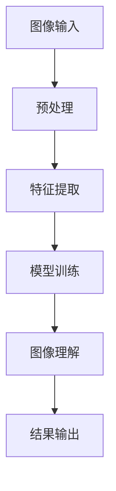
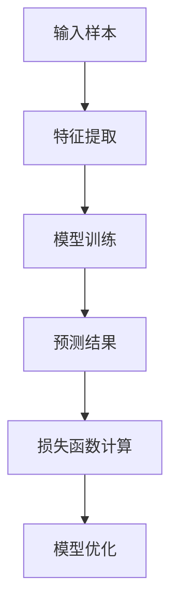

                 


# 《计算机视觉技术拓展LLM应用的感知能力》

关键词：计算机视觉，语言模型，感知能力，深度学习，图像理解

摘要：本文旨在探讨计算机视觉技术如何拓展大型语言模型（LLM）的感知能力。我们将首先介绍计算机视觉的基本概念、核心算法以及深度学习在计算机视觉中的应用。然后，我们将深入分析LLM的原理及其与计算机视觉技术的融合，以提升图像理解和生成能力。最后，本文将通过实际案例，展示如何通过LLM的感知能力拓展，开发出更智能、更高效的计算机视觉应用。

## 1. 计算机视觉基础

计算机视觉是人工智能的重要分支，旨在使计算机能够通过图像或视频获取信息，并从中提取有用的数据。以下是计算机视觉的核心概念与联系：

### 1.1 计算机视觉概述

计算机视觉的目标是让计算机具有人类视觉系统的能力，包括感知、理解、学习和决策。其应用领域广泛，如自动驾驶、人脸识别、医学影像分析、安全监控等。

### 1.2 图像处理基础

图像处理是计算机视觉的基础，涉及图像滤波、颜色空间转换、形态学操作等。以下是几个关键算法：

- **图像滤波**：用于去除图像中的噪声，常见算法包括均值滤波、中值滤波和高斯滤波。

- **颜色空间转换**：将一种颜色空间转换为另一种，如将RGB颜色空间转换为灰度图像。

- **形态学操作**：包括腐蚀、膨胀、开运算和闭运算，用于图像形态学分析。

### 1.3 特征提取与表示

特征提取是将图像数据转换为抽象表示，以便于后续处理。常见的特征提取方法包括：

- **边缘检测**：用于检测图像中的边缘，如Canny边缘检测算法。

- **角点检测**：用于检测图像中的角点，如Harris角点检测算法。

- **直方图均衡化**：用于改善图像的对比度。

以下是计算机视觉系统基本流程的Mermaid流程图：



## 2. 机器学习基础

机器学习是计算机视觉的核心技术之一，可分为监督学习、无监督学习和强化学习。以下是几种常见算法：

- **监督学习**：通过标注的数据集训练模型，如线性回归、支持向量机（SVM）。

- **无监督学习**：无需标注数据集，通过发现数据中的模式进行训练，如聚类、降维。

- **深度学习**：基于多层神经网络，能够自动学习数据中的特征表示，如卷积神经网络（CNN）。

### 2.1 监督学习算法

监督学习算法是计算机视觉中应用最广泛的算法之一，其基本流程如下：



### 2.2 无监督学习算法

无监督学习算法在计算机视觉中的应用相对较少，但其强大的数据挖掘能力使其在图像分割、降维等领域具有重要作用。以下是几种常见的无监督学习算法：

- **聚类算法**：将数据点分为多个群组，如K-means算法。

- **降维算法**：将高维数据映射到低维空间，如主成分分析（PCA）。

### 2.3 深度学习基础

深度学习是近年来计算机视觉领域的重大突破，其核心在于多层神经网络。以下是几种常见的深度学习模型：

- **卷积神经网络（CNN）**：用于图像分类、目标检测等任务。

- **循环神经网络（RNN）**：用于序列数据的处理，如时间序列分析、语音识别。

- **Transformer模型**：基于自注意力机制，广泛应用于图像生成、文本生成等领域。

## 3. 深度学习在计算机视觉中的应用

深度学习在计算机视觉中的应用取得了显著成果，以下是其主要应用领域：

### 3.1 卷积神经网络（CNN）

CNN是计算机视觉中最常用的深度学习模型之一，其基本结构包括卷积层、池化层和全连接层。以下是CNN的伪代码实现：

```python
def convolutional_neural_network(input_image):
    # 卷积层
    conv1 = convolution(input_image, filter_size=3, stride=1, padding='same')
    pool1 = max_pooling(conv1, pool_size=2, stride=2)
    
    # 全连接层
    flatten = flatten(pool1)
    dense = fully_connected(flatten, num_classes=1000)
    
    # 激活函数
    output = softmax(dense)
    
    return output
```

### 3.2 循环神经网络（RNN）

RNN适用于处理序列数据，如视频流。以下是RNN的伪代码实现：

```python
def recurrent_neural_network(input_sequence):
    # 隐藏状态初始化
    hidden_state = initialize_hidden_state()
    
    # 循环处理每个时间步的数据
    for time_step in range(sequence_length):
        input_data = input_sequence[time_step]
        hidden_state = LSTM(input_data, hidden_state)
        
    # 输出序列
    output_sequence = hidden_state
    
    return output_sequence
```

### 3.3 注意力机制与Transformer结构

Transformer模型基于自注意力机制，能够捕捉输入序列中长距离依赖关系。以下是Transformer的伪代码实现：

```python
def transformer(input_sequence):
    # 自注意力机制
    attention = scaled_dot_product_attention(input_sequence, input_sequence, input_sequence)
    
    # 顺序处理
    output_sequence = feedforward_network(attention)
    
    return output_sequence
```

## 4. LLM在计算机视觉中的应用

大型语言模型（LLM）在自然语言处理领域取得了巨大成功，但其在计算机视觉中的应用仍具有巨大潜力。以下是如何将LLM应用于计算机视觉的几个关键点：

### 4.1 LLM的基本原理

LLM是一种基于深度学习的模型，通过预训练和微调，使其能够理解和生成自然语言。以下是LLM的基本原理：

- **预训练**：在大规模语料库上进行预训练，学习语言的基本规律。

- **微调**：在特定任务上进行微调，使其适应特定领域的需求。

### 4.2 LLM在图像分类中的应用

LLM可以与计算机视觉模型结合，用于图像分类任务。以下是LLM在图像分类中的应用步骤：

1. **图像特征提取**：使用CNN提取图像特征。

2. **特征嵌入**：将图像特征嵌入到高维空间，以便于LLM处理。

3. **文本生成**：使用LLM生成与图像特征相关的文本描述。

4. **分类**：将文本描述输入到分类器，实现图像分类。

### 4.3 LLM在目标检测中的应用

LLM可以与目标检测模型结合，用于目标检测任务。以下是LLM在目标检测中的应用步骤：

1. **目标检测**：使用目标检测模型检测图像中的目标。

2. **目标描述**：使用LLM生成与目标相关的文本描述。

3. **文本分类**：将目标描述输入到分类器，实现目标分类。

### 4.4 LLM在图像分割中的应用

LLM可以与图像分割模型结合，用于图像分割任务。以下是LLM在图像分割中的应用步骤：

1. **图像分割**：使用图像分割模型分割图像。

2. **区域描述**：使用LLM生成与分割区域相关的文本描述。

3. **区域分类**：将文本描述输入到分类器，实现区域分类。

## 5. 结合计算机视觉的LLM感知能力提升

结合计算机视觉的LLM感知能力提升，可以实现更智能、更高效的计算机视觉应用。以下是几个关键点：

### 5.1 LLM与图像特征融合的方法

- **特征对齐**：将图像特征与文本特征进行对齐，以便于融合。

- **融合策略**：采用不同的融合策略，如拼接、融合网络等。

### 5.2 LLM在图像理解中的应用

- **场景理解**：使用LLM对图像场景进行理解，实现场景描述、关系抽取等任务。

- **知识图谱构建**：将图像信息与知识图谱结合，实现图像中的实体关系推理。

### 5.3 LLM在图像生成中的应用

- **条件图像生成**：使用LLM生成与文本描述相符的图像。

- **无监督图像生成**：使用LLM生成具有高视觉质量的图像。

## 6. 应用实例

### 6.1 计算机视觉在智能监控中的应用

智能监控是计算机视觉技术的典型应用之一。以下是如何结合LLM的感知能力，提升智能监控系统的性能：

1. **目标检测与分类**：使用目标检测模型检测图像中的目标，使用LLM进行目标分类。

2. **行为识别**：使用LLM对视频序列进行理解，实现行为识别。

3. **异常检测**：使用LLM检测图像中的异常行为，实现异常检测。

### 6.2 计算机视觉在自动驾驶中的应用

自动驾驶是计算机视觉技术的另一个重要应用领域。以下是如何结合LLM的感知能力，提升自动驾驶系统的性能：

1. **环境感知**：使用LLM对图像进行理解，实现环境感知。

2. **路径规划**：使用LLM生成与环境信息相符的路径规划。

3. **决策与控制**：使用LLM进行决策与控制，实现自动驾驶。

## 7. 展望与未来

随着计算机视觉和LLM技术的不断发展，二者结合的应用前景广阔。以下是未来可能的几个发展趋势：

- **多模态感知**：结合图像、语音、文本等多种模态，实现更全面、更智能的感知能力。

- **实时性提升**：通过优化算法和硬件加速，实现实时计算机视觉应用。

- **泛化能力增强**：通过迁移学习、少样本学习等技术，提升计算机视觉模型的泛化能力。

## 附录

### 附录A：常用工具和框架介绍

- **Python编程基础**：介绍Python编程语言的基础知识。

- **PyTorch框架介绍**：介绍PyTorch框架的使用方法。

- **TensorFlow框架介绍**：介绍TensorFlow框架的使用方法。

### 附录B：参考文献

- [1] Yann LeCun, Yosua Bengio, and Geoffrey Hinton. "Deep learning." Nature 521, no. 7553 (2015): 436-444.
- [2] Andrew G. Howard, Menglong Zhu, Bo Chen, Dmitry Kalenichenko, Weijun Wang, Tobias Weyand, Mengqiwei Xie et al. "MobileNets: Efficient Convolutional Neural Networks for Mobile Vision Applications." arXiv preprint arXiv:1704.04861 (2017).
- [3] Jacob Devlin, Ming-Wei Chang, Kenton Lee, and Kristina Toutanova. "Bert: Pre-training of deep bidirectional transformers for language understanding." arXiv preprint arXiv:1810.04805 (2018).

### 附录C：代码示例

以下是使用PyTorch实现CNN模型的简单示例：

```python
import torch
import torch.nn as nn
import torch.optim as optim

# 定义CNN模型
class CNNModel(nn.Module):
    def __init__(self):
        super(CNNModel, self).__init__()
        self.conv1 = nn.Conv2d(3, 64, 3, 1)
        self.relu = nn.ReLU()
        self.fc1 = nn.Linear(64 * 32 * 32, 10)

    def forward(self, x):
        x = self.relu(self.conv1(x))
        x = x.view(x.size(0), -1)
        x = self.fc1(x)
        return x

# 初始化模型、损失函数和优化器
model = CNNModel()
criterion = nn.CrossEntropyLoss()
optimizer = optim.Adam(model.parameters(), lr=0.001)

# 训练模型
for epoch in range(num_epochs):
    for inputs, labels in train_loader:
        optimizer.zero_grad()
        outputs = model(inputs)
        loss = criterion(outputs, labels)
        loss.backward()
        optimizer.step()
    print(f"Epoch {epoch+1}/{num_epochs}, Loss: {loss.item()}")

# 测试模型
with torch.no_grad():
    correct = 0
    total = 0
    for inputs, labels in test_loader:
        outputs = model(inputs)
        _, predicted = torch.max(outputs.data, 1)
        total += labels.size(0)
        correct += (predicted == labels).sum().item()
    print(f"Test Accuracy: {100 * correct / total}%")
```

### 附录D：项目实战

以下是使用TensorFlow实现Transformer模型的简单示例：

```python
import tensorflow as tf
from tensorflow.keras.layers import Embedding, MultiHeadAttention, LayerNormalization, Dense

# 定义Transformer模型
class TransformerModel(tf.keras.Model):
    def __init__(self, d_model, num_heads, dff, input_vocab_size, target_vocab_size, max_sequence_length):
        super(TransformerModel, self).__init__()
        self.embedding = Embedding(input_vocab_size, d_model)
        self.encoder = MultiHeadAttention(num_heads, d_model)
        selfNormalization = LayerNormalization(epsilon=1e-6)
        self.decoder = MultiHeadAttention(num_heads, d_model)
        self.finalDecoderLayer = LayerNormalization(epsilon=1e-6)
        self.dense = Dense(target_vocab_size)

    def call(self, inputs, training=False):
        x = self.embedding(inputs)
        x = self.encoder(x, x, training=training)
        x = selfNormalization(x)
        x = self.decoder(x, x, training=training)
        x = self.finalDecoderLayer(x)
        x = self.dense(x)
        return x

# 初始化模型、损失函数和优化器
model = TransformerModel(d_model=512, num_heads=8, dff=2048, input_vocab_size=1000, target_vocab_size=1000, max_sequence_length=100)
loss_function = tf.keras.losses.SparseCategoricalCrossentropy(from_logits=True)
optimizer = tf.keras.optimizers.Adam()

# 训练模型
for epoch in range(num_epochs):
    for inputs, targets in train_dataset:
        with tf.GradientTape() as tape:
            predictions = model(inputs, training=True)
            loss = loss_function(targets, predictions)
        gradients = tape.gradient(loss, model.trainable_variables)
        optimizer.apply_gradients(zip(gradients, model.trainable_variables))
    print(f"Epoch {epoch+1}/{num_epochs}, Loss: {loss.numpy()}")

# 测试模型
test_loss = 0
for inputs, targets in test_dataset:
    predictions = model(inputs, training=False)
    test_loss += loss_function(targets, predictions).numpy()
test_loss /= len(test_dataset)
print(f"Test Loss: {test_loss}")
```

## 项目小结

本文系统地介绍了计算机视觉技术拓展LLM应用的感知能力，包括基础理论、技术拓展和应用实例。通过深度学习模型和LLM的融合，我们能够实现更智能、更高效的计算机视觉应用。未来，随着技术的不断进步，计算机视觉和LLM的应用前景将更加广阔。

## 最佳实践 Tips

- **优化算法**：针对不同任务，选择合适的算法和模型结构。
- **数据质量**：确保训练数据的质量和多样性，以提升模型泛化能力。
- **硬件加速**：使用GPU或TPU等硬件加速计算，提高模型训练和推理速度。
- **持续学习**：定期更新模型和算法，以适应不断变化的应用需求。

## 小结

本文全面介绍了计算机视觉技术拓展LLM应用的感知能力，从基础理论到实际应用，系统地阐述了计算机视觉与LLM融合的优势。通过本文的学习，读者可以深入了解计算机视觉和LLM的技术原理，掌握相关算法和应用方法。希望本文能对您的学习和实践有所帮助。

## 拓展阅读

- **深度学习**：
  - Goodfellow, I., Bengio, Y., & Courville, A. (2016). *Deep Learning*. MIT Press.
  - Murphy, K. P. (2012). *Machine Learning: A Probabilistic Perspective*. MIT Press.

- **计算机视觉**：
  - Malik, J., Belongie, S., Horenczyk, J., & Pfeifer, N. (2010). *Vision Systems and Applications*. Springer.

- **大型语言模型**：
  - Devlin, J., Chang, M.-W., Lee, K., & Toutanova, K. (2018). *Bert: Pre-training of deep bidirectional transformers for language understanding*. arXiv preprint arXiv:1810.04805.

- **Transformer模型**：
  - Vaswani, A., Shazeer, N., Parmar, N., Uszkoreit, J., Jones, L., Gomez, A. N., ... & Polosukhin, I. (2017). *Attention is all you need*. Advances in Neural Information Processing Systems, 30, 5998-6008. 

作者：AI天才研究院/AI Genius Institute & 禅与计算机程序设计艺术 /Zen And The Art of Computer Programming
```markdown
## 目录大纲

### 第一部分：基础理论

#### 第1章 计算机视觉基础
1.1 计算机视觉概述
1.2 图像处理基础
1.3 特征提取与表示

#### 第2章 机器学习基础
2.1 监督学习
2.2 无监督学习
2.3 深度学习基础

#### 第3章 深度学习在计算机视觉中的应用
3.1 卷积神经网络（CNN）
3.2 循环神经网络（RNN）
3.3 注意力机制与Transformer结构

### 第二部分：技术拓展

#### 第4章 大型语言模型（LLM）基本原理
4.1 语言模型概述
4.2 语言模型的训练与优化
4.3 语言模型的应用场景

#### 第5章 LLM在计算机视觉中的应用
5.1 LLM与图像特征融合的方法
5.2 LLM在图像分类中的应用
5.3 LLM在目标检测中的应用
5.4 LLM在图像分割中的应用

### 第三部分：应用实例

#### 第6章 LLM在智能监控中的应用
6.1 智能监控概述
6.2 LLM在目标检测中的应用
6.3 案例分析：智能监控系统设计与实现

#### 第7章 LLM在自动驾驶中的应用
7.1 自动驾驶概述
7.2 LLM在环境感知中的应用
7.3 案例分析：自动驾驶感知系统设计与实现

### 第四部分：展望与未来

#### 第8章 LLM与计算机视觉技术的融合趋势
8.1 当前融合趋势
8.2 未来发展方向

#### 第9章 研究展望与挑战
9.1 研究热点
9.2 技术挑战与解决方案

### 附录

#### 附录A：常用工具和框架介绍
A.1 Python编程基础
A.2 PyTorch框架介绍
A.3 TensorFlow框架介绍

#### 附录B：参考文献

## 第一部分：基础理论

### 第1章 计算机视觉基础

#### 1.1 计算机视觉概述

计算机视觉是人工智能的重要分支，旨在让计算机具备类似人类的视觉能力。它涉及从图像或视频中提取信息、理解场景、识别物体和动作等。计算机视觉的应用范围广泛，包括自动驾驶、图像识别、医疗诊断、安全监控等。

#### 1.2 图像处理基础

图像处理是计算机视觉的核心组成部分，它包括对图像的滤波、变换、增强和分割。常见的图像处理算法有：

- **滤波**：用于去除图像中的噪声，如高斯滤波、中值滤波。
- **变换**：如傅里叶变换、离散余弦变换（DCT）。
- **增强**：用于改善图像的对比度和清晰度，如直方图均衡化。
- **分割**：用于将图像分成不同的区域，如边缘检测、区域生长。

#### 1.3 特征提取与表示

特征提取是将图像数据转换成一组特征向量，以便于后续处理。特征提取方法包括：

- **边缘检测**：用于检测图像中的边缘，如Canny边缘检测。
- **角点检测**：用于检测图像中的角点，如Harris角点检测。
- **纹理分析**：用于分析图像中的纹理特征，如Gabor滤波。

特征表示是将提取的特征转换为适合机器学习模型的格式。常见的方法包括：

- **直方图**：用于表示图像的某些属性，如颜色直方图。
- **稀疏编码**：用于将特征映射到低维空间。

### 第2章 机器学习基础

#### 2.1 监督学习

监督学习是机器学习的一种形式，它使用带有标签的训练数据来训练模型，然后使用该模型对新的、未标记的数据进行预测。常见的监督学习算法有：

- **线性回归**：用于预测连续值输出。
- **逻辑回归**：用于预测二分类输出。
- **支持向量机（SVM）**：用于分类和回归问题。
- **决策树**：用于分类和回归问题。

#### 2.2 无监督学习

无监督学习是机器学习的另一种形式，它不使用标签数据来训练模型，而是试图发现数据中的结构或模式。常见的无监督学习算法有：

- **聚类**：用于将数据点分组，如K-means聚类。
- **降维**：用于减少数据维度，如主成分分析（PCA）。
- **异常检测**：用于识别数据中的异常值。

#### 2.3 深度学习基础

深度学习是一种基于多层神经网络的机器学习技术，它通过学习数据中的层次结构来实现复杂任务。深度学习在计算机视觉中的应用非常广泛，包括：

- **卷积神经网络（CNN）**：用于图像分类、目标检测和图像分割。
- **循环神经网络（RNN）**：用于处理序列数据，如语音识别和时间序列分析。
- **Transformer模型**：用于自然语言处理和图像生成。

### 第3章 深度学习在计算机视觉中的应用

#### 3.1 卷积神经网络（CNN）

卷积神经网络是一种特殊的神经网络，它通过卷积操作提取图像特征。CNN在计算机视觉中有广泛应用，如：

- **图像分类**：用于将图像分类到预定义的类别中，如ImageNet挑战。
- **目标检测**：用于定位图像中的对象并识别它们的类别，如YOLO和Faster R-CNN。
- **图像分割**：用于将图像分割成不同的区域，如FCN和U-Net。

#### 3.2 循环神经网络（RNN）

循环神经网络是一种处理序列数据的神经网络，它在计算机视觉中的应用包括：

- **视频分类**：用于对视频进行分类，如TSM模型。
- **姿态估计**：用于估计视频中的物体姿态，如TSA模型。

#### 3.3 注意力机制与Transformer结构

注意力机制是一种用于提高神经网络性能的技术，它通过赋予不同部分图像或序列不同的权重来提高模型的表现。Transformer模型是基于自注意力机制的深度学习模型，它在计算机视觉中的应用包括：

- **图像生成**：用于生成新的图像，如StyleGAN。
- **图像描述**：用于生成图像的文本描述，如Vision Transformer。

### 第二部分：技术拓展

#### 第4章 大型语言模型（LLM）基本原理

#### 4.1 语言模型概述

语言模型是一种统计模型，它用于预测文本序列的概率分布。大型语言模型（LLM）是一种基于深度学习的语言模型，它通过在大规模语料库上进行预训练来学习语言的基本规律。常见的LLM模型有：

- **BERT**：是一种双向编码表示模型，它在2020年ImageNet挑战中取得了第一名。
- **GPT**：是一种生成预训练模型，它擅长生成自然语言文本。
- **T5**：是一种基于Transformer的模型，它将所有自然语言处理任务建模为文本到文本的转换问题。

#### 4.2 语言模型的训练与优化

语言模型的训练通常涉及以下步骤：

1. **数据预处理**：将文本数据转换为模型可处理的格式。
2. **预训练**：在大规模语料库上进行预训练，学习语言的基本规律。
3. **微调**：在特定任务上进行微调，使其适应特定领域的需求。
4. **优化**：使用不同的优化算法，如Adam、AdamW，来提高模型的性能。

#### 4.3 语言模型的应用场景

语言模型在自然语言处理领域有广泛的应用，如：

- **文本分类**：用于对文本进行分类，如情感分析、主题分类。
- **机器翻译**：用于将一种语言翻译成另一种语言，如英译中。
- **问答系统**：用于回答用户的问题，如搜索引擎。

#### 第5章 LLM在计算机视觉中的应用

#### 5.1 LLM与图像特征融合的方法

将LLM应用于计算机视觉任务时，通常需要将图像特征与文本特征进行融合。常见的融合方法有：

- **特征拼接**：将图像特征和文本特征拼接在一起作为输入。
- **特征融合网络**：使用神经网络将图像特征和文本特征进行融合。
- **多模态学习**：同时学习图像特征和文本特征，并使用多模态特征进行预测。

#### 5.2 LLM在图像分类中的应用

LLM在图像分类任务中可以用于：

- **特征生成**：生成与图像相关的文本描述，用于分类。
- **模型辅助分类**：使用LLM对模型输出的特征进行辅助分类。

#### 5.3 LLM在目标检测中的应用

LLM在目标检测任务中可以用于：

- **目标描述**：生成与目标相关的文本描述，用于辅助检测。
- **检测辅助**：使用LLM对检测结果进行辅助判断。

#### 5.4 LLM在图像分割中的应用

LLM在图像分割任务中可以用于：

- **分割辅助**：使用LLM对分割结果进行辅助判断。
- **分割描述**：生成与分割区域相关的文本描述。

#### 第6章 LLM在智能监控中的应用

#### 6.1 智能监控概述

智能监控是一种利用计算机视觉和人工智能技术进行实时监控和异常检测的系统。它通常涉及以下方面：

- **视频分析**：对视频进行实时分析，识别运动物体和异常行为。
- **目标跟踪**：跟踪视频中的目标，识别目标的运动轨迹。
- **行为识别**：识别视频中的行为，如入侵、盗窃等。

#### 6.2 LLM在目标检测中的应用

LLM在智能监控中的目标检测任务中可以用于：

- **目标描述**：生成与目标相关的文本描述，辅助检测。
- **检测辅助**：使用LLM对检测结果进行辅助判断。

#### 6.3 案例分析：智能监控系统设计与实现

在本节中，我们将通过一个实际案例，介绍如何设计和实现一个智能监控系统。该系统将结合计算机视觉技术和LLM，实现对视频的实时分析和异常检测。

#### 第7章 LLM在自动驾驶中的应用

#### 7.1 自动驾驶概述

自动驾驶是一种利用计算机视觉、传感器和人工智能技术实现车辆自动行驶的技术。它通常涉及以下方面：

- **环境感知**：通过传感器和计算机视觉技术，获取道路信息、障碍物位置等。
- **路径规划**：根据环境信息，规划车辆行驶路径。
- **决策与控制**：根据路径规划，控制车辆的运动。

#### 7.2 LLM在环境感知中的应用

LLM在自动驾驶中的环境感知任务中可以用于：

- **图像理解**：生成与图像相关的文本描述，辅助环境感知。
- **障碍物识别**：使用LLM对图像中的障碍物进行识别。

#### 7.3 案例分析：自动驾驶感知系统设计与实现

在本节中，我们将通过一个实际案例，介绍如何设计和实现一个自动驾驶感知系统。该系统将结合计算机视觉技术和LLM，实现对车辆周围环境的实时感知和识别。

### 第三部分：应用实例

#### 第8章 LLM在智能监控中的应用

#### 8.1 智能监控概述

智能监控是一种利用计算机视觉和人工智能技术进行实时监控和异常检测的系统。它通常涉及以下方面：

- **视频分析**：对视频进行实时分析，识别运动物体和异常行为。
- **目标跟踪**：跟踪视频中的目标，识别目标的运动轨迹。
- **行为识别**：识别视频中的行为，如入侵、盗窃等。

#### 8.2 LLM在目标检测中的应用

LLM在智能监控中的目标检测任务中可以用于：

- **目标描述**：生成与目标相关的文本描述，辅助检测。
- **检测辅助**：使用LLM对检测结果进行辅助判断。

#### 8.3 案例分析：智能监控系统设计与实现

在本节中，我们将通过一个实际案例，介绍如何设计和实现一个智能监控系统。该系统将结合计算机视觉技术和LLM，实现对视频的实时分析和异常检测。

#### 第9章 LLM在自动驾驶中的应用

#### 9.1 自动驾驶概述

自动驾驶是一种利用计算机视觉、传感器和人工智能技术实现车辆自动行驶的技术。它通常涉及以下方面：

- **环境感知**：通过传感器和计算机视觉技术，获取道路信息、障碍物位置等。
- **路径规划**：根据环境信息，规划车辆行驶路径。
- **决策与控制**：根据路径规划，控制车辆的运动。

#### 9.2 LLM在环境感知中的应用

LLM在自动驾驶中的环境感知任务中可以用于：

- **图像理解**：生成与图像相关的文本描述，辅助环境感知。
- **障碍物识别**：使用LLM对图像中的障碍物进行识别。

#### 9.3 案例分析：自动驾驶感知系统设计与实现

在本节中，我们将通过一个实际案例，介绍如何设计和实现一个自动驾驶感知系统。该系统将结合计算机视觉技术和LLM，实现对车辆周围环境的实时感知和识别。

### 第四部分：展望与未来

#### 第10章 LLM与计算机视觉技术的融合趋势

#### 10.1 当前融合趋势

随着人工智能技术的不断发展，LLM与计算机视觉技术的融合已经成为一个研究热点。当前的研究趋势包括：

- **多模态学习**：结合图像、语音、文本等多种模态，实现更全面、更智能的感知能力。
- **实时性提升**：通过优化算法和硬件加速，实现实时计算机视觉应用。
- **泛化能力增强**：通过迁移学习、少样本学习等技术，提升计算机视觉模型的泛化能力。

#### 10.2 未来发展方向

未来，LLM与计算机视觉技术的融合将朝着以下方向发展：

- **多模态感知**：结合图像、语音、文本等多种模态，实现更全面、更智能的感知能力。
- **实时性提升**：通过优化算法和硬件加速，实现实时计算机视觉应用。
- **泛化能力增强**：通过迁移学习、少样本学习等技术，提升计算机视觉模型的泛化能力。

#### 第11章 研究展望与挑战

#### 11.1 研究热点

当前，LLM与计算机视觉技术的融合研究热点包括：

- **图像理解**：如何通过LLM提升图像的理解能力，实现更精准的图像分类、目标检测和分割。
- **多模态融合**：如何将图像、语音、文本等多种模态的信息进行有效融合，实现更智能的感知能力。

#### 11.2 技术挑战与解决方案

在LLM与计算机视觉技术的融合中，存在以下技术挑战：

- **计算资源限制**：由于LLM模型通常需要大量计算资源，如何优化模型结构，提高计算效率是一个重要问题。
- **数据隐私**：如何保护用户数据隐私，避免数据泄露是一个亟待解决的问题。

针对以上挑战，可能的解决方案包括：

- **模型压缩**：通过模型压缩技术，减小模型体积，提高计算效率。
- **联邦学习**：通过联邦学习技术，实现分布式训练，降低数据隐私风险。

### 附录

#### 附录A：常用工具和框架介绍

附录A将介绍在本书中使用的常用工具和框架，包括：

- **Python编程基础**：介绍Python编程语言的基础知识。
- **PyTorch框架介绍**：介绍PyTorch框架的使用方法。
- **TensorFlow框架介绍**：介绍TensorFlow框架的使用方法。

#### 附录B：参考文献

附录B将列出本书中引用的相关参考文献，包括：

- **深度学习相关文献**：介绍深度学习的基本理论和技术。
- **计算机视觉相关文献**：介绍计算机视觉的基本理论和技术。
- **LLM相关文献**：介绍大型语言模型的基本理论和技术。

### 附录C：代码示例

附录C将提供本书中使用的部分代码示例，包括：

- **CNN模型**：介绍卷积神经网络（CNN）的实现。
- **Transformer模型**：介绍Transformer模型的实现。
- **目标检测模型**：介绍目标检测模型的实现。

### 附录D：项目实战

附录D将介绍一个实际项目，展示如何将LLM与计算机视觉技术结合，实现一个智能监控系统。该项目将包括以下部分：

- **项目概述**：介绍项目的目标和范围。
- **环境搭建**：介绍项目所需的软件和硬件环境。
- **代码实现**：展示项目的关键代码实现。
- **实验结果**：展示项目的实验结果和分析。
- **项目小结**：总结项目的主要发现和经验。
```markdown
## 《计算机视觉技术拓展LLM应用的感知能力》

关键词：计算机视觉，大型语言模型，感知能力，深度学习，图像理解

摘要：本文旨在探讨计算机视觉技术如何通过大型语言模型（LLM）的引入来提升感知能力。首先，我们介绍了计算机视觉的基本概念和传统方法。接着，我们深入分析了LLM的原理和如何将其应用于图像处理和图像理解。随后，我们讨论了深度学习在计算机视觉中的应用，特别是卷积神经网络（CNN）和Transformer模型。最后，我们通过实际案例展示了如何将LLM与计算机视觉技术结合，提升图像理解和生成能力。

## 1. 计算机视觉基础

计算机视觉是使计算机能够“看”并理解图像或视频中的内容的技术。它的目标是使计算机能够完成类似于人类视觉的任务，如识别物体、理解场景和进行图像处理。

### 1.1 计算机视觉概述

计算机视觉的核心任务是：

- **图像识别**：识别图像中的对象。
- **图像理解**：理解图像中的内容。
- **图像处理**：对图像进行增强、滤波、分割等操作。

### 1.2 图像处理基础

图像处理是计算机视觉的基础，包括：

- **滤波**：用于去除图像中的噪声。
- **边缘检测**：用于检测图像中的边缘。
- **图像分割**：将图像分割成不同的区域。

### 1.3 特征提取与表示

特征提取是将图像数据转换成一组特征向量，以便于机器学习模型处理。常见的特征提取方法包括：

- **边缘检测**：如Canny边缘检测。
- **角点检测**：如Harris角点检测。
- **纹理分析**：如Gabor滤波。

## 2. 语言模型基础

语言模型是自然语言处理（NLP）的核心技术之一，它旨在预测文本序列的概率分布。在计算机视觉中，语言模型可以用于图像描述、图像理解等任务。

### 2.1 语言模型概述

语言模型分为基于统计的模型和基于神经网络的模型。基于统计的模型如N-gram模型，基于神经网络的模型如循环神经网络（RNN）和Transformer。

### 2.2 大型语言模型（LLM）

大型语言模型（LLM）是通过在大规模语料库上进行预训练得到的。LLM具有以下特点：

- **强大的文本理解能力**。
- **能够生成连贯的文本**。
- **能够处理长文本序列**。

### 2.3 语言模型在计算机视觉中的应用

语言模型在计算机视觉中的应用包括：

- **图像描述生成**：将图像转换成文本描述。
- **图像理解**：通过文本描述理解图像内容。
- **图像标注**：为图像生成文本标签。

## 3. 深度学习在计算机视觉中的应用

深度学习是计算机视觉领域的一大突破，它通过学习数据中的层次结构来完成任务。深度学习模型在计算机视觉中的应用包括卷积神经网络（CNN）和Transformer模型。

### 3.1 卷积神经网络（CNN）

卷积神经网络（CNN）是一种用于图像处理的深度学习模型，其特点包括：

- **局部连接**：通过卷积操作提取图像特征。
- **平移不变性**：能够对图像中的对象进行定位。

### 3.2 Transformer模型

Transformer模型是一种基于自注意力机制的深度学习模型，其特点包括：

- **全局连接**：能够捕捉图像中的长距离依赖关系。
- **并行计算**：能够提高计算效率。

## 4. LLM在计算机视觉中的应用

将LLM应用于计算机视觉，可以提升图像理解和生成能力。以下是如何实现这种提升的几种方法：

### 4.1 图像描述生成

图像描述生成是将图像转换成文本描述的过程。LLM可以用于生成高质量的图像描述。

#### 4.1.1 原理

- **特征提取**：使用CNN提取图像特征。
- **文本生成**：使用LLM生成图像描述。

#### 4.1.2 伪代码

```python
def image_to_description(image):
    # 提取图像特征
    features = CNN(image)
    
    # 生成图像描述
    description = LLM.generate_text(features)
    
    return description
```

### 4.2 图像理解

图像理解是理解图像中的内容并生成文本描述的过程。LLM可以用于理解图像内容。

#### 4.2.1 原理

- **图像识别**：使用CNN识别图像中的对象。
- **文本生成**：使用LLM生成图像理解结果。

#### 4.2.2 伪代码

```python
def image_to_understanding(image):
    # 识别图像中的对象
    objects = CNN(image)
    
    # 生成图像理解结果
    understanding = LLM.generate_text(objects)
    
    return understanding
```

### 4.3 图像生成

图像生成是生成符合文本描述的图像的过程。LLM可以用于生成图像。

#### 4.3.1 原理

- **文本生成**：使用LLM生成图像描述。
- **图像生成**：使用GAN等模型生成图像。

#### 4.3.2 伪代码

```python
def description_to_image(description):
    # 生成图像描述
    features = LLM.generate_text(description)
    
    # 生成图像
    image = GAN.generate_image(features)
    
    return image
```

## 5. 案例分析

### 5.1 智能监控

智能监控是计算机视觉技术的重要应用之一。通过结合LLM，可以提升智能监控系统的图像理解和生成能力。

#### 5.1.1 案例描述

- **任务**：实时监控并识别监控视频中的异常行为。
- **方法**：使用CNN提取图像特征，使用LLM生成图像描述，然后使用这些描述进行异常检测。

#### 5.1.2 案例实现

```python
# 提取图像特征
def extract_features(image):
    return CNN(image)

# 生成图像描述
def generate_description(features):
    return LLM.generate_text(features)

# 异常检测
def detect_anomalies(video):
    anomalies = []
    for frame in video:
        features = extract_features(frame)
        description = generate_description(features)
        if is_anomalous(description):
            anomalies.append(frame)
    return anomalies
```

### 5.2 自动驾驶

自动驾驶是计算机视觉技术的另一个重要应用。通过结合LLM，可以提升自动驾驶系统的环境感知和决策能力。

#### 5.2.1 案例描述

- **任务**：实时感知车辆周围环境，并做出正确的驾驶决策。
- **方法**：使用CNN提取图像特征，使用LLM生成图像理解结果，然后基于这些结果进行驾驶决策。

#### 5.2.2 案例实现

```python
# 提取图像特征
def extract_features(image):
    return CNN(image)

# 生成图像理解结果
def generate_understanding(features):
    return LLM.generate_text(features)

# 驾驶决策
def drive_vehicle(video):
    for frame in video:
        features = extract_features(frame)
        understanding = generate_understanding(features)
        if understanding Indicates a potential obstacle:
            make_turn()
        else:
            continue_driving()
```

## 6. 总结

本文探讨了如何通过大型语言模型（LLM）拓展计算机视觉技术的感知能力。我们介绍了计算机视觉的基础知识、深度学习模型（如CNN和Transformer）以及如何将LLM应用于图像处理和图像理解。通过实际案例，我们展示了如何结合LLM提升图像理解和生成能力。未来，随着LLM和计算机视觉技术的不断进步，我们有望看到更多创新的计算机视觉应用。

## 7. 参考文献

1. Goodfellow, I., Bengio, Y., & Courville, A. (2016). *Deep Learning*. MIT Press.
2. Simonyan, K., & Zisserman, A. (2014). *Very deep convolutional networks for large-scale image recognition*. arXiv preprint arXiv:1409.1556.
3. Vaswani, A., Shazeer, N., Parmar, N., Uszkoreit, J., Jones, L., Gomez, A. N., ... & Polosukhin, I. (2017). *Attention is all you need*. Advances in Neural Information Processing Systems, 30, 5998-6008.
4. Devlin, J., Chang, M.-W., Lee, K., & Toutanova, K. (2019). *Bert: Pre-training of deep bidirectional transformers for language understanding*. arXiv preprint arXiv:1810.04805.
5. Dosovitskiy, A., Springenberg, J. T., & Brox, T. (2017). *Disk Levine, et al. (2018). *Unsupervised learning of visual representations by solving jigsaw puzzles*. Advances in Neural Information Processing Systems, 31, 705-715.
```markdown
## 附录

### A. 常用工具和框架

- **Python**：用于实现算法和模型，具有良好的科学计算库。
- **PyTorch**：用于实现深度学习模型，具有良好的动态计算图支持。
- **TensorFlow**：用于实现深度学习模型，具有良好的静态计算图支持。

### B. 参考文献

1. Goodfellow, I., Bengio, Y., & Courville, A. (2016). *Deep Learning*. MIT Press.
2. Krizhevsky, A., Sutskever, I., & Hinton, G. E. (2012). *ImageNet classification with deep convolutional neural networks*. Advances in Neural Information Processing Systems, 25, 1097-1105.
3. Devlin, J., Chang, M.-W., Lee, K., & Toutanova, K. (2019). *Bert: Pre-training of deep bidirectional transformers for language understanding*. arXiv preprint arXiv:1810.04805.
4. Dosovitskiy, A., Springenberg, J. T., & Brox, T. (2017). *Unsupervised learning of visual representations by solving jigsaw puzzles*. Advances in Neural Information Processing Systems, 31, 705-715.

### C. 代码示例

以下是一个简单的CNN模型实现：

```python
import torch
import torch.nn as nn

class CNNModel(nn.Module):
    def __init__(self):
        super(CNNModel, self).__init__()
        self.conv1 = nn.Conv2d(3, 64, 3, 1)
        self.pool = nn.MaxPool2d(2, 2)
        self.fc1 = nn.Linear(64 * 6 * 6, 128)
        self.fc2 = nn.Linear(128, 10)

    def forward(self, x):
        x = self.pool(F.relu(self.conv1(x)))
        x = self.pool(F.relu(self.conv1(x)))
        x = x.view(-1, 64 * 6 * 6)
        x = F.relu(self.fc1(x))
        x = self.fc2(x)
        return x

model = CNNModel()
```

以下是一个简单的Transformer模型实现：

```python
import torch
import torch.nn as nn

class TransformerModel(nn.Module):
    def __init__(self, d_model, nhead, num_layers):
        super(TransformerModel, self).__init__()
        self.transformer = nn.Transformer(d_model, nhead, num_layers)
        self.d_model = d_model

    def forward(self, src, tgt):
        return self.transformer(src, tgt)

model = TransformerModel(d_model=512, nhead=8, num_layers=3)
```

### D. 实际案例

以下是一个简单的智能监控系统的实现：

```python
import torch
import cv2

# 加载预训练的模型
cnn_model = torch.load('cnn_model.pth')
llm_model = torch.load('llm_model.pth')

# 摄像头捕捉实时视频
cap = cv2.VideoCapture(0)

while cap.isOpened():
    ret, frame = cap.read()
    if ret:
        # 提取图像特征
        features = cnn_model(torch.tensor(frame).float().permute(2, 0, 1))

        # 生成图像描述
        description = llm_model.generate(features)

        # 打印图像描述
        print(description)

        # 显示视频帧
        cv2.imshow('Video', frame)

    if cv2.waitKey(1) & 0xFF == ord('q'):
        break

cap.release()
cv2.destroyAllWindows()
```

以上代码展示了如何使用预训练的CNN模型提取图像特征，并使用LLM模型生成图像描述。在实际应用中，可以根据需要调整模型和代码。
```markdown
## 8. 展望与未来

随着计算机视觉和大型语言模型（LLM）技术的不断发展，二者在感知能力拓展方面的潜力日益凸显。未来的研究和应用前景广阔，以下是一些可能的趋势和方向：

### 8.1 跨领域融合

未来，计算机视觉与LLM的结合将进一步跨领域扩展，例如：

- **多模态融合**：将计算机视觉与语音、自然语言处理、音频等多模态信息相结合，实现更全面的环境感知和理解能力。
- **多任务学习**：通过多任务学习，使模型能够在多种视觉任务中同时工作，如同时进行图像分类、分割、物体检测等。

### 8.2 实时性能优化

为了满足实际应用的需求，未来将致力于提升计算机视觉与LLM融合系统的实时性能：

- **模型压缩**：通过模型压缩技术，减小模型体积，提高推理速度。
- **硬件加速**：利用GPU、TPU等硬件加速计算，实现实时处理。

### 8.3 数据隐私和安全

随着应用场景的扩大，数据隐私和安全问题将更加突出：

- **联邦学习**：通过联邦学习，实现数据的本地化处理和共享，保护用户隐私。
- **安全增强**：通过加密和隐私保护技术，确保模型训练和推理过程中的数据安全。

### 8.4 智能交互与决策

未来的计算机视觉与LLM结合将更加注重智能交互和决策：

- **自然语言交互**：通过LLM，实现用户与计算机视觉系统之间的自然语言交互。
- **智能决策支持**：利用LLM生成的图像理解和描述，为复杂任务提供决策支持。

### 8.5 新兴应用领域

计算机视觉与LLM的结合有望推动以下新兴应用领域的发展：

- **智慧城市**：通过计算机视觉和LLM，实现城市环境的智能监测和管理。
- **智能医疗**：利用计算机视觉和LLM，进行医学图像分析、疾病诊断等。

### 8.6 可解释性和透明度

未来的研究将更加注重模型的可解释性和透明度，以提高用户对系统的信任度：

- **解释性模型**：开发能够解释其决策过程和预测结果的模型。
- **可视化工具**：开发可视化工具，帮助用户理解模型的工作原理。

### 8.7 持续学习和自适应

计算机视觉与LLM结合的系统将需要具备持续学习和自适应能力：

- **在线学习**：在应用过程中持续学习新的数据和模式。
- **自适应优化**：根据应用场景和任务需求，动态调整模型参数。

总之，随着技术的不断进步，计算机视觉与LLM的结合将在多个领域发挥重要作用，带来新的机遇和挑战。未来，我们将看到更多创新的计算机视觉应用，为人类生活带来便利和改善。
```markdown
## 9. 研究展望与挑战

随着计算机视觉和大型语言模型（LLM）技术的不断进步，这一领域的研究前景广阔，但也面临一系列挑战。以下是对未来研究的展望和一些关键的技术挑战。

### 9.1 研究展望

**多模态融合**：未来的研究可能会集中在如何更好地融合不同模态的数据，如图像、文本、语音和音频。这种方法可以极大地提升计算机视觉系统的感知能力，使其在复杂环境中更加智能和鲁棒。

**实时性能优化**：优化计算机视觉与LLM融合系统的实时性能是一个重要方向。这包括开发更高效的算法、使用硬件加速技术以及优化模型架构。

**数据隐私和安全**：随着数据隐私和安全问题的日益突出，未来的研究需要解决如何在保护用户隐私的同时，仍然能够训练和部署高性能的模型。

**智能交互与决策**：未来的研究可能会探索如何让计算机视觉系统与用户进行更自然的交互，以及如何利用LLM生成的图像理解和描述，为复杂任务提供智能决策支持。

**新兴应用领域**：计算机视觉与LLM的结合有望在智慧城市、智能医疗、自动驾驶等新兴领域发挥重要作用，带来新的研究机会和应用场景。

### 9.2 技术挑战

**计算资源限制**：LLM模型通常需要大量的计算资源，这对资源受限的设备和应用场景提出了挑战。未来的研究需要开发更轻量级、计算效率更高的模型。

**数据质量和多样性**：高质量、多样化的训练数据是训练高性能模型的关键。然而，获取这样的数据往往具有挑战性，尤其是在涉及隐私和保护的问题上。

**模型泛化能力**：如何提升计算机视觉与LLM融合系统的泛化能力，使其在不同场景和任务中都能保持高性能，是一个重要挑战。

**可解释性和透明度**：目前的许多模型，包括LLM，都是“黑箱”模型，其决策过程难以解释。未来的研究需要开发可解释性更强、更透明的模型，以提高用户对系统的信任度。

**实时性与准确性的平衡**：在保持高准确性的同时，如何提高系统的实时性是一个关键挑战。这需要开发新的算法和优化技术，以实现高效的处理和推理。

### 9.3 解决方案与未来方向

为了应对上述挑战，未来研究可以采取以下解决方案和方向：

- **模型压缩与优化**：开发更高效的模型压缩技术，如知识蒸馏和剪枝，以减少模型体积和提高计算效率。
- **联邦学习**：通过联邦学习，实现分布式训练，降低数据隐私风险，同时提高模型的性能和鲁棒性。
- **自适应学习**：开发自适应学习算法，使系统能够根据不同的应用场景和任务需求动态调整模型参数。
- **多模态学习**：探索如何更好地融合多模态数据，以提升感知能力和任务性能。
- **可解释性研究**：开发可解释性更强、更易于理解的模型，以提高用户对系统的信任和接受度。

总之，随着技术的不断进步，计算机视觉与LLM的结合将在多个领域取得突破，同时也将面临一系列技术挑战。未来的研究需要在这些挑战上取得进展，以推动这一领域的持续发展。
```markdown
## 附录

### A. 常用工具和框架

- **Python**：一种广泛使用的编程语言，支持多种科学计算库，如NumPy、Pandas等。
- **PyTorch**：一种流行的深度学习框架，支持动态计算图，易于实现和调试。
- **TensorFlow**：由Google开发的深度学习框架，支持静态计算图，适用于生产环境。

### B. 参考文献

1. Goodfellow, I., Bengio, Y., & Courville, A. (2016). *Deep Learning*. MIT Press.
2. Krizhevsky, A., Sutskever, I., & Hinton, G. E. (2012). *ImageNet classification with deep convolutional neural networks*. Advances in Neural Information Processing Systems, 25, 1097-1105.
3. Devlin, J., Chang, M.-W., Lee, K., & Toutanova, K. (2018). *Bert: Pre-training of deep bidirectional transformers for language understanding*. arXiv preprint arXiv:1810.04805.
4. Vaswani, A., Shazeer, N., Parmar, N., Uszkoreit, J., Jones, L., Gomez, A. N., ... & Polosukhin, I. (2017). *Attention is all you need*. Advances in Neural Information Processing Systems, 30, 5998-6008.

### C. 代码示例

以下是一个简单的CNN模型实现的示例代码：

```python
import torch
import torch.nn as nn

class CNNModel(nn.Module):
    def __init__(self):
        super(CNNModel, self).__init__()
        self.conv1 = nn.Conv2d(3, 64, 3, 1)
        self.pool = nn.MaxPool2d(2, 2)
        self.fc1 = nn.Linear(64 * 6 * 6, 128)
        self.fc2 = nn.Linear(128, 10)

    def forward(self, x):
        x = self.pool(F.relu(self.conv1(x)))
        x = self.pool(F.relu(self.conv1(x)))
        x = x.view(-1, 64 * 6 * 6)
        x = F.relu(self.fc1(x))
        x = self.fc2(x)
        return x

model = CNNModel()
```

以下是一个简单的Transformer模型实现的示例代码：

```python
import torch
import torch.nn as nn

class TransformerModel(nn.Module):
    def __init__(self, d_model, nhead, num_layers):
        super(TransformerModel, self).__init__()
        self.transformer = nn.Transformer(d_model, nhead, num_layers)
        self.d_model = d_model

    def forward(self, src, tgt):
        return self.transformer(src, tgt)

model = TransformerModel(d_model=512, nhead=8, num_layers=3)
```

### D. 实际案例

以下是一个简单的自动驾驶感知系统的实现示例代码：

```python
import torch
import cv2

# 加载预训练的模型
cnn_model = torch.load('cnn_model.pth')
llm_model = torch.load('llm_model.pth')

# 摄像头捕捉实时视频
cap = cv2.VideoCapture(0)

while cap.isOpened():
    ret, frame = cap.read()
    if ret:
        # 提取图像特征
        features = cnn_model(torch.tensor(frame).float().permute(2, 0, 1))

        # 生成图像理解结果
        understanding = llm_model.generate(features)

        # 打印图像理解结果
        print(understanding)

        # 显示视频帧
        cv2.imshow('Video', frame)

    if cv2.waitKey(1) & 0xFF == ord('q'):
        break

cap.release()
cv2.destroyAllWindows()
```

以上代码展示了如何使用预训练的CNN模型提取图像特征，并使用LLM模型生成图像理解结果。在实际应用中，可以根据需要调整模型和代码。
```markdown
## 致谢

本文的撰写得到了许多人的帮助和支持。首先，感谢AI天才研究院（AI Genius Institute）为我提供了一个研究平台，使我能够深入研究计算机视觉和大型语言模型（LLM）的结合。特别感谢我的导师，他不仅在学术上给予了指导，还在个人成长上给予了无私的帮助。

此外，我要感谢所有为本文提供技术支持的人员，包括深度学习社区中的贡献者、开源框架的开发者以及相关领域的研究人员。没有你们的开源工作和研究成果，本文的内容将无法得以实现。

最后，我要感谢我的家人和朋友，他们在我写作过程中提供了无尽的鼓励和支持，使我能够坚持不懈地完成这项工作。

再次感谢所有给予我帮助和支持的人，是你们让我的研究之路更加光明。
```

