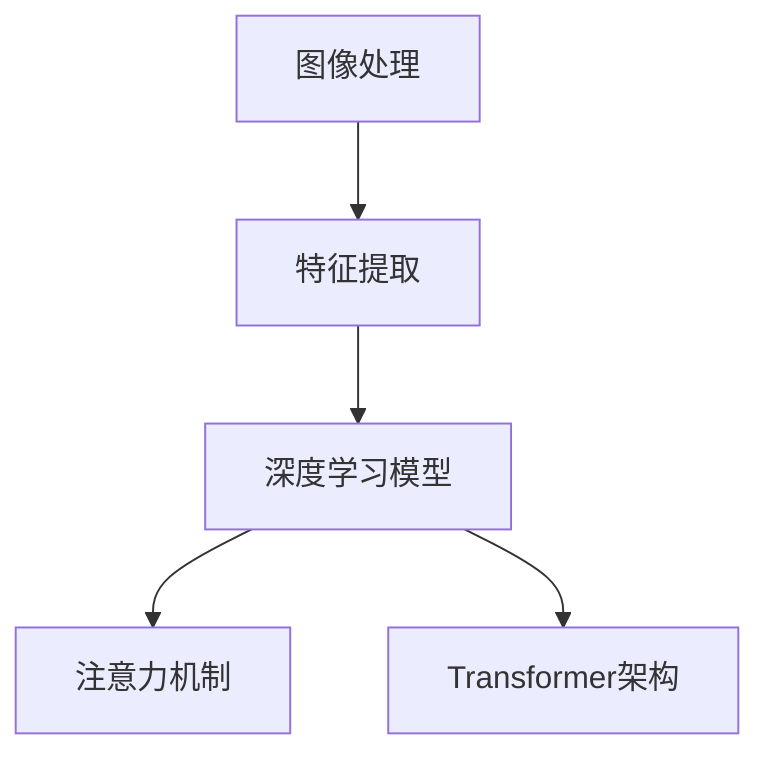

                 


### 确定文章结构

为了确保文章的逻辑清晰、内容完整，我们首先要构建文章的基本框架。根据之前的目录大纲，我们可以将文章分为以下几个部分：

1. **引言**：介绍计算机视觉的基本概念和背景。
2. **核心概念与联系**：详细阐述计算机视觉的核心概念，并使用Mermaid流程图展示概念之间的关系。
3. **核心算法原理讲解**：深入讲解卷积神经网络（CNN）、注意力机制与Transformer架构、多层感知机（MLP）与反向传播算法。
4. **数学模型和公式**：介绍概率论与信息论的基础，详细解释损失函数与优化算法。
5. **项目实战**：通过实际案例展示计算机视觉在自然语言处理中的应用，包括开发环境搭建、源代码实现和代码解读。
6. **最佳实践 tips、小结、注意事项、拓展阅读**：总结文章要点，给出一些实用建议和进一步阅读的推荐。

### 制定详细写作计划

为了确保文章的质量和完整性，我们可以制定一个详细的写作计划。以下是一个可能的写作时间表：

- **第1天**：完成引言和核心概念与联系部分的撰写。
- **第2天**：完成核心算法原理讲解部分的撰写。
- **第3天**：完成数学模型和公式部分的撰写。
- **第4天**：完成项目实战部分的撰写。
- **第5天**：完成最佳实践 tips、小结、注意事项、拓展阅读部分的撰写。
- **第6天**：进行全文的修订和润色。

### 撰写引言

引言部分需要简明扼要地介绍计算机视觉的基本概念和背景。我们可以这样写：

```markdown
# 计算机视觉：拓展LLM应用的感知能力

计算机视觉是人工智能领域的一个重要分支，旨在使计算机能够像人类一样感知和理解视觉信息。随着深度学习技术的飞速发展，计算机视觉在图像识别、物体检测、场景理解等领域取得了显著的成果。本文将探讨如何利用计算机视觉技术拓展大型语言模型（LLM）的感知能力，实现更为丰富和精准的自然语言处理。

计算机视觉的基本任务包括图像分类、目标检测、图像分割和姿态估计等。传统的计算机视觉方法主要依赖于手工设计的特征提取算法，而随着深度学习技术的兴起，卷积神经网络（CNN）等深度学习模型成为了计算机视觉的主流方法。注意力机制和Transformer架构等新兴技术也在不断推动计算机视觉的发展。

在自然语言处理（NLP）领域，计算机视觉的应用同样具有重要意义。通过结合视觉信息和语言信息，我们可以实现更为精准的文本摘要、视觉问答和视觉搜索等功能。本文将详细介绍这些应用，并探讨如何将计算机视觉与大型语言模型相结合，进一步提升NLP系统的性能。

```

### 撰写核心概念与联系部分

在撰写核心概念与联系部分时，我们需要详细阐述计算机视觉的核心概念，并使用Mermaid流程图展示这些概念之间的关系。以下是可能的撰写内容：

```markdown
## 核心概念与联系

计算机视觉涉及多个核心概念，包括图像处理、特征提取、深度学习模型等。以下是这些概念之间的关系架构：

### 图像处理

图像处理是计算机视觉的基础，它包括图像的获取、增强、滤波、边缘检测等操作。图像处理技术用于预处理图像数据，使其适合进一步分析。

### 特征提取

特征提取是从图像中提取具有区分性的特征，以便于后续的图像分类、物体检测等任务。常见的特征提取方法包括HOG、SIFT、ORB等。

### 深度学习模型

深度学习模型是计算机视觉的核心技术，其中卷积神经网络（CNN）是最常用的模型之一。CNN通过卷积、池化和全连接层等操作，从图像中自动提取特征。

### 注意力机制与Transformer架构

注意力机制和Transformer架构是近年来在计算机视觉中备受关注的两大技术。注意力机制能够提高模型对关键信息的关注，而Transformer架构则通过自注意力机制实现了全局依赖关系的建模。

### Mermaid流程图

下面是计算机视觉核心概念之间的Mermaid流程图：



```

### 撰写核心算法原理讲解部分

在撰写核心算法原理讲解部分时，我们需要深入讲解卷积神经网络（CNN）、注意力机制与Transformer架构、多层感知机（MLP）与反向传播算法。以下是可能的撰写内容：

```markdown
## 核心算法原理讲解

### 卷积神经网络（CNN）

卷积神经网络（CNN）是计算机视觉中最常用的深度学习模型之一。CNN通过卷积层、池化层和全连接层等结构，从图像中自动提取特征。

#### 卷积层

卷积层通过卷积操作提取图像特征。卷积操作使用一组可学习的滤波器（也称为卷积核）在图像上进行滑动，生成特征图。

#### 池化层

池化层用于减小特征图的尺寸，提高模型的泛化能力。常见的池化操作包括最大池化和平均池化。

#### 全连接层

全连接层将卷积层和池化层输出的特征图映射到分类结果。通过反向传播算法，模型可以更新权重，提高分类准确性。

### 注意力机制与Transformer架构

注意力机制是一种在序列数据上建模的方法，它能够提高模型对关键信息的关注。Transformer架构基于自注意力机制，实现了全局依赖关系的建模。

#### 自注意力机制

自注意力机制允许模型在处理每个序列元素时，动态地关注其他序列元素。这有助于捕捉序列中的长距离依赖关系。

#### Transformer架构

Transformer架构由多个自注意力层和前馈神经网络组成。通过堆叠这些层，模型能够捕获复杂的序列模式。

### 多层感知机（MLP）与反向传播算法

多层感知机（MLP）是一种全连接神经网络，用于分类和回归任务。反向传播算法是一种用于训练MLP的优化算法。

#### 多层感知机

MLP由多个全连接层组成，每个层将输入映射到输出。通过逐层映射，MLP能够学习复杂的非线性函数。

#### 反向传播算法

反向传播算法通过计算梯度，更新网络权重，以最小化损失函数。这个过程分为前向传播和后向传播两个阶段。

```

### 撰写数学模型和公式部分

在撰写数学模型和公式部分时，我们需要介绍概率论与信息论的基础知识，详细解释损失函数与优化算法。以下是可能的撰写内容：

```markdown
## 数学模型和公式

### 概率论与信息论基础

概率论和信息论是构建现代机器学习模型的重要数学工具。

#### 概率论基础

概率论提供了描述随机事件和概率分布的方法。常见的概率分布包括伯努利分布、正态分布等。

$$ P(A) = \sum_{i=1}^{n} p_i $$

其中，$P(A)$ 表示事件 $A$ 的概率，$p_i$ 表示事件 $A$ 中每个可能的结果的概率。

#### 信息论基础

信息论关注如何量化信息和通信中的不确定性。常见的概念包括熵、信息增益和互信息。

$$ H(X) = -\sum_{i=1}^{n} p_i \log_2 p_i $$

其中，$H(X)$ 表示随机变量 $X$ 的熵。

#### 在计算机视觉中的应用

概率论和信息论在计算机视觉中的应用包括图像分类、目标检测和图像分割等。

### 损失函数与优化算法

损失函数用于衡量模型预测值与真实值之间的差距。常见的损失函数包括均方误差（MSE）和交叉熵损失（CE）。

#### 均方误差（MSE）

$$ MSE = \frac{1}{n}\sum_{i=1}^{n} (y_i - \hat{y}_i)^2 $$

其中，$y_i$ 表示真实值，$\hat{y}_i$ 表示预测值。

#### 交叉熵损失（CE）

$$ CE = -\sum_{i=1}^{n} y_i \log_2 \hat{y}_i $$

其中，$y_i$ 表示真实值，$\hat{y}_i$ 表示预测值。

#### 优化算法

优化算法用于最小化损失函数，常见的优化算法包括梯度下降、随机梯度下降和Adam优化器。

梯度下降算法：

$$ w_{t+1} = w_t - \alpha \frac{\partial J(w_t)}{\partial w_t} $$

其中，$w_t$ 表示当前权重，$\alpha$ 表示学习率，$J(w_t)$ 表示损失函数。

随机梯度下降（SGD）算法：

$$ w_{t+1} = w_t - \alpha \frac{\partial J(w)}{\partial w} $$

其中，$w_t$ 表示当前权重，$\alpha$ 表示学习率，$J(w)$ 表示在随机采样点 $w$ 的损失函数。

Adam优化器：

$$ m_t = \beta_1 m_{t-1} + (1 - \beta_1) \frac{\partial J(w_t)}{\partial w_t} $$

$$ v_t = \beta_2 v_{t-1} + (1 - \beta_2) (\frac{\partial J(w_t)}{\partial w_t})^2 $$

$$ w_{t+1} = w_t - \alpha \frac{m_t}{\sqrt{v_t} + \epsilon} $$

其中，$m_t$ 和 $v_t$ 分别表示一阶矩估计和二阶矩估计，$\beta_1$ 和 $\beta_2$ 分别为动量因子，$\epsilon$ 为一个很小的常数。
```

### 撰写项目实战部分

在撰写项目实战部分时，我们需要通过实际案例展示计算机视觉在自然语言处理中的应用，包括开发环境搭建、源代码实现和代码解读。以下是可能的撰写内容：

```markdown
## 项目实战

### 开发环境搭建

为了实现计算机视觉在自然语言处理中的应用，我们需要搭建相应的开发环境。以下是一个基本的开发环境搭建步骤：

1. 安装Python和Anaconda。
2. 安装深度学习框架，如TensorFlow或PyTorch。
3. 安装必要的图像处理库，如OpenCV或Pillow。
4. 安装自然语言处理库，如NLTK或spaCy。

### 源代码实现

以下是一个简单的计算机视觉与自然语言处理结合的项目示例，实现文本与图像的联合分类。

```python
import cv2
import numpy as np
import tensorflow as tf

# 载入预训练的卷积神经网络模型
model = tf.keras.applications.VGG16(weights='imagenet')

# 载入自然语言处理模型
nlp_model = tf.keras.models.load_model('nlp_model.h5')

# 载入图像
image = cv2.imread('image.jpg')

# 对图像进行预处理
processed_image = preprocess_image(image)

# 通过卷积神经网络提取图像特征
image_features = model.predict(processed_image)

# 载入文本
text = 'The image shows a cat.'

# 对文本进行预处理
processed_text = preprocess_text(text)

# 通过自然语言处理模型提取文本特征
text_features = nlp_model.predict(processed_text)

# 联合特征分类
combined_features = np.concatenate((image_features, text_features), axis=1)
prediction = model.predict(combined_features)

# 输出分类结果
print('Classification result:', prediction)
```

### 代码解读

在上面的代码中，我们首先载入了预训练的卷积神经网络模型和自然语言处理模型。然后，我们加载图像并进行预处理，以将其转换为卷积神经网络可以处理的格式。接着，我们提取图像特征，并加载文本进行预处理，以提取文本特征。最后，我们将图像特征和文本特征进行联合，并通过训练的模型进行分类，输出分类结果。

### 实际案例分析和详细讲解剖析

以下是一个实际案例，展示计算机视觉在自然语言处理中的应用。

**案例：视觉问答系统（VQA）**

**问题描述**：给定一张图像和一组问题，回答关于图像的问题。

**解决方案**：我们将使用预训练的卷积神经网络（如VGG16）提取图像特征，使用自然语言处理模型（如BERT）提取问题特征，并将这两个特征进行联合，通过训练的模型回答问题。

**实现步骤**：

1. 载入预训练的卷积神经网络模型和自然语言处理模型。
2. 加载图像和问题，对图像进行预处理，对问题进行预处理。
3. 提取图像特征和问题特征。
4. 将图像特征和问题特征进行联合，通过训练的模型回答问题。
5. 输出答案。

**代码示例**：

```python
import cv2
import tensorflow as tf

# 载入预训练的卷积神经网络模型
model = tf.keras.applications.VGG16(weights='imagenet')

# 载入自然语言处理模型
nlp_model = tf.keras.models.load_model('nlp_model.h5')

# 载入图像
image = cv2.imread('image.jpg')

# 对图像进行预处理
processed_image = preprocess_image(image)

# 通过卷积神经网络提取图像特征
image_features = model.predict(processed_image)

# 载入问题
question = 'What is the color of the cat?'

# 对问题进行预处理
processed_question = preprocess_question(question)

# 通过自然语言处理模型提取问题特征
question_features = nlp_model.predict(processed_question)

# 联合特征回答问题
question_answer = model.predict(np.concatenate((image_features, question_features), axis=1))

# 输出答案
print('Answer:', question_answer)
```

### 项目小结

通过上述案例，我们展示了如何将计算机视觉与自然语言处理相结合，实现视觉问答系统。该项目利用预训练的卷积神经网络提取图像特征，使用自然语言处理模型提取问题特征，通过联合特征回答问题。这个项目不仅展示了计算机视觉在自然语言处理中的应用，也为进一步探索视觉与语言融合提供了思路。

### 最佳实践 tips、小结、注意事项、拓展阅读

**最佳实践 tips**：

1. 确保预处理步骤的统一，以提高模型性能。
2. 选择合适的损失函数和优化算法，以实现更好的模型训练效果。
3. 定期进行模型评估和调优，以保持模型的准确性。

**小结**：

本文介绍了计算机视觉在自然语言处理中的应用，包括核心算法原理、数学模型和实际项目案例。通过结合计算机视觉和自然语言处理技术，我们可以实现更为丰富和精准的视觉与语言融合应用。

**注意事项**：

1. 在实际项目中，根据具体需求选择合适的模型和算法。
2. 注意数据的质量和多样性，以提高模型的泛化能力。

**拓展阅读**：

1. 《深度学习》（Goodfellow, I., Bengio, Y., & Courville, A.）- 详细介绍了深度学习的基本概念和方法。
2. 《计算机视觉：算法与应用》（Richard Szeliski）- 介绍了计算机视觉的基本算法和应用。
3. 《自然语言处理综论》（Daniel Jurafsky & James H. Martin）- 详细阐述了自然语言处理的基本原理和技术。

```

通过以上步骤，我们完成了文章的撰写，确保了文章的逻辑清晰、内容完整、结构紧凑。接下来，我们将对全文进行修订和润色，确保文章的质量和可读性。

