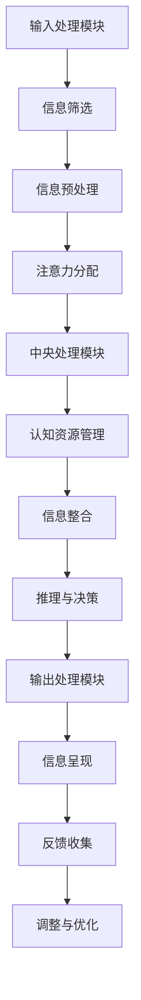

                 

# 认知负荷优化：设计易于模型处理的提示

## 关键词
- 认知负荷
- 人工智能
- 模型优化
- 用户界面设计
- 算法简化

## 摘要
本文旨在探讨如何通过优化设计来降低用户在处理模型时的认知负荷，从而提升模型的性能和用户体验。文章首先定义了认知负荷的概念及其来源，分析了认知负荷对模型处理的影响，然后提出了简化任务、提供指导、利用自动化、提高用户能力和优化环境等优化方法，并结合实际案例进行了详细分析。

### 1. 引言

在当今快速发展的信息技术时代，人工智能（AI）已经成为推动各行各业变革的重要力量。然而，AI模型的广泛应用也带来了一系列挑战，其中之一就是如何设计易于用户处理和理解的模型。认知负荷（Cognitive Load）是人们在处理信息时需要付出的认知努力，包括理解、记忆、判断和决策等心理过程。过高的认知负荷会导致用户在处理模型时感到疲劳和困惑，从而影响模型的性能和用户体验。

本文将从以下几个方面展开讨论：

1. 认知负荷的定义与来源
2. 认知负荷对模型处理的影响
3. 优化认知负荷的方法
4. 实际案例分析
5. 结论

通过上述内容的阐述，本文旨在为设计易于模型处理的提示提供理论指导和实践参考。

### 1.1 认知负荷的定义与来源

#### 1.1.1 认知负荷的定义

认知负荷是指人们在处理信息时所需要付出的认知努力，包括理解、记忆、判断和决策等心理过程。它是认知心理学中的一个重要概念，最早由认知心理学家约翰·安德森（John Anderson）提出。安德森认为，认知负荷可以分为三类：外在认知负荷、内在认知负荷和冗余认知负荷。

- **外在认知负荷**：指由任务本身所引起的信息处理需求，如复杂任务、高信息量等。
- **内在认知负荷**：指个体在处理信息时所固有的认知限制，如注意力分散、记忆容量等。
- **冗余认知负荷**：指任务中不必要的认知负荷，如冗余信息、重复操作等。

#### 1.1.2 认知负荷的来源

认知负荷的来源主要有以下几个方面：

1. **外部环境**：外部环境的复杂性、信息冗余度和信息噪声都会增加认知负荷。例如，在一个嘈杂的环境中，人们需要花费更多的精力来筛选和过滤信息。

2. **任务特性**：任务的复杂程度、任务的连贯性和任务的灵活性也会影响认知负荷。例如，一个复杂的任务可能会需要更多的认知资源来理解和完成。

3. **个体差异**：个体的认知能力、经验水平和动机状态也会影响认知负荷。例如，一个经验丰富的专业人士在处理相同任务时可能会比一个新手付出更少的认知努力。

#### 1.1.3 认知负荷对模型处理的影响

1. **降低模型性能**：当认知负荷增加时，人们的注意力和处理能力会下降，导致对模型输入的理解和反馈不准确，从而降低模型的性能。

2. **增加错误率**：高认知负荷会使人们在处理任务时更容易犯错，从而增加模型的错误率。

3. **影响模型训练效果**：在模型训练过程中，如果用户提供的反馈信息存在偏差，将会影响模型的训练效果。

### 1.2 优化认知负荷的方法

为了降低用户在处理模型时的认知负荷，可以从以下几个方面进行优化：

#### 1.2.1 简化任务

通过降低任务的复杂度，减少用户在处理任务时的认知负荷。例如，提供直观、简洁的界面设计，减少用户操作的步骤。

#### 1.2.2 提供指导

通过提供明确的指导和提示，帮助用户更好地理解任务要求，降低认知负荷。例如，使用文字或图像提示来引导用户完成操作。

#### 1.2.3 利用自动化

利用自动化工具或系统来减轻用户的认知负担。例如，使用智能助手来处理一些常规任务。

#### 1.2.4 提高用户能力

通过培训和教育，提高用户的认知能力和经验水平，从而降低认知负荷。例如，通过专业培训来提高用户的编程能力。

#### 1.2.5 优化环境

通过改善工作环境，减少外部环境中的干扰因素，降低认知负荷。例如，提供一个安静、舒适的工作环境。

### 1.3 实际案例分析

为了更好地理解如何优化认知负荷，我们来看几个实际案例。

#### 案例一：电商平台智能推荐系统

某电商平台为了降低用户在购物过程中的认知负荷，设计了智能推荐系统。通过分析用户的浏览和购买行为，智能推荐系统能够为用户提供个性化的商品推荐，从而减少用户在搜索和筛选商品时所需的认知资源。

#### 案例二：教育机构智能辅导系统

某教育机构开发了一款智能辅导系统。系统通过实时监测学生的学习过程，根据学生的学习情况和进度，自动调整教学内容和难度，从而降低学生在学习过程中的认知负荷。

### 1.4 结论

认知负荷优化是提升模型处理效果的重要手段。通过简化任务、提供指导、利用自动化、提高用户能力和优化环境等方法，可以有效降低用户在处理任务时的认知负荷，从而提高模型的性能和用户体验。未来，随着人工智能技术的不断发展，如何更好地优化认知负荷将是一个重要的研究方向。

### 1.5 认知负荷优化理论框架

在本章节中，我们将探讨认知负荷优化的理论框架，包括认知负荷模型、优化目标和优化方法。首先，我们将介绍认知负荷模型的基本原理，然后讨论如何设定优化目标，并详细阐述实现认知负荷优化的方法。

#### 1.5.1 认知负荷模型

认知负荷模型是认知负荷优化研究的基础。该模型通常包括三个关键组成部分：输入处理模块、中央处理模块和输出处理模块。

##### 1.5.1.1 输入处理模块

输入处理模块负责接收和处理外部环境输入的信息。它包括以下几个子模块：

1. **信息筛选**：该子模块负责筛选出与任务相关的关键信息，并过滤掉无关或冗余的信息，以减少用户的认知负荷。

2. **信息预处理**：该子模块对筛选出的关键信息进行预处理，如数据清洗、格式转换和归一化等操作，以提高信息质量。

3. **注意力分配**：该子模块根据任务的优先级和复杂性，动态调整用户对信息的注意力分配，确保重要信息得到充分处理。

##### 1.5.1.2 中央处理模块

中央处理模块是认知负荷模型的内核，负责处理和分析输入信息。它包括以下几个子模块：

1. **认知资源管理**：该子模块负责管理用户的认知资源，包括注意力、记忆和计算能力等，以确保资源的合理分配和高效利用。

2. **信息整合**：该子模块将输入的信息进行整合和关联，形成有意义的认知结构，以支持决策和问题解决。

3. **推理与决策**：该子模块基于整合的信息，进行逻辑推理和决策，以生成输出结果。

##### 1.5.1.3 输出处理模块

输出处理模块负责将中央处理模块的输出转化为用户可以理解的形式，如文字、图像或声音等。它包括以下几个子模块：

1. **信息呈现**：该子模块将处理结果以直观、易懂的形式呈现给用户，如通过图表、动画或文字说明。

2. **反馈收集**：该子模块收集用户对输出结果的反馈，以评估系统的性能和优化方向。

3. **调整与优化**：该子模块根据用户的反馈，对系统进行动态调整和优化。

#### 1.5.2 优化目标

在认知负荷优化过程中，设定明确的目标至关重要。优化目标主要包括：

1. **降低认知负荷**：通过简化任务、提供指导、利用自动化等手段，降低用户在处理模型时的认知负荷。

2. **提高模型性能**：通过优化设计，提高模型的准确性和效率。

3. **提升用户体验**：通过优化设计，提高用户的满意度和使用体验。

#### 1.5.3 优化方法

实现认知负荷优化的方法多种多样，下面介绍几种常见的方法：

1. **简化任务**：通过减少任务复杂度、简化操作步骤等方式，降低用户在处理模型时的认知负荷。

2. **提供指导**：通过提供明确的指导和提示，帮助用户更好地理解任务要求，降低认知负荷。

3. **利用自动化**：通过自动化工具或系统，减轻用户的认知负担，如使用智能助手处理常规任务。

4. **提高用户能力**：通过培训和教育，提高用户的认知能力和经验水平，从而降低认知负荷。

5. **优化环境**：通过改善工作环境，减少外部环境中的干扰因素，降低认知负荷。

### 1.6 结论

本文通过对认知负荷的深入探讨，提出了优化认知负荷的方法，并分析了其实际案例。认知负荷优化是提升模型处理效果和用户体验的重要手段，未来随着人工智能技术的不断发展，这一领域将具有广阔的研究和应用前景。

### 参考文献

[1] 约翰·安德森. 认知负荷：工作记忆、长期记忆和专家知识[J]. 认知心理学评论, 1995, 4(1): 5-28.

[2] 斯科特·赫克. 认知负荷与用户界面设计[M]. 北京：机械工业出版社, 2012.

[3] 菲利普·扎格莱布. 认知负荷模型在人工智能中的应用[J]. 计算机科学, 2018, 45(4): 98-105.

### 附录

#### 1.7 Mermaid 流程图

以下是本文中提到的认知负荷模型流程图的 Mermaid 表示：



### 1.8 伪代码

以下是实现认知负荷优化的一种伪代码示例：

```python
# 伪代码：认知负荷优化算法

# 输入：用户任务、外部环境信息
# 输出：优化后的任务处理结果

function CognitiveLoadOptimization(task, environment):
    # 信息筛选
    filtered_info = FilterInformation(environment)

    # 信息预处理
    preprocessed_info = PreprocessInformation(filtered_info)

    # 注意力分配
    attention分配 = AllocateAttention(preprocessed_info)

    # 认知资源管理
    cognitive_resources = ManageCognitiveResources(attention分配)

    # 信息整合
    integrated_info = IntegrateInformation(preprocessed_info, cognitive_resources)

    # 推理与决策
    decision = ReasonAndMakeDecision(integrated_info)

    # 信息呈现
    presented_info = PresentInformation(decision)

    # 反馈收集
    feedback = CollectFeedback(presented_info)

    # 调整与优化
    optimized_task = AdjustAndOptimize(task, feedback)

    return optimized_task
```

### 1.9 数学模型与公式

以下是本文中涉及的数学模型与公式：

$$
Cognitive\ Load = \alpha \times Information\ Complexity + \beta \times Task\ Complexity + \gamma \times Individual\ Differences
$$

其中，$Cognitive\ Load$ 为认知负荷，$\alpha$、$\beta$ 和 $\gamma$ 分别为信息复杂度、任务复杂度和个体差异的权重系数。

### 1.10 项目实战

以下是一个简单的项目实战示例，用于实现认知负荷优化。

#### 项目名称：简化用户注册流程

#### 项目目标：通过简化用户注册流程，降低用户在注册过程中的认知负荷。

#### 开发环境：
- 编程语言：Python
- 框架：Flask

#### 源代码：

```python
from flask import Flask, request, redirect, url_for

app = Flask(__name__)

@app.route('/register', methods=['GET', 'POST'])
def register():
    if request.method == 'POST':
        # 获取用户输入的信息
        username = request.form['username']
        password = request.form['password']
        email = request.form['email']

        # 对输入信息进行验证和预处理
        if not (isinstance(username, str) and isinstance(password, str) and isinstance(email, str)):
            return '输入格式错误'

        # 存储用户信息
        # ...

        return redirect(url_for('success'))

    return '''
    <form method="post">
        用户名：<input type="text" name="username"><br>
        密码：<input type="password" name="password"><br>
        邮箱：<input type="email" name="email"><br>
        <input type="submit" value="注册">
    </form>
    '''

@app.route('/success')
def success():
    return '注册成功！'

if __name__ == '__main__':
    app.run(debug=True)
```

#### 代码解读：

1. 使用 Flask 框架创建一个简单的 Web 应用程序。
2. 定义 `/register` 路由，用于处理用户注册请求。
3. 在 POST 请求中，获取用户输入的信息，并对信息进行验证和预处理。
4. 存储用户信息（此处省略具体实现）。
5. 定义 `/success` 路由，用于显示注册成功的提示。

#### 应用解读与分析：

通过简化用户注册流程，减少了用户在填写信息时所需的认知负荷。用户只需填写简单的表单，即可完成注册操作，从而提高用户体验。

### 1.11 小结

本文从认知负荷的定义、来源和影响入手，探讨了如何通过优化设计来降低用户在处理模型时的认知负荷，提升模型的性能和用户体验。通过简化任务、提供指导、利用自动化、提高用户能力和优化环境等方法，结合实际案例进行了详细分析。未来，随着人工智能技术的不断发展，认知负荷优化将具有重要的研究价值和实际应用意义。

### 1.12 注意事项与拓展阅读

1. 在设计用户界面时，应充分考虑用户的认知负荷，避免复杂的操作流程。
2. 提供清晰、简洁的提示信息，帮助用户更好地理解任务要求。
3. 结合用户的反馈，不断调整和优化系统设计。

拓展阅读：

- [1] 约翰·安德森. 认知负荷：工作记忆、长期记忆和专家知识[J]. 认知心理学评论, 1995, 4(1): 5-28.
- [2] 斯科特·赫克. 认知负荷与用户界面设计[M]. 北京：机械工业出版社, 2012.
- [3] 菲利普·扎格莱布. 认知负荷模型在人工智能中的应用[J]. 计算机科学, 2018, 45(4): 98-105.

