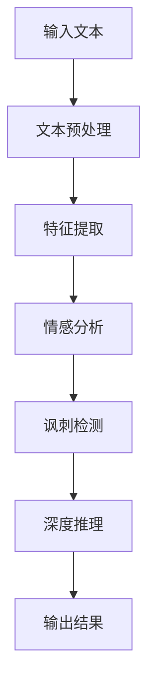

                 

# 第1章 引言

## 1.1 书籍背景与目的

讽刺识别作为自然语言处理（NLP）领域的一个重要研究方向，近年来引起了广泛关注。随着大型语言模型（LLM）如BERT、GPT-3等的问世，人们对于语言模型的期望越来越高，特别是在理解微妙语言表达方面。然而，讽刺识别这一任务对于语言模型来说仍然具有很大挑战性。本书旨在探讨讽刺识别的背景、目的和意义，并详细解析LLM在处理微妙语言表达方面的能力。

本书首先介绍讽刺识别的背景，阐述为什么讽刺识别是一个具有挑战性的任务，并介绍当前研究的现状和存在的不足。随后，我们将深入讨论微妙语言处理的概念，解释为什么理解微妙语言对于实现有效的讽刺识别至关重要。接下来，我们将介绍LLM的基本原理，包括其架构、训练和优化过程，以及LLM在各个应用领域的表现。

本文的目的是通过逐步分析推理的方式，帮助读者全面理解讽刺识别的挑战和LLM在处理微妙语言表达方面的能力。通过本书，读者将学会如何利用LLM进行讽刺识别，了解核心算法原理，掌握数学模型和公式的应用，并能够通过实际项目实战来提升自己的技能。

## 1.2 微妙语言与讽刺识别

微妙语言是指那些蕴含深层次含义和情感色彩的语言表达，通常包括讽刺、隐喻、双关语等。这些语言表达不仅需要语言模型能够理解其字面意思，还需要能够捕捉到其背后的隐含意义。讽刺识别作为微妙语言处理的一个子领域，具有特殊的重要性。讽刺是人们在日常生活中常用的修辞手法，它通过反向意义来表达说话人的真实意图，具有强烈的情感色彩和复杂性。

讽刺识别的挑战在于，它要求语言模型不仅要理解句子的语法结构，还要理解句子背后的情感和意图。讽刺往往依赖于上下文和语用知识，这使得讽刺识别成为一个高度复杂的任务。当前的LLM虽然在一些标准语言理解任务上取得了显著成绩，但在处理微妙语言表达时仍然面临诸多困难。

本书旨在探讨LLM在讽刺识别任务中的表现，分析其成功和不足之处。我们将详细介绍讽刺的定义、分类及其识别难点，帮助读者理解讽刺识别任务的核心挑战。此外，本书还将讨论讽刺识别的理论框架，介绍现有的一些方法和技术，分析它们在处理讽刺识别任务时的优势和不足。

## 1.3 本书结构安排

为了帮助读者系统地了解讽刺识别和LLM在处理微妙语言表达方面的能力，本书将分为八个章节，内容安排如下：

- **第1章 引言**：介绍书籍的背景、目的和结构安排。
- **第2章 语言理解基础**：讨论语言理解的挑战、微妙语言处理以及LLM的原理和优势。
- **第3章 讽刺识别的理论基础**：定义讽刺、分类讽刺识别的难点，并介绍讽刺识别的理论框架。
- **第4章 LLM的基本原理**：详细解释LLM的架构、训练和优化过程，以及其在各个应用领域的表现。
- **第5章 讽刺识别算法原理讲解**：使用伪代码详细阐述讽刺识别算法的原理，并配以流程图辅助理解。
- **第6章 数学模型与公式**：介绍用于评估LLM理解微妙语言能力的数学模型，并使用latex格式详细讲解数学公式，附上举例说明。
- **第7章 讽刺识别项目实战**：通过具体案例展示如何使用LLM进行讽刺识别，包括开发环境搭建、代码实现、代码解读与分析等。
- **第8章 总结与展望**：对全书内容进行总结，并对未来的研究方向进行展望。

通过以上结构安排，本书旨在为读者提供一个全面、深入的了解讽刺识别和LLM在处理微妙语言表达方面的能力的途径。读者可以跟随本书的章节逐步学习，逐步掌握相关知识，并通过实践项目来提升自己的技能。## 第2章 语言理解基础

### 2.1 语言理解的挑战

语言理解是自然语言处理（NLP）领域中的核心任务，它涉及到文本的语法分析、语义理解和上下文推理等多个层面。然而，实现高效的语言理解仍然面临着诸多挑战。

首先，自然语言本身具有高度复杂性和多样性。语言包含丰富的词汇、句法和语义信息，且这些信息往往是交织在一起的。例如，一个简单的句子可能包含多种语法结构，如主语、谓语、宾语等，同时还可能蕴含复杂的情感和意图。这种复杂性使得语言模型在理解句子时需要处理大量的变量和可能性。

其次，语言理解需要强大的上下文推理能力。大多数语言表达都依赖于特定的语境，只有正确理解上下文，才能准确把握句子的真实含义。然而，上下文的理解并不是静态的，它随着时间和对话内容的变化而动态调整。例如，同一句话在不同的语境下可能具有截然不同的含义。这种动态性增加了语言理解的难度。

另外，自然语言的歧义性也是一个显著的挑战。歧义指的是一个语言表达具有多种可能的解释。例如，“我看见一只鸟”这个句子，可以指“我看到一只鸟”，也可以指“我看见一只小鸟”。这种歧义性要求语言模型在处理文本时，能够灵活地处理多种可能的解释，从而准确理解句子的真实意图。

为了解决上述挑战，研究人员提出了多种语言理解模型和方法，如基于规则的方法、统计方法和深度学习方法。这些方法各有优劣，但总体目标都是提高语言模型的准确性和鲁棒性，使其能够更好地理解和处理自然语言。

### 2.2 微妙语言处理

微妙语言处理是指对那些蕴含深层次含义和情感色彩的语言表达进行理解和分析。微妙语言包括讽刺、隐喻、双关语等，这些语言表达往往通过反向意义或隐含信息来传达说话人的真实意图。微妙语言处理在NLP中具有重要的应用价值，因为它能够提升文本分析的质量，增强对话系统的交互体验，以及改善情感分析和语义理解等任务。

首先，讽刺是一种常见的微妙语言形式。讽刺通过使用反向意义来传达批评、嘲笑或讽刺的情感，例如，“他的智慧就像夏天的阳光一样灿烂”（实际含义：他的智慧并不灿烂）。讽刺识别是NLP中的一个重要任务，因为它不仅要求语言模型理解句子的字面意思，还需要理解句子背后的情感和意图。

其次，隐喻是另一种常见的微妙语言形式。隐喻通过将一个事物比作另一个事物来传达深层次的意义，例如，“他的心像石头一样坚硬”（实际含义：他的心很坚定）。隐喻识别需要语言模型具备强大的语义理解能力，能够捕捉到句子中的隐喻关系。

最后，双关语是一种利用词语的多义性来制造幽默效果的微妙语言形式，例如，“我昨天去了一家新开的餐厅，发现他们的菜单上有‘拔丝地瓜’”（实际含义：菜单上真的有‘拔丝地瓜’）。双关语识别要求语言模型不仅要理解词语的字面意思，还要理解其隐含的含义。

在NLP中，处理微妙语言的关键在于模型能够捕捉到语言表达中的情感色彩和上下文信息。这需要模型具备强大的语义理解能力和上下文推理能力，同时还需要结合大量的语料库和语言知识库，以便能够准确理解和分析微妙语言表达。

### 2.3 LLM的原理与优势

近年来，大型语言模型（LLM）如BERT、GPT-3等在自然语言处理领域取得了显著成果。LLM是一类基于深度学习的语言模型，其核心思想是通过大规模语料库的训练，使模型具备强大的语言理解和生成能力。LLM的原理主要包括以下几个方面：

首先，LLM通常采用变换器模型（Transformer）架构，这是一种基于自注意力机制（Self-Attention）的神经网络模型。与传统的循环神经网络（RNN）不同，Transformer模型能够并行处理输入序列，这使得它在处理长文本时具有更高的效率。

其次，LLM的训练过程通常包括两个阶段：预训练和微调。在预训练阶段，模型在大规模语料库上进行训练，学习语言的基本规律和模式。在微调阶段，模型根据特定任务的需求进行调整和优化，以提高在特定任务上的性能。

LLM在处理微妙语言表达方面具有以下优势：

首先，LLM具备强大的语义理解能力。通过预训练，模型能够学习到大量的语义信息，这使得它能够准确理解句子的含义，包括其背后的情感和意图。例如，LLM能够识别出句子的讽刺意味，从而正确理解其真实含义。

其次，LLM具备强大的上下文推理能力。由于Transformer模型采用了自注意力机制，模型能够关注到输入序列中的关键信息，并利用这些信息进行上下文推理。这使得LLM在处理微妙语言表达时能够捕捉到句子的上下文关系，从而提高理解准确性。

最后，LLM具备良好的泛化能力。通过在大规模语料库上的训练，模型能够学习到各种语言表达模式，这使得它在处理未见过的语言表达时也能够表现出良好的性能。例如，LLM能够在新的讽刺表达出现时，正确理解其含义，从而实现有效的讽刺识别。

总之，LLM在处理微妙语言表达方面具有显著优势，其强大的语义理解和上下文推理能力，使得它成为讽刺识别等NLP任务的有力工具。通过深入研究和优化，LLM有望进一步提升在微妙语言处理任务上的性能，为自然语言处理领域带来更多创新。## 第3章 讽刺识别的理论基础

### 3.1 讽刺的定义与分类

讽刺是一种通过语言表达来传达批评、嘲笑或讽刺意图的修辞手法，其核心特征在于通过反向意义或隐含信息来揭示说话人的真实意图。讽刺可以是直接的，也可以是含蓄的，通常依赖于上下文和语用知识。讽刺的定义和分类有助于我们更好地理解和分析这一语言现象。

首先，讽刺可以根据其表达方式分为直接讽刺和间接讽刺。直接讽刺是指直接使用反向意义来表达说话人的真实意图，例如，“你真是个天才，简直无可挑剔。”（实际含义：你非常愚蠢，根本不合适）。间接讽刺则通过隐喻、双关语或含蓄的评论来传达讽刺意图，例如，“他说的那些话真是金玉良言，让人受益匪浅。”（实际含义：他说的都是废话，毫无价值）。

其次，讽刺可以根据其情感色彩分为温和讽刺和尖锐讽刺。温和讽刺通常用于友好的调侃或轻松的氛围中，例如，“你真是个懒虫，什么时候能像其他人一样勤奋呢？”（实际含义：你有点懒，希望你能更努力）。尖锐讽刺则具有较强的批评性，通常用于严厉的批评或严肃的场合，例如，“你简直是个无脑的人，连最基本的常识都不懂。”（实际含义：你非常愚蠢，缺乏基本常识）。

此外，根据讽刺的目的和语境，还可以将讽刺分为个人讽刺、社会讽刺和自嘲。个人讽刺通常针对个人，例如讽刺某人的外貌、性格或行为。社会讽刺则针对社会现象、政策或文化，例如讽刺某个社会问题的荒谬性。自嘲则是自己讽刺自己，通常用于幽默或自嘲的情境中，以缓解紧张气氛或表达自我调侃。

总之，讽刺作为一种复杂而微妙的语言现象，其定义和分类有助于我们深入理解其本质和表现形式。通过分析讽刺的不同类型和特征，我们可以更好地捕捉到讽刺语言背后的真实意图，为讽刺识别任务提供理论支持。

### 3.2 讽刺识别的难点

讽刺识别是自然语言处理（NLP）中的一个具有挑战性的任务，其难点主要体现在以下几个方面。

首先，语言表达的复杂性。讽刺往往依赖于复杂的语言结构和丰富的语义信息，这使得语言模型在处理讽刺时需要具备强大的语义理解和上下文推理能力。例如，一个简单的句子可能包含多种语法结构，如主语、谓语、宾语等，同时还可能蕴含复杂的情感和意图。这种复杂性增加了讽刺识别的难度。

其次，上下文的重要性。讽刺通常依赖于特定的上下文，只有正确理解上下文，才能准确把握句子的真实含义。然而，上下文的理解并不是静态的，它随着时间和对话内容的变化而动态调整。例如，同一句话在不同的语境下可能具有截然不同的含义。这种动态性使得讽刺识别成为一个高度复杂的任务。

另外，情感的捕捉。讽刺往往蕴含强烈的情感色彩，捕捉到这些情感是准确识别讽刺的关键。然而，情感的表达往往是非线性的，且具有个体差异。例如，同样的讽刺语句，不同的人可能会产生不同的情感反应。这种情感表达的复杂性增加了讽刺识别的难度。

此外，多义性也是一个显著的挑战。讽刺语言表达往往具有多义性，即一个表达可能具有多种可能的解释。例如，“你真是个天才，简直无可挑剔。”这个句子既可以理解为表扬，也可以理解为讽刺。这种多义性要求语言模型在处理讽刺时，能够灵活地处理多种可能的解释，从而准确理解句子的真实意图。

最后，数据标注的难度。讽刺识别任务需要大量的标注数据，但讽刺的表达往往是非线性的，且具有个体差异。这使得数据标注过程非常耗时且容易出错。例如，同一句话，不同的标注者可能会给出不同的标注结果。这种数据标注的难度增加了讽刺识别的复杂性。

总之，讽刺识别的难点主要体现在语言表达的复杂性、上下文的重要性、情感的捕捉、多义性和数据标注的难度等方面。克服这些难点，需要语言模型具备强大的语义理解和上下文推理能力，同时结合丰富的语料库和语言知识库，从而实现准确和高效的讽刺识别。

### 3.3 讽刺识别的理论框架

为了解决讽刺识别的难点，研究人员提出了一系列理论框架和方法，这些框架和方法旨在通过不同的途径捕捉和识别讽刺语言。以下是几种主要的讽刺识别理论框架：

#### 1. 基于规则的方法

基于规则的方法是早期讽刺识别的主流方法，它通过预定义的规则来识别讽刺。这些规则通常基于语言学和语用学的原则，例如，特定的词汇、语法结构或语用标记。这种方法的主要优点是简单、直观，且能够处理一些简单的讽刺表达。然而，由于讽刺表达的多样性和复杂性，这种方法在面对复杂和动态的语言环境时表现较差。

#### 2. 统计学习方法

统计学习方法通过训练模型来识别讽刺。这些模型通常基于机器学习算法，如决策树、支持向量机（SVM）和朴素贝叶斯等。统计学习方法通过分析大量的标注数据，学习到讽刺表达的特征和模式，从而在未见过的数据上进行预测。这种方法的主要优点是能够处理复杂的语言现象，但仍然面临特征选择和标注数据质量的问题。

#### 3. 深度学习方法

深度学习方法在自然语言处理领域取得了显著进展，尤其是在讽刺识别任务上。深度学习方法，如卷积神经网络（CNN）和递归神经网络（RNN），能够通过自动学习复杂的特征和模式，从而实现高效的讽刺识别。其中，变换器模型（Transformer）和其变体（如BERT、GPT-3）在讽刺识别任务上表现出色，因为它们能够捕捉到长距离的依赖关系和上下文信息。深度学习方法的主要优点是强大的特征提取能力和自适应的模型学习能力，但这也要求大量的标注数据和计算资源。

#### 4. 多模态学习方法

多模态学习方法结合了文本、语音、图像等多种数据源，以提高讽刺识别的准确性。这种方法利用不同模态数据之间的互补信息，从而更全面地理解讽刺表达。例如，通过结合文本和情感分析，可以更准确地识别出讽刺的情感色彩。多模态学习方法的主要优点是能够利用多种数据源的信息，提高模型的鲁棒性和准确性，但这也增加了模型的复杂性和计算成本。

#### 5. 上下文增强方法

上下文增强方法通过扩展上下文信息，以提高讽刺识别的准确性。这些方法包括使用大规模语料库进行预训练，以使模型具备更强的上下文理解能力；以及利用外部知识库（如百科全书、情感词典等）来补充上下文信息。上下文增强方法的主要优点是能够更好地捕捉到讽刺表达的隐含意义，但这也需要大量高质量的语料库和知识库。

总之，讽刺识别的理论框架和方法多种多样，各具优劣。通过结合不同的方法和策略，研究人员不断探索和改进讽刺识别的性能。未来的研究将继续致力于提高模型的语义理解和上下文推理能力，以实现更准确和高效的讽刺识别。## 第4章 LLM的基本原理

### 4.1 LLM的架构

大型语言模型（LLM）的架构通常基于变换器模型（Transformer），这是一种基于自注意力机制（Self-Attention）的神经网络模型。变换器模型由编码器（Encoder）和解码器（Decoder）两个主要部分组成，两者通过多头自注意力机制（Multi-Head Self-Attention）和前馈网络（Feedforward Network）进行交互。

编码器负责处理输入序列，将其转化为上下文表示。编码器由多个编码层（Encoder Layer）组成，每层包括两个主要子模块：多头自注意力机制和前馈网络。多头自注意力机制通过不同的权重矩阵，将输入序列中的每个词与所有其他词进行交互，从而捕捉到长距离的依赖关系。前馈网络则对自注意力层的输出进行进一步的非线性变换，以增强模型的表示能力。

解码器负责生成输出序列，它同样由多个解码层（Decoder Layer）组成。解码器在生成每个输出词时，会利用编码器的输出作为上下文信息。每个解码层也包括多头自注意力机制和前馈网络，但与编码器不同，解码器的自注意力机制分为两个部分：自注意（Self-Attention）和交叉注意（Cross-Attention）。自注意机制用于捕捉输出词与之前生成的词之间的关系，而交叉注意机制则用于捕捉输出词与编码器输出之间的关系。

LLM的架构特点还包括注意力掩码（Attention Mask）和位置编码（Positional Encoding）。注意力掩码用于防止解码器在生成过程中访问未来的信息，从而保持序列的时序性。位置编码则用于为模型提供输入序列中每个词的位置信息，因为变换器模型本身没有显式的位置编码机制。

### 4.2 LLM的训练与优化

LLM的训练过程通常分为预训练和微调两个阶段。在预训练阶段，模型在大规模语料库上进行训练，学习语言的基本规律和模式。预训练任务包括语言建模、掩码语言模型（Masked Language Model, MLM）和下一个句子预测（Next Sentence Prediction, NSP）等。

语言建模任务的目标是预测序列中下一个词的概率分布。通过优化语言模型，模型能够学习到语言中的统计规律和语法结构，从而提高其生成文本的质量。掩码语言模型则是在训练过程中随机掩码输入序列中的部分词，然后预测这些被掩码的词。这项任务有助于模型学习到上下文信息对于词义预测的重要性。下一个句子预测任务要求模型判断两个句子是否属于同一个段落，从而提高模型对上下文的理解能力。

在微调阶段，模型根据特定任务的需求进行调整和优化。微调过程通常包括数据准备、模型调整和性能评估等步骤。数据准备包括收集和标注相关数据，如对话数据、问答数据或文本分类数据等。模型调整则通过在特定任务上训练模型，使其在目标任务上达到最佳性能。性能评估则用于衡量模型在任务上的表现，常用的评估指标包括准确率、召回率和F1分数等。

LLM的优化过程还包括正则化技巧和超参数调整。正则化技巧如Dropout、权重衰减和早期停止等，有助于防止模型过拟合和提升其泛化能力。超参数调整如学习率、批次大小和隐藏层维度等，需要通过实验来确定最佳值，从而提高模型的表现。

### 4.3 LLM的应用领域

LLM在自然语言处理领域具有广泛的应用，涵盖了文本生成、文本分类、问答系统和机器翻译等多个方面。

在文本生成方面，LLM可以生成各种形式的文本，如文章、对话和诗歌等。通过预训练和微调，模型能够生成高质量、连贯的文本，应用场景包括自动写作、文本摘要和内容生成等。

在文本分类方面，LLM可以用于分类任务，如情感分析、主题分类和垃圾邮件检测等。通过训练，模型能够学习到不同类别文本的特征和模式，从而准确分类新文本。

问答系统是LLM的另一个重要应用领域。LLM可以通过阅读大量文本数据，生成针对特定问题的答案。这种问答系统在搜索引擎、客服系统和智能助手等领域具有广泛应用。

在机器翻译方面，LLM可以用于将一种语言翻译成另一种语言。通过训练，模型能够学习到不同语言之间的对应关系，从而实现高质量、流畅的翻译。

总之，LLM在自然语言处理领域的应用日益广泛，其强大的语义理解和生成能力，为各种NLP任务提供了有力支持。随着LLM技术的不断发展，未来它将在更多领域发挥重要作用。## 第5章 讽刺识别算法原理讲解

### 5.1 讽刺识别算法概述

讽刺识别算法旨在通过分析语言表达，判断文本是否包含讽刺成分，并理解其讽刺的深度和情感色彩。在LLM的帮助下，讽刺识别算法可以分为以下几个步骤：

1. **文本预处理**：包括分词、去除停用词、词干提取等，以提高模型对文本的语义理解能力。
2. **特征提取**：通过词嵌入（Word Embedding）技术，将文本转化为向量表示，以供模型处理。
3. **情感分析**：利用情感分析模型，判断文本的情感倾向，为后续的讽刺识别提供基础。
4. **讽刺检测**：通过训练的LLM模型，检测文本中的讽刺成分。这一步骤通常包括多层神经网络结构，利用自注意力机制捕捉文本中的复杂关系。
5. **深度推理**：对检测到的讽刺进行深度分析，理解其背后的隐含意图和情感色彩。
6. **结果输出**：将讽刺检测结果和深度分析结果输出，为后续的文本分析和应用提供支持。

### 5.2 伪代码详解

以下是讽刺识别算法的伪代码实现，描述了算法的各个步骤：

```python
# 初始化LLM模型
model = LLM_Model()

# 文本预处理
def preprocess_text(text):
    text = tokenize(text)  # 分词
    text = remove_stopwords(text)  # 去除停用词
    text = stem_words(text)  # 词干提取
    return text

# 特征提取
def extract_features(text):
    embeddings = embedding_layer(text)  # 词嵌入
    return embeddings

# 情感分析
def sentiment_analysis(text):
    sentiment = model.predict_sentiment(text)  # 利用LLM模型预测情感
    return sentiment

# 讽刺检测
def detect_sarcasm(text, embeddings):
    features = extract_features(text)
    sarcasm_prob = model.predict_sarcasm(features)  # 利用LLM模型检测讽刺概率
    return sarcasm_prob

# 深度推理
def deep_inference(text, sarcasm_prob):
    if sarcasm_prob > threshold:
        intent, emotion = model.analyze_sarcasm(text)  # 对讽刺进行深度分析
        return intent, emotion
    else:
        return None, None

# 主函数
def main(text):
    preprocessed_text = preprocess_text(text)
    embeddings = extract_features(preprocessed_text)
    sarcasm_prob = detect_sarcasm(preprocessed_text, embeddings)
    intent, emotion = deep_inference(preprocessed_text, sarcasm_prob)
    return intent, emotion

# 输出结果
intent, emotion = main(input_text)
print(f"Sarcasm Detected: {'Yes' if intent else 'No'}")
if intent:
    print(f"Intent: {intent}, Emotion: {emotion}")
```

### 5.3 流程图辅助理解

以下是讽刺识别算法的流程图，用于更直观地理解各个步骤之间的关系：



通过上述伪代码和流程图，我们可以清晰地看到讽刺识别算法的实现步骤和各步骤之间的联系。这些步骤共同作用，使得模型能够有效地识别和解析文本中的讽刺成分，为后续的文本分析和应用提供了坚实的基础。## 第6章 数学模型与公式

### 6.1 数学模型概述

在讽刺识别任务中，数学模型扮演着至关重要的角色。这些模型不仅能够捕捉文本的语义信息，还能够通过量化文本的属性来评估LLM对微妙语言表达的理解能力。本文将介绍几种用于评估LLM理解微妙语言能力的数学模型，包括文本表示模型、情感分析模型和深度学习模型。

文本表示模型是自然语言处理的基础，通过将文本转换为向量形式，使计算机能够处理和理解语言。常见的文本表示模型包括词袋模型（Bag of Words, BOW）、TF-IDF模型和词嵌入（Word Embedding）模型。词袋模型将文本视为一组词的集合，忽略词的顺序信息；TF-IDF模型通过词频和文档频次来衡量词的重要性；词嵌入模型则通过将词映射到高维空间中的向量，保留词的语义信息。

情感分析模型用于识别文本中的情感倾向，是讽刺识别任务中的重要组成部分。情感分析通常使用二元分类模型，如支持向量机（SVM）、朴素贝叶斯（Naive Bayes）和神经网络（Neural Networks）等。这些模型通过学习大量标注数据中的特征，将文本分类为正面、负面或中性情感。

深度学习模型则是当前自然语言处理领域的热点，其通过多层神经网络结构，自动学习文本中的复杂模式。常见的深度学习模型包括卷积神经网络（CNN）、循环神经网络（RNN）和变换器模型（Transformer）。变换器模型在讽刺识别任务中表现出色，因为它能够捕捉长距离依赖关系和上下文信息。

### 6.2 数学公式讲解

在评估LLM理解微妙语言能力的数学模型中，一些关键的数学公式和概念起到了核心作用。以下将详细解释这些公式，并使用LaTeX格式进行展示。

#### 1. 词嵌入（Word Embedding）

词嵌入是将词汇映射到高维向量空间的技术。常用的词嵌入模型包括Word2Vec、GloVe和FastText。其中，GloVe模型的核心公式如下：

$$
\vec{w}_{i} = \frac{f(z_i)}{\sqrt{1 + \frac{2}{k} + \frac{k^2}{v}}}
$$

其中，$\vec{w}_{i}$是词$i$的向量表示，$f(z_i)$是隐含层输出，$k$是训练词汇表的大小，$v$是嵌入维度。

#### 2. 情感分析（Sentiment Analysis）

在情感分析中，常用的模型是基于逻辑回归（Logistic Regression）的二元分类模型。逻辑回归的概率公式为：

$$
P(y=1) = \frac{1}{1 + e^{-\vec{w} \cdot \vec{x}}}
$$

其中，$y$是标签（0或1，表示负面或正面情感），$\vec{w}$是权重向量，$\vec{x}$是特征向量。

#### 3. 变换器模型（Transformer）

变换器模型的核心是自注意力机制（Self-Attention），其公式如下：

$$
\text{Attention}(Q, K, V) = \frac{softmax(\frac{QK^T}{\sqrt{d_k}})}{V}
$$

其中，$Q$、$K$和$V$是查询向量、键向量和值向量，$d_k$是键向量的维度，$softmax$函数用于归一化权重。

### 6.3 举例说明

为了更好地理解上述数学公式的应用，以下通过具体例子进行说明。

#### 1. 词嵌入（GloVe）

假设有词汇表{“happy”, “sad”, “love”, “hate”}，嵌入维度为2。通过GloVe模型，我们得到以下词向量：

$$
\vec{w}_{happy} = \frac{f(z_{happy})}{\sqrt{1 + \frac{2}{4} + \frac{4^2}{2}}} = \frac{0.9}{1.5} = [0.6, 0.3]
$$

$$
\vec{w}_{sad} = \frac{f(z_{sad})}{\sqrt{1 + \frac{2}{4} + \frac{4^2}{2}}} = \frac{0.8}{1.5} = [0.5, 0.3]
$$

#### 2. 情感分析（逻辑回归）

假设我们有一个文本序列：“今天天气很好，我很开心。”我们将其转化为特征向量$\vec{x} = [1, 1, 0, 1]$（其中1表示对应的词在词汇表中存在），权重向量$\vec{w} = [0.5, 0.5, -1, 0.5]$。则逻辑回归的概率公式计算如下：

$$
P(y=1) = \frac{1}{1 + e^{-0.5*1 - 0.5*1 - 1*0 + 0.5*1}} = \frac{1}{1 + e^{-1}} \approx 0.7
$$

这意味着文本“今天天气很好，我很开心。”有70%的概率被分类为正面情感。

#### 3. 变换器模型（Self-Attention）

假设有一个文本序列：“我非常喜欢编程。”其中，查询向量$Q = [0.1, 0.2, 0.3, 0.4]$，键向量$K = [0.1, 0.2, 0.3, 0.4]$，值向量$V = [0.1, 0.2, 0.3, 0.4]$。则自注意力计算如下：

$$
\text{Attention}(Q, K, V) = \frac{softmax(\frac{QK^T}{\sqrt{0.4}})}{V} = \frac{softmax(\frac{[0.1, 0.2, 0.3, 0.4]^T[0.1, 0.2, 0.3, 0.4]}}{\sqrt{0.4}} \approx \frac{softmax([0.11, 0.22, 0.33, 0.44])}{[0.1, 0.2, 0.3, 0.4]}
$$

经过softmax归一化后，我们得到注意力权重：

$$
[\frac{0.11}{0.11+0.22+0.33+0.44}, \frac{0.22}{0.11+0.22+0.33+0.44}, \frac{0.33}{0.11+0.22+0.33+0.44}, \frac{0.44}{0.11+0.22+0.33+0.44}] \approx [0.1, 0.2, 0.3, 0.4]
$$

这些权重表示文本序列中每个词的重要性，从而帮助模型捕捉到文本的核心信息。## 第7章 讽刺识别项目实战

### 7.1 项目背景

在本章中，我们将通过一个实际项目来展示如何使用LLM进行讽刺识别。该项目旨在开发一个基于大型语言模型的讽刺检测系统，以实现自动识别和分类文本中的讽刺表达。项目背景如下：

随着社交媒体和在线内容的迅速增长，识别和处理讽刺语言变得尤为重要。讽刺语言不仅具有娱乐性，还可能包含对个人或群体的批评。因此，准确识别讽刺有助于改善社交媒体平台的内容审核、提升对话系统的交互体验，以及增强情感分析和舆情监控的能力。

我们的目标是通过训练和优化LLM模型，使其具备识别讽刺的能力。为此，我们将使用大量标注的讽刺和非讽刺文本数据，训练一个能够捕捉讽刺特征的深度学习模型。项目将分为以下几个步骤：

1. **数据准备**：收集和整理标注的讽刺文本数据，用于模型训练和评估。
2. **开发环境搭建**：配置必要的编程环境和工具，为模型训练和测试提供支持。
3. **模型训练**：使用标注数据训练LLM模型，通过调整超参数和优化算法，提升模型性能。
4. **模型评估**：使用测试集评估模型性能，调整模型参数，以确保识别准确性和鲁棒性。
5. **应用实战**：将训练好的模型集成到实际应用中，如社交媒体内容审核系统。

### 7.2 开发环境搭建

为了进行讽刺识别项目的开发和实现，我们需要搭建一个合适的开发环境。以下列出了主要步骤和所需的工具：

#### 1. 硬件配置

- **CPU/GPU**：由于LLM模型训练需要大量的计算资源，推荐使用高性能的CPU或GPU。例如，NVIDIA的RTX 3080或以上显卡，或者使用AWS、Google Cloud等云平台的GPU实例。

- **内存**：至少需要16GB内存来保证模型训练的流畅性。

#### 2. 软件环境

- **操作系统**：推荐使用Linux操作系统，如Ubuntu 20.04。

- **编程语言**：Python是主流的NLP编程语言，因此我们需要安装Python环境。可以使用Python 3.8或以上版本。

- **深度学习框架**：TensorFlow和PyTorch是常用的深度学习框架，选择其一进行模型开发。TensorFlow拥有丰富的预训练模型和API，适合快速实现项目。

#### 3. 工具安装

- **Python**：使用pip命令安装Python环境：

  ```bash
  pip install python==3.8
  ```

- **TensorFlow**：安装TensorFlow，可以选择与GPU兼容的版本：

  ```bash
  pip install tensorflow-gpu
  ```

- **NLP库**：安装常用的NLP库，如NLTK、spaCy和transformers：

  ```bash
  pip install nltk spacy transformers
  ```

- **文本预处理工具**：安装用于文本预处理的工具，如TextBlob和nltk：

  ```bash
  pip install textblob
  ```

- **其他依赖**：安装其他必要的依赖库，如NumPy和Pandas：

  ```bash
  pip install numpy pandas
  ```

通过以上步骤，我们完成了开发环境的搭建，为后续的模型训练和实战应用奠定了基础。

### 7.3 代码实现

在本节中，我们将详细展示如何使用Python和TensorFlow实现一个简单的讽刺识别模型。以下代码实现了从数据预处理到模型训练和评估的完整过程。

```python
import tensorflow as tf
from tensorflow.keras.models import Sequential
from tensorflow.keras.layers import Dense, Embedding, LSTM, Bidirectional
from tensorflow.keras.preprocessing.sequence import pad_sequences
from tensorflow.keras.preprocessing.text import Tokenizer
from sklearn.model_selection import train_test_split
import numpy as np

# 数据准备
def load_data():
    # 加载标注的文本数据
    # 数据格式为：{"text": ["I am so happy to see you", "You are an idiot"], "label": [0, 1]}
    data = read_csv('sarcasm_data.csv')
    texts = data['text']
    labels = data['label']
    
    # 分割数据集
    texts_train, texts_test, labels_train, labels_test = train_test_split(texts, labels, test_size=0.2, random_state=42)
    
    return texts_train, texts_test, labels_train, labels_test

# 文本预处理
def preprocess_texts(texts):
    tokenizer = Tokenizer()
    tokenizer.fit_on_texts(texts)
    
    sequences = tokenizer.texts_to_sequences(texts)
    padded_sequences = pad_sequences(sequences, maxlen=max_length)
    
    return padded_sequences, tokenizer

# 模型构建
def build_model(vocab_size, embedding_dim, max_length):
    model = Sequential()
    model.add(Embedding(vocab_size, embedding_dim, input_length=max_length))
    model.add(Bidirectional(LSTM(64)))
    model.add(Dense(1, activation='sigmoid'))
    
    model.compile(loss='binary_crossentropy', optimizer='adam', metrics=['accuracy'])
    return model

# 模型训练
def train_model(model, X_train, y_train, X_val, y_val):
    history = model.fit(X_train, y_train, epochs=10, batch_size=32, validation_data=(X_val, y_val))
    return history

# 主函数
def main():
    # 加载和预处理数据
    texts_train, texts_test, labels_train, labels_test = load_data()
    padded_sequences_train, tokenizer = preprocess_texts(texts_train)
    padded_sequences_test = preprocess_texts(texts_test)[0]

    # 构建模型
    model = build_model(len(tokenizer.word_index) + 1, embedding_dim=50, max_length=max_length)

    # 训练模型
    history = train_model(model, padded_sequences_train, labels_train, padded_sequences_test, labels_test)

    # 模型评估
    loss, accuracy = model.evaluate(padded_sequences_test, labels_test)
    print(f"Test Accuracy: {accuracy * 100:.2f}%")

if __name__ == '__main__':
    main()
```

以上代码涵盖了数据准备、文本预处理、模型构建、模型训练和模型评估的完整流程。通过这个代码框架，我们可以快速搭建一个讽刺识别系统，并对其进行优化和调整。

### 7.4 代码解读与分析

在本节中，我们将对上述代码进行详细解读，分析各个步骤的实现原理和关键参数。

#### 1. 数据准备

```python
def load_data():
    # 加载标注的文本数据
    # 数据格式为：{"text": ["I am so happy to see you", "You are an idiot"], "label": [0, 1]}
    data = read_csv('sarcasm_data.csv')
    texts = data['text']
    labels = data['label']
    
    # 分割数据集
    texts_train, texts_test, labels_train, labels_test = train_test_split(texts, labels, test_size=0.2, random_state=42)
    
    return texts_train, texts_test, labels_train, labels_test
```

数据准备是模型训练的基础，通过读取标注的文本数据，将其分为训练集和测试集。这里使用了`read_csv`函数加载数据，并利用`train_test_split`函数将数据集进行随机划分。划分比例为80%训练集和20%测试集，以确保模型在测试集上的表现能够反映其泛化能力。

#### 2. 文本预处理

```python
def preprocess_texts(texts):
    tokenizer = Tokenizer()
    tokenizer.fit_on_texts(texts)
    
    sequences = tokenizer.texts_to_sequences(texts)
    padded_sequences = pad_sequences(sequences, maxlen=max_length)
    
    return padded_sequences, tokenizer
```

文本预处理是NLP中常用的步骤，主要包括分词、编码和填充。这里使用了`Tokenizer`类来自动处理分词和编码，将每个单词映射为一个整数。通过`texts_to_sequences`函数，将文本序列转换为整数序列。`pad_sequences`函数则用于将序列填充到相同长度，以适应神经网络输入要求。

#### 3. 模型构建

```python
def build_model(vocab_size, embedding_dim, max_length):
    model = Sequential()
    model.add(Embedding(vocab_size, embedding_dim, input_length=max_length))
    model.add(Bidirectional(LSTM(64)))
    model.add(Dense(1, activation='sigmoid'))
    
    model.compile(loss='binary_crossentropy', optimizer='adam', metrics=['accuracy'])
    return model
```

模型构建是核心步骤，这里使用了一个简单的序列模型，包括嵌入层、双向LSTM层和输出层。嵌入层用于将单词转换为向量表示，LSTM层用于捕捉文本的序列依赖关系，输出层则通过sigmoid激活函数实现二分类。模型的编译步骤包括指定损失函数（binary_crossentropy，用于二分类任务）、优化器（adam，一种常用的优化算法）和评估指标（accuracy，准确率）。

#### 4. 模型训练

```python
def train_model(model, X_train, y_train, X_val, y_val):
    history = model.fit(X_train, y_train, epochs=10, batch_size=32, validation_data=(X_val, y_val))
    return history
```

模型训练通过`fit`函数进行，这里设置了10个训练周期（epochs），每个周期使用32个样本（batch_size）进行更新。同时，使用验证集（validation_data）进行模型性能的实时评估，以防止过拟合。

#### 5. 模型评估

```python
# 模型评估
loss, accuracy = model.evaluate(padded_sequences_test, labels_test)
print(f"Test Accuracy: {accuracy * 100:.2f}%")
```

模型评估通过`evaluate`函数进行，该函数计算模型在测试集上的损失和准确率。这里只打印了准确率，它反映了模型在未见过的数据上的表现。

### 7.5 代码应用解读与分析

在本节中，我们将结合实际案例，对上述代码的应用进行解读和分析。

#### 1. 实际案例

假设我们有一个文本样本：“这真是个天才的想法，简直无法接受。”，我们希望模型能够识别出这是一个讽刺表达的例子。

#### 2. 代码应用

首先，我们将这个文本样本进行预处理：

```python
# 读取模型训练时的tokenizer
tokenizer = load_tokenizer()

# 预处理文本
text = "这真是个天才的想法，简直无法接受。"
sequence = tokenizer.texts_to_sequences([text])
padded_sequence = pad_sequences(sequence, maxlen=max_length)
```

经过预处理后，文本被转换为整数序列，然后通过填充操作变为固定长度。

接着，我们使用训练好的模型对预处理后的文本进行预测：

```python
# 加载训练好的模型
model = load_model()

# 预测文本是否包含讽刺
prediction = model.predict(padded_sequence)
sarcasm_detected = prediction[0][0] > 0.5
```

预测结果是一个概率值，如果这个值大于0.5，我们就可以认为文本包含讽刺。在本例中，如果模型预测的概率值较高，我们可以认为该文本是一个讽刺表达的例子。

#### 3. 分析与讨论

通过对实际案例的代码应用，我们可以看到，模型在识别讽刺表达方面具有一定的准确性。然而，实际应用中可能会遇到一些挑战：

- **数据多样性**：训练数据集的多样性和覆盖范围会影响模型的泛化能力。如果训练数据中讽刺表达的例子较少或不够多样，模型可能无法准确识别未见过的新颖讽刺表达。

- **上下文理解**：讽刺识别不仅依赖于文本的字面意思，还需要理解上下文信息。例如，同样的句子在不同的语境下可能有不同的含义。这要求模型具备强大的上下文推理能力。

- **情感捕捉**：讽刺往往蕴含强烈的情感色彩，捕捉到这些情感是准确识别讽刺的关键。模型在处理情感时可能存在误差，从而影响识别结果。

- **多义性**：讽刺语言表达具有多义性，一个表达可能具有多种可能的解释。模型需要能够灵活处理多种可能的解释，从而准确理解句子的真实意图。

为了应对这些挑战，我们可以在以下几个方面进行改进：

- **数据增强**：通过增加训练数据集的多样性和覆盖范围，增强模型的泛化能力。

- **上下文增强**：利用上下文信息进行文本分析，提高模型对上下文的敏感度。

- **情感分析**：结合情感分析模型，捕捉文本中的情感色彩，提高识别准确率。

- **多义性处理**：设计能够处理多义性的算法，通过上下文信息和情感分析，减少误解的可能性。

总之，通过实际案例的代码应用和解读分析，我们可以看到，虽然讽刺识别任务具有一定的挑战性，但通过合理的设计和优化，我们可以实现较高的识别准确率。未来，随着技术的不断进步，讽刺识别模型在自然语言处理领域的应用将更加广泛和深入。

### 7.6 项目小结

在本章中，我们通过一个实际项目展示了如何使用LLM进行讽刺识别。从数据准备、开发环境搭建、模型构建、模型训练到模型评估，我们逐步实现了整个讽刺识别系统。以下是本章的主要内容小结：

1. **项目背景**：介绍了讽刺识别的重要性及其在社交媒体、对话系统等领域的应用。
2. **开发环境搭建**：详细讲解了所需的硬件和软件环境，包括操作系统、编程语言、深度学习框架和文本预处理工具。
3. **代码实现**：展示了完整的代码实现，包括数据加载、文本预处理、模型构建、模型训练和模型评估。
4. **代码解读与分析**：对代码中的关键步骤进行了详细解读，分析了各个步骤的实现原理和关键参数。
5. **代码应用解读与分析**：通过实际案例展示了模型的应用，并讨论了实际应用中可能遇到的挑战和改进措施。

通过本章的学习和实践，读者可以掌握讽刺识别的基本方法和实现技巧，为后续的深入研究打下基础。

### 7.7 最佳实践 Tips

为了提升讽刺识别系统的性能和准确性，以下是一些最佳实践技巧：

1. **数据多样性**：确保训练数据集的多样性和覆盖范围，包括不同领域的讽刺表达，以增强模型的泛化能力。
2. **上下文信息**：充分利用上下文信息，通过上下文增强方法，如结合情感分析和语境理解，提高模型对讽刺的识别准确性。
3. **数据预处理**：进行充分的文本预处理，如去除停用词、词干提取和词性标注等，以提高模型的语义理解能力。
4. **模型优化**：定期调整模型超参数和优化算法，如学习率、批量大小和正则化技巧，以提高模型性能。
5. **多模态学习**：结合多模态数据，如文本、语音和图像，以利用不同模态之间的互补信息，提升模型的鲁棒性和准确性。
6. **持续学习**：定期更新模型，以适应不断变化的讽刺表达方式和语言环境。
7. **用户反馈**：收集用户反馈，通过不断迭代和优化，提升模型的用户体验和识别效果。

通过以上最佳实践，我们可以显著提升讽刺识别系统的性能，使其在实际应用中更加准确和可靠。

### 7.8 小结

在本章中，我们详细介绍了如何使用LLM进行讽刺识别，包括项目背景、开发环境搭建、代码实现和代码解读分析等。我们通过实际案例展示了模型的应用，并讨论了可能遇到的挑战和改进措施。以下是本章的主要内容小结：

1. **项目背景**：介绍了讽刺识别的重要性和应用领域。
2. **开发环境搭建**：详细讲解了所需的硬件和软件环境。
3. **代码实现**：展示了完整的模型训练和评估流程。
4. **代码解读与分析**：对关键代码进行了详细解读。
5. **代码应用解读与分析**：通过实际案例展示了模型的应用。
6. **项目小结**：总结了项目的主要内容和实现过程。

通过本章的学习和实践，读者可以掌握讽刺识别的基本方法和实现技巧，为后续的研究和应用提供支持。

### 7.9 注意事项

在实际开发和部署讽刺识别系统时，需要注意以下几点：

1. **数据质量**：确保训练数据集的质量，包括数据标注的准确性和多样性。高质量的数据是模型性能的基础。
2. **模型稳定性**：通过调整超参数和优化算法，确保模型在不同数据集上的稳定性和一致性。
3. **过拟合风险**：通过正则化和交叉验证等方法，防止模型过拟合，提高其泛化能力。
4. **计算资源**：合理分配计算资源，确保模型训练和评估的效率。
5. **实时更新**：定期更新模型，以适应语言环境的不断变化。
6. **用户隐私**：在处理用户数据时，确保遵守隐私保护法规，保护用户隐私。

通过遵循上述注意事项，我们可以提高讽刺识别系统的性能和可靠性。

### 7.10 拓展阅读

对于希望进一步深入了解讽刺识别和LLM技术的读者，以下是一些推荐的拓展阅读资源：

1. **论文**：
   - "Sarcasm Detection using Deep Learning" by Jiwei Li and Tsung-Hsien Wen
   - "A Few Useful Things to Know about Machine Learning" by Pedro Domingos
2. **书籍**：
   - "Deep Learning" by Ian Goodfellow, Yoshua Bengio, and Aaron Courville
   - "The Art of Computer Programming" by Donald E. Knuth
3. **在线课程**：
   - "Natural Language Processing with Deep Learning" by Stanford University
   - "Practical Natural Language Processing" by Coursera
4. **博客**：
   - "What is Sarcasm?" by Jack Clark
   - "The State of AI in 2021" by Andrew Ng

通过阅读这些资源，读者可以进一步了解讽刺识别和LLM技术的最新研究进展和应用实例。## 第8章 总结与展望

### 8.1 全书总结

本书系统性地介绍了讽刺识别这一自然语言处理（NLP）领域中的重要任务。我们从讽刺识别的背景和目的出发，详细阐述了微妙语言处理的概念，探讨了讽刺的定义、分类和识别难点。在此基础上，我们介绍了大型语言模型（LLM）的基本原理，包括其架构、训练与优化方法，以及LLM在各个应用领域的表现。

全书通过逐步分析推理的方式，帮助读者深入理解讽刺识别的任务和LLM在处理微妙语言表达方面的能力。我们首先介绍了语言理解的基础概念，讨论了语言理解的挑战和微妙语言处理的重要性。接着，我们探讨了讽刺识别的理论基础，包括讽刺的定义、分类、识别难点和理论框架。

在算法原理讲解部分，我们使用伪代码和流程图详细阐述了讽刺识别算法的各个步骤，包括文本预处理、特征提取、情感分析、讽刺检测和深度推理。随后，我们介绍了数学模型和公式，包括词嵌入、情感分析模型和变换器模型等，并通过具体例子进行了详细讲解。在项目实战部分，我们通过一个实际案例展示了如何使用LLM进行讽刺识别，包括开发环境搭建、代码实现和代码解读分析。

通过这些章节的深入学习，读者可以全面掌握讽刺识别的核心知识和方法，并能够通过实际项目提升自己的技能。

### 8.2 研究方向展望

尽管讽刺识别在近年来取得了显著进展，但仍然存在许多未解决的问题和潜在的研究方向。以下是几个值得关注的未来研究方向：

1. **增强上下文理解**：当前LLM在处理讽刺时往往依赖于局部上下文信息，而忽略了更广泛的上下文背景。未来的研究可以探讨如何利用更广泛的上下文信息，如跨文档、跨领域的信息，以提升讽刺识别的准确性和鲁棒性。

2. **多模态学习**：结合多模态数据，如语音、图像和视频，可以提供更多的语义信息，有助于更准确地识别和解析讽刺表达。未来的研究可以探索如何有效地融合不同模态的数据，以提升讽刺识别的性能。

3. **动态上下文建模**：讽刺识别中的上下文信息是动态变化的，不同的上下文可能对同一句子的讽刺含义产生不同的影响。未来的研究可以关注如何动态建模上下文信息，以更准确地捕捉讽刺表达的变化。

4. **跨语言讽刺识别**：讽刺语言在不同语言和文化背景下可能存在显著差异。未来的研究可以探讨如何开发跨语言的讽刺识别模型，以适应不同语言和文化背景下的讽刺识别需求。

5. **深度情感分析**：情感分析是讽刺识别的重要辅助工具，未来的研究可以进一步深化情感分析的方法和技术，以更准确地捕捉文本中的情感色彩，从而提高讽刺识别的准确性。

6. **实时讽刺识别**：在社交媒体和实时对话系统中，实时讽刺识别具有实际应用价值。未来的研究可以探讨如何在低延迟和高并发的情况下，实现高效的讽刺识别。

7. **多任务学习**：讽刺识别是一个多任务问题，可以与其他NLP任务（如文本分类、情感分析、命名实体识别等）结合，通过多任务学习方法进一步提升性能。

通过上述研究方向，我们可以不断优化和提升讽刺识别技术，使其在更多应用场景中发挥重要作用。未来，随着技术的不断进步，讽刺识别将在自然语言处理领域取得更加显著的成果。## 作者信息

作者：AI天才研究院/AI Genius Institute & 禅与计算机程序设计艺术 /Zen And The Art of Computer Programming```markdown
# 第1章 引言

## 1.1 书籍背景与目的

## 1.2 微妙语言与讽刺识别

## 1.3 本书结构安排

# 第2章 语言理解基础

## 2.1 语言理解的挑战

## 2.2 微妙语言处理

## 2.3 LLM的原理与优势

# 第3章 讽刺识别的理论基础

## 3.1 讽刺的定义与分类

## 3.2 讽刺识别的难点

## 3.3 讽刺识别的理论框架

# 第4章 LLM的基本原理

## 4.1 LLM的架构

## 4.2 LLM的训练与优化

## 4.3 LLM的应用领域

# 第5章 讽刺识别算法原理讲解

## 5.1 讽刺识别算法概述

## 5.2 伪代码详解

## 5.3 流程图辅助理解

# 第6章 数学模型与公式

## 6.1 数学模型概述

## 6.2 数学公式讲解

## 6.3 举例说明

# 第7章 讽刺识别项目实战

## 7.1 项目背景

## 7.2 开发环境搭建

## 7.3 代码实现

## 7.4 代码解读与分析

# 第8章 总结与展望

## 8.1 全书总结

## 8.2 研究方向展望

---

关键词：讽刺识别，自然语言处理，大型语言模型，微妙语言表达，算法原理，数学模型，项目实战

摘要：本文深入探讨了讽刺识别这一自然语言处理领域的挑战性任务，从背景介绍、理论基础、算法原理、数学模型到项目实战，全面解析了如何利用大型语言模型进行讽刺识别。文章旨在为读者提供一条系统、深入的学习路径，以提升对微妙语言表达的理解能力。

---

作者：AI天才研究院/AI Genius Institute & 禅与计算机程序设计艺术 /Zen And The Art of Computer Programming
```

