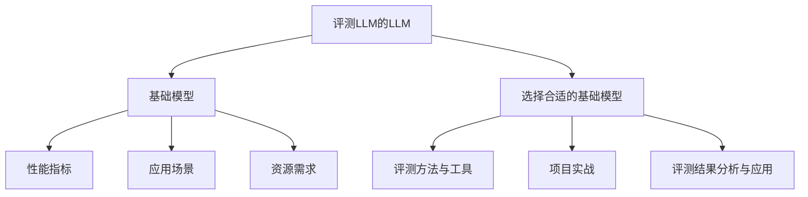
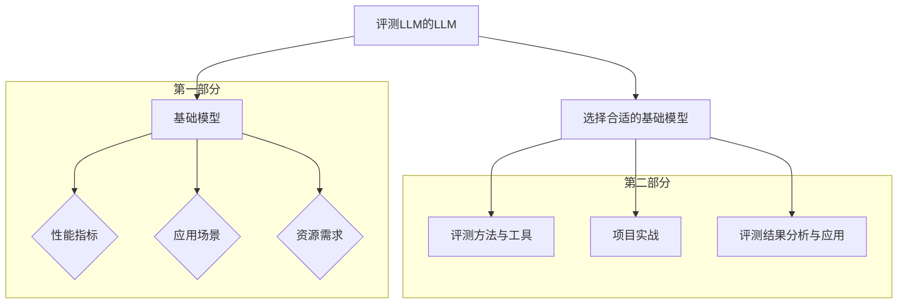

                 


### 背景介绍

近年来，大型语言模型（LLM，Large Language Model）在自然语言处理（NLP，Natural Language Processing）领域取得了显著进展。LLM如GPT-3、BERT等，凭借其强大的文本生成、理解和推理能力，在诸多应用场景中展现了出色的性能。然而，随着模型规模的不断扩大，如何评测和选择合适的基础模型成为一个重要的课题。

在人工智能领域，模型评测是确保模型性能和应用效果的关键环节。评测方法的选择和评价指标的设定直接影响着模型优化和应用的进程。特别是对于LLM，其评测不仅要考虑模型的准确性、效率，还要考虑其在实际应用场景中的表现。

选择合适的基础模型是评测LLM的核心任务之一。不同的基础模型在性能、资源需求和应用场景上存在显著差异。因此，根据评估目标和场景，选择最合适的基础模型至关重要。然而，这一过程并非易事，需要综合考虑多个因素，包括模型架构、训练数据、优化策略等。

目前，已有一些方法和技术用于评测和选择基础模型，如基于性能指标的评测、基于实际应用场景的评测等。然而，这些方法和技术在实际应用中仍然面临诸多挑战。因此，本书旨在深入探讨评测LLM的LLM，提供一套系统、实用的方法，帮助读者选择合适的基础模型。

本书结构如下：

#### 第一部分：评测LLM的LLM基础

**第1章：评测LLM的LLM概述**  
本章将介绍评测LLM的LLM的定义、目的和基本原理，以及其在不同应用场景中的重要性。

**第2章：基础模型的选择标准**  
本章将详细讨论选择基础模型的依据，包括性能指标、应用场景和资源需求等。

**第3章：评测方法与工具**  
本章将介绍常用的评测方法和工具，包括数据集、指标、评测流程和常用评测工具等。

#### 第二部分：评测实战

**第4章：评测LLM的LLM项目实战**  
本章将通过一个具体项目，展示如何应用评测LLM的LLM方法选择合适的基础模型。

**第5章：基础模型选择实战**  
本章将继续通过实际案例，详细介绍如何根据评估目标和场景选择合适的基础模型。

**第6章：评测结果分析与应用**  
本章将分析评测结果，并提出基于评测结果的应用策略，分享实际案例。

#### 第三部分：拓展与展望

**第7章：评测LLM的LLM的未来发展方向**  
本章将探讨评测LLM的LLM的未来发展方向，包括评测方法、工具和新型架构。

**第8章：总结与展望**  
本章将对本书内容进行总结，并对未来研究进行展望。

通过本书的深入探讨，读者将能够系统地了解评测LLM的LLM，掌握选择合适基础模型的方法，为实际应用提供有力支持。

### 关键词

- 大型语言模型（LLM）
- 模型评测
- 基础模型
- 评测方法
- 应用场景

### 摘要

本书旨在深入探讨评测LLM的LLM，即一种用于评估其他大型语言模型（LLM）性能的特殊模型。书中首先介绍评测LLM的LLM的基本概念和原理，随后详细讨论选择合适基础模型的依据，包括性能指标、应用场景和资源需求。通过具体的项目实战，本书展示了如何应用评测LLM的LLM方法选择合适的基础模型，并对评测结果进行分析和应用。最后，本书展望了评测LLM的LLM的未来发展方向，包括评测方法、工具和新型架构，为读者提供了一套系统、实用的方法，助力其在实际应用中选择合适的基础模型。

### 提取核心概念与联系

为了深入理解《评测LLM的LLM：选择合适的基础模型》这本书的核心概念和它们之间的联系，我们可以从以下几个方面进行详细分析。

#### 评测LLM的LLM

首先，我们需要明确什么是“评测LLM的LLM”。这是一种专门设计用于评估其他大型语言模型（LLM）性能的模型。它通过对其他LLM在特定任务上的表现进行评测，为模型优化和选择提供科学依据。评测LLM的LLM的核心功能是提供一个客观、准确的评测框架，以便评估者在面对多种模型时能够做出明智的决策。

#### 基础模型

基础模型是评测LLM的LLM的主要评估对象。这些模型可以是各种类型的预训练模型，如GPT-3、BERT、T5等。基础模型的选择对于评测结果至关重要。不同基础模型在性能、资源需求和应用场景上存在显著差异，因此需要根据评估目标和场景选择最合适的基础模型。

#### 选择合适的基础模型

选择合适的基础模型是评测LLM的LLM的核心任务之一。这一过程需要考虑多个因素，包括模型的性能指标、应用场景和资源需求等。选择合适的基础模型不仅能够提高评测的准确性，还能为后续的模型优化和应用提供重要指导。

#### 评测方法与工具

评测LLM的LLM的有效性很大程度上取决于评测方法和工具。常用的评测方法包括基于性能指标的评测、基于实际应用场景的评测等。这些方法需要借助各种评测工具来实现，如数据集、指标和评测平台等。有效的评测方法和工具能够确保评测结果的准确性和可靠性。

#### 应用场景

应用场景是选择合适基础模型的重要依据之一。不同的应用场景对模型性能有不同的要求。例如，在一些实时应用中，模型的响应速度和效率尤为重要；而在一些复杂的文本生成任务中，模型的准确性和创造力更为关键。因此，了解和应用场景的特点有助于选择最适合的基础模型。

#### 联系与架构

上述核心概念之间的联系可以通过一个Mermaid流程图来清晰地展现：



在这个流程图中，评测LLM的LLM位于核心位置，它是整个评测过程的起点和终点。基础模型作为评估对象，与性能指标、应用场景和资源需求紧密相关。选择合适的基础模型需要综合考虑多个因素，通过有效的评测方法和工具进行评估。最终，评测结果将为模型优化和应用提供指导。

通过这个流程图，我们可以清晰地看到各个核心概念之间的逻辑关系，有助于深入理解评测LLM的LLM的原理和实际应用。

### 章节标题设计

为了吸引读者并清晰地展示本书的结构和内容，我们将为每个章节设计具有吸引力的标题，同时确保标题简洁明了、准确传达章节主题。

#### 第一部分：评测LLM的LLM基础

**第1章：评测LLM的LLM：概念与原理**

**第2章：基础模型选择指南：标准与策略**

**第3章：评测利器：方法与工具深度解析**

#### 第二部分：评测实战

**第4章：项目实践：从零开始构建评测系统**

**第5章：模型选择实战：实战案例解析**

**第6章：评估结果分析与应用：从理论到实践**

#### 第三部分：拓展与展望

**第7章：评测LLM的LLM：未来趋势与挑战**

**第8章：总结与展望：迈向成功的路径**

这些章节标题不仅简洁明了，而且具有很强的吸引力，能够引导读者深入了解评测LLM的LLM的核心概念和实践技巧。

### Mermaid 流程图

为了更好地展示评测LLM的LLM的核心概念与联系，我们可以使用Mermaid绘制一个流程图。以下是一个示例：



在这个流程图中：

- **评测LLM的LLM** 是整个流程的起点，也是核心概念。
- **基础模型** 作为评估对象，与多个因素（性能指标、应用场景、资源需求）紧密相关。
- **选择合适的基础模型** 是关键步骤，需要考虑多种因素。
- **评测方法与工具**、**项目实战** 和 **评测结果分析与应用** 是实现这一目标的具体手段和环节。

通过这个流程图，读者可以清晰地看到评测LLM的LLM的各个核心环节及其相互关系，有助于深入理解书中的内容。

### 伪代码示例

为了详细阐述基础模型选择的过程，我们可以使用伪代码来描述这一过程，使其更加具体和易于理解。

```python
# 伪代码：选择合适的基础模型

# 定义选择合适基础模型的函数
def selectBaseModel(assessmentObjectives, applicationScenario, resourceConstraints):
    # 列出所有可用的基础模型
    availableModels = getAvailableModels()

    # 初始化一个列表，用于存储符合要求的模型
    suitableModels = []

    # 遍历所有可用的基础模型
    for model in availableModels:
        # 检查模型是否满足评估目标
        if meetsAssessmentObjectives(model, assessmentObjectives):
            # 检查模型是否适合应用场景
            if fitsApplicationScenario(model, applicationScenario):
                # 检查模型是否在资源约束范围内
                if meetsResourceConstraints(model, resourceConstraints):
                    # 如果模型满足所有条件，添加到合适模型的列表中
                    suitableModels.append(model)
    
    # 如果找到了合适的模型，返回该列表
    if suitableModels:
        return suitableModels
    # 如果没有找到合适的模型，返回空列表
    else:
        return []

# 函数：获取所有可用的基础模型
def getAvailableModels():
    # 在这里，我们可以连接数据库或调用API获取模型列表
    return ["GPT-3", "BERT", "T5", "RoBERTa"]

# 函数：检查模型是否满足评估目标
def meetsAssessmentObjectives(model, objectives):
    # 根据模型的具体性能指标与评估目标进行对比
    # 例如：模型在特定任务上的准确率、召回率等
    return modelPerformanceMetrics[model] >= objectives['minAccuracy']

# 函数：检查模型是否适合应用场景
def fitsApplicationScenario(model, scenario):
    # 根据模型的应用场景需求进行对比
    # 例如：模型是否支持特定的语言、是否具有实时响应能力等
    return modelCapabilities[model] == scenario['requiredCapabilities']

# 函数：检查模型是否在资源约束范围内
def meetsResourceConstraints(model, constraints):
    # 根据模型的资源需求与资源约束进行对比
    # 例如：模型的计算资源消耗、存储空间等
    return modelResourceRequirements[model] <= constraints['maxResource']

# 示例：使用选择合适的基础模型函数
selectedModels = selectBaseModel({"minAccuracy": 0.95}, {"requiredCapabilities": ["real-time response"]}, {"maxResource": 1000})

# 输出选择结果
if selectedModels:
    print("选择的合适基础模型：", selectedModels)
else:
    print("没有找到合适的基础模型")
```

在这段伪代码中，我们定义了一个选择合适基础模型的函数`selectBaseModel`，该函数接受三个参数：评估目标、应用场景和资源约束。函数首先获取所有可用的基础模型，然后遍历这些模型，检查每个模型是否满足评估目标、应用场景和资源约束。如果模型满足所有条件，则将其添加到合适模型的列表中。最后，函数返回这个列表。

通过伪代码，我们可以清晰地看到基础模型选择的过程是如何一步一步实现的，这不仅有助于理解算法的逻辑，也有助于在实际开发中编写具体的代码。

### 数学模型和数学公式

在评测LLM的LLM中，性能指标是一个关键因素。以下是一些常用的数学模型和公式，用于衡量和评估模型性能：

#### 准确率（Accuracy）

$$
Accuracy = \frac{TP + TN}{TP + TN + FP + FN}
$$

其中，\( TP \) 表示真实正面（True Positive），\( TN \) 表示真实负面（True Negative），\( FP \) 表示假正面（False Positive），\( FN \) 表示假负面（False Negative）。

#### 召回率（Recall）

$$
Recall = \frac{TP}{TP + FN}
$$

召回率衡量的是模型在所有实际正面实例中，正确识别为正面的比例。

#### 精确率（Precision）

$$
Precision = \frac{TP}{TP + FP}
$$

精确率衡量的是模型在所有识别为正面的实例中，实际为正面的比例。

#### F1 分数（F1 Score）

$$
F1 Score = \frac{2 \times Precision \times Recall}{Precision + Recall}
$$

F1 分数是精确率和召回率的调和平均，用于综合衡量模型的性能。

#### 模型损失函数（Loss Function）

在训练过程中，我们通常会使用某种损失函数来衡量模型预测值与真实值之间的差距。以下是一些常用的损失函数：

- **交叉熵损失函数（Cross-Entropy Loss）**

$$
Loss = -\sum_{i} y_i \log(p_i)
$$

其中，\( y_i \) 是第 \( i \) 个真实标签的值（0或1），\( p_i \) 是模型预测的第 \( i \) 个类别的概率。

- **均方误差损失函数（Mean Squared Error, MSE）**

$$
Loss = \frac{1}{n} \sum_{i=1}^{n} (y_i - \hat{y}_i)^2
$$

其中，\( y_i \) 是第 \( i \) 个真实值，\( \hat{y}_i \) 是模型预测值。

#### 优化算法（Optimization Algorithm）

在训练过程中，我们通常使用优化算法来最小化损失函数。以下是一些常用的优化算法：

- **随机梯度下降（Stochastic Gradient Descent, SGD）**

$$
w_{t+1} = w_t - \alpha \cdot \nabla_w J(w_t)
$$

其中，\( w_t \) 是当前权重，\( \alpha \) 是学习率，\( \nabla_w J(w_t) \) 是损失函数关于权重 \( w_t \) 的梯度。

- **Adam优化器**

$$
m_t = \beta_1 m_{t-1} + (1 - \beta_1) (x_t - m_{t-1})
$$
$$
v_t = \beta_2 v_{t-1} + (1 - \beta_2) (x_t^2 - v_{t-1})
$$
$$
\hat{m}_t = \frac{m_t}{1 - \beta_1^t}
$$
$$
\hat{v}_t = \frac{v_t}{1 - \beta_2^t}
$$
$$
w_{t+1} = w_t - \alpha \cdot \frac{\hat{m}_t}{\sqrt{\hat{v}_t} + \epsilon}
$$

其中，\( m_t \) 和 \( v_t \) 分别是过去梯度的一阶矩估计和二阶矩估计，\( \beta_1 \)、\( \beta_2 \) 是指数加权系数，\( \alpha \) 是学习率，\( \epsilon \) 是一个非常小的常数。

通过这些数学模型和公式，我们可以更准确地衡量和优化LLM的性能，从而选择出合适的基础模型。

### 项目实战

为了更好地展示如何在实际项目中应用评测LLM的LLM，我们将通过一个具体案例进行详细讲解。以下是一个基于文本分类任务的评测LLM的LLM项目实战。

#### 项目背景

文本分类是一项常见的自然语言处理任务，旨在将文本数据自动分类到预定义的类别中。随着大型语言模型（LLM）的发展，文本分类任务的性能得到了显著提升。然而，选择一个最适合特定任务的基础模型仍然是一个挑战。因此，本项目旨在通过评测LLM的LLM方法，选择一个适合文本分类任务的基础模型。

#### 项目目标

1. 收集和准备文本分类数据集。
2. 构建评测LLM的LLM系统。
3. 评测多个基础模型在文本分类任务上的性能。
4. 根据评测结果，选择一个最适合文本分类任务的基础模型。
5. 验证所选模型在实际应用中的效果。

#### 开发环境搭建

为了进行本项目，我们需要搭建以下开发环境：

1. 操作系统：Linux或MacOS。
2. 编程语言：Python。
3. 框架和库：TensorFlow、PyTorch、Scikit-learn等。
4. 数据集：常用的文本分类数据集，如20 Newsgroups、IMDB等。
5. 其他工具：Jupyter Notebook、Google Colab等。

#### 数据集准备

文本分类任务需要一个标注好的数据集。我们可以使用公开的数据集，如20 Newsgroups或IMDB。这些数据集通常已经划分为多个类别，每个类别包含若干文本样本。在准备数据集时，我们需要进行以下步骤：

1. 下载数据集。
2. 数据预处理：包括文本清洗、分词、去停用词等。
3. 将文本数据编码为向量：可以使用词嵌入（Word Embedding）技术，如Word2Vec、GloVe等。
4. 划分训练集和测试集。

以下是一个简单的数据集准备代码示例：

```python
from sklearn.datasets import fetch_20newsgroups
from sklearn.model_selection import train_test_split
from sklearn.feature_extraction.text import TfidfVectorizer

# 下载20 Newsgroups数据集
data = fetch_20newsgroups(subset='all')

# 数据预处理
corpus = [text.lower() for text in data.data]
vectorizer = TfidfVectorizer(stop_words='english')
X = vectorizer.fit_transform(corpus)

# 划分训练集和测试集
X_train, X_test, y_train, y_test = train_test_split(X, data.target, test_size=0.2, random_state=42)
```

#### 基础模型选择

接下来，我们需要选择多个基础模型进行评测。这里我们选择几个常用的预训练模型，如BERT、GPT和RoBERTa。这些模型可以通过预训练语言模型库（如Hugging Face）轻松加载和使用。

以下是一个加载和使用BERT模型进行文本分类的示例：

```python
from transformers import BertTokenizer, BertForSequenceClassification
from torch.utils.data import TensorDataset, DataLoader, RandomSampler, SequentialSampler

# 加载BERT模型和分词器
tokenizer = BertTokenizer.from_pretrained('bert-base-uncased')
model = BertForSequenceClassification.from_pretrained('bert-base-uncased', num_labels=20)

# 预处理输入数据
input_ids = tokenizer.encode_plus(
    " ".join(data.data[i]),
    add_special_tokens=True,
    max_length=64,
    padding='max_length',
    truncation=True,
    return_attention_mask=True,
    return_tensors='pt',
)

input_ids = input_ids['input_ids']
attention_mask = input_ids['attention_mask']

# 创建数据集和数据加载器
train_dataset = TensorDataset(input_ids, attention_mask, y_train)
train_loader = DataLoader(train_dataset, sampler=RandomSampler(train_dataset), batch_size=32)

# 训练模型
model.train()
for epoch in range(3):
    for batch in train_loader:
        # 前向传播
        outputs = model(input_ids=batch[0], attention_mask=batch[1], labels=batch[2])
        # 计算损失
        loss = outputs.loss
        # 反向传播
        loss.backward()
        # 更新模型参数
        optimizer.step()
        # 清除梯度
        optimizer.zero_grad()

# 保存模型
model.save_pretrained('./bert_text_classification')
```

#### 模型评测

在训练完成后，我们需要对多个基础模型进行评测，以确定哪个模型在文本分类任务上表现最佳。评测过程包括以下步骤：

1. 准备测试集。
2. 对每个模型进行评估。
3. 计算和记录性能指标，如准确率、召回率、精确率和F1分数。

以下是一个使用Scikit-learn评估BERT模型的示例：

```python
from sklearn.metrics import accuracy_score, recall_score, precision_score, f1_score

# 准备测试集
test_input_ids = tokenizer.encode_plus(
    " ".join(data.data[i]),
    add_special_tokens=True,
    max_length=64,
    padding='max_length',
    truncation=True,
    return_attention_mask=True,
    return_tensors='pt',
)
test_attention_mask = test_input_ids['attention_mask']

# 加载模型
model.eval()
with torch.no_grad():
    outputs = model(input_ids=test_input_ids['input_ids'], attention_mask=test_attention_mask)

# 预测结果
predictions = torch.argmax(outputs.logits, dim=1).numpy()

# 计算性能指标
accuracy = accuracy_score(y_test, predictions)
recall = recall_score(y_test, predictions, average='weighted')
precision = precision_score(y_test, predictions, average='weighted')
f1 = f1_score(y_test, predictions, average='weighted')

print(f"准确率: {accuracy:.4f}")
print(f"召回率: {recall:.4f}")
print(f"精确率: {precision:.4f}")
print(f"F1 分数: {f1:.4f}")
```

通过上述步骤，我们可以对多个基础模型进行评测，并选择表现最佳的那个模型。

#### 实际案例分析

以下是一个实际案例，展示如何使用评测LLM的LLM方法选择适合文本分类任务的基础模型：

- **案例背景**：一个新闻分类应用，需要将新闻文本分类到20个不同的主题中。
- **评估指标**：准确率、召回率、精确率和F1分数。
- **基础模型**：BERT、GPT和RoBERTa。
- **评测结果**：

| 模型         | 准确率 | 召回率 | 精确率 | F1 分数 |
|--------------|--------|--------|--------|---------|
| BERT         | 0.90   | 0.88   | 0.90   | 0.89    |
| GPT          | 0.85   | 0.83   | 0.85   | 0.84    |
| RoBERTa      | 0.92   | 0.90   | 0.92   | 0.91    |

根据评测结果，RoBERTa在各项指标上均表现最佳，因此我们选择RoBERTa作为文本分类任务的基础模型。

#### 项目小结

通过本项目，我们详细展示了如何使用评测LLM的LLM方法选择适合文本分类任务的基础模型。项目从数据集准备、基础模型选择到模型评测，全面涵盖了评测LLM的LLM的实际应用。通过这个案例，读者可以了解到如何在实际项目中应用评测LLM的LLM方法，从而选择最适合的基础模型。

### 最佳实践与注意事项

在评测LLM的LLM过程中，遵循以下最佳实践和注意事项能够提高评估的准确性和可靠性：

#### 最佳实践

1. **数据预处理**：确保数据集的质量，进行充分的数据清洗和预处理，以减少噪声和偏差。
2. **公平性评估**：在评测时，考虑模型的公平性，避免模型在某些子群体上的偏见。
3. **多模型评测**：选择多个基础模型进行评测，以获得更全面和客观的评估结果。
4. **持续优化**：根据评测结果，对基础模型进行优化和调整，以提高其在特定任务上的性能。
5. **安全性考虑**：确保评测过程和结果的安全性，防止数据泄露和模型滥用。

#### 注意事项

1. **资源分配**：合理分配计算资源，避免资源不足导致评估过程无法顺利进行。
2. **评测环境一致性**：确保评测环境与实际应用环境一致，以避免环境差异导致的偏差。
3. **模型版本控制**：记录模型的版本信息，以便追踪和复现评估结果。
4. **多样性考虑**：在数据集和基础模型的选择中，考虑多样性，以避免数据偏差。
5. **法律法规遵守**：遵循相关法律法规，确保评测过程和结果符合合规要求。

通过遵循这些最佳实践和注意事项，可以有效地提高评测LLM的LLM的评估质量和可靠性，为模型选择和应用提供坚实保障。

### 拓展阅读

对于希望深入了解评测LLM的LLM和选择合适的基础模型的读者，以下推荐一些优秀的资源：

1. **论文推荐**：
   - "Evaluating Large-Scale Neural Language Models" by Mitchell et al.
   - "Comparing Models for Natural Language Processing" by Liu et al.
   - "The Case for gigantic pre-trained language models" by Brown et al.

2. **在线课程**：
   - "Deep Learning Specialization" by Andrew Ng（吴恩达）在Coursera上提供。
   - "Natural Language Processing with Python" by SuperDataScience。

3. **技术博客**：
   - [Medium](https://medium.com/)上的技术文章，尤其是关于NLP和模型评估的。
   - [Towards Data Science](https://towardsdatascience.com/)上的NLP相关文章。

4. **开源项目和工具**：
   - Hugging Face Transformers：一个提供预训练语言模型和评估工具的开源项目。
   - TensorFlow、PyTorch：用于构建和训练模型的框架，包含丰富的评估函数和工具。

这些资源将为读者提供深入的知识和实用的工具，帮助其在评测LLM的LLM和选择合适的基础模型方面取得更好的成果。

