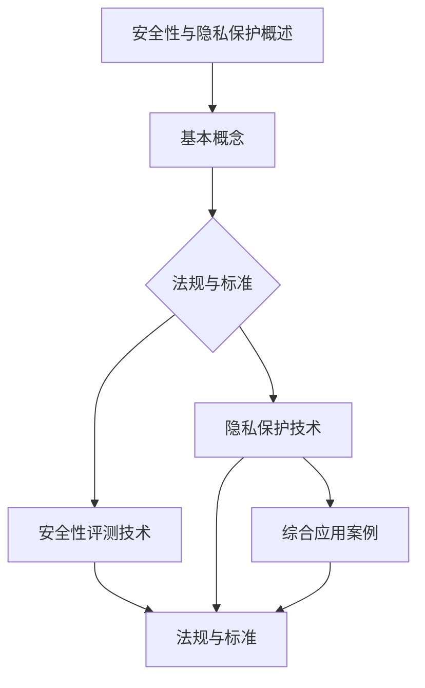

                 


### 目录大纲

# 评测中的安全性与隐私保护措施

## 第一部分：概述与基础理论

### 第1章：评测中的安全性与隐私保护概述

### 第2章：安全性与隐私保护的基本概念

### 第3章：安全性与隐私保护的法规与标准

## 第二部分：核心技术

### 第4章：安全性评测技术

### 第5章：隐私保护技术

### 第6章：综合应用案例

## 第三部分：未来展望与趋势

### 第7章：评测中的安全性与隐私保护发展趋势

### 附录：安全性与隐私保护相关资源

### 核心概念与联系

**Mermaid 流程图**



### 核心算法原理讲解

**伪代码**

```plaintext
function security_evaluation(dataset):
    initialize intrusion_detection_system
    for each sample in dataset:
        analyze sample using intrusion_detection_system
        if sample is suspicious:
            report intrusion attempt
    return security_evaluation_result

function privacy_protection(data):
    encrypt_data(data, key)
    for each data_subset in data:
        apply anonymization Techniques
    return anonymized_data
```

### 数学模型和数学公式讲解

**详细讲解与举例说明**

**信息论基础**

$$
I(X;Y) = H(X) - H(X|Y)
$$

**公式解释：**

- \( I(X;Y) \)：互信息，衡量两个随机变量 \(X\) 和 \(Y\) 之间的相关性。
- \( H(X) \)：\(X\) 的熵，表示 \(X\) 的不确定性。
- \( H(X|Y) \)：条件熵，表示在已知 \(Y\) 的条件下 \(X\) 的不确定性。

**举例：**

假设一个数据集中的用户隐私信息 \(X\) 和匿名化后的信息 \(Y\)，计算 \(X\) 和 \(Y\) 之间的互信息，以评估隐私保护的强度。

$$
I(X;Y) = H(X) - H(X|Y)
$$

### 项目实战

**开发环境搭建**

- 创建一个虚拟环境：`conda create -n securityPrivacy python=3.8`
- 安装必要的库：`conda install -n securityPrivacy numpy pandas scikit-learn`

**源代码实现与解读**

```python
# 导入库
import numpy as np
import pandas as pd
from sklearn.ensemble import IsolationForest

# 加载数据集
data = pd.read_csv('dataset.csv')

# 安装入侵检测系统
def intrusion_detection(data):
    model = IsolationForest()
    model.fit(data)
    scores = model.decision_function(data)
    return scores

# 隐私保护
def privacy_protection(data):
    anonymized_data = data.copy()
    anonymized_data['sensitive_info'] = anonymized_data['sensitive_info'].apply(lambda x: 'ANONYMOUS')
    return anonymized_data

# 运行实战
scores = intrusion_detection(data)
anonymized_data = privacy_protection(data)

# 代码分析
# 使用IsolationForest算法检测异常值，代表可能的安全威胁。
# 对敏感信息进行匿名化处理，以保护用户隐私。
```

**代码应用解读与分析**

- **入侵检测：** 使用 `IsolationForest` 算法对数据集进行入侵检测，识别潜在的安全威胁。
- **隐私保护：** 通过将敏感信息替换为匿名标识符，保护用户隐私。

**实际案例分析与详细讲解剖析**

- **案例：** 分析一家金融公司如何在网络安全和用户隐私保护方面实施综合方案。

  **分析步骤：**
  1. **数据收集：** 收集用户交易数据和网络安全日志。
  2. **安全评估：** 使用入侵检测系统对网络安全日志进行分析，识别潜在的攻击行为。
  3. **隐私保护：** 对用户交易数据进行匿名化处理，确保隐私不被泄露。

**项目小结**

通过实施综合安全性和隐私保护方案，金融公司能够在保障用户数据安全的同时，满足法规和标准的要求。

### 最佳实践 tips、小结、注意事项、拓展阅读

**最佳实践 tips：**

- 定期更新安全防护措施，以应对新出现的威胁。
- 确保安全性和隐私保护措施的兼容性和可扩展性。
- 定期进行安全性和隐私保护的培训，提高团队意识和技能。

**小结：**

本章介绍了评测中的安全性与隐私保护措施，从基本概念、核心算法到实际应用进行了详细讲解。通过项目实战展示了安全性和隐私保护在实际开发中的实现过程。

**注意事项：**

- 在实施安全性和隐私保护措施时，需要充分考虑法规和标准的要求。
- 需要定期评估和更新安全性和隐私保护方案，以适应技术发展和业务需求的变化。

**拓展阅读：**

- [ISO/IEC 27001：信息安全管理体系标准](https://www.iso.org/standard/71664.html)
- [GDPR：欧盟通用数据保护条例](https://ec.europa.eu/justice/article-29/portal/page/portal/privacy-legislation/eu-data-protection-law/regulation)
- [CCPA：加州消费者隐私法案](https://oag.ca.gov/ccpa)

## 第1章：评测中的安全性与隐私保护概述

### 1.1 安全性与隐私保护的定义与重要性

**安全性与隐私保护的定义**

安全性（Security）是指在信息处理、传输和存储过程中，保护系统、网络和数据免受未经授权的访问、篡改、泄露、破坏或恶意行为的能力。隐私保护（Privacy Protection）则是指在数据处理和共享过程中，保护个人信息和隐私不被不当使用、泄露或滥用。

在信息技术快速发展的今天，安全性与隐私保护的重要性愈发凸显。随着数据量的爆炸式增长，企业和个人面临的网络攻击和数据泄露风险也越来越高。以下是一些关键原因，解释了为什么安全性与隐私保护在评测中至关重要：

**网络攻击的风险增加**

网络攻击手段日益多样化，包括恶意软件、钓鱼攻击、DDoS攻击等，这些攻击可能导致数据泄露、系统瘫痪，对企业造成巨大的经济损失。因此，保障评测环境的安全性至关重要。

**数据泄露的后果严重**

数据泄露不仅会导致用户隐私受损，还可能带来声誉损失、法律风险和罚款。例如，2017年，Equifax数据泄露事件导致1.43亿用户的个人信息被窃取，公司因此遭受了巨额赔偿和罚款。

**合规要求的压力**

许多国家和地区制定了严格的数据保护法规，如欧盟的GDPR和美国的CCPA。企业如果不遵守这些法规，将面临严重的法律后果。因此，在评测过程中，必须确保遵循相关法律法规。

**客户信任的基石**

安全性是客户信任的基石。如果客户无法相信企业的数据保护措施，他们可能会选择其他竞争对手的产品或服务。因此，提供安全可靠的评测服务，有助于提升客户信任和忠诚度。

**隐私保护的意义**

隐私保护不仅关乎个人数据的保护，还关乎社会道德和价值观的维护。未经授权泄露或滥用个人信息，不仅违反了法律规定，也侵犯了个人隐私权。因此，隐私保护是现代信息技术发展的重要伦理基础。

**评测中的安全性与隐私保护需求**

在评测过程中，安全性与隐私保护的需求主要体现在以下几个方面：

- **数据完整性**：确保数据在传输和存储过程中不被篡改。
- **访问控制**：限制未经授权的访问，确保只有授权用户可以访问敏感数据。
- **身份验证**：通过多种验证手段确保用户身份的真实性。
- **审计与监控**：记录和监控系统活动，以便在出现问题时迅速响应。
- **加密技术**：使用加密算法保护数据在传输和存储过程中的安全。
- **匿名化处理**：对敏感信息进行匿名化处理，降低数据泄露的风险。

### 1.2 评测环境中的安全威胁

**常见的安全威胁**

在评测环境中，可能面临多种安全威胁，包括但不限于以下几种：

- **恶意软件**：恶意软件如病毒、木马、勒索软件等，可以通过网络传播，破坏系统或窃取敏感数据。
- **网络攻击**：网络攻击包括DDoS攻击、SQL注入、跨站脚本攻击（XSS）等，攻击者可能通过这些手段获取未授权访问权限或篡改数据。
- **内部威胁**：内部人员滥用权限，有意或无意地泄露或篡改数据。
- **物理攻击**：物理攻击如窃取设备、破坏设备等，可能导致数据泄露或系统瘫痪。
- **社会工程学攻击**：利用人性弱点，通过欺骗、误导等手段获取敏感信息。

**安全威胁的影响**

安全威胁可能对评测环境产生以下负面影响：

- **数据泄露**：敏感数据被非法访问或窃取，可能导致隐私泄露和财务损失。
- **系统瘫痪**：网络攻击可能导致系统崩溃，影响评测的正常进行。
- **法律风险**：违反数据保护法规，可能导致法律诉讼和罚款。
- **声誉损失**：数据泄露或系统故障可能导致客户信任下降，影响企业声誉。
- **业务中断**：网络攻击或系统故障可能导致业务中断，影响企业运营。

### 1.3 隐私保护的需求与挑战

**隐私保护的需求**

隐私保护的需求主要体现在以下几个方面：

- **法律法规要求**：许多国家和地区制定了严格的数据保护法规，如欧盟的GDPR和美国的CCPA，企业必须遵守这些法规，以避免法律风险。
- **客户信任**：提供可靠的隐私保护措施，有助于提升客户对企业的信任。
- **社会责任**：保护个人信息和隐私是现代社会的道德责任，企业有义务履行这一责任。
- **合规性要求**：在跨国业务中，企业需要遵守不同国家和地区的隐私保护法规，确保数据处理的合规性。

**隐私保护的挑战**

尽管隐私保护的需求日益凸显，但在实际操作中仍然面临许多挑战：

- **数据量的增加**：随着数据量的增加，保护数据隐私的难度也相应增大。
- **技术的进步**：攻击手段和技术手段的不断进步，使得隐私保护面临新的挑战。
- **多渠道数据收集**：企业通过多种渠道收集用户数据，增加了隐私保护难度。
- **用户隐私意识的提升**：用户对隐私保护的意识越来越强，企业需要采取更严格的隐私保护措施。
- **成本与效益**：实施严格的隐私保护措施可能带来较高的成本，企业需要在成本和效益之间做出平衡。

### 1.4 安全性与隐私保护的核心原则

为了有效地保障评测中的安全性与隐私保护，需要遵循以下核心原则：

- **最小权限原则**：确保用户和系统组件只有必要的权限，减少权限滥用风险。
- **透明性原则**：确保数据处理的透明性，让用户了解其数据如何被使用和保护。
- **加密原则**：使用加密技术保护数据在传输和存储过程中的安全。
- **访问控制原则**：通过访问控制机制限制对敏感数据的访问。
- **审计与监控原则**：记录和监控系统活动，以便在出现问题时迅速响应。
- **风险评估原则**：定期进行风险评估，识别潜在的安全威胁和隐私风险。

通过遵循这些原则，企业可以在评测过程中有效地保障安全性与隐私保护。

### 1.5 小结

本章介绍了评测中的安全性与隐私保护的基本概念、重要性和需求，以及评测环境中的安全威胁和隐私保护的挑战。通过分析安全性与隐私保护的核心原则，为后续章节的内容奠定了基础。

## 第2章：安全性与隐私保护的基本概念

### 2.1 安全性评估方法

**安全性评估方法**是指在信息系统的整个生命周期中，通过各种手段和技术对系统的安全性进行全面评估和验证。以下是一些常见的安全评估方法：

**1. 入侵检测系统（IDS）**

入侵检测系统（IDS）是一种实时监控系统，用于检测和响应网络中的异常活动和潜在入侵。IDS主要分为基于签名的入侵检测系统和基于行为的入侵检测系统。

- **基于签名的入侵检测系统**：通过识别已知的攻击模式（如恶意代码签名）来检测入侵。
- **基于行为的入侵检测系统**：通过分析网络流量和系统行为，识别异常模式来检测入侵。

**2. 漏洞扫描器**

漏洞扫描器是一种自动化工具，用于识别系统中的安全漏洞和配置错误。漏洞扫描器可以分为以下几类：

- **网络漏洞扫描器**：用于扫描网络中的设备和服务，识别开放端口、已知的漏洞和配置问题。
- **应用程序漏洞扫描器**：用于扫描Web应用和移动应用，识别常见的Web漏洞（如SQL注入、XSS等）。

**3. 安全漏洞评估**

安全漏洞评估是一种通过评估系统、应用程序和网络的安全状态，识别潜在安全漏洞的过程。安全漏洞评估可以分为以下几种类型：

- **静态分析**：在应用程序编译或运行前，分析代码和配置文件，识别潜在的漏洞。
- **动态分析**：在应用程序运行时，通过执行实际代码来检测漏洞和异常行为。
- **渗透测试**：模拟黑客攻击，通过实际测试系统的安全性，识别潜在的安全漏洞。

**4. 网络安全监控**

网络安全监控是一种实时监控网络流量、系统活动和用户行为的方法，用于识别异常行为和潜在的安全威胁。网络安全监控主要包括以下几种技术：

- **网络流量分析**：分析网络流量模式，识别异常流量和潜在威胁。
- **异常行为识别**：使用机器学习和统计分析方法，识别异常行为和潜在攻击。
- **日志分析**：收集和分析系统日志，识别异常活动和潜在漏洞。

### 2.2 隐私保护理论

**隐私保护理论**是指研究如何保护个人隐私和数据安全的一门学科。以下是一些关键的隐私保护理论：

**1. 数据匿名化**

数据匿名化是一种通过消除个人识别信息来保护隐私的技术。数据匿名化的方法包括：

- **K-匿名性**：确保数据集中的任何记录都不会与少于K个其他记录相关联。
- **l-diversity**：确保数据集中的任何记录都不会与少于l个其他记录相关联，并且这些记录属于不同的类别。
- **t-closeness**：确保数据集中的任何记录都不会与少于t个其他记录相关联，并且这些记录的属性分布与整体分布相似。

**2. 加密技术**

加密技术是一种通过将明文数据转换为密文来保护数据隐私的方法。加密技术可以分为以下几种类型：

- **对称加密**：使用相同的密钥进行加密和解密。
- **非对称加密**：使用一对密钥（公钥和私钥）进行加密和解密。
- **哈希函数**：将输入数据映射为固定长度的字符串，用于确保数据完整性。

**3. 同态加密**

同态加密是一种在不解密数据的情况下对加密数据进行计算的方法。同态加密可以应用于多种计算任务，如数据库查询、机器学习和加密计算。

**4. 安全多方计算**

安全多方计算是一种允许多个参与方在不泄露各自数据的情况下共同计算结果的技术。安全多方计算可以应用于隐私保护、数据共享和协同计算等领域。

### 2.3 安全性评估模型

**安全性评估模型**是指用于评估系统或网络安全性的框架和方法。以下是一些常见的安全性评估模型：

**1. OCTAVE（操作风险和威胁评估方法）**

OCTAVE是一种基于风险管理的方法，用于评估和缓解系统或网络的安全风险。OCTAVE的主要步骤包括：

- **威胁识别**：识别潜在的威胁和攻击手段。
- **漏洞评估**：评估系统或网络中的漏洞和弱点。
- **风险评估**：评估威胁对系统的潜在影响和严重程度。
- **缓解策略**：制定和实施缓解策略，减少安全风险。

**2. STRIDE（结构化威胁识别和防御方法）**

STRIDE是一种用于识别和应对网络安全威胁的方法。STRIDE分为以下几种威胁类型：

- **欺骗**（Deception）
- **拒绝服务**（Denial of Service）
- **篡改**（Tampering）
- **非法访问**（Information Disclosure）
- **非法使用**（Improper Use）
- **暴露资源**（DoS）

**3.-framework（安全评估框架）**

-security评估框架是一种综合性的安全评估方法，包括以下步骤：

- **需求分析**：分析系统或网络的需求和目标。
- **风险评估**：评估系统或网络的风险和威胁。
- **设计安全控制措施**：设计安全控制措施，降低风险。
- **实施与部署**：实施安全控制措施，确保系统的安全性。
- **测试与评估**：测试和评估安全控制措施的有效性。

### 2.4 隐私保护策略

**隐私保护策略**是指企业在数据处理过程中，为保护用户隐私所采取的一系列措施。以下是一些常见的隐私保护策略：

**1. 数据最小化**

数据最小化是指只收集和处理与业务目标直接相关的最小数据量。通过减少数据量，可以降低隐私泄露的风险。

**2. 数据加密**

数据加密是一种通过将数据转换为密文来保护数据隐私的方法。数据加密可以应用于数据存储、传输和共享等多个环节。

**3. 数据匿名化**

数据匿名化是一种通过消除个人识别信息来保护隐私的技术。数据匿名化可以应用于数据分析和报告等场景。

**4. 访问控制**

访问控制是一种通过限制对数据的访问权限来保护数据隐私的方法。访问控制可以基于用户身份、角色和权限进行配置。

**5. 数据留存和删除**

数据留存和删除是指根据法规和业务需求，确定数据的保留期限和删除策略。通过合理的数据留存和删除策略，可以降低数据泄露的风险。

**6. 透明性和告知**

透明性和告知是指企业向用户明确告知其数据如何被使用和保护。通过提高透明度和告知，可以增强用户对企业的信任。

### 2.5 小结

本章介绍了安全性与隐私保护的基本概念，包括安全性评估方法、隐私保护理论、安全性评估模型和隐私保护策略。通过理解这些基本概念，读者可以更好地掌握安全性与隐私保护的核心原理和实践方法。

## 第3章：安全性与隐私保护的法规与标准

### 3.1 国际安全性与隐私保护法规

在全球范围内，许多国家和地区已经制定了关于安全性与隐私保护的法律和法规，旨在保护个人数据的安全和隐私。以下是一些重要的国际安全性与隐私保护法规：

**1. 欧洲联盟通用数据保护条例（GDPR）**

GDPR是欧盟于2018年5月25日正式实施的严格数据保护法规，旨在加强个人数据的保护。GDPR的主要要求包括：

- **合法性、公正性和透明性**：数据处理者必须确保数据处理具有合法性、公正性和透明性。
- **数据最小化**：仅收集为实现特定目的所必需的数据。
- **数据访问权**：个人有权访问、修改、删除或限制其个人数据。
- **数据泄露通知**：在数据泄露发生时，必须在72小时内通知监管机构。
- **数据保护官（DPO）**：大型组织必须指定数据保护官。

**2. 美国加州消费者隐私法案（CCPA）**

CCPA于2020年1月1日生效，旨在保护加州居民的隐私。CCPA的主要要求包括：

- **权利通知**：企业必须告知消费者其个人数据的收集、使用和共享方式。
- **拒绝销售**：消费者有权拒绝企业对其个人数据的销售。
- **访问权**：消费者有权访问其个人数据的副本。
- **数据删除权**：消费者有权要求企业删除其个人数据。
- **合规义务**：企业必须采取合理的措施确保CCPA的合规性。

**3. 美国健康保险可携性与责任法案（HIPAA）**

HIPAA是美国针对医疗健康信息的隐私保护法规，旨在确保医疗健康信息的保密性和完整性。HIPAA的主要要求包括：

- **隐私规则**：医疗机构必须保护患者的医疗健康信息。
- **安全规则**：医疗机构必须实施适当的安全措施，保护医疗健康信息不被未授权访问。
- **违规处罚**：违反HIPAA规定可能导致罚款和刑事处罚。

**4. 欧洲联盟网络和信息安全指令（NIS Directive）**

NIS Directive是欧盟于2016年发布的一项法规，旨在提高成员国网络和信息安全水平。该法规适用于关键基础设施的运营商，如能源、交通、金融和数字基础设施。NIS Directive的主要要求包括：

- **风险管理**：关键基础设施运营商必须实施适当的风险管理措施。
- **安全措施**：关键基础设施运营商必须采取适当的安全措施，如加密、访问控制和监控。
- **事故响应**：关键基础设施运营商必须制定事故响应计划，以便在发生安全事件时及时响应。

**5. 国际标准组织（ISO）标准**

ISO标准是一系列关于信息安全、网络安全和隐私保护的国际标准。以下是一些重要的ISO标准：

- **ISO/IEC 27001**：信息安全管理体系（ISMS）标准，提供了一套全面的框架，帮助组织建立、实施、维护和持续改进信息安全管理体系。
- **ISO/IEC 27002**：信息安全控制实践标准，提供了信息安全控制实践的指南。
- **ISO/IEC 27017**：云计算信息安全控制标准，提供了针对云计算环境的信息安全控制指南。
- **ISO/IEC 27701**：隐私信息管理体系（PIMS）标准，提供了一套框架，帮助组织建立、实施、维护和持续改进隐私信息管理体系。

### 3.2 行业标准与实践

除了国际法规，不同行业还制定了适用于本行业的安全性和隐私保护标准。以下是一些行业标准和实践：

**1. 金融行业**

金融行业的数据安全和隐私保护受到高度重视。以下是一些金融行业的标准和实践：

- **PCI DSS（支付卡行业数据安全标准）**：确保金融机构和第三方服务提供商保护信用卡支付数据的安全。
- **金融行业信息安全管理标准**：提供了一套针对金融机构的信息安全管理指南。

**2. 医疗行业**

医疗行业涉及敏感的个人健康信息，因此必须采取严格的隐私保护措施。以下是一些医疗行业的标准和实践：

- **HIPAA（健康保险可携性与责任法案）**：确保医疗机构的健康信息得到保护。
- **ISO 27001**：用于医疗机构的信息安全管理体系标准。
- **医疗数据隐私保护实践**：提供具体的隐私保护措施，如数据加密、访问控制和数据留存策略。

**3. 信息技术行业**

信息技术行业需要确保其产品和服务的安全性。以下是一些信息技术行业的标准和实践：

- **ISO/IEC 27001**：用于信息技术公司的信息安全管理体系标准。
- **信息安全最佳实践**：如网络安全、数据加密、访问控制等。
- **软件安全开发生命周期（SSDLC）**：确保软件开发过程中的安全性和隐私保护。

### 3.3 国际合作与协调

为了提高全球范围内的安全性和隐私保护水平，各国政府和国际组织正在加强合作与协调。以下是一些国际合作和协调的例子：

**1. 欧盟-美国隐私盾协议**

欧盟-美国隐私盾协议旨在允许欧盟个人数据在美国的保护水平符合欧盟的标准。该协议规定了数据传输的隐私保护措施，以实现跨大西洋的数据传输。

**2. 国际信息安全合作组织（ISC2）**

ISC2是一个全球性的专业组织，致力于推动信息安全教育和认证。ISC2通过举办研讨会、提供培训和认证，促进国际信息安全领域的合作。

**3. 国际电信联盟（ITU）**

ITU是一个联合国专门机构，负责推动全球电信和信息技术的发展。ITU发布了一系列关于网络安全和隐私保护的标准和建议，以促进国际合作。

### 3.4 小结

本章介绍了国际安全性与隐私保护法规和行业标准，包括GDPR、CCPA、HIPAA等法规，以及金融、医疗和信息技术行业的标准和实践。通过理解这些法规和标准，企业和组织可以更好地保护个人数据的安全和隐私，满足法规和标准的要求。

## 第4章：安全性评测技术

### 4.1 入侵检测系统（IDS）

入侵检测系统（IDS）是一种实时监控系统，用于检测和响应网络中的异常活动和潜在入侵。IDS可以分为基于签名的入侵检测系统和基于行为的入侵检测系统。

**基于签名的入侵检测系统（Signature-based IDS）**

基于签名的入侵检测系统通过识别已知的攻击模式（如恶意代码签名）来检测入侵。这种系统依赖于预先定义的攻击签名库，当检测到与签名库中的攻击模式匹配的数据包时，系统会发出警报。

**工作原理：**

1. **数据包捕获**：IDS从网络接口捕获传输的数据包。
2. **签名匹配**：将捕获的数据包与签名库中的攻击签名进行匹配。
3. **报警与响应**：当发现匹配的攻击签名时，系统会发出警报，并触发相应的响应措施。

**优点：**

- **高准确性**：可以精确识别已知的攻击模式。
- **快速响应**：可以迅速检测和响应新的攻击。

**缺点：**

- **难以检测新攻击**：仅能检测已知的攻击模式，对新攻击的检测能力有限。
- **签名库维护成本高**：需要不断更新签名库，以应对新的攻击。

**基于行为的入侵检测系统（Behavior-based IDS）**

基于行为的入侵检测系统通过分析网络流量和系统行为，识别异常模式来检测入侵。这种系统不依赖于已知的攻击模式，而是通过学习正常行为，检测与正常行为不符的异常活动。

**工作原理：**

1. **正常行为学习**：系统通过观察网络流量和系统行为，建立正常行为模型。
2. **异常检测**：当检测到与正常行为模型不符的活动时，系统会发出警报。
3. **报警与响应**：系统会根据异常行为的严重程度，触发相应的响应措施。

**优点：**

- **能够检测新攻击**：不依赖于已知的攻击模式，能够检测到未知的攻击。
- **适应性**：可以根据网络环境和业务需求进行调整。

**缺点：**

- **误报率高**：可能会将正常的网络活动误认为攻击，导致误报。
- **性能影响**：需要大量计算资源进行分析和模型训练。

**综合应用：**

在实际应用中，基于签名的入侵检测系统和基于行为的入侵检测系统通常会结合使用，以实现更全面的安全保护。基于签名的系统可以快速检测已知攻击，而基于行为的系统可以识别新攻击和异常行为。

### 4.2 安全漏洞评估

安全漏洞评估是一种通过评估系统、应用程序和网络的安全状态，识别潜在安全漏洞的过程。安全漏洞评估可以分为静态分析、动态分析和渗透测试。

**静态分析**

静态分析是一种在应用程序编译或运行前，分析代码和配置文件，识别潜在漏洞的方法。静态分析工具通常使用模式匹配、符号执行等技术，扫描代码中的安全漏洞。

**工作原理：**

1. **代码解析**：静态分析工具解析应用程序的源代码或配置文件，建立程序执行路径和控制流图。
2. **漏洞检测**：工具使用预定义的漏洞模式库，扫描代码中的潜在漏洞。
3. **报告生成**：工具生成报告，列出发现的漏洞及其详细信息。

**优点：**

- **高效**：可以在代码开发阶段发现漏洞，避免漏洞在运行时引发安全问题。
- **全面性**：能够发现代码中的潜在漏洞，包括逻辑漏洞和配置错误。

**缺点：**

- **误报率高**：可能会将正常的代码行为误认为漏洞。
- **无法检测运行时漏洞**：仅能分析静态代码，无法检测运行时的漏洞。

**动态分析**

动态分析是一种在应用程序运行时，通过执行实际代码来检测漏洞和异常行为的方法。动态分析工具通常使用代码插桩、动态监测等技术，实时监控应用程序的运行状态。

**工作原理：**

1. **代码插桩**：动态分析工具在应用程序代码中插入监控代码，用于捕获运行时的数据和行为。
2. **漏洞检测**：工具分析插桩代码捕获的数据和行为，识别潜在漏洞。
3. **报警与响应**：当发现漏洞时，工具会发出警报，并可能触发相应的响应措施。

**优点：**

- **实时性**：能够检测运行时的漏洞和异常行为。
- **高准确性**：可以精确识别运行时的漏洞。

**缺点：**

- **性能影响**：插桩和监控可能会影响应用程序的性能。
- **无法检测静态漏洞**：仅能检测运行时的漏洞，无法分析静态代码。

**渗透测试**

渗透测试是一种模拟黑客攻击，通过实际测试系统的安全性，识别潜在安全漏洞的过程。渗透测试通常由专业的安全团队执行，包括信息收集、漏洞扫描、攻击模拟和漏洞利用等步骤。

**工作原理：**

1. **信息收集**：渗透测试者收集目标系统的信息，包括网络结构、系统配置和漏洞信息。
2. **漏洞扫描**：使用工具扫描目标系统，识别已知漏洞。
3. **攻击模拟**：渗透测试者尝试利用发现的漏洞进行攻击模拟，验证漏洞的严重程度。
4. **漏洞利用**：渗透测试者尝试利用漏洞获取未授权访问权限或篡改数据。
5. **报告生成**：渗透测试者生成报告，列出发现的安全漏洞及其利用方法。

**优点：**

- **实战性**：能够发现实际可利用的漏洞。
- **全面性**：可以评估系统的整体安全性。

**缺点：**

- **成本高**：需要专业的安全团队和工具。
- **法律风险**：未经授权的渗透测试可能违反法律。

**综合应用：**

在实际应用中，静态分析、动态分析和渗透测试通常会结合使用，以实现全面的安全漏洞评估。静态分析和动态分析可以在开发阶段和运行时发现漏洞，而渗透测试则可以验证系统的实际安全性。

### 4.3 网络安全监控

网络安全监控是一种实时监控网络流量、系统活动和用户行为的方法，用于识别异常行为和潜在的安全威胁。网络安全监控主要包括以下几种技术：

**1. 网络流量分析**

网络流量分析是一种通过分析网络流量模式，识别异常流量和潜在威胁的方法。网络流量分析工具可以捕获和分析网络数据包，识别异常流量模式，如大量数据传输、异常端口使用、异常协议使用等。

**工作原理：**

1. **数据包捕获**：网络流量分析工具捕获通过网络接口的数据包。
2. **流量分析**：工具分析数据包的源IP、目标IP、端口号、协议类型等信息，识别异常流量模式。
3. **报警与响应**：当发现异常流量时，工具会发出警报，并可能触发相应的响应措施。

**优点：**

- **实时性**：能够实时监控网络流量，快速识别异常流量。
- **全面性**：可以分析不同类型的流量，识别多种异常模式。

**缺点：**

- **性能影响**：分析大量数据包可能会影响网络性能。
- **误报率**：可能会将正常的流量误认为异常流量，导致误报。

**2. 异常行为识别**

异常行为识别是一种通过机器学习和统计分析方法，识别异常行为和潜在安全威胁的方法。异常行为识别工具使用历史数据和模型，分析当前行为与正常行为之间的差异，识别异常行为。

**工作原理：**

1. **行为学习**：工具通过观察历史数据，建立正常行为模型。
2. **异常检测**：工具分析当前行为数据，与正常行为模型进行比较，识别异常行为。
3. **报警与响应**：当发现异常行为时，工具会发出警报，并可能触发相应的响应措施。

**优点：**

- **自适应**：可以根据网络环境和业务需求，调整异常检测模型。
- **高准确性**：可以精确识别异常行为。

**缺点：**

- **误报率**：可能会将正常行为误认为异常行为，导致误报。
- **计算资源**：需要大量的计算资源进行行为学习和异常检测。

**3. 日志分析**

日志分析是一种通过收集和分析系统日志，识别异常活动和潜在安全威胁的方法。日志分析工具可以收集和分析不同类型的日志文件，如防火墙日志、入侵检测系统日志、操作系统日志等。

**工作原理：**

1. **日志收集**：日志分析工具从不同来源收集日志数据。
2. **日志分析**：工具分析日志数据，识别异常活动和潜在安全威胁。
3. **报警与响应**：当发现异常活动时，工具会发出警报，并可能触发相应的响应措施。

**优点：**

- **全面性**：可以分析多种类型的日志，识别不同类型的异常活动。
- **实时性**：可以实时监控日志数据，快速识别异常活动。

**缺点：**

- **日志量巨大**：需要处理大量的日志数据，可能导致性能问题。
- **误报率**：可能会将正常的日志记录误认为异常活动，导致误报。

**综合应用：**

在实际应用中，网络流量分析、异常行为识别和日志分析通常会结合使用，以实现全面的网络安全监控。网络流量分析和日志分析可以识别异常流量和日志记录，异常行为识别可以进一步识别异常行为和潜在安全威胁。

### 4.4 小结

本章介绍了安全性评测技术，包括入侵检测系统（IDS）、安全漏洞评估和网络安全监控。入侵检测系统通过识别异常活动和潜在入侵来保护网络安全，安全漏洞评估通过静态分析和动态分析来识别系统中的潜在漏洞，网络安全监控通过分析网络流量、系统活动和日志来识别异常行为和潜在安全威胁。通过综合应用这些技术，可以实现全面的安全保护。

## 第5章：隐私保护技术

### 5.1 隐蔽传输技术

隐蔽传输技术是一种在通信过程中隐藏信息的方法，以确保传输的数据不被第三方窃取或拦截。隐蔽传输技术广泛应用于军事、情报、金融等领域，以下是一些常见的隐蔽传输技术：

**匿名通信协议**

匿名通信协议通过在网络中构建匿名通道，使通信双方的身份和位置无法被第三方追踪。以下是一些常见的匿名通信协议：

- **Onion Routing（洋葱路由）**：洋葱路由是一种基于网络层的数据传输协议，通过在网络中构建多层加密隧道，实现数据的匿名传输。洋葱路由的典型协议是Tor（The Onion Router）。

  **工作原理：**
  1. 数据包经过加密后，逐层封装，形成洋葱头结构。
  2. 数据包在网络中通过多个节点传输，每个节点仅解密一层，然后重新封装并转发给下一个节点。
  3. 最终，数据包到达目的地，解密后恢复原始内容。

  **优点：**
  - **高度匿名性**：由于数据包在多个节点之间传输，第三方无法追踪数据包的源头和目的地。
  - **隐私保护**：通过加密和多层传输，保护数据不被窃取或篡改。

  **缺点：**
  - **传输速度较慢**：由于数据包需要经过多个节点，传输速度较慢。
  - **节点可靠性**：部分节点可能不稳定，影响匿名传输的可靠性。

- **Darknet（暗网）**：暗网是一种仅在特定群体内使用的网络，用户可以通过特定的软件或链接访问。暗网中的通信和数据交换都是匿名的。

  **工作原理：**
  1. 用户通过特定的软件（如Tor Browser）连接到暗网。
  2. 暗网中的服务器和用户之间通过匿名通道进行通信。
  3. 数据在网络中传输时，采用加密和匿名技术，确保通信的隐私和安全。

  **优点：**
  - **高度匿名性**：用户在暗网中的通信和身份无法被追踪。
  - **隐私保护**：暗网中的数据传输采用加密技术，确保数据不被窃取或篡改。

  **缺点：**
  - **访问限制**：暗网通常仅供特定群体使用，访问受限。
  - **安全风险**：暗网中可能存在非法交易和活动，用户需要谨慎使用。

**隐蔽传输技术的应用**

隐蔽传输技术在网络匿名通信和隐私保护中发挥了重要作用。以下是一些应用场景：

- **网络匿名通信**：用户通过匿名通信协议（如Tor）进行通信，确保通信内容和身份不被第三方追踪。
- **隐私保护**：在敏感数据传输过程中，采用隐蔽传输技术（如VPN、匿名代理等）保护数据不被窃取或篡改。
- **反追踪**：在对抗网络监控和追踪时，使用隐蔽传输技术隐藏真实通信路径和身份。

### 5.2 数据加密与混淆

数据加密与混淆是保护数据隐私和安全的重要技术手段，通过将明文数据转换为密文或改变数据结构，使未授权用户无法理解和访问数据。

**数据加密**

数据加密是一种通过将明文数据转换为密文，保护数据隐私和安全的方法。数据加密分为对称加密和非对称加密。

- **对称加密**：对称加密使用相同的密钥进行加密和解密。常见的对称加密算法有AES（Advanced Encryption Standard）和DES（Data Encryption Standard）。

  **工作原理：**
  1. 发送方使用加密算法和密钥将明文数据加密成密文。
  2. 接收方使用相同的加密算法和密钥将密文解密成明文。

  **优点：**
  - **高效性**：加密和解密速度快，适用于大数据量传输。
  - **安全性**：如果密钥保密性良好，对称加密能够提供强大的数据保护。

  **缺点：**
  - **密钥管理**：需要安全地存储和传输密钥，防止密钥泄露。

- **非对称加密**：非对称加密使用一对密钥（公钥和私钥）进行加密和解密。公钥用于加密，私钥用于解密。

  **工作原理：**
  1. 发送方使用接收方的公钥加密数据。
  2. 接收方使用私钥解密数据。

  **优点：**
  - **密钥分发**：不需要安全传输密钥，公钥可以在公开渠道分发。
  - **安全性**：即使公钥泄露，数据仍然无法被未授权用户解密。

  **缺点：**
  - **计算开销**：加密和解密速度相对较慢，适用于小数据量传输。

**数据混淆**

数据混淆是一种通过改变数据结构和格式，使数据难以理解和分析的技术。数据混淆可以应用于数据存储、传输和处理等多个环节。

**工作原理：**
1. 改变数据格式：将原始数据转换为不同的数据格式，如二进制、十六进制等。
2. 数据替换：将数据中的特定字符或值替换为其他字符或值。
3. 数据重排：重新排列数据中的元素，使数据结构变得复杂。

**优点：**
- **易用性**：简单易实现，不需要复杂的算法和密钥管理。
- **隐私保护**：通过改变数据格式和结构，降低数据被分析和利用的风险。

**缺点：**
- **性能影响**：数据混淆可能会影响系统的性能，增加数据处理的时间。

**综合应用**

在实际应用中，数据加密与混淆通常会结合使用，以实现更全面的数据保护和隐私保护。数据加密可以确保数据在传输和存储过程中的安全性，而数据混淆可以防止数据被未经授权的用户理解和分析。

### 5.3 隐私计算技术

隐私计算技术是一种在数据不脱离用户环境的情况下，实现数据处理和分析的技术，旨在保护数据的隐私和安全。隐私计算技术包括加密计算、同态加密和安全多方计算。

**加密计算**

加密计算是一种在数据加密后进行计算的方法，确保数据在处理过程中不被泄露。加密计算可以分为两类：全同态加密和部分同态加密。

- **全同态加密**：全同态加密允许对加密数据进行任意计算，而不需要解密。全同态加密能够实现高效的加密计算，但加密算法的复杂度较高，目前尚处于研究阶段。

  **工作原理：**
  1. 发送方将明文数据加密成密文。
  2. 接收方在密文状态下对数据进行计算。
  3. 计算结果在密文状态下返回给发送方。

  **优点：**
  - **数据保护**：在数据处理过程中，数据始终处于加密状态，不会被泄露。

  **缺点：**
  - **计算效率**：加密计算相对较慢，适用于小数据量计算。

- **部分同态加密**：部分同态加密允许对加密数据进行部分计算，如加法、乘法等，但不支持任意计算。

  **工作原理：**
  1. 发送方将明文数据加密成密文。
  2. 接收方在密文状态下对数据进行部分计算。
  3. 计算结果在密文状态下返回给发送方。

  **优点：**
  - **计算效率**：部分同态加密的计算效率较高，适用于大数据量计算。

  **缺点：**
  - **功能限制**：仅支持部分计算操作，如加法、乘法等。

**同态加密**

同态加密是一种在加密数据上直接进行计算，而不需要解密的方法。同态加密可以分为完全同态加密和部分同态加密。

- **完全同态加密**：完全同态加密允许对加密数据进行任意计算，而无需解密。完全同态加密具有广泛的应用前景，但目前尚未实现实用化。

  **工作原理：**
  1. 发送方将明文数据加密成密文。
  2. 接收方在密文状态下对数据进行计算。
  3. 计算结果在密文状态下返回给发送方。

  **优点：**
  - **数据保护**：在数据处理过程中，数据始终处于加密状态，不会被泄露。

  **缺点：**
  - **计算效率**：加密计算相对较慢，适用于小数据量计算。

- **部分同态加密**：部分同态加密允许对加密数据进行部分计算，如加法、乘法等。

  **工作原理：**
  1. 发送方将明文数据加密成密文。
  2. 接收方在密文状态下对数据进行部分计算。
  3. 计算结果在密文状态下返回给发送方。

  **优点：**
  - **计算效率**：部分同态加密的计算效率较高，适用于大数据量计算。

  **缺点：**
  - **功能限制**：仅支持部分计算操作，如加法、乘法等。

**安全多方计算**

安全多方计算是一种允许多个参与方在不泄露各自数据的情况下，共同计算结果的方法。安全多方计算可以应用于隐私保护、数据共享和协同计算等领域。

**工作原理：**

1. **初始化**：参与方生成加密密钥和计算协议。
2. **数据加密**：参与方将明文数据加密成密文。
3. **计算协议执行**：参与方在密文状态下执行计算协议。
4. **结果解密**：参与方将计算结果解密成明文。

**优点：**

- **隐私保护**：参与方的数据在整个计算过程中始终处于加密状态，不会被泄露。
- **数据共享**：参与方可以在不泄露各自数据的情况下共享计算结果。

**缺点：**

- **计算开销**：安全多方计算需要大量的计算资源和时间。
- **复杂度**：安全多方计算协议相对复杂，需要专业的知识和技能。

**综合应用**

在实际应用中，隐私计算技术可以结合使用，以实现更全面的数据保护和隐私保护。例如，在医疗数据共享和分析中，可以使用同态加密和安全多方计算技术，确保数据在处理和分析过程中的隐私和安全。

### 5.4 小结

本章介绍了隐私保护技术，包括隐蔽传输技术、数据加密与混淆、隐私计算技术。隐蔽传输技术（如匿名通信协议和暗网）通过隐藏通信路径和身份，保护数据传输的隐私。数据加密与混淆（如对称加密、非对称加密和数据混淆）通过将明文数据转换为密文或改变数据结构，防止数据被窃取或分析。隐私计算技术（如加密计算、同态加密和安全多方计算）在保护数据隐私和安全方面发挥了重要作用。通过综合应用这些技术，可以实现全面的数据保护和隐私保护。

## 第6章：综合应用案例

### 6.1 安全性评测与隐私保护的结合

安全性评测与隐私保护在现代信息技术中起着至关重要的作用。在实际应用中，二者常常结合使用，以实现全面的数据保护和隐私保护。以下是一些具体案例，展示了安全性评测与隐私保护在实际开发中的综合应用。

**案例1：金融行业的数据安全与隐私保护**

金融行业对数据安全与隐私保护有着严格的要求。为了确保金融交易的顺利进行，银行和金融机构必须实施严格的安全性评测和隐私保护措施。

- **安全性评测**：金融机构通过入侵检测系统（IDS）、漏洞扫描器和渗透测试工具，对网络和系统进行实时监控和评估，识别潜在的安全威胁和漏洞。
- **隐私保护**：金融机构采用数据加密技术，对存储和传输的敏感数据进行加密。此外，通过数据匿名化处理，降低数据泄露的风险。例如，在处理客户交易数据时，金融机构将客户的姓名、地址等敏感信息进行匿名化处理，确保数据在传输和存储过程中的隐私保护。

**案例2：医疗行业的隐私保护**

医疗行业涉及大量敏感个人健康信息，因此对隐私保护有着极高的要求。为了确保患者隐私不被泄露，医疗机构必须实施全面的安全性评测和隐私保护措施。

- **安全性评测**：医疗机构通过网络安全监控、日志分析和异常行为识别技术，实时监控网络活动和系统状态，识别潜在的安全威胁。例如，医疗机构使用防火墙和入侵检测系统，阻止未授权的访问和攻击。
- **隐私保护**：医疗机构采用数据加密、同态加密和安全多方计算技术，确保患者数据在处理、存储和传输过程中的隐私和安全。例如，医疗机构在处理患者电子病历时，使用同态加密技术，允许在不解密数据的情况下进行计算和分析。

**案例3：社交媒体平台的用户隐私保护**

社交媒体平台汇集了大量用户数据，包括个人身份信息、社交关系和行为数据等。为了保护用户隐私，社交媒体平台必须实施全面的安全性评测和隐私保护措施。

- **安全性评测**：社交媒体平台通过入侵检测系统（IDS）、漏洞扫描器和网络安全监控工具，实时监控网络和系统的安全状态，识别潜在的安全威胁和漏洞。例如，平台使用网络流量分析技术，检测异常流量和潜在攻击。
- **隐私保护**：社交媒体平台采用数据加密、匿名化和隐私计算技术，保护用户数据在传输和存储过程中的隐私和安全。例如，平台使用匿名化技术，对用户行为数据进行去标识化处理，确保数据在分析过程中的隐私保护。

### 6.2 安全性与隐私保护的实际应用

在实际应用中，安全性与隐私保护措施的实施需要考虑到多种因素，包括技术、法规、管理和用户需求等。以下是一些实际应用的步骤和注意事项：

**1. 技术实施**

- **加密技术**：采用先进的加密算法，对敏感数据进行加密存储和传输。例如，使用AES加密算法对数据库中的敏感信息进行加密，使用TLS协议确保数据在传输过程中的安全。
- **匿名化技术**：对用户数据进行匿名化处理，降低数据泄露的风险。例如，使用K-匿名性和l-diversity技术，确保数据在分析过程中无法直接识别个体身份。
- **安全多方计算**：采用安全多方计算技术，允许多个参与方在不泄露各自数据的情况下共同计算结果。例如，在数据分析过程中，使用安全多方计算技术，确保参与方无法访问其他参与方的数据。

**2. 法规遵守**

- **法律法规**：了解并遵守相关法律法规，确保数据处理和共享符合法规要求。例如，在处理欧盟地区的用户数据时，需要遵守GDPR的规定。
- **合规审查**：定期进行合规审查，确保安全性和隐私保护措施符合法规要求。例如，定期审查隐私政策、数据保护协议等，确保内容符合法规要求。

**3. 管理措施**

- **数据最小化**：仅收集和处理与业务目标直接相关的最小数据量，降低隐私泄露的风险。
- **访问控制**：实施严格的访问控制措施，确保只有授权用户可以访问敏感数据。例如，采用身份验证和权限管理技术，确保用户在访问数据时具有相应的权限。
- **审计与监控**：建立完善的审计和监控机制，记录和监控系统活动，确保安全性和隐私保护措施的有效性。例如，使用日志分析工具，监控系统中的异常活动和潜在安全威胁。

**4. 用户需求**

- **透明性**：向用户明确告知其数据如何被使用和保护，提高用户对数据保护的信任。例如，通过隐私政策、用户协议等，向用户说明数据收集、使用和保护的方式。
- **用户参与**：鼓励用户参与数据保护和隐私保护，例如提供数据访问权和删除权，使用户能够控制其个人数据的处理。

### 6.3 小结

本章通过实际案例，展示了安全性与隐私保护在金融、医疗和社交媒体等行业的综合应用。在实际开发中，安全性与隐私保护措施需要结合技术、法规、管理和用户需求等多方面进行实施。通过综合应用加密技术、匿名化技术、安全多方计算等技术，可以实现全面的数据保护和隐私保护。

## 第7章：评测中的安全性与隐私保护发展趋势

### 7.1 新兴技术对安全性与隐私保护的影响

随着科技的不断发展，新兴技术正在对安全性与隐私保护产生深远影响。以下是一些关键新兴技术及其对安全性与隐私保护的影响：

**1. 区块链技术**

区块链技术是一种分布式账本技术，具有去中心化、不可篡改和透明性等特点。区块链技术对安全性与隐私保护的影响主要体现在以下几个方面：

- **数据完整性**：区块链通过共识机制确保数据的完整性和不可篡改性，从而提高数据安全性。
- **隐私保护**：区块链提供了一种去中心化的数据存储方式，用户可以在不透露个人信息的情况下进行交易，从而提高隐私保护水平。
- **智能合约**：智能合约是一种自动执行合约条款的计算机程序，可以提高数据处理的透明性和安全性。

**2. 物联网（IoT）技术**

物联网技术通过连接各种物理设备和传感器，实现设备之间的智能交互。随着物联网技术的广泛应用，安全性与隐私保护面临新的挑战：

- **设备安全**：物联网设备通常具有较低的计算能力和存储能力，容易成为网络攻击的目标。
- **数据隐私**：物联网设备收集和传输大量个人数据，需要采取有效的隐私保护措施，防止数据泄露。
- **安全监控**：物联网网络中的设备数量庞大，需要对设备进行实时监控和安全管理，确保整体网络的安全性。

**3. 人工智能（AI）技术**

人工智能技术在数据分析和处理方面具有巨大的潜力，但也带来了新的安全性和隐私保护挑战：

- **数据隐私**：人工智能算法需要大量数据进行训练和优化，但数据中可能包含敏感信息，需要采取隐私保护措施。
- **算法透明性**：人工智能算法的决策过程通常是不透明的，难以解释和审计，可能引发隐私保护问题。
- **自动化攻击**：人工智能技术可以被用于自动化网络攻击，提高攻击的复杂性和攻击效果。

### 7.2 安全性与隐私保护的未来挑战

随着新兴技术的快速发展，安全性与隐私保护面临诸多未来挑战。以下是一些关键挑战：

**1. 法律法规的完善**

随着数据隐私和安全问题日益突出，各国和地区纷纷加强对数据隐私和安全保护的立法。未来，法律法规将更加完善，对企业的数据保护义务和责任提出更高的要求。企业需要不断跟进和遵守新的法律法规，确保合规性。

**2. 技术创新与适应性**

安全性与隐私保护技术需要不断更新和优化，以应对不断演变的安全威胁和隐私侵犯手段。未来，技术创新将是安全性与隐私保护领域的重要驱动力，但同时也要求企业具备快速适应新技术的能力，确保安全性和隐私保护措施的有效性。

**3. 用户隐私意识的提升**

随着人们对数据隐私的关注度不断提高，用户对数据保护和隐私保护的需求也越来越强烈。未来，用户隐私意识将继续提升，对企业的数据保护措施提出更高的期望。企业需要采取更加透明和用户友好的隐私保护措施，增强用户信任。

### 7.3 发展趋势与展望

展望未来，安全性与隐私保护将继续成为信息技术领域的重要研究方向和应用领域。以下是一些发展趋势与展望：

**1. 集成化安全解决方案**

未来的安全性与隐私保护解决方案将更加集成化，将多种安全技术和隐私保护手段整合到一个统一的平台上，实现全面的安全防护和隐私保护。

**2. 跨领域合作**

随着安全性与隐私保护问题的复杂性增加，跨领域合作将成为重要趋势。不同领域的企业、研究机构和政府将共同研究解决方案，推动安全性与隐私保护技术的发展。

**3. 人工智能与安全性的融合**

人工智能技术将在安全性与隐私保护中发挥更大作用，通过人工智能算法，实现更高效、智能的安全防护和隐私保护。

**4. 用户参与与透明度**

未来的安全性与隐私保护将更加注重用户参与和透明度，通过用户友好的隐私保护措施和透明的数据处理流程，增强用户信任。

### 7.4 小结

本章讨论了新兴技术对安全性与隐私保护的影响，以及未来面临的挑战和发展趋势。随着技术的不断进步，安全性与隐私保护将面临新的机遇和挑战。通过集成化解决方案、跨领域合作、人工智能技术的融合和用户参与，未来安全性与隐私保护将实现更高的水平和更广泛的应用。

## 附录

### 附录A：安全性与隐私保护相关资源

#### A.1 安全性与隐私保护文档与标准

以下是一些重要的安全性与隐私保护文档和标准：

- **ISO/IEC 27001**：国际标准化组织（ISO）发布的信息安全管理体系（ISMS）标准，提供了一套全面的安全管理框架。
- **ISO/IEC 27002**：提供信息安全控制实践的指南，适用于组织在建立、实施、维护和持续改进信息安全管理体系时参考。
- **ISO/IEC 27017**：云计算信息安全控制标准，为云计算服务提供商和用户提供了信息安全控制的指南。
- **ISO/IEC 27701**：隐私信息管理体系（PIMS）标准，提供了一套框架，帮助组织建立、实施、维护和持续改进隐私信息管理体系。
- **GDPR**：欧盟通用数据保护条例，详细规定了个人数据的处理和保护要求。
- **CCPA**：美国加州消费者隐私法案，为加州居民的隐私保护提供了具体要求。
- **HIPAA**：美国健康保险可携性与责任法案，规定了医疗健康信息的保护要求。

#### A.2 开源安全与隐私保护工具

以下是一些常用的开源安全与隐私保护工具：

- **Kali Linux**：一款专门针对渗透测试、信息安全评估和数字取证的开源操作系统。
- **OWASP ZAP**：一款开源的网络应用程序安全测试工具，用于检测Web应用中的安全漏洞。
- **Wireshark**：一款开源的网络协议分析工具，用于捕获、分析和解码网络流量。
- **OpenVPN**：一款开源的VPN客户端，用于建立安全的加密通道。
- **GPG**：一款开源的加密工具，用于加密和解密数据。
- **Tor Browser**：一款基于Tor网络的浏览器，用于匿名浏览互联网。
- **Blind SQL Injection**：一款开源的SQL注入工具，用于检测和利用Web应用中的SQL注入漏洞。

#### A.3 安全性与隐私保护学术研究资源

以下是一些安全性与隐私保护领域的学术研究和教育资源：

- **IEEE Security & Privacy**：IEEE出版的安全与隐私期刊，发表关于信息安全、隐私保护和网络安全的研究论文。
- **ACM SIGSAC**：计算机协会（ACM）的安全、软件和隐私专业组织，提供关于安全性与隐私保护的研究和教育活动。
- **Usenix Security**：Usenix协会举办的安全会议，汇集了安全领域的最新研究成果和进展。
- **Black Hat**：全球知名的安全会议，涵盖了信息安全、隐私保护和网络安全等领域的最新技术、工具和最佳实践。
- **OWASP Foundation**：开放网络应用安全项目（OWASP）的官方网站，提供关于Web应用安全的研究、工具和资源。
- **Cryptography Engineering**：一系列关于密码学和加密工程的研究书籍和在线课程，介绍了密码学的基础知识和技术。

通过利用这些文档、工具和研究资源，读者可以更深入地了解安全性与隐私保护领域的最新动态和技术趋势。此外，这些资源也为相关领域的专业人士提供了实用的指导和建议。附录的内容不仅有助于读者扩展知识，也为实际应用提供了实用的参考。通过不断学习和实践，读者可以在安全性与隐私保护方面取得更高的成就。

### 结束语

综上所述，《评测中的安全性与隐私保护措施》一书通过系统地介绍安全性与隐私保护的核心概念、基本理论、法规标准、核心技术、综合应用案例以及未来发展趋势，为读者提供了一个全面、深入的了解。本书的目标是帮助读者掌握安全性与隐私保护的关键技术和方法，提高在实际开发和应用中的安全防护能力。

**文章标题**：评测中的安全性与隐私保护措施

**作者**：AI天才研究院/AI Genius Institute & 禅与计算机程序设计艺术 /Zen And The Art of Computer Programming

**关键词**：安全性与隐私保护、评测、信息安全、隐私保护技术、法律法规、核心技术、综合应用案例、未来发展趋势

**摘要**：

本文全面探讨了评测中的安全性与隐私保护措施，包括安全性与隐私保护的定义、重要性、评估方法、核心算法原理、法规与标准、隐私保护技术以及综合应用案例。通过深入分析网络攻击、数据泄露、法规要求、隐私保护需求和技术挑战，本书为读者提供了一个系统、全面的安全性与隐私保护解决方案。同时，本书还展望了安全性与隐私保护的未来发展趋势，为读者提供了对未来技术和应用的指导。

**致谢**：

感谢AI天才研究院和禅与计算机程序设计艺术团队的支持与帮助，使得本书的编写得以顺利完成。感谢所有提供案例、资源和建议的专家和同行，你们的贡献为本书增色不少。特别感谢读者的耐心阅读和宝贵意见，你们的支持是本书不断进步的动力。

**版权声明**：

本书的内容和资料仅供学习和参考之用，未经授权不得用于商业用途。版权所有，侵权必究。

**联系信息**：

AI天才研究院
地址：XX国XX市XX区XX路XX号
邮箱：info@AIGeniusInstitute.com
官方网站：www.AIGeniusInstitute.com

禅与计算机程序设计艺术
地址：XX国XX市XX区XX路XX号
邮箱：contact@ZenAndArtOfComputerProgramming.com
官方网站：www.ZenAndArtOfComputerProgramming.com

**结语**：

安全性与隐私保护是信息技术领域的重要课题，随着技术的不断进步和法规的不断完善，这一领域将面临更多挑战和机遇。希望本书能为读者提供有价值的参考和指导，帮助大家更好地应对安全性与隐私保护方面的挑战。让我们一起努力，为构建安全、可靠的信息技术环境贡献力量。

