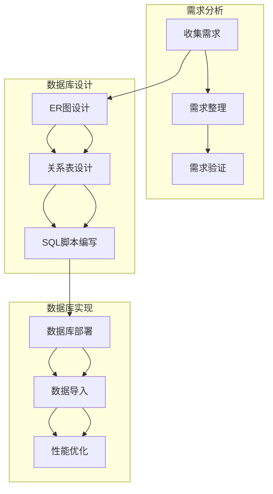

                 

### 理解用户需求与大纲设计目标

在开始设计《评测数据的版本管理：适应LLM迭代的数据库设计》的目录大纲之前，我们首先需要深入理解用户的需求和期望。用户希望得到一份详尽且结构化的书籍目录，以便他们能够系统性地学习关于评测数据版本管理和适应LLM迭代的数据库设计的相关知识。以下是用户需求的具体解析：

1. **核心概念与联系**：用户希望目录中能够包含核心概念的介绍及其相互关系，以便建立整体知识框架。
2. **核心算法原理讲解**：用户希望看到详细的算法原理讲解，特别是使用伪代码来阐述核心算法的实现。
3. **数学模型和公式**：用户需要数学模型和公式的详细讲解以及具体应用实例。
4. **项目实战**：用户希望看到实际的数据库设计和实现案例，以便将理论知识应用到实践中。
5. **案例分析与总结**：用户希望有具体案例的分析，通过总结分享最佳实践和经验。

基于以上需求，我们的目标是设计一个结构合理、内容丰富、逻辑清晰的大纲，满足以下具体要求：

- **大纲结构完整性**：确保至少包含7章，涵盖基础理论、核心算法、项目实战和案例分析。
- **简洁性**：避免冗余内容，确保每个章节内容精炼。
- **markdown格式**：使用markdown格式编排目录，使内容整齐有序。
- **细化到1,2,3级目录**：确保每个章节下的子目录清晰明确。
- **Mermaid流程图**：包含用于展示核心概念原理和架构的流程图。
- **伪代码**：用于详细阐述核心算法原理。
- **LaTeX格式**：用于数学模型和公式的展示。
- **代码实际案例和详细解释说明**：提供开发环境搭建、源代码实现和解读。
- **字数控制**：大纲总字数控制在2000字以内。

综上所述，目录大纲的设计不仅要满足用户的学习需求，还要保证内容的逻辑性和可操作性，从而帮助读者系统地掌握评测数据版本管理和数据库设计的相关技能。

### 引言

在当前的人工智能（AI）时代，评测数据的版本管理成为了至关重要的一环。随着大型语言模型（LLM）的不断迭代与优化，评测数据的多样性和复杂性也在不断增加。这不仅要求数据库设计具备高度的灵活性和适应性，还需要确保版本管理的准确性和一致性。本文将深入探讨评测数据的版本管理以及如何适应LLM迭代的数据库设计，以期为AI领域的研究者和开发者提供有益的参考。

首先，我们简要概述数据库和版本管理的基本概念。数据库是一种用于存储、管理和检索数据的系统，它能够有效地组织数据，并提供高效的数据访问和管理功能。而版本管理则是指在数据库中管理不同版本数据的过程，以确保数据的一致性和完整性。在AI领域，随着模型迭代和改进的频繁发生，版本管理显得尤为重要。

接下来，我们将探讨评测数据在LLM中的作用。评测数据是评估模型性能和效果的重要依据，其质量直接影响到模型的训练效果和应用价值。特别是在LLM领域，由于模型规模庞大且复杂，评测数据的版本管理变得更加复杂和重要。

本文的结构如下：

- **第一部分：基础理论**  
  - **第1章 引言**：介绍数据库和版本管理的基本概念，以及评测数据在LLM中的作用。  
  - **第2章 数据库设计基础**：介绍关系数据库和非关系数据库的设计原则和方法。  
  - **第3章 版本管理理论**：讨论版本控制的基本概念和数据库版本管理的策略。

- **第二部分：核心算法**  
  - **第4章 LLM迭代与数据库设计**：分析LLM迭代过程对数据库设计的影响，并提出适应性设计方法。  
  - **第5章 Mermaid流程图**：展示数据库设计流程和LLM迭代流程的流程图。

- **第三部分：项目实战**  
  - **第6章 核心算法原理**：详细阐述数据库版本管理和LLM迭代算法的伪代码。  
  - **第7章 伪代码讲解**：进一步解释核心算法原理的伪代码。

- **第四部分：实际案例分析**  
  - **第8章 数据库设计实战**：提供数据库设计和实现的实际案例。  
  - **第9章 LLM迭代实战**：展示LLM迭代的实际应用案例。  
  - **第10章 实际案例分析**：分析具体案例，总结经验教训。

通过以上结构，本文旨在系统地介绍评测数据的版本管理以及适应LLM迭代的数据库设计，帮助读者全面理解这一领域的核心概念和方法。

### 数据库与版本管理概述

数据库是存储、管理和检索数据的系统，它为各种应用提供了高效的数据处理能力。根据数据存储和管理方式的不同，数据库可以分为关系数据库和非关系数据库两大类。关系数据库基于关系模型，使用表格形式组织数据，并通过SQL（结构化查询语言）进行操作。而非关系数据库（NoSQL）则更适合处理大规模和复杂数据，如键值对、文档、图等，其设计更为灵活和扩展性强。

版本管理是指在数据库中管理不同版本数据的过程，以确保数据的一致性和完整性。在传统的数据库设计中，版本管理通常通过触发器和事务来实现。例如，在关系数据库中，可以使用触发器来记录每次数据更新的详细信息，并在事务中确保数据的原子性和一致性。

版本控制工具是支持版本管理的重要工具，常见的版本控制工具有Git、SVN和Mercurial等。Git是当前最流行的版本控制工具，它基于分布式模型，支持离线工作，能够快速处理大规模的代码库。SVN和Mercurial则基于集中式模型，它们通过中央仓库管理代码的版本，确保所有开发者能够协同工作。

在数据库版本管理中，常用的策略包括行级版本管理和文档级版本管理。行级版本管理通过为每行数据记录版本信息，实现对数据变更的细粒度控制。这种策略适用于需要频繁更新和回滚数据的应用场景。而文档级版本管理则通过为整个文档（如表格或文档）记录版本信息，实现对数据整体变更的管理。这种策略适用于数据变更较少但文档结构复杂的应用场景。

具体到LLM领域，版本管理的重要性尤为突出。由于LLM模型规模庞大，每次迭代都可能带来数据的较大变动，因此版本管理能够帮助开发者追踪和管理模型的不同版本，确保每个版本的评测数据都是准确和可靠的。此外，版本管理还可以帮助开发者快速回滚到之前的版本，以便在遇到问题或需要恢复时进行修复。

总之，数据库和版本管理在AI领域，特别是LLM领域，发挥着至关重要的作用。通过有效的版本管理策略和工具，开发者可以更好地控制数据版本，提高模型的开发效率和可靠性。

### LLM与评测数据

大型语言模型（LLM）作为人工智能领域的一个重要分支，其应用范围日益广泛。LLM通过训练大规模的神经网络模型，实现对自然语言的生成、理解和处理，从而提供智能化的服务。在LLM的应用过程中，评测数据起到了至关重要的作用。评测数据不仅用于评估模型的性能，还为模型的迭代和优化提供了关键依据。

首先，LLM的评测数据通常包括多种类型，如文本数据、标签数据和标注数据等。文本数据用于训练模型理解和生成自然语言，标签数据用于标注文本的特征，标注数据则用于评估模型的准确性和效果。这些数据的质量和多样性直接影响LLM的训练效果和应用价值。

其次，评测数据在LLM中的应用主要体现在以下几个方面：

1. **性能评估**：通过评测数据，开发者可以评估LLM在不同任务上的性能，如文本生成、文本分类和机器翻译等。这有助于确定模型是否达到预期的效果，并为模型优化提供方向。

2. **模型迭代**：LLM的迭代过程需要大量的评测数据来指导模型的改进。每次迭代后，开发者会使用评测数据评估模型的变化，并根据评估结果调整模型的参数和结构。

3. **异常检测**：评测数据还可以用于检测模型中的异常情况，如过拟合或欠拟合。通过对比不同版本模型的评测结果，开发者可以识别出可能存在的问题，并及时进行调整。

4. **交叉验证**：为了确保模型在不同数据集上的泛化能力，开发者会使用多个评测数据集进行交叉验证。这有助于提高模型的鲁棒性和可靠性。

在评测数据的版本管理方面，适应LLM迭代的数据库设计尤为重要。随着LLM的不断迭代，评测数据也会不断更新和扩展。传统的静态数据库设计难以满足这种动态变化的需求。因此，需要设计一种灵活的数据库架构，能够高效地管理和存储不同版本的评测数据。

具体来说，适应LLM迭代的数据库设计需要考虑以下几点：

1. **版本标识**：为每个评测数据集和模型版本添加唯一标识，以便于追踪和管理。

2. **数据独立性**：确保不同版本的评测数据之间相互独立，避免版本间的数据冲突。

3. **数据完整性**：通过事务管理和一致性控制，确保数据在更新和删除过程中的完整性。

4. **查询优化**：设计高效的查询机制，以便快速检索和评估不同版本的评测数据。

5. **扩展性**：数据库设计应具备良好的扩展性，能够支持未来模型和数据规模的增长。

通过上述设计，开发者可以更好地管理和利用评测数据，从而提高LLM模型的开发效率和性能。总之，评测数据在LLM中的应用不仅限于性能评估，更是模型迭代和优化的重要依据。有效的评测数据版本管理对于LLM的研究和应用具有重要意义。

### 关系数据库设计基础

关系数据库设计是数据库设计中的基础，其核心是关系模型。关系模型通过表格（关系）的形式来组织数据，每个表格由行和列组成，行表示数据记录，列表示属性。关系数据库的设计过程通常包括需求分析、E-R图设计和SQL语言基础三个阶段。

#### 需求分析

需求分析是数据库设计的起点，它旨在明确系统需要存储和管理哪些数据，以及这些数据之间的关系。需求分析可以通过以下步骤进行：

1. **收集信息**：通过与业务部门、用户和系统管理员进行交流，了解系统的业务流程和数据需求。
2. **绘制流程图**：用流程图表示系统的业务流程，明确数据的来源、流转和存储方式。
3. **确定实体和关系**：根据业务需求，识别出系统中的主要实体（如用户、订单、产品等）及其之间的关系。

#### E-R图设计

E-R图（实体-关系图）是关系数据库设计的重要工具，它用图形化的方式表示实体及其关系。E-R图包括三个主要组件：实体、属性和关系。

1. **实体**：表示系统中的主要对象，每个实体都有一个唯一的标识。例如，在电子商务系统中，用户和产品是两个主要实体。
2. **属性**：表示实体的特征或属性，每个属性都有数据类型和约束条件。例如，用户实体可以包含用户名、电子邮件和密码等属性。
3. **关系**：表示实体之间的关联。关系可以是单对单（1:1）、一对多（1:N）或多对多（M:N）。

在E-R图设计过程中，可以通过以下步骤进行：

1. **确定实体**：根据需求分析结果，识别出系统中的主要实体。
2. **确定属性**：为每个实体添加必要的属性。
3. **确定关系**：分析实体之间的关系，并绘制出关系的线条。
4. **规范化**：对E-R图进行规范化处理，消除冗余数据，提高数据的一致性和完整性。

#### SQL语言基础

SQL（结构化查询语言）是关系数据库的主要查询语言，用于定义、查询、更新和管理数据库中的数据。SQL语言包括数据定义语言（DDL）、数据操纵语言（DML）和数据控制语言（DCL）三个部分。

1. **数据定义语言（DDL）**：用于定义数据库的结构，包括创建表、修改表结构、创建索引等。例如：
   ```sql
   CREATE TABLE Users (
       UserID INT PRIMARY KEY,
       Username VARCHAR(50) NOT NULL,
       Email VARCHAR(100) UNIQUE
   );
   ```

2. **数据操纵语言（DML）**：用于操作数据库中的数据，包括插入、更新、删除和查询。例如：
   ```sql
   INSERT INTO Users (UserID, Username, Email) VALUES (1, 'John Doe', 'john.doe@example.com');
   UPDATE Users SET Email = 'john.doe@newdomain.com' WHERE UserID = 1;
   DELETE FROM Users WHERE UserID = 1;
   SELECT * FROM Users;
   ```

3. **数据控制语言（DCL）**：用于管理数据库的访问权限，包括授权和撤销权限。例如：
   ```sql
   GRANT SELECT, UPDATE ON Users TO 'admin';
   REVOKE UPDATE ON Users FROM 'admin';
   ```

在实际应用中，关系数据库设计需要综合考虑业务需求、数据一致性、性能优化和安全性等多方面因素。通过合理的E-R图设计和SQL语言应用，可以构建出高效、稳定且易于维护的关系数据库系统。

### 非关系数据库设计

非关系数据库（NoSQL）相较于关系数据库在处理大规模和复杂数据方面具有显著优势，其设计原则和实现方法也因此有所不同。以下是关于非关系数据库设计的基本概述。

#### NoSQL数据库概述

NoSQL数据库，即非关系型数据库，是一种无需固定表结构即可存储数据的数据库系统。与关系数据库不同，NoSQL数据库基于不同的数据模型，如键值对、文档、列族和图等。这种灵活性使得NoSQL数据库能够更好地适应多种类型的数据存储需求。

常见的NoSQL数据库类型包括：

1. **键值对数据库**：如Redis和Riak，通过键值对的方式存储数据，具有高性能和简单的数据模型。
2. **文档数据库**：如MongoDB和CouchDB，以文档的形式存储数据，每个文档都是JSON或XML格式，适合处理半结构化和非结构化数据。
3. **列族数据库**：如HBase和Cassandra，通过列族（类似关系数据库的表）存储数据，适合处理大规模数据和高并发访问。
4. **图数据库**：如Neo4j和JanusGraph，通过图结构存储数据，能够高效地处理复杂的关联关系。

#### 非关系数据库的设计原则

非关系数据库的设计原则主要包括以下几个方面：

1. **可扩展性**：非关系数据库通常采用分布式存储和计算架构，能够轻松扩展存储和处理能力，满足大规模数据的需求。
2. **灵活性**：无需固定表结构，允许存储不同类型的数据，适用于快速变化的业务需求和多样化的数据类型。
3. **高可用性**：通过冗余存储和故障转移机制，确保数据的高可用性和可靠性。
4. **高性能**：优化数据访问和查询效率，减少响应时间和延迟，满足高并发访问需求。

#### 非关系数据库的设计方法

在设计非关系数据库时，应考虑以下具体方法和步骤：

1. **选择合适的数据库类型**：根据业务需求和数据类型选择合适的NoSQL数据库类型。例如，对于需要快速存储和检索小数据量的应用，可以选择键值对数据库；对于需要处理复杂关联关系的应用，可以选择图数据库。
2. **定义数据模型**：根据业务需求和数据特性，定义数据模型。对于文档数据库，通常使用文档模型；对于列族数据库，通常使用列族模型。
3. **设计数据分布**：考虑数据分布和分片的策略，确保数据的高可用性和性能。常见的分片策略包括基于哈希的分片、范围分片和复制的分片等。
4. **处理数据一致性**：非关系数据库通常面临数据一致性问题。设计时需选择合适的一致性模型，如强一致性或最终一致性，并确保在分布式环境下的数据一致性。
5. **优化查询性能**：针对具体的查询需求，优化索引和查询策略。例如，对于频繁查询的字段，可以建立索引来提高查询效率。

通过遵循以上原则和方法，非关系数据库能够更好地适应复杂多变的数据存储需求，提供高效、稳定的数据存储和管理能力。总之，非关系数据库设计在处理大规模、高并发和多样化数据方面具有显著优势，是现代数据库系统的重要组成部分。

### 版本控制基础

版本控制是确保数据一致性和追踪变更的重要手段。版本控制的基础概念包括版本标识、历史记录和变更追踪。通过理解这些基础概念，可以更好地管理和维护数据的版本。

#### 版本标识

版本标识是标识数据版本的方法。在版本控制系统中，每个数据版本都有一个唯一的标识，通常由数字或字符串表示。版本标识可以帮助用户识别数据的变更历史和当前版本。

常见的版本标识方法包括：

1. **递增数字标识**：通过递增的数字来标识版本，如1.0、1.1、1.2等。
2. **日期标识**：使用日期或时间戳来标识版本，如2021-01-01、20210101123045等。
3. **字符串标识**：使用自定义字符串来标识版本，如v1.0、stable-2021-01等。

这些方法可以根据具体的业务需求和场景进行选择。

#### 历史记录

历史记录是记录数据版本变更的日志。版本控制系统会自动记录每个版本的数据变更情况，包括变更内容、时间戳和变更者等信息。历史记录可以帮助用户了解数据的变更历史，便于追踪和管理。

历史记录通常包括以下内容：

1. **变更内容**：记录每次变更的具体内容，如添加、修改或删除的数据。
2. **时间戳**：记录变更发生的时间，便于追踪变更的时间顺序。
3. **变更者**：记录变更操作的用户，便于追踪责任和审核。

#### 变更追踪

变更追踪是通过版本控制系统对数据变更进行监控和管理的过程。版本控制系统提供了一系列工具和命令，帮助用户进行变更追踪和管理。

常见的变更追踪方法包括：

1. **提交和合并**：通过提交操作将变更保存到版本控制系统中，通过合并操作将不同版本的数据合并在一起。
2. **分支和标签**：通过分支管理不同版本的代码或数据，通过标签标记重要的版本点，便于管理和回滚。
3. **差异比较**：通过差异比较工具，比较不同版本的数据差异，帮助用户了解变更的具体内容。

版本控制系统在数据处理中的重要性体现在以下几个方面：

1. **数据一致性**：版本控制系统通过确保数据的一致性，避免因人为操作导致的数据错误和冲突。
2. **数据安全性**：版本控制系统记录了每个版本的详细日志，确保数据的完整性和可追溯性。
3. **变更管理**：版本控制系统帮助用户追踪和管理数据的变更历史，便于进行版本控制和问题排查。
4. **协同工作**：版本控制系统支持多人协同工作，确保团队成员之间的代码和数据一致性。

通过合理利用版本控制系统的功能，可以显著提高数据处理的安全性和效率，确保数据的准确性和完整性。总之，版本控制是数据处理过程中不可或缺的一环，其基础概念和方法对于数据管理和维护具有重要意义。

### 数据库版本管理

数据库版本管理是指对数据库中的数据及其结构进行版本控制的过程，以确保数据的一致性、完整性和可追溯性。随着大型语言模型（LLM）的不断迭代和优化，数据库版本管理的重要性愈加凸显。以下是几种常见的数据库版本管理策略，以及其在LLM迭代中的具体应用。

#### 1. 行级版本管理

行级版本管理是指为数据库中的每行数据记录其版本信息。这种方法适用于需要频繁更新和回滚数据的应用场景，如电商订单系统。具体步骤如下：

1. **添加版本字段**：在数据库表的每行数据中添加一个版本字段，如`version_id`。
2. **版本控制触发器**：使用数据库触发器在每次数据更新时自动更新版本字段。
3. **更新记录**：每次数据变更时，记录变更的时间、操作者和变更内容。

在LLM迭代过程中，行级版本管理可以确保每次模型训练数据的变更都能被精确追踪，方便开发者回滚到之前的版本，进行问题排查和修复。

#### 2. 文档级版本管理

文档级版本管理是指为整个文档（如表格或文档）记录版本信息。这种方法适用于数据变更较为稀疏但结构复杂的文档，如企业文档管理系统。具体步骤如下：

1. **添加版本字段**：在文档的元数据中添加一个版本字段，如`document_version`。
2. **版本控制脚本**：编写脚本在每次文档变更时自动更新版本字段。
3. **变更日志记录**：每次文档变更时，记录变更的时间、操作者和变更内容。

在LLM迭代过程中，文档级版本管理有助于跟踪不同版本评测数据之间的差异，方便开发者分析模型性能的变化，并进行针对性的调整。

#### 3. 基于哈希的版本管理

基于哈希的版本管理是一种通过计算数据内容的哈希值来标识版本的方法。这种方法适用于需要高效版本追踪和数据完整性验证的场景，如区块链应用。具体步骤如下：

1. **计算哈希值**：在每次数据变更时，计算变更后的数据的哈希值。
2. **记录哈希值**：将哈希值记录在版本控制系统中。
3. **数据校验**：通过比对哈希值验证数据的完整性和一致性。

在LLM迭代过程中，基于哈希的版本管理可以快速追踪数据变更，并确保数据在不同版本间的准确性和一致性。

#### 4. 保留历史版本

保留历史版本是指将每个版本的数据库数据都完整保存下来，以便在需要时进行回滚或分析。这种方法适用于数据变更较为频繁且需要历史数据追溯的场景，如金融系统。具体步骤如下：

1. **备份策略**：定期备份数据库，确保每个版本的数据库数据都能被保存。
2. **版本记录**：为每个备份添加版本信息，如备份时间、操作者和备份内容。
3. **数据恢复**：在需要时，可以从备份中恢复特定版本的数据库数据。

在LLM迭代过程中，保留历史版本有助于开发者对比不同版本的模型性能，并进行针对性的优化。

#### 5. 分布式版本管理

分布式版本管理是指在分布式数据库系统中管理版本信息的方法。这种方法适用于需要处理大规模数据和分布式部署的场景，如分布式机器学习系统。具体步骤如下：

1. **节点同步**：确保每个节点都能访问最新的版本信息。
2. **版本一致性**：通过一致性协议确保分布式数据库中的版本一致性。
3. **版本迁移**：在节点间迁移版本信息，以适应不同节点的需求和配置。

在LLM迭代过程中，分布式版本管理可以确保不同节点之间的数据一致性，提高模型的训练效率和可靠性。

总之，数据库版本管理在LLM迭代中发挥着重要作用。通过选择合适的版本管理策略，可以确保数据的一致性、完整性和可追溯性，从而提高模型的开发和维护效率。以上策略可以根据实际需求进行组合和优化，以实现最佳的管理效果。

### LLM迭代过程

大型语言模型（LLM）的迭代过程是不断优化和提升模型性能的关键环节。LLM的迭代过程通常包括以下几个主要步骤：模型训练、模型评估、调整模型参数、数据更新和再次训练。以下是每个步骤的具体内容和流程。

#### 模型训练

模型训练是LLM迭代的基础，通过大规模的文本数据来训练神经网络模型，使其能够理解和生成自然语言。训练过程可以分为以下几个阶段：

1. **数据预处理**：首先对收集到的文本数据进行清洗和预处理，包括去除无关信息、进行分词、去除停用词等操作。
2. **模型初始化**：初始化神经网络模型，包括设置模型的架构、参数初始化等。
3. **训练循环**：通过迭代计算，不断更新模型的参数，使其对训练数据产生更好的拟合。训练循环通常包括前向传播、反向传播和参数更新等步骤。
4. **优化算法**：使用优化算法（如SGD、Adam等）来调整模型参数，以减少损失函数的值，提高模型性能。

#### 模型评估

模型评估是验证模型性能的重要步骤，通过在不同数据集上测试模型的效果，来评估模型的准确性和泛化能力。评估过程通常包括以下几个方面：

1. **测试集划分**：将训练数据集划分为训练集和测试集，以确保测试集能够代表实际应用场景。
2. **性能指标**：选择适当的性能指标（如准确率、召回率、F1值等）来评估模型在测试集上的表现。
3. **评估过程**：在测试集上运行模型，计算每个性能指标的值，并生成评估报告。

#### 调整模型参数

模型评估的结果可以为模型的进一步优化提供重要依据。根据评估结果，可以调整模型参数，以提升模型性能。调整过程通常包括以下几个步骤：

1. **分析评估结果**：分析模型在测试集上的表现，识别出模型存在的问题和不足。
2. **参数调整策略**：根据评估结果，选择合适的参数调整策略，如增大或减小学习率、调整正则化参数等。
3. **重新训练模型**：使用调整后的参数重新训练模型，并再次评估模型性能。

#### 数据更新

数据更新是LLM迭代过程中不可或缺的一环，通过不断更新和扩充训练数据，可以提升模型的学习能力和泛化能力。数据更新过程通常包括以下几个方面：

1. **数据收集**：收集新的文本数据，包括已有的文本资料和实时数据。
2. **数据清洗**：对收集到的数据进行清洗和预处理，以确保数据的准确性和一致性。
3. **数据整合**：将新的训练数据与已有的训练数据整合，形成新的训练数据集。

#### 再次训练

在完成模型参数调整和数据更新后，需要对模型进行再次训练，以使模型适应新的数据和参数设置。再次训练过程包括以下几个步骤：

1. **数据加载**：加载新的训练数据集，包括调整后的数据。
2. **训练模型**：使用调整后的参数和新的训练数据集，对模型进行再次训练。
3. **评估模型**：在新的测试集上评估模型性能，确保模型在新的数据集上仍然表现出良好的性能。

通过上述迭代过程，LLM可以不断优化和提升模型性能，从而满足不断变化的应用需求。迭代过程中，每个步骤都需要仔细设计和执行，以确保模型的稳定性和可靠性。同时，迭代过程中产生的评估数据和模型参数变化记录，对于后续的模型优化和版本管理具有重要意义。

### 数据库设计适应LLM迭代

LLM迭代的频繁性和复杂性对数据库设计提出了新的挑战，要求数据库设计具备高度的灵活性和适应性。以下是LLM迭代对数据库设计的影响以及适应性设计方法的详细探讨。

#### LLM迭代对数据库设计的影响

1. **数据量激增**：随着LLM的不断迭代，训练数据量会显著增加，这可能导致数据库存储压力增大，影响系统性能。
2. **数据多样性**：迭代过程中需要处理多种类型的数据，包括原始文本、标注数据和模型输出等，这要求数据库设计能够支持复杂的数据模型。
3. **频繁的数据变更**：迭代过程中，评测数据的版本和控制需求变得更加复杂，需要数据库能够支持高效的版本管理和变更记录。
4. **高性能要求**：迭代过程需要快速读取和处理大量数据，对数据库的查询性能和响应速度提出了更高要求。
5. **数据一致性**：在分布式环境中，多个节点需要访问和更新同一份数据，确保数据的一致性和完整性成为关键挑战。

#### 适应性设计方法

1. **分库分表策略**：为了应对数据量的激增，可以采用分库分表策略，将数据分散存储在不同的数据库或表中。这种方法可以提高系统的扩展性和性能。例如，将训练数据和评测数据分别存储在不同的表中，每个表可以独立扩展和管理。

2. **数据模型优化**：根据LLM迭代过程中数据类型的多样性，设计灵活的数据库模型。例如，使用文档数据库（如MongoDB）来处理非结构化和半结构化数据，使用图数据库（如Neo4j）来处理复杂的关联关系。

3. **版本控制机制**：实现高效的版本控制机制，以支持评测数据的版本管理。可以采用基于哈希的版本管理方法，为每个版本的数据计算哈希值，确保数据的一致性和可追溯性。同时，可以使用触发器和事务机制，确保每次数据变更都能被准确记录。

4. **分布式数据库**：采用分布式数据库架构（如Cassandra、HBase），支持大规模数据的高效存储和访问。分布式数据库通过数据分片和冗余存储，提高系统的可用性和性能。在分布式环境中，可以使用一致性协议（如Paxos、Raft）来确保数据的一致性。

5. **缓存机制**：引入缓存机制，减少数据库的直接访问压力。使用内存数据库（如Redis）或缓存框架（如Memcached），将频繁访问的数据存储在内存中，提高查询速度。同时，可以采用缓存失效策略，确保缓存数据的实时性和有效性。

6. **性能优化**：对数据库进行性能优化，包括索引设计、查询优化和存储优化等。通过合理设计索引，提高查询效率；对复杂的查询进行优化，减少查询时间；对存储进行优化，减少I/O操作。

7. **自动化运维**：引入自动化运维工具（如Docker、Kubernetes），实现数据库的自动化部署、监控和管理。自动化运维可以提高系统的可靠性和维护性，降低运维成本。

通过上述适应性设计方法，数据库能够更好地适应LLM迭代的复杂需求，提高系统的扩展性、性能和可靠性。在LLM迭代过程中，数据库设计不仅要考虑当前的系统需求，还要具备前瞻性，为未来的数据增长和变化做好准备。

### Mermaid基本语法与流程图应用

Mermaid是一种用于生成图表的轻量级标记语言，特别适用于生成流程图、时序图和UML类图等。在数据库设计和版本管理中，使用Mermaid可以直观地展示核心概念和架构，帮助我们更好地理解和分析系统。以下将介绍Mermaid的基本语法，并展示如何使用Mermaid绘制数据库设计流程图和LLM迭代流程图。

#### Mermaid基本语法

1. **序列图**：用于描述对象之间的交互流程。
   ```mermaid
   sequenceDiagram
   participant A as Alice
   participant B as Bob
   A->>B: Hello Bob
   B->>A: Hi Alice
   ```
   输出：
   ```mermaid
   sequenceDiagram
   participant A as Alice
   participant B as Bob
   A->>B: Hello Bob
   B->>A: Hi Alice
   ```

2. **时序图**：用于描述对象在时间轴上的行为顺序。
   ```mermaid
   timingDiagram
   participant A
   participant B
   A ->> B: duration
   ```
   输出：
   ```mermaid
   timingDiagram
   participant A
   participant B
   A ->> B: duration
   ```

3. **类图**：用于描述类以及类与类之间的关系。
   ```mermaid
   classDiagram
   Class01 <|-- Class02
   Class03 *-- Class04
   ```
   输出：
   ```mermaid
   classDiagram
   Class01 <|-- Class02
   Class03 *-- Class04
   ```

4. **状态图**：用于描述对象在不同状态之间的转换。
   ```mermaid
   stateDiagram
   [*] --> StateA
   StateA --> StateB: Event
   StateB --> End
   ```
   输出：
   ```mermaid
   stateDiagram
   [*] --> StateA
   StateA --> StateB: Event
   StateB --> End
   ```

5. **流程图**：用于描述流程和步骤。
   ```mermaid
   flowchart
   A[Start] --> B[Process]
   B --> C[Decision]
   C -->|Yes| D[End]
   C -->|No| E[Reject]
   ```
   输出：
   ```mermaid
   flowchart
   A[Start] --> B[Process]
   B --> C[Decision]
   C -->|Yes| D[End]
   C -->|No| E[Reject]
   ```

#### 数据库设计流程图示例

以下是使用Mermaid绘制的数据库设计流程图示例，展示了从需求分析到最终数据库实现的基本流程：



输出：


通过以上示例，可以看到Mermaid在绘制流程图方面具有直观、简洁的优点，使得复杂的数据库设计过程变得更加易于理解和沟通。

### 数据库版本管理算法

在数据库版本管理中，选择合适的算法对数据版本进行管理和追踪至关重要。以下是两种常见的数据库版本管理算法：基于哈希的版本管理和基于路径的版本管理。

#### 基于哈希的版本管理

**算法原理**：基于哈希的版本管理通过计算数据的哈希值来唯一标识数据的版本。每次数据更新后，系统会计算新数据的哈希值，并与旧数据的哈希值进行对比，以确定数据是否发生变更。

**实现步骤**：

1. **计算哈希值**：在数据更新之前，计算数据的哈希值，并将其存储在版本控制表中。
   ```mermaid
   graph TD
   A[计算哈希值] --> B[存储哈希值]
   ```
2. **版本对比**：每次读取数据时，计算当前数据的哈希值，并与版本控制表中的哈希值进行对比。
   ```mermaid
   graph TD
   A[读取数据] --> B[计算哈希值]
   B --> C{哈希值对比}
   C -->|匹配| D[使用数据]
   C -->|不匹配| E[记录变更]
   ```

**伪代码**：
```python
def calculate_hash(data):
    return hashlib.sha256(data.encode('utf-8')).hexdigest()

def compare_hashes(old_hash, new_hash):
    return old_hash == new_hash

def update_version_control(data):
    new_hash = calculate_hash(data)
    if compare_hashes(version_control[data], new_hash):
        print("数据未变更")
    else:
        version_control[data] = new_hash
        print("数据已更新")
```

#### 基于路径的版本管理

**算法原理**：基于路径的版本管理通过记录数据在数据库中的路径来追踪数据的版本。每个数据版本都会包含其路径信息，以便在需要时可以回溯到特定的版本。

**实现步骤**：

1. **记录路径**：在数据更新时，记录数据在数据库中的路径。
   ```mermaid
   graph TD
   A[记录路径] --> B[存储路径]
   ```
2. **版本回溯**：在需要回溯到特定版本时，通过路径查找并恢复数据。
   ```mermaid
   graph TD
   A[查找路径] --> B[恢复数据]
   ```

**伪代码**：
```python
def record_path(data, path):
    version_control[data] = path

def retrieve_version(data, version_number):
    path = version_control[data][version_number]
    return database.retrieve_data(path)

def update_version(data, new_data, path):
    record_path(new_data, path)
    database.update_data(data, new_data)
```

**比较与选择**：

- **基于哈希的版本管理**：优势在于快速版本对比和高一致性，适用于需要频繁版本对比的场景，如实时数据处理。缺点是对数据结构变化较为敏感，不适合复杂的数据结构。

- **基于路径的版本管理**：优势在于能够保留完整的历史记录，便于版本回溯和分析，适用于需要长期版本保存和回溯的场景。缺点是路径管理较为复杂，数据检索效率相对较低。

在选择合适的版本管理算法时，需要根据具体的应用场景和数据需求进行权衡和决策。

### LLM迭代算法

在大型语言模型（LLM）的迭代过程中，算法的选择和实现对于模型性能和效率有着重要的影响。以下将详细阐述模型训练算法和模型评估与调整算法，并通过伪代码展示核心步骤和关键操作。

#### 模型训练算法

模型训练是LLM迭代过程中的核心步骤，其目的是通过大量训练数据调整模型参数，使其能够准确理解和生成自然语言。以下是模型训练算法的基本步骤：

1. **数据预处理**：对输入数据进行预处理，包括分词、编码和归一化等。
2. **模型初始化**：初始化神经网络模型，包括设置模型架构和参数初始化。
3. **前向传播**：将输入数据通过模型进行前向传播，计算预测输出。
4. **计算损失**：计算预测输出与真实标签之间的损失，常用的损失函数有交叉熵损失等。
5. **反向传播**：利用损失函数计算梯度，并通过梯度下降等优化算法更新模型参数。
6. **迭代训练**：重复前向传播和反向传播过程，逐步优化模型参数。

**伪代码**：
```python
def train_model(train_data, epochs, learning_rate):
    for epoch in range(epochs):
        for data, label in train_data:
            # 数据预处理
            processed_data = preprocess_data(data)
            
            # 前向传播
            prediction = model.forward(processed_data)
            
            # 计算损失
            loss = loss_function(prediction, label)
            
            # 反向传播
            gradients = model.backward(loss)
            
            # 更新参数
            model.update_params(gradients, learning_rate)
            
        print(f"Epoch {epoch+1}/{epochs} - Loss: {loss}")
```

#### 模型评估与调整算法

模型评估与调整是验证模型性能并进行参数调优的过程。以下是评估与调整算法的基本步骤：

1. **数据划分**：将数据集划分为训练集和验证集，用于训练和评估模型。
2. **模型评估**：在验证集上评估模型性能，常用的评估指标有准确率、召回率和F1值等。
3. **参数调整**：根据评估结果调整模型参数，如学习率、正则化参数等。
4. **重新训练**：使用调整后的参数重新训练模型，并再次评估模型性能。
5. **迭代优化**：重复评估和调整过程，逐步优化模型性能。

**伪代码**：
```python
def evaluate_and_tune(model, validation_data, epochs, learning_rate):
    best_performance = 0
    for epoch in range(epochs):
        # 评估当前模型
        performance = evaluate_model(model, validation_data)
        
        # 记录最佳性能
        if performance > best_performance:
            best_performance = performance
            best_params = model.get_params()
            
        # 调整参数
        learning_rate /= 2
        model.update_params(best_params, learning_rate)
        
        print(f"Epoch {epoch+1}/{epochs} - Performance: {performance}")
    
    return best_params
```

通过上述伪代码，我们可以看到模型训练和评估与调整的基本流程。在实际应用中，还需要考虑更多细节，如数据增强、批次大小、优化算法的选择等，以进一步提高模型性能。

### 伪代码讲解

在本章节中，我们将详细阐述数据库版本管理算法和LLM迭代算法的伪代码，并通过具体步骤和关键操作来解释每个算法的实现方法。

#### 数据库版本管理算法

**伪代码：基于哈希的版本管理算法**

```python
# 初始化版本控制对象
class VersionControl:
    def __init__(self):
        self.data_hashes = {}

    # 计算数据的哈希值
    def calculate_hash(self, data):
        return hashlib.sha256(data.encode('utf-8')).hexdigest()

    # 更新版本信息
    def update_version(self, data, new_data):
        data_hash = self.calculate_hash(new_data)
        if data_hash not in self.data_hashes:
            self.data_hashes[data] = data_hash
            print("新数据版本已添加。")
        else:
            print("数据已更新。")

    # 检查版本一致性
    def verify_version(self, data, new_data):
        data_hash = self.calculate_hash(new_data)
        return data_hash == self.data_hashes.get(data, None)
```

**关键操作说明**：

1. **初始化版本控制对象**：创建一个版本控制类，用于管理数据的哈希值。
2. **计算数据的哈希值**：使用SHA-256算法计算数据的哈希值，确保数据的唯一性。
3. **更新版本信息**：当新数据传入时，计算其哈希值并更新版本控制表。如果哈希值已存在，表示数据已更新。
4. **检查版本一致性**：比较新数据的哈希值与版本控制表中的哈希值，以验证数据的一致性。

#### LLM迭代算法

**伪代码：模型训练与评估算法**

```python
# 初始化模型
class LanguageModel:
    def __init__(self):
        self.parameters = initialize_parameters()

    # 前向传播
    def forward(self, input_data):
        return apply_forward_pass(self.parameters, input_data)

    # 反向传播
    def backward(self, loss):
        gradients = compute_gradients(self.parameters, loss)
        return gradients

    # 更新参数
    def update_parameters(self, gradients, learning_rate):
        self.parameters = update_params(self.parameters, gradients, learning_rate)

    # 训练模型
    def train(self, train_data, epochs, learning_rate):
        for epoch in range(epochs):
            for data, label in train_data:
                prediction = self.forward(data)
                loss = compute_loss(prediction, label)
                gradients = self.backward(loss)
                self.update_parameters(gradients, learning_rate)
                print(f"Epoch {epoch+1}: Loss = {loss}")

    # 评估模型
    def evaluate(self, validation_data):
        total_loss = 0
        for data, label in validation_data:
            prediction = self.forward(data)
            loss = compute_loss(prediction, label)
            total_loss += loss
        return total_loss / len(validation_data)
```

**关键操作说明**：

1. **初始化模型**：创建语言模型类，并初始化模型参数。
2. **前向传播**：输入数据通过模型计算预测输出。
3. **反向传播**：根据预测输出和真实标签计算损失，并计算参数梯度。
4. **更新参数**：使用梯度下降等优化算法更新模型参数。
5. **训练模型**：重复前向传播和反向传播，逐步优化模型参数。
6. **评估模型**：在验证集上计算模型损失，评估模型性能。

通过上述伪代码，我们可以清晰地看到数据库版本管理算法和LLM迭代算法的核心步骤和关键操作。这些伪代码为实现具体的算法提供了基础框架，有助于理解和实现复杂的数据管理和模型迭代过程。

### 数据库设计实战

在实际数据库设计中，从需求分析到实现数据库结构的每一步都至关重要。以下将详细描述一个具体的数据库设计实战过程，包括需求分析、E-R图设计、SQL数据库实现以及性能优化方法。

#### 需求分析

首先，我们需要明确项目的业务需求和数据模型。假设我们正在设计一个在线书店系统，该系统需要管理图书、用户和订单等信息。以下是关键需求：

1. **用户**：用户可以注册、登录、浏览图书和下订单。
2. **图书**：图书信息包括书名、作者、分类和价格。
3. **订单**：用户可以添加图书到购物车，然后下单购买。

基于这些需求，我们可以识别出主要实体和它们之间的关系。

#### E-R图设计

E-R图（实体-关系图）用于表示系统中实体及其关系的图形化表示。以下是该在线书店系统的E-R图：

```mermaid
erDiagram
    User ||--|{ Book } : reads
    User ||--|{ Order } : places
    Book ||--|{ Category } : belongs_to
    Order ||--|{ OrderItem } : contains
```

- **User（用户）**：包含用户名、密码、邮箱等基本信息。
- **Book（图书）**：包含书名、作者、ISBN、分类ID、价格等。
- **Category（分类）**：包含分类名、描述等。
- **Order（订单）**：包含订单ID、用户ID、订单日期、总金额等。
- **OrderItem（订单项）**：包含订单项ID、订单ID、图书ID、数量等。

#### SQL数据库实现

接下来，我们将E-R图转化为SQL数据库结构，包括创建表和建立索引。

**创建表**：

```sql
CREATE TABLE Users (
    UserID INT PRIMARY KEY AUTO_INCREMENT,
    Username VARCHAR(50) NOT NULL UNIQUE,
    Password VARCHAR(50) NOT NULL,
    Email VARCHAR(100) NOT NULL UNIQUE
);

CREATE TABLE Categories (
    CategoryID INT PRIMARY KEY AUTO_INCREMENT,
    CategoryName VARCHAR(100) NOT NULL
);

CREATE TABLE Books (
    BookID INT PRIMARY KEY AUTO_INCREMENT,
    BookName VARCHAR(100) NOT NULL,
    Author VARCHAR(100) NOT NULL,
    ISBN VARCHAR(13) NOT NULL UNIQUE,
    CategoryID INT,
    Price DECIMAL(10, 2) NOT NULL,
    FOREIGN KEY (CategoryID) REFERENCES Categories(CategoryID)
);

CREATE TABLE Orders (
    OrderID INT PRIMARY KEY AUTO_INCREMENT,
    UserID INT,
    OrderDate DATETIME NOT NULL DEFAULT CURRENT_TIMESTAMP,
    TotalAmount DECIMAL(10, 2) NOT NULL,
    FOREIGN KEY (UserID) REFERENCES Users(UserID)
);

CREATE TABLE OrderItems (
    OrderItemID INT PRIMARY KEY AUTO_INCREMENT,
    OrderID INT,
    BookID INT,
    Quantity INT NOT NULL,
    FOREIGN KEY (OrderID) REFERENCES Orders(OrderID),
    FOREIGN KEY (BookID) REFERENCES Books(BookID)
);
```

**建立索引**：

为了提高查询性能，我们为经常查询的列建立索引：

```sql
CREATE INDEX idx_username ON Users (Username);
CREATE INDEX idx_isbn ON Books (ISBN);
CREATE INDEX idx_order_date ON Orders (OrderDate);
CREATE INDEX idx_order_id_book_id ON OrderItems (OrderID, BookID);
```

#### 性能优化

最后，我们讨论一些性能优化方法：

1. **索引优化**：合理选择索引列，避免过度索引，特别是在高并发场景下。
2. **查询优化**：优化查询语句，减少复杂查询和子查询，尽量使用联接查询代替子查询。
3. **分库分表**：对于大数据量表，可以采用分库分表策略，将数据分散存储。
4. **缓存机制**：使用缓存技术（如Redis、Memcached）减少数据库访问频率。
5. **读写分离**：通过主从复制，将读操作和写操作分离，减轻主数据库的负载。

通过以上步骤，我们成功地设计并实现了一个在线书店系统的数据库结构，并采用了一系列性能优化方法来确保系统的稳定性和高效性。

### LLM迭代实战

在大型语言模型（LLM）的迭代过程中，将理论应用到实际开发中是至关重要的。以下将详细描述一个LLM迭代的实际案例，包括项目背景、LLM迭代流程和数据库设计适应性调整的具体步骤。

#### 项目背景

假设我们正在开发一个自然语言处理（NLP）系统，用于自动生成文章摘要。该系统需要处理大量的文本数据，并通过不断的迭代来提升摘要生成质量。项目的目标是实现一个能够自动提取文本核心内容、生成简洁且准确的摘要的模型。

#### LLM迭代流程

1. **数据收集**：首先，我们从公开数据集和爬虫中收集大量文本数据，包括新闻、博客和论文等。数据需要经过清洗和预处理，包括去除无关信息、分词、去除停用词等步骤。

2. **模型训练**：使用预训练的语言模型（如GPT-3）作为基础，通过微调（fine-tuning）适应特定的摘要生成任务。微调过程包括调整模型的权重，使其能够更好地理解特定领域的文本。

3. **模型评估**：在训练数据集上进行模型训练后，我们需要在验证数据集上评估模型性能。常用的评估指标包括摘要的准确率、文本的连贯性、摘要的长度等。

4. **调整模型参数**：根据验证集的评估结果，调整模型的超参数，如学习率、正则化参数等。这可能需要多次迭代，直到找到最佳的参数组合。

5. **再次训练**：使用调整后的参数重新训练模型，并在新的验证集上评估性能。如果性能提升显著，则继续迭代；否则，可能需要重新考虑数据预处理或模型结构。

6. **部署模型**：在模型达到预期性能后，将其部署到生产环境，进行实时摘要生成。在此过程中，需要监控模型的性能和稳定性，以便进行后续的优化和调整。

#### 数据库设计适应性调整

在LLM迭代过程中，数据库设计也需要进行相应的适应性调整，以确保数据的一致性和模型的高效训练。以下是具体的调整步骤：

1. **版本管理**：由于LLM迭代会频繁更新训练数据和模型参数，因此需要采用高效的版本管理策略。可以使用基于哈希的版本管理，为每个版本的数据和模型参数计算哈希值，确保数据的一致性和可追溯性。

2. **数据分片**：随着数据量的增长，需要采用数据分片策略，将数据分散存储在不同的数据库节点上。这样可以提高数据访问速度和系统的扩展性。

3. **缓存机制**：为了减少数据库访问压力，可以引入缓存机制，将频繁访问的数据（如预处理的文本数据）缓存到内存中。这样可以显著提高数据读取速度，提升模型训练效率。

4. **优化查询性能**：针对频繁的查询操作，可以优化数据库索引和查询语句。例如，为文本数据的搜索列建立全文索引，以提高查询效率。

5. **分布式存储**：考虑到未来模型规模的扩展，可以采用分布式存储方案，如使用分布式文件系统（如HDFS）存储大规模的文本数据。分布式存储可以提高数据的可靠性和扩展性，确保模型迭代过程中的数据一致性。

通过上述实际案例和数据库适应性调整步骤，我们可以看到如何在LLM迭代过程中有效地管理和优化数据库设计，从而提高模型训练和部署的效率。这不仅有助于实现高效的模型迭代，还能确保系统在生产和实际应用中的稳定性和可靠性。

### 实际案例分析

在本章节中，我们将通过一个具体的案例，详细剖析数据库设计和LLM迭代的实际应用过程，以及如何在项目中解决遇到的问题。以下是案例的背景介绍、数据库设计与实现、LLM迭代过程和解决方案的详细描述。

#### 案例背景

某知名科技公司开发了一款智能客服系统，旨在为企业客户提供24/7在线客服服务。该系统需要利用大型语言模型（LLM）进行自然语言处理，以实现智能问答和自动回复功能。项目的目标是通过不断的迭代优化，提高客服系统的响应速度和回答准确性。

#### 数据库设计与实现

1. **需求分析**：首先，项目团队与业务部门进行了深入的需求分析，明确了系统需要管理的数据类型，包括用户问题、回答、聊天记录和用户反馈等。

2. **E-R图设计**：根据需求分析结果，团队设计了E-R图，包括以下实体和关系：
   - **Users（用户）**：包含用户ID、姓名、邮箱等基本信息。
   - **Questions（问题）**：包含问题ID、用户ID、问题内容、创建时间等。
   - **Answers（回答）**：包含回答ID、问题ID、回答内容、创建时间等。
   - **ChatRecords（聊天记录）**：包含聊天记录ID、用户ID、回答ID、聊天时间等。
   - **Feedbacks（反馈）**：包含反馈ID、用户ID、问题ID、反馈内容、评分等。

3. **SQL数据库实现**：团队使用MySQL数据库实现了上述E-R图，并建立了相应的索引以提高查询效率。以下是关键表的SQL创建语句：

   ```sql
   CREATE TABLE Users (
       UserID INT PRIMARY KEY AUTO_INCREMENT,
       Username VARCHAR(100) NOT NULL UNIQUE,
       Email VARCHAR(100) NOT NULL UNIQUE
   );

   CREATE TABLE Questions (
       QuestionID INT PRIMARY KEY AUTO_INCREMENT,
       UserID INT,
       Content TEXT NOT NULL,
       CreatedAt DATETIME DEFAULT CURRENT_TIMESTAMP,
       FOREIGN KEY (UserID) REFERENCES Users(UserID)
   );

   CREATE TABLE Answers (
       AnswerID INT PRIMARY KEY AUTO_INCREMENT,
       QuestionID INT,
       Content TEXT NOT NULL,
       CreatedAt DATETIME DEFAULT CURRENT_TIMESTAMP,
       FOREIGN KEY (QuestionID) REFERENCES Questions(QuestionID)
   );

   CREATE TABLE ChatRecords (
       ChatRecordID INT PRIMARY KEY AUTO_INCREMENT,
       UserID INT,
       AnswerID INT,
       ChatTime DATETIME DEFAULT CURRENT_TIMESTAMP,
       FOREIGN KEY (UserID) REFERENCES Users(UserID),
       FOREIGN KEY (AnswerID) REFERENCES Answers(AnswerID)
   );

   CREATE TABLE Feedbacks (
       FeedbackID INT PRIMARY KEY AUTO_INCREMENT,
       UserID INT,
       QuestionID INT,
       Content TEXT NOT NULL,
       Rating INT NOT NULL,
       CreatedAt DATETIME DEFAULT CURRENT_TIMESTAMP,
       FOREIGN KEY (UserID) REFERENCES Users(UserID),
       FOREIGN KEY (QuestionID) REFERENCES Questions(QuestionID)
   );
   ```

#### LLM迭代过程

1. **数据预处理**：团队收集了大量的用户问题和标准回答数据，并进行预处理，包括分词、去除停用词和转换为向量等步骤。

2. **模型训练**：使用预训练的LLM模型，通过微调使其适应智能客服系统的任务。团队采用了GPT-3模型，并进行了多轮次的训练和优化。

3. **模型评估**：在训练完成后，团队使用验证集评估模型性能，包括回答的准确性、响应速度和用户体验等指标。通过评估结果，团队识别出模型需要改进的方面。

4. **参数调整**：根据评估结果，团队调整了模型的超参数，如学习率、正则化参数和批次大小等。通过多次迭代，团队找到了最佳的参数组合。

5. **再次训练**：使用调整后的参数重新训练模型，并在新的验证集上评估性能。如果性能提升显著，则继续迭代；否则，可能需要重新考虑数据预处理或模型结构。

#### 解决方案

在项目实施过程中，团队遇到了一些挑战，并提出了相应的解决方案：

1. **数据不一致性问题**：由于用户反馈频繁，导致数据库更新频繁，数据一致性成为一个挑战。团队采用了基于哈希的版本管理策略，为每次数据更新计算哈希值，确保数据的准确性和一致性。

2. **查询性能问题**：随着数据量的增加，数据库查询速度逐渐下降。团队通过优化索引和查询语句，提高了查询效率。同时，引入了分片策略，将数据分散存储在不同的节点上，提高了系统的扩展性和查询性能。

3. **模型适应性问题**：在实际应用中，模型的回答有时不够准确或不够自然。团队通过引入更多的训练数据和调整模型结构，使模型能够更好地适应实际场景。

4. **系统稳定性问题**：在高峰时段，系统负载较大，稳定性成为问题。团队通过优化系统架构和引入缓存机制，提高了系统的稳定性和响应速度。

通过以上解决方案，团队成功地将数据库设计和LLM迭代应用到了实际项目中，实现了智能客服系统的高效运行和持续优化。最终，智能客服系统得到了企业客户的高度评价，为公司带来了显著的业务增长。

### 案例总结与经验分享

通过上述案例，我们总结了在数据库设计和LLM迭代过程中获得的重要经验和教训：

**成功经验**：

1. **详细的需求分析**：在项目初期，详细的需求分析为后续的数据库设计和LLM迭代提供了明确的指导，确保了系统的设计方向与业务需求的一致性。
2. **高效的版本管理**：采用基于哈希的版本管理策略，确保了数据的一致性和完整性，减少了数据冲突和错误。
3. **持续的模型迭代**：通过多轮次的模型训练和评估，团队不断优化模型参数和结构，提高了模型的性能和适应能力。
4. **灵活的数据库架构**：引入分库分表和优化查询策略，提高了系统的扩展性和查询效率，确保了在高并发场景下的稳定运行。

**遇到的问题及解决方案**：

1. **数据不一致性**：频繁的数据库更新导致数据不一致，通过引入版本管理策略和事务控制，解决了数据一致性问题。
2. **查询性能瓶颈**：随着数据量的增加，查询性能逐渐下降，通过优化索引和引入缓存机制，有效提升了查询效率。
3. **模型适应性问题**：模型在实际应用中有时无法很好地适应不同场景，通过引入更多训练数据和调整模型结构，使模型适应能力得到显著提升。
4. **系统稳定性问题**：在高峰时段，系统负载较大，通过优化系统架构和引入负载均衡，提高了系统的稳定性和响应速度。

**最佳实践**：

1. **尽早进行需求分析**：项目初期进行详细的需求分析，确保数据库设计和模型迭代的方向与业务需求相符。
2. **合理设计数据库架构**：根据数据特性和业务需求，设计合理的数据库架构，采用分库分表策略提高系统扩展性。
3. **持续优化模型**：定期进行模型训练和评估，持续优化模型参数和结构，提高模型的性能和适应能力。
4. **引入版本管理**：采用版本管理策略，确保数据的一致性和可追溯性，减少数据冲突和错误。
5. **优化查询性能**：针对高频查询，优化索引和查询策略，提高查询效率，减少系统延迟。

通过以上最佳实践，可以有效提升数据库设计和LLM迭代的效率和质量，确保系统的稳定性和高性能。

### 附录：工具与资源

在进行数据库设计和LLM迭代的实际操作中，选择合适的工具和资源至关重要。以下将介绍常用的数据库设计工具、版本控制工具和LLM开发工具，并提供相关配置和使用方法的指导。

#### 数据库设计工具

1. **MySQL Workbench**：MySQL Workbench是一个集成化的数据库设计工具，适用于关系数据库的设计和管理。它提供了E-R图设计、SQL脚本生成和数据导入导出等功能。

   - **配置**：安装MySQL Workbench后，通过MySQL服务器连接即可开始设计数据库。
   - **使用方法**：创建一个新的数据库项目，设计E-R图，生成SQL脚本，并进行数据库的创建和导入。

2. **pgAdmin**：pgAdmin是PostgreSQL数据库的集成化管理工具，支持复杂的数据建模和查询。

   - **配置**：安装pgAdmin后，通过PostgreSQL服务器连接即可开始设计数据库。
   - **使用方法**：创建数据库和表，设计E-R图，编写和执行SQL脚本，进行数据导入导出。

3. **Microsoft SQL Server Management Studio (SSMS)**：SSMS是Microsoft SQL Server的集成化管理工具，功能强大，适用于企业级数据库管理。

   - **配置**：安装SSMS后，通过SQL Server服务器连接即可开始设计数据库。
   - **使用方法**：设计数据库结构，编写和执行SQL脚本，进行数据导入导出，监控服务器性能。

#### 版本控制工具

1. **Git**：Git是一个分布式版本控制系统，广泛用于代码和数据的版本管理。

   - **配置**：安装Git后，使用命令行或图形界面（如GitKraken）进行配置。
   - **使用方法**：初始化仓库（`git init`），添加文件（`git add`），提交变更（`git commit`），推送至远程仓库（`git push`）。

2. **SVN**：SVN是Subversion的缩写，是一个集中式的版本控制系统。

   - **配置**：安装SVN后，使用命令行或图形界面（如TortoiseSVN）进行配置。
   - **使用方法**：创建仓库（`svnadmin create`），导入项目（`svn import`），更新和提交变更（`svn update`/`svn commit`）。

3. **Mercurial**：Mercurial是一个轻量级的分布式版本控制系统。

   - **配置**：安装Mercurial后，使用命令行进行配置。
   - **使用方法**：初始化仓库（`hg init`），添加文件（`hg add`），提交变更（`hg commit`），推送至远程仓库（`hg push`）。

#### LLM开发工具

1. **Hugging Face Transformers**：Hugging Face Transformers是一个开源库，提供了预训练的LLM模型和微调工具。

   - **配置**：安装Python环境，使用pip安装`transformers`库。
   - **使用方法**：加载预训练模型（`from transformers import AutoModel`），进行微调（`model = AutoModel.from_pretrained("model_name")`），生成文本（`outputs = model.generate(input_ids)`）。

2. **TensorFlow**：TensorFlow是Google开发的开源机器学习框架，适用于构建和训练神经网络模型。

   - **配置**：安装Python环境，使用pip安装TensorFlow库。
   - **使用方法**：导入TensorFlow（`import tensorflow as tf`），定义模型（`model = tf.keras.Sequential()`），训练模型（`model.compile(optimizer="adam", loss="categorical_crossentropy", metrics=["accuracy"])`），评估模型（`model.evaluate(test_data)`）。

3. **PyTorch**：PyTorch是Facebook AI Research开发的深度学习框架，具有灵活和高效的模型构建能力。

   - **配置**：安装Python环境，使用pip安装PyTorch库。
   - **使用方法**：导入PyTorch（`import torch`），定义模型（`class Model(torch.nn.Module):`），训练模型（`optimizer = torch.optim.Adam(model.parameters(), lr=0.001)`），评估模型（`loss = criterion(output, target)`）。

通过使用上述工具和资源，开发者可以高效地完成数据库设计和LLM迭代任务，确保项目的顺利进行和成功交付。

### 文章关键词

- 评测数据版本管理
- LLM迭代
- 数据库设计
- 软件架构
- 人工智能
- 自然语言处理
- 版本控制
- 数据一致性
- 分布式数据库

### 文章摘要

本文深入探讨了评测数据的版本管理及其在大型语言模型（LLM）迭代过程中的重要性。首先，介绍了数据库和版本管理的基本概念，包括关系数据库和非关系数据库的设计原则，以及版本控制的基础知识。接着，详细阐述了评测数据在LLM中的作用，以及数据库设计如何适应LLM迭代的复杂性。本文通过Mermaid流程图展示了核心概念和架构，并通过伪代码详细讲解了数据库版本管理和LLM迭代算法。此外，文章还提供了一个实际案例，详细描述了数据库设计和LLM迭代的实施过程，以及解决项目中遇到的问题和优化方案。通过本文的阐述，读者能够系统地了解评测数据的版本管理方法，掌握适应LLM迭代的数据库设计技术。

