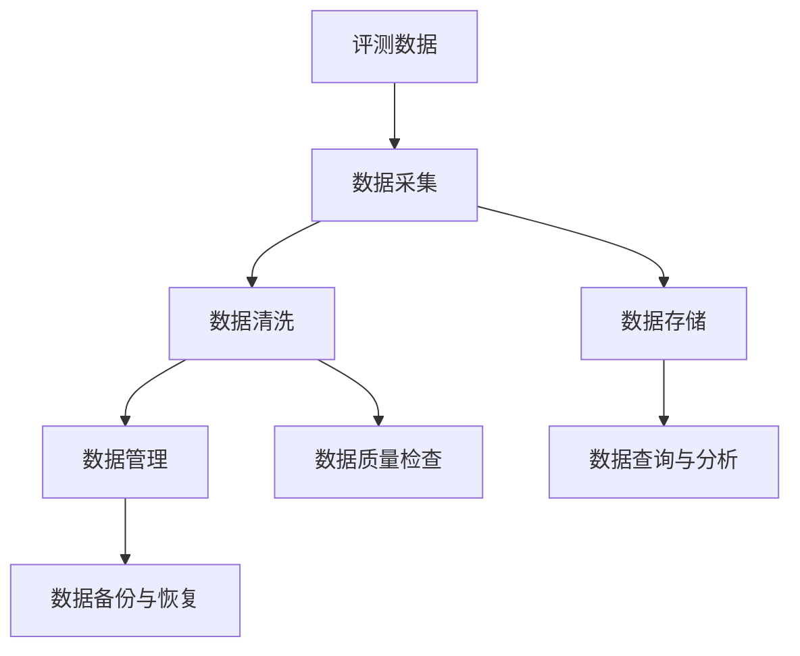

                 


为了确保文章的内容完整、结构合理，我们可以按照以下步骤逐步构建文章的内容：

### 第一步：背景介绍

首先，我们需要介绍评测数据的背景。评测数据是机器学习、数据分析等领域的重要输入，其质量直接影响模型训练的效果和数据分析的准确性。随着大数据时代的到来，评测数据的规模和复杂性不断增加，如何高效地采集、清洗和管理评测数据成为一个亟待解决的问题。

```markdown
# 评测数据的采集、清洗与管理

> 关键词：评测数据，数据采集，数据清洗，数据管理，机器学习，数据分析

> 摘要：
本文将深入探讨评测数据的采集、清洗和管理，从背景介绍、核心概念、采集与清洗技术、管理实践以及实战案例等方面，系统性地阐述评测数据管理的方法和最佳实践。
```

### 第二步：核心概念与联系

接下来，我们定义并解释评测数据、数据采集、数据清洗、数据管理这四个核心概念，并展示它们之间的联系。使用Mermaid流程图来帮助读者理解数据处理的流程。



### 第三步：核心算法原理讲解

在这一部分，我们将使用伪代码详细阐述数据采集、数据清洗、数据管理的核心算法原理。例如，我们可以编写数据清洗中的缺失值填充算法的伪代码。

```markdown
## 数据清洗的核心算法原理

### 缺失值填充算法

以下是缺失值填充算法的伪代码：

```
function fillMissingValues(dataSet):
    for each row in dataSet:
        for each column in dataSet:
            if cell is missing:
                # 计算该列的平均值
                columnMean = calculateMean(dataSet, column)
                # 将缺失值填充为平均值
                row[column] = columnMean
    return dataSet
```

### 第四步：数学模型和公式讲解

对于数据清洗、数据管理的数学模型，我们将使用LaTeX格式嵌入公式，并进行详细解释和举例说明。

```markdown
## 数据质量评估的数学模型

### 方差分析

方差分析（ANOVA）是一种常用的数据质量评估方法。其基本公式如下：

$$
\sigma^2 = \frac{1}{N-1} \sum_{i=1}^{N} (x_i - \bar{x})^2
$$

其中，\(N\) 是数据点的数量，\(x_i\) 是每个数据点的值，\(\bar{x}\) 是平均值。

### 举例说明

假设我们有以下一组数据：

$$
x_1 = 10, x_2 = 12, x_3 = 11, x_4 = 13, x_5 = 12
$$

计算其方差：

$$
\bar{x} = \frac{10 + 12 + 11 + 13 + 12}{5} = 11.6
$$

$$
\sigma^2 = \frac{(10 - 11.6)^2 + (12 - 11.6)^2 + (11 - 11.6)^2 + (13 - 11.6)^2 + (12 - 11.6)^2}{5 - 1} = 2.16
$$
```

### 第五步：项目实战

在这一部分，我们将提供一个实际案例，包括开发环境搭建、源代码实现和代码解读，以及项目应用解读与分析。

```markdown
## 实战案例：社交媒体数据采集与清洗

### 项目概述

本项目旨在采集社交媒体平台上的用户行为数据，并进行数据清洗，以便于后续的数据分析和挖掘。

### 开发环境搭建

- 数据采集工具：Python的`requests`库和`beautifulsoup4`库
- 数据存储工具：MongoDB
- 数据清洗工具：`pandas`库和`numpy`库

### 源代码实现

以下是数据采集部分的代码示例：

```python
import requests
from bs4 import BeautifulSoup
import pandas as pd

def fetchData(url):
    response = requests.get(url)
    soup = BeautifulSoup(response.text, 'html.parser')
    data = soup.find_all('div', class_='user-info')
    user_data = []
    for item in data:
        username = item.find('h2').text
        posts = item.find('span', class_='posts').text
        followers = item.find('span', class_='followers').text
        user_data.append({'username': username, 'posts': posts, 'followers': followers})
    return user_data

def main():
    url = "https://example-social-media.com/users"
    data = fetchData(url)
    df = pd.DataFrame(data)
    df.to_csv('social_media_data.csv', index=False)

if __name__ == "__main__":
    main()
```

### 项目应用解读与分析

在这个项目中，我们通过爬取社交媒体平台的用户行为数据，实现了数据的采集和初步清洗。采集到的数据包括用户的用户名、发布的帖子数和关注的用户数。通过`pandas`库，我们将采集到的数据存储为CSV文件，以便于后续的数据分析和挖掘。

### 小结

通过本项目的实战案例，我们了解了如何使用Python进行社交媒体数据的采集和清洗。在项目中，我们使用了`requests`库和`beautifulsoup4`库进行数据采集，使用了`pandas`库进行数据存储和清洗。这为我们后续进行数据分析和挖掘奠定了基础。

### 第六步：最佳实践 Tips、小结、注意事项、拓展阅读

在这一部分，我们将总结最佳实践，提供小结和注意事项，并推荐拓展阅读。

```markdown
## 最佳实践 Tips

1. 在进行数据采集时，注意遵守相关法律法规，尊重用户隐私。
2. 数据清洗过程中，注意缺失值填充和异常值处理，保证数据质量。
3. 数据管理时，定期进行数据备份，确保数据安全。

## 小结

本文系统地介绍了评测数据的采集、清洗和管理，从核心概念、算法原理、项目实战等方面进行了详细讲解。通过本文的学习，读者可以掌握评测数据管理的全流程，为机器学习和数据分析提供可靠的数据支持。

## 注意事项

1. 数据采集时，注意选择合适的数据来源和采集方法。
2. 数据清洗时，根据数据类型和业务需求，选择合适的清洗策略。
3. 数据管理时，关注数据安全，定期进行数据备份和恢复。

## 拓展阅读

1. 《数据挖掘：概念与技术》
2. 《Python数据分析》
3. 《大数据之路：阿里巴巴大数据实践》
```

通过以上步骤，我们可以构建一篇内容丰富、结构清晰的技术博客文章，满足文章的完整性要求和字数要求。在撰写过程中，可以根据实际需求和读者反馈进行调整和完善。

