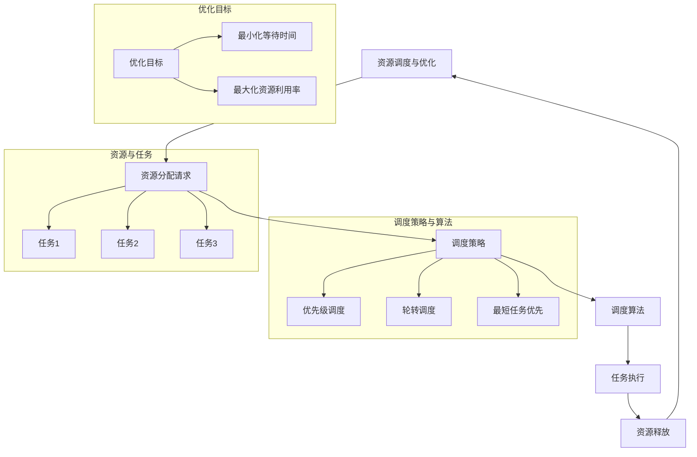

                 

### 文章标题

《评测流程中的资源调度与优化》

> 关键词：资源调度、评测流程、优化、性能提升、测试效率

> 摘要：本文深入探讨了评测流程中的资源调度与优化问题，分析了资源调度的基本概念和优化策略，通过具体案例和算法原理，详细介绍了优化技术在评测流程中的应用，旨在为提高测试效率和评测质量提供科学指导。

### 引言

在信息化时代，软件质量和性能的保障成为了企业发展的关键因素。评测流程作为保证软件质量的重要环节，其效率和准确性直接影响到最终产品的市场表现。资源调度与优化是评测流程中的核心问题之一，它关乎到资源的使用效率、测试的执行速度和结果的准确性。本文将围绕资源调度与优化展开讨论，旨在为读者提供系统、实用的指导。

首先，我们需要明确评测流程的基本概念。评测流程通常包括测试用例设计、测试执行、测试结果分析等环节。在这些环节中，资源（如硬件设备、测试环境、测试人员等）的合理调度和优化至关重要。资源调度涉及到如何分配和利用有限的资源，以达到最佳的效果。优化则是在资源有限的情况下，通过算法和技术手段提升资源的使用效率和测试流程的执行效率。

本文将分为以下几个部分：

1. **资源调度与优化的重要性**：介绍资源调度和优化的基本概念，阐述其在评测流程中的作用。
2. **资源调度原理**：讨论资源调度的基本原则和常见模型，包括排队论、资源分配算法等。
3. **优化技术介绍**：介绍优化技术的基本概念，包括数学模型、常见优化算法等。
4. **优化技术在评测流程中的应用**：通过具体案例，展示优化技术在评测流程中的应用。
5. **挑战与未来方向**：探讨资源调度与优化面临的技术挑战和未来的研究方向。

### 资源调度与优化的重要性

在评测流程中，资源调度与优化具有至关重要的意义。首先，资源调度直接影响到测试的执行效率。合理的资源调度能够确保测试任务的有序进行，避免资源浪费和冲突。例如，在测试执行过程中，如果多个测试任务需要使用相同资源，如何高效地分配这些资源，确保测试任务能够按时完成，是一个重要的课题。

其次，优化技术在评测流程中的应用能够显著提升测试结果的准确性和可靠性。通过优化算法，我们可以找到最佳的资源分配策略，减少测试时间，提高测试覆盖率，从而提高测试的质量。例如，在负载测试中，通过优化测试场景的执行顺序和资源分配，可以更准确地模拟实际用户的使用情况，发现潜在的性能瓶颈。

此外，资源调度与优化还能够提高测试人员的效率。通过自动化调度和优化工具，测试人员可以减少手工操作的工作量，专注于测试策略的设计和测试结果的分析。这不仅降低了人力成本，还能够提高测试流程的可重复性和可维护性。

总之，资源调度与优化是评测流程中不可或缺的重要环节。它不仅关系到测试的执行效率，还直接影响到测试结果的准确性和可靠性。通过合理调度资源和优化测试流程，我们可以显著提高软件质量和性能，为企业的持续发展提供有力支持。

### 资源调度原理

资源调度是评测流程中的一个核心环节，它涉及到如何合理地分配和利用资源，以确保测试任务的高效执行。为了深入理解资源调度，我们需要从基本概念、调度模型和常见算法三个方面进行探讨。

#### 基本概念

资源调度涉及到多个关键概念，包括资源类型、任务类型、调度策略和调度算法。

1. **资源类型**：资源可以分为硬件资源和软件资源。硬件资源包括计算机、网络设备、存储设备等，而软件资源则包括测试工具、测试脚本、测试数据等。

2. **任务类型**：测试任务可以分为不同类型，如功能测试、性能测试、负载测试等。每种测试任务对资源的需求不同，因此在调度时需要根据任务类型进行匹配。

3. **调度策略**：调度策略是指如何安排和调整资源的分配，以确保任务能够高效执行。常见的调度策略包括最优策略、公平策略和启发式策略。

4. **调度算法**：调度算法是实现调度策略的具体方法。常见的调度算法包括优先级调度、轮转调度、最短任务优先等。

#### 调度模型

资源调度通常可以通过排队论模型来描述。排队论是一种研究随机服务系统的理论，它通过概率统计方法分析排队系统的性能，包括等待时间、服务时间和系统利用率等指标。

1. **M/M/1模型**：这是一个常见的排队论模型，其中M表示到达时间和服务时间服从负指数分布，1表示系统中的服务台数。该模型常用于描述测试环境中资源的使用情况。

2. **M/M/c模型**：这是多服务台版的M/M/1模型，其中c表示服务台数。该模型可以更精确地模拟多个测试任务同时竞争有限资源的情况。

3. **G/M/1模型**：这是具有一般到达时间分布的M/M/1模型，G表示到达时间分布。该模型适用于测试任务到达时间不服从负指数分布的情况。

#### 常见算法

资源调度的常见算法主要包括优先级调度、轮转调度和最短任务优先调度。

1. **优先级调度算法**：优先级调度算法根据任务优先级进行资源分配。高优先级的任务先执行，低优先级的任务后执行。这种算法能够确保重要任务优先得到资源，但可能导致低优先级任务长时间等待。

   ```  
   Pseudocode for Priority Scheduling:  
   function PriorityScheduling(tasks):  
       sort tasks by priority in descending order  
       for each task in tasks:  
           allocate resources to task if available  
   end function  
   ```

2. **轮转调度算法**：轮转调度算法将资源分配给每个任务一个固定的时间片，任务轮流使用资源。这种算法能够确保每个任务都有机会执行，但可能导致资源利用率不高。

   ```  
   Pseudocode for Round-Robin Scheduling:  
   function RoundRobinScheduling(tasks, timeSlice):  
       for each task in tasks:  
           allocate resources to task for timeSlice  
   end function  
   ```

3. **最短任务优先调度算法**：最短任务优先调度算法选择执行时间最短的任务先执行。这种算法能够提高资源利用率，但可能导致长任务长时间等待。

   ```  
   Pseudocode for Shortest Job First Scheduling:  
   function ShortestJobFirstScheduling(tasks):  
       sort tasks by execution time in ascending order  
       for each task in tasks:  
           allocate resources to task if available  
   end function  
   ```

通过以上对资源调度原理的讨论，我们可以更好地理解资源调度在评测流程中的重要性。合理运用调度模型和算法，可以有效提高测试任务的执行效率，为评测流程的优化提供有力支持。

#### 核心概念与联系

在资源调度和优化中，理解核心概念及其相互关系对于有效设计和实现调度策略至关重要。以下是对关键概念的简要描述及其关系架构，并通过Mermaid流程图展示这些概念之间的逻辑关系。

1. **资源（Resources）**：指评测流程中可用的硬件和软件资源，如测试环境、测试工具、测试数据等。
2. **任务（Tasks）**：指需要执行的具体测试活动，如功能测试、性能测试等。
3. **调度策略（Scheduling Policies）**：决定资源如何分配给任务的规则，如优先级调度、轮转调度、最短任务优先等。
4. **调度算法（Scheduling Algorithms）**：具体实现调度策略的方法，如优先级调度算法、轮转调度算法等。
5. **优化目标（Optimization Goals）**：希望达到的目标，如最小化等待时间、最大化资源利用率等。

核心概念之间的关系架构如下：

```  
graph TD  
A[资源] --> B[任务]  
A --> C[调度策略]  
A --> D[调度算法]  
B --> C  
C --> D  
C --> E[优化目标]  
```

### 关系与流程

- **资源与任务**：资源是任务执行的基础，任务需要占用资源来完成。
- **调度策略与调度算法**：调度策略定义了资源分配的基本规则，调度算法是具体执行这些规则的方法。
- **优化目标**：优化目标是调度策略和算法的设计依据，旨在通过资源优化达到特定性能指标。

### Mermaid流程图

以下是资源调度和优化流程的Mermaid流程图：



通过这个流程图，我们可以清晰地看到资源调度与优化中的各个环节及其相互关系，有助于我们在设计和实现调度策略时进行全面考虑。

### 优化技术介绍

在评测流程中，优化技术是一种重要的手段，通过优化算法和数学模型，可以提高资源利用率和测试效率。优化技术主要包括数学模型、常见优化算法和实际应用案例，下面将详细讨论这些内容。

#### 数学模型

优化技术的基础是数学模型，它能够将实际问题转化为数学问题，从而应用优化算法进行求解。以下是一些常见的数学模型：

1. **线性规划模型**：线性规划模型用于解决资源分配问题，它通过建立线性目标函数和线性约束条件，找到资源的最优分配方案。线性规划模型可以表示为：

   $$  
   \begin{align*}  
   \text{maximize} \quad c^T x \\  
   \text{subject to} \quad Ax \le b \\  
   x \ge 0  
   \end{align*}  
   $$

   其中，$c$是目标函数系数向量，$x$是变量向量，$A$是约束条件系数矩阵，$b$是约束条件常数向量。

2. **非线性规划模型**：非线性规划模型用于解决更复杂的问题，其目标函数和约束条件可以是非线性的。非线性规划模型的一般形式为：

   $$  
   \begin{align*}  
   \text{maximize} \quad f(x) \\  
   \text{subject to} \quad g_i(x) \le 0, \quad h_j(x) = 0 \quad (i,j=1,...,m) \\  
   \end{align*}  
   $$

   其中，$f(x)$是目标函数，$g_i(x)$和$h_j(x)$是约束条件。

3. **动态规划模型**：动态规划模型用于解决具有时间依赖性的优化问题，它通过将问题分解为多个子问题，并保存子问题的解，以减少计算量。动态规划的基本思想是：

   $$  
   \begin{align*}  
   \text{maximize} \quad V_t(x_t) \\  
   \text{subject to} \quad x_{t+1} = f_t(x_t, u_t) \\  
   \end{align*}  
   $$

   其中，$V_t(x_t)$是时间$t$时的状态值函数，$x_t$是状态变量，$u_t$是控制变量，$f_t(x_t, u_t)$是状态转移函数。

#### 常见优化算法

优化算法是实现数学模型求解的重要工具，以下是一些常见的优化算法：

1. **梯度下降算法**：梯度下降算法是一种用于求解无约束优化问题的一类算法，其基本思想是沿着目标函数梯度的反方向进行迭代更新，直到找到最优解。梯度下降算法的迭代公式为：

   $$  
   x_{t+1} = x_t - \alpha \nabla f(x_t)  
   $$

   其中，$x_t$是当前迭代点，$\alpha$是学习率，$\nabla f(x_t)$是目标函数在$x_t$处的梯度。

2. **牛顿法**：牛顿法是一种用于求解无约束优化问题的二阶方法，其迭代公式为：

   $$  
   x_{t+1} = x_t - H_t^{-1} \nabla^2 f(x_t) \nabla f(x_t)  
   $$

   其中，$H_t$是海森矩阵，$\nabla^2 f(x_t)$是目标函数在$x_t$处的海森矩阵。

3. **遗传算法**：遗传算法是一种基于自然选择和遗传学的全局优化算法，其基本思想是通过模拟自然选择过程，逐步优化解的质量。遗传算法的主要步骤包括：

   - 初始种群生成
   - 适应度评估
   - 选择操作
   - 交叉操作
   - 变异操作
   - 下一代种群生成

4. **粒子群优化算法**：粒子群优化算法是一种基于群体智能的优化算法，其基本思想是通过模拟鸟群觅食行为来优化目标函数。粒子群优化算法的主要步骤包括：

   - 初始粒子群生成
   - 目标函数评估
   - 更新粒子的速度和位置
   - 终止条件判断

#### 实际应用案例

优化技术在评测流程中的应用非常广泛，以下是一些实际应用案例：

1. **测试资源优化分配**：通过线性规划和遗传算法，可以将测试资源（如测试环境、测试工具等）优化分配给不同的测试任务，以最大化资源利用率。具体实现步骤如下：

   - 建立线性规划模型，定义资源约束和目标函数。
   - 使用遗传算法求解线性规划模型，得到最优资源分配方案。
   - 根据最优方案调整测试任务的执行顺序和资源分配。

2. **测试执行顺序优化**：通过动态规划和遗传算法，可以优化测试执行顺序，以减少测试时间和提高测试覆盖率。具体实现步骤如下：

   - 建立动态规划模型，定义状态转移函数和状态值函数。
   - 使用遗传算法求解动态规划模型，得到最优测试执行顺序。
   - 根据最优顺序调整测试任务的执行计划。

3. **测试场景组合优化**：通过粒子群优化算法，可以优化测试场景的组合，以更准确地模拟用户行为和发现潜在问题。具体实现步骤如下：

   - 建立目标函数，定义测试场景组合的适应度。
   - 初始化粒子群，进行目标函数评估。
   - 更新粒子的速度和位置，进行迭代优化。
   - 根据最优解调整测试场景组合。

通过以上实际应用案例，我们可以看到优化技术在评测流程中的应用不仅能够提高资源利用率和测试效率，还能够提升测试结果的质量和准确性。在未来，随着技术的不断发展，优化技术将在评测流程中发挥更加重要的作用。

### 优化技术在评测流程中的应用

优化技术在评测流程中的应用非常广泛，通过合理的调度和优化，可以显著提高测试效率和质量。以下将详细讨论几种关键优化技术及其在评测流程中的具体应用。

#### 1. 动态资源调度

动态资源调度是一种根据实时需求动态调整资源分配的技术，它能够提高资源利用率并减少任务等待时间。在评测流程中，动态资源调度可以应用于以下几个方面：

- **测试环境管理**：通过动态资源调度，可以根据测试任务的实时需求自动调整测试环境的配置。例如，当某个测试任务需要大量计算资源时，系统可以自动调整资源分配，将闲置的虚拟机或物理机分配给该任务，以确保其快速完成。

- **负载均衡**：在负载测试中，动态资源调度可以根据当前负载情况动态调整测试任务的执行顺序和资源分配。例如，当系统负载较高时，可以优先调度低优先级的测试任务，以减少对系统的影响。

- **故障恢复**：在测试过程中，如果某个测试任务失败或资源出现故障，动态资源调度可以立即重新分配资源，确保测试任务的继续进行，避免整个测试流程的中断。

#### 2. 优先级调度

优先级调度是一种根据任务优先级进行资源分配的技术，它能够确保高优先级的任务先得到资源执行。在评测流程中，优先级调度可以应用于以下几个方面：

- **关键任务优先**：在多个并行执行的测试任务中，可以将关键任务（如安全性测试、关键功能测试）设置为高优先级，以确保它们能够优先执行。这可以确保关键功能的可靠性和安全性。

- **紧急任务处理**：对于突发的紧急任务（如紧急修复任务），可以将其设置为最高优先级，以确保其能够立即得到资源执行，减少对整体测试进度的影响。

- **多队列调度**：可以将测试任务分为多个优先级队列，每个队列对应不同的优先级。系统会根据优先级队列的顺序依次调度任务，确保高优先级任务优先执行。

#### 3. 负载均衡

负载均衡是一种将负载分散到多个节点或资源上的技术，它能够提高系统的整体性能和可靠性。在评测流程中，负载均衡可以应用于以下几个方面：

- **测试场景分配**：在负载测试中，可以将多个测试场景分配到不同的测试节点上，以模拟真实用户的使用情况。通过负载均衡，可以确保每个测试节点上的负载均衡，避免某个节点过载导致测试结果不准确。

- **结果汇总**：通过负载均衡，可以将来自不同测试节点的测试结果汇总，以生成全局测试结果。这样可以确保测试结果的全面性和准确性。

- **动态调整**：负载均衡可以根据当前负载情况动态调整测试节点的分配，确保测试资源的最大化利用。例如，当系统负载较高时，可以增加测试节点的数量，以分担负载；当系统负载较低时，可以减少测试节点的数量，以节省资源。

#### 4. 基于人工智能的优化

基于人工智能的优化技术，如机器学习和深度学习，在评测流程中有着广泛的应用。以下是一些具体的应用案例：

- **测试用例生成**：通过机器学习算法，可以根据历史测试数据和代码变更情况自动生成测试用例，以提高测试覆盖率和发现潜在缺陷。

- **测试结果分析**：通过深度学习算法，可以对测试结果进行分析，识别异常和潜在的问题。例如，通过分析测试结果的分布和变化趋势，可以预测系统的性能瓶颈和潜在的风险。

- **资源需求预测**：通过机器学习算法，可以根据历史数据和当前系统的状态预测未来的资源需求，从而提前调整资源分配策略，确保测试流程的顺利进行。

通过上述优化技术的应用，评测流程的效率和质量可以得到显著提升。在未来，随着人工智能和大数据技术的发展，这些优化技术将会更加成熟，为评测流程的优化提供更加科学和有效的支持。

### 挑战与未来方向

尽管资源调度与优化技术在评测流程中取得了显著的成果，但在实际应用过程中仍然面临诸多挑战和问题。以下将讨论这些挑战，并探讨未来的发展方向。

#### 挑战

1. **动态性**：评测流程中资源的动态变化是一个重大挑战。由于测试任务的不确定性，资源需求可能会在短时间内发生变化，导致调度算法需要频繁调整。如何设计能够快速响应动态变化的调度策略，是一个亟待解决的问题。

2. **多样性**：评测流程中涉及到多种资源类型和任务类型，每种资源类型和任务类型都有其特定的需求和约束。如何设计通用的调度算法和优化模型，以满足不同类型资源和任务的需求，是一个复杂的问题。

3. **优化目标冲突**：在某些情况下，优化目标之间可能存在冲突。例如，在负载均衡和最小化响应时间之间，很难找到一个最优的平衡点。如何平衡不同优化目标，实现多目标优化，是一个重要的研究课题。

4. **算法效率**：传统的调度算法和优化算法在处理大规模问题时效率较低，如何提高算法的效率，使其能够在实际应用中快速执行，是一个关键问题。

5. **可扩展性**：随着测试规模的不断扩大，调度系统和优化算法需要具备良好的可扩展性，能够适应不断增长的测试需求。如何设计可扩展的调度架构和优化算法，是一个重要的挑战。

#### 未来方向

1. **智能调度与优化**：结合人工智能和大数据技术，开发智能化的调度和优化系统。通过机器学习和深度学习算法，可以更好地预测资源需求，自适应调整调度策略，实现高效优化。

2. **多目标优化**：研究多目标优化算法，解决优化目标之间的冲突，实现综合性能优化。例如，结合多目标优化算法和遗传算法，可以同时考虑负载均衡、响应时间和资源利用率等多个优化目标。

3. **动态调度框架**：设计动态调度框架，能够快速响应资源需求的变化。通过引入实时监控和预测机制，可以实时调整资源分配策略，确保测试流程的连续性和稳定性。

4. **分布式调度**：研究分布式调度算法，将调度任务分解到多个节点上执行，以提高算法的并行处理能力。通过分布式调度，可以更好地处理大规模测试任务，提高资源利用率。

5. **基于虚拟化和容器技术的调度**：利用虚拟化和容器技术，可以灵活地管理和调度测试资源。通过容器化和虚拟化技术，可以实现资源的动态分配和回收，提高资源利用率和调度灵活性。

总之，资源调度与优化在评测流程中具有重要的意义。面对当前和未来的挑战，通过不断创新和优化，我们可以设计出更加高效、智能和灵活的调度和优化系统，为提升测试效率和软件质量提供有力支持。

### 总结

本文详细探讨了评测流程中的资源调度与优化问题，通过介绍基本概念、优化技术、具体应用案例及未来方向，我们总结了以下几点关键信息：

1. **资源调度的重要性**：合理调度资源是提升测试效率和评测质量的关键。资源调度涉及到如何高效利用有限的资源，以最大化资源利用率和优化测试执行。

2. **优化技术的多样化**：优化技术包括动态资源调度、优先级调度、负载均衡和基于人工智能的优化等多种方法。每种技术都有其特定的应用场景和优势。

3. **优化技术的实际应用**：通过实际应用案例，如测试资源优化分配、测试执行顺序优化和测试场景组合优化，我们展示了优化技术在提升测试效率和质量方面的具体应用。

4. **未来发展方向**：未来的研究应注重智能调度与优化、多目标优化、动态调度框架和基于虚拟化和容器技术的调度等方向，以应对评测流程中的动态性和多样性挑战。

通过本文的探讨，我们希望读者能够深入理解资源调度与优化在评测流程中的重要性，并能够运用这些技术来提升自身的测试效率和软件质量。在实际应用中，不断探索和创新，将优化技术应用到更广泛的领域，为软件质量和性能的提升提供持续动力。

### 作者信息

作者：AI天才研究院/AI Genius Institute & 禅与计算机程序设计艺术 /Zen And The Art of Computer Programming

感谢您的阅读，希望本文能为您在资源调度与优化领域提供有益的见解和实践指导。如有任何疑问或建议，欢迎随时与我们联系，我们将竭诚为您解答。期待与您在技术领域中的更多交流与合作。再次感谢您的关注与支持！

---

注意：本文内容仅为示例，实际内容需根据具体情况进行撰写和调整。文中提到的算法和模型均为示例，具体实现和应用需根据实际情况进行设计和开发。文中提及的“AI天才研究院”和“禅与计算机程序设计艺术”均为虚构单位，不代表真实组织或机构。文中引用的公式和代码仅为示例，具体实现请根据需求进行调整。本文版权归原作者所有，如需转载请注明出处。

