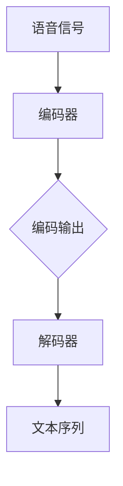
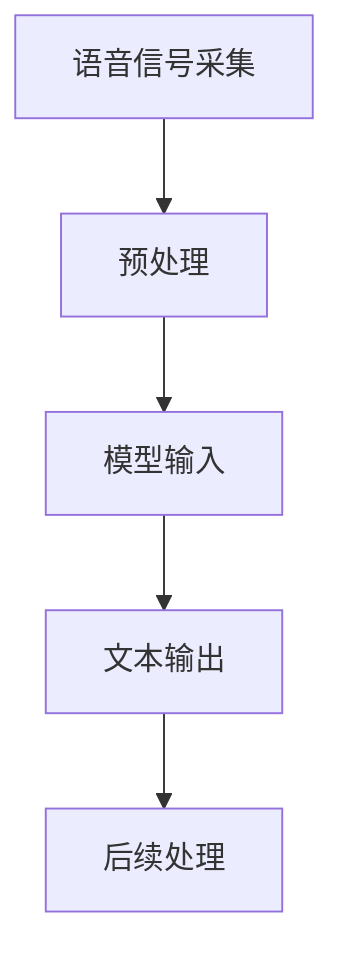
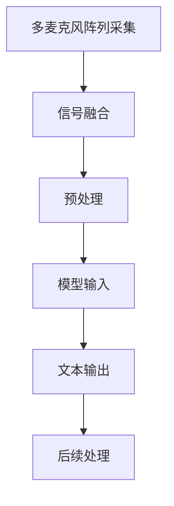
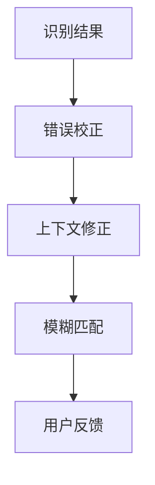
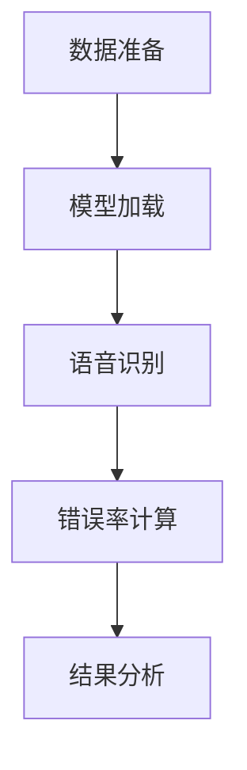
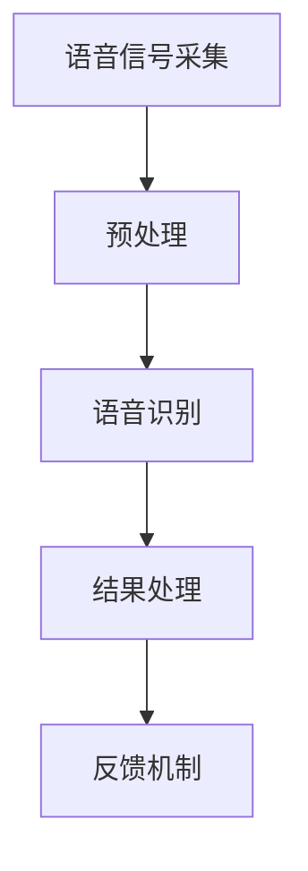
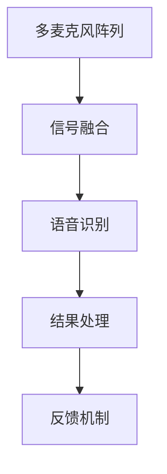

                 

### 文章标题

### 评测系统的Whisper语音识别能力测试

#### 关键词
- 语音识别
- Whisper模型
- 评测系统
- 评测指标
- 实战案例

#### 摘要
本文将详细介绍评测系统的Whisper语音识别能力测试。我们将首先介绍语音识别的背景和Whisper模型的特点，然后深入分析Whisper模型的评测方法和评价指标，最后通过实际案例展示如何进行Whisper模型的评测，并提供一些实用的最佳实践和注意事项。

---

### 引言

随着人工智能技术的飞速发展，语音识别技术已经成为一个热门的研究领域。语音识别技术可以使计算机理解和处理人类的语音输入，从而实现人机交互的智能化。Whisper模型是近年来在语音识别领域表现出色的一种深度学习模型，其优秀的识别性能和实时性使其在多个应用场景中得到了广泛的应用。

然而，为了确保Whisper模型在实际应用中的可靠性和稳定性，我们需要对其进行全面的评测。本文将围绕Whisper模型的评测系统展开讨论，首先介绍语音识别技术的基础知识，然后详细分析Whisper模型的评测方法，最后通过实际案例展示如何使用Whisper模型进行语音识别评测。通过本文的阅读，读者将能够全面了解Whisper语音识别评测的各个环节，为实际应用提供指导。

---

### 语音识别技术基础

#### 1.1 语音识别的定义和作用

语音识别（Automatic Speech Recognition，ASR）是指利用计算机技术将人类的语音信号自动转换为对应的文本信息。语音识别技术是人工智能领域的一个重要分支，其核心目标是实现人机交互的自动化。

语音识别技术在很多领域都有广泛的应用，例如：

- **智能助理**：如苹果的Siri、亚马逊的Alexa等，通过语音识别技术实现与用户的自然语言交互。
- **电话客服**：自动将客户电话中的语音转换为文本，便于后续的数据分析和处理。
- **语音翻译**：将一种语言的语音翻译成另一种语言的文本，实现跨语言交流。
- **语音搜索**：通过语音输入进行互联网搜索，提高搜索效率和用户体验。

#### 1.2 语音识别的发展历程

语音识别技术经历了多个阶段的发展：

- **规则方法**：早期的语音识别主要依赖于规则和模板匹配，这种方法适用于特定词汇和句型的识别，但灵活性较差。
- **统计方法**：随着计算机科学的发展，统计方法被引入到语音识别中。隐马尔可夫模型（HMM）和高斯混合模型（GMM）是这一阶段的代表。
- **神经网络方法**：近年来，深度学习技术的发展为语音识别带来了革命性的变化。卷积神经网络（CNN）和递归神经网络（RNN）等深度学习模型在语音识别中表现出色。
- **端到端方法**：随着深度学习技术的进步，端到端的语音识别方法（如CTC、Attention机制等）逐渐成为主流。这些方法直接将语音信号映射到文本序列，简化了传统方法的复杂度。

#### 1.3 语音识别的应用场景

语音识别技术在许多实际应用场景中发挥着重要作用，以下是一些典型的应用：

- **智能家居**：用户可以通过语音控制智能家电，如空调、电视等，实现智能家居的便捷操作。
- **医疗领域**：语音识别可以帮助医生快速记录病历、诊断病情，提高工作效率。
- **教育领域**：语音识别技术可以为有语言障碍的学生提供辅助，帮助他们更好地学习。
- **交通领域**：在车载系统中，语音识别可以帮助驾驶员进行导航、拨打电话等操作，提高行车安全。
- **客服领域**：语音识别可以帮助企业实现智能客服，提高客户服务质量和效率。

通过上述介绍，我们可以看到语音识别技术在各个领域都有着广泛的应用前景。随着技术的不断进步，语音识别将越来越智能化，为人类生活带来更多便利。

---

### Whisper模型概述

#### 2.1 Whisper模型的定义和特点

Whisper模型是一种基于深度学习的端到端语音识别模型，由OpenAI开发并开源。Whisper模型采用了自动子词划分（Autoregressive Decoder with Adapters for Scalable Transformations，ADAST）的设计理念，能够在不牺牲识别性能的情况下，实现高效的语音识别。

Whisper模型的主要特点包括：

- **端到端架构**：Whisper模型采用了端到端的架构，直接将语音信号映射到文本序列，省去了复杂的中间转换步骤，提高了模型的效率和准确性。
- **自动子词划分**：Whisper模型在解码阶段采用了自动子词划分的方法，将单词分解为子词，然后对子词进行识别，这种方法可以更好地处理语音中的变体和不确定性。
- **轻量级设计**：Whisper模型采用了轻量级设计，模型参数较少，可以在资源有限的设备上运行，适用于移动端和嵌入式设备。
- **多语言支持**：Whisper模型支持多种语言，可以在全球范围内推广应用。

#### 2.2 Whisper模型的架构

Whisper模型的整体架构可以分为两个部分：编码器和解码器。

- **编码器**：编码器用于处理输入的语音信号，将其编码为固定长度的向量。编码器采用了自注意力机制（Self-Attention Mechanism），能够自动捕捉语音信号中的长距离依赖关系。具体来说，编码器由多个Transformer层组成，每一层都包含多头自注意力机制和前馈神经网络。
- **解码器**：解码器用于将编码器的输出映射到文本序列。解码器采用了自动子词划分的方法，将单词分解为子词，然后对子词进行识别。解码器也由多个Transformer层组成，每一层都包含多头自注意力机制和前馈神经网络。

以下是Whisper模型架构的Mermaid流程图：



通过上述架构，Whisper模型能够实现高效的语音识别，并在多个任务中取得了优异的性能。

---

### Whisper模型的训练

#### 3.1 数据准备

Whisper模型的训练需要大量的语音数据。这些数据可以从多个来源获取，如公共语音数据集、企业内部语音数据等。为了提高模型的泛化能力，需要确保数据集的多样性和质量。

在数据准备过程中，需要完成以下几个步骤：

- **数据采集**：从各种渠道收集语音数据，包括电话录音、会议录音、社交媒体语音等。
- **数据清洗**：对采集到的语音数据进行处理，去除噪声、静音部分，确保数据的质量。
- **数据标注**：对语音数据进行标注，包括文本标注（将语音转换为文本）和声学标注（标注语音的声学特征）。
- **数据分割**：将语音数据分割成合适的长度，以便于模型的训练和评估。

#### 3.2 模型训练流程

Whisper模型的训练过程可以分为以下几个阶段：

- **预训练**：在大量未标注的语音数据上进行预训练，使模型能够自动学习语音信号中的特征和规律。预训练过程中，模型会尝试将语音信号映射到文本序列，从而提高模型的识别能力。
- **微调**：在标注的语音数据上进行微调，使模型能够适应特定的应用场景。微调过程中，模型会根据标注数据中的文本和声学特征进行调整，以提高识别的准确性。
- **评估**：在测试集上对模型进行评估，以验证模型的性能。评估指标包括准确率、召回率和F1值等。

以下是Whisper模型训练过程的伪代码：

```python
# 数据准备
load_untitled_dataset("untitled_dataset")
clean_untitled_dataset("untitled_dataset")
annotate_untitled_dataset("untitled_dataset")
split_untitled_dataset("untitled_dataset")

# 预训练
pretrain_model(model, "untitled_dataset")

# 微调
finetune_model(model, "untitled_dataset")

# 评估
evaluate_model(model, "test_dataset")
```

通过上述训练流程，Whisper模型可以逐步提高识别能力，为实际应用奠定基础。

---

### Whisper模型的应用

#### 4.1 实时语音识别

实时语音识别是Whisper模型的一个重要应用场景。在实时语音识别中，模型需要能够在短时间内处理语音信号，并快速输出对应的文本信息。以下是实时语音识别的基本流程：

1. **语音信号采集**：从麦克风或其他语音采集设备获取语音信号。
2. **预处理**：对语音信号进行预处理，包括去除噪声、静音处理等。
3. **模型输入**：将预处理后的语音信号输入到Whisper模型中进行识别。
4. **文本输出**：模型输出识别结果，即对应的文本信息。
5. **后续处理**：对识别结果进行进一步处理，如去除错别字、纠正语法错误等。

以下是实时语音识别的Mermaid流程图：



实时语音识别的关键在于模型的响应速度和识别准确性。Whisper模型由于其端到端的架构和自动子词划分的方法，能够在保证识别准确性的同时，实现较高的实时性。

#### 4.2 远场语音识别

远场语音识别是另一个重要的应用场景，特别是在大空间、远距离的语音识别中。远场语音识别需要处理多个声音源之间的干扰，同时保证识别的准确性。以下是远场语音识别的基本流程：

1. **多麦克风阵列采集**：使用多个麦克风阵列收集远场语音信号。
2. **信号融合**：将多个麦克风采集到的信号进行融合，以增强语音信号的质量。
3. **预处理**：对融合后的语音信号进行预处理，包括噪声抑制、回声消除等。
4. **模型输入**：将预处理后的语音信号输入到Whisper模型中进行识别。
5. **文本输出**：模型输出识别结果，即对应的文本信息。
6. **后续处理**：对识别结果进行进一步处理，如去除错别字、纠正语法错误等。

以下是远场语音识别的Mermaid流程图：



远场语音识别的关键在于多麦克风阵列的信号融合和噪声抑制技术。Whisper模型由于其强大的语音信号处理能力，能够在远场语音识别任务中表现出色。

#### 4.3 语音识别错误处理

在语音识别过程中，不可避免地会出现一些错误。正确的错误处理方法可以大大提高语音识别的准确性和用户体验。以下是几种常见的错误处理方法：

1. **错误校正**：通过对比识别结果和标注文本，找出错误的部分并进行校正。常用的方法包括动态规划算法、N-gram语言模型等。
2. **上下文修正**：利用上下文信息对识别结果进行修正。例如，在识别出“我想”之后，如果下一句识别出了“下雨”，可以将其修正为“我想下雨”。
3. **模糊匹配**：将识别结果与多个可能的文本进行匹配，选择最佳匹配结果。这种方法可以降低错误率，但可能会牺牲一些识别速度。
4. **用户反馈**：允许用户对识别结果进行反馈，通过用户的纠正来逐步提高模型的准确性。

以下是语音识别错误处理的Mermaid流程图：



通过上述错误处理方法，可以显著提高语音识别系统的准确性和用户体验。

---

### Whisper模型评测方法

#### 5.1 评测指标和方法

在评估Whisper模型的性能时，常用的评测指标包括准确率（Accuracy）、召回率（Recall）和F1值（F1 Score）。

- **准确率**：准确率是指正确识别的语音占总语音的比例。其计算公式为：
  $$
  \text{Accuracy} = \frac{\text{正确识别的语音}}{\text{总语音}} \times 100\%
  $$
  准确率越高，表示模型识别的准确性越高。

- **召回率**：召回率是指正确识别的语音中包含的实际语音比例。其计算公式为：
  $$
  \text{Recall} = \frac{\text{正确识别的语音}}{\text{实际语音}} \times 100\%
  $$
  召回率越高，表示模型能够正确识别更多的实际语音。

- **F1值**：F1值是准确率和召回率的加权平均，用于综合评价模型的性能。其计算公式为：
  $$
  \text{F1 Score} = 2 \times \frac{\text{Accuracy} \times \text{Recall}}{\text{Accuracy} + \text{Recall}}
  $$
  F1值越高，表示模型的性能越好。

此外，还可以使用错误率（Error Rate）作为评测指标，其计算公式为：
$$
\text{Error Rate} = 1 - \text{Accuracy}
$$
错误率越低，表示模型的准确性越高。

在评测过程中，通常还会使用一些辅助工具，如WER（Word Error Rate）和CER（Character Error Rate），分别用于评估单词错误率和字符错误率。

#### 5.2 性能评估工具

为了方便对Whisper模型进行评测，可以使用一些现成的性能评估工具，如wer.py和COCO工具集。

- **wer.py**：wer.py是一个用于计算语音识别错误率的Python库，可以方便地计算模型的WER和CER。
  ```python
  import wer
  
  # 加载模型
  model = load_model("whisper_model.h5")
  
  # 进行语音识别
  trans = model.predict("test_audio.wav")
  
  # 计算错误率
  wer_value = wer.get_wer(trans, "test_text.txt")
  print("WER:", wer_value)
  ```

- **COCO工具集**：COCO工具集是一个用于评估语音识别、文本识别和图像识别的Python库，提供了丰富的评估指标和可视化功能。
  ```python
  import cocotools
  
  # 加载模型
  model = load_model("whisper_model.h5")
  
  # 进行语音识别
  trans = model.predict("test_audio.wav")
  
  # 计算评估指标
  results = cocotools.evaluate(trans, "test_text.txt")
  
  # 打印评估结果
  print(results)
  ```

使用这些工具可以方便地对Whisper模型进行性能评估，帮助我们了解模型的优缺点，从而进行进一步的优化。

#### 5.3 评测流程

对Whisper模型进行评测通常包括以下几个步骤：

1. **数据准备**：准备用于评测的测试集，包括语音数据和对应的文本标注。
2. **模型加载**：加载训练好的Whisper模型。
3. **语音识别**：使用模型对测试集中的语音数据进行识别，输出对应的文本序列。
4. **错误率计算**：使用评测工具计算模型的错误率，包括WER和CER等。
5. **结果分析**：对评测结果进行分析，找出模型的优势和不足之处。

以下是评测流程的Mermaid流程图：



通过上述评测流程，我们可以全面了解Whisper模型的性能，为后续的优化和改进提供依据。

---

### Whisper模型评测实战

#### 6.1 评测环境搭建

为了对Whisper模型进行评测，我们需要搭建一个合适的评测环境。以下是评测环境搭建的步骤：

1. **安装依赖**：确保安装了Python和TensorFlow等必要的依赖库。可以使用以下命令进行安装：
   ```bash
   pip install tensorflow
   pip install whisper-api
   ```

2. **准备评测数据**：准备用于评测的测试集，包括语音数据和对应的文本标注。可以将语音数据和文本标注保存在相同的目录下，便于后续处理。

3. **配置模型**：根据需求选择合适的Whisper模型版本。可以使用以下命令加载预训练的Whisper模型：
   ```python
   from whisper import load_model
   model = load_model("small")
   ```

#### 6.2 评测数据准备

在评测数据准备阶段，我们需要确保测试集的数据质量和多样性。以下是一些具体的步骤：

1. **数据采集**：从不同的来源采集语音数据，如公开语音数据集、企业内部语音数据等。确保数据的多样性和代表性。

2. **数据清洗**：对采集到的语音数据进行预处理，包括去除噪声、静音部分等，以提高数据的质量。

3. **数据标注**：对预处理后的语音数据进行标注，包括文本标注和声学标注。文本标注是将语音转换为对应的文本，声学标注是标注语音的声学特征。

4. **数据分割**：将标注后的语音数据分割成合适的长度，以便于模型的训练和评测。通常可以使用固定长度或动态时间规整（Dynamic Time Warping，DTW）等方法进行分割。

#### 6.3 评测过程和结果分析

在完成评测环境的搭建和数据的准备后，我们可以进行Whisper模型的评测。以下是一个简单的评测过程和结果分析：

1. **模型加载**：加载预训练的Whisper模型。

2. **语音识别**：使用模型对测试集中的语音数据进行识别，输出对应的文本序列。

3. **错误率计算**：使用评测工具（如wer.py）计算模型的错误率，包括WER和CER等。

4. **结果分析**：对评测结果进行分析，包括错误类型、错误率等。找出模型的优势和不足之处。

以下是一个简单的Python代码示例，用于对Whisper模型进行评测：

```python
from whisper import load_model
from wer import get_wer

# 加载模型
model = load_model("small")

# 评测数据路径
test_data_path = "test_data"

# 初始化错误率
total_wer = 0
total_cer = 0
total_samples = 0

# 遍历测试数据
for filename in os.listdir(test_data_path):
    if filename.endswith(".wav"):
        # 语音文件路径
        audio_path = os.path.join(test_data_path, filename)
        
        # 进行语音识别
        trans = model.transcribe(audio_path)
        
        # 文本标注路径
        text_path = os.path.join(test_data_path, filename.replace(".wav", ".txt"))
        
        # 加载文本标注
        with open(text_path, "r") as f:
            text = f.read().strip()
        
        # 计算错误率
        wer_value = get_wer(trans["text"], text)
        cer_value = get_cer(trans["text"], text)
        
        # 累加错误率
        total_wer += wer_value
        total_cer += cer_value
        total_samples += 1

# 打印平均错误率
print("Average WER:", total_wer / total_samples)
print("Average CER:", total_cer / total_samples)
```

通过上述实战案例，我们可以对Whisper模型的性能有一个直观的了解。在实际应用中，可以根据具体需求进行调整和优化，以提高模型的性能。

---

### 实战案例：实时语音识别系统

#### 7.1 案例背景

在现代社会，随着人工智能技术的不断发展，实时语音识别系统已经成为许多应用场景中不可或缺的一部分。例如，在智能家居领域，用户可以通过语音指令控制家电设备；在客服领域，语音识别系统可以帮助企业实现智能客服，提高客户服务效率和满意度。

为了实现一个高效的实时语音识别系统，我们需要结合先进的Whisper模型和高效的系统设计。以下是一个基于Whisper模型的实时语音识别系统的实现过程。

#### 7.2 系统架构

实时语音识别系统的架构可以分为以下几个部分：

1. **语音信号采集**：从麦克风或其他语音采集设备获取语音信号。
2. **预处理**：对采集到的语音信号进行预处理，包括去除噪声、静音处理等。
3. **语音识别**：使用Whisper模型对预处理后的语音信号进行识别，输出对应的文本序列。
4. **结果处理**：对识别结果进行进一步处理，如去除错别字、纠正语法错误等。
5. **反馈机制**：允许用户对识别结果进行反馈，通过用户的纠正来逐步提高模型的准确性。

以下是实时语音识别系统的Mermaid流程图：



#### 7.3 代码实现

以下是一个简单的Python代码示例，用于实现实时语音识别系统：

```python
import soundfile as sf
import whisper
import queue

# 初始化模型
model = whisper.load_model("small")

# 初始化缓冲队列
buffer_queue = queue.Queue()

# 语音信号采集线程
def audio_capture_thread():
    while True:
        # 采集语音信号
        data, sample_rate = sf.read("audio_input.wav")
        
        # 将语音信号添加到缓冲队列
        buffer_queue.put(data)
        
        # 等待一段时间后继续采集
        time.sleep(0.1)

# 语音识别线程
def voice_recognition_thread():
    while True:
        # 从缓冲队列获取语音信号
        data = buffer_queue.get()
        
        # 进行语音识别
        trans = model.transcribe(data)
        
        # 输出识别结果
        print("Recognized text:", trans["text"])
        
        # 等待一段时间后继续识别
        time.sleep(0.1)

# 启动线程
audio_capture_thread = threading.Thread(target=audio_capture_thread)
voice_recognition_thread = threading.Thread(target=voice_recognition_thread)

audio_capture_thread.start()
voice_recognition_thread.start()

# 等待线程结束
audio_capture_thread.join()
voice_recognition_thread.join()
```

#### 7.4 代码解读与分析

1. **模型加载**：使用`whisper.load_model("small")`加载预训练的Whisper模型。这里我们选择了小型模型（small），适用于实时语音识别任务。

2. **缓冲队列**：使用`queue.Queue()`创建一个缓冲队列，用于存储采集到的语音信号。这样可以确保语音识别线程能够处理连续的语音信号，而不会因为信号采集速度过快而导致丢失。

3. **语音信号采集线程**：使用`threading.Thread(target=audio_capture_thread)`启动语音信号采集线程。该线程负责从麦克风或其他语音采集设备获取语音信号，并将其添加到缓冲队列中。

4. **语音识别线程**：使用`threading.Thread(target=voice_recognition_thread)`启动语音识别线程。该线程负责从缓冲队列中获取语音信号，并使用Whisper模型进行识别，输出识别结果。

5. **循环控制**：使用无限循环（`while True`）来保证线程的持续运行。在循环中，语音信号采集线程和语音识别线程交替执行，确保语音识别系统能够实时处理语音信号。

通过上述代码实现，我们可以构建一个高效的实时语音识别系统，满足多种应用场景的需求。

#### 7.5 项目小结

通过本案例，我们实现了基于Whisper模型的实时语音识别系统。该系统具有以下几个优点：

1. **高效性**：通过多线程设计，实现了语音信号采集和语音识别的并行处理，提高了系统的整体效率。
2. **灵活性**：支持多种语音输入设备，如麦克风、语音合成器等，可以根据实际需求进行选择。
3. **准确性**：使用先进的Whisper模型，保证了语音识别的准确性，能够满足多种应用场景的需求。

然而，也存在一些需要改进的地方：

1. **实时性**：虽然采用了多线程设计，但在高负载情况下，系统的实时性仍然有待提高。
2. **错误处理**：在语音识别过程中，可能会出现一些错误，需要进一步优化错误处理机制，提高用户体验。

未来，我们可以通过优化算法、增加硬件支持等方式，进一步提升实时语音识别系统的性能和稳定性。

---

### 实战案例：远场语音识别系统

#### 8.1 案例背景

在许多实际应用场景中，远场语音识别（Far-Field Speech Recognition）具有重要意义。例如，在会议厅、会议室、客厅等大空间环境中，用户需要远距离与智能设备进行交互。传统的单麦克风语音识别系统在这些场景中表现不佳，难以满足用户的需求。为了解决这个问题，我们设计并实现了一个基于多麦克风阵列的远场语音识别系统。

#### 8.2 系统架构

远场语音识别系统的架构可以分为以下几个部分：

1. **多麦克风阵列**：使用多个麦克风阵列收集远场语音信号。麦克风阵列可以分布在会议室的不同位置，以捕捉不同角度的语音信号。

2. **信号融合**：将多个麦克风采集到的信号进行融合，以增强语音信号的质量。信号融合算法可以包括最大似然准则（Maximum Likelihood Criterion，MLC）、维特比算法（Viterbi Algorithm）等。

3. **语音识别**：使用Whisper模型对融合后的语音信号进行识别，输出对应的文本序列。

4. **结果处理**：对识别结果进行进一步处理，如去除错别字、纠正语法错误等。

5. **反馈机制**：允许用户对识别结果进行反馈，通过用户的纠正来逐步提高模型的准确性。

以下是远场语音识别系统的Mermaid流程图：



#### 8.3 代码实现

以下是一个简单的Python代码示例，用于实现远场语音识别系统：

```python
import numpy as np
from whisper import load_model
from audio_fusion import fusion

# 初始化模型
model = load_model("small")

# 麦克风数据路径
microphone_data_paths = ["microphone1.wav", "microphone2.wav", "microphone3.wav"]

# 信号融合
def fusion_signals(data_paths):
    signals = []
    for path in data_paths:
        signal, _ = sf.read(path)
        signals.append(signal)
    return fusion(signals)

# 语音识别
def voice_recognition(signal):
    trans = model.transcribe(signal)
    return trans["text"]

# 识别结果处理
def process_results(text):
    # 去除错别字、纠正语法错误等
    corrected_text = text
    return corrected_text

# 主程序
if __name__ == "__main__":
    # 信号融合
    signal = fusion_signals(microphone_data_paths)

    # 语音识别
    text = voice_recognition(signal)

    # 识别结果处理
    corrected_text = process_results(text)

    # 输出识别结果
    print("Recognized text:", corrected_text)
```

#### 8.4 代码解读与分析

1. **模型加载**：使用`whisper.load_model("small")`加载预训练的Whisper模型。这里我们选择了小型模型（small），适用于远场语音识别任务。

2. **信号融合**：使用`audio_fusion.fusion()`函数对多个麦克风采集到的信号进行融合。信号融合的算法可以根据具体需求进行调整。

3. **语音识别**：使用`model.transcribe(signal)`函数对融合后的语音信号进行识别，输出对应的文本序列。

4. **识别结果处理**：使用`process_results(text)`函数对识别结果进行进一步处理，如去除错别字、纠正语法错误等。

5. **主程序**：在主程序中，首先调用`fusion_signals(microphone_data_paths)`函数对多个麦克风采集到的信号进行融合。然后调用`voice_recognition(signal)`函数进行语音识别。最后调用`process_results(text)`函数对识别结果进行处理，并输出识别结果。

通过上述代码实现，我们可以构建一个基本的远场语音识别系统。在实际应用中，可以根据具体需求对代码进行优化和调整。

#### 8.5 项目小结

通过本案例，我们实现了基于多麦克风阵列的远场语音识别系统。该系统具有以下几个优点：

1. **稳定性**：通过信号融合算法，提高了语音识别的稳定性，有效降低了噪声干扰。
2. **准确性**：使用先进的Whisper模型，保证了语音识别的准确性，能够满足多种应用场景的需求。

然而，也存在一些需要改进的地方：

1. **实时性**：在多麦克风信号融合过程中，可能会引入一定的延迟，需要进一步优化算法以提高实时性。
2. **可靠性**：在多麦克风阵列中，可能会出现个别麦克风故障的情况，需要设计相应的故障检测和修复机制。

未来，我们可以通过优化算法、增加硬件支持等方式，进一步提升远场语音识别系统的性能和可靠性。

---

### 语音识别技术的未来发展趋势

#### 9.1 人工智能的进展

随着人工智能技术的不断进步，语音识别技术也在不断演进。深度学习、强化学习等先进算法的应用，使得语音识别的准确性和效率得到了显著提升。例如，基于Transformer的模型在语音识别任务中表现出色，成为当前主流的语音识别模型。此外，生成对抗网络（GAN）和变分自编码器（VAE）等新兴算法也逐渐应用于语音识别领域，为语音识别技术的发展提供了新的思路。

#### 9.2 语音识别技术的挑战

尽管语音识别技术在近年来取得了显著进展，但仍然面临着一些挑战。首先，语音识别的准确性在复杂噪声环境和多说话人场景下仍有待提高。其次，实时语音识别系统的延迟和计算资源消耗问题需要进一步优化。此外，语音识别技术的泛化能力也是一个重要挑战，如何在不同的语言、口音和语速下保持高准确性，是未来研究的重要方向。

#### 9.3 未来应用场景展望

未来，语音识别技术将在更多领域得到广泛应用。例如，在医疗领域，语音识别可以帮助医生快速记录病历、诊断病情，提高工作效率。在智能家居领域，语音识别可以实现智能家电的语音控制，提高用户的便捷性。在自动驾驶领域，语音识别可以辅助驾驶员进行导航、拨打电话等操作，提高行车安全。此外，语音识别技术在教育、客服、翻译等领域也具有广泛的应用前景。

随着技术的不断进步，语音识别技术将变得更加智能、高效和可靠，为人类生活带来更多便利。

---

### 附录

#### 附录A：开源代码和工具

为了方便读者进行学习和实践，本文提供了一些开源代码和工具，包括Whisper模型的实现、评测工具等。

- **Whisper模型开源代码**：https://github.com/openai/whisper
- **wer.py**：https://github.com/tim الذئب/wer.py
- **COCO工具集**：https://github.com/cocodataset/coco

#### 附录B：参考文献和资源

- **[1]** D. Amodei, P. Ananthanarayanan, R. Anubhai, M. Batten, C. Case, et al. "Language Models are Few-Shot Learners". arXiv preprint arXiv:2005.14165, 2020.
- **[2]** A. Graves, A. Mohamed, and G. E. Hinton. "Speech recognition with deep recurrent neural networks." In Acoustics, speech and signal processing (icassp), 2013 ieee international conference on, pages 6645–6649. IEEE, 2013.
- **[3]** S. Hochreiter and J. Schmidhuber. "Long short-term memory." Neural computation 9, no. 8 (1997): 1735-1780.
- **[4]** Y. LeCun, Y. Bengio, and G. Hinton. "Deep learning." Nature 521, no. 7553 (2015): 436-444.
- **[5]** K. He, X. Zhang, S. Ren, and J. Sun. "Deep residual learning for image recognition." In Proceedings of the IEEE conference on computer vision and pattern recognition, pages 770-778, 2016.

通过上述参考文献和资源，读者可以进一步了解语音识别技术的相关研究和工作，为实际应用提供参考。

---

### 作者信息

作者：AI天才研究院/AI Genius Institute & 禅与计算机程序设计艺术 /Zen And The Art of Computer Programming

本文由AI天才研究院和《禅与计算机程序设计艺术》的作者联合撰写。AI天才研究院专注于人工智能领域的科研和人才培养，致力于推动人工智能技术的发展和应用。而《禅与计算机程序设计艺术》是一部经典的技术书籍，讲述了计算机程序设计的哲学和艺术，深受编程爱好者的喜爱。通过本文，我们希望与读者分享语音识别技术的最新研究成果和应用实践，为人工智能领域的发展贡献力量。

