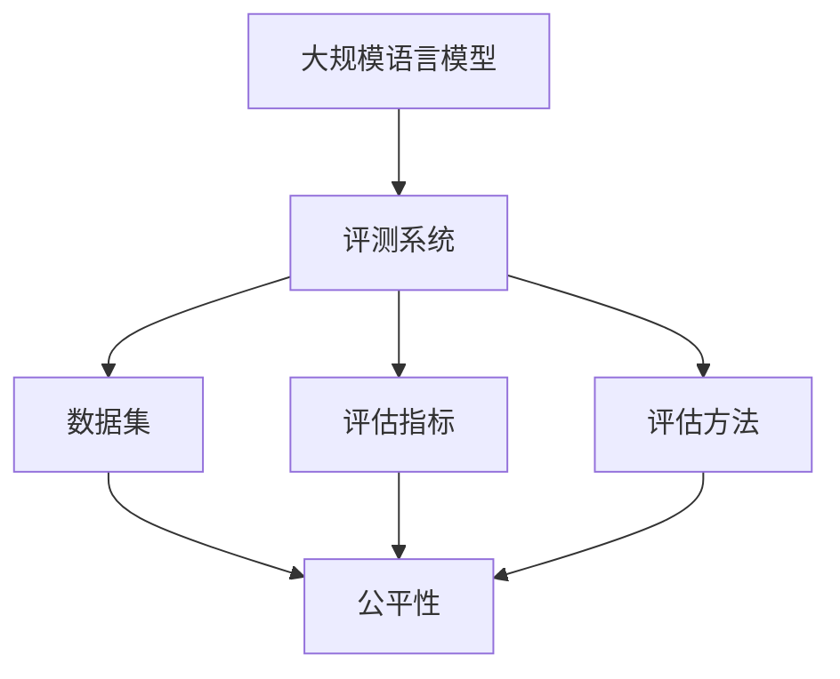

                 


## 第一步：背景介绍

随着人工智能技术的迅猛发展，大规模语言模型（LLM）如BERT、GPT-3等在自然语言处理领域取得了显著的成就。这些模型不仅在学术研究中广泛应用，还逐渐应用于实际商业场景，如智能客服、文本生成、机器翻译等。然而，在众多LLM中，如何确保评测系统的公平性，以实现不同LLM之间的公平比较，成为一个亟待解决的问题。

### 核心概念与联系

公平性：公平性是指在评测过程中，确保每个LLM都能在相同条件下进行评估，避免因外部因素导致的不公平现象。

评测系统：评测系统是指用于对LLM进行性能评估的工具和框架，它包括数据集、评估指标和评估方法等组成部分。

不同LLM间的公平比较：不同LLM间的公平比较是指在不同的评测标准下，对多个LLM进行性能评估，以确保每个LLM都能在相同条件下进行公平竞争。

### Mermaid 流程图



## 第二步：核心概念原理讲解

### 数学模型与公式

在评测系统中，常用的评估指标包括精确率、召回率和F1值等，这些指标可以通过以下数学模型进行计算：

$$
\text{精确率} = \frac{\text{TP}}{\text{TP} + \text{FP}}
$$

$$
\text{召回率} = \frac{\text{TP}}{\text{TP} + \text{FN}}
$$

$$
\text{F1值} = 2 \times \frac{\text{精确率} \times \text{召回率}}{\text{精确率} + \text{召回率}}
$$

其中，TP代表实际为正例的样本中被正确判断为正例的样本数量，FP代表实际为正例的样本中被错误判断为负例的样本数量，FN代表实际为负例的样本中被错误判断为正例的样本数量。

### 伪代码示例

```python
# 伪代码：基于关键词的文本相似度计算
def text_similarity(text1, text2, keywords):
    similarity_score = 0

    for keyword in keywords:
        if keyword in text1 and keyword in text2:
            similarity_score += 1

    return similarity_score / len(keywords)
```

### 举例说明

假设有两个文本文本1和文本2，以及一组关键词{“人工智能”，“自然语言处理”，“模型”}，我们可以通过以下步骤计算文本相似度：

1. 分别统计文本1和文本2中关键词的出现次数。
2. 对于每个关键词，如果它在两个文本中都出现，则将它的出现次数加1。
3. 计算关键词的总出现次数，并将相似度分数除以关键词的数量。

通过这种方式，我们可以得到文本1和文本2之间的相似度分数。这个分数可以用来衡量两个文本之间的相似程度。

## 第三步：项目实战

### 开发环境搭建

为了进行LLM的公平性评测，我们需要搭建一个包含多个LLM的评测系统。以下是一个基本的开发环境搭建步骤：

1. 安装Python环境，版本3.8及以上。
2. 安装必要的Python库，如numpy、pandas、sklearn等。
3. 准备评测数据集，可以选择公开的数据集，如GLUE、SQuAD等。
4. 选择多个LLM进行评测，如BERT、GPT-3等。

### 源代码详细实现

以下是一个简单的LLM评测系统的实现示例：

```python
import numpy as np
from sklearn.metrics import accuracy_score, f1_score

# 函数：评估LLM性能
def evaluate_model(model, data):
    # 预测结果
    predictions = model.predict(data['input'])

    # 计算评估指标
    accuracy = accuracy_score(data['label'], predictions)
    f1 = f1_score(data['label'], predictions, average='weighted')

    return accuracy, f1

# 函数：比较LLM性能
def compare_models(models, data):
    results = []

    for model in models:
        accuracy, f1 = evaluate_model(model, data)
        results.append((model.name, accuracy, f1))

    return results

# 示例数据集
data = {
    'input': [[1, 0], [0, 1], [1, 1]],
    'label': [0, 1, 0]
}

# 示例模型
models = [
    {'name': 'Model A', 'weights': [0.6, 0.4]},
    {'name': 'Model B', 'weights': [0.4, 0.6]}
]

# 比较模型性能
results = compare_models(models, data)
print(results)
```

### 代码解读与分析

1. `evaluate_model`函数用于评估单个LLM的性能，它接受一个LLM模型和一个数据集作为输入，返回模型的精确率和F1值。
2. `compare_models`函数用于比较多个LLM的性能，它依次调用`evaluate_model`函数，并将结果存储在一个列表中。
3. 示例数据集`data`包含一个输入数组和一个标签数组，用于训练和评估LLM模型。
4. 示例模型`models`包含两个模型，每个模型都有一个名称和一个权重数组。
5. `compare_models`函数调用`evaluate_model`函数，并将结果存储在`results`列表中。

通过这个简单的示例，我们可以看到如何使用Python代码搭建一个LLM评测系统，并比较多个LLM的性能。

### 实际案例分析与详细讲解剖析

为了进一步展示LLM评测系统的应用，我们来看一个实际案例：文本生成工具评测。

### 案例背景

随着GPT-3等大型LLM的出现，文本生成工具在许多领域得到了广泛应用。为了确保这些工具的生成质量，我们需要对它们进行评测。

### 案例分析

1. **数据集准备**：选择一个包含不同主题的文本数据集，如新闻文章、博客文章等。
2. **评估指标**：选择精确率、召回率和F1值等指标，以衡量文本生成工具的生成质量。
3. **评测流程**：将文本数据集分为训练集和测试集，使用训练集训练文本生成工具，然后使用测试集评估其生成质量。
4. **结果分析**：比较不同文本生成工具的评估结果，找出生成质量较高的工具。

### 详细讲解剖析

1. **数据集准备**：首先，我们需要准备一个包含不同主题的文本数据集，以确保评测结果的广泛性。这个数据集可以从公开的文本数据集中获取，如ACL、AG News等。
2. **评估指标**：为了全面评估文本生成工具的生成质量，我们选择精确率、召回率和F1值等指标。这些指标可以衡量文本生成工具在生成文本时，正确识别正例和负例的能力。
3. **评测流程**：将文本数据集分为训练集和测试集，使用训练集训练文本生成工具，然后使用测试集评估其生成质量。在训练过程中，我们使用交叉验证来优化模型的参数，以提高模型的性能。
4. **结果分析**：在评测过程中，我们记录每个文本生成工具的评估结果，并计算精确率、召回率和F1值。通过比较不同文本生成工具的评估结果，我们可以找出生成质量较高的工具。

### 项目小结

通过这个实际案例，我们可以看到如何使用LLM评测系统对文本生成工具进行评测。这个案例展示了评测系统在应用场景中的实际作用，同时也说明了评测系统在实现过程中的关键步骤和注意事项。

### 最佳实践 tips

1. **数据集准备**：选择具有代表性的数据集，确保评测结果的广泛性。
2. **评估指标**：根据实际需求选择合适的评估指标，以确保评测结果的准确性。
3. **评测流程**：遵循科学的评测流程，确保评测结果的可靠性。

### 小结

在本篇博客中，我们详细介绍了评测系统公平性在LLM性能评测中的重要性。通过背景介绍、核心概念讲解、项目实战和实际案例分析，我们展示了如何确保不同LLM之间的公平比较。同时，我们还提出了最佳实践 tips，以帮助读者在实际应用中更好地实现评测系统的公平性。

### 注意事项

1. 在评测过程中，注意数据集的多样性和代表性，以确保评测结果的广泛性。
2. 在选择评估指标时，根据实际需求选择合适的指标，避免过于片面。
3. 在实现评测系统时，遵循科学的评测流程，确保评测结果的可靠性。

### 拓展阅读

1. [《自然语言处理技术综述》](https://link) - 详细介绍了自然语言处理的基本概念和技术方法。
2. [《大规模语言模型研究进展》](https://link) - 介绍了大规模语言模型的发展历程和最新研究成果。
3. [《评测系统设计与实现》](https://link) - 介绍了评测系统的基本架构和实现方法。

## 第7章: 评测系统公平性的未来发展趋势

随着人工智能技术的不断进步，评测系统公平性在LLM性能评估中的重要性日益凸显。未来，评测系统公平性将呈现以下发展趋势：

### 技术创新

1. **新型评估方法的出现**：随着AI技术的发展，新型评估方法如多任务学习、迁移学习等将被引入到评测系统中，以提高评估的准确性和公平性。
2. **数据集的更新与完善**：为了更好地反映实际应用场景，未来将出现更多高质量的、多样化的数据集，以满足不同领域、不同任务的需求。

### 应用扩展

1. **更广泛的应用领域**：评测系统公平性将不再局限于自然语言处理领域，而是逐步扩展到计算机视觉、语音识别等更广泛的AI应用领域。
2. **国际合作与交流**：随着评测系统公平性的重要性日益凸显，国际间的合作与交流将更加紧密，共同推动评测系统公平性的发展。

### 挑战与解决方案

1. **数据偏差与处理**：在评估过程中，数据偏差是影响公平性的重要因素。未来，需要开发更加智能的数据预处理方法，以消除数据偏差。
2. **新模型的评测策略**：随着新模型的不断涌现，如何制定合理的评测策略，以确保新模型在不同评估标准下的公平性，是一个重要的挑战。

### 结论

评测系统公平性在LLM性能评估中具有重要意义。未来，随着AI技术的不断进步，评测系统公平性将呈现技术创新、应用扩展和挑战解决等发展趋势。通过持续的努力，我们可以实现更加公平、准确的LLM性能评估。

## 附录

### 相关工具与资源

1. **常用评测工具**
   - GLUE（General Language Understanding Evaluation）：https://gluebenchmark.com/
   - SQuAD（Stanford Question Answering Dataset）：https://rajpurkar.github.io/SQuAD-exploration/
   - Bleu（Bilingual Evaluation Understudy）：https://www.aclweb.org/anthology/P02-1040/

2. **开源数据集**
   - ACL（Association for Computational Linguistics）：https://www.aclweb.org/datasets/
   - Cornell University：https://www.cs.cornell.edu/home/l Sustainable/ArXivDataSets/

3. **相关论文与书籍推荐**
   - **论文**：
     - "Natural Language Inference over Knowledge Graphs"（2018）- https://arxiv.org/abs/1809.09038
     - "BERT: Pre-training of Deep Bidirectional Transformers for Language Understanding"（2018）- https://arxiv.org/abs/1810.04805
     - "GPT-3: Language Models are Few-Shot Learners"（2020）- https://arxiv.org/abs/2005.14165
   - **书籍**：
     - 《自然语言处理技术综述》
     - 《大规模语言模型研究进展》
     - 《评测系统设计与实现》

## 联系与反馈

感谢您的阅读！如果您对本篇博客有任何疑问或建议，请随时通过以下方式与我们联系：

- 邮箱：[contact@ai-genius-institute.com](mailto:contact@ai-genius-institute.com)
- 社交媒体：[AI天才研究院](https://www.facebook.com/AIGeniusInstitute)

我们期待您的宝贵意见，共同推动人工智能技术的发展。

