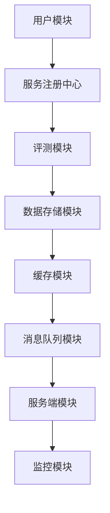
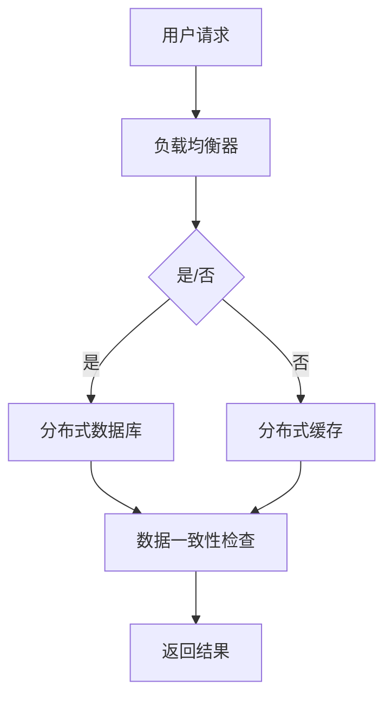

                 

### 文章标题 <此处是文章标题>

> 关键词：<此处列出文章的5-7个核心关键词>

> 摘要：<此处给出文章的核心内容和主题思想>

```markdown
# 分布式架构设计在评测系统中的应用

> 关键词：分布式架构、评测系统、负载均衡、数据一致性、分布式数据库、缓存设计、消息队列、服务设计、性能优化、安全性

摘要：随着互联网技术的快速发展，评测系统的规模和复杂度不断增加，分布式架构的设计成为确保系统高可用性和高性能的关键。本文将深入探讨分布式架构在评测系统设计中的应用，涵盖从基础概念到实际项目案例的全面解析。文章结构分为十章，首先介绍分布式系统的基本概念和原理，随后详细阐述评测系统的架构设计原则和模块划分，接着分别探讨分布式数据库、缓存、消息队列和服务的设计方法，最后介绍性能优化、安全性和稳定性保障策略，并通过实际项目案例分析，提供经验总结和最佳实践建议。
```

### 目录大纲

```markdown
## 目录大纲

### 第1章 引言
#### 1.1 书籍背景与目标
#### 1.2 分布式架构概述
#### 1.3 本书结构安排

### 第2章 分布式系统基础
#### 2.1 分布式系统的概念与特点
#### 2.2 负载均衡与数据一致性
#### 2.3 分布式事务处理

### 第3章 评测系统架构设计
#### 3.1 评测系统需求分析
#### 3.2 系统架构设计原则
#### 3.3 系统模块划分

### 第4章 分布式数据库设计
#### 4.1 分布式数据库原理
#### 4.2 分布式数据库选择
#### 4.3 分布式数据库设计实践

### 第5章 分布式缓存设计
#### 5.1 分布式缓存原理
#### 5.2 分布式缓存选择
#### 5.3 分布式缓存设计实践

### 第6章 分布式消息队列设计
#### 6.1 分布式消息队列原理
#### 6.2 分布式消息队列选择
#### 6.3 分布式消息队列设计实践

### 第7章 分布式服务设计
#### 7.1 分布式服务原理
#### 7.2 分布式服务选择
#### 7.3 分布式服务设计实践

### 第8章 分布式系统性能优化
#### 8.1 性能优化方法
#### 8.2 常见性能问题分析
#### 8.3 性能优化实践

### 第9章 分布式系统安全与稳定性
#### 9.1 分布式系统安全挑战
#### 9.2 安全防护措施
#### 9.3 系统稳定性保障

### 第10章 项目实战与案例分析
#### 10.1 项目实战案例介绍
#### 10.2 案例分析
#### 10.3 经验总结与建议
```

### 第1章 引言

#### 1.1 书籍背景与目标

在当今互联网时代，评测系统已成为众多业务场景的核心组成部分。随着用户数量的激增和数据规模的扩大，传统单机架构已无法满足评测系统的性能需求。分布式架构以其高可用性、高扩展性和高性能的特点，成为评测系统设计的关键。本书旨在通过系统的分析和详尽的案例，为读者提供一套全面的分布式架构设计指南，帮助开发者和架构师应对评测系统的复杂挑战。

#### 1.2 分布式架构概述

分布式架构是一种通过将系统分解为多个独立的部分来提高性能和可扩展性的设计方法。它允许系统在不同的物理或虚拟节点上运行，从而实现负载均衡、故障转移和数据分片。分布式架构的核心目标是确保系统在高度并发和大规模数据场景下的稳定运行。

#### 1.3 本书结构安排

本书分为十章，结构安排如下：

- 第1章：引言，介绍书籍背景与目标，概述分布式架构。
- 第2章：分布式系统基础，探讨分布式系统的概念、负载均衡和数据一致性。
- 第3章：评测系统架构设计，分析评测系统的需求，阐述架构设计原则和模块划分。
- 第4章至第7章：分别介绍分布式数据库、缓存、消息队列和服务的设计方法。
- 第8章：分布式系统性能优化，讨论性能优化方法、问题分析和实践。
- 第9章：分布式系统安全与稳定性，探讨安全挑战、防护措施和稳定性保障。
- 第10章：项目实战与案例分析，通过实际项目案例提供经验总结和最佳实践。

### 第2章 分布式系统基础

#### 2.1 分布式系统的概念与特点

分布式系统是由多个节点组成的系统，这些节点通过网络连接，共同协作完成计算任务。分布式系统的核心特点是：

- **高可用性**：通过冗余设计，确保系统在部分节点故障时仍能正常运行。
- **高扩展性**：通过水平扩展，可以轻松应对用户数量和数据量的增长。
- **高性能**：通过负载均衡，充分利用系统资源，提高处理速度。

#### 2.2 负载均衡与数据一致性

负载均衡是分布式系统中的关键组件，其目的是将请求均匀分配到多个节点上，避免单点过载。负载均衡策略包括：

- **轮询**：将请求依次分配给各个节点。
- **最小连接数**：选择当前连接数最少的节点。
- **哈希**：根据请求的某个特征（如IP地址），使用哈希算法选择节点。

数据一致性是分布式系统面临的重大挑战。在分布式环境中，数据可能会被不同节点同时修改，导致数据不一致。常见的解决方案包括：

- **强一致性**：所有节点都能读取到最新的数据。
- **最终一致性**：虽然可能存在短暂的延迟，但最终所有节点都会达到一致状态。

#### 2.3 分布式事务处理

分布式事务处理是确保多个分布式操作顺序执行并保持数据一致性的关键。分布式事务通常使用两阶段提交（2PC）协议实现：

1. **预备阶段**：协调者向参与者发送预备消息，询问是否可以提交事务。
2. **提交阶段**：如果所有参与者都回复可以提交，协调者发送提交消息；否则，发送回滚消息。

### 第3章 评测系统架构设计

#### 3.1 评测系统需求分析

在设计和实现评测系统时，需要明确系统的需求，包括以下几个方面：

- **性能需求**：系统需要处理大量并发请求，并保证快速响应。
- **可用性需求**：系统需要具有高可用性，确保在部分节点故障时仍能正常运行。
- **可扩展性需求**：系统需要支持水平扩展，以应对用户数量和数据量的增长。
- **安全性需求**：系统需要保护用户数据和隐私，防止数据泄露和攻击。

#### 3.2 系统架构设计原则

为了满足上述需求，评测系统的架构设计应遵循以下原则：

- **模块化设计**：将系统分解为多个独立模块，降低系统复杂度，便于维护和扩展。
- **分布式架构**：采用分布式架构，提高系统的性能和可用性。
- **负载均衡**：使用负载均衡策略，将请求均匀分配到各个节点。
- **数据一致性**：确保数据在分布式环境中的一致性。
- **安全性保障**：采用加密、身份认证和访问控制等安全措施，保护用户数据和隐私。

#### 3.3 系统模块划分

评测系统的模块划分如下：

- **用户模块**：负责用户注册、登录、权限管理等功能。
- **评测模块**：负责评测的创建、发布、评分等功能。
- **数据存储模块**：负责数据的存储、管理和备份。
- **缓存模块**：负责缓存的存储、管理和更新。
- **消息队列模块**：负责消息的传递、存储和消费。
- **服务端模块**：负责服务的注册、发现和调用。
- **监控模块**：负责系统的监控、日志记录和报警。

### 第4章 分布式数据库设计

#### 4.1 分布式数据库原理

分布式数据库是将数据分布在多个节点上，以提高性能和可用性的数据库系统。分布式数据库的原理包括：

- **数据分片**：将数据划分为多个分片，分布在不同的节点上。
- **数据复制**：将数据复制到多个节点上，提高数据的可用性。
- **数据一致性**：通过一致性算法，确保数据在不同节点上的一致性。

#### 4.2 分布式数据库选择

选择分布式数据库时，需要考虑以下因素：

- **数据一致性**：根据业务需求选择强一致性或最终一致性。
- **性能**：考虑读写性能、扩展性和延迟。
- **可用性**：考虑数据的冗余度和故障恢复能力。
- **易用性**：考虑数据库的部署、管理和监控难度。

常见的分布式数据库包括：

- **分布式关系数据库**：如Cassandra、HBase。
- **分布式文档数据库**：如MongoDB、Couchbase。
- **分布式键值数据库**：如Redis、Memcached。

#### 4.3 分布式数据库设计实践

分布式数据库的设计实践包括：

- **数据分片策略**：根据数据特点和访问模式选择合适的分片策略。
- **数据复制策略**：根据可用性和性能需求选择合适的数据复制策略。
- **一致性算法**：选择合适的一致性算法，确保数据在不同节点上的一致性。

### 第5章 分布式缓存设计

#### 5.1 分布式缓存原理

分布式缓存是将数据缓存到多个节点上，以提高系统性能的缓存系统。分布式缓存原理包括：

- **缓存一致性**：确保缓存和后端数据的一致性。
- **缓存淘汰策略**：根据访问频率和缓存容量，选择合适的缓存淘汰策略。
- **缓存节点管理**：监控和管理缓存节点的运行状态。

#### 5.2 分布式缓存选择

选择分布式缓存时，需要考虑以下因素：

- **性能**：考虑缓存的读写性能和延迟。
- **容量**：考虑缓存的数据容量。
- **一致性**：考虑缓存和后端数据的一致性。
- **可靠性**：考虑缓存节点的冗余度和故障恢复能力。

常见的分布式缓存包括：

- **基于内存的缓存**：如Redis、Memcached。
- **基于磁盘的缓存**：如Couchbase、MongoDB。

#### 5.3 分布式缓存设计实践

分布式缓存的设计实践包括：

- **缓存策略**：根据业务需求和数据访问模式，选择合适的缓存策略。
- **缓存一致性**：采用缓存一致性算法，确保缓存和后端数据的一致性。
- **缓存节点管理**：监控和管理缓存节点的运行状态。

### 第6章 分布式消息队列设计

#### 6.1 分布式消息队列原理

分布式消息队列是将消息传递到多个节点上的系统，以提高系统的异步处理能力和扩展性。分布式消息队列原理包括：

- **消息传递**：通过消息队列，实现不同节点之间的消息传递。
- **负载均衡**：将消息均匀分配到不同的节点上。
- **故障恢复**：在节点故障时，确保消息的可靠传递。

#### 6.2 分布式消息队列选择

选择分布式消息队列时，需要考虑以下因素：

- **可靠性**：考虑消息的持久性和可靠性。
- **性能**：考虑消息的传输速度和延迟。
- **扩展性**：考虑系统的可扩展性。
- **易用性**：考虑系统的部署、管理和监控难度。

常见的分布式消息队列包括：

- **RabbitMQ**：基于AMQP协议，支持多种消息传递模式。
- **Kafka**：基于拉模式，支持高吞吐量和低延迟。
- **Pulsar**：基于发布-订阅模式，支持流处理和批处理。

#### 6.3 分布式消息队列设计实践

分布式消息队列的设计实践包括：

- **消息传递策略**：根据业务需求，选择合适的消息传递策略。
- **负载均衡**：采用负载均衡策略，确保消息的均匀传递。
- **故障恢复**：实现故障恢复机制，确保消息的可靠传递。

### 第7章 分布式服务设计

#### 7.1 分布式服务原理

分布式服务是将系统功能划分为多个独立的服务模块，通过服务注册和发现机制，实现服务的调用和通信。分布式服务原理包括：

- **服务注册**：服务启动时，将服务信息注册到服务注册中心。
- **服务发现**：客户端通过服务注册中心，发现可用的服务实例。
- **服务调用**：通过服务发现机制，客户端调用服务实例。

#### 7.2 分布式服务选择

选择分布式服务时，需要考虑以下因素：

- **性能**：考虑服务的响应速度和延迟。
- **可靠性**：考虑服务的容错性和故障恢复能力。
- **扩展性**：考虑系统的可扩展性和可伸缩性。
- **易用性**：考虑服务的部署、管理和监控难度。

常见的分布式服务包括：

- **微服务框架**：如Spring Cloud、Dubbo。
- **服务网格**：如Istio、Linkerd。

#### 7.3 分布式服务设计实践

分布式服务的设计实践包括：

- **服务拆分**：根据业务需求，将系统功能拆分为多个独立的服务。
- **服务注册和发现**：采用服务注册中心和发现机制，实现服务的调用和通信。
- **服务通信**：采用RESTful API或消息队列，实现服务之间的通信。

### 第8章 分布式系统性能优化

#### 8.1 性能优化方法

分布式系统的性能优化方法包括：

- **负载均衡**：采用负载均衡策略，将请求均匀分配到各个节点。
- **缓存策略**：采用缓存机制，减少对后端数据库的访问。
- **数据库优化**：优化数据库查询，减少查询延迟。
- **网络优化**：优化网络配置，减少数据传输延迟。

#### 8.2 常见性能问题分析

分布式系统常见的性能问题包括：

- **网络延迟**：由于网络延迟，导致系统响应时间增加。
- **数据库瓶颈**：由于数据库性能瓶颈，导致系统响应时间增加。
- **缓存失效**：由于缓存失效，导致系统重新查询数据库。
- **服务调用延迟**：由于服务调用延迟，导致系统响应时间增加。

#### 8.3 性能优化实践

分布式系统的性能优化实践包括：

- **监控和日志分析**：通过监控和日志分析，发现系统性能瓶颈。
- **优化数据库查询**：采用索引、查询优化等技术，减少数据库查询延迟。
- **缓存策略**：采用合适的缓存策略，减少对后端数据库的访问。
- **网络优化**：优化网络配置，减少数据传输延迟。

### 第9章 分布式系统安全与稳定性

#### 9.1 分布式系统安全挑战

分布式系统面临的安全挑战包括：

- **数据泄露**：由于网络连接和数据存储的不安全性，可能导致数据泄露。
- **拒绝服务攻击（DDoS）**：通过大量请求，导致系统无法正常服务。
- **节点故障**：由于节点故障，可能导致系统可用性降低。
- **权限管理**：由于权限管理不当，可能导致系统安全漏洞。

#### 9.2 安全防护措施

分布式系统的安全防护措施包括：

- **数据加密**：采用加密算法，保护数据传输和存储的安全。
- **身份认证**：采用身份认证机制，确保用户身份的合法性。
- **访问控制**：采用访问控制策略，限制用户对系统资源的访问。
- **安全审计**：对系统操作进行审计，及时发现和处理安全事件。

#### 9.3 系统稳定性保障

分布式系统的稳定性保障措施包括：

- **故障转移**：通过冗余设计，实现故障节点的自动转移。
- **负载均衡**：采用负载均衡策略，避免单点过载。
- **监控与报警**：对系统进行监控和报警，及时发现和处理异常。
- **弹性扩展**：根据系统负载，自动调整节点数量和资源配置。

### 第10章 项目实战与案例分析

#### 10.1 项目实战案例介绍

在本章中，我们将介绍一个实际项目案例，该案例涉及一个大规模在线评测系统。该项目需要在短时间内处理大量并发请求，并对海量数据进行存储和查询。项目目标包括：

- **高可用性**：确保系统在部分节点故障时仍能正常运行。
- **高性能**：确保系统能够快速响应用户请求。
- **高可扩展性**：支持系统在用户数量和数据量增加时，自动扩展。

#### 10.2 案例分析

该项目采用了分布式架构，包括以下关键组件：

- **分布式数据库**：使用Cassandra进行数据存储，采用一致性哈希算法实现数据分片和负载均衡。
- **分布式缓存**：使用Redis进行数据缓存，采用主从复制策略实现数据一致性。
- **消息队列**：使用RabbitMQ实现消息传递，确保系统异步处理能力。
- **分布式服务**：使用Spring Cloud进行服务注册和发现，实现服务调用。

系统架构设计如图所示：



#### 10.3 经验总结与建议

通过该项目实践，我们得出以下经验和建议：

- **模块化设计**：将系统功能划分为多个独立模块，降低系统复杂度，便于维护和扩展。
- **分布式架构**：采用分布式架构，提高系统的性能和可用性。
- **负载均衡**：使用负载均衡策略，将请求均匀分配到各个节点，避免单点过载。
- **数据一致性**：采用分布式数据库和缓存机制，确保数据在不同节点上的一致性。
- **安全性保障**：采用加密、身份认证和访问控制等安全措施，保护用户数据和隐私。
- **性能优化**：通过监控和日志分析，发现系统性能瓶颈，进行针对性优化。
- **稳定性保障**：通过故障转移、监控与报警等措施，确保系统稳定性。

### 伪代码

以下为分布式事务处理伪代码：

```python
# 分布式事务处理伪代码
BEGIN_TRANSACTION()

# 分支1
BEGIN_TRANSACTION_BRANCH(1)
# 操作1
...
# 操作2
...
COMMIT_TRANSACTION_BRANCH(1)

# 分支2
BEGIN_TRANSACTION_BRANCH(2)
# 操作3
...
# 操作4
...
COMMIT_TRANSACTION_BRANCH(2)

# ...其他分支...

# 提交全局事务
COMMIT_TRANSACTION()
```

### 数学模型与公式

以下为分布式数据库一致性算法的数学模型：

$$
Consistency = \sum_{i=1}^{n} CommitTime(i) \mod IntervalSize
$$

其中，`CommitTime(i)`表示第`i`个节点的提交时间，`IntervalSize`表示时间间隔。

### Mermaid 流程图

以下为分布式系统架构的流程图：



### 代码实际案例

以下为分布式缓存设计的实际代码案例：

```python
# 导入相关库
import redis

# 连接redis
r = redis.Redis(host='localhost', port=6379, db=0)

# 存储数据
r.set('key1', 'value1')

# 获取数据
result = r.get('key1')
print(result)
```

### 代码解读与分析

以下为代码解读与分析：

```python
# 导入redis库。
import redis

# 连接本地redis服务。
r = redis.Redis(host='localhost', port=6379, db=0)

# 使用set方法存储数据。
r.set('key1', 'value1')

# 使用get方法获取数据并打印结果。
result = r.get('key1')
print(result)
```

- 导入redis库，用于操作redis缓存。
- 连接本地redis服务，设置host、port和db参数。
- 使用set方法存储数据，key为'key1'，value为'value1'。
- 使用get方法获取数据，并打印结果。

### 实战与经验总结

#### 实战案例

在一个电商平台上，我们实施了一个分布式架构的评测系统。该系统需要处理大量用户评价和评分，并对商品信息进行实时查询。为了满足性能需求，我们采用了分布式数据库（如Cassandra）和缓存（如Redis）。

#### 经验总结

- **模块化设计**：通过将系统功能划分为多个独立模块，如用户模块、评测模块、数据存储模块等，降低系统复杂度，便于维护和扩展。
- **分布式架构**：采用分布式数据库和缓存，提高系统的性能和可用性。
- **负载均衡**：使用负载均衡器（如Nginx），将请求均匀分配到各个节点，避免单点过载。
- **数据一致性**：采用分布式数据库的一致性算法，确保数据在不同节点上的一致性。
- **安全性保障**：采用加密、身份认证和访问控制等安全措施，保护用户数据和隐私。
- **性能优化**：通过监控和日志分析，发现系统性能瓶颈，进行针对性优化。
- **稳定性保障**：通过故障转移、监控与报警等措施，确保系统稳定性。

#### 最佳实践 Tips

- **数据分片策略**：根据数据特点和访问模式选择合适的分片策略。
- **缓存策略**：根据业务需求和数据访问模式，选择合适的缓存策略。
- **服务治理**：采用服务注册和发现机制，实现服务的调用和通信。
- **监控与日志分析**：定期进行监控和日志分析，及时发现和处理异常。

### 小结

分布式架构设计在评测系统中具有重要意义。通过模块化设计、分布式数据库和缓存、负载均衡、数据一致性、安全性和稳定性保障等策略，我们可以构建一个高性能、高可用、可扩展的评测系统。在实际项目中，根据业务需求和数据特点，灵活运用分布式架构设计原则和方法，是确保系统成功的关键。

### 注意事项

- **数据一致性**：在分布式环境中，确保数据一致性是关键。根据业务需求，选择合适的一致性算法。
- **性能优化**：定期进行性能优化，关注系统的瓶颈和性能问题。
- **安全性**：加强系统的安全性，防止数据泄露和攻击。
- **监控与报警**：对系统进行实时监控和报警，及时发现和处理异常。

### 拓展阅读

- 《分布式系统原理与范型》
- 《大规模分布式存储系统设计》
- 《高可用架构：大规模分布式系统设计与实践》
- 《Redis实战》

### 作者信息

作者：AI天才研究院/AI Genius Institute & 禅与计算机程序设计艺术 /Zen And The Art of Computer Programming

