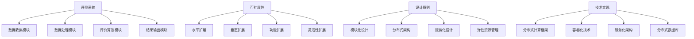

                 

### 背景介绍

随着互联网技术的飞速发展，评测系统在各类应用场景中变得愈发重要。无论是教育、金融、医疗还是电子商务，评测系统都扮演着至关重要的角色。然而，随着数据量的激增和应用需求的多样化，传统的评测系统逐渐暴露出其不可扩展性，导致性能瓶颈、维护成本上升以及用户体验下降。

不可扩展性的问题主要体现在以下几个方面：

1. **性能瓶颈**：当数据量达到一定规模时，传统的评测系统可能会因为处理能力的限制而出现响应迟缓甚至崩溃的情况。

2. **扩展成本高**：为了提升系统的处理能力，可能需要购置昂贵的硬件设备，或者重新编写和优化系统代码，这无疑增加了开发和维护的成本。

3. **用户体验差**：由于系统无法快速响应用户的请求，用户体验会大打折扣，从而影响业务的持续发展。

4. **系统可维护性差**：随着系统复杂度的增加，维护难度也随之上升，容易引发各类问题，降低系统的稳定性和可靠性。

因此，设计和实现一个具有高度可扩展性的评测系统成为了当前研究和应用的热点。本文旨在探讨评测系统的可扩展性设计，分析其核心概念、设计原则、技术实现方法，并通过项目实战来展示如何在实际场景中应用这些原则和方法。

### 核心概念

为了深入理解评测系统的可扩展性设计，我们首先需要明确几个核心概念：评测系统、可扩展性、设计原则和技术实现。

#### 评测系统

评测系统是指用于对某个对象进行评价、评分或分析的系统，它通常包括数据收集、处理、分析和输出等环节。具体来说，一个典型的评测系统包含以下几个部分：

1. **数据收集模块**：负责收集各种来源的数据，如用户输入、传感器数据、第三方数据接口等。

2. **数据处理模块**：对收集到的数据进行预处理、清洗、转换等操作，以便后续分析。

3. **评价算法模块**：根据特定的业务需求，应用相应的算法模型对数据进行分析和评价，如机器学习算法、统计分析方法等。

4. **结果输出模块**：将评价结果以可视化的形式展示给用户，如图表、报表等。

#### 可扩展性

可扩展性是指系统在需求变化时，能够灵活调整和扩展其功能的能力。具体来说，可扩展性包括以下几个方面：

1. **水平扩展（Scaling Out）**：通过增加系统的节点数量来提高系统的处理能力和负载能力。例如，在分布式计算框架中，通过增加服务器节点来实现处理能力的线性扩展。

2. **垂直扩展（Scaling Up）**：通过提升单个节点的处理能力来提高系统的整体性能。例如，通过升级服务器的CPU、内存和存储设备来提升其性能。

3. **功能扩展**：在系统设计时，预留扩展接口和模块，以便在需求变化时，可以快速集成新的功能模块。

4. **灵活性扩展**：系统应具备灵活的配置和管理能力，以便在运行时动态调整和优化系统资源。

#### 设计原则

为了设计一个具有高度可扩展性的评测系统，我们需要遵循一系列设计原则。这些原则主要包括：

1. **模块化设计**：将系统划分为若干独立模块，每个模块负责特定的功能，模块之间通过接口进行通信。这样，在需求变化时，可以独立地扩展或替换某个模块，而不影响其他部分。

2. **分布式架构**：采用分布式架构，将系统的处理任务分布在多个节点上，以提高系统的处理能力和负载能力。分布式架构还可以提高系统的容错性和可扩展性。

3. **服务化设计**：将系统功能拆分成多个微服务，每个微服务负责特定的功能模块，并通过API进行通信。这样，在需求变化时，可以灵活地调整和扩展微服务的功能。

4. **弹性资源管理**：采用弹性资源管理策略，根据系统的实际负载动态调整资源分配，以实现高效利用资源。

#### 技术实现

实现一个可扩展的评测系统需要选择合适的技术方案。以下是一些常用的技术实现方法：

1. **分布式计算框架**：如Apache Hadoop、Apache Spark等，用于大规模数据处理和分布式计算。

2. **容器化技术**：如Docker、Kubernetes等，用于实现应用程序的容器化部署和管理，提高系统的可扩展性和灵活性。

3. **服务化架构**：如微服务架构、RESTful API等，用于实现系统的模块化和服务化设计。

4. **分布式数据库**：如Apache Cassandra、MongoDB等，用于实现海量数据的存储和管理。

### 关联与架构

为了更好地理解这些核心概念之间的关系，我们可以使用Mermaid流程图来展示它们的关联与架构。



### 结论

本文简要介绍了评测系统的核心概念、可扩展性设计原则和技术实现方法。通过明确这些概念和关系，我们可以更好地理解和设计一个具有高度可扩展性的评测系统。接下来，我们将深入探讨每个概念的具体细节，并提供实际案例来展示这些概念的应用。

## 评测系统概述

### 定义与组成部分

评测系统是指用于对某个对象进行评价、评分或分析的系统，它通常包括数据收集、处理、分析和输出等环节。一个典型的评测系统可以划分为以下几个主要组成部分：

1. **数据收集模块**：数据收集模块是评测系统的数据入口，负责从各种渠道收集数据。这些数据来源可能包括用户输入、传感器数据、第三方数据接口等。数据收集模块的主要任务是对数据进行初步的采集和预处理，以确保数据的完整性和准确性。

2. **数据处理模块**：数据处理模块负责对收集到的数据进行清洗、转换和整合等处理操作。这一步骤至关重要，因为只有经过准确处理的数据才能为后续的评价和分析提供可靠的依据。数据处理模块通常包括数据清洗、去重、格式转换、数据归一化等子模块。

3. **评价算法模块**：评价算法模块是评测系统的核心部分，根据特定的业务需求，应用相应的算法模型对数据进行分析和评价。常见的评价算法包括机器学习算法、统计分析方法、神经网络模型等。评价算法模块需要根据实际应用场景进行定制和优化，以实现高效和准确的评价结果。

4. **结果输出模块**：结果输出模块负责将评价结果以可视化的形式展示给用户，如图表、报表等。结果输出模块不仅要确保结果的清晰易懂，还要具备良好的交互体验，使用户能够方便地查看和分析数据。

### 功能

评测系统的功能主要包括以下几个方面：

1. **数据收集与预处理**：系统通过数据收集模块从各种渠道获取数据，并进行初步的清洗和预处理，以确保数据的质量。

2. **数据分析和评价**：系统使用评价算法模块对预处理后的数据进行深入分析，并根据业务需求生成相应的评价结果。

3. **结果展示和反馈**：系统通过结果输出模块将评价结果以图表、报表等形式展示给用户，并提供反馈机制，使用户能够及时了解系统的运行状态和结果。

4. **系统监控与维护**：评测系统需要具备良好的监控和维护功能，以便实时监测系统的运行状态，及时处理异常情况，确保系统的稳定性和可靠性。

### 评测系统的设计目标

评测系统的设计目标主要包括以下几点：

1. **高效性**：系统需要能够快速处理大量数据，提供准确的评价结果。

2. **可扩展性**：系统应具备良好的可扩展性，能够在需求变化时灵活调整和扩展功能。

3. **可靠性**：系统需要具备高度的可靠性，确保在长时间运行过程中不会出现严重的故障。

4. **易用性**：系统应提供简单易用的操作界面，使用户能够方便地使用系统进行数据收集、分析和评价。

5. **可维护性**：系统设计应考虑未来维护和升级的便利性，降低维护成本。

通过上述设计目标，评测系统可以更好地满足不同业务场景的需求，为用户带来更高的价值和体验。

## 可扩展性的重要性

在设计和实现评测系统时，可扩展性是一个至关重要的考量因素。可扩展性不仅决定了系统在当前环境下的性能和稳定性，还直接影响到系统在未来环境中的适应能力和持续发展。

### 性能提升

可扩展性首先体现在性能的提升上。一个具有高度可扩展性的评测系统能够在数据量和处理需求增加时，通过水平扩展或垂直扩展来提高系统的处理能力。例如，通过增加服务器节点或升级单个服务器的硬件配置，系统可以线性地提升其处理性能，从而满足日益增长的业务需求。

### 灵活应对需求变化

业务需求往往不是一成不变的，随着市场环境的变化和用户需求的多样化，评测系统需要能够快速适应这些变化。可扩展性使得系统能够灵活地调整和扩展其功能模块，以满足新的业务需求。例如，当某个业务模块需要新增功能时，可以通过扩展现有模块或引入新的模块来实现，而无需对整个系统进行大规模重构。

### 降低成本

可扩展性还能有效降低系统的总体成本。通过使用模块化和分布式架构，系统可以在不增加大量硬件资源的情况下，通过优化资源利用率和负载均衡来提高性能。此外，模块化的设计使得系统维护和升级变得更加容易和高效，从而降低了长期运营成本。

### 提高用户体验

在用户体验方面，可扩展性同样发挥着重要作用。一个具有良好可扩展性的评测系统可以在处理大量数据时保持响应速度，确保用户在使用过程中获得流畅的体验。这对于提升用户满意度和业务竞争力至关重要。

### 构建可靠架构

可扩展性也是构建可靠架构的关键因素。通过引入冗余设计和负载均衡策略，系统可以在面对突发流量或节点故障时，保持服务的稳定性和可用性。这种高可用性的架构设计能够为系统的长期运行提供坚实保障。

综上所述，可扩展性是评测系统设计中的核心要素，它不仅能够提升系统的性能和灵活性，还能有效降低成本、提高用户体验，并构建一个可靠的架构。因此，在设计和实现评测系统时，我们必须充分考虑可扩展性，以确保系统能够在不断变化的环境中保持高效运行。

### 可扩展性设计原则

为了实现一个具有高度可扩展性的评测系统，我们需要遵循一系列设计原则。这些原则不仅有助于提升系统的性能和灵活性，还能确保系统在未来的发展中具备良好的扩展性。以下是几个关键的设计原则：

#### 模块化设计

模块化设计是将系统划分为多个独立的功能模块，每个模块负责特定的功能。模块之间通过清晰的接口进行通信，实现功能的分离和复用。模块化设计具有以下几个优点：

1. **灵活性**：模块化设计使得系统在需求变化时能够灵活调整和扩展。例如，当某个业务需求发生变化时，可以单独修改或替换相关的模块，而无需对整个系统进行大规模重构。
2. **可维护性**：模块化设计使得系统更容易维护和更新。每个模块都是独立的，可以在不影响其他模块的情况下进行修复或升级，从而提高系统的稳定性和可靠性。
3. **复用性**：模块化设计促进了代码的复用，减少了冗余开发工作。模块可以被多个系统或项目复用，从而提高开发效率。

#### 分布式架构

分布式架构是将系统的处理任务分布在多个节点上，通过分布式计算和数据存储来实现高性能和高可用性。以下是分布式架构的几个关键要素：

1. **负载均衡**：通过负载均衡策略，将请求均匀分配到多个节点上，避免单个节点过载，从而提高系统的处理能力和响应速度。
2. **数据一致性**：在分布式系统中，数据一致性是一个重要问题。可以使用分布式事务管理、数据复制和分片等技术来确保数据的一致性。
3. **容错性**：分布式架构可以通过冗余设计、故障检测和自动恢复机制来提高系统的容错性。当某个节点发生故障时，系统可以自动切换到其他健康的节点，确保服务的持续运行。

#### 服务化设计

服务化设计是将系统功能拆分成多个独立的微服务，每个微服务负责特定的功能模块。服务化设计具有以下几个优点：

1. **灵活部署**：服务化设计使得系统可以独立部署和扩展每个微服务，从而提高系统的灵活性和可扩展性。例如，当某个微服务的负载增加时，可以单独增加该服务的实例数量。
2. **独立升级**：服务化设计使得系统可以在不影响其他服务的情况下独立升级某个服务，从而提高系统的稳定性和可靠性。
3. **松耦合**：服务化设计通过定义清晰的接口实现服务之间的松耦合，降低系统组件之间的依赖关系，从而提高系统的可维护性和可扩展性。

#### 弹性资源管理

弹性资源管理是指根据系统的实际负载动态调整资源分配，以实现高效利用资源。以下是弹性资源管理的几个关键要素：

1. **自动扩展**：系统可以根据当前的负载情况自动增加或减少资源，例如，通过容器编排工具（如Kubernetes）来实现自动扩展。
2. **资源池化**：将系统中的各种资源（如计算资源、存储资源等）池化，以便在需要时进行动态分配和调整。
3. **资源监控**：通过监控工具实时监控系统的资源使用情况，及时发现资源瓶颈和异常情况，并采取相应的措施进行优化。

#### 高效的数据处理

高效的数据处理是评测系统可扩展性的重要组成部分。以下是几个关键要素：

1. **分布式计算**：使用分布式计算框架（如Apache Spark、Apache Hadoop）来处理大规模数据，提高数据处理速度和性能。
2. **数据分片**：将大规模数据集分片到多个节点上进行处理，提高数据处理的并行度和效率。
3. **数据缓存**：通过数据缓存技术（如Redis、Memcached）来提高数据的访问速度，减少数据访问的延迟。

#### 安全性和隐私保护

在可扩展性设计中，安全性和隐私保护也是不可忽视的重要因素。以下是几个关键要素：

1. **数据加密**：对敏感数据进行加密存储和传输，确保数据的安全性和隐私保护。
2. **身份认证和授权**：实现严格的身份认证和授权机制，确保只有授权用户才能访问系统资源和数据。
3. **安全审计**：对系统进行定期安全审计，及时发现和修复安全漏洞，确保系统的安全性。

通过遵循上述设计原则，我们可以构建一个具有高度可扩展性的评测系统，从而满足不断变化的需求，实现高效、稳定和可靠的服务。

### 可扩展性设计中的挑战与解决方法

在可扩展性设计中，虽然已经提出了许多原则和方法，但实际实施过程中仍然会面临一系列挑战。以下是一些常见的问题及相应的解决方法：

#### 1. 负载均衡

**问题**：如何确保系统在处理高并发请求时，各个节点能够均衡地分担负载？

**解决方法**：采用负载均衡算法（如轮询、最小连接数、IP哈希等），根据请求的特点和节点的处理能力动态分配请求。此外，可以使用分布式负载均衡器（如Nginx、HAProxy）来管理流量分配。

#### 2. 数据一致性

**问题**：在分布式系统中，如何确保数据在不同节点之间的一致性？

**解决方法**：采用分布式事务管理（如两阶段提交、最终一致性等），通过事务日志和一致性协议来保证数据的一致性。此外，可以使用分布式数据存储系统（如Apache Cassandra、MongoDB）来支持高可用性和数据一致性。

#### 3. 容错性

**问题**：如何确保系统在面对节点故障时，仍能保持服务的可用性？

**解决方法**：采用冗余设计（如主从备份、数据复制等），确保关键组件在发生故障时能够自动切换到备用节点。此外，可以使用自动化故障检测和恢复机制（如Kubernetes的自动化恢复功能）来提高系统的容错性。

#### 4. 高效数据处理

**问题**：如何处理大规模数据以提高系统性能？

**解决方法**：采用分布式计算框架（如Apache Spark、Apache Hadoop）来处理大规模数据，提高数据处理的并行度和效率。此外，可以使用数据分片和数据缓存技术（如Redis、Memcached）来优化数据访问速度。

#### 5. 安全性和隐私保护

**问题**：如何确保系统中的数据安全和用户隐私？

**解决方法**：采用数据加密（如AES加密、SSL/TLS传输加密等）来保护数据在传输和存储过程中的安全性。此外，实现严格的身份认证和授权机制（如OAuth 2.0、JWT等），确保只有授权用户才能访问系统资源和数据。

#### 6. 资源管理和监控

**问题**：如何高效地管理和监控系统的资源使用情况？

**解决方法**：采用自动化资源管理工具（如Kubernetes、Docker Swarm等），根据实际负载动态调整资源分配。此外，使用监控工具（如Prometheus、Grafana等）来实时监控系统的性能和资源使用情况，及时发现和解决潜在问题。

通过解决这些挑战，我们可以设计和实现一个具备高度可扩展性的评测系统，从而满足不断变化的需求，确保系统的稳定性和可靠性。

### 技术实现方法

实现一个具有高度可扩展性的评测系统需要选择合适的技术方案。以下是一些常用的技术实现方法，包括分布式计算框架、容器化技术、服务化架构和分布式数据库等。

#### 分布式计算框架

分布式计算框架如Apache Hadoop和Apache Spark是处理大规模数据的重要工具。Hadoop基于HDFS分布式文件系统和MapReduce编程模型，能够高效地处理海量数据。Spark则基于内存计算和弹性分布式数据集（RDD）模型，提供了更高效的分布式数据处理能力。

1. **Hadoop**：
   - **架构**：Hadoop由HDFS（分布式文件系统）、YARN（资源调度框架）和MapReduce（数据处理模型）组成。
   - **优点**：高可靠性、高扩展性、适用于大规模数据处理。
   - **应用场景**：日志分析、数据挖掘、机器学习等。

2. **Spark**：
   - **架构**：Spark包括Spark Core（提供内存计算和任务调度）、Spark SQL（提供结构化数据处理）、Spark Streaming（提供实时数据处理）等模块。
   - **优点**：内存计算，数据处理速度快，易于集成。
   - **应用场景**：实时数据流处理、交互式查询、机器学习等。

#### 容器化技术

容器化技术如Docker和Kubernetes为微服务架构提供了灵活的部署和管理方式。

1. **Docker**：
   - **架构**：Docker通过容器（Container）封装应用程序及其运行环境，实现应用程序的隔离和轻量级部署。
   - **优点**：部署灵活、轻量级、易于迁移。
   - **应用场景**：微服务部署、持续集成和持续部署（CI/CD）。

2. **Kubernetes**：
   - **架构**：Kubernetes是一个开源的容器编排和管理工具，用于自动化容器的部署、扩展和管理。
   - **优点**：自动化部署和扩展、高可用性、资源调度优化。
   - **应用场景**：大规模容器化应用的管理、集群管理、负载均衡。

#### 服务化架构

服务化架构如微服务架构（Microservices Architecture）和RESTful API为系统的模块化和分布式提供了支持。

1. **微服务架构**：
   - **架构**：微服务架构将应用程序拆分成多个独立的微服务，每个微服务负责特定的业务功能，并通过API进行通信。
   - **优点**：模块化、松耦合、灵活扩展、易于维护。
   - **应用场景**：电子商务、金融交易、社交媒体等。

2. **RESTful API**：
   - **架构**：RESTful API是一种基于HTTP协议的API设计风格，用于实现微服务之间的通信。
   - **优点**：简单易用、灵活、跨平台。
   - **应用场景**：前端与后端通信、跨系统数据交换、第三方系统集成。

#### 分布式数据库

分布式数据库如Apache Cassandra和MongoDB为海量数据的存储和管理提供了支持。

1. **Cassandra**：
   - **架构**：Cassandra是一个分布式NoSQL数据库，采用分布式数据存储和分布式计算模型。
   - **优点**：高可用性、线性扩展、数据一致性。
   - **应用场景**：实时分析、大规模数据处理、日志存储。

2. **MongoDB**：
   - **架构**：MongoDB是一个分布式文档数据库，提供灵活的数据模型和高效的查询能力。
   - **优点**：易扩展、高性能、灵活的数据模型。
   - **应用场景**：大数据存储、实时数据管理、内容管理系统。

通过选择合适的技术方案，可以有效地实现一个具有高度可扩展性的评测系统，从而满足不断变化的需求，提供稳定、高效的服务。

### 项目实战：评测系统的设计实现

为了更好地理解和应用评测系统的可扩展性设计，以下我们将通过一个实际项目来展示评测系统的设计实现过程。这个项目的目标是构建一个可扩展性强的在线考试系统，支持大规模用户并发考试和实时成绩分析。

#### 项目需求分析

在开始项目之前，我们需要明确项目的需求：

1. **高并发处理**：系统需要支持数千用户同时在线考试，处理大量并发请求。
2. **实时成绩分析**：系统需要能够实时收集并分析考试成绩，提供详细的成绩报表和统计分析。
3. **可扩展性**：系统设计应具备良好的可扩展性，支持未来用户规模的扩展和功能的增加。

#### 系统架构设计

为了实现上述需求，我们采用分布式架构和微服务架构，具体系统架构如下：

1. **用户模块**：负责用户的注册、登录和权限管理，采用RESTful API与前端进行通信。
2. **考试模块**：负责考试题目的管理、考试的开始和结束控制，以及考试过程的监控。
3. **成绩模块**：负责收集考试成绩、实时分析成绩，并提供成绩报表和统计功能。
4. **缓存模块**：使用Redis缓存考试成绩和用户信息，提高数据访问速度。
5. **数据库模块**：使用MongoDB存储用户信息、考试题目和成绩数据。

#### 技术选型

为了实现项目需求，我们选择了以下技术：

1. **前端技术**：Vue.js框架，用于构建用户友好的界面。
2. **后端技术**：Node.js和Express.js框架，用于构建微服务。
3. **数据库**：MongoDB，用于存储大规模数据。
4. **缓存**：Redis，用于缓存数据，提高访问速度。
5. **消息队列**：RabbitMQ，用于异步处理成绩分析任务。
6. **负载均衡**：Nginx，用于负载均衡和反向代理。

#### 系统实现细节

**1. 用户模块**

用户模块包括用户注册、登录和权限管理功能。用户注册时，将用户信息存储到MongoDB数据库中，登录时通过验证用户身份。为了提高系统性能，用户信息和登录令牌（JWT）使用Redis进行缓存。

```javascript
// 用户注册
app.post('/register', async (req, res) => {
    const user = req.body;
    // 验证用户信息，存储到MongoDB
    // ...
    res.json({ status: 'success', message: '注册成功' });
});

// 用户登录
app.post('/login', async (req, res) => {
    const { username, password } = req.body;
    // 验证用户信息，生成JWT令牌
    // ...
    res.json({ token: jwtToken });
});
```

**2. 考试模块**

考试模块负责管理考试题目的生成和考试过程的监控。考试开始时，系统随机生成一套试题，考试结束后，系统自动收集考试成绩。考试模块使用Redis缓存试题和考试成绩，以提高系统性能。

```javascript
// 生成试题
app.post('/exam/start', async (req, res) => {
    const questions = await getExamQuestions();
    // 存储到Redis缓存
    redisClient.set('exam_questions', JSON.stringify(questions));
    res.json({ status: 'success', message: '考试开始' });
});

// 结束考试
app.post('/exam/finish', async (req, res) => {
    const answers = req.body.answers;
    // 存储到MongoDB和Redis缓存
    // ...
    res.json({ status: 'success', message: '考试结束' });
});
```

**3. 成绩模块**

成绩模块负责收集考试成绩，并使用RabbitMQ消息队列进行异步处理，生成成绩报表和统计分析。成绩模块使用Redis缓存考试成绩，以提高数据访问速度。

```javascript
// 收集考试成绩
app.post('/exam/grade', async (req, res) => {
    const examId = req.body.examId;
    const studentId = req.body.studentId;
    const grade = req.body.grade;
    // 存储到MongoDB和Redis缓存
    // ...
    // 发送消息到RabbitMQ进行成绩分析
    rabbitMQClient.sendMessage('grade_analysis', { examId, studentId, grade });
    res.json({ status: 'success', message: '成绩收集成功' });
});

// 成绩分析
app.get('/exam/grade/report', async (req, res) => {
    const examId = req.query.examId;
    // 从RabbitMQ获取成绩分析结果
    // ...
    res.json({ report: gradeReport });
});
```

**4. 缓存模块**

缓存模块使用Redis缓存用户信息、考试题目和考试成绩，以提高系统性能。

```javascript
// 获取用户信息
const userInfo = await redisClient.get('user:' + userId);
const user = JSON.parse(userInfo);

// 获取考试题目
const questions = await redisClient.get('exam_questions');
const examQuestions = JSON.parse(questions);

// 获取考试成绩
const grades = await redisClient.lrange('exam_grades', 0, -1);
const gradeList = grades.map(grade => JSON.parse(grade));
```

**5. 数据库模块**

数据库模块使用MongoDB存储用户信息、考试题目和考试成绩。

```javascript
// 用户注册
const user = new User({
    username: req.body.username,
    password: hashPassword(req.body.password),
    email: req.body.email
});
await user.save();

// 考试题目
const question = new Question({
    examId: req.body.examId,
    question: req.body.question,
    options: req.body.options,
    answer: req.body.answer
});
await question.save();

// 成绩存储
const grade = new Grade({
    examId: req.body.examId,
    studentId: req.body.studentId,
    grade: req.body.grade
});
await grade.save();
```

#### 项目小结

通过本项目，我们实现了具有高度可扩展性的在线考试系统，支持大规模用户并发考试和实时成绩分析。系统架构采用了分布式架构和微服务架构，结合了多种技术实现，包括Node.js、MongoDB、Redis和RabbitMQ等。项目实战展示了如何将可扩展性设计原则和技术实现方法应用到实际项目中，为系统的稳定、高效运行提供了保障。

### 最佳实践与注意事项

在评测系统的设计实现过程中，以下是一些最佳实践和注意事项，可以帮助开发团队更好地实现系统的可扩展性：

#### 1. 设计原则的贯彻

在设计阶段，确保贯彻模块化设计、分布式架构、服务化设计和弹性资源管理等设计原则。这些原则是实现系统可扩展性的基础，贯穿于整个开发过程。

#### 2. 模块化设计的细节

在实现模块化设计时，注意模块之间的依赖关系，确保模块之间通过清晰的接口进行通信。同时，模块应具备独立性和可复用性，以便在需求变化时，可以独立调整或替换模块。

#### 3. 分布式架构的优化

在分布式架构中，优化负载均衡、数据一致性和容错性设计至关重要。通过选择合适的负载均衡算法、分布式事务管理和冗余设计，可以提高系统的可扩展性和可靠性。

#### 4. 高效数据处理

在数据处理过程中，采用分布式计算框架和数据缓存技术可以提高系统的性能。合理分片数据、使用内存缓存和异步处理，可以减少数据访问延迟，提升系统响应速度。

#### 5. 系统监控与优化

定期对系统进行监控和性能优化，可以及时发现和处理性能瓶颈。使用监控工具实时监控系统的性能指标，根据监控数据调整系统配置和资源分配。

#### 6. 安全性与隐私保护

在设计时充分考虑安全性和隐私保护，采用数据加密、身份认证和授权机制等安全措施，确保系统中的数据安全和用户隐私。

#### 7. 持续集成与持续部署

采用持续集成和持续部署（CI/CD）实践，可以快速迭代和发布系统功能，提高开发效率和系统稳定性。自动化测试和代码审查是CI/CD实践的重要环节。

#### 8. 预留扩展接口

在设计时预留扩展接口，为未来的功能扩展和升级提供便利。良好的扩展性设计可以减少后续的维护成本和开发难度。

### 拓展阅读

对于希望深入了解评测系统可扩展性设计的读者，以下是一些推荐阅读材料：

1. 《大规模分布式存储系统设计与实践》：详细介绍了分布式存储系统的设计和实现，包括数据分片、数据一致性、负载均衡等技术。
2. 《微服务设计》：全面介绍了微服务架构的设计原则和实践，包括服务拆分、服务通信、服务治理等关键问题。
3. 《大数据技术基础》：介绍了大数据处理的基本原理和关键技术，包括分布式计算框架、数据存储和数据处理技术等。
4. 《容器化与云原生应用》：探讨了容器化技术和云原生应用的设计与实现，包括Docker、Kubernetes等工具的使用。
5. 《网络安全技术》：提供了网络安全的基础知识和实践方法，包括数据加密、身份认证和授权等关键安全措施。

通过阅读这些书籍和文献，可以深入了解评测系统可扩展性设计的各个方面，提高设计和实现能力。

