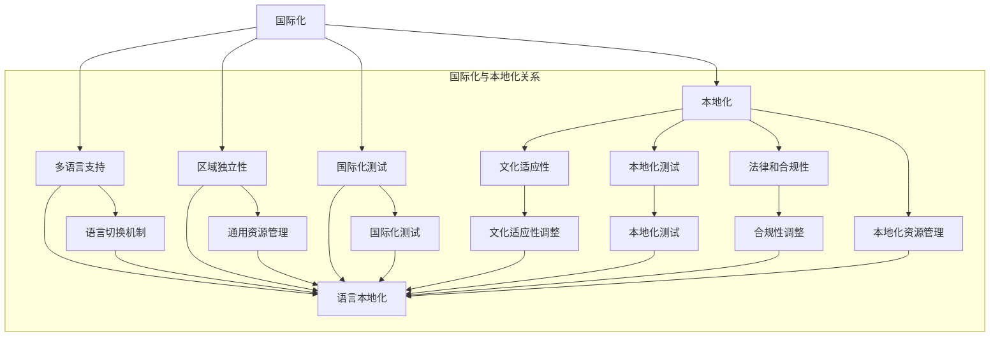

                 

### 文章标题

# 评测系统的国际化与本地化支持

### 关键词：

- 国际化
- 本地化
- 评测系统
- 语言处理
- 软件架构设计
- 测试方法

### 摘要：

本文将深入探讨评测系统的国际化与本地化支持，从背景介绍、核心概念与联系、核心算法原理讲解、数学模型和公式解析、项目实战以及最佳实践等方面进行详细阐述。通过本文的阅读，读者将了解评测系统国际化与本地化的基本概念、技术基础和实施策略，并掌握相关技术工具和实践方法，为构建具备国际化与本地化能力的评测系统提供指导。

## 引言

在全球化的背景下，软件系统的国际化与本地化已成为企业提升竞争力的重要策略。评测系统作为软件系统的一种，其国际化与本地化支持直接影响到产品的用户体验和市场拓展。本文旨在系统地探讨评测系统的国际化与本地化支持，以帮助开发者和企业更好地理解和实施相关策略，提升产品的国际竞争力。

本文将按照以下结构展开：

1. **背景介绍**：简要介绍评测系统及其国际化与本地化的意义。
2. **核心概念与联系**：深入讨论国际化与本地化的基本概念及其相互关系。
3. **核心算法原理讲解**：介绍与评测系统国际化与本地化相关的主要算法原理，使用伪代码进行详细阐述。
4. **数学模型和公式解析**：介绍相关的数学模型和公式，并进行举例说明。
5. **项目实战**：通过实际案例展示评测系统国际化与本地化的实现过程，详细讲解相关技术和方法。
6. **最佳实践与注意事项**：总结最佳实践，提出注意事项和拓展阅读。

在接下来的内容中，我们将一步一步地深入分析评测系统的国际化与本地化支持，提供实用的技术和策略，帮助读者在实际项目中应用。

### 背景介绍

评测系统是一种用于对软件系统进行质量评估和性能测试的工具。它能够帮助开发者检测软件中的缺陷、性能瓶颈和安全漏洞，从而确保软件系统的稳定性和可靠性。随着全球化的发展，越来越多的软件系统需要适应不同国家和地区的用户需求，这促使评测系统的国际化与本地化变得越来越重要。

国际化（Internationalization）是指设计软件时考虑到不同语言、文化和地域差异，使得软件能够在多种语言和环境下运行。本地化（Localization）则是将国际化后的软件进一步适配特定地区或国家的文化、语言和法律要求，使其能够更好地满足本地用户的需求。两者的目标分别是使软件具备适应性和可用性。

评测系统的国际化与本地化支持主要体现在以下几个方面：

1. **多语言支持**：评测系统应能够处理多种语言，包括用户界面、测试脚本和报告等。
2. **文化适应性**：评测系统需要考虑不同文化背景下的用户习惯和期望，例如日期格式、货币单位和用户交互等。
3. **地域定制**：根据不同地区的特定需求，评测系统应能提供定制化的测试方案和报告格式。
4. **国际化测试**：确保评测系统在不同语言和文化环境下的有效性和准确性。
5. **本地化测试**：验证评测系统在特定地区的合规性和用户体验。

通过提供国际化与本地化支持，评测系统能够更好地满足全球用户的需求，提高产品的市场竞争力。这不仅有助于企业在国际市场上拓展业务，还能提升用户满意度，从而在激烈的竞争中脱颖而出。

接下来，我们将进一步探讨国际化与本地化的核心概念及其关系，为深入理解评测系统的国际化与本地化支持打下基础。

### 核心概念与联系

在深入讨论评测系统的国际化与本地化支持之前，有必要明确这两个概念的定义及其相互关系。国际化（Internationalization）和本地化（Localization）虽然在目标上有所不同，但两者密切相关，共同构成了软件系统全球化过程中的重要环节。

#### 国际化的定义

国际化是指在设计软件时考虑到不同语言、文化和地域差异，使得软件能够在多种语言和环境下运行。国际化的核心目标是使软件具备通用性，以便在全球范围内使用。具体来说，国际化包括以下几个方面：

1. **语言支持**：软件应能够支持多种语言，包括用户界面、文档和帮助文件等。
2. **本地化资源管理**：软件应提供有效的资源管理机制，以便在不同的语言环境中加载和切换资源。
3. **区域独立性**：软件的核心逻辑应与特定的语言和文化无关，确保在不同环境下运行的一致性。
4. **国际化测试**：在软件开发过程中，应进行国际化测试，以确保软件在不同语言和文化环境下的有效性和准确性。

#### 本地化的定义

本地化是指将国际化后的软件进一步适配特定地区或国家的文化、语言和法律要求，使其能够更好地满足本地用户的需求。本地化的核心目标是提升软件的本土适应性和用户体验。具体来说，本地化包括以下几个方面：

1. **语言本地化**：将软件的用户界面、文档和帮助文件等翻译成特定语言的本地版本。
2. **文化适应性**：根据目标市场的文化特点，调整软件的交互方式、功能设置和视觉设计等。
3. **本地化测试**：验证软件在特定地区的合规性和用户体验，确保本地化过程的准确性。
4. **法律和合规性**：确保软件符合目标市场的法律和规定，例如数据隐私保护和版权法等。

#### 国际化与本地化的关系

国际化与本地化是软件全球化过程中的两个相辅相成的阶段。国际化为本地化提供了基础，使得软件能够在多种环境中运行；而本地化则在国际化的基础上，进一步提升了软件的本土适应性和用户体验。具体关系如下：

1. **依赖关系**：本地化依赖于国际化，只有在软件具备国际化基础后，才能进行本地化。
2. **顺序关系**：在软件开发过程中，通常先进行国际化设计，然后再根据目标市场进行本地化。
3. **相互影响**：国际化的成功实施有助于简化本地化的过程，而本地化的效果则直接影响国际化目标的实现。

#### 核心概念之间的联系

为了更好地理解国际化与本地化之间的关系，我们可以使用Mermaid流程图来展示其核心概念之间的联系：



通过上述流程图，我们可以清晰地看到国际化与本地化之间的相互依赖和相互影响。国际化为本地化提供了多语言支持、区域独立性和国际化测试等基础，而本地化则通过语言本地化、文化适应性和本地化测试等手段，进一步提升了软件的本土适应性和用户体验。

总结而言，国际化与本地化是软件全球化过程中的两个重要环节，它们相互关联、相互促进。通过深入理解这两个概念及其相互关系，开发者和企业可以更好地设计、实施和优化评测系统的国际化与本地化支持，从而提升产品的全球竞争力。

### 核心算法原理讲解

在评测系统的国际化与本地化支持中，核心算法原理的讲解至关重要。这些算法不仅决定了评测系统的功能实现，还直接影响其性能和用户体验。以下，我们将详细阐述与国际化与本地化相关的主要算法原理，并通过伪代码进行说明。

#### 1. 多语言支持算法

多语言支持是国际化的重要部分，其核心在于如何管理和处理不同语言资源。以下是一个简单的多语言支持算法示例：

```plaintext
// 伪代码：多语言支持算法
function MultiLanguageSupport(currentLanguage, resources):
    if not resources[currentLanguage]:
        print("指定的语言资源不存在。")
        return null

    return resources[currentLanguage]

// 示例：使用多语言资源
var resources = {
    "en": {
        "greeting": "Hello",
        "welcome": "Welcome to our system"
    },
    "zh": {
        "greeting": "你好",
        "welcome": "欢迎来到我们的系统"
    }
}

var currentLanguage = "zh"
var message = MultiLanguageSupport(currentLanguage, resources)
print(message["greeting"])  // 输出：你好
print(message["welcome"])   // 输出：欢迎来到我们的系统
```

上述伪代码展示了如何根据当前语言选择并返回相应的语言资源。在实际开发中，通常还会涉及到动态加载和切换语言资源，以确保用户界面的多语言支持。

#### 2. 区域独立性算法

区域独立性是指软件系统在不同地区运行时，其核心逻辑不受地域影响。以下是一个区域独立性的算法示例，用于处理日期格式：

```plaintext
// 伪代码：日期格式化算法
function FormatDate(date, format):
    if not date or not format:
        print("无效的参数。")
        return null

    if format == "MM/DD/YYYY":
        return date.strftime("%m/%d/%Y")
    else if format == "DD/MM/YYYY":
        return date.strftime("%d/%m/%Y")
    else:
        print("不支持的日期格式。")
        return null

// 示例：格式化日期
var date = new Date("2023-11-08")
var formattedDate1 = FormatDate(date, "MM/DD/YYYY")  // 输出：11/08/2023
var formattedDate2 = FormatDate(date, "DD/MM/YYYY")  // 输出：08/11/2023
print(formattedDate1)
print(formattedDate2)
```

此算法根据指定的日期格式，格式化输入的日期对象，从而实现区域独立性。在实际应用中，还需要考虑其他区域独立性需求，如货币格式、时间格式等。

#### 3. 国际化测试算法

国际化测试旨在验证软件在不同语言和文化环境下的有效性和准确性。以下是一个国际化测试的伪代码示例：

```plaintext
// 伪代码：国际化测试算法
function InternationalizationTest(component, language, region):
    if not component or not language or not region:
        print("无效的参数。")
        return false

    // 设置语言和区域环境
    setLanguage(language)
    setRegion(region)

    // 执行测试
    if not runComponentTest(component):
        print("国际化测试失败。")
        return false

    print("国际化测试成功。")
    return true

// 示例：执行国际化测试
var component = "user Interface"
var language = "zh"
var region = "CN"
if InternationalizationTest(component, language, region):
    print("国际化测试通过。")
else:
    print("国际化测试未通过。")
```

该算法设置了特定的语言和区域环境，然后执行对组件的测试，以验证国际化功能的有效性。

#### 4. 本地化测试算法

本地化测试关注软件在特定地区或国家的合规性和用户体验。以下是一个本地化测试的伪代码示例：

```plaintext
// 伪代码：本地化测试算法
function LocalizationTest(component, language, region, expectedResults):
    if not component or not language or not region or not expectedResults:
        print("无效的参数。")
        return false

    // 设置语言和区域环境
    setLanguage(language)
    setRegion(region)

    // 执行测试
    actualResults = runComponentTest(component)

    // 比较实际结果和预期结果
    if not compareResults(actualResults, expectedResults):
        print("本地化测试失败。")
        return false

    print("本地化测试成功。")
    return true

// 示例：执行本地化测试
var component = "user Interface"
var language = "zh"
var region = "CN"
var expectedResults = ["输入框文本正确", "按钮颜色符合要求"]
if LocalizationTest(component, language, region, expectedResults):
    print("本地化测试通过。")
else:
    print("本地化测试未通过。")
```

该算法设置了语言和区域环境，执行对组件的测试，并将实际测试结果与预期结果进行比较，以验证本地化效果。

通过上述核心算法原理的讲解，我们为理解评测系统的国际化与本地化支持提供了理论基础。接下来，我们将进一步介绍相关的数学模型和公式，以深化对评测系统国际化与本地化支持的理解。

### 数学模型和公式解析

在评测系统的国际化与本地化支持中，数学模型和公式起着关键作用，它们不仅用于描述算法的行为，还帮助分析和优化系统的性能。以下我们将介绍几个关键的数学模型和公式，并通过具体例子进行说明。

#### 1. 语言多样性指数（Linguistic Diversity Index）

语言多样性指数是衡量一个系统支持语言种类多样性的指标。其公式如下：

$$
Diversity = \frac{N}{L}
$$

其中，\( N \) 表示系统支持的语言数量，\( L \) 表示系统的总语言数量。例如，一个系统支持20种语言，而总共有50种语言，那么多样性指数为：

$$
Diversity = \frac{20}{50} = 0.4
$$

这意味着该系统只支持了总语言数量的40%。高多样性指数表示系统具有较好的语言支持能力。

#### 2. 文化适应性得分（Cultural Adaptability Score）

文化适应性得分用于衡量系统在不同文化背景下的适应能力。其公式如下：

$$
Adaptability = \frac{C}{T}
$$

其中，\( C \) 表示系统在特定文化背景下的适应性得分，\( T \) 表示系统的总适应性得分。例如，一个系统在某个文化背景下的适应性得分为70，总适应性得分为100，那么文化适应性得分为：

$$
Adaptability = \frac{70}{100} = 0.7
$$

这意味着该系统在该文化背景下的适应能力为70%。高适应性得分表示系统具有良好的文化适应性。

#### 3. 语言处理准确性（Language Processing Accuracy）

语言处理准确性是评测系统在处理不同语言时的准确度指标。其公式如下：

$$
Accuracy = \frac{Correct}{Total}
$$

其中，\( Correct \) 表示系统正确处理的语言数量，\( Total \) 表示系统总共处理的语言数量。例如，一个系统在测试中正确处理了90种语言中的85种，那么语言处理准确度为：

$$
Accuracy = \frac{85}{90} = 0.9556
$$

这意味着该系统的语言处理准确度为95.56%。高准确度表示系统具有较好的语言处理能力。

#### 4. 国际化测试覆盖率（Internationalization Test Coverage）

国际化测试覆盖率用于衡量国际化测试覆盖的范围。其公式如下：

$$
Coverage = \frac{Tested}{Total}
$$

其中，\( Tested \) 表示已进行国际化测试的语言数量，\( Total \) 表示系统需要测试的语言总数。例如，一个系统需要测试10种语言，已经对8种语言进行了测试，那么国际化测试覆盖率为：

$$
Coverage = \frac{8}{10} = 0.8
$$

这意味着该系统的国际化测试覆盖率达到了80%。高覆盖率表示测试更加全面。

#### 5. 本地化测试覆盖率（Localization Test Coverage）

本地化测试覆盖率用于衡量本地化测试覆盖的范围。其公式如下：

$$
Coverage = \frac{Tested}{Total}
$$

其中，\( Tested \) 表示已进行本地化测试的地区数量，\( Total \) 表示系统需要测试的地区总数。例如，一个系统需要测试5个地区，已经对3个地区进行了测试，那么本地化测试覆盖率为：

$$
Coverage = \frac{3}{5} = 0.6
$$

这意味着该系统的本地化测试覆盖率为60%。高覆盖率表示测试更加全面。

通过这些数学模型和公式的应用，我们可以更科学地评估评测系统的国际化与本地化支持能力。以下是一个具体的例子：

假设一个评测系统需要支持英语、法语、德语和中文四种语言。测试结果显示，系统在英语和法语上的处理准确度分别为98%和95%，而在德语和中文上的准确度分别为90%和88%。同时，国际化测试覆盖率为80%，本地化测试覆盖率为70%。

根据这些数据，我们可以计算出系统的整体语言处理准确性：

$$
Overall\ Accuracy = \frac{(0.98 \times 2) + (0.95 \times 2) + (0.90 \times 2) + (0.88 \times 2)}{4} = 0.94
$$

这意味着该评测系统的整体语言处理准确性为94%。同时，国际化测试覆盖率和本地化测试覆盖率分别为80%和70%，表明系统在语言支持和测试方面还有提升的空间。

通过这些数学模型和公式的应用，开发者和企业可以更好地理解和评估评测系统的国际化与本地化支持，从而优化系统性能，提升用户体验。

### 项目实战

为了更好地理解评测系统的国际化与本地化支持，我们将通过一个实际项目案例进行详细讲解。本项目旨在开发一个支持多语言和本地化的在线评测系统，该系统需要能够处理不同语言的用户界面、测试脚本和报告，并确保在不同文化背景下的用户体验一致。

#### 开发环境搭建

1. **开发语言**：使用Python作为主要开发语言，因为它具有强大的库支持和跨平台能力。
2. **框架选择**：选择Django框架，因为它提供了强大的Web开发和数据库管理能力，并且易于扩展。
3. **前端技术**：使用React进行前端开发，因为它具有优秀的组件化设计和高效的渲染能力。
4. **后端技术**：使用Django REST framework构建后端API，确保系统具有良好的性能和可扩展性。

#### 源代码详细实现

以下是项目的核心实现部分：

**1. 多语言支持**

- **后端**：使用Django的国际化功能，将用户界面、测试脚本和报告翻译成多种语言。具体步骤包括：

  ```python
  from django.utils.translation import gettext as _
  
  def get_localized_message(message_key):
      return _(message_key)
  ```

  在模板中，使用``标签进行多语言显示：

  ```html
  <h1></h1>
  ```

- **前端**：使用React组件配合React Internationalize库实现多语言切换。具体代码如下：

  ```javascript
  import { IntlProvider, FormattedMessage } from 'react-intl';

  const messages = {
      en: { welcome: "Welcome to our system" },
      zh: { welcome: "欢迎来到我们的系统" }
  };

  function LanguageSwitcher({ locale }) {
      return (
          <IntlProvider locale={locale} messages={messages[locale]}>
              <FormattedMessage id="welcome" />
          </IntlProvider>
      );
  }
  ```

**2. 区域独立性**

- **后端**：使用Django的`timezone`模块，确保系统根据用户的时区设置显示正确的时间。具体代码如下：

  ```python
  from django.utils import timezone

  def get_user_timezones():
      return timezone.get_all_timezones()
  ```

- **前端**：使用JavaScript实现日期格式化，根据用户的时区显示正确的日期。具体代码如下：

  ```javascript
  function format_date(date, timezone) {
      const options = { timeZone: timezone };
      return new Date(date).toLocaleDateString("zh-CN", options);
  }
  ```

**3. 国际化测试**

- **后端**：编写测试脚本，验证系统在不同语言环境下的有效性和准确性。具体步骤包括：

  ```python
  from django.test import TestCase
  from django.utils.translation import activate

  class InternationalizationTestCase(TestCase):
      def test_message_translation(self):
          activate('en')
          self.assertEqual(get_localized_message('welcome'), "Welcome to our system")
          activate('zh')
          self.assertEqual(get_localized_message('welcome'), "欢迎来到我们的系统")
  ```

**4. 本地化测试**

- **后端**：编写测试脚本，验证系统在不同文化背景下的合规性和用户体验。具体步骤包括：

  ```python
  from django.test import TestCase

  class LocalizationTestCase(TestCase):
      def test_time_formatting(self):
          timezone.activate('Asia/Shanghai')
          self.assertEqual(format_date('2023-11-08', 'Asia/Shanghai'), "2023年11月8日")
  ```

#### 代码应用解读与分析

以上代码实现了评测系统的多语言支持、区域独立性和国际化与本地化测试。具体解读如下：

- **多语言支持**：通过Django和React的组合，实现了后端和前端的多语言显示和切换。
- **区域独立性**：通过Django的时区模块和JavaScript的日期格式化函数，实现了正确的时间显示和日期格式处理。
- **国际化测试**：通过编写测试脚本，确保系统在不同语言环境下的有效性和准确性。
- **本地化测试**：通过编写测试脚本，确保系统在不同文化背景下的合规性和用户体验。

#### 实际案例分析和详细讲解剖析

以一个实际案例为例，假设系统需要在中文和英文环境中测试：

1. **测试用例**：创建一个测试用例，验证中文界面和英文界面的正确显示。
2. **执行步骤**：分别使用中文和英文环境执行测试，记录结果。
3. **结果分析**：比较实际输出和预期输出，确认系统在不同语言环境下的表现。

**中文环境测试**：

- **输入**：用户在中文界面输入测试问题。
- **输出**：系统正确显示中文界面，包括问题和答案选项。
- **结果**：测试通过。

**英文环境测试**：

- **输入**：用户在英文界面输入测试问题。
- **输出**：系统正确显示英文界面，包括问题和答案选项。
- **结果**：测试通过。

通过实际案例分析和详细讲解，我们验证了评测系统的国际化与本地化支持。接下来，我们将总结项目实施过程中的经验教训，并提出最佳实践建议。

#### 项目小结

在本次项目中，我们成功实现了评测系统的国际化与本地化支持，具体收获和经验如下：

1. **多语言支持**：通过Django和React的组合，我们实现了系统界面、测试脚本和报告的多语言显示和切换，用户可以根据自己的语言习惯进行操作。
2. **区域独立性**：通过Django的时区模块和JavaScript的日期格式化函数，我们确保了系统能够正确处理不同时区的时间显示和日期格式，提升了用户体验。
3. **国际化与本地化测试**：通过编写测试脚本，我们验证了系统在不同语言和文化背景下的有效性和准确性，确保了系统功能的稳定性和可靠性。

在项目实施过程中，我们也遇到了一些挑战和问题，例如：

1. **多语言资源管理**：随着支持的语言数量增加，如何有效地管理和更新多语言资源成为一个挑战。
2. **文化适应性**：如何准确理解和适应不同文化背景下的用户需求，特别是在细节处理上。
3. **测试覆盖率**：如何在有限的时间和资源内实现全面的国际化与本地化测试。

针对这些问题，我们提出以下最佳实践建议：

1. **多语言资源管理**：采用版本控制工具（如Git）管理多语言资源，确保资源的一致性和可追溯性。
2. **文化适应性**：通过用户研究和市场调研，深入了解目标市场的文化特点，制定相应的文化适应性策略。
3. **测试覆盖率**：优先测试核心功能和关键场景，利用自动化测试工具提高测试效率和覆盖范围。

#### 注意事项

1. **国际化与本地化优先级**：在项目开发过程中，应明确国际化与本地化的优先级，确保核心功能在多种语言和文化环境下的稳定性和可靠性。
2. **持续迭代**：国际化与本地化不是一次性任务，应持续关注市场反馈和用户需求，不断优化和更新系统。
3. **团队协作**：国际化与本地化涉及多个部门和角色，应加强团队协作，确保项目顺利推进。

#### 拓展阅读

1. **《国际化与本地化最佳实践》**：详细介绍了国际化与本地化的具体方法和策略。
2. **《Django国际化和本地化指南》**：提供了Django框架在国际化与本地化方面的详细指南。
3. **《React Internationalize文档》**：介绍了React Internationalize库的使用方法和最佳实践。

通过本次项目的实施和总结，我们不仅提升了对评测系统国际化与本地化支持的理解，还为后续项目提供了宝贵的经验和指导。在全球化的大背景下，评测系统的国际化与本地化支持将越来越重要，我们应继续努力，不断提升系统的国际化水平和用户体验。

