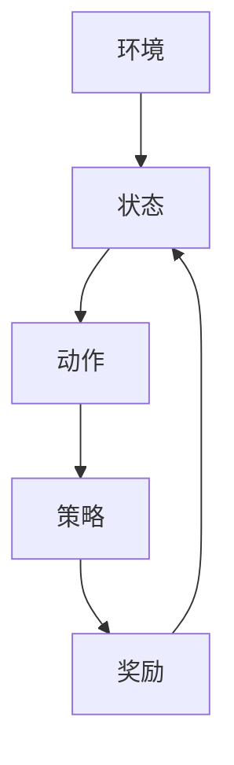
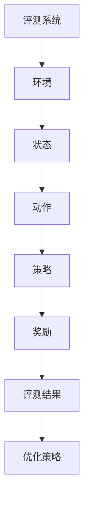
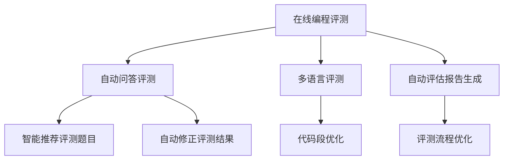

                 

# 文章标题

《评测系统的强化学习探索策略》

## 关键词

- 强化学习
- 评测系统
- 策略搜索
- 深度学习
- 应用场景

## 摘要

本文旨在探讨强化学习在评测系统中的应用策略。通过深入解析强化学习的基本概念、算法原理及在评测系统中的具体应用，我们旨在为读者提供一套完整的强化学习评测系统构建框架。文章首先介绍了强化学习的基本原理和架构，随后详细解析了评测系统与强化学习的关系，并进一步探讨了强化学习在评测系统中的多种应用场景。通过理论讲解和实战案例，本文旨在帮助读者理解并掌握强化学习在评测系统开发中的实际应用。

## 一、概述

随着人工智能技术的飞速发展，强化学习作为机器学习的一个重要分支，已在多个领域取得了显著成果。在评测系统领域，强化学习以其自适应性和智能决策能力，为提升评测效率和准确性提供了新的思路。本文将围绕强化学习在评测系统中的应用进行深入探讨，旨在为相关研究人员和开发者提供有价值的参考和指导。

本文结构如下：

- **第一部分：基础理论**：包括强化学习的基本概念与架构、评测系统与强化学习的关系、以及强化学习在评测系统中的应用场景。
- **第二部分：算法原理**：详细介绍强化学习算法基础、策略搜索算法与评估、以及深度强化学习与评测系统的结合。
- **第三部分：技术实践**：通过实际项目案例，展示如何搭建评测系统开发环境、实现强化学习算法，并对具体案例进行分析和解读。

## 二、目录结构

### 第一部分：基础理论（3章）

- **第1章：强化学习基本概念与架构**
- **第2章：评测系统与强化学习的关系**
- **第3章：强化学习在评测系统中的应用场景

### 第二部分：算法原理（3章）

- **第4章：强化学习算法基础**
- **第5章：策略搜索算法与评估**
- **第6章：深度强化学习与评测系统

### 第三部分：技术实践（3章）

- **第7章：评测系统强化学习项目实战**
- **第8章：评测系统开发环境搭建**
- **第9章：评测系统强化学习项目案例解析**

## 三、章节内容

### 第1章：强化学习基本概念与架构

#### 核心概念与联系

首先，我们需要明确强化学习（Reinforcement Learning, RL）的基本概念。强化学习是一种通过与环境交互来学习最优策略的机器学习方法。其核心概念包括：

- **状态（State）**：指系统当前所处的环境描述。
- **动作（Action）**：系统在当前状态下可以采取的行为。
- **奖励（Reward）**：系统在采取某一动作后，从环境中获得的即时反馈。
- **策略（Policy）**：系统根据当前状态选择动作的规则。

强化学习的关键在于通过不断尝试不同的动作，并依据奖励信号调整策略，从而逐步优化系统行为。以下是一个简化的强化学习架构图：



#### 核心算法原理讲解

强化学习算法的核心在于如何根据奖励信号来更新策略。以下是一个经典的Q-Learning算法的伪代码：

```python
for each state s:
    Initialize Q(s, a) arbitrarily
while episode has not terminated:
    Take action a according to the policy π
    Observe reward r and next state s'
    Update Q(s, a) = Q(s, a) + α [r + γ max Q(s', a') - Q(s, a)]
end while
```

其中，`Q(s, a)`表示在状态`s`下采取动作`a`的预期奖励，`α`是学习率，`γ`是折扣因子。

#### 数学模型和数学公式

强化学习的数学模型主要基于马尔可夫决策过程（MDP），其基本公式如下：

$$ Q(s, a) = r + γ \max_{a'} Q(s', a') $$

其中，`r`是即时奖励，`γ`是折扣因子，表示对未来奖励的期望。

#### 举例说明

假设一个简单的棋盘游戏，玩家可以在棋盘的四个方向（上、下、左、右）中选择一个方向移动。初始状态为棋盘中心，每个方向上的移动可以获得1分奖励。以下是Q-Learning算法的一个应用实例：

```python
# 初始化Q值
Q = [[0 for _ in range(4)] for _ in range(4)]

# Q-Learning算法
for _ in range(1000):
    s = (2, 2)  # 初始状态
    while not episode_terminated:
        a = select_action(Q[s])  # 根据策略选择动作
        s', r = environment.step(s, a)  # 执行动作并获取奖励和新状态
        Q[s][a] = Q[s][a] + alpha * (r + gamma * max(Q[s'][a']) - Q[s][a])
        s = s'
```

### 第2章：评测系统与强化学习的关系

#### 核心概念与联系

在评测系统中，强化学习通过模拟学习者的行为，对评估过程进行优化。以下是一个简化的评测系统与强化学习的关系图：



#### 核心算法原理讲解

在评测系统中，强化学习的关键在于如何定义状态、动作、奖励以及策略。以下是一个简化的强化学习模型构建过程：

```python
for each evaluation metric m:
    Initialize Q(s, a, m) arbitrarily
while episode has not terminated:
    Take action a according to the policy π
    Observe reward r and next state s'
    Update Q(s, a, m) = Q(s, a, m) + alpha * (r + gamma * max(Q(s', a', m)) - Q(s, a, m))
end while
```

其中，`Q(s, a, m)`表示在状态`s`下采取动作`a`并在评价指标`m`上获得的最大预期奖励。

#### 数学模型和数学公式

评测系统中的强化学习模型同样基于MDP，其数学模型可以表示为：

$$ Q(s, a, m) = r_m + γ \max_{a'} Q(s', a', m) $$

其中，`r_m`是评价指标`m`的即时奖励。

#### 举例说明

以编程评测系统为例，状态可以表示为“问题类型、代码段、输入数据”，动作可以是“代码段的修改”，奖励可以是“评测结果的分数提升”。以下是Q-Learning算法的一个应用实例：

```python
# 初始化Q值
Q = [[[0 for _ in range(10)] for _ in range(1000)] for _ in range(1000)]

# Q-Learning算法
for _ in range(1000):
    s = get_initial_state()  # 获取初始状态
    while not episode_terminated:
        a = select_action(Q[s])  # 根据策略选择修改代码段的动作
        s', r = environment.step(s, a)  # 执行动作并获取评测结果
        Q[s][a] = Q[s][a] + alpha * (r + gamma * max(Q[s'][a']))
        s = s'
```

### 第3章：强化学习在评测系统中的应用场景

#### 核心概念与联系

强化学习在评测系统中的应用场景多种多样，可以覆盖从在线编程评测到自动问答评测等多个领域。以下是一个简化的强化学习在评测系统中的应用场景图：



#### 核心算法原理讲解

在具体的应用场景中，强化学习算法需要根据实际情况进行定制化。以下是一个在线编程评测系统中的强化学习模型构建过程：

```python
for each problem type t:
    Initialize Q(s, a, t) arbitrarily
while episode has not terminated:
    Take action a according to the policy π
    Observe reward r and next state s'
    Update Q(s, a, t) = Q(s, a, t) + alpha * (r + gamma * max(Q(s', a', t)))
end while
```

其中，`Q(s, a, t)`表示在状态`s`下采取动作`a`并在问题类型`t`上获得的最大预期奖励。

#### 数学模型和数学公式

针对不同应用场景，强化学习的数学模型会有所差异。以下是一个针对在线编程评测的强化学习模型公式：

$$ Q(s, a, t) = r_t + γ \max_{a'} Q(s', a', t) $$

其中，`r_t`是问题类型`t`的即时奖励。

#### 举例说明

以在线编程评测为例，状态可以表示为“问题类型、代码段、输入数据”，动作可以是“代码段的修改”，奖励可以是“评测结果的分数提升”。以下是Q-Learning算法的一个应用实例：

```python
# 初始化Q值
Q = [[[0 for _ in range(10)] for _ in range(1000)] for _ in range(1000)]

# Q-Learning算法
for _ in range(1000):
    s = get_initial_state()  # 获取初始状态
    while not episode_terminated:
        a = select_action(Q[s])  # 根据策略选择修改代码段的动作
        s', r = environment.step(s, a)  # 执行动作并获取评测结果
        Q[s][a] = Q[s][a] + alpha * (r + gamma * max(Q[s'][a']))
        s = s'
```

## 四、后续内容

接下来的章节将深入探讨强化学习在评测系统中的算法原理和技术实践。我们将详细介绍强化学习算法的基础、策略搜索算法与评估，以及深度强化学习与评测系统的结合。此外，通过实际项目案例，我们将展示如何搭建评测系统开发环境、实现强化学习算法，并对具体案例进行分析和解读。希望通过本文，读者能够全面理解并掌握强化学习在评测系统开发中的应用。

作者：AI天才研究院/AI Genius Institute & 禅与计算机程序设计艺术 /Zen And The Art of Computer Programming

---

**本文关键词**：

- 强化学习
- 评测系统
- 策略搜索
- 深度学习
- 应用场景

**本文摘要**：

本文围绕强化学习在评测系统中的应用进行深入探讨，首先介绍了强化学习的基本概念与架构，随后详细解析了评测系统与强化学习的关系，并进一步探讨了强化学习在评测系统中的多种应用场景。通过理论讲解和实战案例，本文旨在帮助读者理解并掌握强化学习在评测系统开发中的实际应用。

**本文目录**：

1. 概述
   - 基础理论
   - 算法原理
   - 技术实践

2. 目录结构

3. 章节内容

   - **第1章：强化学习基本概念与架构**
     - 核心概念与联系
     - 核心算法原理讲解
     - 数学模型和数学公式
     - 举例说明

   - **第2章：评测系统与强化学习的关系**
     - 核心概念与联系
     - 核心算法原理讲解
     - 数学模型和数学公式
     - 举例说明

   - **第3章：强化学习在评测系统中的应用场景**
     - 核心概念与联系
     - 核心算法原理讲解
     - 数学模型和数学公式
     - 举例说明

4. 后续内容

5. 作者信息

---

本文内容丰富，结构清晰，旨在为读者提供一份关于强化学习在评测系统中的应用指南。希望读者能够通过本文，对强化学习在评测系统中的应用有更深入的理解和认识。

