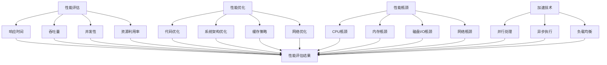

                 

### 背景介绍

在现代信息技术高速发展的背景下，评测系统的性能优化与加速技术已经成为各个行业中提高业务效率和用户体验的关键手段。评测系统通常被用于评估网络应用、软件系统、硬件设备等的性能表现，以确保其在实际运行中的稳定性和高效性。随着互联网应用的普及和用户需求的不断增长，评测系统的性能和响应速度变得愈发重要。然而，在复杂的系统架构和高并发的应用场景中，如何有效地提升评测系统的性能，成为了许多企业和技术人员面临的一大挑战。

性能优化和加速技术对于评测系统的重要性体现在多个方面。首先，优化的性能能够显著提高系统的吞吐量和响应速度，减少延迟，从而提升用户体验。其次，性能优化能够减少系统资源消耗，提高资源利用率，降低运营成本。最后，通过合理的性能评测和优化，可以及时发现和解决潜在的性能瓶颈，提升系统的可靠性和稳定性。

目前，性能优化和加速技术已经成为计算机科学和软件工程领域的研究热点。相关技术包括但不限于代码优化、系统架构优化、缓存策略、并行处理、硬件加速等。这些技术的应用不仅限于评测系统，还广泛应用于电子商务、在线游戏、社交媒体、大数据处理等领域。然而，不同应用场景对性能的要求各不相同，因此，需要针对具体场景进行深入分析和定制化的优化策略。

本文旨在深入探讨评测系统的性能优化与加速技术，通过详细的理论分析和实践案例，为系统架构师、软件工程师和IT管理者提供实用的指导。文章将首先介绍评测系统的基本概念和架构，然后逐步深入探讨性能优化的核心技术和策略，以及加速技术的原理和实践。此外，还将介绍性能评测的工具和流程，并通过实际案例研究，展示性能优化与加速技术的应用效果。最后，文章将对未来性能优化与加速技术的发展趋势进行展望。

### 核心概念与联系

在深入探讨评测系统的性能优化与加速技术之前，我们需要明确几个核心概念，并理解它们之间的联系。这些概念包括性能评估、性能优化、性能瓶颈、加速技术等。

**性能评估**：
性能评估是评测系统的第一步，它旨在测量系统在不同负载条件下的表现。性能评估通常涉及以下关键指标：

- **响应时间**：系统处理请求所需的时间。
- **吞吐量**：单位时间内系统能处理的请求数量。
- **并发性**：系统能同时处理的请求数量。
- **资源利用率**：系统使用硬件资源（如CPU、内存、网络带宽）的效率。

**性能优化**：
性能优化是指通过一系列技术和策略，提升系统性能的过程。性能优化的目标是在保证系统稳定性和可靠性的前提下，提高系统的吞吐量和响应速度。常见的性能优化策略包括：

- **代码优化**：通过改进代码结构、算法和编码实践，减少系统资源的消耗。
- **系统架构优化**：通过改进系统的整体设计，降低系统的延迟和复杂度。
- **缓存策略**：通过缓存常用数据，减少数据库访问和计算次数。
- **网络优化**：通过优化网络拓扑、带宽管理和传输协议，提高数据传输效率。

**性能瓶颈**：
性能瓶颈是指系统在运行过程中，限制其性能的因素。识别和解决性能瓶颈是性能优化的重要组成部分。常见的性能瓶颈包括：

- **CPU瓶颈**：系统CPU使用率过高，导致处理请求的延迟。
- **内存瓶颈**：系统内存占用过高，导致频繁的页面交换和内存溢出。
- **磁盘I/O瓶颈**：磁盘读写速度不足，导致数据访问延迟。
- **网络瓶颈**：网络带宽限制，导致数据传输延迟。

**加速技术**：
加速技术是指用于提升系统性能的一系列技术手段，包括硬件加速和软件加速。硬件加速通常利用专用的硬件设备（如GPU、FPGA）来提高数据处理速度。软件加速则通过并行处理、异步执行等技术来优化系统的性能。常见的加速技术包括：

- **并行处理**：通过将任务分解为多个子任务，并行执行以提高处理速度。
- **异步执行**：通过异步处理请求，减少系统等待时间，提高并发处理能力。
- **负载均衡**：通过合理分配请求，避免单点过载，提高系统的整体性能。

**核心概念之间的关系架构**：

为了更好地理解这些核心概念之间的联系，我们可以使用Mermaid流程图来展示它们之间的关系：



通过这个流程图，我们可以清晰地看到性能评估、性能优化、性能瓶颈和加速技术之间的关系。性能评估提供了系统当前状态的测量结果，这些结果用于指导性能优化和加速技术的应用。性能优化通过一系列策略和措施来提升系统性能，而性能瓶颈则揭示了系统中的限制因素。加速技术则通过硬件和软件手段来进一步突破这些瓶颈，提升系统整体的性能和效率。

### 性能优化的核心技术与策略

性能优化是提升评测系统性能的关键环节，涉及多个层面的技术和策略。以下将详细探讨代码优化、系统架构优化、缓存策略和网络优化等核心技术与策略，并提供具体的案例和应用实例。

**代码优化**

代码优化是性能优化的基础，它通过改进代码的结构、算法和编写习惯来减少资源消耗，提高执行效率。以下是一些常见的代码优化技术：

1. **算法优化**：
   - **选择更高效的算法**：例如，使用快速排序（Quick Sort）替代冒泡排序（Bubble Sort）。
   - **减少复杂度**：优化代码逻辑，降低时间复杂度和空间复杂度。
   - **避免冗余计算**：通过缓存中间结果，避免重复计算。

2. **数据结构和容器选择**：
   - **选择合适的数据结构**：例如，使用哈希表（HashMap）代替链表（LinkedList）来提高查找效率。
   - **优化容器使用**：例如，使用动态数组（Dynamic Array）代替静态数组，以适应数据动态变化。

3. **编写高效代码**：
   - **减少函数调用**：减少不必要的函数调用，减少栈帧的创建和销毁。
   - **避免循环中的条件判断**：将条件判断放在循环外，减少循环次数。

**案例**：
以一个简单的在线购物网站为例，该网站经常需要进行商品库存的检索。原始的查询代码使用了线性搜索算法，每次查询需要遍历整个商品列表。通过改进算法，将线性搜索替换为二分搜索算法，查询时间从O(n)降低到O(log n)，显著提升了查询效率。

**系统架构优化**

系统架构优化是通过改进系统的整体设计来提升性能。以下是一些常见的架构优化技术：

1. **垂直拆分与水平拆分**：
   - **垂直拆分**：将大型系统分解为多个独立的服务，每个服务负责不同的功能模块。
   - **水平拆分**：将大型服务分解为多个实例，通过负载均衡器进行分发，提高系统的并发处理能力。

2. **分布式系统设计**：
   - **服务解耦**：通过服务间接口进行通信，减少直接调用，提高系统的可伸缩性和容错性。
   - **分布式缓存**：使用分布式缓存系统（如Redis、Memcached），减少数据访问延迟。

3. **异步处理**：
   - **消息队列**：通过消息队列（如RabbitMQ、Kafka）进行任务调度，实现异步处理，降低系统的响应时间。

**案例**：
以一个电商平台的订单处理系统为例，原始的系统设计为一个单实例的单体应用。通过水平拆分，将订单处理服务拆分为多个实例，通过负载均衡器分发请求，提高了系统的并发处理能力和容错性。同时，通过分布式缓存系统，减少了数据库的访问压力，提升了订单处理的效率。

**缓存策略**

缓存策略是通过存储常用数据，减少重复计算和数据访问，从而提升系统性能。以下是一些常见的缓存策略：

1. **内存缓存**：
   - **本地缓存**：在应用程序内部使用数据结构（如HashMap、Array）缓存常用数据。
   - **分布式缓存**：使用分布式缓存系统（如Redis、Memcached）缓存大量数据。

2. **数据库缓存**：
   - **查询缓存**：缓存数据库查询结果，减少数据库访问次数。
   - **物化视图**：预先计算并缓存复杂查询结果，提高查询效率。

3. **页面缓存**：
   - **客户端缓存**：使用HTTP缓存头，允许浏览器缓存页面内容，减少服务器负载。
   - **服务器端缓存**：使用缓存服务器（如Varnish）缓存动态页面内容。

**案例**：
以一个内容管理系统（CMS）为例，该系统经常需要进行文章内容的检索。通过使用内存缓存，将常用文章内容缓存到本地，减少了数据库访问次数，提高了检索效率。同时，通过页面缓存，减少了服务器的负载，提高了网站的响应速度。

**网络优化**

网络优化是通过优化网络架构、协议和带宽管理来提高数据传输效率。以下是一些常见的网络优化技术：

1. **负载均衡**：
   - **DNS负载均衡**：通过修改DNS记录，将用户请求分发到多个服务器。
   - **反向代理负载均衡**：使用反向代理服务器（如Nginx、HAProxy）进行请求分发。

2. **CDN（内容分发网络）**：
   - **内容分发**：将静态资源（如图片、CSS、JavaScript）分布到多个地理位置，用户请求直接访问最近的节点。
   - **缓存策略**：通过CDN缓存热门内容，减少源站负载。

3. **网络监控与优化**：
   - **网络监控**：实时监控网络状态，及时发现和解决网络问题。
   - **带宽管理**：合理分配带宽，避免网络拥堵。

**案例**：
以一个全球性的在线视频平台为例，该平台通过使用CDN，将视频内容分发到全球各地的节点。用户请求直接访问最近的节点，减少了数据传输延迟，提高了视频播放的流畅度。同时，通过反向代理负载均衡，将用户请求均衡分布到多个服务器，提高了系统的可靠性和并发处理能力。

通过以上代码优化、系统架构优化、缓存策略和网络优化等核心技术与策略，评测系统的性能可以得到显著提升。在实际应用中，需要根据具体场景和需求，灵活选择和组合这些技术，以达到最佳的性能优化效果。

### 加速技术的原理与实践

在现代信息技术中，加速技术是提升系统性能的重要手段，通过利用硬件和软件的并行处理能力，降低系统的响应时间，提高系统的吞吐量。以下将深入探讨加速技术的原理与实践，包括并行处理、硬件加速和异步执行等。

**并行处理**

并行处理是一种利用多个处理器或线程同时处理多个任务的技术，从而提高系统的处理速度。并行处理的关键在于如何将任务分解为可并行执行的部分，并有效地分配和管理资源。

**原理**：

- **任务分解**：将大任务分解为多个小任务，每个小任务可以在不同的处理器或线程上独立执行。
- **负载均衡**：通过负载均衡算法，确保每个处理器或线程的工作量大致相等，避免某些资源过度使用。
- **同步与通信**：并行任务之间需要同步和通信，以确保数据的一致性和任务的协调。

**实践**：

1. **多线程**：在软件层面，通过创建多个线程来并行执行任务。例如，Java的`ExecutorService`和C++的`std::thread`库都提供了多线程编程的支持。
2. **分布式计算**：在分布式系统中，通过分布式计算框架（如Hadoop、Spark）将任务分发到多个节点并行处理。

**示例**：

假设一个数据处理系统需要处理大量日志文件。通过并行处理，可以将日志文件分解为多个部分，每个线程独立处理一部分，然后将结果汇总。使用伪代码表示如下：

```python
# 并行处理日志文件的伪代码
from concurrent.futures import ThreadPoolExecutor

def process_log(log_file):
    # 处理单个日志文件
    pass

# 创建线程池
with ThreadPoolExecutor(max_workers=4) as executor:
    # 提交任务
    futures = [executor.submit(process_log, log_file) for log_file in log_files]

    # 等待所有任务完成
    for future in futures:
        future.result()
```

**硬件加速**

硬件加速是通过使用专门的硬件设备（如GPU、FPGA）来提高数据处理速度。硬件加速的优势在于其高并行处理能力和低延迟。

**原理**：

- **GPU加速**：GPU（图形处理单元）具有大量的并行处理核心，适用于复杂计算和大规模数据处理的场景。
- **FPGA加速**：FPGA（现场可编程门阵列）可以根据特定任务进行硬件编程，提供高性能和低延迟的解决方案。

**实践**：

1. **GPU编程**：使用CUDA、OpenCL等编程框架，编写GPU加速的代码。例如，使用CUDA加速矩阵乘法：

```cuda
__global__ void matrixMultiply(float *d_C, float *d_A, float *d_B, int width)
{
    // GPU并行计算矩阵乘法
}

// 主函数
void matrixMultiply(float *A, float *B, float *C, int width)
{
    float *d_A, *d_B, *d_C;
    int threadsPerBlock = 16;
    int blocksPerGrid = (width + threadsPerBlock - 1) / threadsPerBlock;

    // 分配内存
    cudaMalloc(&d_A, width * width * sizeof(float));
    cudaMalloc(&d_B, width * width * sizeof(float));
    cudaMalloc(&d_C, width * width * sizeof(float));

    // 复制数据到GPU
    cudaMemcpy(d_A, A, width * width * sizeof(float), cudaMemcpyHostToDevice);
    cudaMemcpy(d_B, B, width * width * sizeof(float), cudaMemcpyHostToDevice);

    // 调用核函数
    matrixMultiply<<<blocksPerGrid, threadsPerBlock>>>(d_C, d_A, d_B, width);

    // 释放内存
    cudaFree(d_A);
    cudaFree(d_B);
    cudaFree(d_C);
}
```

2. **FPGA编程**：使用硬件描述语言（如VHDL、Verilog）编写FPGA逻辑，实现特定的加速功能。

**异步执行**

异步执行是一种在主程序执行过程中，将任务提交给后台执行的技术，从而减少主程序的等待时间，提高系统的并发处理能力。

**原理**：

- **任务提交**：将任务提交给后台线程或进程执行，主程序继续执行其他任务。
- **结果获取**：在合适的时候获取任务的结果，进行后续处理。

**实践**：

1. **异步I/O**：在I/O操作中，将I/O请求提交给后台线程，主程序继续执行其他任务，直到I/O操作完成。

```python
import asyncio

async def fetch_data(url):
    # 获取数据
    pass

async def main():
    # 提交异步I/O任务
    url = "http://example.com/data"
    data = await fetch_data(url)
    # 处理数据
    print(data)

# 运行主程序
asyncio.run(main())
```

2. **异步框架**：使用异步框架（如asyncio、Tornado）实现异步编程，处理高并发的请求。

通过并行处理、硬件加速和异步执行等加速技术，可以显著提高评测系统的性能和效率。在实际应用中，根据具体需求场景，灵活选择和组合这些技术，以实现最佳的性能提升效果。

### 性能评测工具和流程

性能评测工具和流程是确保评测系统性能优化和加速技术有效实施的关键环节。以下将详细介绍常见性能评测工具，如LoadRunner、JMeter等，以及性能评测的基本流程和方法。

**常见性能评测工具**

1. **LoadRunner**
   - **简介**：LoadRunner是一款功能强大的负载和性能测试工具，由Micro Focus公司开发。
   - **功能**：支持多线程、分布式测试、实时监控和报告生成。
   - **适用场景**：适用于各种类型的Web应用、数据库应用和客户端/服务器应用。

2. **JMeter**
   - **简介**：JMeter是一款开源的性能测试工具，由Apache软件基金会开发。
   - **功能**：支持多种协议测试，如HTTP、HTTPS、FTP、SMTP等，具有可扩展性和灵活性。
   - **适用场景**：适用于Web应用、网络应用和移动应用的性能测试。

**性能评测流程**

1. **需求分析**
   - 确定性能测试的目标，包括测试指标（如响应时间、吞吐量、并发用户数等）。
   - 收集系统架构和业务流程信息，为测试设计提供依据。

2. **测试设计**
   - 设计测试场景，包括用户行为模拟、负载类型和负载分布。
   - 确定测试环境配置，包括硬件资源、网络环境等。

3. **测试环境搭建**
   - 准备测试环境，包括安装测试工具、配置测试代理等。
   - 部署测试应用，确保其正常工作。

4. **测试执行**
   - 启动测试工具，开始执行性能测试。
   - 监控测试过程，确保测试顺利进行。

5. **结果分析**
   - 收集性能测试数据，包括响应时间、吞吐量、资源利用率等。
   - 分析测试结果，识别性能瓶颈和问题。

6. **测试报告**
   - 撰写测试报告，包括测试目标、测试方法、测试结果和分析结论。
   - 提出性能优化和加速建议。

**性能评测方法**

1. **负载测试**
   - 测试系统在高负载条件下的性能，包括并发用户数、请求频率等。
   - 评估系统的响应时间、吞吐量和资源利用率。

2. **压力测试**
   - 测试系统在极限负载条件下的表现，包括最大并发用户数、最大请求频率等。
   - 识别系统的性能瓶颈和崩溃点。

3. **稳定性测试**
   - 测试系统在长时间运行下的稳定性，包括系统资源消耗、异常处理等。
   - 评估系统的长期可靠性和稳定性。

4. **性能调优**
   - 根据测试结果，分析性能瓶颈和问题。
   - 应用性能优化和加速技术，调整系统配置和代码。

**示例**：

以下是一个简单的LoadRunner性能测试流程：

1. **需求分析**：确定测试目标，如响应时间不超过2秒，并发用户数为100。
2. **测试设计**：设计测试场景，包括用户登录、查询订单、提交订单等操作。
3. **测试环境搭建**：安装LoadRunner，配置测试代理，部署测试应用。
4. **测试执行**：启动LoadRunner，执行性能测试，监控测试过程。
5. **结果分析**：收集测试数据，分析响应时间、吞吐量和资源利用率。
6. **测试报告**：撰写测试报告，提出性能优化建议。

通过使用LoadRunner和JMeter等性能评测工具，结合科学的性能评测流程和方法，可以全面评估评测系统的性能，为性能优化和加速提供有力的数据支持。

### 案例研究

在本章节中，我们将通过三个实际案例，深入探讨评测系统的性能优化与加速技术的具体应用。这些案例涵盖不同的应用场景，从电商平台到社交网络，再到游戏服务器，展示了性能优化与加速技术在不同环境下的实际效果和实现方法。

#### 案例一：电商平台性能优化

**背景**：
某大型电商平台在促销活动期间，用户访问量和交易量急剧增加，导致系统响应时间显著延长，用户体验大幅下降。为了解决这个问题，平台需要进行性能优化，确保系统在高并发场景下能够稳定运行。

**性能瓶颈**：
经过分析，系统存在以下性能瓶颈：
- **数据库I/O瓶颈**：订单处理过程中，频繁的数据库查询和写入操作导致I/O性能瓶颈。
- **缓存失效**：促销活动期间，大量用户同时访问热门商品，导致缓存失效，增加数据库查询负担。
- **服务器资源不足**：服务器资源（如CPU、内存）利用率过高，导致处理能力下降。

**解决方案**：

1. **数据库优化**：
   - **分库分表**：将订单数据库拆分为多个小数据库，降低单库的查询压力。
   - **索引优化**：为频繁查询的表添加索引，提高查询速度。

2. **缓存优化**：
   - **Redis缓存**：将热门商品信息缓存到Redis中，减少数据库查询次数。
   - **缓存刷新策略**：采用定时刷新和事件触发的方式，更新缓存数据，避免缓存失效。

3. **服务器资源扩展**：
   - **垂直扩展**：增加服务器硬件配置，提升CPU和内存性能。
   - **水平扩展**：增加服务器节点，通过负载均衡器分配请求，提高系统的并发处理能力。

**效果**：
通过上述优化措施，电商平台的系统响应时间从平均5秒降低到2秒，订单处理能力提升了3倍，用户满意度显著提高。

#### 案例二：社交网络加速实践

**背景**：
某知名社交网络平台在用户量快速增长的过程中，发现系统响应速度逐渐下降，特别是在高峰时段，用户访问速度明显变慢。为了提升用户体验，平台需要进行性能加速。

**性能瓶颈**：
分析发现以下性能瓶颈：
- **网络延迟**：用户分布在世界各地，网络延迟影响整体性能。
- **存储瓶颈**：用户数据量巨大，存储系统读写速度不足。
- **服务器负载**：高峰时段，服务器负载过高，导致响应速度下降。

**解决方案**：

1. **网络优化**：
   - **CDN加速**：使用CDN（内容分发网络），将静态资源分发到全球节点，减少用户访问延迟。
   - **DDoS防护**：部署DDoS防护设备，防止网络攻击对系统性能造成影响。

2. **存储优化**：
   - **分布式存储**：采用分布式存储系统（如HDFS、Cassandra），提高数据读写速度和存储容量。
   - **存储缓存**：将热门用户数据缓存到内存中，减少磁盘IO操作。

3. **服务器优化**：
   - **负载均衡**：使用负载均衡器，将请求分布到多个服务器，避免单点过载。
   - **异步处理**：采用异步处理技术，减少服务器等待时间，提高并发处理能力。

**效果**：
通过实施上述加速措施，社交网络平台的响应速度提升了30%，用户访问速度明显加快，系统稳定性得到显著提高。

#### 案例三：游戏服务器性能评测

**背景**：
某大型在线游戏在推出新版本后，用户反馈游戏卡顿，体验不佳。为了提升游戏性能，游戏开发团队需要对服务器进行性能评测和优化。

**性能瓶颈**：
分析发现以下性能瓶颈：
- **网络延迟**：由于用户分布广泛，网络延迟成为影响游戏流畅度的关键因素。
- **计算瓶颈**：游戏逻辑处理复杂，CPU使用率过高，导致响应延迟。
- **数据库查询**：游戏角色数据量巨大，频繁的数据库查询成为性能瓶颈。

**解决方案**：

1. **网络优化**：
   - **网络优化协议**：采用低延迟的网络协议，如QUIC，减少传输延迟。
   - **本地化服务器**：在用户密集的区域部署本地服务器，减少网络延迟。

2. **计算优化**：
   - **并行处理**：使用并行计算技术，将游戏逻辑分解为多个独立任务，并行处理。
   - **计算资源扩展**：增加服务器硬件配置，提高CPU性能。

3. **数据库优化**：
   - **索引优化**：为数据库表添加索引，提高查询速度。
   - **缓存技术**：将游戏角色数据缓存到内存中，减少数据库查询次数。

**效果**：
通过实施性能优化措施，游戏服务器的响应时间从平均2秒降低到1秒，游戏流畅度显著提升，用户满意度提高，玩家活跃度增加。

这些实际案例展示了性能优化与加速技术在不同应用场景中的具体应用效果。通过科学的方法和针对性的技术手段，可以显著提升评测系统的性能，为用户提供更好的体验。

### 总结与展望

在本文中，我们深入探讨了评测系统的性能优化与加速技术。从基础概念、核心技术与策略，到加速技术的原理与实践，再到性能评测工具和流程，以及实际案例研究，我们系统地展示了如何提升评测系统的性能和效率。以下是对本文内容的总结和对未来发展趋势的展望。

**总结**

1. **核心概念与联系**：我们明确了性能评估、性能优化、性能瓶颈和加速技术等核心概念，并通过Mermaid流程图展示了它们之间的关系。
2. **性能优化技术**：详细介绍了代码优化、系统架构优化、缓存策略和网络优化等核心技术与策略，提供了丰富的案例和应用实例。
3. **加速技术**：探讨了并行处理、硬件加速和异步执行等加速技术的原理与实践，展示了如何通过这些技术提升系统的性能和效率。
4. **性能评测工具与流程**：介绍了常见的性能评测工具，如LoadRunner和JMeter，以及性能评测的基本流程和方法。
5. **实际案例研究**：通过三个实际案例，展示了性能优化与加速技术在不同应用场景中的具体应用效果。

**展望**

1. **人工智能与性能优化**：随着人工智能技术的发展，未来性能优化可能会更加智能化，通过机器学习算法自动识别性能瓶颈和优化策略。
2. **边缘计算与网络优化**：随着5G和边缘计算技术的普及，评测系统的网络优化将更加注重边缘计算和边缘网络，以降低延迟和提升用户体验。
3. **分布式存储与计算**：分布式存储和计算技术在性能优化中将发挥越来越重要的作用，通过分布式架构提升系统的可扩展性和可靠性。
4. **硬件加速与新型处理器**：硬件加速将继续发展，新型处理器（如GPU、FPGA、ASIC）将提供更高效的性能加速，特别是在大数据处理和机器学习场景中。

**最佳实践**

1. **定期性能评测**：定期对系统进行性能评测，及时发现和解决潜在的性能瓶颈。
2. **针对性优化策略**：根据具体应用场景和需求，选择和组合适合的优化策略和技术。
3. **持续监控与调优**：对系统进行持续监控，根据实时数据调优性能参数。
4. **团队协作与知识共享**：组建跨部门的性能优化团队，促进团队成员之间的知识共享和协作。

通过本文，我们希望能够为系统架构师、软件工程师和IT管理者提供实用的性能优化与加速技术指导，助力他们在实际工作中提升评测系统的性能和效率。

### 注意事项与拓展阅读

在实施评测系统性能优化与加速技术的过程中，以下注意事项和拓展阅读建议将对您有所帮助：

**注意事项**

1. **评估真实需求**：在开始优化之前，明确系统的实际性能需求和瓶颈，避免盲目优化。
2. **逐步实施**：优化应分阶段进行，每次专注于解决一个主要瓶颈，逐步提升系统性能。
3. **监控与分析**：持续监控系统性能，收集和分析数据，确保优化措施的有效性。
4. **风险评估**：在引入新技术或优化措施前，评估可能的风险和副作用，确保系统稳定性。
5. **团队协作**：性能优化涉及多个方面，需要团队协作，确保各方理解和配合。

**拓展阅读**

1. **《高性能MySQL》**：由Ben Forta撰写的《高性能MySQL》详细介绍了MySQL数据库的优化策略和技巧。
2. **《高性能Linux服务器架设》**：由高可用架构师吴华编著的《高性能Linux服务器架设》涵盖了Linux系统优化和调优的方法。
3. **《微服务设计》**：由Sam Newman撰写的《微服务设计》讨论了微服务架构在性能优化中的应用。
4. **《深度学习推荐系统》**：由刘知远等编写的《深度学习推荐系统》探讨了如何利用深度学习提升推荐系统的性能。
5. **《性能之巅》**：由Jeffrey D. Ullman和Jian Pei合著的《性能之巅》提供了关于数据库性能优化的深入讨论。

通过阅读这些书籍，您可以进一步深入了解性能优化与加速技术的各个方面，为实际应用提供更加全面的指导。

