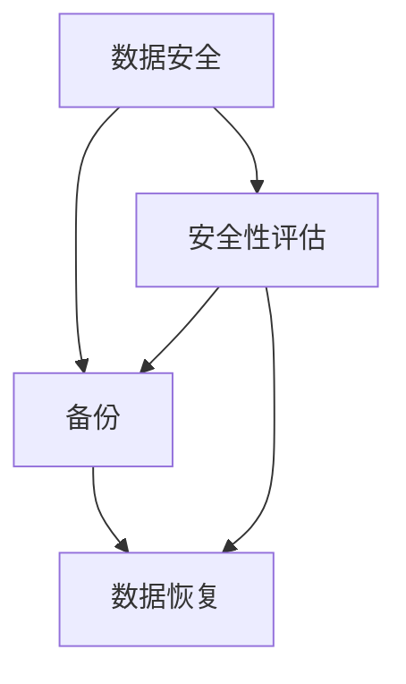

                 

## 文章标题

# 评测系统的数据安全与备份方案

> 关键词：评测系统、数据安全、备份策略、数据恢复、安全性评估、实际案例研究

> 摘要：
本文旨在深入探讨评测系统中的数据安全与备份方案。首先，我们将回顾数据安全的核心概念与重要性，然后详细分析数据安全策略、备份策略以及数据恢复策略。接下来，我们将介绍安全性评估的方法，并分享实际案例研究的经验。通过这篇文章，读者将全面了解如何保障评测系统的数据安全，并制定有效的备份方案。

----------------------------------------------------------------

## 核心概念与联系

在讨论评测系统的数据安全与备份方案之前，我们需要明确几个核心概念，并理解它们之间的联系。

### 数据安全

数据安全是指保护数据免受未经授权的访问、使用、披露、破坏、修改或破坏的过程。它涵盖了以下几个方面：

- **机密性**：确保只有授权用户能够访问数据。
- **完整性**：保证数据在传输或存储过程中不被篡改。
- **可用性**：确保数据在需要时可供授权用户使用。

### 备份

备份是指将数据复制并存储到其他位置，以防止数据丢失或损坏。备份的类型包括完全备份、差异备份和增量备份。

- **完全备份**：复制所有数据。
- **差异备份**：复制自上次完全备份以来更改的数据。
- **增量备份**：复制自上次备份以来新增或更改的数据。

### 数据恢复

数据恢复是指从备份中恢复数据的过程，以应对数据丢失或损坏的情况。数据恢复策略包括备份数据的验证、恢复流程以及恢复测试。

### 安全性评估

安全性评估是指对系统进行评估，以确定其安全性是否符合既定标准。安全性评估包括风险评估、安全策略制定、安全意识培训等方面。

### 关系架构

为了更好地理解这些核心概念之间的联系，我们可以使用Mermaid流程图来展示它们之间的关系：



### Mermaid流程图


通过这个流程图，我们可以看到数据安全、备份和恢复、安全性评估之间的紧密联系。这些核心概念共同构成了一个完整的体系，确保评测系统的数据安全。

----------------------------------------------------------------

## 数据安全策略

数据安全策略是确保评测系统数据不受威胁的关键。以下是一些关键步骤和策略：

### 风险评估

**步骤：**

1. **风险识别**：识别可能威胁数据安全的内部和外部因素。
2. **风险分析**：分析每种风险的潜在影响和可能性。
3. **风险评估**：根据影响和可能性评估每种风险。

**工具：**

- **SWOT分析**：用于识别优势和劣势，以及机会和威胁。
- **风险评估矩阵**：用于量化风险的影响和可能性。

### 安全策略制定

**步骤：**

1. **安全策略框架**：制定一个全面的安全策略框架。
2. **安全策略内容**：包括数据加密、访问控制、安全审计等。
3. **安全策略实施与维护**：确保策略得到有效执行，并定期更新。

### 安全意识培训

**步骤：**

1. **安全意识培养**：提高员工的安全意识。
2. **安全培训计划**：制定并实施安全培训计划。
3. **培训效果评估**：评估培训效果，并根据结果进行调整。

### 伪代码

```python
# 风险评估
def assess_risk():
    identify_risks()
    analyze_risks()
    evaluate_risks()

# 安全策略制定
def define_security_policy():
    create_policy_framework()
    define_policy_content()
    implement_and_maintain_policy()

# 安全意识培训
def train_security_awareness():
    cultivate_awareness()
    develop_training_plan()
    evaluate_training效果的评估效果()
```

### 数学模型和公式

在数据安全策略中，我们可以使用一些数学模型和公式来量化风险和评估策略的有效性。以下是一个简化的例子：

$$
\text{风险} = \text{影响} \times \text{可能性}
$$

其中，影响和可能性可以通过以下公式计算：

$$
\text{影响} = \text{数据泄露} \times \text{敏感度} \times \text{影响程度}
$$

$$
\text{可能性} = \text{威胁} \times \text{漏洞} \times \text{暴露度}
$$

### 详细讲解与举例说明

假设我们有一个评测系统，其中包含敏感的用户数据。我们使用以下参数进行风险评估：

- **影响程度**：3（高）
- **敏感度**：2（高）
- **威胁**：1（低）
- **漏洞**：1（低）
- **暴露度**：2（中）

根据上述公式，我们可以计算出风险：

$$
\text{风险} = 3 \times 2 \times 1 \times 1 \times 2 = 12
$$

这意味着该评测系统的风险为12。我们可以使用这个风险值来确定是否需要采取额外的安全措施。

### 结论

通过风险评估、安全策略制定和安全意识培训，我们可以建立一套有效的数据安全策略，确保评测系统的数据安全。这些步骤和方法将帮助我们识别潜在威胁，制定合适的策略，并提高员工的安全意识。

----------------------------------------------------------------

## 备份策略

备份策略是确保评测系统能够在数据丢失或损坏的情况下快速恢复数据的关键。以下是一些核心步骤和策略：

### 备份的重要性

**数据丢失后果：**

- **业务中断**：数据丢失可能导致业务中断，影响公司运营。
- **财务损失**：数据丢失可能导致财务损失，影响公司声誉。
- **合规风险**：数据丢失可能导致合规风险，影响公司的法律地位。

**备份基本原则：**

- **定期备份**：定期备份可以确保数据在最新状态下得到保存。
- **多备份点**：在不同位置保存多个备份点，以应对不同类型的数据恢复需求。
- **备份验证**：验证备份数据的完整性和可靠性，确保数据可以在需要时成功恢复。

### 备份类型

- **完全备份**：复制所有数据。
- **差异备份**：复制自上次完全备份以来更改的数据。
- **增量备份**：复制自上次备份以来新增或更改的数据。

### 备份策略制定

**步骤：**

1. **备份频率**：根据业务需求和数据敏感性制定备份频率。
2. **备份数量**：保留足够的备份数量，以满足恢复需求。
3. **备份数据存储位置**：选择多个可靠的备份数据存储位置，包括本地存储和云端存储。

### 备份数据的验证

**步骤：**

1. **备份数据完整性检查**：定期检查备份数据的完整性。
2. **备份数据恢复测试**：定期进行备份数据的恢复测试，确保数据可以在需要时成功恢复。

### 伪代码

```python
# 备份策略制定
def define_backup_policy():
    determine_backup_frequency()
    determine_number_of_backups()
    select_backup_locations()

# 备份数据验证
def verify_backup_data():
    check_backup_data_integrity()
    perform_backup_data_recovery_tests()
```

### 数学模型和公式

在备份策略中，我们可以使用以下数学模型和公式来评估备份的有效性：

$$
\text{备份有效性} = \text{备份频率} \times \text{备份数量} \times \text{备份数据可靠性}
$$

### 详细讲解与举例说明

假设我们有一个评测系统，每天进行一次完全备份，每周进行一次差异备份，每月进行一次增量备份。我们使用以下参数评估备份的有效性：

- **备份频率**：每天（1）
- **备份数量**：3（完全备份、差异备份和增量备份）
- **备份数据可靠性**：0.95（备份数据可靠性为95%）

根据上述公式，我们可以计算出备份的有效性：

$$
\text{备份有效性} = 1 \times 3 \times 0.95 = 2.85
$$

这意味着该评测系统的备份有效性为2.85。我们可以使用这个值来评估备份策略是否足够有效，并根据需要进行调整。

### 结论

通过制定合理的备份策略，我们可以确保评测系统的数据在丢失或损坏的情况下能够快速恢复。定期备份、多备份点和备份验证是确保备份有效性的关键。这些步骤和方法将帮助我们保护评测系统的数据，并确保业务的连续性。

----------------------------------------------------------------

## 数据恢复策略

数据恢复策略是确保评测系统能够在数据丢失或损坏的情况下迅速恢复数据的关键。以下是一些核心步骤和策略：

### 数据恢复的基本原则

**步骤：**

1. **备份数据的定位**：确定备份数据的位置和状态。
2. **恢复策略的执行**：根据备份数据类型和恢复需求执行恢复策略。
3. **恢复结果验证**：确保恢复的数据是完整和正确的。

### 恢复流程

1. **备份数据的定位**：使用备份管理工具定位备份数据，确保备份数据处于可用状态。
2. **恢复策略的执行**：根据备份数据类型和恢复需求，选择合适的恢复策略。例如，如果备份数据是完整备份，可以直接使用备份恢复数据。如果备份数据是差异备份或增量备份，需要结合其他备份数据进行恢复。
3. **恢复结果验证**：验证恢复的数据是否完整和正确。这可以通过对比恢复数据与原始数据来确保数据的完整性。

### 数据恢复案例

**案例一：文件系统的恢复**

假设评测系统的文件系统受到病毒攻击，导致部分文件损坏。我们可以使用以下步骤进行数据恢复：

1. **备份数据的定位**：确定最近的一次完整备份和差异备份。
2. **恢复策略的执行**：使用备份管理工具恢复最近的一次完整备份，然后使用差异备份恢复自上次完整备份以来更改的文件。
3. **恢复结果验证**：检查恢复的文件是否完整和正确。

**案例二：数据库的恢复**

假设评测系统的数据库受到恶意攻击，导致数据被篡改。我们可以使用以下步骤进行数据恢复：

1. **备份数据的定位**：确定最近的数据库备份。
2. **恢复策略的执行**：使用备份管理工具恢复最近的数据库备份。
3. **恢复结果验证**：对比恢复的数据库数据与原始数据，确保数据的完整性和一致性。

**案例三：虚拟机的恢复**

假设评测系统的虚拟机操作系统出现故障，导致系统无法启动。我们可以使用以下步骤进行数据恢复：

1. **备份数据的定位**：确定最近的虚拟机备份。
2. **恢复策略的执行**：使用备份管理工具恢复最近的虚拟机备份，并启动虚拟机。
3. **恢复结果验证**：检查恢复的虚拟机是否正常启动，并验证数据的一致性。

### 伪代码

```python
# 数据恢复流程
def data_recovery():
    locate_backup_data()
    execute_recovery_strategy()
    verify_recovery_results()
```

### 结论

通过制定合理的数据恢复策略，我们可以确保评测系统能够在数据丢失或损坏的情况下迅速恢复。定位备份数据、执行恢复策略和验证恢复结果是确保数据恢复成功的关键步骤。这些策略和方法将帮助我们保护评测系统的数据，并确保业务的连续性。

----------------------------------------------------------------

## 安全性评估

安全性评估是确保评测系统的数据安全策略有效性的关键。以下是一些关键步骤和策略：

### 安全评估方法

**步骤：**

1. **风险评估**：识别和评估可能威胁数据安全的内部和外部因素。
2. **安全策略评估**：评估现有安全策略的有效性，包括数据加密、访问控制、备份和恢复等。
3. **安全测试**：进行安全测试，如渗透测试、漏洞扫描等，以发现潜在的安全漏洞。
4. **安全审计**：进行安全审计，确保安全策略得到有效执行，并符合相关法规和标准。

### 安全评估流程

1. **规划**：确定评估的目标、范围和方法。
2. **实施**：执行评估过程，收集和分析数据。
3. **报告**：编写评估报告，包括发现的问题、建议和改进措施。
4. **改进**：根据评估结果，改进安全策略和措施。

### 数学模型和公式

在安全性评估中，我们可以使用以下数学模型和公式来量化评估结果：

$$
\text{安全性评估得分} = \frac{\text{安全策略符合度} + \text{安全测试得分} + \text{安全审计得分}}{3}
$$

### 详细讲解与举例说明

假设我们进行了一次安全性评估，评估结果如下：

- **安全策略符合度**：80%
- **安全测试得分**：90%
- **安全审计得分**：85%

根据上述公式，我们可以计算出安全性评估得分：

$$
\text{安全性评估得分} = \frac{80\% + 90\% + 85\%}{3} = 85\%
$$

这意味着评测系统的安全性评估得分为85%。我们可以根据这个得分来评估系统的安全性，并根据需要采取改进措施。

### 结论

通过安全性评估，我们可以确保评测系统的数据安全策略的有效性。风险评估、安全策略评估、安全测试和安全审计是确保系统安全的关键步骤。这些方法将帮助我们识别潜在的安全漏洞，制定有效的改进措施，并提高系统的安全性。

----------------------------------------------------------------

## 实际案例研究

为了更好地理解数据安全与备份方案的实际应用，以下将介绍几个实际案例，并分析其成功经验和教训。

### 案例一：某在线评测平台的数据安全事件

**背景介绍**：
某知名在线评测平台因其海量用户数据和安全漏洞受到关注。在一次安全事件中，用户数据遭到未经授权的访问和泄露。

**核心概念与联系**：
数据安全策略、风险评估、备份与恢复策略。

**成功经验**：
1. **风险评估**：平台对数据安全风险进行了全面评估，识别了潜在威胁和漏洞。
2. **数据加密**：对用户数据进行加密，确保数据在传输和存储过程中的安全性。
3. **备份与恢复**：定期进行数据备份，并在发生数据泄露后迅速恢复数据，减少业务中断时间。

**教训**：
1. **安全意识培训**：尽管平台采取了数据加密和备份策略，但员工的操作失误导致安全事件发生。
2. **安全测试**：平台没有定期进行安全测试，导致漏洞未被发现。

### 案例二：某企业评测系统的备份策略

**背景介绍**：
某大型企业评测系统在业务高峰期间出现数据丢失问题，导致业务中断和客户投诉。

**核心概念与联系**：
备份策略、数据恢复策略、安全性评估。

**成功经验**：
1. **备份策略**：企业采用了多层次的备份策略，包括完全备份、差异备份和增量备份。
2. **数据恢复策略**：制定了详细的数据恢复流程，确保在数据丢失后能够迅速恢复。
3. **安全性评估**：定期进行安全性评估，确保备份策略和恢复流程的有效性。

**教训**：
1. **备份数据验证**：企业没有定期验证备份数据的完整性，导致在数据恢复时出现问题。
2. **备份数据存储位置**：企业备份数据存储在单一位置，增加了数据丢失的风险。

### 案例三：某金融机构的数据安全与备份方案

**背景介绍**：
某金融机构在经历了一次黑客攻击后，用户数据和交易记录遭到泄露。

**核心概念与联系**：
数据安全策略、备份策略、数据恢复策略。

**成功经验**：
1. **数据安全策略**：金融机构采取了严格的数据加密和访问控制措施，确保数据在传输和存储过程中的安全性。
2. **备份策略**：采用了分布式备份策略，确保备份数据分布在多个地理位置。
3. **数据恢复策略**：在黑客攻击发生后，金融机构迅速恢复数据，并确保业务的连续性。

**教训**：
1. **安全意识培训**：金融机构定期对员工进行安全意识培训，提高员工的安全意识和操作规范。
2. **实时监控**：尽管采取了备份和数据安全策略，但缺乏实时监控，导致攻击发生时未能及时发现。

### 结论

通过分析这些实际案例，我们可以看到成功经验和教训对于制定有效的数据安全与备份方案至关重要。全面的风险评估、合理的备份策略、详细的数据恢复流程以及严格的安全意识培训是确保评测系统数据安全的关键。同时，定期进行安全测试和实时监控也是发现和防范潜在威胁的重要手段。

----------------------------------------------------------------

## 总结与最佳实践

### 总结

本文深入探讨了评测系统的数据安全与备份方案，从核心概念、安全策略、备份策略、恢复策略、安全性评估到实际案例研究，全面阐述了确保评测系统数据安全的方法和步骤。通过本文，读者可以：

- 理解数据安全的核心概念和重要性。
- 制定并实施有效的数据安全策略。
- 制定合理的备份策略，确保数据在丢失或损坏的情况下能够快速恢复。
- 进行安全性评估，确保安全措施的有效性。

### 最佳实践

为了在实际操作中确保评测系统的数据安全，以下是一些建议和最佳实践：

1. **定期安全培训**：定期对员工进行安全意识培训，提高员工的安全意识和操作规范。
2. **多层次的备份策略**：采用多层次的备份策略，确保备份数据在多个地理位置备份，提高数据的可靠性。
3. **数据加密**：对传输和存储的数据进行加密，确保数据的安全性。
4. **实时监控**：建立实时监控系统，及时发现和防范潜在的安全威胁。
5. **定期安全测试**：定期进行安全测试，发现和修复安全漏洞。
6. **数据恢复演练**：定期进行数据恢复演练，确保在发生数据丢失或损坏时能够迅速恢复数据。
7. **合规性要求**：确保数据安全策略和措施符合相关法律法规和标准。

### 注意事项

1. **备份频率**：根据业务需求和数据敏感性，制定合理的备份频率。
2. **备份数据验证**：定期验证备份数据的完整性和可靠性，确保数据在恢复时能够成功恢复。
3. **备份存储位置**：选择多个可靠的备份数据存储位置，包括本地存储和云端存储，提高数据的可靠性。
4. **数据恢复流程**：制定详细的数据恢复流程，确保在发生数据丢失或损坏时能够迅速恢复数据。

### 拓展阅读

- **数据安全基础**：《数据安全策略与实施指南》
- **备份策略**：《现代备份与恢复技术》
- **数据恢复**：《数据恢复实战手册》
- **安全性评估**：《信息系统安全评估方法与案例分析》

通过本文和拓展阅读，读者可以更全面地了解评测系统的数据安全与备份方案，并在实际操作中实施有效的安全策略。

---

**作者：** AI天才研究院 / AI Genius Institute & 禅与计算机程序设计艺术 / Zen And The Art of Computer Programming

