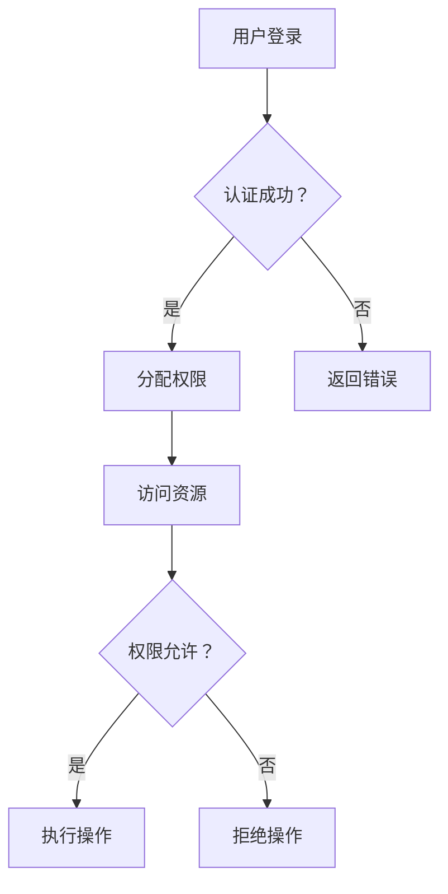
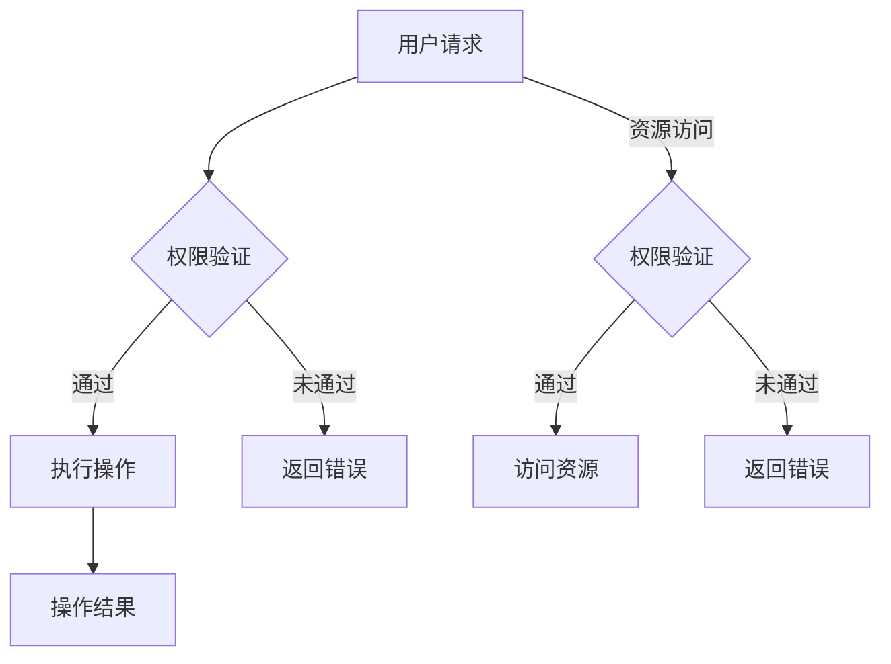
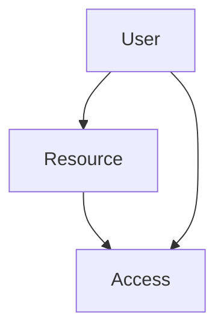

                 

### 文章标题：评测系统的用户权限管理：控制访问和操作权限

#### 关键词：用户权限管理、评测系统、访问控制、授权策略、安全措施

#### 摘要：
本文深入探讨评测系统的用户权限管理，旨在详细阐述控制访问和操作权限的原理、实现方法和实际应用。文章首先介绍了用户权限管理的核心概念，包括用户、角色、权限及其相互关系。接着，我们分析了评测系统的架构设计，特别关注用户权限管理模块的流程和权限数据存储。然后，文章详细介绍了用户认证与授权机制，包括单点登录、双因素认证以及基于角色的访问控制和基于属性的访问控制。随后，我们探讨了访问控制算法，包括ACL和MAC，并使用伪代码进行了详细讲解。文章还涉及了权限管理系统的实现细节，包括开发环境搭建、权限管理模块代码实现和授权策略的实现。此外，文章还介绍了数学模型与公式在权限管理中的应用，并提供了项目实战与案例分析的详细讲解。最后，文章讨论了用户权限管理的安全策略和合规性要求，以保障系统的安全与合规性。

#### 第1章：用户权限管理基础知识

##### 1.1 权限管理的核心概念

在信息技术领域，用户权限管理是一项基础但至关重要的工作。它涉及对用户、角色、权限等核心概念的理解，以及如何有效地管理和控制这些元素之间的相互关系。

**用户**是系统中的一个个体，可以是个人、组织或其他实体。每个用户在系统中都有一个唯一的身份标识，并且拥有一定的权限。

**角色**是一组用户的集合，这些用户因为某些共同点（如职位、职责等）被划分为同一类别。角色通常具有一组预定义的权限，这使得管理员可以集中管理权限，而不是为每个用户单独设置。

**权限**是用户在系统中可以执行的操作或访问的资源。权限可以是对资源的读、写、执行等操作，或者是对系统的某些功能进行访问。

权限管理的重要性在于：

- **安全性**：通过权限管理，可以防止未经授权的用户访问敏感数据和功能，从而保护系统的安全。
- **灵活性**：权限管理允许系统根据不同用户的需求和职责分配权限，使得系统更加灵活。
- **合规性**：许多行业和地区有特定的法规要求，权限管理有助于确保系统符合这些法规。

##### 权限分类

权限通常根据其应用场景和作用范围进行分类：

- **访问权限**：控制用户对资源（如文件、数据库、网络等）的访问能力。
- **操作权限**：控制用户对系统功能或操作的执行能力，如创建、读取、更新、删除等。
- **管理权限**：赋予用户对系统或资源的配置、监控、维护等管理能力。

##### 权限管理的重要性

权限管理在确保系统的安全性、灵活性和合规性方面起着至关重要的作用。以下是权限管理的一些关键重要性：

1. **减少安全漏洞**：通过严格的权限控制，可以减少系统被恶意攻击的风险。
2. **提高系统效率**：权限管理使得系统能够根据用户的实际需求提供合适的访问和操作权限，从而提高系统的使用效率。
3. **满足法规要求**：许多行业和地区有严格的法律法规要求，权限管理有助于确保系统符合这些要求。

##### **Mermaid流程图**：用户权限管理的基本流程



通过以上流程图，我们可以看到用户权限管理的基本流程，包括用户登录、认证、权限分配、访问资源、权限检查和操作执行等步骤。

#### 第2章：评测系统的架构设计

##### 2.1 评测系统的概述

评测系统是一个用于评估用户能力、测试技能或进行其他评价任务的软件系统。它通常具有以下核心功能：

- **用户注册与登录**：允许用户创建账户并登录系统。
- **评测任务创建与管理**：管理员可以创建和管理工作任务。
- **评测执行**：用户完成评测任务。
- **评分与反馈**：系统自动评分并提供反馈。
- **报告生成**：系统生成评测报告。

评测系统的架构设计需要考虑以下几个方面：

1. **前端设计**：用户界面友好，易于使用。
2. **后端设计**：高效、稳定的后端服务，支持高并发。
3. **数据库设计**：存储用户信息、评测任务、评分和反馈等数据。
4. **安全设计**：确保用户数据和系统安全。

##### 2.2 用户权限管理模块的设计

用户权限管理模块是评测系统的关键组成部分，它负责管理和控制用户的访问和操作权限。以下是用户权限管理模块的设计要点：

1. **权限模型**：选择合适的权限模型，如基于角色的访问控制（RBAC）或基于属性的访问控制（ABAC）。
2. **用户角色**：定义不同的用户角色，如管理员、评测员、考生等。
3. **权限分配**：为不同角色分配相应的权限，确保角色权限清晰明确。
4. **权限验证**：在用户访问资源或执行操作时，进行权限验证，确保用户有权限进行相关操作。

##### **Mermaid流程图**：用户权限管理流程



通过以上流程图，我们可以看到用户权限管理的基本流程，包括用户请求、权限验证、执行操作和资源访问等步骤。

##### 2.3 权限数据的存储和管理

权限数据是用户权限管理的基础，其存储和管理至关重要。以下是权限数据存储和管理的关键要点：

1. **数据库设计**：设计一个合理的数据库结构，存储用户、角色、权限和角色权限分配等数据。
2. **权限查询**：实现高效的权限查询，以支持快速的权限验证。
3. **权限更新**：实现权限的添加、删除和修改功能，确保权限数据的一致性。
4. **安全措施**：对权限数据进行加密存储，并采取适当的访问控制措施，防止数据泄露或篡改。

##### **数据库设计示例**

以下是一个简化的数据库设计示例，用于存储用户、角色和权限信息：

```sql
-- 用户表
CREATE TABLE users (
    user_id INT PRIMARY KEY AUTO_INCREMENT,
    username VARCHAR(50) UNIQUE NOT NULL,
    password VARCHAR(50) NOT NULL,
    role_id INT
);

-- 角色表
CREATE TABLE roles (
    role_id INT PRIMARY KEY AUTO_INCREMENT,
    role_name VARCHAR(50) UNIQUE NOT NULL
);

-- 权限表
CREATE TABLE permissions (
    permission_id INT PRIMARY KEY AUTO_INCREMENT,
    permission_name VARCHAR(50) UNIQUE NOT NULL
);

-- 角色权限表
CREATE TABLE role_permissions (
    role_id INT,
    permission_id INT,
    FOREIGN KEY (role_id) REFERENCES roles(role_id),
    FOREIGN KEY (permission_id) REFERENCES permissions(permission_id),
    PRIMARY KEY (role_id, permission_id)
);
```

通过以上数据库设计，我们可以将用户、角色和权限信息存储在三个独立的表中，并通过外键关系实现它们之间的关联。

#### 第3章：用户认证与授权

##### 3.1 用户认证机制

用户认证是用户权限管理的重要组成部分，它确保只有经过验证的用户才能访问系统和资源。以下是几种常见的用户认证机制：

1. **单点登录（Single Sign-On, SSO）**：允许用户使用一个账户登录多个系统，从而简化用户登录过程。
2. **双因素认证（Two-Factor Authentication, 2FA）**：在用户输入密码后，还需要通过第二种方式（如手机验证码、指纹识别等）进行验证，提高安全性。
3. **密码认证**：传统的用户认证方式，用户通过输入密码来验证身份。

**单点登录（SSO）**

单点登录（SSO）是一种允许用户使用一个账户登录多个系统的技术。它的主要优点是简化了用户登录过程，提高了用户体验。以下是SSO的基本流程：

1. **用户请求登录**：用户访问一个支持SSO的系统，并尝试登录。
2. **SSO服务验证**：系统将用户请求转发到SSO服务，由SSO服务进行用户认证。
3. **认证成功**：如果用户认证成功，SSO服务返回认证结果给原系统。
4. **登录成功**：原系统使用认证结果允许用户登录，并为其提供访问权限。

**双因素认证（2FA）**

双因素认证（2FA）是一种在用户输入密码后，还需要通过第二种方式进行验证的认证机制。常见的双因素认证方法包括：

- **手机验证码**：用户输入密码后，系统向用户的手机发送一条验证码，用户需要输入该验证码以完成登录。
- **指纹识别**：用户输入密码后，通过指纹识别设备验证用户的指纹。
- **电子邮件验证**：用户输入密码后，系统向用户的电子邮件发送一封包含验证链接的邮件，用户需要点击链接以完成登录。

双因素认证可以大大提高系统的安全性，因为它增加了攻击者入侵系统的难度。

##### 3.2 授权策略

授权策略是用户权限管理的关键，它定义了用户在系统中可以执行的操作和访问的资源。常见的授权策略包括基于角色的访问控制（RBAC）和基于属性的访问控制（ABAC）。

**基于角色的访问控制（RBAC）**

基于角色的访问控制（RBAC）是一种将用户分为不同的角色，并为每个角色分配相应权限的授权策略。以下是RBAC的基本概念和特点：

- **角色**：角色是一组用户的集合，这些用户因为具有相似职责或职位被划分为同一类别。
- **权限**：权限是用户在系统中可以执行的操作或访问的资源。
- **角色权限分配**：管理员为每个角色分配一组权限，从而定义了角色的能力。
- **用户角色分配**：用户被分配到特定的角色，从而继承了角色的权限。

RBAC的主要优点是：

- **简化权限管理**：通过角色和权限的分配，管理员可以集中管理权限，而无需为每个用户单独设置权限。
- **提高安全性**：RBAC可以防止未经授权的用户访问敏感数据和功能。

**基于属性的访问控制（ABAC）**

基于属性的访问控制（ABAC）是一种基于用户属性（如部门、职位、地理位置等）来决定用户权限的授权策略。以下是ABAC的基本概念和特点：

- **属性**：属性是用户或资源的特征，如部门、职位、地理位置等。
- **策略**：策略是一组规则，用于决定用户是否可以访问特定资源。
- **访问控制决策**：系统根据用户的属性和资源的属性，应用策略来判断用户是否可以访问资源。

ABAC的主要优点是：

- **灵活性**：ABAC可以根据用户的实际需求来动态调整权限，从而提高系统的灵活性。
- **适应多种场景**：ABAC可以适应各种复杂的权限控制需求，如跨组织、跨区域的权限控制。

##### **示例**：基于RBAC的授权策略实现

以下是一个简化的基于RBAC的授权策略实现的示例：

```python
# 用户角色分配
user_role_mapping = {
    'user1': 'admin',
    'user2': 'editor',
    'user3': 'viewer'
}

# 角色权限分配
role_permission_mapping = {
    'admin': ['read', 'write', 'delete'],
    'editor': ['read', 'write'],
    'viewer': ['read']
}

# 权限检查函数
def check_permission(user, action):
    role = user_role_mapping[user]
    permissions = role_permission_mapping[role]
    return action in permissions

# 用户请求操作
user = 'user1'
action = 'write'

# 权限验证
if check_permission(user, action):
    print(f"{user} has permission to {action}.")
else:
    print(f"{user} does not have permission to {action}.")
```

通过以上示例，我们可以看到如何使用RBAC策略来实现用户权限控制。

#### 第4章：权限控制算法

##### 4.1 访问控制算法原理

访问控制算法是用户权限管理的重要组成部分，它用于控制用户对系统资源或操作的访问权限。以下是两种常见的访问控制算法：ACL（访问控制列表）和MAC（强制访问控制）。

**ACL（访问控制列表）**

ACL（访问控制列表）是一种基于列表的访问控制算法，它为每个资源或操作定义一组权限，并指定哪些用户或角色具有相应的权限。以下是ACL的基本原理和特点：

- **资源与权限的映射**：为每个资源或操作创建一个ACL，列出可以访问该资源或执行该操作的用户或角色。
- **权限检查**：在用户请求访问资源或执行操作时，系统检查ACL，确定用户是否有权限进行相关操作。

ACL的主要优点是：

- **灵活性**：ACL允许系统管理员根据实际需求灵活地分配权限，以适应不同的权限控制场景。
- **易于实现**：ACL的实现相对简单，适合小型系统或资源较少的系统。

**MAC（强制访问控制）**

MAC（强制访问控制）是一种基于安全标签的访问控制算法，它为每个用户和资源分配一个安全标签，并使用这些标签来决定访问权限。以下是MAC的基本原理和特点：

- **安全标签**：每个用户和资源都分配一个安全标签，标签包含一组安全属性，如访问级别、敏感度等。
- **权限检查**：在用户请求访问资源或执行操作时，系统比较用户的安全标签和资源的标签，根据标签的属性决定访问权限。

MAC的主要优点是：

- **安全性**：MAC可以确保敏感数据不被未经授权的用户访问，从而提高系统的安全性。
- **适用性**：MAC适用于大型系统或需要严格安全控制的场景。

**ACL实现示例**

以下是一个简化的ACL实现的示例：

```python
# 资源与权限的映射
resource_permissions = {
    'file1': ['user1', 'user2'],
    'file2': ['user2', 'user3']
}

# 权限检查函数
def check_permission(resource, user):
    if user in resource_permissions[resource]:
        return True
    else:
        return False

# 用户请求访问资源
user = 'user1'
resource = 'file1'

# 权限验证
if check_permission(resource, user):
    print(f"{user} has permission to access {resource}.")
else:
    print(f"{user} does not have permission to access {resource}.")
```

通过以上示例，我们可以看到如何使用ACL算法来实现权限控制。

**MAC实现示例**

以下是一个简化的MAC实现的示例：

```python
# 安全标签
user_tags = {
    'user1': {'access_level': 'high', 'sensitivity': 'low'},
    'user2': {'access_level': 'medium', 'sensitivity': 'high'},
    'user3': {'access_level': 'low', 'sensitivity': 'low'}
}

# 资源标签
resource_tags = {
    'file1': {'access_level': 'high', 'sensitivity': 'high'},
    'file2': {'access_level': 'medium', 'sensitivity': 'medium'},
    'file3': {'access_level': 'low', 'sensitivity': 'low'}
}

# 权限检查函数
def check_permission(user_tag, resource_tag):
    if user_tag['access_level'] >= resource_tag['access_level'] and user_tag['sensitivity'] <= resource_tag['sensitivity']:
        return True
    else:
        return False

# 用户请求访问资源
user_tag = user_tags['user1']
resource_tag = resource_tags['file1']

# 权限验证
if check_permission(user_tag, resource_tag):
    print(f"{user_tag['user']} has permission to access {resource_tag['resource']}.")
else:
    print(f"{user_tag['user']} does not have permission to access {resource_tag['resource']}.")
```

通过以上示例，我们可以看到如何使用MAC算法来实现权限控制。

##### 4.2 操作权限控制

操作权限控制是权限管理的关键环节，它确保用户只能执行被授权的操作。以下是操作权限控制的两种常见方法：数据库操作权限控制和系统功能权限控制。

**数据库操作权限控制**

数据库操作权限控制用于限制用户对数据库的访问和操作。以下是一个数据库操作权限控制的示例：

```sql
-- 创建数据库用户
CREATE USER 'db_user' IDENTIFIED BY 'password';

-- 授予数据库操作权限
GRANT SELECT, INSERT, UPDATE, DELETE ON database_name.* TO 'db_user';

-- 查询数据库用户权限
SHOW GRANTS FOR 'db_user';
```

通过以上SQL语句，我们可以为数据库用户`db_user`授予特定的数据库操作权限。

**系统功能权限控制**

系统功能权限控制用于限制用户对系统功能的访问和操作。以下是一个系统功能权限控制的示例：

```python
# 权限检查函数
def check_permission(user, action):
    if user in system_permissions[action]:
        return True
    else:
        return False

# 系统功能权限列表
system_permissions = {
    'read_data': ['user1', 'user2'],
    'write_data': ['user1'],
    'delete_data': ['user1']
}

# 用户请求操作
user = 'user1'
action = 'write_data'

# 权限验证
if check_permission(user, action):
    print(f"{user} has permission to {action}.")
else:
    print(f"{user} does not have permission to {action}.")
```

通过以上示例，我们可以看到如何使用权限检查函数和权限列表来实现系统功能权限控制。

#### 第5章：权限管理系统的实现

##### 5.1 系统开发环境搭建

在实现权限管理系统之前，需要搭建合适的开发环境。以下是搭建系统开发环境的步骤：

1. **安装操作系统**：选择适合的操作系统，如Linux或Windows。
2. **安装开发工具**：安装集成开发环境（IDE），如Eclipse或Visual Studio。
3. **安装数据库**：选择合适的数据库系统，如MySQL或PostgreSQL。
4. **安装开发语言**：选择合适的编程语言，如Python或Java。
5. **配置环境变量**：设置环境变量，以便在命令行中轻松调用开发工具和数据库。

##### 5.2 权限管理模块代码实现

权限管理模块是实现用户权限控制的核心部分。以下是权限管理模块的代码实现：

```python
# 权限管理模块伪代码
class PermissionManager:
    def __init__(self, db_connection):
        self.db_connection = db_connection
    
    def assign_role_to_user(self, user, role):
        # 将用户分配到角色
        pass
    
    def assign_permission_to_role(self, role, permission):
        # 将权限分配到角色
        pass
    
    def check_permission(self, user, action):
        # 检查用户是否具有执行操作的权限
        pass
    
    def update_permission(self, user, action, permission):
        # 更新用户的权限
        pass
    
    def delete_permission(self, user, action):
        # 删除用户的权限
        pass
```

通过以上伪代码，我们可以看到权限管理模块的主要功能，包括分配角色、分配权限、检查权限、更新权限和删除权限。

##### 5.3 授权策略实现

授权策略是实现权限控制的关键，以下是基于RBAC的授权策略实现的示例：

```python
# 授权策略实现
class RBACAuthorizationPolicy:
    def __init__(self, role_permissions):
        self.role_permissions = role_permissions
    
    def check_permission(self, user, action):
        role = self.get_role(user)
        if role and action in self.role_permissions[role]:
            return True
        else:
            return False
    
    def get_role(self, user):
        # 从数据库中获取用户的角色
        pass
```

通过以上示例，我们可以看到如何使用RBAC策略来检查用户的权限。

##### 5.4 权限控制算法实现

以下是ACL和MAC的权限控制算法实现的示例：

**ACL实现示例**

```python
# ACL权限控制算法实现
class ACLPermissionControl:
    def __init__(self, resource_permissions):
        self.resource_permissions = resource_permissions
    
    def check_permission(self, user, resource):
        if resource in self.resource_permissions and user in self.resource_permissions[resource]:
            return True
        else:
            return False
```

**MAC实现示例**

```python
# MAC权限控制算法实现
class MACPermissionControl:
    def __init__(self, user_tags, resource_tags):
        self.user_tags = user_tags
        self.resource_tags = resource_tags
    
    def check_permission(self, user_tag, resource_tag):
        if user_tag['access_level'] >= resource_tag['access_level'] and user_tag['sensitivity'] <= resource_tag['sensitivity']:
            return True
        else:
            return False
```

通过以上示例，我们可以看到如何使用ACL和MAC算法来实现权限控制。

#### 第6章：数学模型与公式详解

##### 6.1 权限分配模型

在用户权限管理中，权限分配模型用于定义用户和资源的权限分配策略。以下是一个简单的概率模型示例：

**概率模型**

概率模型基于概率论原理，用于计算用户访问特定资源的概率。以下是一个简化的概率模型示例：

```python
# 概率模型
P(access) = P(user) * P(resource) * P(user accesses resource | user and resource)

# 参数说明
P(user)：用户存在的概率
P(resource)：资源存在的概率
P(user accesses resource | user and resource)：在用户和资源都存在的情况下，用户访问资源的概率
```

通过以上公式，我们可以计算用户访问特定资源的概率。

**贝叶斯网络**

贝叶斯网络是一种概率图模型，用于表示变量之间的条件依赖关系。以下是一个简化的贝叶斯网络示例：



在贝叶斯网络中，每个节点表示一个变量，边表示变量之间的依赖关系。通过贝叶斯网络，我们可以计算变量之间的概率分布，从而实现权限分配。

##### 6.2 数学公式

在用户权限管理中，数学公式用于描述权限分配、权限验证等过程。以下是一些常用的数学公式：

**条件概率**

条件概率表示在某个条件下，事件发生的概率。以下是一个简化的条件概率公式：

$$ P(A|B) = \frac{P(B|A)P(A)}{P(B)} $$

其中，$P(A|B)$表示在事件$B$发生的条件下，事件$A$发生的概率。

**贝叶斯公式**

贝叶斯公式是一种用于计算后验概率的公式。以下是一个简化的贝叶斯公式：

$$ P(A|B) = \frac{P(B|A)P(A)}{P(B)} $$

其中，$P(A|B)$表示在事件$B$发生的条件下，事件$A$发生的概率。

通过以上数学公式，我们可以更准确地描述用户权限管理的过程，从而提高系统的安全性和灵活性。

#### 第7章：项目实战与案例分析

##### 7.1 项目案例介绍

为了更好地理解用户权限管理的实际应用，我们选择了一个在线评测系统的项目作为案例。该系统用于评估用户在不同领域的知识和技能。以下是项目的主要功能：

- **用户注册与登录**：用户可以注册账户并登录系统。
- **评测任务创建与管理**：管理员可以创建和管理评测任务。
- **评测执行**：用户可以完成评测任务并提交答案。
- **评分与反馈**：系统自动评分并提供反馈。
- **报告生成**：系统生成评测报告。

##### 7.2 实际代码示例

以下是项目中的权限管理模块的代码示例：

```python
# 权限管理模块代码示例
class PermissionManager:
    def __init__(self, db_connection):
        self.db_connection = db_connection
    
    def assign_role_to_user(self, user, role):
        # 将用户分配到角色
        pass
    
    def assign_permission_to_role(self, role, permission):
        # 将权限分配到角色
        pass
    
    def check_permission(self, user, action):
        # 检查用户是否具有执行操作的权限
        pass
    
    def update_permission(self, user, action, permission):
        # 更新用户的权限
        pass
    
    def delete_permission(self, user, action):
        # 删除用户的权限
        pass
```

通过以上代码示例，我们可以看到权限管理模块的基本实现。

##### 7.3 代码解读与分析

以下是代码解读与分析：

1. **初始化**：权限管理模块初始化时，接收数据库连接对象作为参数，以便后续操作与数据库交互。
2. **分配角色**：`assign_role_to_user`方法用于将用户分配到特定角色。在实际实现中，我们需要查询数据库，为用户设置相应的角色。
3. **分配权限**：`assign_permission_to_role`方法用于将权限分配到特定角色。在实际实现中，我们需要将权限与角色关联，以便后续权限验证。
4. **检查权限**：`check_permission`方法用于检查用户是否具有执行特定操作的权限。在实际实现中，我们需要查询数据库，检查用户与角色的关联关系，并验证用户是否具有执行操作的权限。
5. **更新权限**：`update_permission`方法用于更新用户的权限。在实际实现中，我们需要更新数据库中的权限记录。
6. **删除权限**：`delete_permission`方法用于删除用户的权限。在实际实现中，我们需要删除数据库中的权限记录。

通过以上解读与分析，我们可以更好地理解权限管理模块的实现原理。

##### 7.4 实际案例分析和详细讲解剖析

以下是实际案例分析和详细讲解剖析：

1. **案例背景**：在一个在线评测系统中，用户需要进行注册和登录，以完成评测任务。
2. **权限需求**：管理员可以创建和管理评测任务，用户可以完成评测任务并提交答案。
3. **权限验证**：在用户执行操作时，权限管理模块需要验证用户是否具有执行操作的权限。例如，用户在提交答案时，需要验证用户是否具有`submit_answer`权限。
4. **权限控制**：权限管理模块通过数据库查询用户和角色的关联关系，检查用户是否具有执行操作的权限。如果用户具有权限，则允许执行操作；否则，拒绝操作并返回错误信息。

通过以上案例分析和详细讲解剖析，我们可以看到权限管理在在线评测系统中的实际应用，以及如何实现权限验证和权限控制。

##### 7.5 项目小结

通过本项目的实战与案例分析，我们深入了解了用户权限管理的实际应用。项目实现了用户注册、登录、评测任务创建、评测任务完成等功能，并通过权限管理模块实现了权限验证和权限控制。项目小结如下：

1. **关键实现**：权限管理模块实现了用户角色分配、权限分配、权限验证等功能。
2. **功能完善**：通过权限管理模块，我们可以确保系统中的用户只能执行被授权的操作。
3. **安全增强**：权限管理模块提高了系统的安全性，防止未经授权的用户访问系统和资源。

#### 第8章：用户权限管理的安全策略

##### 8.1 安全风险分析

用户权限管理涉及到系统的核心安全部分，其安全策略的制定至关重要。以下是用户权限管理中可能面临的一些安全风险：

1. **窃取权限**：攻击者可能通过各种手段获取用户的权限，从而访问敏感数据和执行非法操作。
2. **权限滥用**：用户可能滥用其权限，访问或修改不应访问或修改的数据。
3. **权限绕过**：攻击者可能尝试绕过权限验证机制，非法访问系统和资源。
4. **权限泄露**：权限信息泄露可能导致攻击者获取用户权限，从而实施恶意操作。

为了应对上述安全风险，我们需要采取一系列安全措施：

##### 8.2 安全措施

1. **数据加密**：对用户密码、权限信息等敏感数据使用加密算法进行加密存储，防止数据泄露。
2. **访问控制**：通过权限验证机制，确保用户只能访问被授权的数据和功能。
3. **审计日志**：记录用户访问系统和资源的日志，以便在发生安全事件时进行追踪和审计。
4. **安全培训**：对系统管理员和用户进行安全培训，提高他们对权限管理安全性的认识和应对能力。

##### 8.3 安全策略实施

1. **密码策略**：要求用户设置复杂密码，并定期更换密码。
2. **权限最小化**：用户应仅拥有完成工作所需的最低权限，避免权限滥用。
3. **多因素认证**：采用多因素认证机制，增加用户身份验证的难度，提高系统的安全性。
4. **权限审计**：定期进行权限审计，确保权限分配和使用的合理性。

通过以上安全策略的实施，我们可以有效降低用户权限管理中的安全风险，确保系统的安全稳定运行。

#### 第9章：合规与法规遵循

##### 9.1 合规性要求

用户权限管理不仅要确保系统的安全性，还需符合各种法律法规的要求。以下是几个常见的合规性要求：

1. **GDPR（通用数据保护条例）**：欧盟的GDPR规定了个人数据的保护要求，包括数据收集、存储、处理和传输等方面的规范。
2. **CCPA（加州消费者隐私法案）**：加州的CCPA规定了消费者数据的权利和保护，包括数据访问、删除和隐私保护等。
3. **HIPAA（健康保险便携与责任法案）**：美国的HIPAA规定了医疗数据的安全和管理要求。
4. **SOX（萨班斯-奥克斯利法案）**：美国的SOX规定了公司财务报告的透明度和内部控制要求。

##### 9.2 合规性实践

为了满足合规性要求，权限管理需要采取以下实践措施：

1. **数据保护**：确保个人数据的收集、存储和处理遵循GDPR的要求，包括数据最小化、数据加密、用户权利保护等。
2. **权限审计**：定期进行权限审计，确保权限分配和使用的合规性，防止数据泄露和滥用。
3. **权限监控**：监控用户权限的使用情况，及时发现和报告潜在的安全风险。
4. **合规培训**：对员工进行合规性培训，提高他们对相关法律法规的认识和遵守。

通过以上合规性实践，我们可以确保用户权限管理不仅满足安全要求，还符合法律法规的要求。

### 附录

#### 附录A：常用权限管理工具

1. **OpenID Connect**：一种基于OAuth 2.0的认证协议，用于提供单点登录功能。
2. **OAuth 2.0**：一种授权协议，用于实现第三方应用对用户资源的访问。
3. **SAML（安全断言标记语言）**：一种用于单点登录和身份验证的XML标准。

#### 附录B：参考文献

1. **《OAuth 2.0简明教程》** - Alex Banks and Bob Williams
2. **《GDPR合规指南》** - ICO（英国信息专员办公室）
3. **《加州消费者隐私法案（CCPA）概述》** -加州立法机构
4. **《健康保险便携与责任法案（HIPAA）》** - HHS（美国卫生与公众服务部）
5. **《萨班斯-奥克斯利法案（SOX）》** - SEC（美国证券交易委员会）

### 作者信息：

作者：AI天才研究院/AI Genius Institute & 禅与计算机程序设计艺术 /Zen And The Art of Computer Programming

