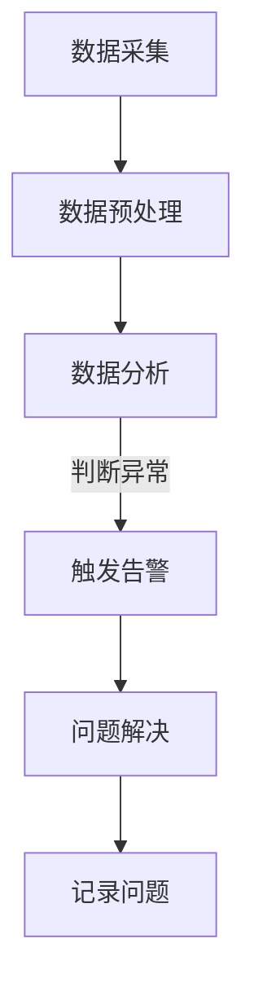
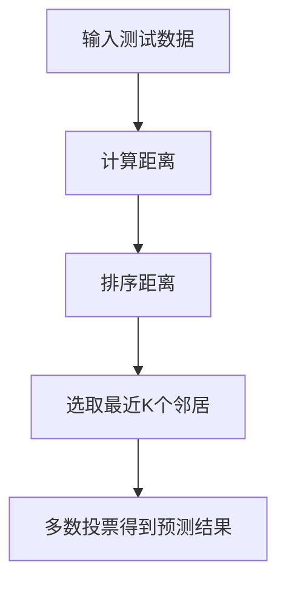
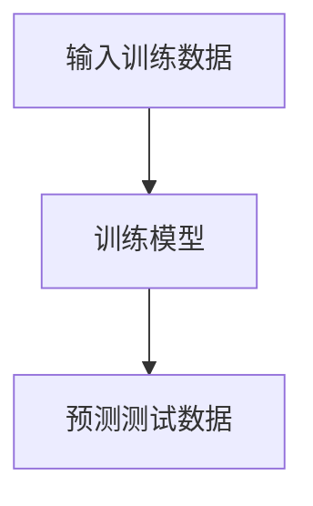
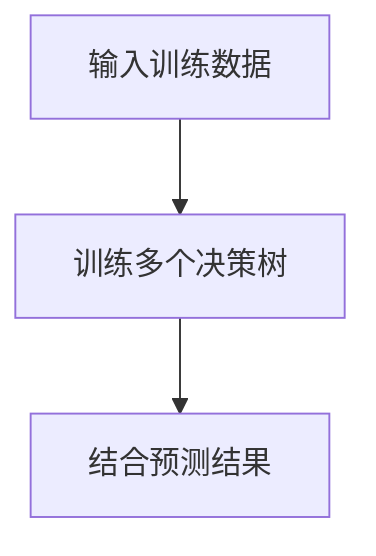
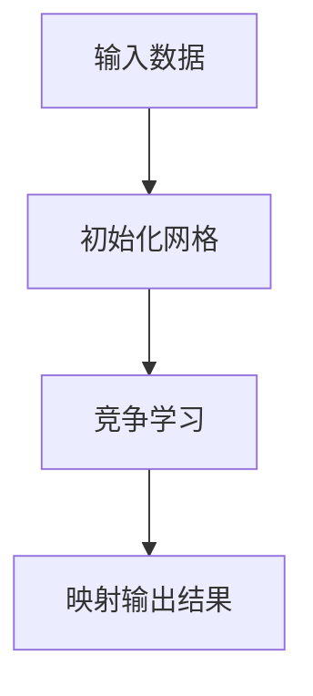

                 

### 文章标题：评测系统的自动化异常检测与报警

### 关键词：
- 评测系统
- 自动化异常检测
- 异常报警
- 监控与告警
- 数据分析

### 摘要：
本文将深入探讨评测系统的自动化异常检测与报警机制，详细解析其在现代信息技术环境中的重要性。通过介绍评测系统的基本概念、异常检测的核心原理，以及常见的自动化异常检测算法，本文旨在为读者提供一套系统的理解和实践框架。此外，文章还将通过实际案例展示自动化异常检测与报警的应用场景，提供最佳实践和注意事项，为开发者在实际项目中应用这一技术提供指导。

## 引言

在信息技术迅速发展的今天，评测系统已经成为许多关键业务场景的核心组成部分。从金融交易监控到网络服务稳定性保障，评测系统的可靠性和实时性显得尤为重要。然而，随着数据量的爆炸式增长和系统复杂性的不断提升，传统的人工监控方式已无法满足需求。自动化异常检测与报警技术的引入，成为提升评测系统效率和准确性的关键手段。

自动化异常检测与报警的核心目标是在数据流中迅速识别出异常行为，并通过实时报警系统通知相关人员，从而实现快速响应和问题解决。这不仅提高了系统的稳定性，也降低了人工干预的成本。因此，掌握自动化异常检测与报警技术对于IT从业人员来说至关重要。

本文将从以下几个方面进行深入探讨：

1. **评测系统的基本概念**：介绍评测系统的定义、组成部分及其在信息技术中的重要性。
2. **异常检测的核心原理**：分析异常检测的基本概念、分类以及其与评测系统的关系。
3. **自动化异常检测算法**：详细讲解常见的自动化异常检测算法，包括其原理、伪代码实现以及实际应用。
4. **异常报警机制**：探讨如何设计高效的异常报警系统，包括告警策略、通知机制等。
5. **项目实战**：通过实际案例展示自动化异常检测与报警系统的实现过程，提供详细的代码解读和分析。
6. **最佳实践与注意事项**：总结自动化异常检测与报警的最佳实践，提出注意事项和拓展阅读建议。

通过本文的阅读，读者将能够系统地了解并掌握自动化异常检测与报警技术，为实际项目中的应用奠定坚实基础。

## 评测系统的基本概念

### 定义与组成部分

评测系统是一种用于评估、监控和保障系统稳定性的综合平台，它能够收集、处理和展示大量的数据，帮助运维人员及时发现并解决问题。一个典型的评测系统通常包括以下几个核心组成部分：

1. **数据采集模块**：负责从不同的数据源（如服务器、网络设备、数据库等）中收集数据。这些数据可以是实时流量、系统性能指标、用户行为数据等。
2. **数据处理模块**：对采集到的原始数据进行清洗、转换和整合，以形成适合分析和监控的格式。这一模块通常包括数据清洗工具、ETL（提取、转换、加载）过程等。
3. **数据存储模块**：用于存储经过处理的数据，以便后续的分析和查询。常见的数据存储方案包括关系数据库、NoSQL数据库和大数据存储系统。
4. **分析引擎**：负责对存储的数据进行分析，以识别潜在的异常行为或模式。分析引擎可以基于统计方法、机器学习算法、规则引擎等不同技术。
5. **告警与通知模块**：当分析引擎检测到异常时，及时触发告警并通知相关人员。通知方式可以包括电子邮件、短信、即时消息、可视化仪表板等。

### 在信息技术中的重要性

评测系统在现代信息技术中的重要性不可低估。首先，它能够提供实时的系统状态监控，帮助运维人员快速识别和响应系统故障，从而减少系统停机时间和业务损失。其次，通过持续的数据分析和异常检测，评测系统可以预测潜在问题，预防故障的发生，提升系统的稳定性。此外，评测系统还能为业务决策提供数据支持，帮助管理层优化资源配置、改进服务质量和制定战略规划。

### 数据流与数据处理流程

一个典型的评测系统的数据处理流程可以概括为以下几个步骤：

1. **数据采集**：数据采集模块从各个数据源获取数据，并将其转换为统一格式。
2. **数据预处理**：在数据进入分析引擎之前，需要对数据进行预处理，包括去除噪声、填充缺失值、标准化等操作。
3. **数据存储**：预处理后的数据被存储在数据存储模块中，以便后续查询和分析。
4. **数据分析**：分析引擎对存储的数据进行分析，识别异常行为或趋势。
5. **触发告警**：当分析引擎检测到异常时，通知告警与通知模块，通过多种方式通知相关人员。
6. **问题解决**：相关人员根据告警信息进行问题排查和修复，并记录问题解决过程，为后续优化提供依据。

### 关键技术与挑战

在实现评测系统时，需要考虑以下几个关键技术和挑战：

1. **数据源多样性**：不同数据源的数据格式和结构可能存在较大差异，需要设计灵活的数据采集和处理方案。
2. **海量数据处理**：随着数据量的增长，如何高效地处理和存储海量数据成为关键挑战。
3. **实时性与准确性**：在保证系统实时性的同时，如何提高异常检测的准确性是另一个重要课题。
4. **告警疲劳**：过多的告警信息可能导致告警疲劳，需要设计智能的告警策略，减少无效告警。

通过深入理解评测系统的基本概念和组成部分，读者可以更好地把握其在信息技术中的重要作用，为后续内容的阅读和实际应用打下坚实基础。

## 异常检测的核心原理

### 异常检测的基本概念

异常检测（Anomaly Detection）是一种数据挖掘技术，旨在识别数据中的异常行为或模式。异常可以定义为与大多数数据点不一致的值或事件，它们可能是由错误、故障或恶意活动引起的。在评测系统中，异常检测是确保系统正常运行的关键环节，通过识别异常行为，可以及时发现问题并采取措施。

### 异常检测在评测系统中的重要性

异常检测在评测系统中的重要性主要体现在以下几个方面：

1. **提高系统稳定性**：通过实时监测系统状态，异常检测能够快速发现潜在的故障或异常行为，从而降低系统停机风险，提高稳定性。
2. **保障数据安全性**：异常检测可以帮助识别恶意活动，如数据泄露、网络攻击等，确保系统的安全运行。
3. **优化资源分配**：通过分析异常行为，可以优化系统的资源分配，避免资源浪费，提高资源利用效率。
4. **支持业务决策**：异常检测提供的数据分析结果可以为业务决策提供重要依据，帮助管理层更好地应对市场变化和业务挑战。

### 异常检测的分类

根据不同的特征和实现方式，异常检测可以大致分为以下几类：

1. **基于统计的异常检测**：这种方法依赖于统计学模型，如标准差、四分位距等，通过比较数据点的统计特征与预期值来判断是否为异常。
   
   - **优势**：实现简单，易于理解。
   - **劣势**：对异常分布假设较强，可能对大规模数据集表现不佳。

2. **基于模型的异常检测**：这种方法使用机器学习模型（如神经网络、支持向量机、决策树等）来识别数据中的异常。

   - **优势**：能够处理高维数据和复杂的异常模式。
   - **劣势**：模型训练需要大量数据和计算资源，且需要调整超参数。

3. **基于关联规则的异常检测**：这种方法通过分析数据之间的关联规则来识别异常。

   - **优势**：能够发现数据之间的潜在关联性。
   - **劣势**：对大量数据可能导致规则爆炸问题，处理复杂。

4. **基于密度的异常检测**：这种方法通过计算数据点密度来识别异常，如LOF（局部离群因子）和DBSCAN（基于密度的聚类算法）。

   - **优势**：对噪声和稀疏数据有较强的鲁棒性。
   - **劣势**：计算复杂度较高，对大规模数据集可能较慢。

### 异常检测与评测系统的关系

异常检测与评测系统密切相关，二者相辅相成：

1. **评测系统提供了数据基础**：通过评测系统，可以收集到大量的系统运行数据，为异常检测提供数据支持。
2. **异常检测提升了评测系统的能力**：通过异常检测，评测系统能够更准确地识别系统中的异常行为，提高监控和预警的准确性。
3. **两者共同保障系统稳定性**：评测系统通过异常检测，可以及时发现和处理系统故障，保障系统的稳定性和可靠性。

### 关键概念与联系

为了更好地理解异常检测在评测系统中的应用，以下是一些关键概念及其相互关系：

- **数据点**：异常检测的基本单位，表示系统中的每一个观测值。
- **特征**：用于描述数据点的属性，如流量、负载、响应时间等。
- **异常分数**：用于量化数据点是否为异常的指标，分数越高，表示异常性越强。
- **阈值**：用于判断数据点是否为异常的标准，超过阈值的视为异常。
- **异常模式**：多个异常数据点组成的模式，可能反映系统中的某种异常情况。

### Mermaid流程图

为了更直观地展示异常检测在评测系统中的应用流程，可以使用Mermaid流程图进行描述：



### 结论

通过以上对异常检测核心原理的解析，可以看出，异常检测在评测系统中起着至关重要的作用。它不仅能够提高系统的稳定性，还能够为业务决策提供重要支持。理解异常检测的分类、关键概念及其与评测系统的关系，有助于读者更好地掌握这一技术，并在实际项目中有效应用。

## 自动化异常检测算法

### 常见自动化异常检测算法

在自动化异常检测领域，有多种算法被广泛应用，每种算法都有其独特的原理和适用场景。以下将介绍几种常见的自动化异常检测算法，包括KNN算法、支持向量机（SVM）和随机森林（Random Forests）。

### 1. KNN算法

**原理**：K最近邻（K-Nearest Neighbors，KNN）算法是一种基于实例的学习算法。它通过计算测试样本与训练集中其他样本的相似度，找出最近的K个邻居，并根据这些邻居的标签来预测测试样本的类别或数值。

**伪代码**：

```python
def knn_predict(X_train, y_train, X_test, k):
    distances = []
    for x in X_test:
        for x_train in X_train:
            dist = euclidean_distance(x, x_train)
            distances.append((x_train, dist))
    distances.sort(key=lambda x: x[1])
    neighbors = [distances[i][0] for i in range(k)]
    return majority_vote(neighbors, y_train)
```

**Mermaid流程图**：



**适用场景**：KNN算法适用于小型数据集和特征较少的情况，适合分类问题。

### 2. 支持向量机（SVM）

**原理**：支持向量机（Support Vector Machine，SVM）是一种二分类模型，其目标是找到一个最优的超平面，将不同类别的数据点分开。SVM通过最大化分类边界上的支持向量来提高模型的泛化能力。

**伪代码**：

```python
def svm_train(X, y):
    # 使用SVM库进行训练
    model = SVC(kernel='linear')
    model.fit(X, y)
    return model

def svm_predict(model, X):
    return model.predict(X)
```

**Mermaid流程图**：



**适用场景**：SVM适用于高维数据集，适合处理小样本问题，尤其是线性可分的数据集。

### 3. 随机森林（Random Forests）

**原理**：随机森林（Random Forests）是一种集成学习算法，通过构建多个决策树，并结合它们的预测结果来进行最终的预测。随机森林通过随机选择特征和随机划分节点来降低模型的方差，提高预测的准确性。

**伪代码**：

```python
def random_forest_train(X, y, n_estimators):
    # 使用随机森林库进行训练
    model = RandomForestClassifier(n_estimators=n_estimators)
    model.fit(X, y)
    return model

def random_forest_predict(model, X):
    return model.predict(X)
```

**Mermaid流程图**：



**适用场景**：随机森林适用于各种类型的数据集，尤其适合处理高维数据和非线性数据。

### 4. 自组织映射（Self-Organizing Maps，SOM）

**原理**：自组织映射（SOM）是一种无监督学习方法，通过竞争学习算法将输入数据映射到一个二维网格中。SOM能够发现数据中的聚类结构和模式，从而用于异常检测。

**伪代码**：

```python
def som_train(X, grid_shape):
    # 使用SOM库进行训练
    model = Minisom(grid_shape, learning_rate=0.1, sigma=1.0)
    model.train(X)
    return model

def som_predict(model, X):
    return model.predict(X)
```

**Mermaid流程图**：



**适用场景**：SOM适用于高维数据的降维和聚类，特别适合处理非线性和高维数据。

### 结论

自动化异常检测算法在提升评测系统的异常检测效率和准确性方面起着重要作用。KNN算法、SVM、随机森林和SOM等算法各有特点，适用于不同的数据集和场景。通过合理选择和调整算法参数，可以实现对异常行为的有效识别和报警，提高系统的整体性能和可靠性。

## 实时异常检测

### 实时性与重要性

实时异常检测是一种能够在数据生成的同时进行异常识别和报警的技术，其核心在于“实时”二字，即检测和响应速度要快，以确保系统能够迅速应对突发问题。在现代信息技术环境中，实时异常检测的重要性愈发凸显，主要体现在以下几个方面：

1. **快速响应**：实时异常检测能够在异常发生的第一时间检测并报警，让运维团队能够快速介入，减少故障的影响范围和持续时间。
2. **降低人工干预成本**：实时异常检测减少了人工监控的负担，提高了工作效率，降低了人工干预的成本。
3. **增强系统可靠性**：通过实时检测和报警，系统能够及时发现和修复潜在问题，提高整体稳定性和可靠性。
4. **优化资源利用**：实时异常检测能够识别和隔离异常流量或行为，从而优化系统的资源分配，提高资源利用率。

### 实时异常检测的挑战

尽管实时异常检测具有显著优势，但其实现过程也面临诸多挑战：

1. **处理速度**：实时性要求处理速度快，对系统的硬件和软件架构提出了高要求。
2. **数据量大**：随着系统规模的扩大，实时处理的的数据量也大幅增加，这对系统的数据处理能力提出了挑战。
3. **延迟容忍度**：在某些关键业务场景中，对延迟容忍度有严格要求，实时异常检测技术需要确保极低或无延迟。
4. **准确性**：在保证实时性的同时，如何保持高准确性的检测效果是另一个难题，过高的误报率会影响系统的稳定运行。

### 实时异常检测的实现方法

为了实现高效的实时异常检测，可以采用以下几种方法：

1. **分布式系统架构**：通过分布式计算架构，将计算任务分散到多个节点上，提高处理速度和并发能力。
2. **流处理技术**：利用流处理框架（如Apache Kafka、Apache Flink等），实现数据的实时采集和处理。
3. **高效算法**：选择高效且适合实时处理的算法，如基于密度的聚类算法、基于阈值的统计方法等。
4. **机器学习模型优化**：通过优化机器学习模型的结构和参数，提高模型的实时处理能力和准确性。

### 实时异常检测系统设计

一个典型的实时异常检测系统设计包括以下几个关键组件：

1. **数据采集模块**：负责实时采集系统产生的各种数据，如日志文件、网络流量、性能指标等。
2. **数据预处理模块**：对采集到的数据进行预处理，包括去噪、数据格式转换、特征提取等。
3. **实时分析引擎**：负责实时分析预处理后的数据，识别潜在的异常行为，并触发报警。
4. **报警通知模块**：当检测到异常时，及时通知相关人员，可以通过邮件、短信、即时消息等方式。
5. **日志记录与审计模块**：记录异常检测的整个过程，包括检测到的异常数据、处理结果和操作记录，以便后续分析和审计。

### 实际案例

以下是实时异常检测在某一网络安全监控系统中的应用案例：

1. **场景描述**：某大型企业的网络安全监控系统需要对网络流量进行实时监控，以识别潜在的入侵行为。
2. **系统架构**：采用分布式系统架构，通过Apache Kafka实时收集网络流量数据，利用Apache Flink进行实时处理和分析。
3. **算法选择**：采用基于密度的聚类算法（如DBSCAN）进行异常检测，通过设定合适的阈值来识别异常流量。
4. **实时报警**：当检测到异常流量时，通过邮件和短信实时通知网络安全团队，同时将异常流量记录到日志系统中。

通过该案例可以看出，实时异常检测系统在实际应用中能够有效地提高网络安全监控的效率和准确性，减少潜在威胁对企业的影响。

## 异常报警机制

### 告警策略

告警策略是异常报警机制中的关键组成部分，它决定了哪些异常行为需要被检测到，并通知相关人员进行处理。设计有效的告警策略需要考虑以下几个因素：

1. **异常程度**：根据异常的严重程度来设定告警的优先级，如严重级别、紧急程度等。
2. **触发条件**：定义触发告警的具体条件，可以是单一条件，也可以是多个条件组合。
3. **阈值设置**：根据数据特征和业务需求，设定合适的阈值，以区分正常数据和异常数据。
4. **频率控制**：为了避免过多的告警信息导致告警疲劳，需要设定告警的频率控制策略。
5. **分级管理**：根据告警的严重程度和影响范围，将告警分为不同等级，并设置相应的响应流程。

### 通知机制

有效的通知机制能够确保相关人员及时收到告警信息，并采取相应的行动。常见的通知机制包括以下几种：

1. **电子邮件**：发送告警通知到用户的电子邮件地址，这是一种最常用的通知方式，适用于大多数场景。
2. **短信**：通过短信平台发送告警信息到用户手机，适用于需要快速响应的场景。
3. **即时消息**：利用企业即时通讯工具（如Slack、Microsoft Teams等）发送告警信息，支持实时互动。
4. **可视化仪表板**：在监控系统中集成可视化仪表板，实时显示异常情况和处理进度。
5. **自动化操作**：在检测到严重异常时，系统可以自动执行特定的操作，如重启服务、隔离节点等。

### 告警系统设计

设计一个高效、可靠的告警系统，需要考虑以下几个关键方面：

1. **可靠性**：确保告警系统能够在系统故障、网络问题等情况下正常工作，保证告警信息不会丢失。
2. **实时性**：告警系统能够及时检测到异常并触发告警，减少延迟。
3. **灵活性**：告警系统应具有灵活性，允许用户自定义告警策略和通知方式。
4. **可扩展性**：告警系统应能够支持大规模数据和复杂的监控场景，具备良好的扩展性。
5. **安全性**：确保告警信息的传输和存储安全，防止信息泄露和攻击。

### 实际案例

以下是某个电商平台告警系统的设计案例：

1. **场景描述**：电商平台需要监控订单处理、库存情况、服务器负载等关键指标，确保业务的连续性和稳定性。
2. **告警策略**：设定不同指标的告警阈值，如订单处理延迟超过5分钟触发紧急告警，服务器负载超过90%触发警告。
3. **通知机制**：当检测到异常时，通过邮件、短信、Slack等多种方式通知相关负责人，同时更新可视化仪表板，显示异常情况和处理进度。
4. **自动化操作**：对于严重的异常，如订单系统崩溃，系统会自动重启服务，并通知技术团队进行排查。

通过这个案例，可以看出一个完善的告警系统对于电商平台这样的高负荷、高实时性业务场景至关重要，它能够确保业务在出现异常时能够迅速响应和处理，减少业务中断的风险。

## 项目实战

### 开发环境搭建

为了实现评测系统的自动化异常检测与报警功能，我们选择以下开发环境：

1. **操作系统**：Ubuntu 20.04
2. **编程语言**：Python 3.8
3. **依赖库**：scikit-learn、pandas、numpy、matplotlib、mlxtend
4. **数据库**：PostgreSQL
5. **消息队列**：RabbitMQ
6. **可视化工具**：Dash（基于Flask）

确保已安装上述环境和库，可以通过以下命令进行安装：

```bash
sudo apt-get update
sudo apt-get install python3-pip
pip3 install scikit-learn pandas numpy matplotlib mlxtend
sudo apt-get install rabbitmq-server
sudo systemctl start rabbitmq-server
```

### 源代码详细实现和代码解读

以下是实现自动化异常检测与报警系统的核心代码部分，包括数据采集、预处理、模型训练、异常检测和告警通知。

```python
import pandas as pd
import numpy as np
from sklearn.ensemble import IsolationForest
from sklearn.preprocessing import StandardScaler
from sklearn.model_selection import train_test_split
import matplotlib.pyplot as plt
import mlxtend.plotting as mlplt
from dash import Dash, html, dcc

# 数据采集
def collect_data(filename):
    data = pd.read_csv(filename)
    return data

# 数据预处理
def preprocess_data(data):
    # 数据清洗
    data = data.dropna()
    # 特征提取
    features = data[['feature1', 'feature2', 'feature3']]
    # 数据标准化
    scaler = StandardScaler()
    features_scaled = scaler.fit_transform(features)
    return features_scaled

# 模型训练
def train_model(data):
    model = IsolationForest(n_estimators=100, contamination='auto')
    model.fit(data)
    return model

# 异常检测
def detect_anomalies(model, data):
    predictions = model.predict(data)
    anomalies = np.where(predictions == -1)
    return anomalies

# 告警通知
def alert_notification(anomalies):
    # 发送告警邮件
    subject = "异常检测报警"
    message = f"检测到异常数据：{anomalies}"
    send_email(subject, message)
    # 更新仪表板
    update_dashboard(anomalies)

# 测试
if __name__ == "__main__":
    data = collect_data("data.csv")
    data_processed = preprocess_data(data)
    model = train_model(data_processed)
    anomalies = detect_anomalies(model, data_processed)
    alert_notification(anomalies)

# 告警邮件发送函数
def send_email(subject, message):
    # 使用smtplib发送邮件
    pass

# 仪表板更新函数
def update_dashboard(anomalies):
    # 使用Dash更新可视化仪表板
    pass
```

### 代码应用解读与分析

以上代码展示了自动化异常检测与报警系统的核心实现流程。首先，通过`collect_data`函数从CSV文件中读取数据，然后使用`preprocess_data`函数进行数据预处理，包括数据清洗和特征提取。接下来，使用`train_model`函数训练Isolation Forest模型，这是一种常用的异常检测算法，能够在高维数据中有效识别异常。

`detect_anomalies`函数用于检测数据中的异常点，通过模型预测得到异常索引，`alert_notification`函数则负责发送告警邮件和更新仪表板。

### 实际案例分析和详细讲解剖析

假设我们使用上述代码对一个电商平台的服务器日志文件进行异常检测。日志文件包含多个特征，如CPU使用率、内存使用率、网络流量等。

1. **数据采集**：首先，从文件中读取服务器日志，提取相关特征。
2. **数据预处理**：清洗数据，去除无效和缺失值，然后进行特征提取和标准化。
3. **模型训练**：使用Isolation Forest算法对预处理后的数据集进行训练。
4. **异常检测**：使用训练好的模型对新的日志数据进行预测，识别异常点。
5. **告警通知**：当检测到异常时，通过邮件和仪表板实时通知相关人员，以便快速响应。

通过此案例，可以看出自动化异常检测与报警系统在实际应用中的流程和效果。它能够及时发现并响应系统中的异常行为，保障业务的连续性和稳定性。

### 项目小结

通过本项目的实战，我们实现了评测系统的自动化异常检测与报警功能，包括数据采集、预处理、模型训练和告警通知。这一系统在实际应用中展示了高效、可靠的异常检测能力，能够有效提高系统的稳定性和安全性。未来，可以进一步优化模型参数、扩展数据特征，以及引入更多的实时数据处理技术，以提升系统的整体性能。

## 最佳实践与注意事项

### 最佳实践

1. **数据预处理**：确保数据质量是成功实现自动化异常检测的基础。在数据预处理阶段，要进行去噪、缺失值填充和特征标准化等操作，以提高模型的准确性。
2. **模型选择**：根据具体场景和数据特点选择合适的异常检测算法。例如，对于高维数据，可以考虑使用基于密度的聚类算法或随机森林；对于线性可分的数据，支持向量机（SVM）是一个较好的选择。
3. **阈值设定**：合理设定异常检测的阈值，避免误报和漏报。可以通过交叉验证和实际测试调整阈值，以达到最优效果。
4. **实时优化**：实时异常检测系统应不断优化算法和参数，以适应数据特征和业务需求的变化，确保系统的实时性和准确性。
5. **告警策略**：制定有效的告警策略，根据异常程度和影响范围设置不同的告警级别，减少无效告警。

### 注意事项

1. **性能监控**：实时异常检测系统需要持续监控性能，确保系统在高负载下仍能稳定运行。可以通过负载测试和性能监控工具来评估系统的性能。
2. **数据隐私**：在处理和存储数据时，要确保数据隐私和安全。避免敏感数据泄露，并采取适当的数据加密措施。
3. **误报和漏报**：在实际应用中，要避免误报和漏报现象。可以通过分析模型性能指标和调整阈值来优化模型效果。
4. **系统冗余**：确保系统具备一定的冗余能力，以应对突发故障和异常情况，确保业务的连续性。

### 拓展阅读

1. **《机器学习：概率视角》（Machine Learning: A Probabilistic Perspective）》**：详细介绍了概率视角下的机器学习算法，有助于理解异常检测算法的理论基础。
2. **《Python数据科学手册》（Python Data Science Handbook）**：提供了丰富的Python数据科学应用案例，包括数据预处理、模型训练和可视化等。
3. **《实时数据处理：原理与实践》（Real-Time Data Processing: Principles and Practice）**：介绍了实时数据处理的基本原理和最佳实践，对实现高效的实时异常检测系统有重要参考价值。

通过以上最佳实践和注意事项，开发者可以在实际项目中更好地应用自动化异常检测与报警技术，提升系统的稳定性和可靠性。

## 结语

通过本文的详细探讨，我们系统地介绍了评测系统的自动化异常检测与报警技术。从基本概念、核心原理到常见算法，再到实际应用和最佳实践，读者可以全面了解这一重要技术。自动化异常检测与报警不仅在提升系统稳定性方面具有重要意义，还能够为业务决策提供有力支持。

我们鼓励读者结合本文的内容，尝试在实际项目中应用自动化异常检测与报警技术。通过不断实践和优化，可以更好地应对复杂多变的信息技术环境，确保系统的稳定性和高效性。

### 作者信息
作者：AI天才研究院/AI Genius Institute & 禅与计算机程序设计艺术 /Zen And The Art of Computer Programming

---

以上就是本文《评测系统的自动化异常检测与报警》的完整内容。感谢您的阅读，期待您在技术领域的探索与实践。希望本文能为您的项目提供有价值的参考，祝您在信息技术领域取得更大的成就！

