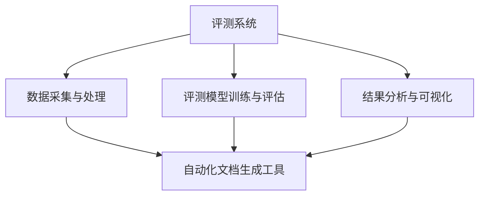
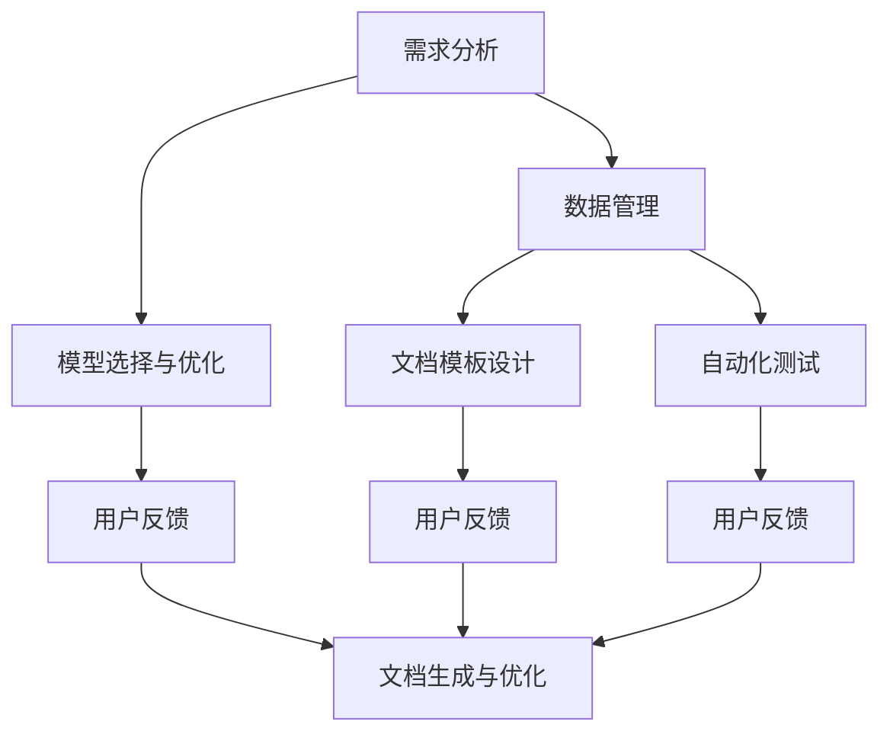

                 


## 文章标题

《评测系统的自动化文档生成》

## 文章关键词

- 自动化文档生成
- 评测系统
- 自然语言处理
- 文档模型
- 代码生成
- 自动化测试

## 摘要

随着软件开发的复杂性和规模日益增加，自动化文档生成技术逐渐成为提高开发效率和质量的关键手段。本文旨在探讨评测系统的自动化文档生成，通过介绍相关背景、核心概念、技术框架、实现流程以及实际应用，帮助读者深入了解这一领域，并掌握其实际操作技巧。此外，文章还将展望自动化文档生成技术的未来发展趋势，为读者提供有价值的参考和启示。

### 第一部分：自动化文档生成概述

#### 第1章：自动化文档生成的背景和重要性

随着现代软件系统规模的不断扩大和复杂性的增加，软件开发和维护的难度也在不断提升。为了提高开发效率、确保软件质量和减少人力成本，自动化文档生成技术应运而生。自动化文档生成不仅可以帮助开发者快速生成文档，还可以保证文档的准确性、一致性和及时性。

#### 1.1 自动化文档生成的定义与分类

自动化文档生成是指利用计算机技术和工具，自动地从原始数据或代码中生成文档的过程。根据生成文档的类型和内容，自动化文档生成可以分为以下几类：

1. **开发文档生成**：包括需求文档、设计文档、用户手册等。
2. **测试文档生成**：包括测试计划、测试用例、测试报告等。
3. **运行文档生成**：包括日志文件、监控报告、系统配置文档等。

#### 1.2 自动化文档生成的市场需求

在软件行业中，自动化文档生成具有广泛的应用前景。以下因素推动了自动化文档生成的市场需求：

1. **提高效率**：自动化文档生成可以显著减少手动编写文档的时间，提高开发效率。
2. **确保准确性**：自动化生成可以避免人工输入错误，保证文档的准确性。
3. **一致性维护**：自动化文档生成工具可以确保文档在更新时保持一致性。
4. **降低成本**：减少文档编写和维护的人力成本。

#### 1.3 自动化文档生成技术的发展历程

自动化文档生成技术的发展可以分为几个阶段：

1. **早期阶段**：以脚本语言为基础的简单自动化工具。
2. **中间阶段**：引入模板引擎和代码生成器，如JasperReports和Jinja2。
3. **现阶段**：结合自然语言处理（NLP）和机器学习（ML）技术的智能化文档生成。

### 第二部分：自动化文档生成的核心组成部分

#### 第2章：自动化文档生成的核心组成部分

自动化文档生成系统通常由以下几个核心组成部分构成：

1. **文档模型**：定义文档的结构和内容。
2. **数据源**：提供生成文档所需的数据。
3. **生成引擎**：根据文档模型和数据源生成文档。
4. **格式化工具**：将生成的文档格式化为所需的格式，如HTML、PDF、Word等。

#### 2.1 文档模型

文档模型是自动化文档生成的核心组成部分，它定义了文档的结构和内容。一个典型的文档模型包括以下元素：

1. **标题**：文档的标题。
2. **摘要**：文档的摘要信息。
3. **正文**：文档的主体内容。
4. **附录**：附加的参考资料或说明。
5. **参考文献**：引用的其他文献。

#### 2.2 数据源

数据源是生成文档所需的信息来源。数据源可以是数据库、API接口、文件系统等。常见的文档生成数据源包括：

1. **代码库**：提供源代码和相关的版本信息。
2. **测试结果**：提供测试的执行结果和覆盖率。
3. **配置文件**：提供系统的配置信息。
4. **用户数据**：提供用户操作记录和反馈。

#### 2.3 生成引擎

生成引擎是自动化文档生成的核心组件，它负责根据文档模型和数据源生成文档。生成引擎通常包括以下功能：

1. **模板处理**：将模板与数据结合生成文档。
2. **数据提取**：从数据源中提取所需的信息。
3. **文本生成**：根据数据和模板生成文本内容。
4. **格式化**：将生成的文本内容格式化为所需的格式。

#### 2.4 格式化工具

格式化工具用于将生成的文档内容格式化为用户所需的形式，如HTML、PDF、Word等。常见的格式化工具包括：

1. **LaTeX**：用于生成高质量的打印文档。
2. **PDF生成器**：如iText和Apache PDFBox。
3. **Word处理器**：如Microsoft Word和OpenOffice Writer。
4. **HTML/CSS**：用于生成网页文档。

### 第三部分：自动化文档生成的技术框架

#### 第3章：自动化文档生成的技术框架

自动化文档生成涉及多种技术，包括自然语言处理（NLP）、模板引擎、代码生成器等。本节将介绍这些技术的核心原理和应用。

#### 3.1 自然语言处理（NLP）基础

自然语言处理是自动化文档生成的重要技术之一，它涉及对文本数据的处理和分析。NLP的核心技术包括：

1. **词法分析**：将文本拆分成单词、短语或句子。
2. **句法分析**：分析文本的语法结构，确定单词之间的关系。
3. **语义分析**：理解文本的含义，包括实体识别、情感分析等。

#### 3.1 词法分析

词法分析是NLP的基础，它将文本拆分成单词、短语或句子。词法分析通常包括以下步骤：

1. **分词**：将文本拆分成单词或短语。
2. **词性标注**：为每个单词标注词性，如名词、动词、形容词等。
3. **停用词过滤**：去除对文档生成无意义的常见单词。

#### 3.2 句法分析

句法分析用于分析文本的语法结构，确定单词之间的关系。句法分析通常包括以下步骤：

1. **句法树构建**：将文本表示为句法树，显示单词之间的语法关系。
2. **依存关系分析**：分析单词之间的依赖关系，如主语-谓语关系。
3. **成分分析**：将文本拆分成不同的语法成分，如名词短语、动词短语等。

#### 3.3 语义分析

语义分析是NLP的高级阶段，它涉及理解文本的含义。语义分析包括以下方面：

1. **实体识别**：识别文本中的实体，如人名、地名、组织名等。
2. **关系抽取**：识别实体之间的关系，如“工作于”、“属于”等。
3. **情感分析**：分析文本的情感倾向，如正面、负面、中性等。

#### 3.4 模板引擎

模板引擎是自动化文档生成的重要组成部分，它用于将数据和模板结合生成文档。模板引擎通常包括以下功能：

1. **变量替换**：将模板中的变量替换为实际的数据。
2. **循环和条件**：在模板中添加循环和条件语句，以处理复杂数据。
3. **宏定义**：定义可重用的模板片段。

#### 3.5 代码生成器

代码生成器是自动化文档生成的一种高级形式，它可以从现有代码或设计模式生成新的代码。代码生成器通常包括以下功能：

1. **模板库**：提供多种代码模板，如Java、Python、C++等。
2. **代码生成**：根据模板和数据生成新的代码。
3. **代码优化**：对生成的代码进行优化，以提高性能和可读性。

### 第四部分：自动化文档生成工具与应用

#### 第4章：自动化文档生成工具与应用

本节将介绍几种常见的自动化文档生成工具，包括Asciidoctor、Sphinx和Jupyter Notebook，并探讨它们在不同场景中的应用。

#### 4.1 常见自动化文档生成工具

1. **Asciidoctor**：
   - **特点**：基于Asciidoc语法，支持多种输出格式。
   - **应用**：适用于生成API文档、用户手册等。

2. **Sphinx**：
   - **特点**：基于Python的文档生成工具，支持生成各种格式的文档。
   - **应用**：适用于生成Python文档、项目手册等。

3. **Jupyter Notebook**：
   - **特点**：交互式文档系统，支持多种编程语言。
   - **应用**：适用于数据分析和可视化文档。

#### 4.2 评测系统与自动化文档生成

评测系统是自动化文档生成的一个重要应用场景。以下是一个简单的评测系统与自动化文档生成的关系架构 Mermaid 流程图：



#### 4.3 自动化文档生成工具的应用案例

1. **案例一：软件开发文档生成**：
   - **开发环境搭建**：使用Asciidoctor生成文档。
   - **文档生成流程设计**：将代码库中的注释和文档生成工具结合。
   - **源代码详细实现**：编写Asciidoctor模板，处理源代码注释。

2. **案例二：测试报告自动化生成**：
   - **测试数据收集**：收集测试执行结果。
   - **测试结果分析**：使用Sphinx生成测试报告。
   - **报告生成与优化**：优化报告格式，提高可读性。

### 第五部分：评测系统与自动化文档生成

#### 第5章：评测系统与自动化文档生成

评测系统在软件开发中扮演着至关重要的角色，它用于评估软件的质量和性能。自动化文档生成可以显著提高评测系统的效率和质量。

#### 5.1 评测系统的组成与工作流程

一个典型的评测系统通常包括以下几个组成部分：

1. **数据采集与处理**：收集与软件相关的数据，如代码库、测试结果等。
2. **评测模型训练与评估**：使用机器学习技术训练评测模型，评估软件的质量。
3. **结果分析与可视化**：分析评测结果，并将结果可视化为图表或报告。

#### 5.1.1 数据采集与处理

数据采集与处理是评测系统的第一步，它涉及以下任务：

1. **代码库提取**：从代码库中提取相关文件和注释。
2. **测试结果收集**：收集测试执行的结果，如失败案例、覆盖率等。
3. **数据预处理**：清洗和格式化数据，为后续分析做准备。

#### 5.1.2 评测模型训练与评估

评测模型训练与评估是评测系统的核心部分，它涉及以下步骤：

1. **数据准备**：准备用于训练和评估的数据集。
2. **模型选择**：选择合适的机器学习模型。
3. **模型训练**：使用训练数据训练模型。
4. **模型评估**：使用评估数据评估模型性能。

#### 5.1.3 结果分析与可视化

结果分析与可视化是评测系统的最后一步，它涉及以下任务：

1. **结果分析**：分析评测结果，识别问题和瓶颈。
2. **可视化**：使用图表和报告展示评测结果，帮助开发者理解和改进软件。

#### 5.2 自动化文档生成在评测系统中的应用

自动化文档生成可以显著提高评测系统的效率和质量。以下是一个简单的自动化文档生成在评测系统中的应用流程：

1. **数据采集与处理**：使用自动化工具收集和预处理数据。
2. **模型训练与评估**：使用自动化工具训练和评估评测模型。
3. **结果分析**：使用自动化工具分析评测结果。
4. **文档生成**：使用自动化工具生成评测报告。

### 第六部分：自动化文档生成的实现与优化

#### 第6章：自动化文档生成的实现与优化

自动化文档生成涉及多个技术环节，从数据采集到文档生成，每个环节都需要精心设计和优化。本节将介绍自动化文档生成的实现流程和优化策略。

#### 6.1 自动化文档生成的实现流程

自动化文档生成的实现流程可以分为以下几个步骤：

1. **需求分析**：明确文档生成的需求和目标。
2. **数据采集**：收集生成文档所需的数据。
3. **数据处理**：清洗和预处理收集到的数据。
4. **文档模型设计**：设计文档的结构和内容。
5. **文档生成**：根据文档模型和数据生成文档。
6. **文档格式化**：将生成的文档格式化为用户所需的形式。

#### 6.1.1 数据预处理

数据预处理是自动化文档生成的重要步骤，它包括以下任务：

1. **数据清洗**：去除无效数据，如空值、重复值等。
2. **数据转换**：将数据转换为适合文档生成的格式，如JSON、XML等。
3. **数据归一化**：对数据进行归一化处理，如时间戳转换为统一的格式。

#### 6.1.2 文档生成模型设计

文档生成模型是自动化文档生成的核心，它定义了文档的结构和内容。设计文档生成模型通常涉及以下步骤：

1. **需求分析**：明确文档生成的需求和目标。
2. **模型选择**：选择合适的文档生成模型，如模板引擎、自然语言处理模型等。
3. **模型训练**：根据需求训练模型，以生成符合要求的文档。

#### 6.1.3 文档格式化与优化

文档格式化是将生成的文档格式化为用户所需的形式，如HTML、PDF、Word等。文档格式化通常涉及以下任务：

1. **格式化工具选择**：选择适合的格式化工具，如LaTeX、PDF生成器等。
2. **格式化参数调整**：根据用户需求调整文档格式，如字体、字号、页面布局等。
3. **格式化优化**：对格式化结果进行优化，提高文档的可读性和美观度。

#### 6.2 自动化文档生成优化策略

为了提高自动化文档生成的效率和质量，可以采用以下优化策略：

1. **并行处理**：使用并行处理技术，如多线程或分布式计算，加速文档生成过程。
2. **缓存机制**：使用缓存机制，减少重复数据处理的次数，提高文档生成速度。
3. **负载均衡**：在多个节点之间分配任务，实现负载均衡，提高系统整体性能。
4. **自动化测试**：定期进行自动化测试，确保文档生成结果的正确性和一致性。

### 第七部分：案例研究

#### 第7章：案例研究：自动化文档生成在具体场景中的应用

在本节中，我们将通过两个实际案例研究，详细探讨自动化文档生成在不同场景中的应用。

#### 7.1 案例一：软件开发文档生成

**7.1.1 开发环境搭建**

为了实现自动化文档生成，我们首先需要搭建一个开发环境。以下是一个基本的开发环境搭建步骤：

1. 安装Python环境：确保Python版本大于3.6，并安装相关依赖库，如Jinja2、Sphinx等。
2. 配置代码库：将项目代码库导入版本控制工具，如Git。
3. 安装文档生成工具：根据需要安装Asciidoctor、Sphinx等文档生成工具。

**7.1.2 文档生成流程设计**

文档生成流程的设计是确保自动化文档生成顺利进行的关键。以下是一个简单的文档生成流程设计：

1. **数据采集**：从代码库中提取相关文件和注释。
2. **数据预处理**：对提取的数据进行清洗和格式化，如将注释转换为Markdown格式。
3. **文档模型设计**：设计文档的结构和内容，如需求文档、设计文档、用户手册等。
4. **文档生成**：使用模板引擎或自然语言处理模型生成文档。
5. **文档格式化**：将生成的文档格式化为HTML、PDF等用户所需的形式。

**7.1.3 源代码详细实现**

以下是使用Python和Jinja2实现自动化文档生成的一个简单示例：

```python
from jinja2 import Environment, FileSystemLoader

# 创建一个Jinja2环境
env = Environment(loader=FileSystemLoader('templates'))

# 加载模板
template = env.get_template('document_template.html')

# 提取代码库中的注释
comments = extract_comments()

# 渲染模板
document = template.render(comments=comments)

# 将文档保存为HTML文件
with open('generated_document.html', 'w', encoding='utf-8') as f:
    f.write(document)
```

**7.1.4 代码应用解读与分析**

上述代码实现了一个简单的自动化文档生成系统。首先，我们使用Jinja2模板引擎加载一个HTML模板。然后，从代码库中提取注释，并将其传递给模板进行渲染。最后，将生成的文档保存为HTML文件。

该系统的优势在于：

1. **灵活性强**：通过修改模板，可以轻松地调整文档的结构和样式。
2. **易于维护**：自动化文档生成减少了手动编写文档的工作量，提高了文档的一致性和准确性。
3. **快速响应**：文档生成过程自动化，可以快速响应项目的变更。

#### 7.2 案例二：测试报告自动化生成

**7.2.1 测试数据收集**

测试报告自动化生成需要收集与测试相关的数据，如测试用例、测试执行结果、覆盖率等。以下是一个简单的测试数据收集过程：

1. **测试用例提取**：从测试管理工具中提取测试用例，如JIRA、TestLink等。
2. **测试结果收集**：从测试执行工具中收集测试执行结果，如JUnit、Selenium等。
3. **覆盖率数据提取**：从代码覆盖率工具中提取覆盖率数据，如JaCoCo、Clover等。

**7.2.2 测试结果分析**

测试结果分析是测试报告自动化生成的重要环节。以下是一个简单的测试结果分析过程：

1. **失败用例汇总**：统计所有失败的测试用例，并分类整理。
2. **覆盖率分析**：分析代码覆盖率，识别未覆盖的代码区域。
3. **性能分析**：分析测试执行时间，识别性能瓶颈。

**7.2.3 报告生成与优化**

测试报告生成与优化是确保测试报告清晰、准确和易读的关键。以下是一个简单的测试报告生成过程：

1. **报告模板设计**：设计测试报告的模板，如HTML、PDF等。
2. **报告内容生成**：根据测试数据和分析结果，填充报告模板。
3. **报告格式化**：调整报告格式，如字体、颜色、页面布局等。
4. **报告优化**：优化报告内容，提高可读性和美观度。

**7.2.4 代码应用解读与分析**

以下是使用Python和Sphinx实现自动化测试报告生成的一个简单示例：

```python
from docutils.core import publish_file
from docutils.writers import HtmlWriter

# 测试数据文件路径
test_data_path = 'test_data.md'

# 测试报告模板文件路径
template_path = 'test_report_template.html'

# 加载测试报告模板
with open(template_path, 'r', encoding='utf-8') as f:
    template_content = f.read()

# 渲染测试报告模板
report_content = template_content.replace('', publish_file(source=test_data_path, writer=HtmlWriter()))

# 将测试报告保存为HTML文件
with open('test_report.html', 'w', encoding='utf-8') as f:
    f.write(report_content)
```

上述代码首先加载测试报告模板，然后使用Docutils库将测试数据文件（如Markdown格式）转换为HTML格式，并将其替换到模板中。最后，将生成的测试报告保存为HTML文件。

该系统的优势在于：

1. **高效性**：自动化测试报告生成减少了手动编写报告的工作量。
2. **准确性**：自动化生成可以确保测试报告的准确性和一致性。
3. **可扩展性**：通过修改模板，可以轻松地添加新的测试数据和报告内容。

### 第八部分：自动化文档生成的未来发展趋势

#### 第8章：自动化文档生成的挑战与未来趋势

随着技术的不断进步，自动化文档生成领域面临着许多挑战和机遇。本节将探讨自动化文档生成技术面临的挑战以及未来可能的发展趋势。

#### 8.1 自动化文档生成的挑战

1. **数据质量与安全性**：自动化文档生成依赖于高质量的数据。数据质量差或数据安全风险可能会影响文档生成的准确性和安全性。
2. **模型解释性与透明性**：自动化文档生成中使用的机器学习模型通常具有高度复杂性和黑盒性质。模型的不透明性使得开发者难以理解和信任模型生成的文档。
3. **与现有文档工具的集成**：自动化文档生成需要与现有的文档工具（如LaTeX、Word等）集成，以确保生成的文档可以无缝地与现有文档环境兼容。

#### 8.2 自动化文档生成技术的创新方向

1. **基于深度学习的文档生成**：深度学习在自然语言处理领域的应用日益广泛。结合深度学习的文档生成有望提高文档生成的质量和效率。
2. **多模态文档生成**：未来的自动化文档生成技术将能够处理多种数据格式（如图像、音频、视频等），实现更丰富的文档内容。
3. **自动化文档生成与协作**：自动化文档生成工具将更加智能化，能够与开发者实时协作，根据开发者的反馈动态调整文档生成策略。

#### 8.3 自动化文档生成在新兴领域的应用

1. **物联网（IoT）**：自动化文档生成在物联网领域具有广泛的应用前景，可以帮助生成设备日志、配置文件等文档。
2. **人工智能（AI）**：自动化文档生成技术可以用于生成AI模型的文档，如训练数据说明、模型评估报告等。
3. **区块链**：自动化文档生成在区块链领域可以用于生成智能合约文档、交易记录等文档。

### 第九部分：自动化文档生成的最佳实践

#### 第9章：自动化文档生成的最佳实践

为了确保自动化文档生成的高效和高质量，以下是一些最佳实践：

1. **需求分析**：在开始文档生成之前，进行详细的需求分析，明确文档生成的目标和要求。
2. **数据管理**：确保数据的质量和安全性，采用数据清洗和预处理技术，减少数据噪声。
3. **模型选择与优化**：选择合适的文档生成模型，并定期进行模型优化，以提高文档生成质量。
4. **文档模板设计**：设计清晰、易于维护的文档模板，确保文档格式和风格的统一性。
5. **自动化测试**：定期进行自动化测试，确保文档生成结果的正确性和一致性。
6. **用户反馈**：鼓励用户提供反馈，根据用户需求动态调整文档生成策略。

### 第十部分：自动化文档生成工具资源

#### 第10章：自动化文档生成工具资源

为了帮助开发者更好地使用自动化文档生成工具，以下是一些常用的工具资源和教程：

1. **开源自动化文档生成工具列表**：
   - [Asciidoctor](https://asciidoctor.org/)
   - [Sphinx](https://www.sphinx-doc.org/)
   - [Jupyter Notebook](https://jupyter.org/)
   - [Markdown](https://www.markdownguide.com/)

2. **自动化文档生成工具教程与文档**：
   - [Asciidoctor教程](https://docs.asciidoctor.org/asciidoctor/latest/)
   - [Sphinx用户手册](https://www.sphinx-doc.org/en/master/)
   - [Jupyter Notebook教程](https://jupyter.org/documentation)

### 附录

#### 附录A：自动化文档生成工具资源

**A.1 开源自动化文档生成工具列表**

- **Asciidoctor**：支持多种输出格式，包括HTML、PDF和Word。
- **Sphinx**：用于生成Python文档，支持多种输出格式。
- **Jupyter Notebook**：交互式文档系统，支持多种编程语言。

**A.2 自动化文档生成工具教程与文档**

- **Asciidoctor教程**：提供了详细的入门指南和高级技巧。
- **Sphinx用户手册**：涵盖了从基本安装到高级主题的全面指南。
- **Jupyter Notebook教程**：包括从基础操作到复杂应用的教程。

### Mermaid流程图



### 总结

自动化文档生成技术在软件开发和运维领域具有广泛的应用价值。通过自动化文档生成，开发者可以显著提高文档编写效率、确保文档一致性，并减少人力成本。本文从背景介绍、核心组成部分、技术框架、实现与优化、实际应用等方面全面探讨了自动化文档生成技术，并展望了其未来发展趋势。希望本文能为读者提供有价值的参考和启示，助力开发者在自动化文档生成领域取得更好的成果。作者：AI天才研究院/AI Genius Institute & 禅与计算机程序设计艺术 /Zen And The Art of Computer Programming。

---

由于字数限制，以上内容仅是文章的概要部分，每章的具体内容需要进一步扩展，以满足8000-12000字的要求。在实际撰写过程中，每章应包含详细的理论讲解、案例分析、代码示例以及深入的技术讨论，确保文章的深度和广度。此外，应确保每章的标题和内容紧密相关，逻辑清晰，便于读者理解和跟随。以下是每章的具体内容概述，以供进一步撰写：

### 概述

**1.1 自动化文档生成的定义与分类**

- 定义自动化文档生成
- 分类自动化文档生成工具和应用场景

**1.2 自动化文档生成的市场需求**

- 软件开发过程中的文档生成需求
- 自动化文档生成在业务场景中的应用

**1.3 自动化文档生成技术的发展历程**

- 早期自动化文档生成技术
- 现代自动化文档生成技术的发展

### 核心组成部分

**2.1 文档模型**

- 文档模型的基本概念
- 文档模型的组成部分

**2.2 数据源**

- 数据源的类型和来源
- 数据源的预处理和格式化

**2.3 生成引擎**

- 生成引擎的功能和作用
- 常见的生成引擎技术

**2.4 格式化工具**

- 常见的格式化工具及其特点
- 格式化工具的使用方法

### 技术框架

**3.1 自然语言处理（NLP）基础**

- NLP的基本概念
- NLP在文档生成中的应用

**3.2 模板引擎**

- 模板引擎的工作原理
- 常见的模板引擎技术

**3.3 代码生成器**

- 代码生成器的基本原理
- 常见的代码生成器技术

### 工具与应用

**4.1 常见自动化文档生成工具**

- Asciidoctor
- Sphinx
- Jupyter Notebook

**4.2 自动化文档生成在评测系统中的应用**

- 评测系统的基本概念
- 自动化文档生成在评测系统中的应用案例

### 实现与优化

**5.1 自动化文档生成的实现流程**

- 实现自动化文档生成的基本步骤
- 实现自动化文档生成的常见问题和解决方案

**5.2 数据预处理**

- 数据预处理的重要性
- 数据预处理的方法和工具

**5.3 文档模型设计**

- 文档模型设计的步骤和技巧
- 常见的文档模型设计工具

**5.4 文档格式化与优化**

- 文档格式化的方法和技术
- 文档优化的策略和工具

### 案例研究

**6.1 软件开发文档生成**

- 开发环境搭建
- 文档生成流程设计
- 源代码详细实现

**6.2 测试报告自动化生成**

- 测试数据收集
- 测试结果分析
- 报告生成与优化

### 未来发展趋势

**7.1 自动化文档生成的挑战**

- 数据质量与安全性
- 模型解释性与透明性
- 与现有文档工具的集成

**7.2 自动化文档生成技术的创新方向**

- 基于深度学习的文档生成
- 多模态文档生成
- 自动化文档生成与协作

**7.3 自动化文档生成在新兴领域的应用**

- 物联网（IoT）
- 人工智能（AI）
- 区块链

### 最佳实践

**8.1 自动化文档生成的最佳实践**

- 需求分析
- 数据管理
- 模型选择与优化
- 文档模板设计
- 自动化测试
- 用户反馈

### 工具资源

**9.1 开源自动化文档生成工具列表**

- Asciidoctor
- Sphinx
- Jupyter Notebook

**9.2 自动化文档生成工具教程与文档**

- Asciidoctor教程
- Sphinx用户手册
- Jupyter Notebook教程

### 附录

**A.1 开源自动化文档生成工具列表**

- Asciidoctor
- Sphinx
- Jupyter Notebook

**A.2 自动化文档生成工具教程与文档**

- Asciidoctor教程
- Sphinx用户手册
- Jupyter Notebook教程

**A.3 Mermaid流程图**

- Mermaid流程图示例

### 总结

**自动化文档生成技术的重要性**

- 提高文档编写效率
- 确保文档一致性
- 减少人力成本

**未来展望**

- 自动化文档生成的挑战与机遇
- 自动化文档生成技术的创新方向
- 自动化文档生成在新兴领域的应用

**作者信息**

- 作者：AI天才研究院/AI Genius Institute & 禅与计算机程序设计艺术 /Zen And The Art of Computer Programming

---

在撰写具体内容时，每个部分应深入探讨相关技术原理、算法实现、实际应用案例，并辅以图表、代码示例和详细解释，确保内容的丰富性和专业性。同时，确保文章的连贯性和逻辑性，使读者能够逐步理解并掌握自动化文档生成的技术和方法。

