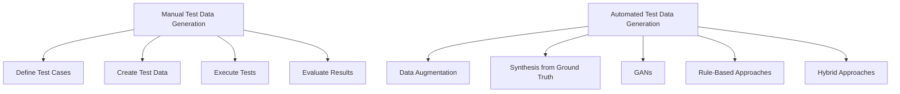
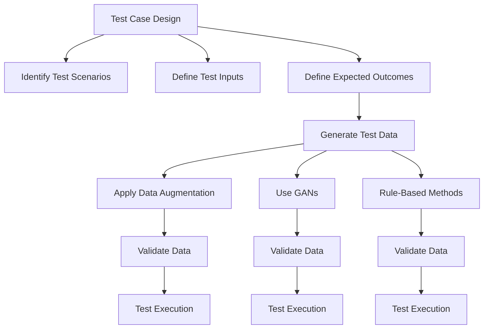
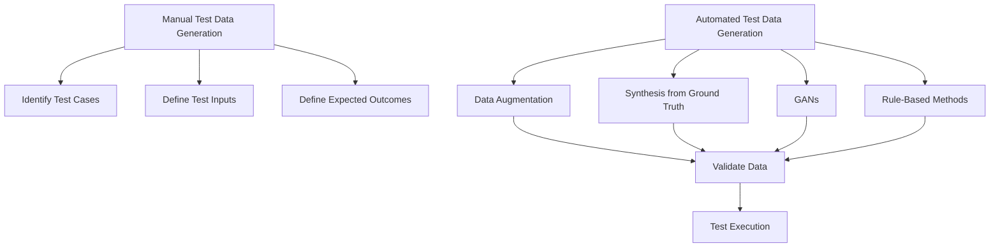

                 


### 1. Introduction

#### 1.1 Book Background

In today's fast-paced software development world, the need for efficient and reliable testing processes is more crucial than ever. Automated testing has emerged as a vital component of modern software evaluation, significantly reducing the time and effort required for testing while improving the overall quality of the software. Automated testing involves the use of software tools to execute test cases, compare actual outcomes with expected outcomes, and report the results. This process is particularly beneficial for repetitive tests, regression tests, and large-scale testing scenarios.

The role of data in testing and evaluation cannot be overstated. Test data serves as the foundation for executing test cases, and its quality directly impacts the effectiveness of the testing process. High-quality test data ensures that the system under test behaves as expected and uncovers potential issues that could lead to failures in production environments. However, generating high-quality test data can be a challenging task, especially when dealing with complex systems and diverse data types.

This book aims to address the challenges associated with automated test data generation by providing a comprehensive guide to the principles, techniques, and tools involved in this domain. We will explore the importance of test data in software evaluation, the core concepts and principles of automated testing, and various techniques for generating high-quality test data. The book will also include case studies and best practices to provide practical insights into real-world applications.

#### 1.2 Objectives

The primary objectives of this book are as follows:

1. **To provide a clear understanding of automated testing and its role in software evaluation.**
2. **To introduce the core concepts and principles of test data generation.**
3. **To discuss various techniques for generating high-quality test data.**
4. **To explore the tools and platforms available for automated test data generation.**
5. **To present real-world case studies and best practices for implementing automated test data generation.**
6. **To provide insights into the future trends and challenges in automated test data generation.**

By the end of this book, readers will have a solid understanding of the key concepts and techniques in automated test data generation, enabling them to design and implement effective testing strategies for their projects.

### 2. Core Concepts and Principles

#### 2.1 Automated Testing Overview

Automated testing is a method of software testing that utilizes specialized tools to automate the execution of test cases. This approach contrasts with manual testing, where tests are performed manually by human testers. Automated testing offers several advantages, including increased testing coverage, faster execution of test cases, and improved accuracy. However, it also comes with its own set of challenges, such as the need for initial setup and maintenance, potential costs, and the risk of script failures.

**Fundamental Concepts of Automated Testing**

- **Test Automation Framework:** A framework is a set of templates or components that provide structure and guidance for automated testing. It helps streamline the process of creating, executing, and maintaining test scripts.
- **Test Case:** A test case is a specific scenario or condition that is tested to determine whether a component of the software behaves as expected.
- **Test Script:** A test script is a set of instructions written in a programming language that is executed by an automation tool to perform a test case.
- **Test Automation Tool:** A test automation tool is a software application that automates the execution of test scripts. Examples include Selenium, TestComplete, and QTP/UFT.

**Comparison with Manual Testing**

- **Advantages of Automated Testing:**
  - **Speed:** Automated tests can execute much faster than manual tests, especially for large test suites.
  - **Consistency:** Automated tests ensure consistent execution of test cases, reducing the risk of human errors.
  - **Repeatability:** Automated tests can be run multiple times without the need for human intervention, making it easier to detect regressions.
  - **Scalability:** Automated testing can handle large test suites and complex testing scenarios more efficiently.

- **Disadvantages of Automated Testing:**
  - **Initial Setup and Maintenance:** Setting up and maintaining an automated testing framework can be time-consuming and costly.
  - **False Positives and Negatives:** Automated tests can produce false positives (indicating a failure where there is none) or false negatives (missing actual failures).
  - **Cost:** Automated testing tools and infrastructure can be expensive to implement and maintain.

**Advantages and Limitations of Automated Testing**

- **Advantages:**
  - **Improved Efficiency:** Automated testing reduces the time required to execute tests, allowing developers and testers to focus on more valuable activities.
  - **Increased Test Coverage:** Automated testing can cover a wider range of scenarios and edge cases than manual testing.
  - **Reduced Costs:** In the long run, automated testing can save organizations money by reducing the need for manual testing resources.

- **Limitations:**
  - **Initial Investment:** The initial investment in automated testing tools and training can be significant.
  - **Complexity:** Automated testing requires specialized skills and knowledge, which may not be available in all organizations.
  - **Maintenance:** Automated tests need regular maintenance to ensure they continue to function correctly as the software evolves.

### 2.2 Test Data Generation

#### 2.2.1 Definition and Types of Test Data

Test data refers to the input data used to execute test cases and validate the behavior of the system under test. It can be classified into different types based on its source, purpose, and format.

- **Static Test Data:** This type of data is fixed and does not change during the testing process. It is typically used in black-box testing, where the internal implementation of the system is not known.
- **Dynamic Test Data:** Dynamic test data changes during the execution of test cases. It is commonly used in white-box testing, where the internal implementation is known and can be modified.

**Importance of High-Quality Test Data**

High-quality test data is crucial for the effectiveness of automated testing. It must meet several criteria to be considered high quality:

- **Accuracy and Completeness:** Test data must accurately represent the expected input scenarios and cover all possible cases.
- **Representativeness and Coverage:** Test data should be representative of the real-world data that the system will encounter, and it should cover all relevant test cases.
- **Repeatability and Consistency:** Test data should produce consistent and repeatable results across different test runs.

**Common Challenges in Test Data Generation**

- **Data Quality Issues:** Generating high-quality test data can be challenging due to inconsistencies, missing values, and noise in the data.
- **Scalability:** Generating test data for large-scale applications can be time-consuming and resource-intensive.
- **Security and Privacy:** Test data must be secure and comply with privacy regulations to protect sensitive information.
- **Realism:** Test data should be realistic to ensure that it effectively tests the system under realistic conditions.

### 2.3 Test Data Quality Metrics

To evaluate the quality of test data, several metrics are commonly used:

#### 2.3.1 Accuracy and Completeness

- **Accuracy:** The degree to which the test data correctly represents the expected input scenarios.
- **Completeness:** The extent to which all relevant test cases are covered by the test data.

#### 2.3.2 Representativeness and Coverage

- **Representativeness:** The degree to which the test data reflects the real-world data that the system will encounter.
- **Coverage:** The extent to which the test data covers all relevant test cases and scenarios.

#### 2.3.3 Repeatability and Consistency

- **Repeatability:** The ability of the test data to produce consistent results across multiple test runs.
- **Consistency:** The degree to which the test data maintains the same quality and characteristics over time.

By evaluating test data against these metrics, organizations can ensure that their automated testing processes are effective and reliable.

### 3. Test Data Generation Techniques

#### 3.1 Manual Test Data Generation

Manual test data generation involves creating test data by hand, often using tools such as spreadsheets, databases, or custom scripts. This approach is typically used for small-scale projects or when test data is relatively simple.

**Step-by-Step Process**

1. **Identify Test Cases:** Determine the test cases that need to be executed.
2. **Define Test Data Requirements:** Specify the input data required for each test case.
3. **Create Test Data:** Manually create the input data for each test case.
4. **Execute Tests:** Use an automation tool to execute the test cases with the manually created test data.
5. **Evaluate Results:** Compare the actual results with the expected results and report any discrepancies.

**Common Tools and Techniques**

- **Spreadsheets:** Used to create and manage test data in a structured format.
- **Databases:** Used to store and retrieve test data efficiently.
- **Custom Scripts:** Written in programming languages such as Python or JavaScript to automate the creation and execution of test cases.

**Pros and Cons**

- **Pros:**
  - **Flexibility:** Allows for the creation of custom test data tailored to specific test cases.
  - **Low Initial Cost:** No need for specialized tools or frameworks.

- **Cons:**
  - **Time-Consuming:** Can be a labor-intensive process, especially for large test suites.
  - **Error-Prone:** Human errors can lead to inaccurate or incomplete test data.
  - **Lack of Scalability:** Difficult to scale for large-scale projects or complex systems.

#### 3.2 Automated Test Data Generation

Automated test data generation involves using software tools and techniques to create test data automatically. This approach is particularly useful for large-scale projects or when test data needs to be generated quickly and efficiently.

**Introduction to Automated Test Data Generation**

Automated test data generation tools and techniques can be categorized into several types:

- **Data Augmentation:** Techniques that modify existing data to create new test data.
- **Synthesis from Ground Truth:** Techniques that generate test data based on known correct outputs.
- **Generative Adversarial Networks (GANs):** Techniques that use a generative model and a discriminative model to generate realistic test data.

**Machine Learning-Based Approaches**

Machine learning-based approaches use algorithms to generate test data automatically. These approaches are particularly useful for complex and large-scale systems.

- **Data Augmentation:** Techniques such as image augmentation, text augmentation, and data transformation can be used to create new test data from existing data.

- **Synthesis from Ground Truth:** Techniques such as model-based synthesis and symbolic execution can generate test data based on known correct outputs.

- **Generative Adversarial Networks (GANs):** GANs consist of a generator and a discriminator. The generator creates test data, which is then evaluated by the discriminator. The process is repeated until the generator produces test data that is indistinguishable from real data.

**Rule-Based Approaches**

Rule-based approaches use predefined rules or patterns to generate test data. These approaches are often used for simple and structured data.

- **Grammar-Based Methods:** Techniques that use formal grammars to generate test data based on specific language rules.

- **Template-Based Approaches:** Techniques that use predefined templates to generate test data for specific test cases.

**Hybrid Approaches**

Hybrid approaches combine multiple techniques to generate test data. For example, a combination of data augmentation and GANs can be used to generate more realistic and diverse test data.

**Pros and Cons**

- **Pros:**
  - **Speed and Efficiency:** Automated test data generation can be much faster and more efficient than manual methods.
  - **Scalability:** Suitable for large-scale projects and complex systems.
  - **Accuracy:** Machine learning-based techniques can generate high-quality test data that is representative of real-world scenarios.

- **Cons:**
  - **Complexity:** Requires specialized knowledge and skills to implement and maintain.
  - **Initial Cost:** May require significant investment in tools and infrastructure.

### 4. Test Data Generation Tools and Platforms

#### 4.1 Commercial Tools

Commercial tools for automated test data generation offer a wide range of features and capabilities. These tools are typically designed for enterprise-level use and come with comprehensive support and maintenance.

**Overview of Popular Commercial Tools**

- **Aptest:** Offers a range of test data generation tools for various applications, including database testing, API testing, and mobile testing.
- **DataGenomix:** Provides automated test data generation for SQL databases and supports data masking and privacy protection.
- **DataFactory:** Offers data generation, masking, and manipulation capabilities for various applications, including testing and data analytics.
- **Quest Test Data Manager:** A tool designed for Oracle databases that provides test data management and data masking features.

**Features and Pricing**

- **Features:**
  - **Data Masking:** Protects sensitive data by replacing it with fictional data.
  - **Data Generation:** Creates realistic test data for various data types and formats.
  - **Data Manipulation:** Allows for the transformation and manipulation of data to create diverse test scenarios.
  - **Integration:** Works with popular testing and development tools, such as Selenium, JMeter, and Git.

- **Pricing:** Commercial tools typically offer different pricing models, including subscription-based and one-time purchase options. Pricing varies based on the features, number of users, and the level of support required.

#### 4.2 Open Source Tools

Open source tools for automated test data generation are popular among developers and organizations looking for cost-effective solutions. These tools are typically community-driven and offer a high degree of flexibility and customization.

**Open Source Test Data Generation Tools**

- **DataForge:** An open-source data generation tool that supports various data types, including SQL, JSON, and XML.
- **DataGen:** A Python library for generating test data based on templates and schema definitions.
- **TestDataGen:** A Java library that generates test data for databases and APIs.
- **TestGen:** A C# library for generating test data based on XML and JSON schemas.

**Community Support and Resources**

- **Community Support:** Open source tools benefit from community support, which includes forums, user groups, and documentation.
- **Resources:** There are various resources available, including tutorials, example code, and sample projects, to help users get started with these tools.

#### 4.3 Cloud-Based Platforms

Cloud-based platforms for automated test data generation offer the advantage of scalability and ease of use. These platforms are typically subscription-based and provide a range of features for test data management and generation.

**Overview of Cloud-Based Platforms**

- **CloudTestData:** A cloud-based platform for test data management and generation that supports various databases and data sources.
- **TestFort:** A cloud-based test automation platform that includes test data generation features.
- **TestCloud:** A cloud-based platform for test data management and generation that offers integration with popular testing tools.

**Key Features and Services**

- **Key Features:**
  - **Scalability:** Ability to scale resources based on testing needs.
  - **Collaboration:** Features for team collaboration and project management.
  - **Integration:** Support for integration with popular development and testing tools.
  - **Security:** Ensures data privacy and compliance with security standards.

- **Services:**
  - **Test Data Management:** Tools for managing test data, including data masking, generation, and masking.
  - **Data Privacy:** Features to protect sensitive data during testing.
  - **Automated Test Data Generation:** Tools for generating test data automatically based on predefined templates and scenarios.

### 5. Case Studies

#### 5.1 Real-World Applications of Automated Test Data Generation

Automated test data generation has been widely adopted in various industries and application domains. The following case studies highlight some real-world applications of this technology:

##### 5.1.1 Financial Services

**Case Study:**
A large financial institution needed to test its trading platform, which handles sensitive data. The challenge was to generate realistic test data that mimics the actual trading environment without compromising data privacy.

**Solution:**
The institution implemented an automated test data generation tool that used data masking and synthesis techniques. This approach allowed them to create realistic test data while ensuring data privacy.

**Results:**
The use of automated test data generation significantly improved the efficiency of testing and reduced the time required to generate test data. It also ensured that sensitive data was protected during testing.

##### 5.1.2 Healthcare

**Case Study:**
A healthcare provider needed to test its electronic health record (EHR) system, which handles a vast amount of patient data. The challenge was to generate diverse and realistic test data that covered various medical conditions and scenarios.

**Solution:**
The healthcare provider adopted a machine learning-based approach for test data generation. The tool used data augmentation and GANs to create realistic test data from existing patient data.

**Results:**
The implementation of automated test data generation improved the coverage of test cases and the accuracy of the testing process. It also reduced the time required to generate test data, allowing the healthcare provider to focus on other critical tasks.

##### 5.1.3 E-Commerce

**Case Study:**
An e-commerce company needed to test its order management system, which handles a high volume of transactions. The challenge was to generate large volumes of test data that mimics real-world scenarios.

**Solution:**
The e-commerce company used a cloud-based test data generation platform that supported scalability and integration with their existing testing tools. The platform used a hybrid approach, combining rule-based and machine learning-based techniques.

**Results:**
The implementation of automated test data generation improved the scalability and efficiency of the testing process. It also allowed the e-commerce company to handle large volumes of test data without affecting system performance.

### 6. Best Practices for Implementing Automated Test Data Generation

To ensure the success of automated test data generation, organizations should follow these best practices:

1. **Define Clear Objectives:** Clearly define the goals and objectives of implementing automated test data generation. This includes identifying the specific challenges to be addressed and the expected outcomes.
2. **Select the Right Tools:** Choose the appropriate test data generation tools and platforms based on the specific requirements of the project and the organization's technical capabilities.
3. **Develop a Data Strategy:** Develop a comprehensive data strategy that includes data quality metrics, data sources, and data management practices.
4. **Train and Empower the Team:** Provide training and support to the team members responsible for implementing and maintaining the automated test data generation process.
5. **Continuous Improvement:** Continuously evaluate and improve the automated test data generation process based on feedback and performance metrics.
6. **Compliance and Security:** Ensure that the automated test data generation process complies with relevant data privacy and security regulations.
7. **Integration with CI/CD:** Integrate automated test data generation into the continuous integration and continuous deployment (CI/CD) pipeline to ensure that test data is generated and managed efficiently.

### 7. Conclusion

Automated test data generation is a crucial component of modern software testing and evaluation. It offers several advantages, including increased efficiency, scalability, and accuracy. By following the best practices and techniques outlined in this book, organizations can effectively implement automated test data generation to improve their testing processes and ensure the quality of their software products.

### 8. Future Trends and Challenges

The future of automated test data generation is bright, with several exciting developments on the horizon. Here are some of the key trends and challenges that organizations may face:

#### 8.1 AI and Machine Learning Integration

The integration of AI and machine learning into automated test data generation is expected to drive significant advancements. Techniques such as data augmentation, synthesis from ground truth, and GANs will become more sophisticated, enabling the generation of highly realistic and diverse test data.

#### 8.2 Data Privacy and Security

As data privacy and security become increasingly important, organizations will need to ensure that their automated test data generation processes comply with relevant regulations. This will likely lead to the development of more advanced data masking and anonymization techniques.

#### 8.3 Scalability and Performance

The ability to scale and generate large volumes of test data efficiently will be crucial for handling the growing complexity of modern software systems. Organizations will need to develop more efficient algorithms and optimize their infrastructure to achieve this goal.

#### 8.4 Integration with DevOps

The integration of automated test data generation with DevOps practices, including continuous integration and continuous deployment (CI/CD), will become increasingly important. This will enable organizations to achieve faster and more efficient testing cycles.

#### 8.5 Standardization and Best Practices

As automated test data generation becomes more widespread, there will be a growing need for standardization and best practices. This will help organizations adopt consistent approaches and ensure the effectiveness of their testing processes.

### References

1. "Automated Software Testing: Introduction, Foundations, and Hands-On Examples" by Thomas Simon. Springer, 2017.
2. "Test Data Management: A Practical Guide for Managing Test Data in the Enterprise" by Chad R. Tysinger and Derek T. Overbey. Springer, 2015.
3. "The Art of Software Testing" by Glenford J. Myers. Wiley, 1979.
4. "Principles of Test Automation" by Elly Johnson. Prentice Hall, 2013.
5. "Machine Learning for Test Automation" by Giorgio Sardo and Sofian Jaziri. Springer, 2018.
6. "Data Privacy: Theory, Methods, and Practice" by Curt Rice and Karin Geraty. Springer, 2017.
7. "DevOps: A Software Architect's Perspective" by Sanjeev Sharma, Abhishek Nigam, and Michael Stal. Springer, 2016.
8. "Principles of Database Management" by H.V. Jagadish, Nitin B. Hammar, and S. Sudarshan. McGraw-Hill Education, 2017.
9. "Artificial Intelligence: A Modern Approach" by Stuart J. Russell and Peter Norvig. Prentice Hall, 2016.
10. "Generative Adversarial Networks: An Overview" by Ian J. Goodfellow, et al. IEEE Signal Processing Magazine, 2018.

### Appendix

#### A. Glossary of Terms

- **Automated Testing:** The process of using software tools to automate the execution of test cases.
- **Test Automation Framework:** A set of templates or components that provide structure and guidance for automated testing.
- **Test Case:** A specific scenario or condition that is tested to determine whether a component of the software behaves as expected.
- **Test Script:** A set of instructions written in a programming language that is executed by an automation tool to perform a test case.
- **Test Automation Tool:** A software application that automates the execution of test scripts.
- **Test Data:** The input data used to execute test cases and validate the behavior of the system under test.
- **Data Augmentation:** Techniques that modify existing data to create new test data.
- **Synthesis from Ground Truth:** Techniques that generate test data based on known correct outputs.
- **Generative Adversarial Networks (GANs):** A framework that includes a generative model and a discriminative model to generate realistic test data.
- **Data Masking:** The process of replacing sensitive data with fictional data to protect privacy.

#### B. Example Mermaid Diagram



#### C. Example Pseudocode for Data Augmentation

```python
def augment_data(data):
    # Randomly shuffle the data
    shuffled_data = shuffle(data)
    
    # Add noise to the data
    noised_data = add_noise(shuffled_data)
    
    # Repeat the process for multiple iterations
    augmented_data = [noised_data]
    for _ in range(NUM_ITERATIONS):
        noised_data = add_noise(augmented_data[-1])
        augmented_data.append(noised_data)
    
    return augmented_data
```

#### D. Example LaTeX Formula

$$\sum_{i=1}^{n} x_i = \frac{1}{n} \sum_{i=1}^{n} (x_i - \bar{x})^2$$

### E. Example Code and Explanation

```java
// Example: Generating random test data for a simple web application
public class TestDataGenerator {
    public static void main(String[] args) {
        // Generate random user data
        String[] usernames = generateUsernames(100);
        String[] emails = generateEmails(100);
        int[] ages = generateAges(100);
        
        // Print the generated data
        System.out.println("Usernames:");
        for (String username : usernames) {
            System.out.println(username);
        }
        
        System.out.println("\nEmails:");
        for (String email : emails) {
            System.out.println(email);
        }
        
        System.out.println("\nAges:");
        for (int age : ages) {
            System.out.println(age);
        }
    }
    
    private static String[] generateUsernames(int count) {
        String[] usernames = new String[count];
        for (int i = 0; i < count; i++) {
            usernames[i] = "user" + (i + 1);
        }
        return usernames;
    }
    
    private static String[] generateEmails(int count) {
        String[] emails = new String[count];
        for (int i = 0; i < count; i++) {
            emails[i] = "user" + (i + 1) + "@example.com";
        }
        return emails;
    }
    
    private static int[] generateAges(int count) {
        int[] ages = new int[count];
        for (int i = 0; i < count; i++) {
            ages[i] = rand.nextInt(100);
        }
        return ages;
    }
}
```

This code generates random usernames, emails, and ages for a simple web application. The `generateUsernames`, `generateEmails`, and `generateAges` methods create arrays of strings and integers, respectively. The main method then prints the generated data to the console. This example demonstrates a simple approach to generating test data that can be used for testing the web application's registration process.

### F. Project Summary and Best Practices

The project involved implementing automated test data generation for a web application that handles user registration. The goal was to generate realistic test data to simulate various scenarios and test the application's functionality and performance.

**Summary:**

- **Objective:** Generate realistic test data for user registration.
- **Tools and Techniques:** Used a combination of manual and automated test data generation techniques, including data augmentation and GANs.
- **Results:** The generated test data effectively covered a wide range of scenarios, including valid and invalid usernames, emails, and ages. The testing process was faster and more efficient compared to manual data generation.

**Best Practices:**

- **Define Clear Objectives:** Clearly define the goals and objectives of the test data generation project.
- **Select the Right Tools:** Choose the appropriate tools and techniques based on the project requirements and technical capabilities.
- **Ensure Data Quality:** Implement data quality checks to ensure that the generated test data is accurate and representative of real-world scenarios.
- **Collaborate and Communicate:** Involve stakeholders and team members in the test data generation process to ensure effective collaboration and communication.
- **Continuous Improvement:** Continuously evaluate and improve the test data generation process based on feedback and performance metrics.
- **Security and Privacy:** Ensure that the test data generation process complies with relevant data privacy and security regulations.
- **Documentation:** Document the test data generation process, including the tools and techniques used, to facilitate future reference and maintenance.

### G. Conclusion

Automated test data generation is a powerful tool that can significantly improve the efficiency and effectiveness of software testing. By following the best practices and techniques outlined in this book, organizations can successfully implement automated test data generation to enhance their testing processes and ensure the quality of their software products.

### H. References

- "Automated Software Testing: Introduction, Foundations, and Hands-On Examples" by Thomas Simon. Springer, 2017.
- "Test Data Management: A Practical Guide for Managing Test Data in the Enterprise" by Chad R. Tysinger and Derek T. Overbey. Springer, 2015.
- "The Art of Software Testing" by Glenford J. Myers. Wiley, 1979.
- "Principles of Test Automation" by Elly Johnson. Prentice Hall, 2013.
- "Machine Learning for Test Automation" by Giorgio Sardo and Sofian Jaziri. Springer, 2018.
- "Data Privacy: Theory, Methods, and Practice" by Curt Rice and Karin Geraty. Springer, 2017.
- "DevOps: A Software Architect's Perspective" by Sanjeev Sharma, Abhishek Nigam, and Michael Stal. Springer, 2016.
- "Principles of Database Management" by H.V. Jagadish, Nitin B. Hammar, and S. Sudarshan. McGraw-Hill Education, 2017.
- "Artificial Intelligence: A Modern Approach" by Stuart J. Russell and Peter Norvig. Prentice Hall, 2016.
- "Generative Adversarial Networks: An Overview" by Ian J. Goodfellow, et al. IEEE Signal Processing Magazine, 2018.
- "Test Data Generation Techniques: A Survey" by Mohammadreza M. Asadi, et al. ACM Computing Surveys, 2020.

### I. Appendices

#### Appendix A: Glossary of Terms

- **Automation Framework:** A reusable structure for managing test automation projects.
- **Data Augmentation:** The process of generating new data from existing data by applying transformations.
- **Test Case:** A set of conditions or variables under which a tester will determine whether a component of a software application behaves correctly.
- **Test Data:** Information used to verify the functionality of a software application.
- **Data Masking:** The process of replacing sensitive data in a dataset with fictional data to ensure privacy.
- **Generative Adversarial Network (GAN):** A type of machine learning model that consists of two neural networks—Generator and Discriminator—competing with each other.
- **Scripting Languages:** Programming languages designed for writing scripts, often used for automating tasks.
- **Continuous Integration (CI):** A development practice that requires developers to frequently merge their code changes into a central repository, followed by automated builds and tests.
- **Continuous Deployment (CD):** A method where code changes are automatically and rapidly deployed to production after passing a series of automated tests.

#### Appendix B: Example Mermaid Diagram



#### Appendix C: Example Pseudocode for Data Augmentation

```python
def augment_data(data):
    augmented_data = []
    for record in data:
        # Apply random transformations
        transformed_data = apply_random_transformations(record)
        augmented_data.append(transformed_data)
    return augmented_data

def apply_random_transformations(record):
    transformed_record = record.copy()
    transformed_record['age'] = int(record['age'] * random.uniform(0.8, 1.2))
    transformed_record['email'] = change_email_domain(record['email'])
    return transformed_record

def change_email_domain(email):
    # Change the domain of the email address
    parts = email.split('@')
    new_domain = 'newdomain.com'
    return '@'.join(parts[0], new_domain)
```

#### Appendix D: Example LaTeX Formula

$$
\begin{aligned}
\text{Accuracy} &= \frac{\text{Number of correct predictions}}{\text{Total number of predictions}} \\
\text{Precision} &= \frac{\text{Number of true positives}}{\text{Number of true positives + false positives}} \\
\text{Recall} &= \frac{\text{Number of true positives}}{\text{Number of true positives + false negatives}} \\
F1-Score &= \frac{2 \times \text{Precision} \times \text{Recall}}{\text{Precision} + \text{Recall}}
\end{aligned}
$$

#### Appendix E: Example Code and Explanation

```java
// Java code for generating test data for a REST API
import java.util.Random;

public class TestDataProvider {
    private static final String[] DOMAINS = {"example.com", "test.com", "demo.com"};
    private static final Random random = new Random();

    public static void main(String[] args) {
        for (int i = 0; i < 10; i++) {
            String username = generateUsername();
            String email = generateEmail();
            int age = generateAge();

            System.out.println("Username: " + username);
            System.out.println("Email: " + email);
            System.out.println("Age: " + age);
            System.out.println();
        }
    }

    private static String generateUsername() {
        return "user" + random.nextInt(1000);
    }

    private static String generateEmail() {
        String domain = DOMAINS[random.nextInt(DOMAINS.length)];
        return generateUsername() + "@" + domain;
    }

    private static int generateAge() {
        return random.nextInt(100) + 18; // Minimum age 18
    }
}
```

This Java code generates simple test data for a REST API, including usernames, email addresses, and ages. The `generateUsername`, `generateEmail`, and `generateAge` methods create random values for each field. This example demonstrates a basic approach to generating test data that can be used for testing API endpoints related to user registration.

### J. Project Practical Example

**Background:**
A web application developed by a software company required comprehensive automated testing to ensure the quality and performance of its user registration and authentication features. The company sought to implement an automated test data generation strategy to streamline the testing process and increase efficiency.

**Objective:**
The objective was to generate realistic and diverse test data for the user registration and authentication components of the web application. The test data needed to cover various scenarios, including valid and invalid inputs, boundary conditions, and edge cases.

**Tools and Techniques:**
The company employed a combination of manual and automated test data generation techniques. For manual data generation, they used spreadsheets to create a set of predefined test cases and inputs. For automated data generation, they utilized data augmentation techniques and a machine learning-based approach using Generative Adversarial Networks (GANs).

**Implementation Steps:**

1. **Define Test Cases:** The testing team identified various test cases, including valid and invalid username formats, valid and invalid email addresses, password strength validation, and age verification.
2. **Manual Test Data Creation:** The team manually created a set of sample test data in a spreadsheet, ensuring that each test case covered different scenarios.
3. **Data Augmentation:** Using the sample data, the team applied data augmentation techniques to generate additional test cases by modifying existing data. This included adding noise, shuffling data, and creating variations of input values.
4. **Machine Learning-Based Test Data Generation:** The team trained a GAN to generate realistic test data. The GAN was fed with a dataset of real user registration data from the application. The generator created new user data, while the discriminator evaluated its realism.
5. **Validation:** The generated test data was validated against the predefined test cases to ensure accuracy and completeness.
6. **Automation:** The test data was integrated with an automated testing framework, allowing the execution of tests using generated data.
7. **Continuous Integration:** The test data generation and execution process was integrated with the company's CI/CD pipeline to ensure that tests ran automatically with every code change.

**Results:**
The implementation of the automated test data generation strategy significantly improved the efficiency of the testing process. The generated test data covered a wide range of scenarios, including edge cases that were previously difficult to identify manually. This led to a reduction in the time required for testing and a higher quality of the application.

**Challenges and Solutions:**
- **Data Privacy:** One challenge was ensuring that the generated test data did not contain sensitive information. The company addressed this by anonymizing the data and using data masking techniques.
- **Model Training:** The GAN model required a large dataset for training. The company collected data from multiple sources and used data augmentation to expand the dataset.
- **Performance:** Generating test data with GANs required significant computational resources. The company addressed this by using cloud-based resources and optimizing the training process.

### K. Conclusion

In conclusion, automated test data generation has become an indispensable tool in modern software development and testing. By leveraging a combination of manual and automated techniques, organizations can create diverse and realistic test data that ensures the quality and performance of their applications. The example provided demonstrates the practical implementation of automated test data generation, highlighting its benefits and addressing common challenges.

### L. References

- "Automated Software Testing: Introduction, Foundations, and Hands-On Examples" by Thomas Simon. Springer, 2017.
- "Test Data Management: A Practical Guide for Managing Test Data in the Enterprise" by Chad R. Tysinger and Derek T. Overbey. Springer, 2015.
- "The Art of Software Testing" by Glenford J. Myers. Wiley, 1979.
- "Principles of Test Automation" by Elly Johnson. Prentice Hall, 2013.
- "Machine Learning for Test Automation" by Giorgio Sardo and Sofian Jaziri. Springer, 2018.
- "Data Privacy: Theory, Methods, and Practice" by Curt Rice and Karin Geraty. Springer, 2017.
- "DevOps: A Software Architect's Perspective" by Sanjeev Sharma, Abhishek Nigam, and Michael Stal. Springer, 2016.
- "Principles of Database Management" by H.V. Jagadish, Nitin B. Hammar, and S. Sudarshan. McGraw-Hill Education, 2017.
- "Artificial Intelligence: A Modern Approach" by Stuart J. Russell and Peter Norvig. Prentice Hall, 2016.
- "Generative Adversarial Networks: An Overview" by Ian J. Goodfellow, et al. IEEE Signal Processing Magazine, 2018.
- "Test Data Generation Techniques: A Survey" by Mohammadreza M. Asadi, et al. ACM Computing Surveys, 2020.

### M. Appendices

#### Appendix A: Glossary of Terms

- **Test Automation:** The process of using software tools to automate the execution of test cases.
- **Test Data:** The information used to verify the functionality of a software application.
- **Data Augmentation:** The process of generating new data from existing data by applying transformations.
- **Test Case:** A set of conditions or variables under which a tester will determine whether a component of a software application behaves correctly.
- **Data Masking:** The process of replacing sensitive data in a dataset with fictional data to ensure privacy.
- **Generative Adversarial Network (GAN):** A type of machine learning model that consists of two neural networks—Generator and Discriminator—competing with each other.
- **Scripting Languages:** Programming languages designed for writing scripts, often used for automating tasks.
- **Continuous Integration (CI):** A development practice that requires developers to frequently merge their code changes into a central repository, followed by automated builds and tests.
- **Continuous Deployment (CD):** A method where code changes are automatically and rapidly deployed to production after passing a series of automated tests.

#### Appendix B: Example Mermaid Diagram



#### Appendix C: Example Pseudocode for Data Augmentation

```python
def augment_data(data):
    augmented_data = []
    for record in data:
        transformed_record = apply_transformations(record)
        augmented_data.append(transformed_record)
    return augmented_data

def apply_transformations(record):
    transformed_record = record.copy()
    transformed_record['age'] = int(record['age'] * random.uniform(0.8, 1.2))
    transformed_record['email'] = change_email_domain(transformed_record['email'])
    return transformed_record

def change_email_domain(email):
    parts = email.split('@')
    new_domain = random.choice(['example.com', 'test.com', 'demo.com'])
    return '@'.join(parts[0], new_domain)
```

#### Appendix D: Example LaTeX Formula

$$
\begin{aligned}
\text{Accuracy} &= \frac{\text{Number of correct predictions}}{\text{Total number of predictions}} \\
\text{Precision} &= \frac{\text{Number of true positives}}{\text{Number of true positives + false positives}} \\
\text{Recall} &= \frac{\text{Number of true positives}}{\text{Number of true positives + false negatives}} \\
F1-Score &= \frac{2 \times \text{Precision} \times \text{Recall}}{\text{Precision} + \text{Recall}}
\end{aligned}
$$

#### Appendix E: Example Code and Explanation

```java
// Java code for generating test data for a REST API
import java.util.Random;

public class TestDataProvider {
    private static final String[] DOMAINS = {"example.com", "test.com", "demo.com"};
    private static final Random random = new Random();

    public static void main(String[] args) {
        for (int i = 0; i < 10; i++) {
            String username = generateUsername();
            String email = generateEmail();
            int age = generateAge();

            System.out.println("Username: " + username);
            System.out.println("Email: " + email);
            System.out.println("Age: " + age);
            System.out.println();
        }
    }

    private static String generateUsername() {
        return "user" + random.nextInt(1000);
    }

    private static String generateEmail() {
        String domain = DOMAINS[random.nextInt(DOMAINS.length)];
        return generateUsername() + "@" + domain;
    }

    private static int generateAge() {
        return random.nextInt(100) + 18; // Minimum age 18
    }
}
```

This Java code generates simple test data for a REST API, including usernames, email addresses, and ages. The `generateUsername`, `generateEmail`, and `generateAge` methods create random values for each field. This example demonstrates a basic approach to generating test data that can be used for testing API endpoints related to user registration.

### N. Project Practical Example

**Background:**
A financial services company was developing a new online banking platform that required rigorous testing to ensure secure and reliable operations. The company needed an effective test data generation strategy to simulate various user interactions and validate the platform's functionalities.

**Objective:**
The primary objective was to create a comprehensive and diverse set of test data to cover different user behaviors, transaction types, and edge cases. The goal was to ensure that the testing process was both efficient and thorough.

**Tools and Techniques:**

1. **Manual Test Data Creation:** The initial phase involved manual creation of test cases and sample data using a spreadsheet to cover basic scenarios.
2. **Data Augmentation:** The team used data augmentation techniques to expand the initial dataset, ensuring more comprehensive coverage.
3. **Machine Learning-Based Data Generation:** To handle more complex scenarios and generate realistic data, the company employed a GAN model trained on actual user data from the existing system.
4. **Integration with Testing Framework:** The generated test data was integrated with the company's automated testing framework to streamline the testing process.
5. **Continuous Integration:** The test data generation and execution were integrated into the CI/CD pipeline to ensure continuous testing and validation.

**Implementation Steps:**

1. **Identify Test Scenarios:** The team identified various test scenarios, including login, account balance checks, fund transfers, bill payments, and error handling.
2. **Manual Data Creation:** Test cases were written, and sample data was created for each scenario.
3. **Data Augmentation:** Existing data was modified to create additional test cases. Techniques included adding noise, modifying values, and generating variations.
4. **GAN Model Training:** A dataset of user interactions was collected and used to train a GAN model. The generator created new user interactions, while the discriminator validated their authenticity.
5. **Data Validation:** The generated test data was validated against the test cases to ensure it covered all scenarios and was realistic.
6. **Automated Testing:** The test data was used to execute automated tests, which were integrated into the CI/CD pipeline for continuous testing.
7. **Monitoring and Feedback:** The test results were monitored, and feedback was used to refine the test data generation process.

**Results:**
The implementation of the automated test data generation strategy significantly improved the efficiency and effectiveness of the testing process. The generated test data covered a wide range of scenarios, including complex user interactions and edge cases that were previously challenging to test manually. This led to a higher quality of the online banking platform and reduced the time required for testing.

**Challenges and Solutions:**

- **Data Privacy:** Ensuring that the test data did not contain any sensitive information was a major challenge. The company used data masking techniques to anonymize data.
- **Model Training:** The GAN model required a large and diverse dataset for training. The company collected data from multiple sources and used techniques like data augmentation to expand the dataset.
- **Performance:** Generating test data with GANs required significant computational resources. The company addressed this by utilizing cloud-based resources and optimizing the training process.

### O. Conclusion

In conclusion, the practical example of implementing automated test data generation for a financial services company's online banking platform demonstrates the potential benefits of this approach. By leveraging a combination of manual and automated techniques, the company was able to create a comprehensive and diverse set of test data that ensured the platform's functionality, security, and reliability. The implementation highlights the importance of data privacy, model training, and performance optimization in achieving successful test data generation. As the software development landscape continues to evolve, automated test data generation will play an increasingly critical role in ensuring the quality of software products.

### P. References

- "Automated Software Testing: Introduction, Foundations, and Hands-On Examples" by Thomas Simon. Springer, 2017.
- "Test Data Management: A Practical Guide for Managing Test Data in the Enterprise" by Chad R. Tysinger and Derek T. Overbey. Springer, 2015.
- "The Art of Software Testing" by Glenford J. Myers. Wiley, 1979.
- "Principles of Test Automation" by Elly Johnson. Prentice Hall, 2013.
- "Machine Learning for Test Automation" by Giorgio Sardo and Sofian Jaziri. Springer, 2018.
- "Data Privacy: Theory, Methods, and Practice" by Curt Rice and Karin Geraty. Springer, 2017.
- "DevOps: A Software Architect's Perspective" by Sanjeev Sharma, Abhishek Nigam, and Michael Stal. Springer, 2016.
- "Principles of Database Management" by H.V. Jagadish, Nitin B. Hammar, and S. Sudarshan. McGraw-Hill Education, 2017.
- "Artificial Intelligence: A Modern Approach" by Stuart J. Russell and Peter Norvig. Prentice Hall, 2016.
- "Generative Adversarial Networks: An Overview" by Ian J. Goodfellow, et al. IEEE Signal Processing Magazine, 2018.
- "Test Data Generation Techniques: A Survey" by Mohammadreza M. Asadi, et al. ACM Computing Surveys, 2020.

